# P7-5.2 캐릭터 참조 셋 생성: 로컬 GPU 원본과 승인 범위 정하기

> Section ID: `P7-5.2`
> Version: `v2026.08.06`

웹툰 컷 생성에서는 pose보다 먼저 캐릭터 기준을 고정해야 합니다. 이 절은 **로컬 GPU에서 새로 만든 원본만**으로 캐릭터 참조 셋을 만드는 단계입니다. 외부 생성 서비스의 이미지, 그 이미지를 학습하거나 직접 참조로 사용한 출력, 그에 따른 LoRA 평가는 이 절의 근거로 사용하지 않습니다.

이 절의 산출물은 완성 컷이나 학습된 모델이 아닙니다. 다음 단계가 사용할 수 있는지 사람 검수한 전신 기준, view별 원본, 생성 기록, 그리고 아직 사용할 수 없는 범위를 적은 manifest입니다. 장면 속 pose, projection, 배경을 바꾸는 전체 컷 생성은 `P7-5.3`의 책임이고, 통과 컷의 얼굴·손·소품·연속성 보정은 `P7-5.4`에서 별도로 검증합니다.

## 먼저 통과해야 하는 두 가지 gate

P7-5.2의 입력은 하나의 예쁜 인물 그림이 아닙니다. 배경 화풍과 인물 기준이 각각 어느 범위까지 승인됐는지를 먼저 구분해야 합니다.

| gate | 필요한 근거 | 현재 처리 원칙 |
| --- | --- | --- |
| P7-5.1 화풍 | 사람 승인된 로컬 GPU 배경 원본, 검수 ledger, 최종 manifest | 최종 manifest 전에는 P7-5.2의 review-only 실험으로만 원본 하나를 style input으로 사용 |
| P7-5.2 인물 | 로컬 GPU 정면·방향 얼굴, 소품 기준, 네 방향 전신, 새 실행 기록, 사람 검수 manifest | 승인된 얼굴·소품·전신만 다음 단계에 넘기고, 표정은 별도 생성·검수 |
| P7-5.3 컷신 | pose·camera·장소·소품이 함께 통과한 전체 컷 | 이 절의 단일 기준만으로 통과 처리하지 않음 |

## 캐릭터 패키지 구성요소

캐릭터 패키지는 한 장의 시트나 단일 정면 이미지가 아닙니다. 기존 구성요소 목록은 유지하되, 각 항목이 **로컬 GPU 원본**과 실행 기록으로 채워졌는지를 따로 확인합니다.

| 자산군 | 목표 구성 | 역할 | 현재 상태 |
| --- | --- | --- | --- |
| 기준·표정·전신 이미지 | 단일 PNG의 전신·정면·전면 쿼터·측면·후면과 필요한 표정·손 detail | 얼굴·의상·전신·손·소품의 기준 | 정면·방향 얼굴, 신발·자켓·회색 크롭탑·바지·가방, 정면·전면 쿼터·측면·후면 전신 승인; 표정·손 detail은 별도 생성·검수 대상 |
| train scene | 장소·동작·camera가 다른 단일 장면 PNG | 캐릭터와 장면 렌더링 학습 | local-only 장면 팩을 별도로 만들기 전에는 비어 있음 |
| held-out scene | train과 source ID·장소·camera가 겹치지 않는 단일 장면 PNG | 학습 뒤 일반화 평가 | local-only 장면 팩을 별도로 만들기 전에는 비어 있음 |
| 실행·검수 기록 | 원본별 prompt·seed·모델·해상도·사람 판정 | 재현성과 다음 단계 입력 범위 | 승인된 4방향 baseline의 실행·검수 기록을 보관 |

이 pipeline은 여러 이미지를 타일 시트로 합쳐 모델에 넣지 않습니다. 참조 입력에는 manifest가 가리키는 개별 PNG 하나만 사용합니다. train과 held-out은 단지 파일 수를 맞추는 폴더가 아니라, source ID·장소·camera를 분리해 캐릭터를 외운 결과와 새 장면에 적용한 결과를 구분하는 장치입니다.

## 생성·검수 순서

캐릭터 패키지는 같은 인물을 여러 장으로 다시 그린 결과를 무작정 모으지 않습니다. 아래 다섯 생성기는 먼저 고정한 정면 얼굴을 출발점으로, 작은 범위에서 큰 범위로 정보를 넘깁니다. 각 단계의 후보는 다음 단계의 입력이 될 수 있지만, 사람 승인 전에는 기준 체인에 편입하지 않습니다.

| 순서 | 생성기 | 입력에서 고정하는 정보 | 최종 PNG에서 검수할 정보 |
| --- | --- | --- | --- |
| 1 | 정면 얼굴 | 얼굴형, 머리, 피부, 홍채·동공의 기본 계약 | 정면 얼굴 identity |
| 2 | 방향 얼굴 | 정면 얼굴 계약과 view별 방향 | 눈·코·입·머리 윤곽이 회전 뒤에도 같은 인물인지 |
| 3 | 소품 기준 | 회색 크롭탑, 바지, 신발과 확장 소품의 개별 물성·색·형태 계약, 크롭탑-허리선 관계 | 소품 하나가 독립적으로 읽히고 착장 경계가 확인되는지 |
| 4 | 방향 전신 | 방향 얼굴, 개별 소품 | 몸 방향·비례와 복장·스트랩 같은 특징 장치의 연속성 |
| 5 | 전신 얼굴·소품 보강 | 승인된 방향 전신, CodeFormer `2x` 정면 얼굴, 자켓·가방 | 얼굴 identity와 자켓·가방 형태를 보강해도 방향 전신이 유지되는지 |

4번은 얼굴 턴어라운드와 개별 소품만 입력으로 사용해 정면·전면 쿼터·측면·후면을 각각 생성합니다. 정면 전신이나 P7-5.1 화풍 참조를 넣어 회전을 유도하지 않습니다. 이 순서는 모델이 3D 회전을 계산했다는 뜻이 아니라, 방향별 결과의 전신 프레이밍·복장·신발·얼굴 연속성을 사람이 대조할 수 있게 하는 생성·검수 순서입니다.

## 정면 얼굴 identity 기준

생성 체인은 정면 얼굴 기준에서 시작합니다. 머리핀을 포함한 이전 기준은 폐기하고, 얼굴형·홍채·머리·표정을 prompt로 정의한 머리 전체·얼굴·턱 출력만 새로 생성·사람 검수했습니다. 넓고 낮은 광대, 볼살, 고양이 눈매의 위로 향한 눈꼬리는 이 첫 기준에서만 고정하며, 몸·의상·회전 view·표정은 아직 승인하지 않습니다.

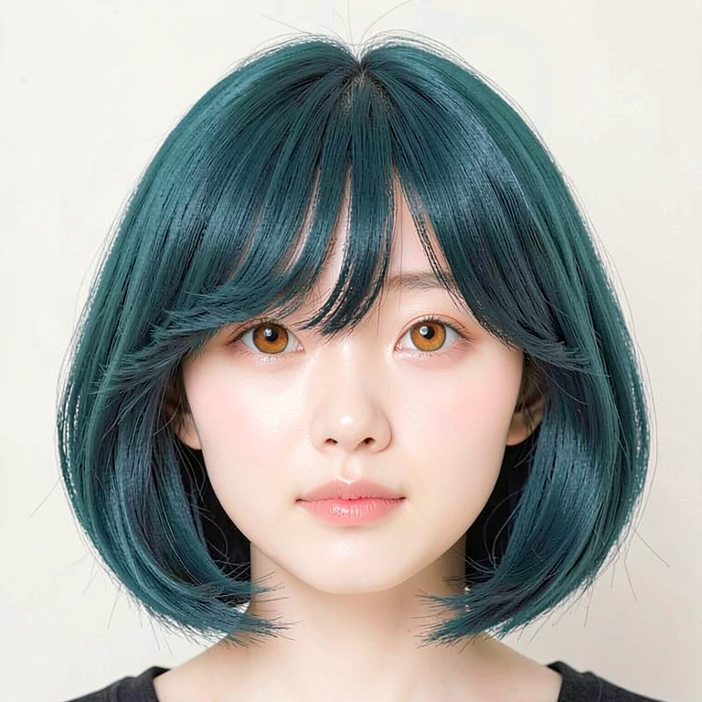

정면 얼굴의 prompt, seed, 출력 크기와 얼굴 회전 identity에 한정한 승인 범위는 로컬 생성 기록으로 확인합니다.

<details id="face-front-no-accessory" class="aibook-lazy-source" data-source="/AiBook/assets/part-07/chapter-05/p7_5_2_generate_face_front_reference.py" data-language="python">
<summary>정면 얼굴 identity 후보를 만드는 코드 보기</summary>
<div class="aibook-lazy-source__body">펼치면 Python 원문을 불러옵니다.</div>
</details>

## 얼굴 회전 identity 기준

정면 얼굴을 앵커로 만든 4패널 턴어라운드 시트를 사람 승인했습니다. 시트는 정면·쿼터뷰·측면·후면의 순서로, 눈에 보이는 홍채의 지름과 동공-홍채 비율, 시선과 코의 방향, 콧대·코끝, 단발의 가르마·앞머리·컬·외곽 실루엣을 함께 대조합니다. 기준 시드는 `62377`이며, 이 승인은 얼굴 회전 identity 범위만 뜻합니다. pose·camera·표정·전신은 별도 생성과 검수가 필요합니다.

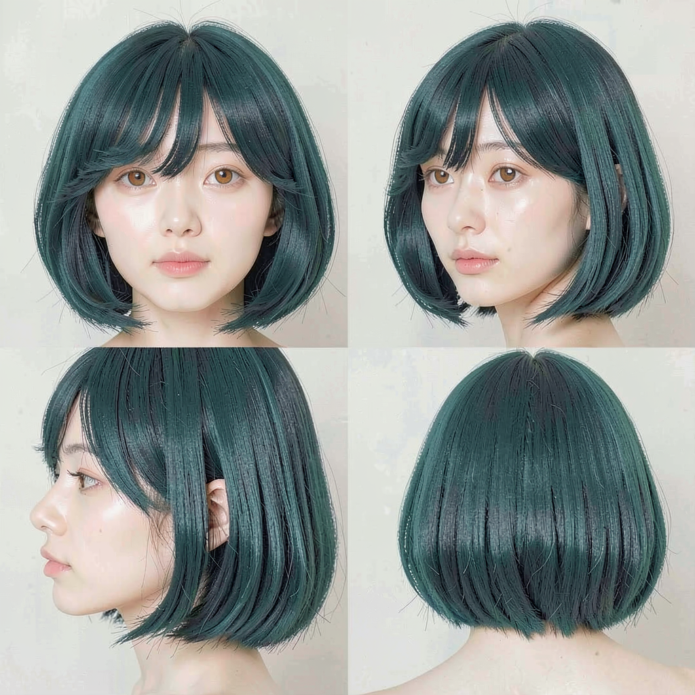

실행 prompt, seed, 패널 순서, 승인 범위는 커밋하지 않는 로컬 생성 기록으로 확인합니다. 이 시트는 사람 검수용 대조물이면서, 기본 전신 방향 생성의 첫 번째 얼굴 참조 이미지입니다.

| 기준 | 현재 상태 | 다음 판정 |
| --- | --- | --- |
| 얼굴 방향 | 정면·쿼터뷰·측면·후면 4패널 시트 승인 | 새 pose·camera 범위는 별도 사람 검수 |
| 얼굴 구성 | 홍채·동공 비율, 시선-코 정렬, 코와 머리 실루엣의 회전 일치 | 전신 방향에서 같은 특징이 유지되는지 대조 |
| 표정 | 승인 표정 없음 | 중립·기쁨·우려·분노·슬픔·놀람을 새로 생성·검수 |

<details id="face-direction-references" class="aibook-lazy-source" data-source="/AiBook/assets/part-07/chapter-05/p7_5_2_generate_face_turnaround_sheet.py" data-language="python">
<summary>정면 얼굴 기준으로 4패널 턴어라운드 후보를 만드는 코드 보기</summary>
<div class="aibook-lazy-source__body">펼치면 Python 원문을 불러옵니다.</div>
</details>

방향 얼굴은 `--views front front_quarter profile rear`로 정면·쿼터뷰·측면·후면을 한 장의 검수 시트에 생성합니다. `--seed-offset`, `--seed-count`, `--seed-step`으로 서로 다른 시드를 한 번의 파이프라인 적재에서 연속 생성하고, 각 PNG와 JSON에는 실행 타임스탬프와 시드가 자동으로 붙습니다. 일부 view만 검토할 때는 `--views profile rear`처럼 범위를 좁힙니다.

### 전신 보강용 CodeFormer 2x identity 입력

자켓·가방을 추가하는 전신 보강 단계에서는, 얼굴 회전 시트의 정면 패널을 `512 x 512` aligned-face 입력으로 분리해 CodeFormer에 전달합니다. `w=1.0`은 입력 충실도를 우선하는 설정이며, 처리 결과를 Lanczos로 `2x` 확대합니다. 이 과정은 화풍을 바꾸거나 새 얼굴을 생성하는 단계가 아니라, 정면 얼굴의 눈·코·입·턱·헤어라인 정보를 더 큰 identity 입력으로 준비하는 단계입니다.

쿼터·측면도 CodeFormer 복원 후보를 만들 수 있지만, 현재 전신 보강 코드가 사용하는 것은 정면 `2x` 패널 하나입니다. 후면에는 보이는 얼굴이 없으므로 CodeFormer를 적용하지 않고 Lanczos 확대만 합니다. 복원 뒤에는 홍채 색·눈 간격·콧대와 코끝·입술 윤곽·턱 실루엣이 원본과 달라지지 않았는지 사람이 먼저 확인합니다. 하나라도 바뀌면 확대 패널을 전신 보강 입력으로 사용하지 않습니다.

사람 검수를 통과한 CodeFormer `w=1.0` 복원·Lanczos `2x` 자산은 아래 세 장입니다. 정면 패널만 현재 전신 보강기의 identity 입력으로 사용하고, 전면 쿼터와 측면은 같은 복원 규칙을 검수하는 비교 기준으로 유지합니다. 후면은 얼굴이 보이지 않아 CodeFormer 승인 자산이 아니라 Lanczos 확대만 한 별도 기록입니다.

| 정면 `2x` | 전면 쿼터 `2x` | 측면 `2x` |
| --- | --- | --- |
| 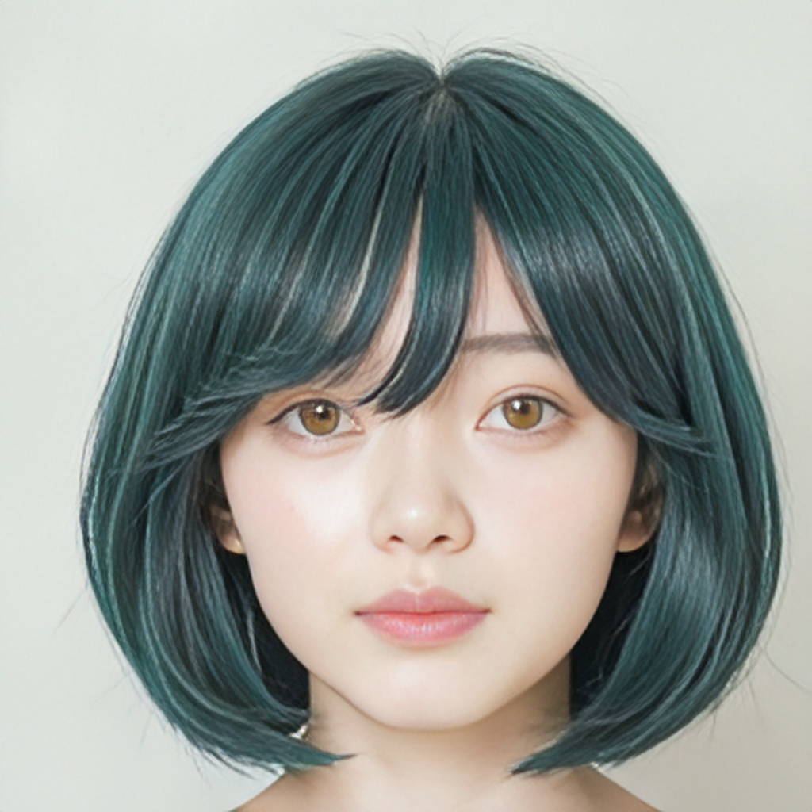 |  | 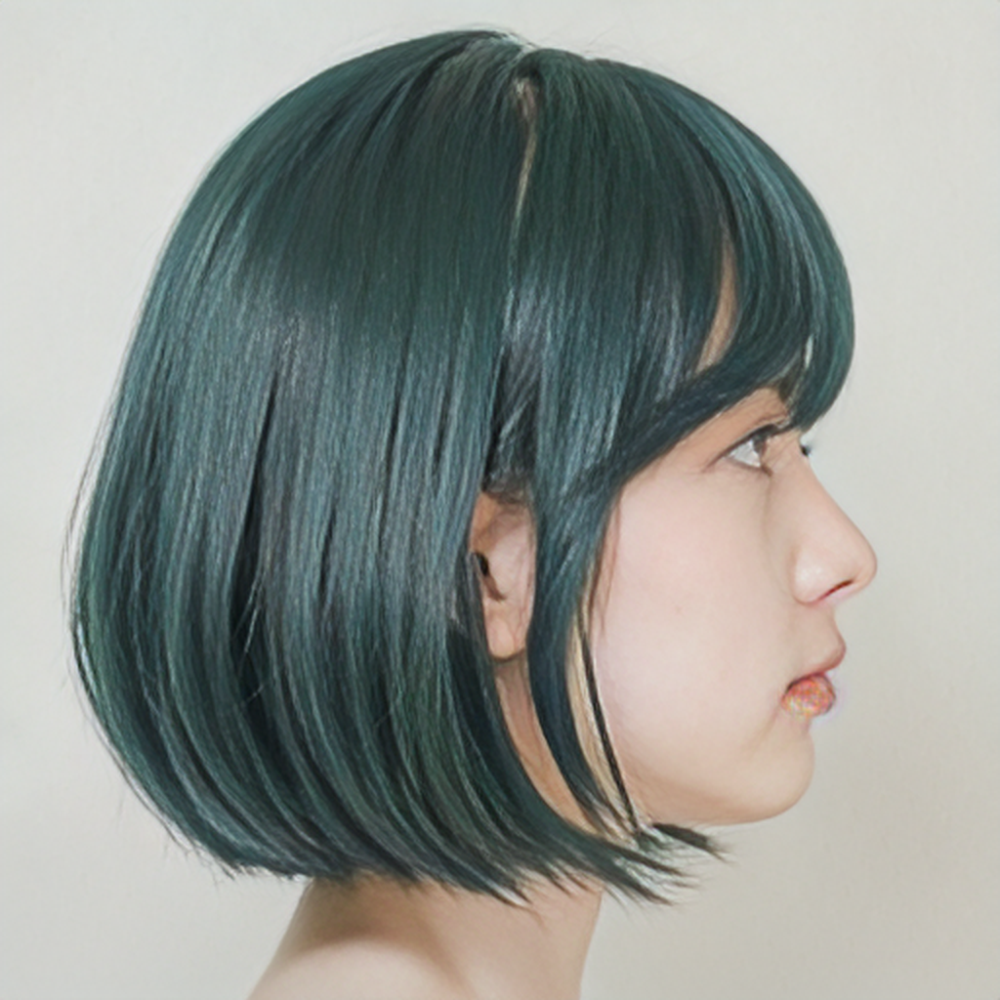 |

<details id="face-turnaround-codeformer" class="aibook-lazy-source" data-source="/AiBook/assets/part-07/chapter-05/p7_5_2_restore_face_turnaround_codeformer.py" data-language="python">
<summary>CodeFormer로 얼굴 회전 시트를 복원·2배 확대하는 코드 보기</summary>
<div class="aibook-lazy-source__body">펼치면 Python 원문을 불러옵니다.</div>
</details>

## 소품 기준 검수 결과: 기본 복장과 확장 소품

소품 기준은 전신 reference에서 작게 보이는 부분을 다시 확인하는 계약입니다. 현재 화풍 입력 없이 사람 승인한 열 항목은 흰 끈 운동화, 흰색 크롭 유틸리티 자켓의 전면·후면 기준, 자켓과 회색 크롭탑을 겹친 전면 레이어 기준, 자켓 밑단 아래에 피부가 보이는 후면 레이어 기준, 가방을 앞에 멘 전면·후면 통합 착장 기준, 청색 우세의 딥틸블루 와이드 팬츠, 짙은 네이비 캔버스 크로스백, 일반 핏 회색 마이크로 크롭탑-허리선 관계입니다. 얼굴 생성에는 이 소품 팩과 분리한 회색 목선 기준만 사용합니다. 머리핀은 캐릭터 기준에서 폐기했습니다. 갈색 홍채·동공은 정면 얼굴 기준을 새로 생성할 때 함께 검수합니다.

정면 전신 후보의 기본 복장은 크롭탑-허리선 관계 기준·바지·신발을 참조합니다. 기존 단일 회색 크롭탑은 얼굴 기준의 목선 확인에 유지합니다. 자켓과 가방은 후속 방향 전신이나 컷신에서 별도 계약이 필요할 때만 선택하는 확장 소품입니다.

| 크롭탑-허리선 관계 기준 | 바지 기준 | 신발 기준 |
| --- | --- | --- |
| 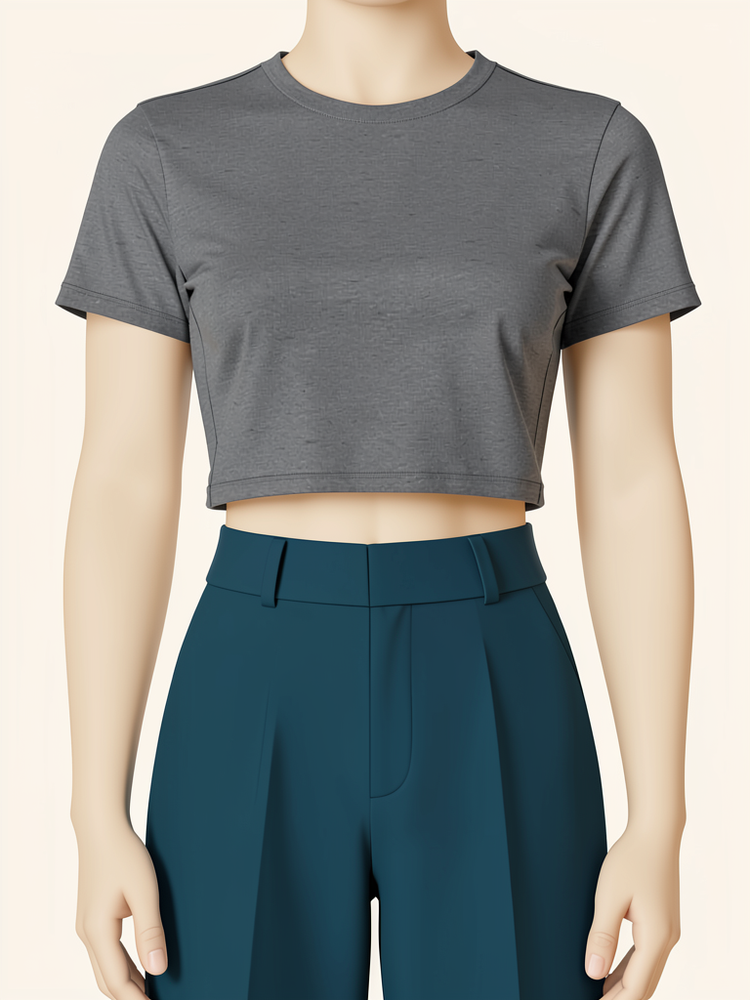 | 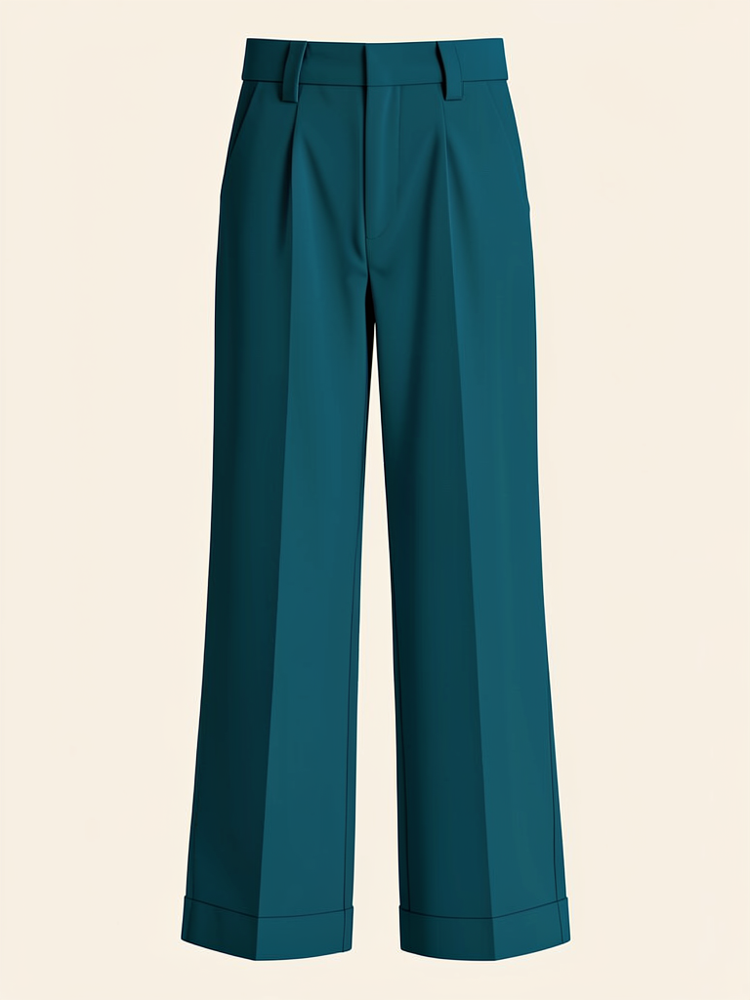 | 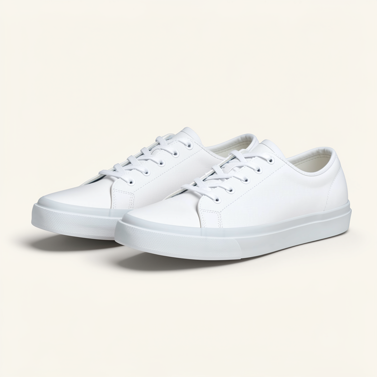 |

| 자켓 전면 기준 | 자켓 후면 기준 | 가방 기준 |
| --- | --- | --- |
| 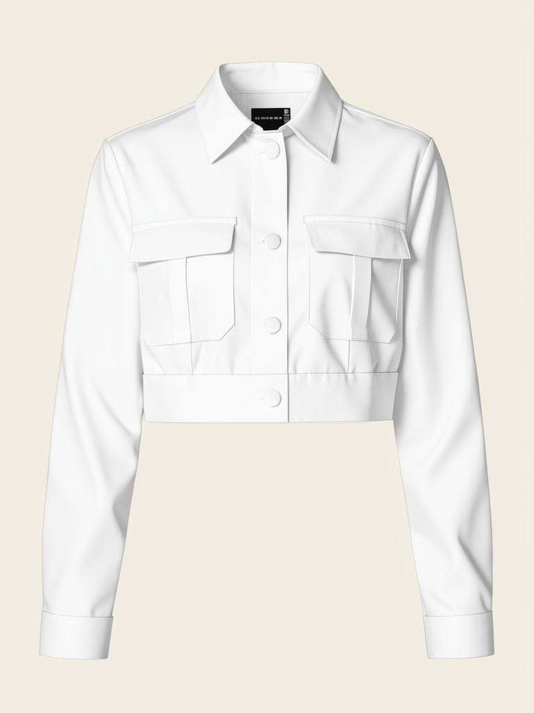 | 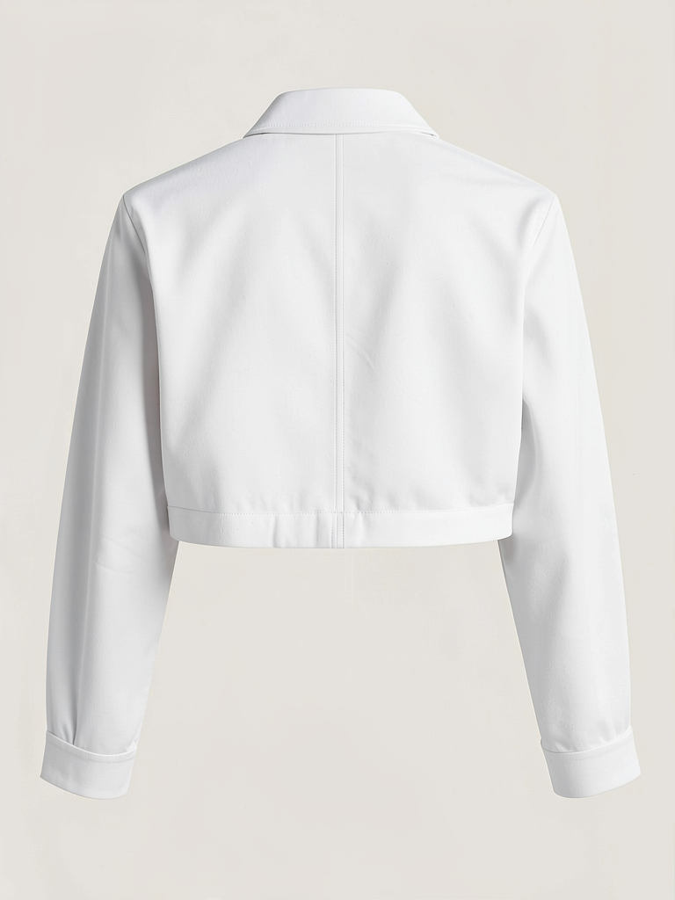 | 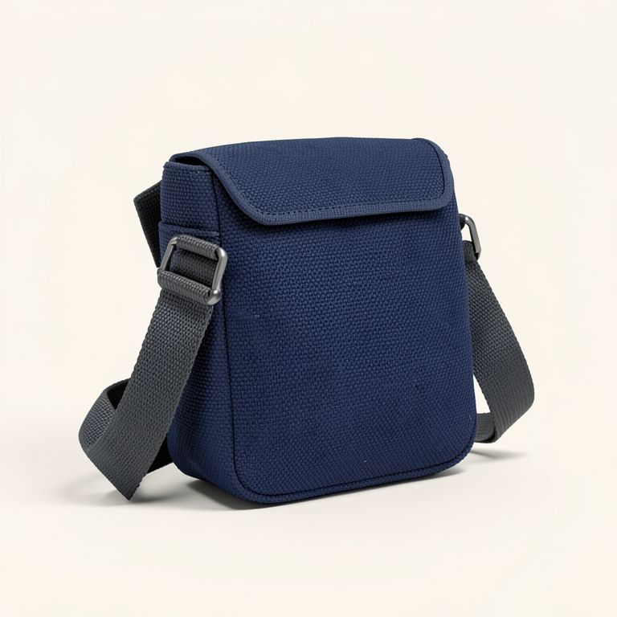 |

| 자켓-크롭탑 전면 레이어 기준 | 자켓-피부 후면 레이어 기준 |
| --- | --- |
| 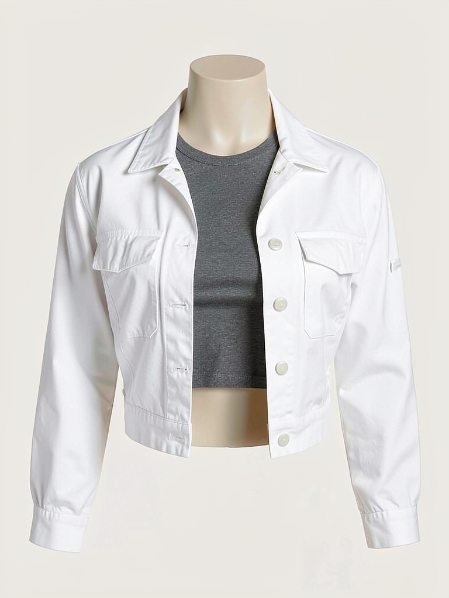 | 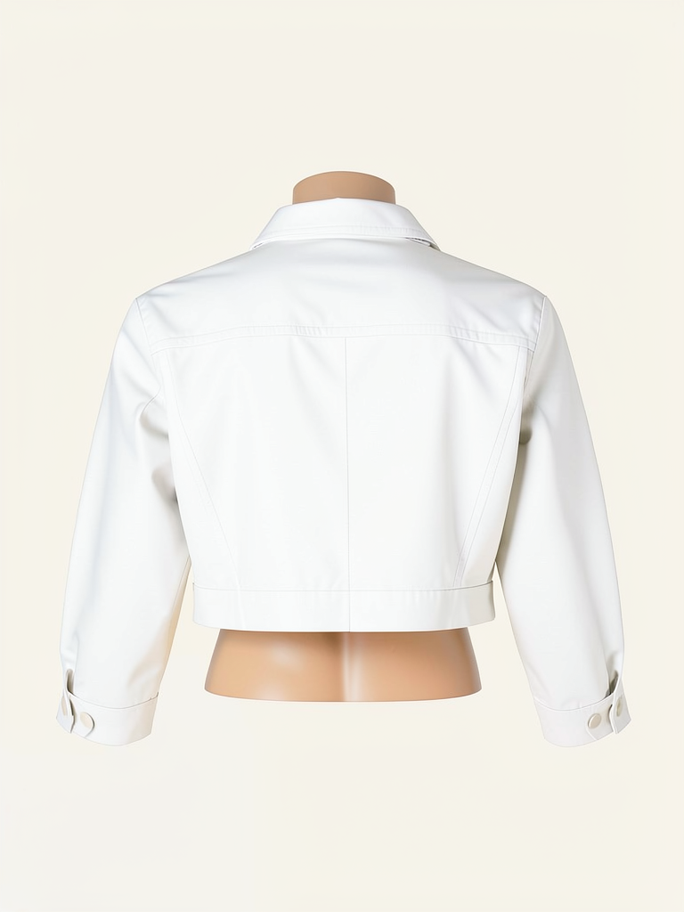 |

| 전면 통합 착장 기준 | 후면 통합 착장 기준 |
| --- | --- |
| 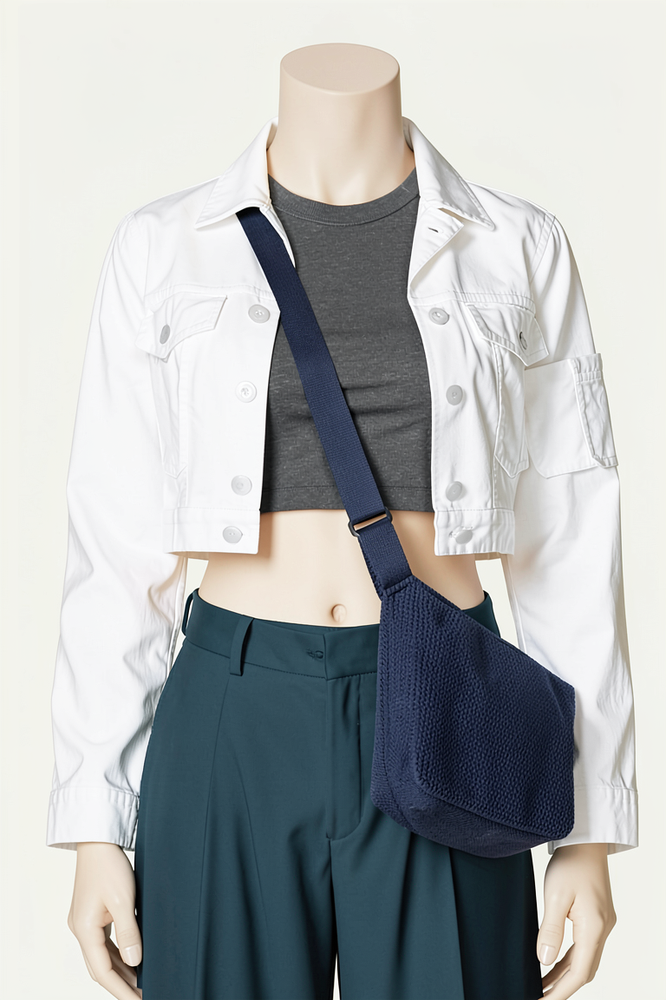 | 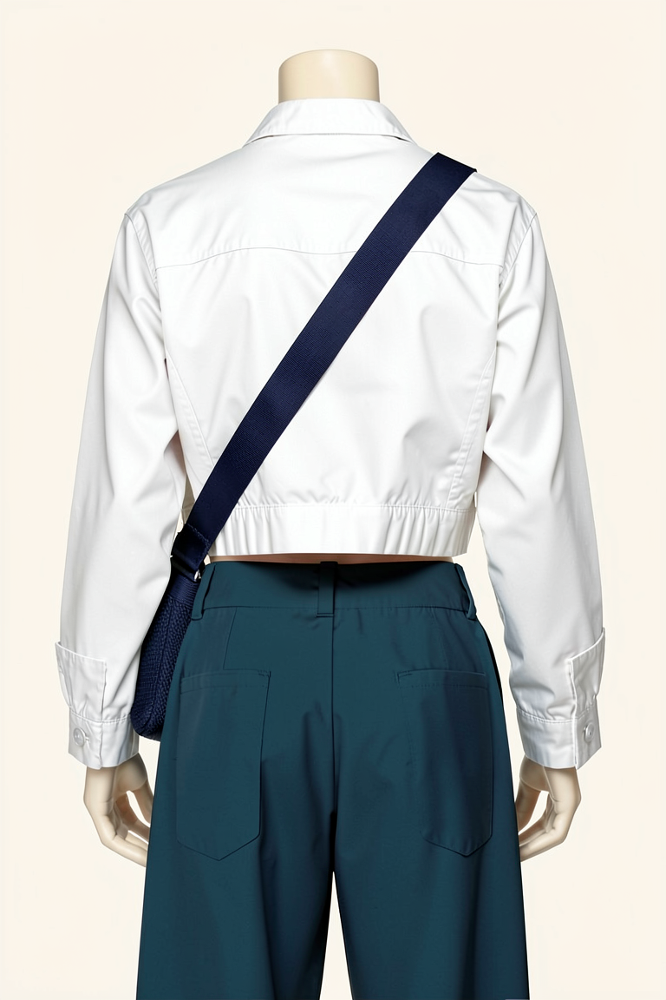 |

[소품 기준 v2 manifest](../../../assets/part-07/chapter-05/p7-5-2-prop-reference-v2.json)은 열 소품의 승인 범위를 기록합니다. 실행·검수 기록은 커밋하지 않는 로컬 생성 기록으로 분리합니다. 손·손목 후보는 아직 기준 자산이 아닙니다.

소품 기준 v2는 전면·후면 자켓과 전면·후면 레이어 기준, 전면·후면 통합 착장 기준을 포함한 개별 소품 PNG 아홉 장과 착장 관계 PNG 한 장입니다. 시트 이미지로 합치지 않으며, 컷에서 필요한 신발·방향에 맞는 자켓-크롭탑 또는 자켓-피부 레이어·바지·가방과 크롭 밑단-허리선 관계만 선택해 비교합니다. 통합 착장 기준은 전면 가방의 위치·스트랩과 후면의 제한된 가방 노출을 한 쌍으로 검수합니다. 이전 화풍 조건 소품과 `prop-master-v1`은 폐기했으며 이후 기준 생성에는 사용하지 않습니다.

<details id="no-style-prop-references" class="aibook-lazy-source" data-source="/AiBook/assets/part-07/chapter-05/p7_5_2_generate_no_style_prop_masters.py" data-language="python">
<summary>선택한 소품 기준 후보를 만드는 통합 코드 보기</summary>
<div class="aibook-lazy-source__body">펼치면 Python 원문을 불러옵니다.</div>
</details>

통합 스크립트는 `--targets` 범위로 `jacket`, `jacket_rear`, `jacket_crop_top_front`, `jacket_crop_top_rear`, `trousers`, `shoes`, `crossbody_bag`, `crop_top_waist_relation` 중 필요한 항목만 생성합니다. 범위를 생략하면 여덟 후보를 모두 생성하고, 각 항목은 호출 순서와 무관한 고정 seed를 사용합니다. `crop_top_waist_relation` 후보는 전신 생성에 필요한 크롭 밑단-허리선 관계를 검수합니다.

`jacket_rear`는 사람 승인한 후면 자켓 기준입니다. 소스에서는 `JACKET_COMMON_CONTRACT`에 high waist 크롭 길이·흰색·카라·긴 소매·짧은 밑단·배경과 금지 대상을 한 번만 정의하고, `JACKET_VIEW_CONTRACTS`에서 전면의 가슴 포켓·앞단추와 후면의 평면 등판·어깨·중심 등 솔기만 나눕니다. 따라서 전면 기준의 포켓·단추를 후면 전신에 잘못 옮기지 않으면서 두 view의 길이와 실루엣을 같은 계약으로 유지합니다. 승인 PNG는 후면 전신 보강의 자켓 입력으로 사용하며, 이후 새 후보를 생성할 때는 다시 별도 사람 검수를 거칩니다.

전신 보강에서 회색 크롭탑이 자켓 몸판을 대체한 결함을 분리하기 위해, `jacket_crop_top_front`와 `jacket_crop_top_rear`로 방향별 torso-only 레이어 기준을 만듭니다. 전면 기준은 열린 자켓과 보이는 상의·밑단 경계를 사람 승인했습니다. 후면에서는 회색 크롭탑이 자켓보다 짧으므로 보이면 안 되며, 자켓 밑단과 바지 허리선 사이의 피부만 보여야 합니다. 회색 상의가 보인 기존 후면 기준은 승인 취소했고, 피부 띠를 보이는 새 후면 기준을 사람 승인했습니다. 전신 보강은 승인 전면·후면 레이어를 방향별로 사용하며, 소매만 남거나 자켓·상의가 한 벌처럼 합쳐지는 출력은 폐기합니다.

`complete_outfit_front_hip`과 `complete_outfit_rear_hip`은 가방을 앞에 멨을 때의 한 쌍의 통합 착장 기준입니다. 전면에서는 오른쪽 어깨에서 왼쪽 외측 골반으로 이어지는 스트랩과 가방 본체를, 후면에서는 긴 소매의 흰 자켓 등판 위 스트랩과 왼쪽 외곽의 작은 네이비 가방 모서리만 확인합니다. 두 PNG는 전신 보강에서 통합 착장 입력을 사용할 때의 방향별 계약이며, 새 전신 출력은 별도 사람 검수를 거쳐야 합니다.

```bash
PYTORCH_CUDA_ALLOC_CONF=expandable_segments:True \
  .venv/bin/python docs/assets/part-07/chapter-05/p7_5_2_generate_no_style_prop_masters.py \
  --targets jacket_crop_top_front jacket_crop_top_rear
```

## 방향별 전신 기준

얼굴 턴어라운드와 회색 크롭탑·바지·신발 소품을 입력으로 정면·전면 쿼터·측면·후면을 같은 실행에서 개별 생성해 기본 전신 기준을 사람 승인했습니다. 네 방향은 자연스러운 신체비율, 전신 프레이밍, 기본 복장·신발, 청록 단발의 연속성까지만 승인합니다. 이후 자켓·가방을 더한 보강 출력도 네 방향 모두 추가 승인했습니다. 측면은 전면·후면 통합 착장 기준을 함께 참조해 흰색 크롭 재킷의 몸판·소매·옆등판을 고정했습니다. 등신 수치 지시는 단일 생성에서 안정적인 제어가 되지 않아 prompt에 넣지 않으며, 실제 비율은 사람 검수로 확인합니다. 입력·seed·prompt와 사람 판정은 커밋하지 않는 로컬 생성 기록으로 확인합니다. 표정·동작·camera 변화·컷신은 별도 생성·검수가 필요하므로 이 범위로 확대 해석하지 않습니다.

| 정면 | 전면 쿼터 |
| --- | --- |
| 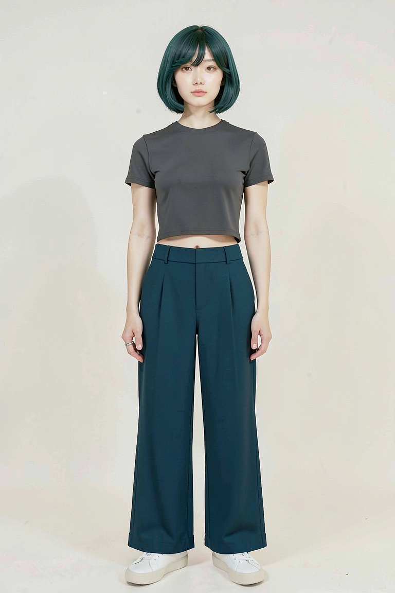 | 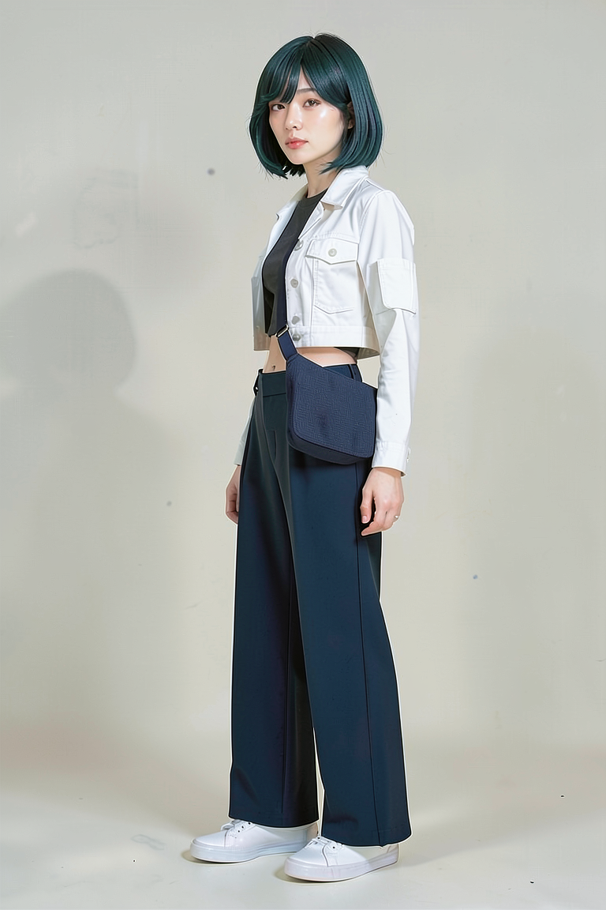 |

| 측면 | 후면 |
| --- | --- |
| 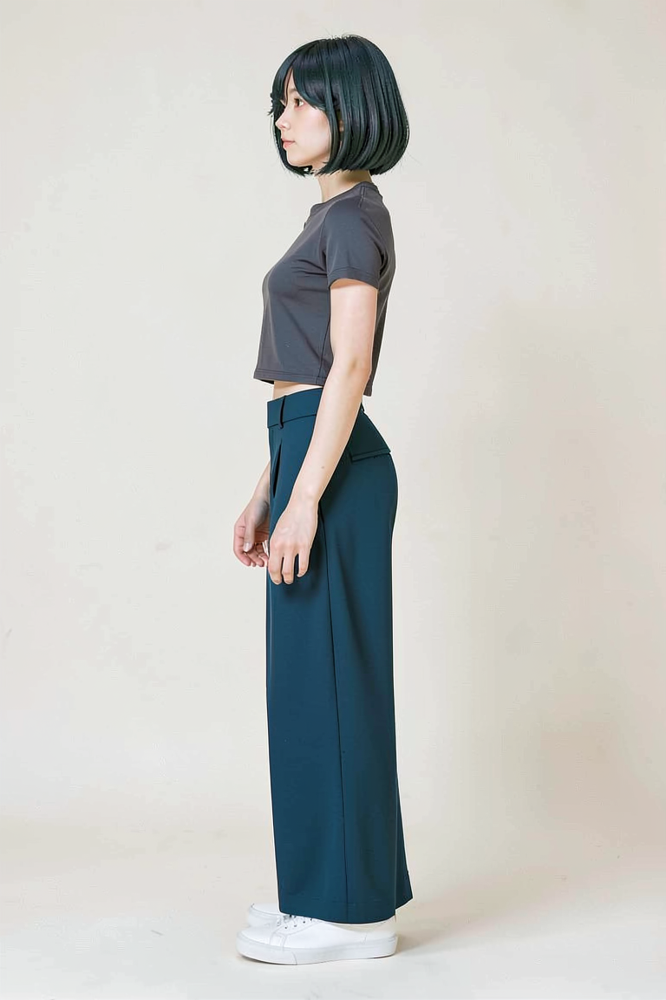 | 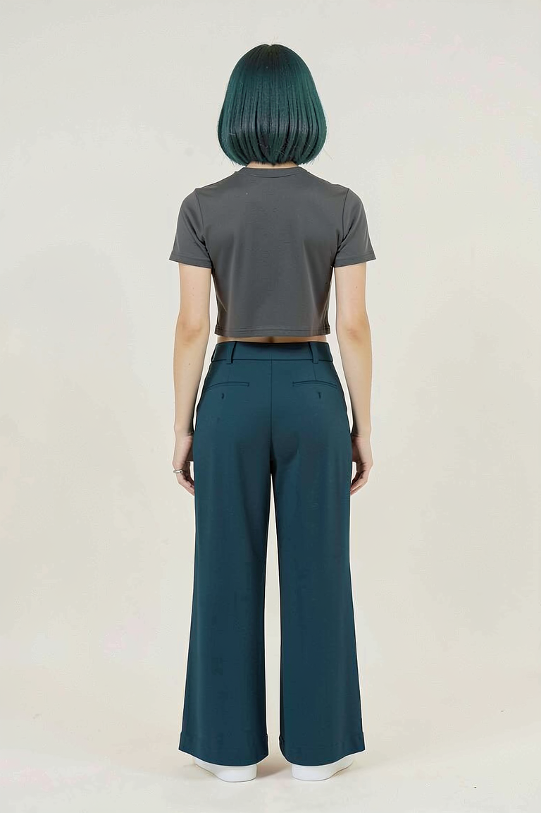 |

`--views front front_quarter profile rear`는 네 방향을 같은 입력 순서와 시드에서 차례대로 생성하지만, 각 방향은 별도 PNG로 저장합니다. 네 승인 PNG는 신발의 짝과 형태, 팔 가림, 얼굴·몸·발 방향의 일치까지 사람 검수를 통과했습니다. 승인 PNG만 생성 모델이 아닌 조합 단계에서 검수 시트로 배열합니다.

<details id="fullbody-turnaround-references" class="aibook-lazy-source" data-source="/AiBook/assets/part-07/chapter-05/p7_5_2_generate_fullbody_turnaround_references.py" data-language="python">
<summary>얼굴 턴어라운드와 소품으로 방향별 전신 PNG를 만드는 코드 보기</summary>
<div class="aibook-lazy-source__body">펼치면 Python 원문을 불러옵니다.</div>
</details>

## 전신 기준의 얼굴·소품 보강

이 단계는 승인된 방향 전신 PNG를 다시 그리는 보강 실험입니다. 입력 순서는 CodeFormer로 복원·2배 확대한 정면 얼굴 패널, 해당 방향의 전신 기준, 흰색 크롭 유틸리티 자켓과 회색 크롭탑을 이미 겹쳐 입은 레이어 기준, 짙은 네이비 캔버스 크로스백입니다. 레이어 기준은 정면·전면 쿼터에서는 승인된 전면 자켓-크롭탑 기준을 사용하고, 후면에서는 피부 띠만 남기는 승인 후면 기준을 별도로 사용합니다. 측면에서는 전면·후면 통합 착장 기준을 함께 입력해 재킷 몸판을 고정합니다. 확대 얼굴 패널은 얼굴형·눈·코·피부·헤어라인과 청록 단발을 고정하는 identity 앵커이고, 전신 기준은 전신 프레이밍·방향·기본 복장을 고정하는 composition 앵커입니다. 레이어 기준과 가방은 추가 소품일 뿐 전신 기준을 자동으로 대체하지 않습니다. 통합 실행으로 만든 정면·전면 쿼터·측면·후면 보강 출력은 사람 승인해 각각의 전신 기준으로 대체했습니다.

후면에서는 정면 얼굴을 보이게 만들지 않고, 자켓-크롭탑 레이어와 가방의 형태·스트랩·몸 방향을 검수합니다. 정면·전면 쿼터·측면에서는 얼굴 identity, 자켓의 짧은 밑단 아래에 남는 회색 상의 경계, 가방 본체와 전체 스트랩을 함께 확인합니다. 측면에는 자켓의 외곽·소매·옆/후면 패널을, 후면에는 회색 상의 대신 자켓 밑단과 바지 허리선 사이에 피부가 보이는 흰 등판·소매·짧은 밑단을 방향 전용 prompt로 보강합니다. 가방은 이 레이어 외곽을 대체하지 않아야 하며, 후면에서는 스트랩이 자켓 등판을 대각선으로 지나야 합니다. 얼굴·방향·전신 프레이밍·소품 geometry 중 하나라도 흔들리면 후보를 폐기하며, 기본 전신 기준은 유지합니다.

<details id="fullbody-face-prop-refinement" class="aibook-lazy-source" data-source="/AiBook/assets/part-07/chapter-05/p7_5_2_refine_fullbody_face_props.py" data-language="python">
<summary>정면 얼굴·전신 방향·자켓·가방으로 전신을 보강하는 코드 보기</summary>
<div class="aibook-lazy-source__body">펼치면 Python 원문을 불러옵니다.</div>
</details>

## 생성 코드와 사람 승인을 분리한다

기준 이미지를 만드는 소스는 정면 얼굴, 방향 얼굴, 소품, 방향 전신, 전신 얼굴·소품 보강의 다섯 개입니다. 정면 전신은 방향 전신 생성기의 `front` 범위로 만들며, 표정 생성기는 현재 승인 기준 체인에 포함하지 않습니다. 후보 PNG가 생성됐다는 사실은 새 pose·camera·컷신 입력 승인이 아닙니다. 코드를 실행하기 전에는 FLUX.2 가중치, CUDA 환경, 충분한 CPU RAM과 disk cache가 필요합니다.

| 생성 범위 | 소스 | 범위 옵션 |
| --- | --- | --- |
| 정면 얼굴 | `p7_5_2_generate_face_front_reference.py` | 없음 |
| 방향 얼굴 | `p7_5_2_generate_face_turnaround_sheet.py` | `--views` |
| 소품 기준 | `p7_5_2_generate_no_style_prop_masters.py` | `--targets` |
| 방향 전신 | `p7_5_2_generate_fullbody_turnaround_references.py` | `--views` |
| 전신 얼굴·소품 보강 | `p7_5_2_refine_fullbody_face_props.py` | `--views`, `--props` |

이 목록 밖의 옛 얼굴·신체 detail 실험 소스와 다단계 회전 구성기는 유지하지 않습니다. 기준 이미지는 다섯 생성기의 후보를 사람 검수해 편입하며, 검수 JSON은 생성기 수를 늘리지 않는 기록입니다. 다섯 생성기의 실행 JSON은 각 결과의 원문 prompt와 `prompt_word_count`를 함께 기록합니다. 이 수치는 품질을 판정하는 점수가 아니라, 방향·소품·전신 계약이 반복 설명으로 비대해졌는지 검토하는 보조 지표입니다.

| 생성기 | 하는 일 | 조작할 값 |
| --- | --- | --- |
| 정면 얼굴 | prompt만으로 얼굴 identity 후보 생성 | 얼굴 prompt, `SEED` |
| 방향 얼굴 | 정면 얼굴 기준에서 여러 방향 얼굴 후보 생성 | `--views`, 방향 전용 prompt |
| 소품 기준 | 지정한 소품 후보 생성 | `--targets` |
| 방향 전신 | 방향별 독립 PNG를 생성해 전신 프레이밍·방향·복장을 검수 | `--views`, seed, 방향 규칙 |
| 전신 얼굴·소품 보강 | 정면 얼굴 identity와 자켓·가방을 방향 전신에 추가 | `--views`, `--props`, seed |

```bash
PYTORCH_CUDA_ALLOC_CONF=expandable_segments:True \
  .venv/bin/python docs/assets/part-07/chapter-05/p7_5_2_generate_fullbody_turnaround_references.py \
  --views front front_quarter profile rear
```

각 PNG는 실행 기록을 위한 후보이며, 사람 검수 전에는 기준 자산이 아닙니다. 이 실습에서 seed나 방향 계약을 바꾼 뒤에는 코드를 통과한 것으로 승인하지 않습니다. 얼굴·몸·무릎·발끝의 방향이 같은지, 측면에서 먼쪽 팔이 몸통 뒤에 가려지는지, 두 다리와 두 발이 하나의 전신으로 보이는지를 사람 검수로 다시 확인합니다.

```bash
PYTORCH_CUDA_ALLOC_CONF=expandable_segments:True \
  .venv/bin/python docs/assets/part-07/chapter-05/p7_5_2_refine_fullbody_face_props.py \
  --views front front_quarter profile rear \
  --props layered_jacket_crop_top crossbody_bag
```

## manifest는 사용 범위를 좁히는 계약이다

정면·전면 쿼터·측면·후면 전신은 사람 검수를 통과해 실행·승인 기록에 등록했습니다. 동작, camera yaw, 컷신용 캐릭터 참조 팩은 여전히 비어 있으며 별도 검수가 필요합니다. 아래 앨리웁 예제는 최종 가늠용 승인 PNG로만 보관하고 manifest 입력에는 넣지 않습니다.

정면·전면 쿼터·측면·후면의 얼굴·자켓·가방 보강 출력은 사람 승인을 거쳐 각 전신 기준에 반영했습니다.

화풍을 직접 조건으로 받은 캐릭터 팩도 다른 후보와 마찬가지로 review-only 상태에서 보관합니다. 배경 원본의 선·색층을 인물로 옮긴 결과가 얼굴·소품·비례 기준을 흐리지 않는지 사람 검수를 통과한 개별 PNG만 P7-5.2 manifest에 넣을 수 있습니다. 캐릭터 색은 중립 studio 조명에서 정하고, 장면의 야간·노을·비 반사광이 피부나 머리카락 기본색을 다시 정하지 않도록 다음 단계에서 검증합니다.

## 최종 가늠: 웹툰 렌더링 앨리웁

아래 예제는 P7-5.2의 승인 기준이 동작과 camera 변화에서도 유지되는지 살피는 마지막 가늠 테스트입니다. 입력에는 CodeFormer 정면 얼굴 `2x` 패널, 정면·전면 쿼터·측면·후면 전신 기준 네 장, 그리고 P7-5.1 승인 원본 중 [저각도 주택가 수채화 원본](../../../assets/part-07/chapter-05/p7-5-1-style-residential-sunset-low-angle-local-gpu-v1.png) 한 장만 넣습니다. 화풍 원본은 선·색층·물감 번짐만 위한 입력이며, 원본의 인물·장소·구도는 복사하지 않습니다. 앨리웁 패스는 공의 릴리스와 림의 분리, 도약 다리, 저각도 원근을 함께 검수할 수 있어 수비 자세보다 더 강한 동작 시험이 됩니다.

<details id="dynamic-alley-oop-style-test" class="aibook-lazy-source" data-source="/AiBook/assets/part-07/chapter-05/p7_5_2_generate_dynamic_alley_oop_style_test.py" data-language="python">
<summary>전신 기준과 화풍 원본으로 앨리웁 후보를 만드는 코드 보기</summary>
<div class="aibook-lazy-source__body">펼치면 Python 원문을 불러옵니다.</div>
</details>

`--seed-offset`은 시작 시드를, `--seed-count`는 이어서 만들 후보 수를 정합니다. `--steps`는 속도와 detail의 교환을 시험하는 조작 변수입니다. 실행 JSON에는 실제 prompt, 입력 순서, seed, batch index, steps를 기록합니다. 아래 명령은 승인된 기준 시드 `62380`을 한 장으로 재현합니다.

```bash
PYTORCH_CUDA_ALLOC_CONF=expandable_segments:True \
  .venv/bin/python docs/assets/part-07/chapter-05/p7_5_2_generate_dynamic_alley_oop_style_test.py \
  --seed-offset 0 --seed-count 1 --steps 12
```

```text
Same woman from the supplied references, full body. Rooftop half court, airborne after an alley-oop pass: her right arm reaches up; one basketball has left her fingertips and arcs high. Left arm balances, left knee leads, right leg trails. Exactly one small hoop and backboard sit far behind her, well separated from the ball. Low front-left 24 mm camera, modest Dutch tilt, diagonal frame. Use crisp tapered charcoal contours, clean opaque color planes, and controlled cel shadows; keep watercolor pooling only as subtle edge texture. One woman, one ball, one hoop, no text, border, or panels.
```

이 프롬프트는 동작·카메라·화풍을 한 번에 바꾸므로 기준 PNG를 대체하는 용도가 아닙니다. 얼굴·머리·착장·가방 스트랩의 연속성, 손·발의 수, 오른손 공 릴리스와 포물선, 공과 림 사이의 열린 코트 공간, 도약 다리·몸통·무릎·발끝의 방향, 저각도 원근과 전신 프레이밍, 가변 선 굵기·면 채색·셀 음영과 제한된 수채 질감의 균형, 화풍 원본을 복사하지 않았는지를 모두 사람 검수합니다.

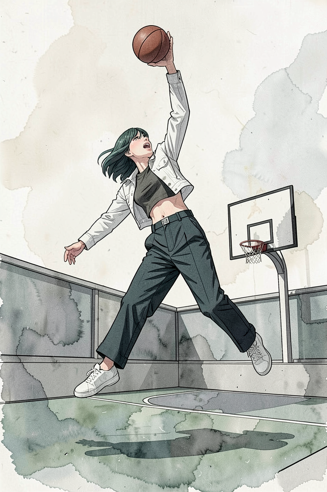

이 컷은 P7-5.2의 얼굴·전신·소품 기준이 하나의 역동적 장면에서도 읽히는지를 가늠하기 위한 승인 예제입니다. 이 결과만으로 pose 제어, camera 제어, 컷신 연속성까지 승인하지 않으며, P7-5.3의 scene·pose·camera 계약과 P7-5.4의 연속성 보정은 별도로 검수합니다.

## 캐릭터셋 체크리스트

이 체크리스트는 참조 셋의 구조 점검 항목을 유지합니다. 모든 원본은 로컬 GPU 실행 기록을 가져야 하며, 현재 승인된 범위는 정면·방향 얼굴, 기본 소품, 정면·전면 쿼터·측면·후면 전신입니다. 19장 기준·16장 train·4장 held-out 구조는 동작과 장면을 포함한 별도 local-only 팩을 만든 뒤에만 다시 판정합니다.

| 확인할 것 | 스스로 답할 질문 |
| --- | --- |
| 등록 | 전신 기준, train, held-out으로 등록하는 모든 단일 PNG가 local GPU 실행 기록과 manifest에 있는가? |
| 분리 | held-out 원본이 train source ID·장소·camera와 겹치지 않는가? |
| 비례 | 중립 정면 계열은 4%, 동작은 15% 기준을 적용하고, 측면·후면은 사람 검수로 구분했는가? |
| 비교 | 같은 scene·camera·seed에서 학습 또는 reference 조건 하나만 바꿔 비교했는가? |
| 품질 | 얼굴, 머리, 의상, 신발, 화풍을 각각 판정했고 기본색이 장면 광원 때문에 바뀌지 않았는가? |
| 전체 컷 | reference·pose·camera를 한 화면에서 통과시킨 뒤에만 bag/strap 국소 보정을 검토하는가? |
| 생성 출처 | 기준과 view 원본 모두 외부 생성 서비스가 아니라 로컬 GPU로 생성됐는가? |
| 좌우 view | mirror를 쓴 view가 무소품·대칭 계약 안에만 있는가? |
| 다음 단계 | P7-5.1과 P7-5.2의 manifest가 각각 허용한 개별 원본만 다음 단계에 넘기는가? |

## 출처와 참고 자료

- Black Forest Labs, [FLUX.2 Klein 4B model card](https://huggingface.co/black-forest-labs/FLUX.2-klein-4B){: target="_blank" rel="noopener noreferrer" }, 확인일: 2026-08-03.
- Hugging Face, [Diffusers FLUX.2 Klein pipeline](https://huggingface.co/docs/diffusers/main/en/api/pipelines/flux2_klein){: target="_blank" rel="noopener noreferrer" }, 확인일: 2026-08-03.
- Shangchen Zhou et al., [CodeFormer 공식 구현](https://github.com/sczhou/CodeFormer){: target="_blank" rel="noopener noreferrer" }, `w`는 quality-fidelity trade-off 설정이며 사용 전 모델·체크포인트 라이선스를 확인한다. 확인일: 2026-08-06.
