# P7-5.2 Mira 정면 머리 기준 만들기

> Section ID: `P7-5.2`
> Version: `v2026.09.04`

같은 인물을 다음 단계에서 다시 사용할 때는 먼저 얼굴·머리 기준을 한 장으로 고정한다. 이 절은 캐릭터 **Mira**의 정면 머리 기준을 text-to-image로 생성하고, 이후 카메라 각도 실험에서 쓸 입력·실행 조건을 정리한다. 전신·착장·자세는 [P7-5.3](section-03.md) 이후의 별도 작업이다.

## Mira identity 계약을 먼저 고정한다

Mira는 매우 밝은 피치 피부, 부드러운 타원형 얼굴과 V자 턱선, 호박빛이 섞인 갈색 홍채, 짙은 petrol-teal의 볼륨 있는 턱 길이 단발을 가진 성인 여성 캐릭터다. [Mira identity 계약 JSON](../../../assets/part-07/chapter-05/p7-5-2-mira-identity-contract.json)은 얼굴·헤어·기본 착장만 정의하며, 자세·카메라·장면·출력 품질은 정의하지 않는다.

| 계약 필드 | Mira에 고정하는 정보 | 이 절에서 맡기지 않는 정보 |
| --- | --- | --- |
| `identity_description` | 피부색, 얼굴형, 코·입·눈 비율, 호박빛 갈색 홍채, 앞머리와 단발 실루엣 | 포즈, 카메라 방향, 전신 비례 |
| `rear_hair_identity` | 뒷머리 실루엣, 목덜미 헤어라인, 머리색 | 새로운 헤어스타일 생성 |
| `outfit_identity_description` | 후속 전신 작업에서 사용할 기본 착장 설명 | 옷의 가림 관계와 손·팔다리 형태 |
| `inner_top_identity` | 후속 착장 작업에서 사용할 이너탑의 색·핏·기장 | 헤어 색이나 카메라 변화 |

## BF16 정면 머리 생성

정면 머리 T2I 생성은 공식 `Qwen/Qwen-Image` BF16 가중치를 `sequential CPU offload`로 직접 호출한다. ComfyUI 서버·포트·HTTP 워크플로와 참조 이미지는 사용하지 않는다. 1280px·30 step 로컬 실행은 8GB GPU에서 완료됐지만, 생성 중 GPU 여유가 작으므로 다른 GPU 작업과 병행하지 않는다.


[정면 얼굴 result.json — T2I 입력 조건과 출력 기록](../../../assets/part-07/chapter-05/p7-5-2-mira-head-qwen-image-bf16-front-v1-code-63ece7-seed-62294-steps-30-size-1280-result.json)

[정면 얼굴 T2I Python 생성기](../../../assets/part-07/chapter-05/p7_5_2_generate_mira_head_bf16.py)

생성기는 얼굴 일러스트 계약과 Mira identity 계약을 결합한 prompt, BF16·오프로딩 조건, seed·step·CFG, 완성 PNG의 해시를 result JSON에 기록한다.

```python
pipeline = QwenImagePipeline.from_pretrained(
    model_path, torch_dtype=torch.bfloat16, local_files_only=True
)
pipeline.enable_sequential_cpu_offload()
image = pipeline(
    prompt=prompt,
    generator=torch.Generator("cpu").manual_seed(args.seed),
    true_cfg_scale=args.cfg,
    num_inference_steps=args.steps,
    width=args.size,
    height=args.size,
).images[0]
```

기본값은 1280px·30 step·CFG 4.0이다. `--steps`, `--size`, `--cfg`를 바꿀 때는 결과에서 단순한 해상도 차이만 보지 말고, 정수리 여백·양쪽 눈·귀 노출·홍채색·단발 실루엣이 유지되는지 함께 확인한다.

[Mira identity 계약 JSON](../../../assets/part-07/chapter-05/p7-5-2-mira-identity-contract.json)

[얼굴 화풍 계약](../../../assets/part-07/chapter-05/p7-5-2-face-style-prompt-contract.json)

[일러스트 계약](../../../assets/part-07/chapter-05/p7-5-2-face-illustration-prompt-contract.json)

## 상반신 기준에서 15방향 카메라 참조를 만든다

정면 머리 기준만 회전시키면 어깨와 이너탑을 새로 추측해야 한다. 그래서 정면 머리를 참조해 회색 이너탑과 어깨가 보이는 상반신 기준 한 장을 먼저 만들고, 그 이미지만 `Picture 1`로 넣어 카메라 조건을 바꿨다. 이 단계는 새 포즈나 새 착장을 만드는 단계가 아니라, 이후 캐릭터 시트에서 비교할 **카메라 참조 묶음**을 만드는 단계다.


[정면 상반신 기준 result JSON](../../../assets/part-07/chapter-05/p7-5-2-qwen-2511-mira-torso-front-p7-5-4-direct-v1-size-1280x1280-seed-62294-steps-30-result.json)

`Qwen/Qwen-Image-Edit-2511`에 Multiple-Angles LoRA와 Lightning 4-step LoRA를 함께 적용했다. 카메라 prompt는 `<sks> [azimuth] [elevation] [distance]` 순서만 사용하고, 각 결과는 `640×640`, seed `62294`, 4 step으로 생성했다. 이 저비용 조건에서는 Lightning이 없던 앞선 표준 경로에서 좌우 쿼터뷰가 정면으로 겹쳤고, Lightning 4-step 경로에서는 좌우 방향과 수직 시점이 분리됐다. 이 관찰은 현재의 직접 Diffusers 실행 경로에 한정한다.

[상반신 15방향 Python 생성기](../../../assets/part-07/chapter-05/p7_5_2_qwen_edit_2511_generate_mira_torso_multiview.py)

생성기에서 `--sampling-profile lightning4 --size 640 --steps 4`를 저비용 실험 조건으로 선택한다. `--yaw`와 `--vertical`을 반복 지정하면 필요한 카메라 조합만 만들 수 있고, 이미 생성한 방향은 `--exclude vertical:yaw`로 건너뛴다. 이 실행기는 출력 `height`와 `width`를 명시하므로, 파일 이름과 실제 PNG 크기가 다르게 기록되지 않는다.

[아이레벨 −45도 result JSON](../../../assets/part-07/chapter-05/p7-5-2-qwen-2511-mira-torso-multiview-vertical-level-yaw-minus-45-lowcost-v2-size-640x640-seed-62294-steps-4-result.json)

[아이레벨 +45도 result JSON](../../../assets/part-07/chapter-05/p7-5-2-qwen-2511-mira-torso-multiview-vertical-level-yaw-plus-45-lowcost-v2-size-640x640-seed-62294-steps-4-result.json)

[나머지 13개 방향 batch result JSON](../../../assets/part-07/chapter-05/p7-5-2-qwen-2511-mira-torso-multiview-lowcost-v2-size-640x640-seed-62294-steps-4-batch-result.json)

| 로우앵글 `−90°` | 로우앵글 `−45°` | 로우앵글 `0°` | 로우앵글 `+45°` | 로우앵글 `+90°` |
| --- | --- | --- | --- | --- |
| 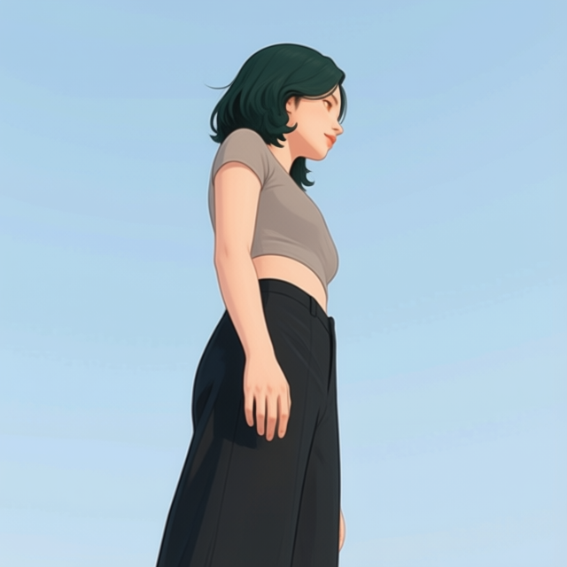 | 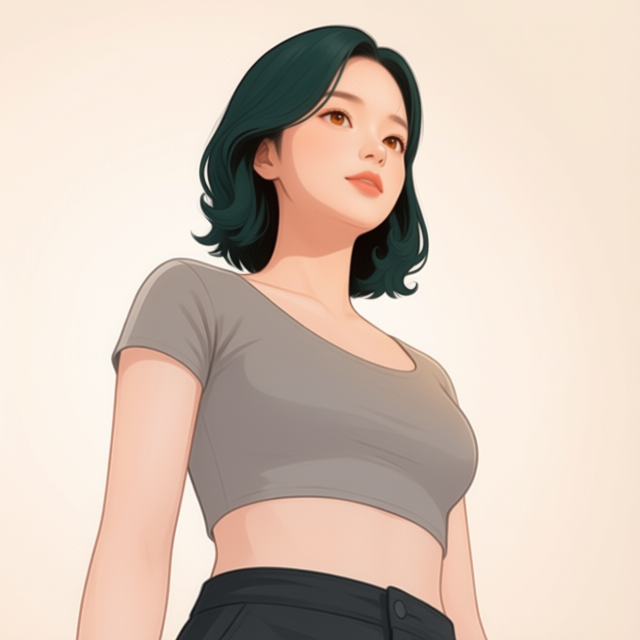 | 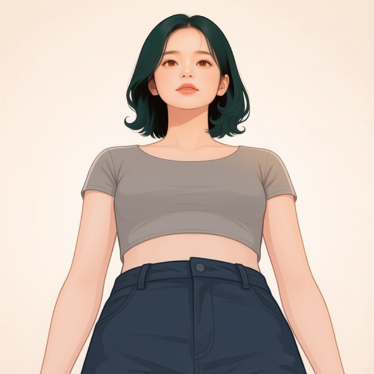 | 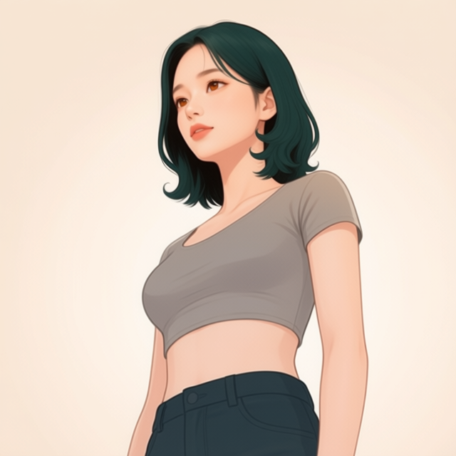 | 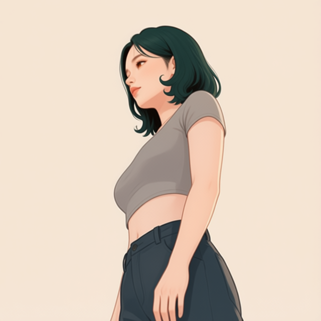 |

| 아이레벨 `−90°` | 아이레벨 `−45°` | 아이레벨 `0°` | 아이레벨 `+45°` | 아이레벨 `+90°` |
| --- | --- | --- | --- | --- |
| 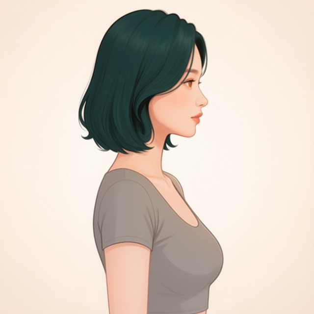 | 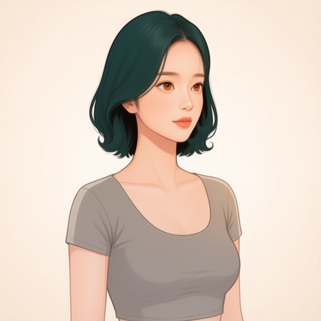 | 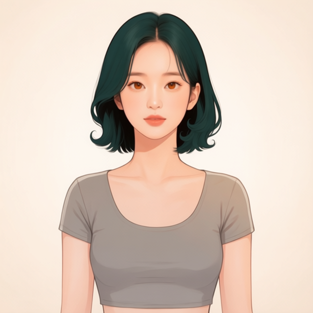 | 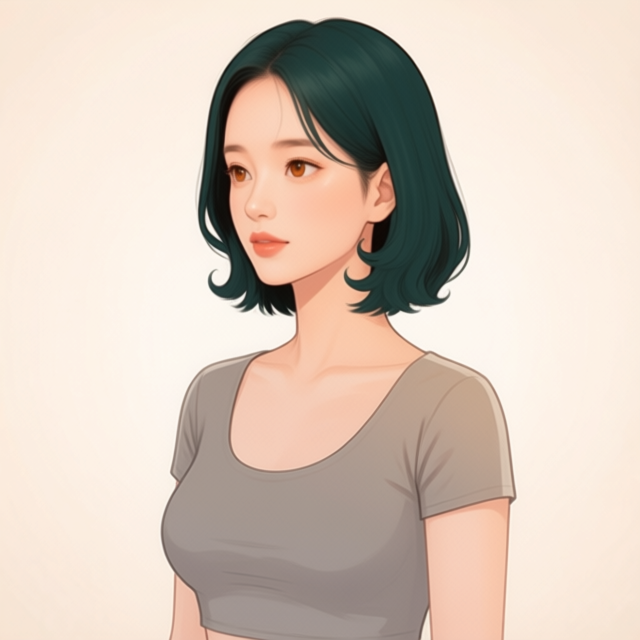 | 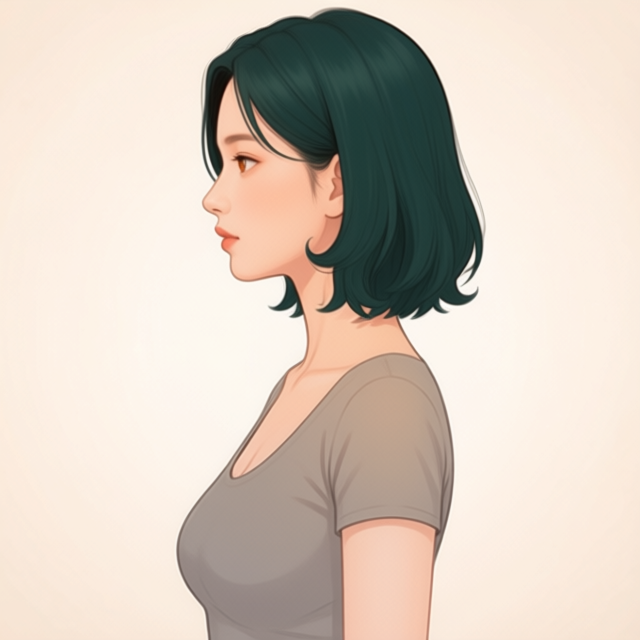 |

| 엘리베이티드 `−90°` | 엘리베이티드 `−45°` | 엘리베이티드 `0°` | 엘리베이티드 `+45°` | 엘리베이티드 `+90°` |
| --- | --- | --- | --- | --- |
| 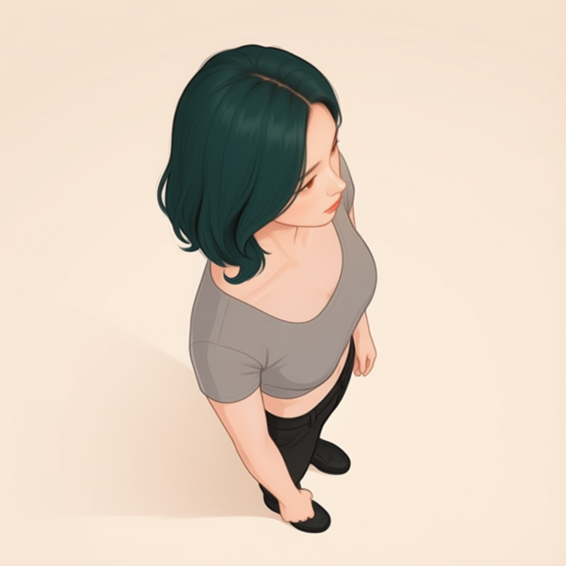 | 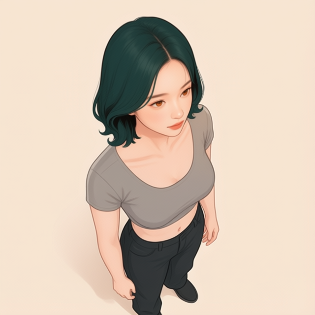 | 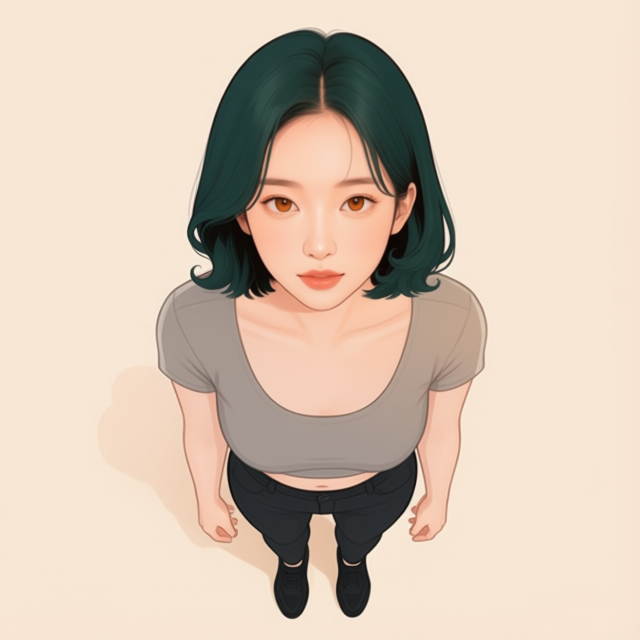 | 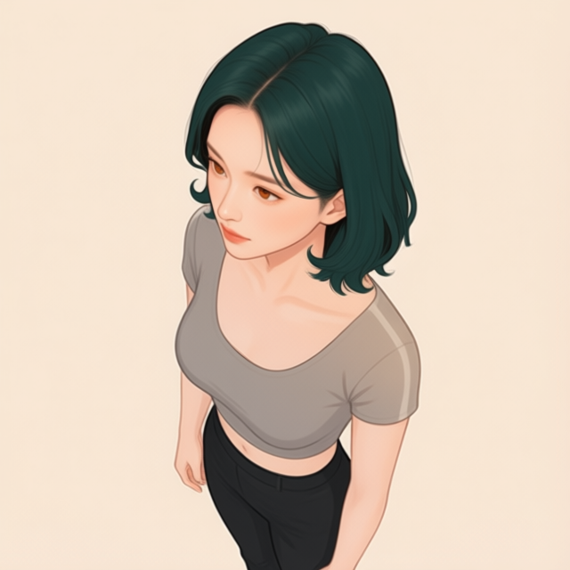 | 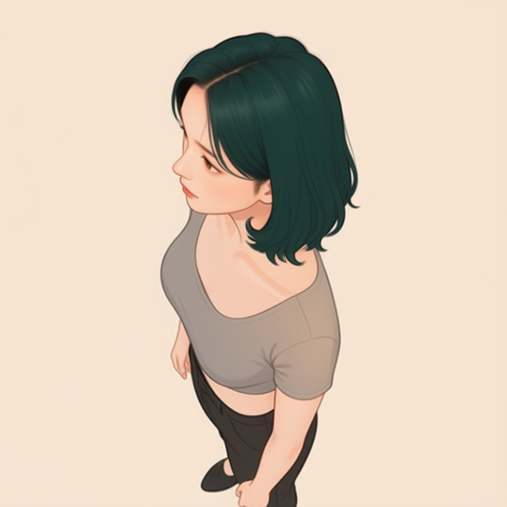 |

세 행을 함께 보면 yaw와 수직 시점은 대부분 분리되지만, 로우앵글 `−90°`는 배경색과 프레이밍이 더 크게 흔들린다. 따라서 이 15장은 회전·시점 조건을 비교하는 참조 자산이며, 어느 한 장의 프레이밍 이탈을 새 캐릭터·새 착장의 정보로 해석하지 않는다.

## 체크리스트

| 확인할 것 | 스스로 답할 질문 |
| --- | --- |
| 계약 | result JSON에 Mira identity와 일러스트 계약의 경로·해시가 남아 있는가? |
| 정면 구도 | 정수리 전체, 양쪽 눈과 귀, 목선이 잘리지 않았는가? |
| identity | 피부·얼굴형·호박빛 갈색 홍채·petrol-teal 단발이 계약과 같은 인물로 읽히는가? |
| 재현 | seed, step, CFG, 크기와 오프로딩 조건이 result JSON에 남아 있는가? |

## 출처와 참고 자료

- 정면 얼굴 기준의 생성 조건과 해시는 이 절에서 연결한 local result JSON을 기준으로 확인한다.
- Qwen, [*Qwen-Image model card*](https://huggingface.co/Qwen/Qwen-Image){: target="_blank" rel="noopener noreferrer"}, Hugging Face, 확인: 2026-08-29.
- Qwen, [*Qwen-Image-Edit-2511 model card*](https://huggingface.co/Qwen/Qwen-Image-Edit-2511){: target="_blank" rel="noopener noreferrer"}, Hugging Face, 확인: 2026-09-04.
- fal, [*Qwen-Image-Edit-2511 Multiple-Angles LoRA model card*](https://huggingface.co/fal/Qwen-Image-Edit-2511-Multiple-Angles-LoRA){: target="_blank" rel="noopener noreferrer"}, Hugging Face, 확인: 2026-09-04.
- lightx2v, [*Qwen-Image-Edit-2511 Lightning model card*](https://huggingface.co/lightx2v/Qwen-Image-Edit-2511-Lightning){: target="_blank" rel="noopener noreferrer"}, Hugging Face, 확인: 2026-09-04.
