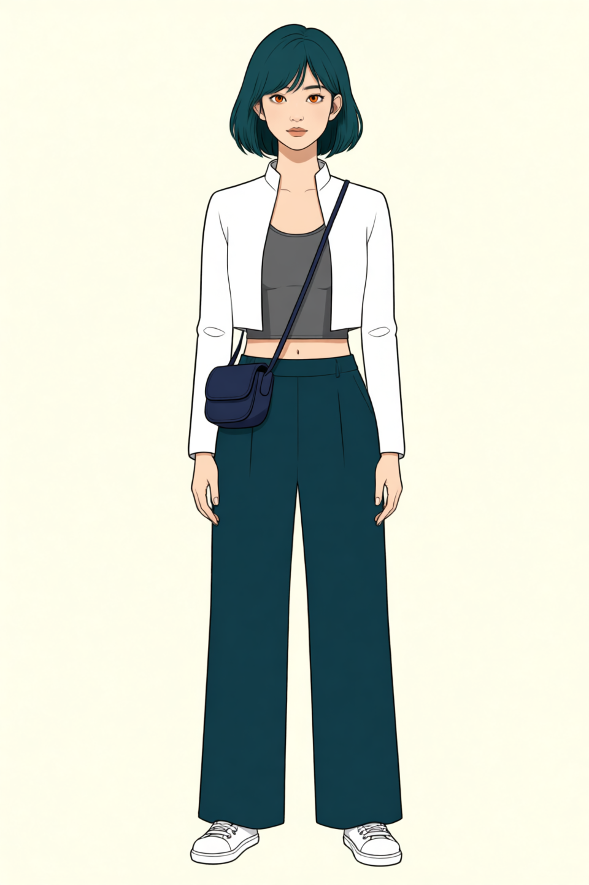
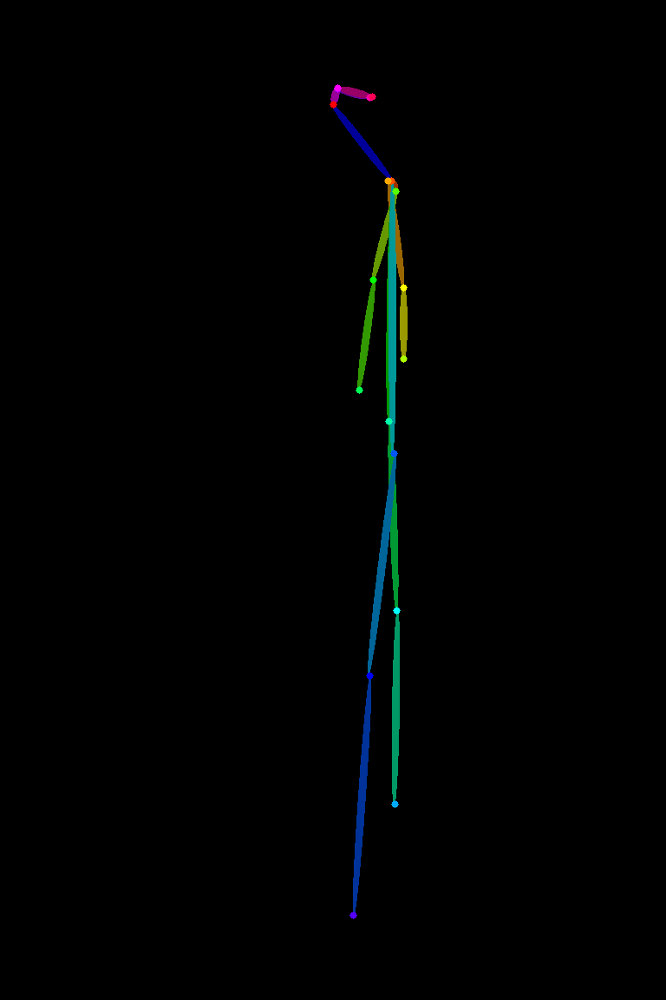
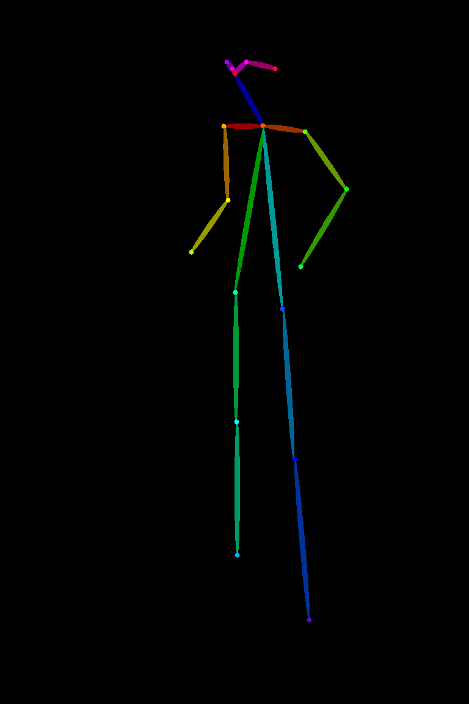
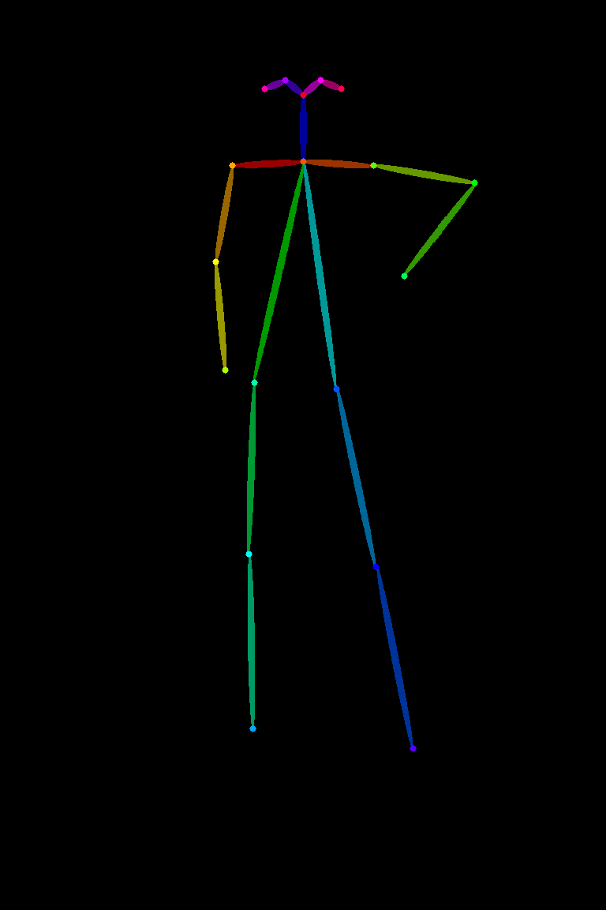
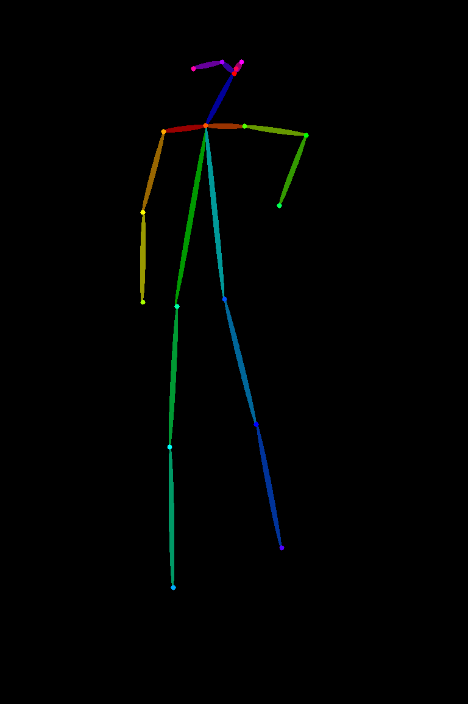
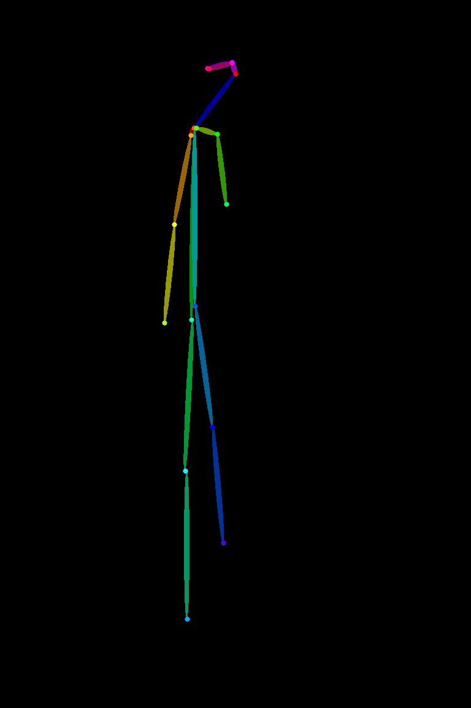
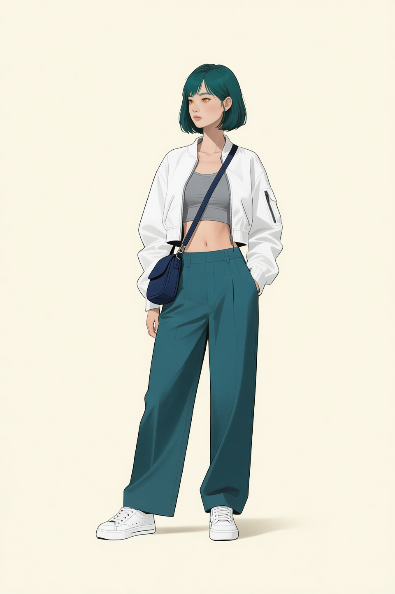
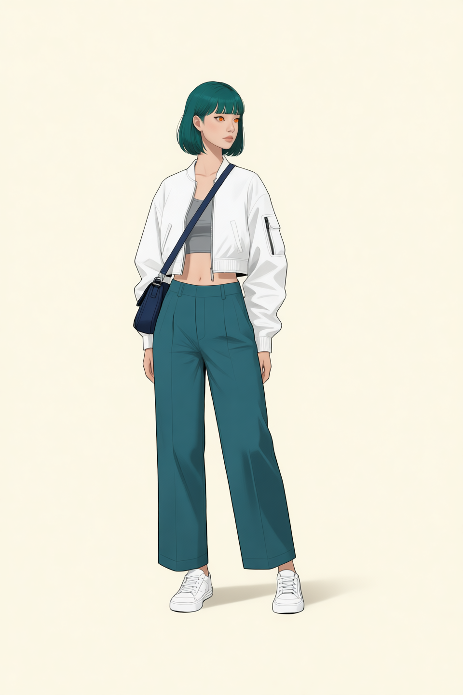
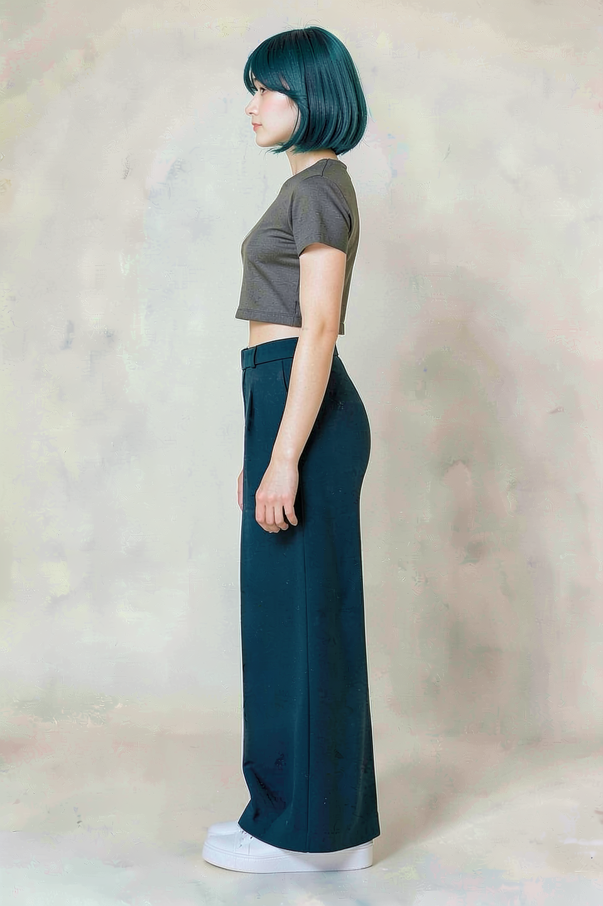
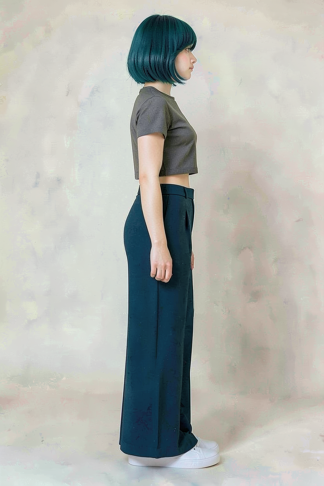

# P7-5.2 캐릭터 착장·전신 참조 셋 생성: 역할과 승인 범위 정하기

> Section ID: `P7-5.2`
> Version: `v2026.08.22`

장면을 만들기 전에 같은 인물의 **착장과 전신 구조**를 대조할 기준을 정한다. 이 절은 로컬 GPU에서 Qwen으로 만든 착장·전신·body-only OpenPose 자산만 다룬다. 얼굴 정면의 identity와 얼굴 회전은 [P7-5.7](section-07.md)에서 별도로 관리한다.

P7-5.3은 인물·구도·장면을 한 컷에 결합하고, P7-5.4는 그 컷의 얼굴·소품·화풍을 다시 검수한다. 여기서 승인한 전신 기준은 그 다음 단계를 자동으로 통과시키지 않는다.

## 기준 이미지는 역할을 나눈다

캐릭터 기준에 얼굴, 의상, 자세, 회전을 한 장씩 계속 더하면 입력끼리 서로의 특징을 덮어쓴다. 현재는 역할을 분리한다.

| 자산 | 고정하는 정보 | 현재 상태 |
| --- | --- | --- |
| P7-5.7 정면 머리 참조 | 얼굴형, 눈·홍채, 앞머리, 청록 단발, 선과 음영 | P7-5.7 생성 결과 |
| 착장·가방 | 목카라 흰 볼레로 재킷, 회색 언더버스트 이너, 와이드 팬츠, 흰 운동화, 단일 크로스백 | 960×1440, 30-step 생성 결과 |
| 정면 전신 | 머리 identity·착장·허리 손 전신 구조를 결합한 전신 비례와 프레이밍 | 960×1440, 30-step 기준 결과 |
| body-only OpenPose | 전신 관절과 방향 구조 | 사람 승인 |

P7-5.7 정면 머리 참조는 전신 비례나 의상을 정하지 않고, 착장 이미지는 얼굴 identity를 정하지 않는다. P7-5.2의 전신 생성기는 이 머리 참조를 identity·헤어 입력으로 사용한다. 몸의 크기·방향·crop은 전신과 OpenPose가 맡으며, 정면 머리 참조는 목·어깨·의상을 결정하지 않는다.

## 착장과 전신 구조를 따로 본다

착장 기준은 P7-5.7 정면 머리 입력으로 identity·헤어만 맞춘 전신 길이 이미지다. 목카라 흰 볼레로 재킷과 회색 언더버스트 이너는 가슴 바로 아래에서 끝나 허리·배꼽을 드러내며, 딥틸 하이웨이스트 와이드 팬츠, 흰 스니커즈, 남색 크로스백 하나와 대각선 스트랩 하나를 함께 확인한다. 이 이미지를 전신 생성에 쓰더라도 머리 크기나 얼굴을 전신 비례 기준으로 삼으면 안 된다.

| Qwen 착장·가방 기준 | 실행 기록 |
| --- | --- |
|  | <a class="aibook-source-link" href="/AiBook/assets/part-07/chapter-05/p7-5-2-qwen-outfit-front_full_length-crop-line-long-sleeves-v2-seed-62294-steps-30-result.json" data-language="json">960×1440, 30-step result.json</a> |

960×1440, 30-step 정면 전신은 P7-5.7 정면 머리 참조로 얼굴 identity·헤어를, 착장 참조로 재킷·가방·바지·신발을, body-only OpenPose로 오른손 허리 포즈와 전신 프레이밍을 각각 맡긴 기준 결과다. 회전 전신을 만들 때 몸 크기와 신발이 프레임 안에 유지되는지 비교하는 데 쓴다.

| 960×1440, 30-step Qwen 정면 전신 기준 | 실행 기록 |
| --- | --- |
|  | <a class="aibook-source-link" href="/AiBook/assets/part-07/chapter-05/p7-5-2-qwen-edit-prompt-style-fullbody_front_seven_head_qwen_outfit_skeleton-head-front-reference-v2-seed-62294-steps-30-result.json" data-language="json">960×1440, 30-step result.json</a> |

## OpenPose는 전신 구조만 맡는다

5방향 body-only OpenPose는 얼굴·손가락·의상 픽셀이 없는 구조 맵이다. 모든 방향은 오른손을 허리에 올리고 팔꿈치를 바깥으로 둔 같은 BODY_18 템플릿을 회전·투영한다. 따라서 정면·좌우 쿼터·좌우 측면에서 포즈의 관절 관계와 방향만 대조하며, 캐릭터 identity나 화풍을 정의하지 않는다.

| 왼쪽 측면 −90° | 왼쪽 쿼터 −45° | 정면 0° | 오른쪽 쿼터 +45° | 오른쪽 측면 +90° |
| --- | --- | --- | --- | --- |
|  |  |  |  |  |

| 왼쪽 쿼터 전신 참고 | 왼쪽 쿼터 구조 참고 |
| --- | --- |
|  |  |

<a class="aibook-source-link" href="/AiBook/assets/part-07/chapter-05/p7-5-2-fullbody-quarter-left-reference-result.json" data-language="json">왼쪽 쿼터 전신 result.json</a> · <a class="aibook-source-link" href="/AiBook/assets/part-07/chapter-05/p7-5-2-openpose-fullbody-hand-on-waist-pitch0-yaw-90_pitch+00.json" data-language="json">−90° 좌표 JSON</a> · <a class="aibook-source-link" href="/AiBook/assets/part-07/chapter-05/p7-5-2-openpose-fullbody-hand-on-waist-pitch0-yaw-45_pitch+00.json" data-language="json">−45° 좌표 JSON</a> · <a class="aibook-source-link" href="/AiBook/assets/part-07/chapter-05/p7-5-2-openpose-fullbody-hand-on-waist-pitch0-yaw+00_pitch+00.json" data-language="json">0° 좌표 JSON</a> · <a class="aibook-source-link" href="/AiBook/assets/part-07/chapter-05/p7-5-2-openpose-fullbody-hand-on-waist-pitch0-yaw+45_pitch+00.json" data-language="json">+45° 좌표 JSON</a> · <a class="aibook-source-link" href="/AiBook/assets/part-07/chapter-05/p7-5-2-openpose-fullbody-hand-on-waist-pitch0-yaw+90_pitch+00.json" data-language="json">+90° 좌표 JSON</a> · <a class="aibook-source-link" href="/AiBook/assets/part-07/chapter-05/p7-5-2-openpose-fullbody-hand-on-waist-pitch0-result.json" data-language="json">허리 손 OpenPose result.json</a>

같은 정면 앵커에서 만든 네 방향 전신 참조는 방향별 어깨·팔·다리·신발의 방향을 대조하는 자료다. 이 표는 새 pose, camera, 장면의 자동 승인 범위를 넓히지 않는다.

| 왼쪽 쿼터 | 오른쪽 쿼터 |
| --- | --- |
|  |  |

| 왼쪽 측면 | 오른쪽 측면 |
| --- | --- |
|  |  |

<a class="aibook-source-link" href="/AiBook/assets/part-07/chapter-05/p7-5-2-fullbody-quarter-left-reference-result.json" data-language="json">왼쪽 쿼터 result.json</a> · <a class="aibook-source-link" href="/AiBook/assets/part-07/chapter-05/p7-5-2-fullbody-quarter-right-reference-result.json" data-language="json">오른쪽 쿼터 result.json</a> · <a class="aibook-source-link" href="/AiBook/assets/part-07/chapter-05/p7-5-2-fullbody-profile-left-reference-result.json" data-language="json">왼쪽 측면 result.json</a> · <a class="aibook-source-link" href="/AiBook/assets/part-07/chapter-05/p7-5-2-fullbody-profile-right-reference-result.json" data-language="json">오른쪽 측면 result.json</a>

## 실행 기록과 승인 범위를 분리한다

Qwen 전신 편집은 P7-5.7의 정면 머리 참조, 착장·가방, OpenPose가 같은 역할을 하지 않도록 입력 역할을 실행 기록에 남긴다. prompt의 단어 수는 품질 점수가 아니라, 같은 특징을 반복해서 지시하면서 계약이 비대해졌는지 확인하는 보조 정보다.

Qwen 전신 참조 생성 코드 보기

P7-5.7 정면 머리 참조를 identity·헤어 입력으로, 착장·OpenPose를 별도 역할로 사용합니다.

Qwen 정면 착장 후보 생성 코드 보기

P7-5.7 정면 머리를 identity·헤어 입력으로 사용해 정면 착장·가방 기준을 생성합니다.

<a class="aibook-source-link" href="/AiBook/assets/part-07/chapter-05/p7-5-2-qwen-edit-transition-plan.json" data-language="json">Qwen 전환·검수 계획</a>

## 캐릭터셋 체크리스트

| 확인할 것 | 스스로 답할 질문 |
| --- | --- |
| 출처 | 다음 단계 입력으로 쓰는 PNG가 로컬 GPU 실행 기록과 사람 검수 기록을 모두 갖는가? |
| 역할 | P7-5.7 얼굴, 착장, 전신 구도, OpenPose 구조가 서로의 역할을 대신하지 않는가? |
| 전신 구조 | 회전 후보에서 어깨·팔·다리·신발이 요청한 방향과 프레임 안에 유지되는가? |
| 재현 | seed, step, 입력 자산, prompt와 `prompt_word_count`가 run JSON에 남아 있는가? |
| 승인 | 후보와 승인 자산의 위치·이름·검수 상태가 분리되어 있는가? |
| 다음 단계 | P7-5.3과 P7-5.4에는 승인된 기준만 넘기고, 새 구도·장면·소품은 다시 검수하는가? |

## 출처와 참고 자료

- 전신·착장·OpenPose의 실행 조건과 사람 판정은 이 절에서 연결한 local run JSON과 review JSON을 기준으로 확인한다.
- 얼굴 정면과 카메라 회전의 기준은 [P7-5.7](section-07.md)에서 확인한다.
