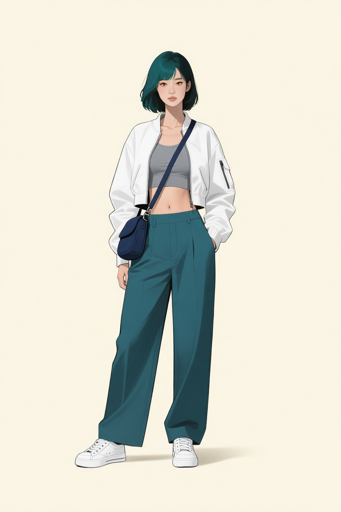
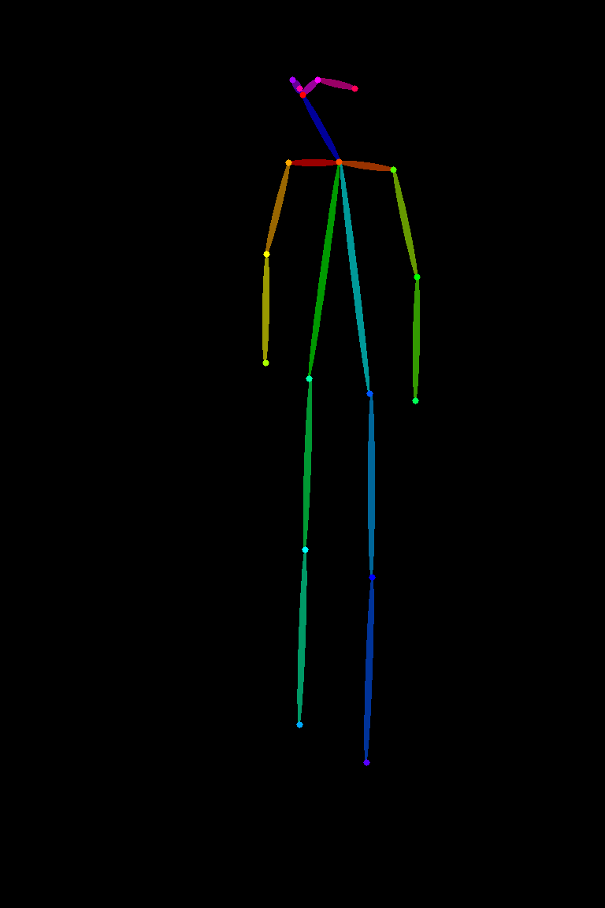

# P7-5.2 캐릭터 참조 셋 생성: 로컬 GPU 원본과 승인 범위 정하기

> Section ID: `P7-5.2`
> Version: `v2026.08.20`

장면을 만들기 전에 다음 생성에서도 같은 인물로 대조할 수 있는 기준을 먼저 정한다. 이 절은 로컬 GPU에서 Qwen으로 생성한 자산만 다룬다. 한 장이 보기 좋다는 사실만으로는 기준이 되지 않는다. 무엇을 고정했는지, 무엇은 아직 다시 검수해야 하는지, 실행 기록은 무엇인지가 함께 있어야 한다.

P7-5.3은 인물·구도·장면을 한 컷에 결합하는 단계이고, P7-5.4는 그 컷의 얼굴·소품·화풍을 다시 검수하는 단계다. 여기서 승인한 기준은 그 다음 단계를 자동으로 통과시키지 않는다.

## 기준 이미지는 역할을 나눈다

캐릭터 기준에 얼굴, 의상, 자세, 회전을 한 장씩 계속 더하면 입력끼리 서로의 특징을 덮어쓴다. 현재는 역할을 분리한다.

| 자산 | 고정하는 정보 | 현재 상태 |
| --- | --- | --- |
| 정면 머리 | 얼굴형, 눈·홍채, 앞머리, 청록·검정 단발, 선과 음영 | 사람 승인 |
| 착장·가방 | 짧은 흰 재킷, 회색 이너, 와이드 팬츠, 흰 운동화, 크로스백 | 사람 승인 |
| 왼쪽 쿼터 전신 | 회전된 전신 실루엣과 프레이밍 | 다음 생성의 구도 참고 |
| 왼쪽 쿼터 body-only OpenPose | 전신 관절과 방향 구조 | 다음 전신 생성의 구조 참고 |

정면 머리는 전신 비례나 의상을 정하지 않고, 착장 이미지는 얼굴 identity를 정하지 않는다. 전신 쿼터 이미지는 회전과 프레이밍을 읽는 자료일 뿐, 작은 얼굴 영역을 새 머리의 identity 입력으로 복사하지 않는다.

## 승인된 정면 머리

현재 정면 머리 기준은 참조 이미지 없이 생성한 Qwen 후보 중 사람이 승인한 결과다. 이 기준은 중앙 정면 구도, 높은 콧대와 곧은 코선, 주황·호박색 홍채, 청록과 검정이 나뉜 볼륨 단발을 대조하는 데만 쓴다. 표정, 회전, 전신, 의상, 장면은 이 승인 범위에 포함되지 않는다.

| 승인된 Qwen 정면 머리 | 검수 기록 |
| --- | --- |
|  | <a class="aibook-source-link" href="/AiBook/assets/part-07/chapter-05/p7-5-2-face-front-qwen-role-separated-reference-review.json" data-language="json">review.json</a> |

정면 머리 생성의 기본값은 승인본과 같은 10 step이다. 이 수치는 모든 회전에 그대로 적용하는 규칙이 아니다. 얼굴을 실제로 회전시키는 편집은 더 많은 denoising step이 필요할 수 있으므로, 결과를 정면 기준과 나란히 검수한다.

<a class="aibook-source-link" href="/AiBook/assets/part-07/chapter-05/p7-5-2-character-identity-contract.json" data-language="json">캐릭터 identity 계약</a> · <a class="aibook-source-link" href="/AiBook/assets/part-07/chapter-05/p7-5-2-character-reference-illustration-prompt-contract.json" data-language="json">공통 일러스트 계약</a>

## 착장과 전신 구조를 따로 본다

착장 기준은 얼굴 없는 의상·가방 정보만 전달한다. 흰 초단 크롭 재킷, 회색 이너 탑, 맨살 띠, 딥틸 하이웨이스트 와이드 팬츠, 흰 스니커즈, 남색 크로스백과 스트랩을 함께 확인한다. 따라서 이 이미지를 전신 생성에 쓰더라도 머리 크기나 얼굴을 따라 하면 안 된다.

| 승인된 Qwen 착장·가방 | 실행·검수 기록 |
| --- | --- |
|  | <a class="aibook-source-link" href="/AiBook/assets/part-07/chapter-05/p7-5-2-fullbody-front-qwen-jacket-bag-reference-review.json" data-language="json">review.json</a> · <a class="aibook-source-link" href="/AiBook/assets/part-07/chapter-05/p7-5-2-fullbody-front-qwen-jacket-bag-reference-run.json" data-language="json">run.json</a> |

승인된 정면 전신 이미지는 착장 기준과 body-only OpenPose를 결합했을 때의 전신 비례·프레이밍 대조물이다. 이 이미지는 회전 전신을 만들 때 정면의 몸 크기와 신발이 프레임 안에 유지되는지 비교하는 기준으로 쓴다. 다만 정면 머리의 세부 identity를 대신하지 않으며, 회전 결과는 별도로 사람 검수를 거쳐야 한다.

| 승인된 Qwen 정면 전신 | 실행 기록 |
| --- | --- |
|  | <a class="aibook-source-link" href="/AiBook/assets/part-07/chapter-05/p7-5-2-fullbody-front-qwen-approved-outfit-reference-run.json" data-language="json">run.json</a> |

왼쪽 쿼터 전신과 OpenPose는 다음 전신 생성에서 회전 정보가 실제로 전달되는지 시험하기 위한 두 자료다. 렌더링 전신 이미지는 실루엣과 crop을, OpenPose는 관절 방향을 맡는다. 둘 다 정면 머리 대신 얼굴을 정의하지 않는다.

| 왼쪽 쿼터 전신 참고 | 왼쪽 쿼터 구조 참고 |
| --- | --- |
|  |  |

<a class="aibook-source-link" href="/AiBook/assets/part-07/chapter-05/p7-5-2-fullbody-quarter-left-reference-run.json" data-language="json">왼쪽 쿼터 전신 run.json</a> · <a class="aibook-source-link" href="/AiBook/assets/part-07/chapter-05/p7-5-2-openpose-fullbody-quarter-left-45deg-approved-guide-review.json" data-language="json">왼쪽 쿼터 OpenPose review.json</a>

정면과 왼쪽 쿼터 body-only OpenPose는 얼굴·손가락·의상 픽셀이 없는 구조 맵이다. 정면 맵은 전신 비례와 기본 서기 프레이밍을, 쿼터 맵은 그 구조가 왼쪽으로 회전할 때의 관절 방향을 대조한다. 두 맵은 캐릭터 identity나 화풍을 정의하지 않는다.

| 정면 body-only OpenPose | 왼쪽 쿼터 body-only OpenPose |
| --- | --- |
|  |  |

같은 정면 앵커에서 만든 네 방향 전신 참조는 방향별 머리·어깨·팔·다리·신발의 방향을 대조하는 자료다. 이 표는 새 pose, camera, 장면의 자동 승인 범위를 넓히지 않는다.

| 왼쪽 쿼터 | 오른쪽 쿼터 |
| --- | --- |
|  |  |

| 왼쪽 측면 | 오른쪽 측면 |
| --- | --- |
|  |  |

<a class="aibook-source-link" href="/AiBook/assets/part-07/chapter-05/p7-5-2-fullbody-quarter-left-reference-run.json" data-language="json">왼쪽 쿼터 run.json</a> · <a class="aibook-source-link" href="/AiBook/assets/part-07/chapter-05/p7-5-2-fullbody-quarter-right-reference-run.json" data-language="json">오른쪽 쿼터 run.json</a> · <a class="aibook-source-link" href="/AiBook/assets/part-07/chapter-05/p7-5-2-fullbody-profile-left-reference-run.json" data-language="json">왼쪽 측면 run.json</a> · <a class="aibook-source-link" href="/AiBook/assets/part-07/chapter-05/p7-5-2-fullbody-profile-right-reference-run.json" data-language="json">오른쪽 측면 run.json</a> · <a class="aibook-source-link" href="/AiBook/assets/part-07/chapter-05/p7-5-2-fullbody-profile-left-reference-review.json" data-language="json">왼쪽 측면 review.json</a>

## 회전 얼굴은 별도 실험으로 검수한다

정면 머리를 이미지 참조로 넣고 2D 얼굴 OpenPose를 함께 주면, 모델은 두 요구 사이에서 흔들릴 수 있다. 정면 참조를 강하게 보존하면 얼굴이 정면에 머물고, 회전을 강하게 만들면 얼굴의 폭·눈·머리 음영이 달라질 수 있다. 이는 OpenPose가 깊이, 가림, 머리카락의 3D 실루엣을 모두 주는 도구가 아니기 때문이다.

그래서 회전 얼굴 후보는 다음 네 항목을 동시에 사람 검수한다.

| 항목 | 확인할 질문 |
| --- | --- |
| 방향 | 코끝, 가까운 쪽 눈·볼, 귀와 머리카락의 가림이 요청한 쿼터 방향과 맞는가? |
| 얼굴 identity | 정면 기준과 얼굴 폭, 눈 간격, 코선, 홍채색이 같은 인물로 읽히는가? |
| 헤어 | 청록·검정 색 분할, 앞머리, 볼륨, S웨이브와 안쪽 컬이 유지되는가? |
| 화풍 | 정면 기준의 선, 대비, 음영이 단순화되거나 사진풍으로 바뀌지 않았는가? |

후보 PNG와 run JSON은 검수 전까지 `p7-5-2-qwen-edit-candidates/`에만 둔다. 후보가 저장됐다는 사실은 새 방향 참조 승인이나 원고 반영을 뜻하지 않는다.

## 실행 기록과 승인 범위를 분리한다

Qwen 편집 실험은 정면 얼굴, 전신 구도, OpenPose가 같은 역할을 하지 않도록 입력 역할을 실행 기록에 남긴다. prompt의 단어 수는 품질 점수가 아니라, 같은 특징을 반복해서 지시하면서 계약이 비대해졌는지 확인하는 보조 정보다.

Qwen 참조 후보 생성 코드 보기

펼치면 Python 원문을 불러옵니다.

<a class="aibook-source-link" href="/AiBook/assets/part-07/chapter-05/p7-5-2-qwen-edit-transition-plan.json" data-language="json">Qwen 전환·검수 계획</a> · <a class="aibook-source-link" href="/AiBook/assets/part-07/chapter-05/p7-5-2-character-reference-style-prompt-contract.json" data-language="json">인물 화풍 prompt 계약</a>

## 캐릭터셋 체크리스트

| 확인할 것 | 스스로 답할 질문 |
| --- | --- |
| 출처 | 다음 단계 입력으로 쓰는 PNG가 로컬 GPU 실행 기록과 사람 검수 기록을 모두 갖는가? |
| 역할 | 얼굴, 착장, 전신 구도, OpenPose 구조가 서로의 역할을 대신하지 않는가? |
| 방향 | 회전 후보에서 눈·코·머리·어깨의 방향이 같은 쪽을 가리키는가? |
| 재현 | seed, step, 입력 자산, prompt와 `prompt_word_count`가 run JSON에 남아 있는가? |
| 승인 | 후보와 승인 자산의 위치·이름·검수 상태가 분리되어 있는가? |
| 다음 단계 | P7-5.3과 P7-5.4에는 승인된 기준만 넘기고, 새 구도·장면·소품은 다시 검수하는가? |

## 출처와 참고 자료

- Qwen 정면 머리·착장·전신 구조의 실행 조건과 사람 판정은 이 절에서 연결한 local run JSON과 review JSON을 기준으로 확인한다.
