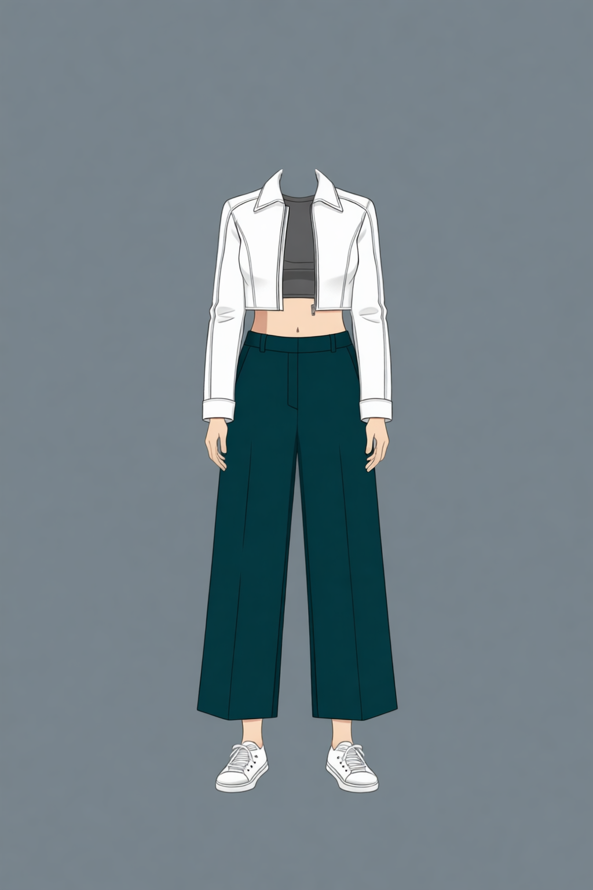
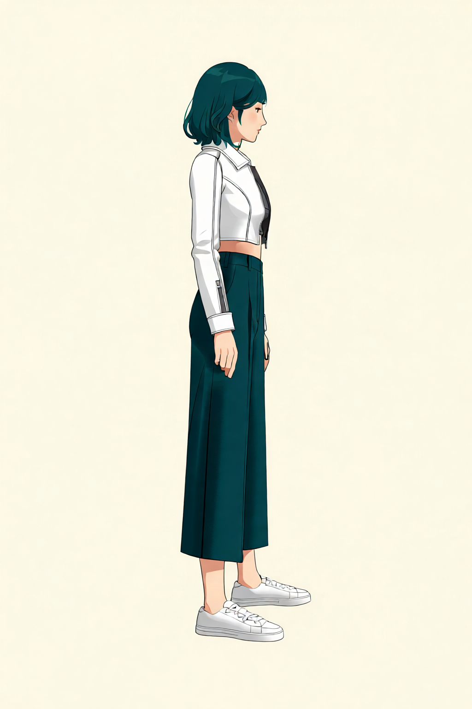
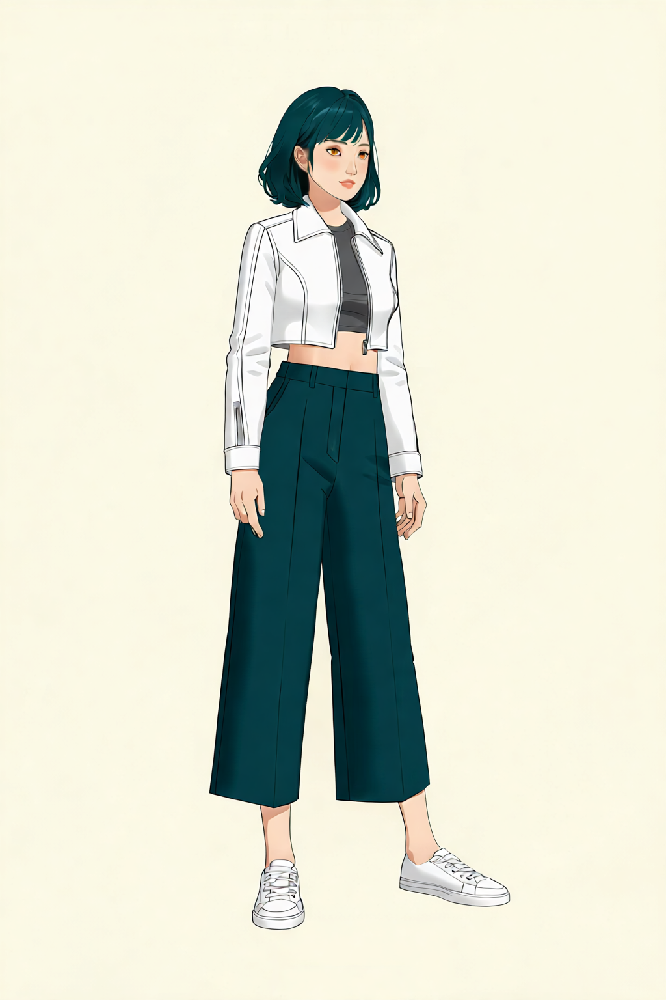
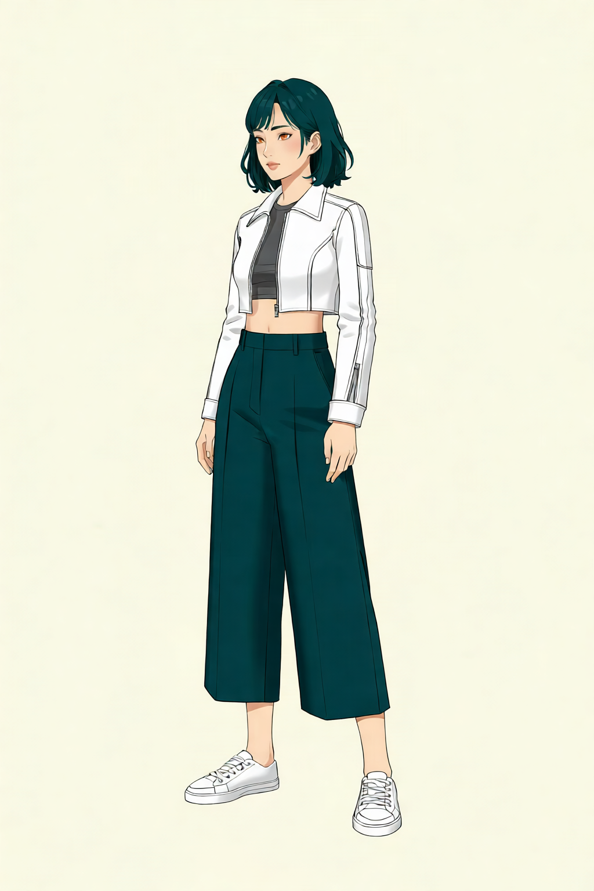
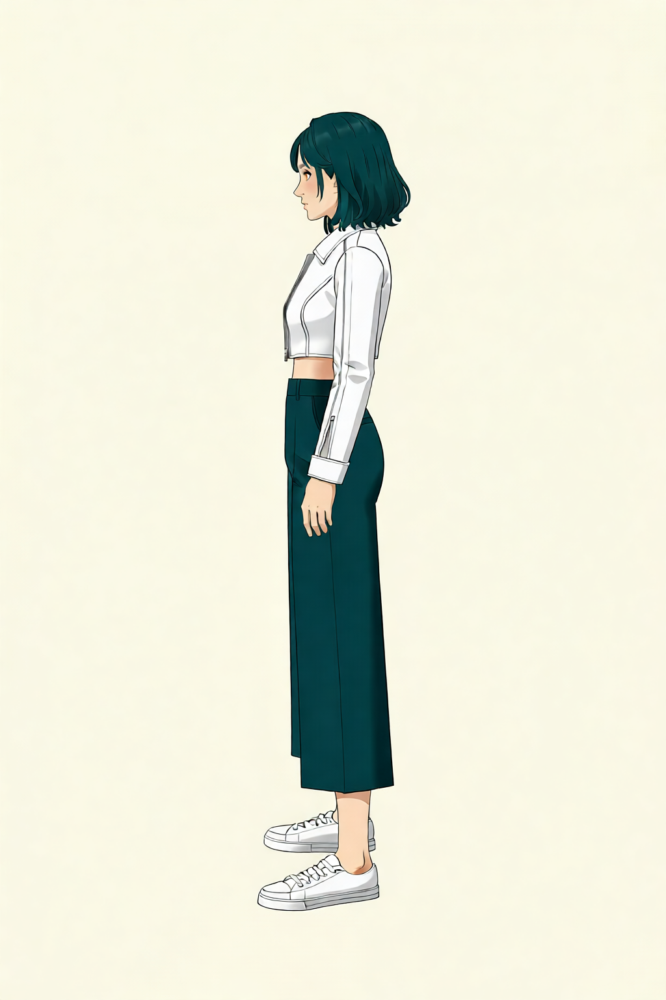

# P7-5.2 캐릭터 착장·전신 참조 셋 생성: 역할과 승인 범위 정하기

> Section ID: `P7-5.2`
> Version: `v2026.08.24`

장면을 만들기 전에 같은 인물의 **착장과 전신 구조**를 대조할 기준을 정한다. 이 절은 로컬 GPU에서 Qwen으로 만든 착장·전신·body-only OpenPose 자산만 다룬다. 얼굴 정면의 identity와 얼굴 회전은 [P7-5.7](section-07.md)에서 별도로 관리한다.

P7-5.3은 인물·구도·장면을 한 컷에 결합하고, P7-5.4는 그 컷의 얼굴·소품·화풍을 다시 검수한다. 여기서 승인한 전신 기준은 그 다음 단계를 자동으로 통과시키지 않는다.

## 기준 이미지는 역할을 나눈다

캐릭터 기준에 얼굴, 의상, 자세, 회전을 한 장씩 계속 더하면 입력끼리 서로의 특징을 덮어쓴다. 현재는 역할을 분리한다.

| 자산 | 고정하는 정보 | 현재 상태 |
| --- | --- | --- |
| P7-5.7 정면 머리 참조 | 얼굴형, 눈·홍채, 앞머리, 청록 단발, 선과 음영 | P7-5.7 생성 결과 |
| 1단계 착장·전신 | 정면 머리 identity, 크롭탑, 여성용 와이드 팬츠, 흰 운동화, 양팔을 내린 정면 포즈 | 960×1440, 30-step 생성 결과 |
| 2단계 전신 | 1단계 결과에 열린 흰 크롭 자켓과 손을 더한 착장 기준 | 960×1440, 30-step 생성 결과 |
| 3단계 헤드리스 착장 | 얼굴·머리를 제외한 목깃, 재킷, 이너, 양손, 바지와 신발 | 1024×1536, 20-step 생성 결과 |
| body-only OpenPose | 전신 관절과 방향 구조 | 사람 승인 |

P7-5.7 정면 머리 참조는 전신 비례나 의상을 정하지 않고, 착장 이미지는 얼굴 identity를 정하지 않는다. P7-5.2의 전신 생성기는 이 머리 참조를 identity·헤어 입력으로 사용한다. 몸의 크기·방향·crop은 전신과 OpenPose가 맡으며, 정면 머리 참조는 목·어깨·의상을 결정하지 않는다.

## 1단계에서 얼굴·포즈·기본 착장을 결합한다

1단계는 P7-5.7의 1024×1024 정면 머리 참조와 양팔을 자연스럽게 내린 정면 body-only OpenPose를 입력으로 사용한다. 머리 참조는 얼굴·헤어만, OpenPose는 정면 전신 구조만 맡는다. 생성 결과에는 가슴 바로 아래에서 끝나는 회색 슬림 크롭탑, 딥틸 하이웨이스트 여성용 와이드 8부 팬츠, 흰 스니커즈만 넣는다. 자켓·가방·스트랩은 1단계에서 만들지 않으며, 2단계는 이 결과를 착장 보정의 입력으로 사용한다.

| 1단계 Qwen 전신 착장 기준 | 실행 기록 |
| --- | --- |
|  | <a class="aibook-source-link" href="/AiBook/assets/part-07/chapter-05/p7-5-2-qwen-edit-prompt-style-outfit_stage1_face_openpose-relaxed-arms-v3-seed-62294-steps-30-result.json" data-language="json">960×1440, 30-step result.json</a> |

## 2단계에서 열린 자켓과 손을 더한다

2단계는 1단계 전신 착장 결과와 P7-5.7의 1024×1024 정면 머리 참조만 사용한다. OpenPose는 다시 넣지 않는다. 1단계의 바지·신발·비례를 유지한 상태에서, 양쪽 어깨와 상완을 덮는 흰 크롭 자켓을 앞판이 서로 닿지 않게 열고, 소매 끝 아래에 양손이 보이게 한다. 회색 크롭티의 몸통과 맨허리 띠는 보이되, 이너 소매·가방·스트랩은 넣지 않는다.

| 2단계 Qwen 전신 착장 기준 | 실행 기록 |
| --- | --- |
|  | <a class="aibook-source-link" href="/AiBook/assets/part-07/chapter-05/p7-5-2-qwen-edit-prompt-style-outfit_stage2_jacket_face-relaxed-arms-v3-seed-62294-steps-30-result.json" data-language="json">960×1440, 30-step result.json</a> |

## 3단계에서 얼굴 없이 착장 기준을 분리한다

3단계는 2단계 전신을 입력으로 사용해 머리·얼굴 실루엣을 제거한다. 목깃과 열린 흰 크롭 자켓, 회색 이너, 양손, 와이드 8부 팬츠, 흰 스니커즈는 유지한다. 이 결과는 얼굴 identity를 다시 생성하지 않고 착장·손·신발만 참조해야 할 때 사용한다.

| 3단계 Qwen 헤드리스 착장 기준 | 실행 기록 |
| --- | --- |
|  | <a class="aibook-source-link" href="/AiBook/assets/part-07/chapter-05/p7-5-2-qwen-edit-prompt-style-outfit_stage3_headless-relaxed-arms-v1-seed-62294-steps-20-result.json" data-language="json">1024×1536, 20-step result.json</a> |

960×1440, 30-step 정면 전신은 P7-5.7 정면 머리 참조로 얼굴 identity·헤어를, 착장 참조로 재킷·바지·신발을, body-only OpenPose로 오른손 허리 포즈와 전신 프레이밍을 각각 맡긴 초기 비교 결과다. 왼팔은 팔꿈치를 몸통 가까이에 둔 채 손목을 몸 바깥으로 향하게 하며, 몸통과 겹쳐 손이 사라지는지를 비교한다. 회전 전신을 만들 때 몸 크기와 신발이 프레임 안에 유지되는지 비교하는 데 쓴다.

| 960×1440, 30-step Qwen 정면 전신 기준 | 실행 기록 |
| --- | --- |
|  | <a class="aibook-source-link" href="/AiBook/assets/part-07/chapter-05/p7-5-2-qwen-edit-prompt-style-fullbody_front_seven_head_qwen_outfit_skeleton-head-front-reference-v2-seed-62294-steps-30-result.json" data-language="json">960×1440, 30-step result.json</a> |

## 회전은 2단계 착장 기준에서 만든다

정면을 제외한 네 방향은 2단계 열린 자켓 전신을 입력으로 쓰고 Multiple-angles LoRA에 카메라 yaw만 지시해 만든다. OpenPose는 이 단계에 넣지 않는다. 따라서 이 이미지는 방향별 착장·머리·전신 외곽이 얼마나 유지되는지 비교하는 결과이며, 팔 관절이나 손 모양을 구조적으로 보증하지 않는다.

| −90° | −45° | +45° | +90° |
| --- | --- | --- | --- |
|  |  |  |  |
| <a class="aibook-source-link" href="/AiBook/assets/part-07/chapter-05/p7-5-2-qwen-multiple-angles-yaw_minus_90-stage2-fullbody-multiple-angles-v1-seed-62294-steps-8-result.json" data-language="json">−90° result.json</a> | <a class="aibook-source-link" href="/AiBook/assets/part-07/chapter-05/p7-5-2-qwen-multiple-angles-yaw_minus_45-stage2-fullbody-multiple-angles-v1-seed-62294-steps-8-result.json" data-language="json">−45° result.json</a> | <a class="aibook-source-link" href="/AiBook/assets/part-07/chapter-05/p7-5-2-qwen-multiple-angles-yaw_plus_45-stage2-fullbody-multiple-angles-v1-seed-62294-steps-8-result.json" data-language="json">+45° result.json</a> | <a class="aibook-source-link" href="/AiBook/assets/part-07/chapter-05/p7-5-2-qwen-multiple-angles-yaw_plus_90-stage2-fullbody-multiple-angles-v1-seed-62294-steps-8-result.json" data-language="json">+90° result.json</a> |

네 결과는 모두 `1024×1536`, `seed=62294`, `8 step` 조건이다. 회전 요청과 다르게 팔·손·신발의 가림이 달라지면 그 결과를 구조 기준으로 넘기지 않고, 착장 유지와 방향성의 비교 대상으로만 남긴다.

## OpenPose는 전신 구조만 맡는다

정면 body-only OpenPose는 얼굴·손가락·의상 픽셀이 없는 구조 맵이다. 양팔은 몸통 양옆으로 자연스럽게 내리고, 두 손목은 허벅지 바깥쪽에 둔다. 두 팔은 같은 상완·전완 길이를 유지한 BODY_18 템플릿으로 구성한다. 이 맵은 정면 전신의 관절 관계와 프레이밍만 대조하며, 캐릭터 identity나 화풍을 정의하지 않는다.

| 정면 0° body-only OpenPose | 좌표 JSON |
| --- | --- |
|  | <a class="aibook-source-link" href="/AiBook/assets/part-07/chapter-05/p7-5-2-openpose-fullbody-hand-on-waist-pitch0-yaw+00_pitch+00.json" data-language="json">0° 좌표 JSON</a> |

## 실행 기록과 승인 범위를 분리한다

Qwen 전신 편집은 P7-5.7의 정면 머리 참조, 착장·가방, OpenPose가 같은 역할을 하지 않도록 입력 역할을 실행 기록에 남긴다. prompt의 단어 수는 품질 점수가 아니라, 같은 특징을 반복해서 지시하면서 계약이 비대해졌는지 확인하는 보조 정보다.

Qwen 정면 착장 1~3단계 생성 코드 보기

Stage 1은 정면 머리·OpenPose로 이너와 하의를 만들고, Stage 2는 열린 재킷을 더하며, Stage 3은 얼굴 없이 착장 기준을 분리합니다.

Qwen 전신 4방향 회전 생성 코드 보기

2단계 전신 착장을 기준으로 −90°·−45°·+45°·+90° 카메라 회전을 생성합니다.

<a class="aibook-source-link" href="/AiBook/assets/part-07/chapter-05/p7-5-2-qwen-edit-transition-plan.json" data-language="json">Qwen 전환·검수 계획</a>

## 캐릭터셋 체크리스트

| 확인할 것 | 스스로 답할 질문 |
| --- | --- |
| 출처 | 다음 단계 입력으로 쓰는 PNG가 로컬 GPU 실행 기록과 사람 검수 기록을 모두 갖는가? |
| 역할 | P7-5.7 얼굴, 착장, 전신 구도, OpenPose 구조가 서로의 역할을 대신하지 않는가? |
| 전신 구조 | 회전 후보에서 어깨·팔·다리·신발이 요청한 방향과 프레임 안에 유지되는가? |
| 재현 | seed, step, 입력 자산, prompt와 `prompt_word_count`가 run JSON에 남아 있는가? |
| 승인 | 후보와 승인 자산의 위치·이름·검수 상태가 분리되어 있는가? |
| 다음 단계 | P7-5.3과 P7-5.4에는 승인된 기준만 넘기고, 새 구도·장면·소품은 다시 검수하는가? |

## 출처와 참고 자료

- 전신·착장·OpenPose의 실행 조건과 사람 판정은 이 절에서 연결한 local run JSON과 review JSON을 기준으로 확인한다.
- 얼굴 정면과 카메라 회전의 기준은 [P7-5.7](section-07.md)에서 확인한다.
