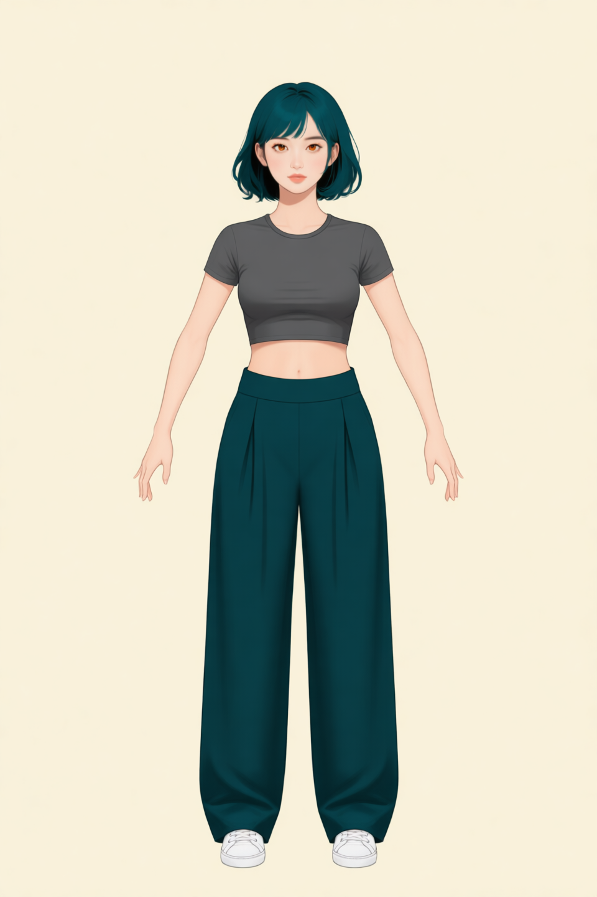
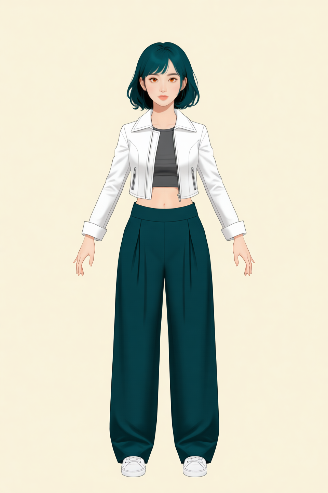
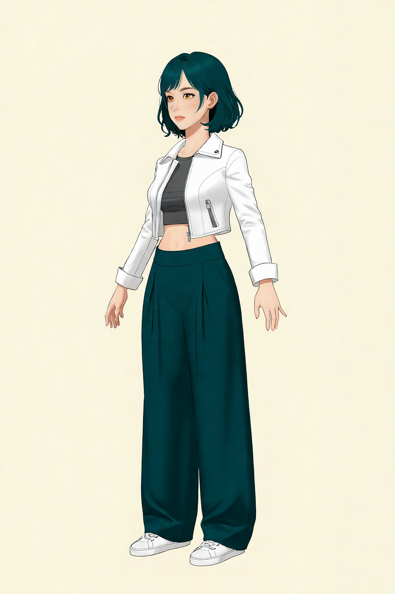
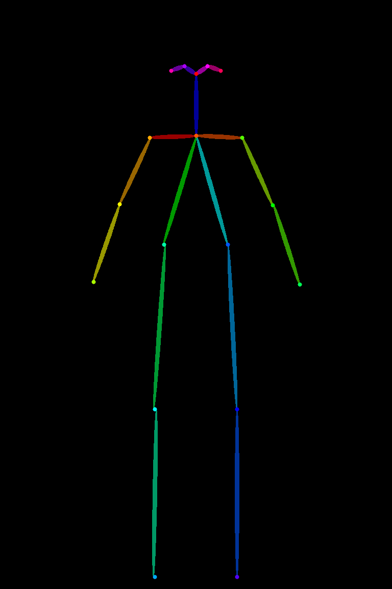

# P7-5.2 캐릭터 identity와 추가 페인팅으로 특징 완성하기

> Section ID: `P7-5.2`
> Version: `v2026.08.29`

같은 캐릭터를 다른 장면과 자세에서도 이어 그리려면, 얼굴·착장·전신 구조를 한 이미지나 한 프롬프트에 모두 맡기지 않아야 한다. 이 절에서는 [P7-5.7](section-07.md)의 얼굴 identity를 기준으로 두고, 전신 비례·기본 의상·재킷 같은 특징을 이전 결과 위에 한 단계씩 추가 페인팅하는 Qwen 편집 경로를 기록한다. 얼굴 정면 identity와 캐릭터 멀티플 뷰 생성은 P7-5.7에서 별도로 관리한다.

이 절의 질문은 간단하다. 캐릭터 identity를 잃지 않으면서 전신 비례·기본 의상·재킷·동작 같은 특징을 어떤 순서로 추가 페인팅해야 서로의 정보를 덮어쓰지 않을까?

## 한 이름으로 부르지 않는 실행 조합

P7-5.2의 결과는 이름이 하나인 단일 모델에서 나오지 않는다. `result.json`에 남긴 실행 기록에는 편집 모델, 로컬 실행용 양자화 transformer, 카메라 회전 전용 LoRA, 구조 guide를 만드는 OpenPose 도구가 서로 다른 역할로 기록된다. 이들을 모두 캐릭터를 만드는 모델이라고 부르면, 어느 조건을 바꿨을 때 결과가 달라졌는지 알 수 없다.

| 요소 | P7-5.2에서 맡긴 일 | 적용 범위 |
| --- | --- | --- |
| `Qwen/Qwen-Image-Edit-2509` | 얼굴·착장·구조 이미지를 함께 읽고, prompt가 지시한 전신 결과를 편집 | 1·2단계 착장과 동적 전신 |
| Nunchaku SVDQuant FP4 r128 transformer | Qwen 편집 모델의 transformer를 로컬 GPU 메모리에 맞춰 실행 | 1·2단계 착장과 동적 전신 |
| `Qwen-Edit-2509-Multiple-angles` LoRA | 2단계 착장 한 장에서 카메라 yaw만 바꾸는 보조 조건 | −90°·−45°·+45°·+90° 착장 |
| `controlnet_aux` OpenPose renderer | BODY_18 좌표를 정면 body-only 구조 PNG로 그려 Qwen에 참조 입력으로 제공 | 1단계 전신 비례·프레이밍 guide |

Qwen-Image-Edit-2509은 한 장에서 세 장의 이미지 입력을 함께 편집하도록 공개된 모델이다. 여기서는 정면 머리와 body-only OpenPose, 또는 앞 단계 착장과 정면 머리를 입력으로 두어 각 이미지가 맡는 정보를 분리했다. 이 모델 자체는 keypoint·depth 같은 ControlNet 조건도 지원하지만, 이 절의 1단계는 native ControlNet 경로가 아니라 **body-only OpenPose PNG를 일반 이미지 참조로 넣는 편집 경로**를 사용했다. 따라서 구조 맵이 얼굴·의상 정보를 직접 보존한다고 해석하면 안 된다. [Qwen-Image-Edit-2509 모델 카드](https://huggingface.co/Qwen/Qwen-Image-Edit-2509){: target="_blank" rel="noopener noreferrer"}

Nunchaku transformer는 별도의 그림 스타일이나 캐릭터 조건이 아니다. 이 실행에서는 Qwen의 큰 transformer를 FP4 r128 양자화 가중치로 바꾸고 순차 CPU offload와 함께 사용해 로컬 GPU에서 실행했다. r128은 같은 계열에서 더 빠른 r32보다 품질 우선인 선택이다. 그러므로 “Nunchaku를 적용했다”는 말은 캐릭터 identity가 강화됐다는 뜻이 아니라, 같은 Qwen 편집을 가능한 메모리·속도 조건으로 실행했다는 뜻이다. [Nunchaku Qwen-Image-Edit-2509 모델 카드](https://huggingface.co/nunchaku-ai/nunchaku-qwen-image-edit-2509){: target="_blank" rel="noopener noreferrer"}

네 방향 착장에만 사용한 Multiple-angles LoRA는 `将镜头向左旋转45度。` 같은 짧은 카메라 지시를 보강한다. 이 LoRA에는 정면 2단계 착장 하나만 입력으로 넣었다. 얼굴 참조와 OpenPose를 함께 넣지 않은 이유는 LoRA가 담당해야 할 질문을 yaw 변화로 제한하기 위해서다. LoRA는 얼굴·헤어·관절·의상을 새 기준으로 정하는 모델이 아니며, 회전 결과에서도 그 정보는 원래 착장 참조와 이후의 별도 입력이 맡는다. [Multiple-angles LoRA 모델 카드](https://huggingface.co/dx8152/Qwen-Edit-2509-Multiple-angles){: target="_blank" rel="noopener noreferrer"}

OpenPose renderer도 생성 모델과 구분한다. 이 도구는 정규화한 BODY_18 관절 좌표를 색 선과 점으로 렌더링할 뿐, 캐릭터의 얼굴·옷·화풍을 생성하지 않는다. P7-5.2의 최종 경로에서는 다방향 스켈레톤을 전신 회전의 입력으로 사용하지 않고, **정면 body-only 맵 하나만** 1단계의 머리·어깨·골반·다리 비례와 프레이밍을 맞추는 기준으로 사용했다. 그러므로 guide의 팔 길이나 프레임을 수정하는 일은 Qwen prompt를 고치는 일과 다른 실험 조건이다. [ComfyUI ControlNet Auxiliary Preprocessors](https://github.com/Fannovel16/comfyui_controlnet_aux){: target="_blank" rel="noopener noreferrer"}

## 한 이미지에 모든 조건을 맡기지 않는다

얼굴, 의상, 자세, 회전을 계속 같은 입력으로 삼으면 한 조건을 고치는 동안 다른 조건도 바뀌기 쉽다. 현재 참조 셋은 역할을 다음처럼 분리한다.

| 자산 | 고정하는 정보 | 사용 범위 |
| --- | --- | --- |
| P7-5.7 정면 토르소 | 얼굴형, 눈·홍채, 앞머리, 청록 단발, 선과 음영 | 얼굴·헤어·화풍 |
| 1단계 착장·전신 | 회색 크롭탑, 와이드 팬츠, 흰 운동화, 정면 전신 비례 | 기본 착장 |
| 2단계 전신·회전 착장 | 열린 흰 크롭 재킷과 손, 네 방향의 의상 가림 관계 | 자켓·손·방향별 착장 |
| 정면 body-only OpenPose | 전신 비례와 프레임 안의 관절 위치 | 1단계의 비례·프레이밍 보조 |

따라서 토르소 참조는 목·어깨·의상 비례를 정하지 않고, 착장 이미지는 얼굴 identity를 다시 정하지 않는다. OpenPose는 얼굴·손가락·의상 픽셀이 없는 구조 맵으로만 쓴다. 새 입력을 더할 때는 먼저 이 표의 기존 역할과 겹치는지 확인한다.

## 기본 의상은 얼굴 참조와 구조 맵으로 만든다

1단계는 P7-5.7의 1024×1024 정면 머리 참조와 양팔을 자연스럽게 내린 정면 body-only OpenPose를 입력으로 사용한다. 머리 참조는 얼굴·헤어만, OpenPose는 정면 전신 구조만 맡는다. 결과에는 가슴 바로 아래에서 끝나는 회색 슬림 크롭탑, 딥틸 하이웨이스트 여성용 와이드 팬츠, 흰 스니커즈만 넣는다. 자켓·가방·스트랩은 이 단계에서 만들지 않는다.

<a class="aibook-source-link" href="/AiBook/assets/part-07/chapter-05/p7-5-2-qwen-edit-prompt-style-outfit_stage1_face_openpose-long-trousers-defined-waist-v4-seed-62294-steps-30-result.json" data-language="json">960×1440, 30-step result.json</a>

## 자켓은 다음 단계에서 더한다

2단계는 1단계 전신 착장 결과와 P7-5.7의 1024×1024 정면 머리 참조만 사용한다. OpenPose를 다시 넣지 않아 1단계에서 정한 바지·신발·비례와 경쟁하지 않게 한다. 이 단계에서는 앞판이 서로 닿지 않는 열린 흰 크롭 재킷, 접혀 내려오는 칼라, 손목까지 오는 소매와 소매 끝 아래의 양손을 더한다. 회색 크롭티의 몸통과 맨허리 띠는 보이게 하고, 이너 소매·가방·스트랩은 넣지 않는다.

<a class="aibook-source-link" href="/AiBook/assets/part-07/chapter-05/p7-5-2-qwen-edit-prompt-style-outfit_stage2_jacket_face-long-trousers-folded-collar-v3-seed-62294-steps-30-result.json" data-language="json">960×1440, 30-step result.json</a>

## 회전한 착장은 카메라 조건만 바꾼다

방향이 바뀌면 의상이 몸을 가리는 방식이 달라진다. 이 회전 실험은 정면 2단계 착장에서 재킷·크롭티·팬츠·스니커즈·손의 가림 관계가 어떻게 바뀌는지만 대조한다. 다방향 OpenPose를 추가해 인체의 회전까지 고정하려고 하지 않았다.

정면 2단계 착장을 유일한 이미지 입력으로 사용하고, 멀티플 앵글 LoRA의 카메라 yaw 지시만 더해 네 방향의 착장을 만들었다. 얼굴 identity나 관절 구조를 별도 이미지로 중복 지시하지 않았다.

| −90° 2단계 착장 | −45° 2단계 착장 |
| --- | --- |
|  |  |

| +45° 2단계 착장 | +90° 2단계 착장 |
| --- | --- |
|  |  |

결과 JSON: <a class="aibook-source-link" href="/AiBook/assets/part-07/chapter-05/p7-5-2-qwen-outfit-stage2-yaw_minus_90-multiple-angle-v1-seed-62294-steps-8-result.json" data-language="json">−90°</a> · <a class="aibook-source-link" href="/AiBook/assets/part-07/chapter-05/p7-5-2-qwen-outfit-stage2-yaw_minus_45-multiple-angle-v1-seed-62294-steps-8-result.json" data-language="json">−45°</a> · <a class="aibook-source-link" href="/AiBook/assets/part-07/chapter-05/p7-5-2-qwen-outfit-stage2-yaw_plus_45-multiple-angle-v1-seed-62294-steps-8-result.json" data-language="json">+45°</a> · <a class="aibook-source-link" href="/AiBook/assets/part-07/chapter-05/p7-5-2-qwen-outfit-stage2-yaw_plus_90-multiple-angle-v1-seed-62294-steps-8-result.json" data-language="json">+90°</a>

1단계의 정면 body-only OpenPose는 2단계 전신의 프레임을 기준으로 머리·어깨·골반 폭을 유지하고 다리 길이만 15% 늘린 v7 맵이다. 양팔은 바깥쪽 아래로 벌려 손목이 몸통 밖에 남는다. 이 맵은 캐릭터 방향을 만드는 장치가 아니라 전신의 머리·몸통·다리 비율과 화면 안 위치를 맞추는 기준이다.

좌표·실행 기록: <a class="aibook-source-link" href="/AiBook/assets/part-07/chapter-05/p7-5-2-openpose-fullbody-stage2-open-arms-short-long-legs-v7-yaw+00_pitch+00.json" data-language="json">정면 v7 좌표 JSON</a> · <a class="aibook-source-link" href="/AiBook/assets/part-07/chapter-05/p7-5-2-openpose-fullbody-stage2-open-arms-short-long-legs-v7-result.json" data-language="json">정면 v7 result.json</a>

FACE_70처럼 턱선·눈·코·입을 모두 포함한 점군은 얼굴 기하를 다시 지정해 토르소의 얼굴형과 경쟁하므로 현재 입력에서 제외한다.

## 동적 장면은 전신 기준을 조합해 시험한다

정면 2단계 착장은 전신 의상·비례를, P7-5.7 정면 토르소는 얼굴·헤어·선과 음영을 맡긴다. 이 두 이미지만 입력으로 넣어 실내 코트에서 공중에 뜬 앨리웁 직전 동작을 만들었다. 공 하나를 든 오른팔, 균형을 잡는 왼팔, 앞쪽으로 든 왼 무릎과 뒤로 뻗은 오른다리를 짧게 지시했다.

<a class="aibook-source-link" href="/AiBook/assets/part-07/chapter-05/p7-5-2-qwen-edit-fullbody-alley-oop-v1-seed-62294-steps-20-result.json" data-language="json">1024×1536, 20-step result.json</a>

이 결과는 정면 기준을 대체하지 않는다. 전신 참조 두 장으로도 공중 자세와 농구 장면을 만들 수 있는지 살피는 실험이며, 장면·소품·동작의 일치는 다음 생성에서 다시 비교한다.

## 재현에 필요한 조건을 기록한다

전신 생성 기록에는 입력 파일과 각 입력의 역할, seed, step, 크기, prompt, `prompt_word_count`를 남긴다. `prompt_word_count`는 품질 점수가 아니라 같은 특징을 반복해서 지시하면서 계약이 비대해졌는지 확인하는 보조 정보다.

Qwen 정면 착장 1~2단계 생성 코드 보기

1단계는 정면 머리·OpenPose로 이너와 하의를 만들고, 2단계는 열린 재킷을 더합니다.

Qwen 앨리웁 전신 생성 코드 보기

2단계 전신 착장과 P7-5.7 정면 토르소를 순서대로 입력하고, 동작에 필요한 지시만 추가합니다.

## 캐릭터 입력 역할을 점검한다

| 확인할 것 | 스스로 답할 질문 |
| --- | --- |
| 역할 | 얼굴·헤어, 의상·손, 관절·프레이밍 중 무엇을 어느 입력이 맡는가? |
| 충돌 | 새 입력이 기존 입력의 얼굴형·착장·관절 역할을 다시 지정하지 않는가? |
| 전신 구조 | 정면 body-only guide가 머리·어깨·골반·다리의 비율과 프레임 안 위치만 정하는가? |
| 재현 | seed, step, 입력 자산, prompt와 `prompt_word_count`가 `result.json`에 남아 있는가? |
| 다음 비교 | 새 구도·장면·소품에서 무엇이 유지됐고 무엇이 달라졌는가? |

## 출처와 참고 자료

- 전신·착장·OpenPose의 실행 조건은 이 절에서 연결한 로컬 `result.json`에서 확인한다.
- 캐릭터 멀티플 뷰 생성의 identity·카메라 앵글 기준은 [P7-5.7](section-07.md)에서 확인한다.
- Qwen 편집 모델·양자화 transformer·Multiple-angles LoRA·OpenPose renderer의 공개 기능과 배포 정보는 위 모델 카드와 저장소에서 확인한다. 확인일: 2026-08-29.
