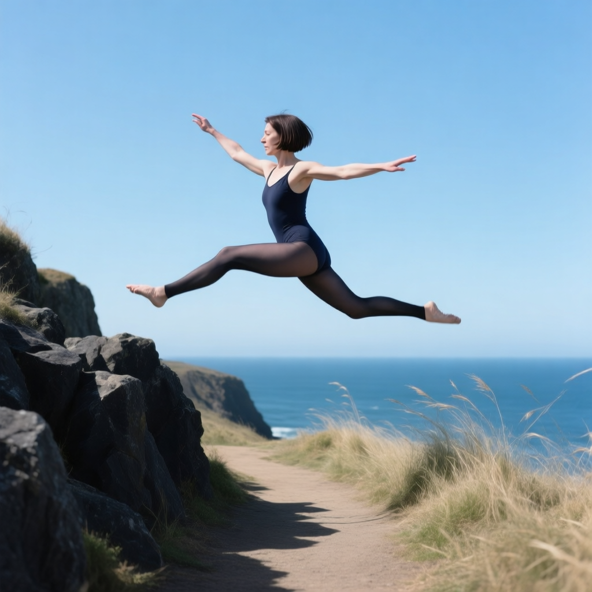
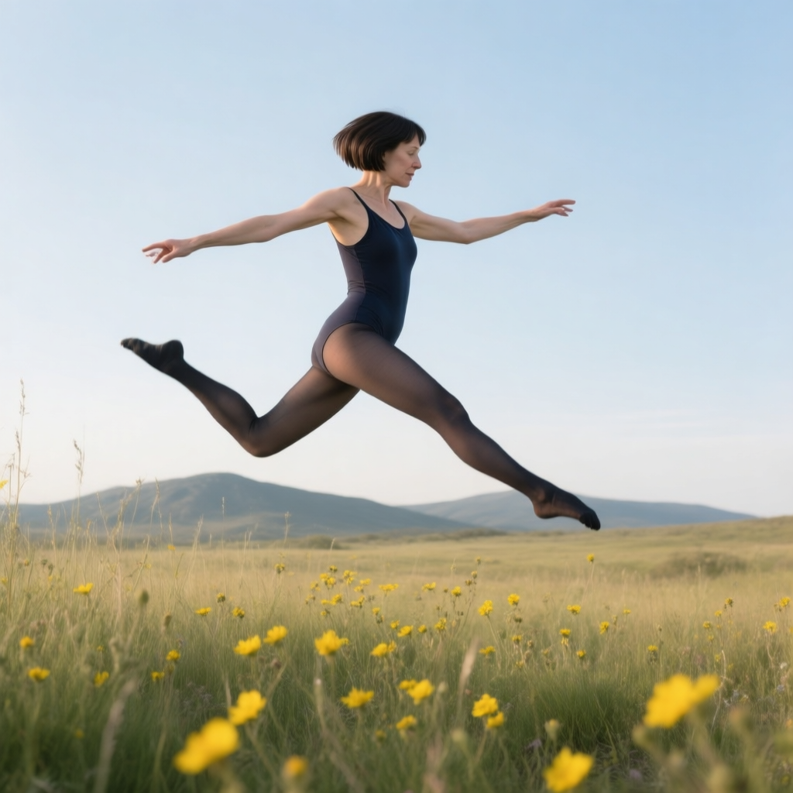
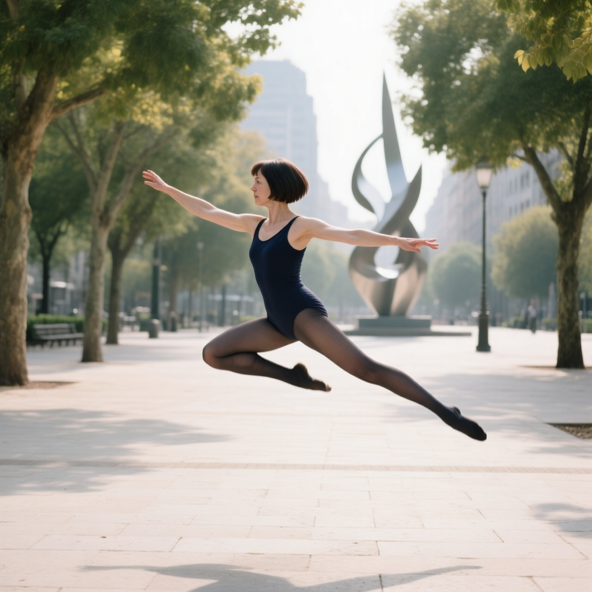
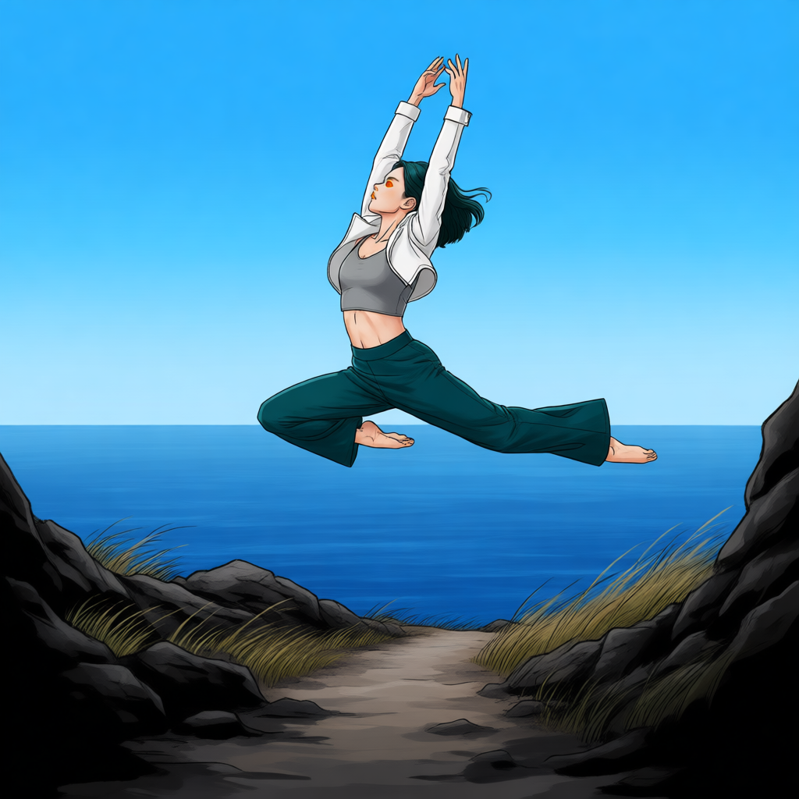
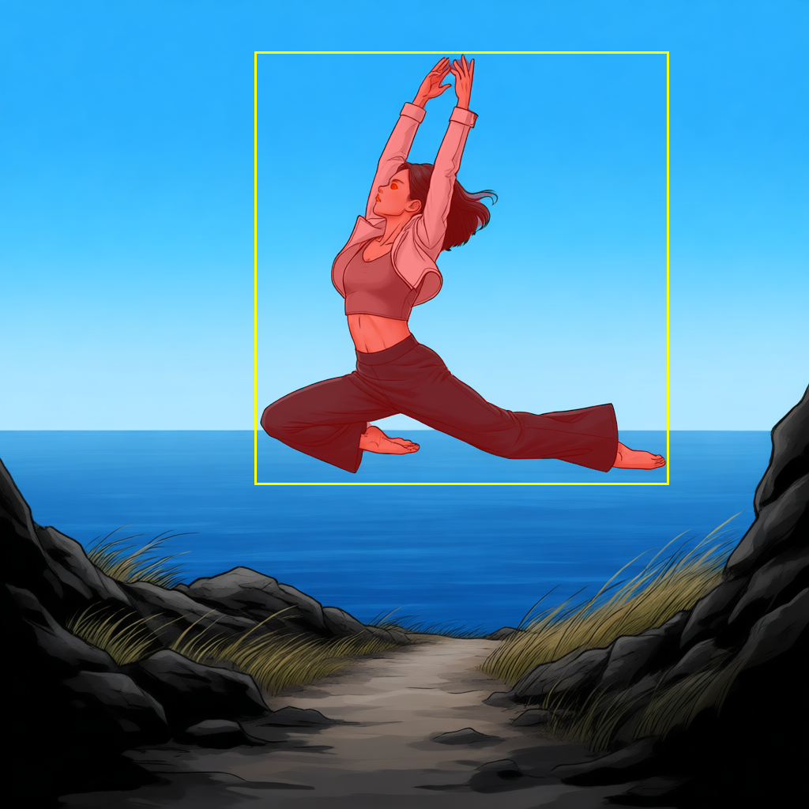

# P7-5.3 스토리보드 생성: 장면·카메라·마스크를 나누기

> Section ID: `P7-5.3`
> Version: `v2026.08.27`

P7-5.2가 같은 인물의 얼굴·착장·전신 구조를 따로 준비했다면, 이 절은 그 참조를 넣기 전에 장면 자체의 공간·카메라·편집 영역을 만든다. 작업은 하나의 큰 생성기가 아니라 세 개의 독립 코드로 나눈다. 먼저 장면을 만들고, 그 결과 한 장에서 카메라 앵글 하나를 바꾸고, 마지막으로 선택한 앵글 결과에서 인물 마스크를 만든다. 캐릭터 포즈는 배경과 카메라 문장에서 분리한 `--pose-description`으로 정의한다.

## 1. 장면 RGB와 상대 depth를 만든다

현재 스토리보드 생성기는 Qwen Image를 사용한다. 한 번의 text-to-image 생성으로 장면 RGB를 만들고, 같은 RGB에서 상대 depth를 추출한다. depth 추정에 실패하면 RGB만 남기지 않아 두 파일이 항상 같은 장면을 가리키게 한다.

장면은 같은 `--pose-description`을 세 야외 장소에 넣는다. 이 단계는 장소·인물·기본 프레이밍만 만들고, 카메라 축은 아직 바꾸지 않는다. 상대 depth는 같은 장면의 구조 보조 출력이며 별도 생성 단계가 아니다.

| 장면 | 카메라와 공간 |
| --- | --- |
| A | 바다와 바위·바람 부는 풀밭이 보이는 해안 절벽 산책로 |
| B | 야생화·키 큰 풀이 있고 낮은 산등성이가 보이는 넓은 초원 |
| C | 나무·석재 포장·현대 조형물이 있는 도심 공원 |

아래는 같은 포즈 설명과 장면별 seed로 실제 생성한 스토리보드 RGB다. 각 장면은 카메라·공간·동작 관계를 전달하는 단일 기준 이미지다.

| A 해안 절벽 산책로 | B 야생화 초원 | C 도심 공원 |
| --- | --- | --- |
|  |  |  |
| [result.json](../../../assets/part-07/chapter-05/p7-5-3-qwen-storyboard-scene-a-549191-seed-5420-steps-20-result.json) | [result.json](../../../assets/part-07/chapter-05/p7-5-3-qwen-storyboard-scene-b-837592-seed-5421-steps-20-result.json) | [result.json](../../../assets/part-07/chapter-05/p7-5-3-qwen-storyboard-scene-c-481118-seed-5422-steps-20-result.json) |

기본값은 장면별 seed A `5420`, B `5421`, C `5422`, 정사각형 `1024×1024`, 20 step이다. seed는 품질을 높이는 수치가 아니라, 카메라·사지 분리·공간 여백의 다른 해석을 비교하는 조작 변수다.

```bash
python docs/assets/part-07/chapter-05/p7_5_3_text_to_image_storyboard_spec.py \
  --scenes A B C --steps 20 --size 1024
```

GPU를 쓰기 전에는 `--dry-run`으로 예상 파일명을 확인할 수 있다. `--runs 3`은 시작 seed부터 연속 세 장면을 만든다.

```bash
python docs/assets/part-07/chapter-05/p7_5_3_text_to_image_storyboard_spec.py \
  --scene A --seed 5420 --runs 3 --dry-run
```

생성기는 RGB PNG, 상대-depth PNG, 그리고 model·seed·step·pose description·prompt·`prompt_word_count`·두 출력의 SHA-256을 담은 `result.json`을 쓴다.

<details id="p7-5-3-storyboard-generator" class="aibook-lazy-source" data-source="/AiBook/assets/part-07/chapter-05/p7_5_3_text_to_image_storyboard_spec.py" data-language="python">
<summary>1단계: Qwen A/B/C 장면 생성 코드 보기</summary>
<div class="aibook-lazy-source__body">Qwen Image로 RGB를 만들고, 같은 PNG에서 상대 depth를 추출합니다.</div>
</details>

## 2. 장면 하나에서 카메라 축 하나를 바꾼다

카메라 앵글 생성기는 1단계 RGB 한 장만 입력으로 받고, yaw 또는 pitch 중 하나만 바꾼다. yaw와 pitch를 한 프롬프트에 합치면 다중 앵글 LoRA가 프레임 전체를 불안정하게 회전시킨 관찰이 있었으므로, 복합 앵글은 이 코드의 입력으로 허용하지 않는다. 즉 고각·저각과 좌우 회전은 각각 별도 결과로 비교한다.

아래 명령은 A 장면을 기준으로 고각 한 장을 만든다. `--axis yaw --view quarter_left`처럼 바꾸면 좌측 45도 회전만 시험할 수 있다. `--dry-run`은 GPU를 사용하지 않고 입력·프롬프트·예상 파일명을 출력한다.

```bash
python docs/assets/part-07/chapter-05/p7_5_3_generate_camera_angle.py \
  --reference docs/assets/part-07/chapter-05/p7-5-3-qwen-storyboard-scene-a-549191-seed-5420-steps-20.png \
  --axis pitch --view high_angle --steps 8 --size 1024
```

<details id="p7-5-3-camera-angle-generator" class="aibook-lazy-source" data-source="/AiBook/assets/part-07/chapter-05/p7_5_3_generate_camera_angle.py" data-language="python">
<summary>2단계: Qwen Edit 카메라 앵글 생성 코드 보기</summary>
<div class="aibook-lazy-source__body">장면 PNG를 한 장만 받아 yaw 또는 pitch 하나를 변환하고, 입력·축·프롬프트·출력을 `result.json`에 기록합니다.</div>
</details>

## 3. 인물 제거용 마스크를 만든다

장면 전체를 입력한 Qwen Edit에 `Remove the person from Image 1.`만 지시했을 때, 인물은 남고 배경의 색조만 달라졌다. 편집할 대상이 화면에서 작지 않더라도 전역 지시만으로는 어떤 픽셀을 다시 그릴지 고정되지 않는다. 배경판을 만들 때는 인물 영역만 흰색으로 표시한 마스크를 함께 주고, 흰색 영역만 인페인트해야 한다.

이 단계의 입력은 2단계에서 선택한 카메라 앵글 PNG다. 예시 자산은 기존 정면 장면으로 만든 마스크이며, 실제 실행에서는 `--reference`에 카메라 앵글 결과를 넣는다. Apache-2.0인 Grounding DINO와 SAM 2.1 Hiera Small을 순차로 사용한다. 먼저 Grounding DINO가 `a woman` 또는 `a person`이라는 텍스트로 인물 상자를 찾고, SAM 2.1 Small이 그 상자 안에서 전신 윤곽을 마스크로 다듬는다. 두 모델을 동시에 GPU에 올리지 않으므로, 마스크 PNG를 저장한 뒤 Qwen 인페인트를 별도 실행할 수 있다.

```bash
python docs/assets/part-07/chapter-05/p7_5_3_generate_person_mask.py \
  --reference path/to/p7-5-3-qwen-camera-pitch-high-angle-v1-seed-5420-steps-8.png \
  --run-label high-angle-v1
```

| 1단계 장면 | 인물 마스크 오버레이 |
| --- | --- |
|  |  |
| [1단계 result.json](../../../assets/part-07/chapter-05/p7-5-3-qwen-storyboard-scene-a-character-plus90-character-features-dancer-leap-v4-seed-62294-steps-10-result.json) | [마스크 PNG](../../../assets/part-07/chapter-05/p7-5-3-sam2-person-mask-dancer-leap-v1.png) · [result.json](../../../assets/part-07/chapter-05/p7-5-3-sam2-person-mask-dancer-leap-v1-result.json) |

오버레이의 빨간 영역은 Qwen 인페인트에서 다시 그릴 인물이고, 검은 영역은 보존할 배경이다. 이 사례에서는 머리·손끝·몸통·양다리·발끝이 모두 빨간 영역에 들어갔다. 상자는 인물을 찾는 힌트일 뿐 최종 제거 영역이 아니므로, 결과를 확인할 때는 상자보다 마스크 외곽을 검수한다.

<details id="p7-5-3-person-mask-generator" class="aibook-lazy-source" data-source="/AiBook/assets/part-07/chapter-05/p7_5_3_generate_person_mask.py" data-language="python">
<summary>3단계: Grounding DINO와 SAM 2.1로 인물 마스크를 만드는 코드 보기</summary>
<div class="aibook-lazy-source__body">텍스트 검출 상자를 SAM 2.1 Small에 전달해 Qwen 인페인트용 흰색 인물 마스크와 검수 오버레이를 저장합니다.</div>
</details>

## 세 파일은 다음 단계의 입력만 넘긴다

장면 생성기는 RGB·상대 depth를, 카메라 생성기는 선택한 장면의 한 축 변환을, 마스크 생성기는 그 결과에서 다시 그릴 인물 영역을 남긴다. 각 결과 JSON에는 다음 코드가 읽을 입력 파일과 생성 조건을 함께 기록한다. 이 분리는 장면의 구도 문제, 앵글 변환 문제, 마스크 외곽 문제를 한 번에 섞지 않고 각각 확인하게 한다.

## 체크리스트

| 확인할 것 | 스스로 답할 질문 |
| --- | --- |
| 장면 | 장소·포즈·기본 프레이밍이 장면 RGB와 상대 depth에서 함께 읽히는가? |
| 카메라 | 한 결과에 yaw 또는 pitch 하나만 적용했고, 입력 장면이 명확한가? |
| 마스크 | 머리·손끝·몸통·발끝이 흰색 재생성 영역에 모두 들어가는가? |
| 재현 | model, seed, step, 입력 파일, prompt가 각 `result.json`에 남아 있는가? |
| 다음 입력 | 다음 코드가 읽을 PNG가 어느 단계에서 왔는지 구분되는가? |

## 출처와 참고 자료

- Qwen 실행 조건과 입력·출력 기록은 이 절에서 연결한 로컬 `result.json`에서 확인한다.
- 카메라 축 변환에 사용한 다중 앵글 LoRA 명령은 [Qwen Edit 2509 Multiple Angles 모델 카드](https://huggingface.co/dx8152/Qwen-Edit-2509-Multiple-angles){: target="_blank" rel="noopener noreferrer"}에서 확인한다. (확인: 2026-08-27)
- 인물 상자 검출에 사용한 Grounding DINO는 Apache-2.0으로 배포된다. [Grounding DINO 공식 저장소](https://github.com/IDEA-Research/GroundingDINO){: target="_blank" rel="noopener noreferrer"} (확인: 2026-08-27)
- 마스크 정밀화에 사용한 SAM 2.1 Hiera Small의 모델 카드와 가중치는 Apache-2.0으로 표시된다. [SAM 2.1 Hiera Small 모델 카드](https://huggingface.co/facebook/sam2.1-hiera-small){: target="_blank" rel="noopener noreferrer"}, [SAM 2 공식 저장소](https://github.com/facebookresearch/sam2){: target="_blank" rel="noopener noreferrer"} (확인: 2026-08-27)
- 얼굴·전신 참조의 역할 분리는 [P7-5.2](section-02.md)와 [P7-5.7](section-07.md)에서 확인한다.
