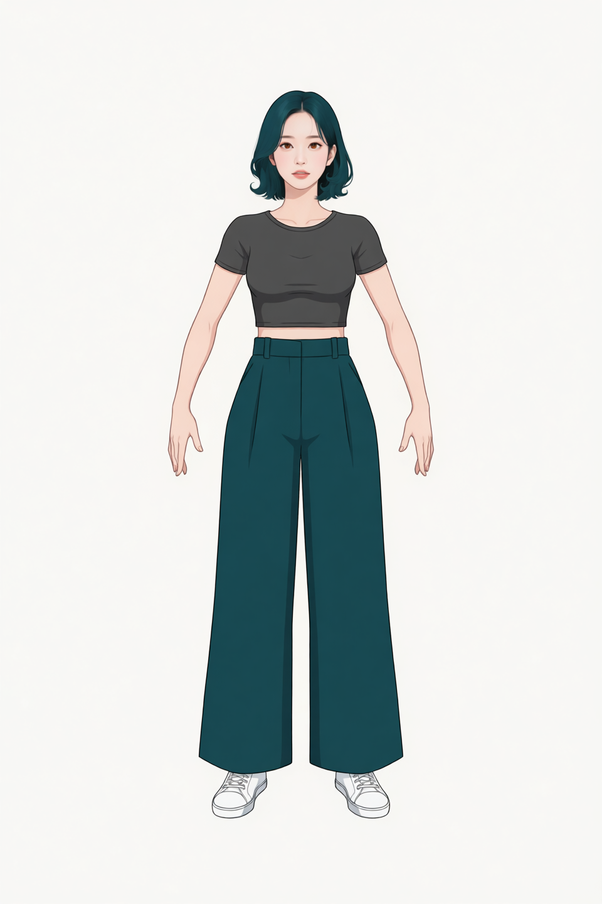
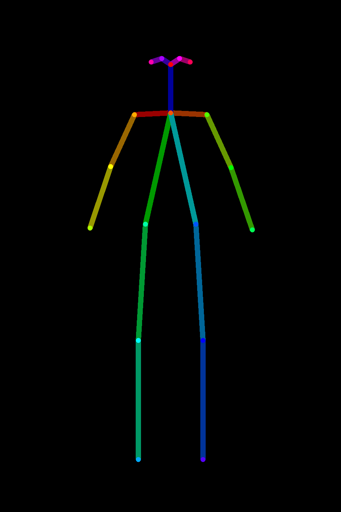
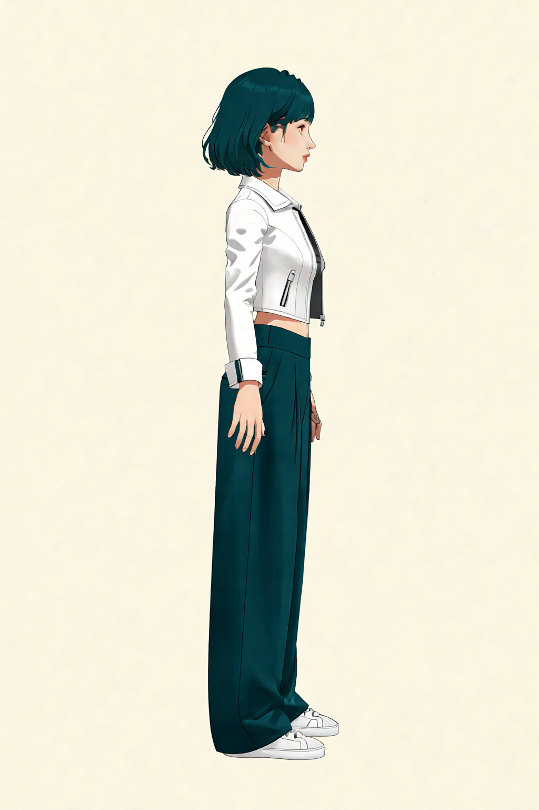
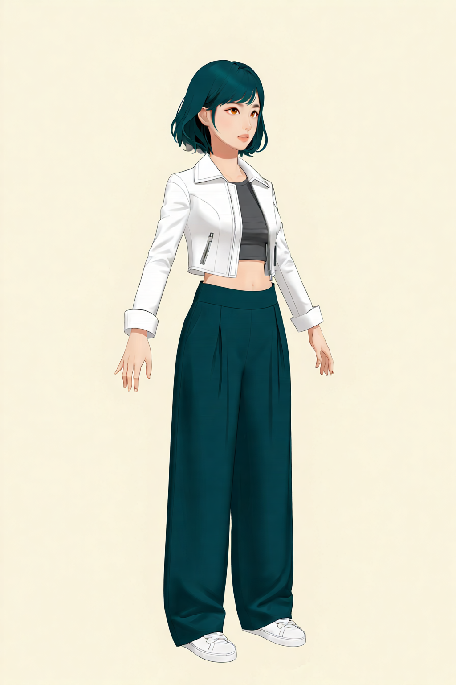
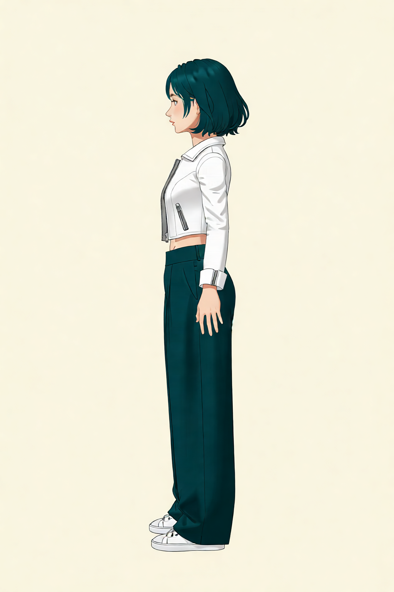
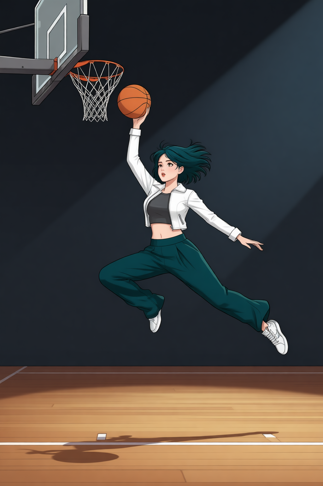

# P7-5.3 캐릭터 identity와 추가 페인팅으로 특징 완성하기

> Section ID: `P7-5.3`
> Version: `v2026.09.05`

같은 캐릭터를 다른 장면과 자세에서도 이어 그리려면, 얼굴·착장·전신 구조를 한 이미지나 한 프롬프트에 모두 맡기지 않아야 한다. 이 절에서는 [P7-5.2](section-02.md)의 얼굴 identity를 기준으로 두고, 전신 비례·기본 의상·재킷 같은 특징을 이전 결과 위에 한 단계씩 추가 페인팅하는 Qwen 편집 경로를 기록한다. 얼굴 정면 identity와 캐릭터 멀티플 뷰 생성은 P7-5.2에서 별도로 관리한다.

이 절의 질문은 간단하다. 캐릭터 identity를 잃지 않으면서 전신 비례·기본 의상·재킷·동작 같은 특징을 어떤 순서로 추가 페인팅해야 서로의 정보를 덮어쓰지 않을까?

## 한 이름으로 부르지 않는 실행 조합

P7-5.3의 결과는 이름이 하나인 단일 모델에서 나오지 않는다. 현재 이 절에 연결한 `result.json`에는 편집 모델, 로컬 실행용 양자화 transformer, 카메라 회전 전용 LoRA, 구조 guide를 만드는 OpenPose 도구가 서로 다른 역할로 기록된다. 이들을 모두 캐릭터를 만드는 모델이라고 부르면, 어느 조건을 바꿨을 때 결과가 달라졌는지 알 수 없다.

| 요소 | 현재 경로에서 맡긴 일 | 적용 범위 |
| --- | --- | --- |
| `Qwen/Qwen-Image-Edit-2511` | 얼굴·착장·구조 이미지를 함께 읽고, prompt가 지시한 전신 결과를 편집 | 1·2단계 착장 |
| `Qwen/Qwen-Image-Edit-2509` | 앞선 착장·토르소 입력을 함께 읽어 동적 전신을 편집 | 현재 연결한 앨리웁 실험 |
| BF16 순차 CPU offload | 공식 BF16 Qwen 모듈을 CPU에 두고, 추론 중 필요한 모듈만 GPU로 옮겨 실행 | 1·2단계 착장 |
| `Qwen-Edit-2509-Multiple-angles` LoRA | 2단계 착장 한 장에서 카메라 yaw만 바꾸는 보조 조건 | −90°·−45°·+45°·+90° 착장 |
| `controlnet_aux` OpenPose renderer | BODY_18 좌표를 정면 body-only 구조 PNG로 렌더링 | 최소 프롬프트 1단계의 전신 포즈·프레이밍 참조 |

Qwen-Image-Edit-2511은 여러 이미지 입력을 함께 읽어 편집하는 모델이다. 여기서는 정면 머리와 body-only OpenPose, 또는 앞 단계 착장과 정면 머리를 입력으로 두어 각 이미지가 맡는 정보를 분리했다. 이 절의 1단계는 native ControlNet 경로가 아니라 **body-only OpenPose PNG를 일반 이미지 참조로 넣는 편집 경로**를 사용했다. 따라서 구조 맵이 얼굴·의상 정보를 직접 보존한다고 해석하면 안 된다. 앨리웁 결과만 이전 2509 실행 기록으로 남아 있다. [Qwen-Image-Edit-2511 모델 카드](https://huggingface.co/Qwen/Qwen-Image-Edit-2511){: target="_blank" rel="noopener noreferrer"}

1·2단계 착장 생성기는 양자화 transformer를 교체하지 않고 공식 BF16 Qwen pipeline을 읽는다. `enable_sequential_cpu_offload()`는 현재 필요한 모듈만 GPU로 옮기고 나머지는 CPU에 보관한다. 따라서 메모리 사용량은 줄지만, 모듈 이동 때문에 생성 시간은 늘어난다. 이 설정은 캐릭터 identity를 강화하는 조건이 아니라 8GB GPU에서 BF16 실행을 가능하게 하는 런타임 선택이다. [Diffusers CPU offload 문서](https://huggingface.co/docs/diffusers/optimization/memory#cpu-offloading){: target="_blank" rel="noopener noreferrer"}

네 방향 착장에만 사용한 Multiple-angles LoRA는 `将镜头向左旋转45度。` 같은 짧은 카메라 지시를 보강한다. 이 LoRA에는 정면 2단계 착장 하나만 입력으로 넣었다. 얼굴 참조와 OpenPose를 함께 넣지 않은 이유는 LoRA가 담당해야 할 질문을 yaw 변화로 제한하기 위해서다. LoRA는 얼굴·헤어·관절·의상을 새 기준으로 정하는 모델이 아니며, 회전 결과에서도 그 정보는 원래 착장 참조와 이후의 별도 입력이 맡는다. [Multiple-angles LoRA 모델 카드](https://huggingface.co/dx8152/Qwen-Edit-2509-Multiple-angles){: target="_blank" rel="noopener noreferrer"}

OpenPose renderer도 생성 모델과 구분한다. 이 도구는 정규화한 BODY_18 관절 좌표를 색 선과 점으로 렌더링할 뿐, 캐릭터의 얼굴·옷·화풍을 생성하지 않는다. 최소 프롬프트 1단계에서는 이 맵을 일반 이미지 참조로 넣어 포즈와 프레이밍만 맡긴다. 생성 결과가 이를 얼마나 따르는지는 별도 오버레이로 비교한다. [ComfyUI ControlNet Auxiliary Preprocessors](https://github.com/Fannovel16/comfyui_controlnet_aux){: target="_blank" rel="noopener noreferrer"}

## 한 이미지에 모든 조건을 맡기지 않는다

얼굴, 의상, 자세, 회전을 계속 같은 입력으로 삼으면 한 조건을 고치는 동안 다른 조건도 바뀌기 쉽다. 아래 표는 이미지 이름만으로 역할을 추정하지 않고, 각 생성 `result.json`의 `inputs`, `output`, prompt를 기준으로 정리한다.

| `result.json`에서 확인한 자산 | 기록된 역할 | 확인된 사용 범위 |
| --- | --- | --- |
| P7-5.2 정면 머리 PNG | 얼굴과 헤어 identity | 1단계·2단계 착장의 두 번째 입력 |
| 1단계 전신 착장 출력 | 회색 크롭탑, 와이드 팬츠, 흰 운동화와 정면 전신 비례 | 2단계 착장의 첫 번째 입력 |
| 2단계 전신 착장 출력 | 열린 흰 크롭 재킷, 손, 1단계 착장·비례 | 네 방향 yaw 착장의 유일한 입력, 앨리웁의 첫 번째 입력 |
| 정면 body-only OpenPose PNG | BODY_18 기반 전신 포즈와 프레임 안 관절 위치 | 최소 프롬프트 1단계의 첫 번째 입력 |
| P7-5.2 정면 토르소 PNG | 얼굴·헤어·선과 음영 | 앨리웁의 두 번째 입력 |
| 네 방향 yaw 착장 출력 | 정면 2단계 착장을 카메라 yaw만 바꾼 관찰 결과 | 현재 연결한 `result.json`에서는 다음 생성의 입력으로 사용하지 않음 |

따라서 정면 머리 참조와 정면 토르소 참조는 사용되는 생성 단계가 다르며, 모두 의상·신체 비례를 정하지 않는다. 착장 이미지는 얼굴 identity를 다시 정하지 않고, OpenPose는 얼굴·손가락·의상 픽셀이 없는 전신 포즈·프레이밍 참조로만 쓴다. 네 방향 yaw 이미지는 현재 결과에서 회전 관찰용 출력일 뿐, 다음 생성의 기준 입력으로 재사용하지 않는다. 새 입력을 더할 때는 먼저 이 표의 기존 역할과 겹치는지 확인한다.

## 기본 의상은 얼굴 참조와 구조 맵으로 만든다

압축 프롬프트 1단계는 양팔을 자연스럽게 내린 정면 body-only OpenPose를 첫 입력으로, P7-5.2에서 BF16으로 만든 1280×1280 정면 Mira 머리를 두 번째 입력으로 사용한다. 첫 입력은 엄격한 정면 포즈와 프레이밍만, 두 번째 입력은 Mira identity만 맡는다. 착장은 회색 마이크로 크롭티·딥틸 하이웨이스트 와이드 팬츠·흰 로우탑 스니커즈와 양팔·양손의 완결만 짧은 긍정 지시로 더한다.

[1단계 960×1440, 10-step result.json](/AiBook/assets/part-07/chapter-05/p7-5-3-qwen-edit-prompt-style-outfit_stage1_face_openpose-bf16-2511-openpose-waist-up-legs-down-arms-v9-seed-62294-steps-10-result.json)

## 자켓은 다음 단계에서 더한다

2단계는 1단계 전신 착장 결과와 같은 P7-5.2 BF16 1280×1280 정면 Mira 머리 참조만 사용한다. OpenPose를 다시 넣지 않아 1단계에서 정한 바지·신발·비례와 경쟁하지 않게 한다. 이 단계에서는 앞판이 서로 닿지 않는 열린 흰 크롭 재킷, 접혀 내려오는 칼라, 손목까지 오는 소매와 소매 끝 아래의 양손을 더한다. 회색 크롭티의 몸통과 맨허리 띠는 보이게 하고, 이너 소매는 재킷 밖으로 드러나지 않게 한다.

[2단계 960×1440, 30-step result.json](/AiBook/assets/part-07/chapter-05/p7-5-3-qwen-edit-prompt-style-outfit_stage2_jacket_face-long-trousers-folded-collar-v3-seed-62294-steps-30-result.json)

[정면 착장 1~2단계 Python 생성기](/AiBook/assets/part-07/chapter-05/p7_5_3_qwen_edit_outfit_stages.py)

## OpenPose는 전신 비율과 프레이밍만 정한다

정면 body-only OpenPose는 2단계 전신의 프레임을 기준으로 머리·어깨·골반 폭을 유지한 v7 맵이다. 이전 긴 다리 템플릿에서 다리 비중의 10%를 상체·허리 구간으로 옮겨, 전체 키는 그대로 두고 허리는 길게·다리는 짧게 조정했다. 전체 키는 90%로 축소해 960×1440 캔버스에 다시 렌더링했으며, 선과 관절은 각각 반폭·반지름 7px로 키웠다. 양팔은 바깥쪽 아래로 벌려 손목이 몸통 밖에 남는다. 이 맵은 캐릭터 방향을 만드는 장치가 아니라, 생성 결과의 머리·몸통·다리 비율과 화면 안 위치를 비교하는 기준이다.

[정면 v7 OpenPose 좌표 JSON](/AiBook/assets/part-07/chapter-05/p7-5-3-openpose-fullbody-stage2-open-arms-short-long-legs-v7-yaw+00_pitch+00.json)

[정면 v7 OpenPose result.json](/AiBook/assets/part-07/chapter-05/p7-5-3-openpose-fullbody-stage2-open-arms-short-long-legs-v7-result.json)

FACE_70처럼 턱선·눈·코·입을 모두 포함한 점군은 얼굴 기하를 다시 지정해 토르소의 얼굴형과 경쟁하므로 현재 입력에서 제외한다.

## 회전한 착장은 카메라 조건만 바꾼다

방향이 바뀌면 의상이 몸을 가리는 방식이 달라진다. 이 회전 실험은 정면 2단계 착장에서 재킷·크롭티·팬츠·스니커즈·손의 가림 관계가 어떻게 바뀌는지만 대조한다. 다방향 OpenPose를 추가해 인체의 회전까지 고정하려고 하지 않았다.

정면 2단계 착장을 유일한 이미지 입력으로 사용하고, 멀티플 앵글 LoRA의 카메라 yaw 지시만 더해 네 방향의 착장을 만들었다. 얼굴 identity나 관절 구조를 별도 이미지로 중복 지시하지 않았다.

| −90° 2단계 착장 | −45° 2단계 착장 |
| --- | --- |
|  |  |

| +45° 2단계 착장 | +90° 2단계 착장 |
| --- | --- |
|  |  |

[2단계 착장 `yaw −90°` result.json](/AiBook/assets/part-07/chapter-05/p7-5-3-qwen-outfit-stage2-yaw_minus_90-multiple-angle-v1-seed-62294-steps-8-result.json)

[2단계 착장 `yaw −45°` result.json](/AiBook/assets/part-07/chapter-05/p7-5-3-qwen-outfit-stage2-yaw_minus_45-multiple-angle-v1-seed-62294-steps-8-result.json)

[2단계 착장 `yaw +45°` result.json](/AiBook/assets/part-07/chapter-05/p7-5-3-qwen-outfit-stage2-yaw_plus_45-multiple-angle-v1-seed-62294-steps-8-result.json)

[2단계 착장 `yaw +90°` result.json](/AiBook/assets/part-07/chapter-05/p7-5-3-qwen-outfit-stage2-yaw_plus_90-multiple-angle-v1-seed-62294-steps-8-result.json)

[전신 착장 yaw 회전 Python 생성기](/AiBook/assets/part-07/chapter-05/p7_5_3_qwen_rotate_fullbody_outfit.py)

향후 회전 자산은 `Qwen/Qwen-Image-Edit-2511`과 `fal/Qwen-Image-Edit-2511-Multiple-Angles-LoRA`로 재생성한다. 생성기는 2단계 정면 착장 한 장을 유일한 이미지 입력으로 두고, `yaw_minus_90`, `yaw_minus_45`, `yaw_plus_45`, `yaw_plus_90`마다 `<sks> [azimuth] [elevation] [distance]` 형식의 카메라 조건만 적용한다. OpenPose와 별도 얼굴 참조를 넣지 않으며, 입력 착장이 의상·전신 비례를, Multiple-Angles LoRA가 카메라 yaw를 맡는다. 이 형식과 카메라 방향 이름은 [fal Multiple-Angles LoRA 모델 카드](https://huggingface.co/fal/Qwen-Image-Edit-2511-Multiple-Angles-LoRA){: target="_blank" rel="noopener noreferrer"}를 따른다. 2511의 이미지 편집·일관성 기능은 [Qwen-Image-Edit-2511 모델 카드](https://huggingface.co/Qwen/Qwen-Image-Edit-2511){: target="_blank" rel="noopener noreferrer"}에서 확인한다. 현재 표와 `result.json`은 이전 2509 실험 기록이므로, 새 2511 산출물로 대체하기 전까지 2511의 품질 근거로 해석하지 않는다.

## 동적 장면은 전신 기준을 조합해 시험한다

정면 2단계 착장은 전신 의상·비례를, P7-5.2 정면 토르소는 얼굴·헤어·선과 음영을 맡긴다. 이 두 이미지만 입력으로 넣어 실내 코트에서 공중에 뜬 앨리웁 직전 동작을 만들었다. 공 하나를 든 오른팔, 균형을 잡는 왼팔, 앞쪽으로 든 왼 무릎과 뒤로 뻗은 오른다리를 짧게 지시했다.

[앨리웁 1024×1536, 20-step result.json](/AiBook/assets/part-07/chapter-05/p7-5-3-qwen-edit-fullbody-alley-oop-v1-seed-62294-steps-20-result.json)

[앨리웁 전신 Python 생성기](/AiBook/assets/part-07/chapter-05/p7_5_3_qwen_edit_fullbody_alley_oop.py)

이 결과는 정면 기준을 대체하지 않는다. 전신 참조 두 장으로도 공중 자세와 농구 장면을 만들 수 있는지 살피는 실험이며, 장면·소품·동작의 일치는 다음 생성에서 다시 비교한다.

## 캐릭터 입력 역할을 점검한다

| 확인할 것 | 스스로 답할 질문 |
| --- | --- |
| 역할 | 얼굴·헤어, 의상·손, 관절·프레이밍 중 무엇을 어느 입력이 맡는가? |
| 충돌 | 새 입력이 기존 입력의 얼굴형·착장·관절 역할을 다시 지정하지 않는가? |
| 전신 구조 | 정면 body-only guide가 머리·어깨·골반·다리의 비율과 프레임 안 위치만 정하는가? |
| 재현 | seed, step, 입력 자산, prompt와 `prompt_word_count`가 `result.json`에 남아 있는가? |
| 다음 비교 | 새 구도·장면·소품에서 무엇이 유지됐고 무엇이 달라졌는가? |

## 출처와 참고 자료

- 전신·착장·OpenPose의 실행 조건은 이 절에서 연결한 로컬 `result.json`에서 확인한다.
- 캐릭터 멀티플 뷰 생성의 identity·카메라 앵글 기준은 [P7-5.2](section-02.md)에서 확인한다.
- Qwen, [Qwen-Image-Edit-2509 모델 카드](https://huggingface.co/Qwen/Qwen-Image-Edit-2509){: target="_blank" rel="noopener noreferrer"}. 다중 이미지 입력, 인물 편집 일관성, native ControlNet 조건의 공개 기능을 확인했다. 확인일: 2026-09-01.
- nunchaku, [nunchaku-qwen-image-edit-2509 모델 카드](https://huggingface.co/nunchaku-ai/nunchaku-qwen-image-edit-2509){: target="_blank" rel="noopener noreferrer"}. FP4 r128 양자화 transformer와 품질·속도 차이를 확인했다. 확인일: 2026-09-01.
- dx8152, [Qwen-Edit-2509-Multiple-angles 모델 카드](https://huggingface.co/dx8152/Qwen-Edit-2509-Multiple-angles){: target="_blank" rel="noopener noreferrer"}. 현재 연결한 2509 yaw 실험의 카메라 지시·기반 모델을 확인했다. 확인일: 2026-09-01.
- fal, [Qwen-Image-Edit-2511-Multiple-Angles-LoRA 모델 카드](https://huggingface.co/fal/Qwen-Image-Edit-2511-Multiple-Angles-LoRA){: target="_blank" rel="noopener noreferrer"}. 향후 재생성 코드의 `<sks> [azimuth] [elevation] [distance]` 조건과 방향 이름을 확인했다. 확인일: 2026-09-01.
- Qwen, [Qwen-Image-Edit-2511 모델 카드](https://huggingface.co/Qwen/Qwen-Image-Edit-2511){: target="_blank" rel="noopener noreferrer"}. 향후 회전 재생성에 쓰는 편집 모델과 공개된 일관성 개선을 확인했다. 확인일: 2026-09-01.
- Fannovel16, [ComfyUI ControlNet Auxiliary Preprocessors](https://github.com/Fannovel16/comfyui_controlnet_aux){: target="_blank" rel="noopener noreferrer"}. OpenPose renderer는 구조 hint 이미지를 만드는 전처리 도구라는 역할을 확인했다. BODY_18 좌표의 정규화·프레이밍은 이 절의 로컬 생성 코드와 `result.json`이 근거다. 확인일: 2026-09-01.
