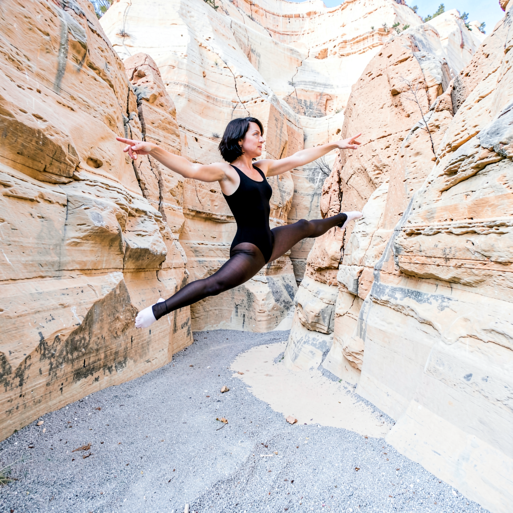
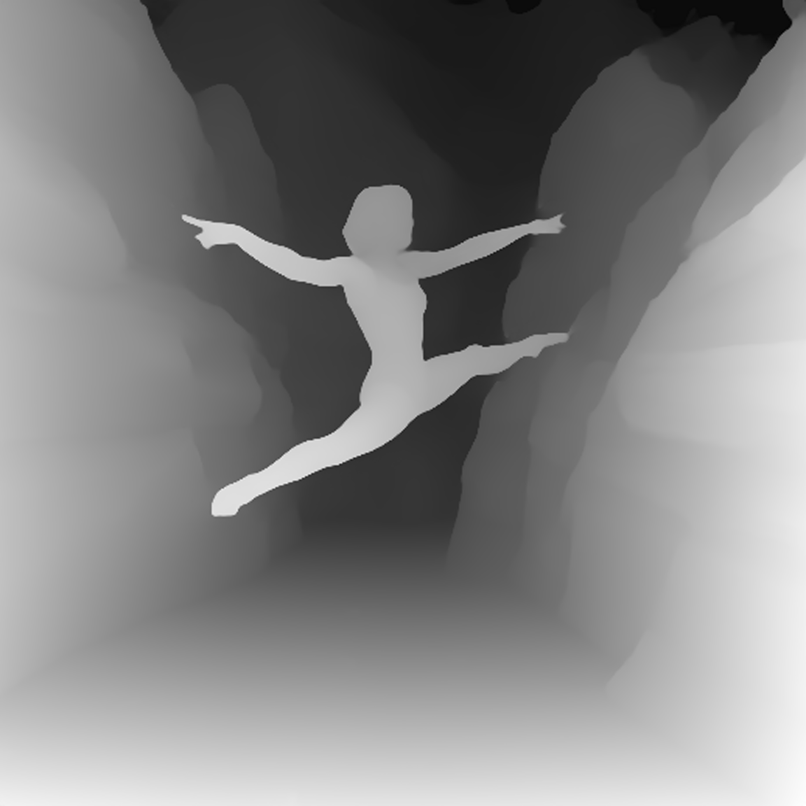
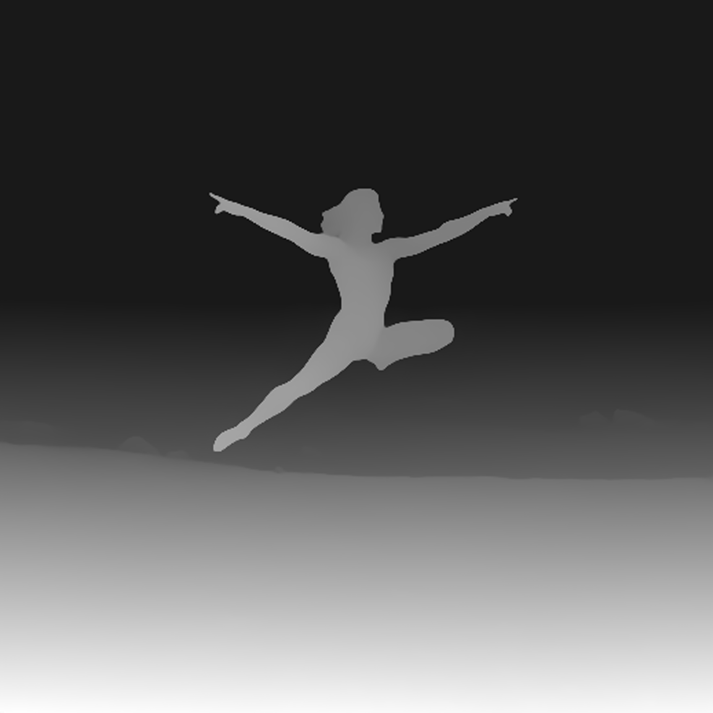
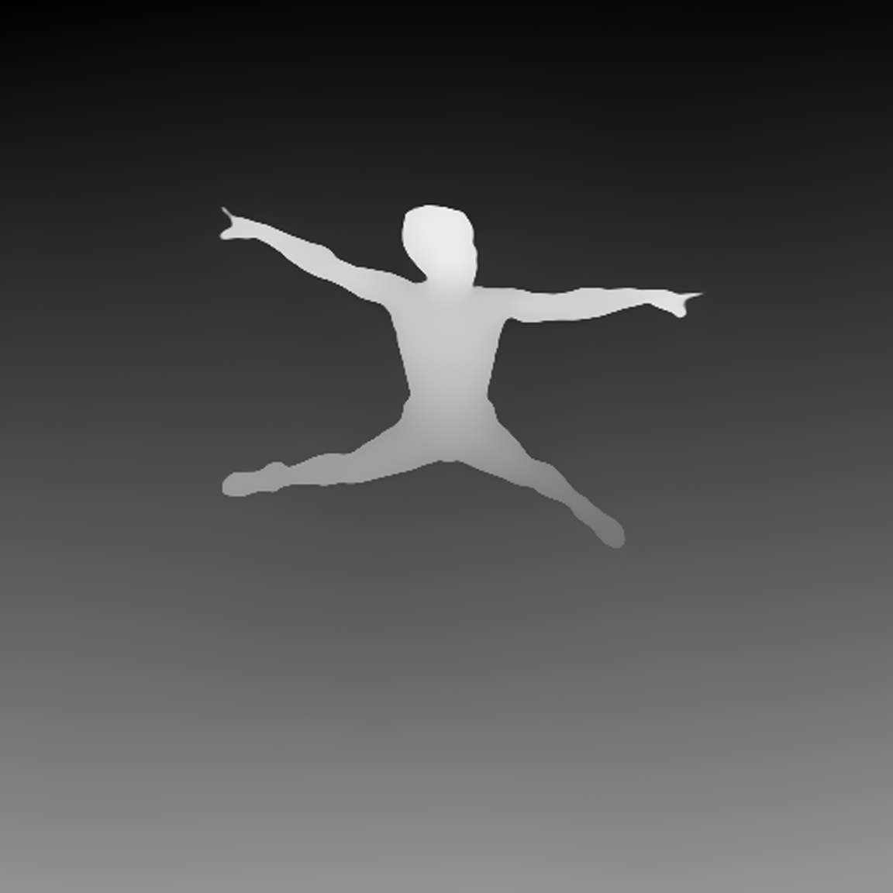
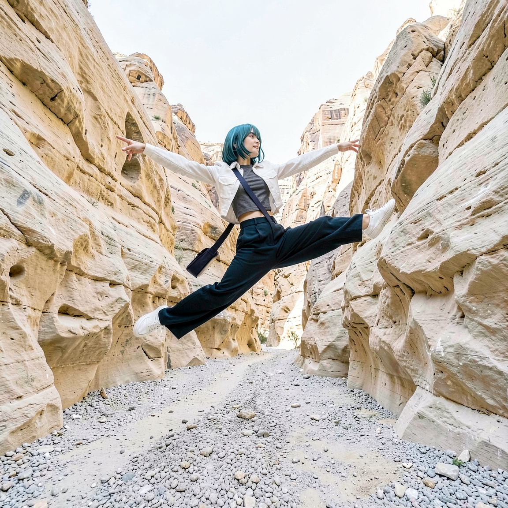
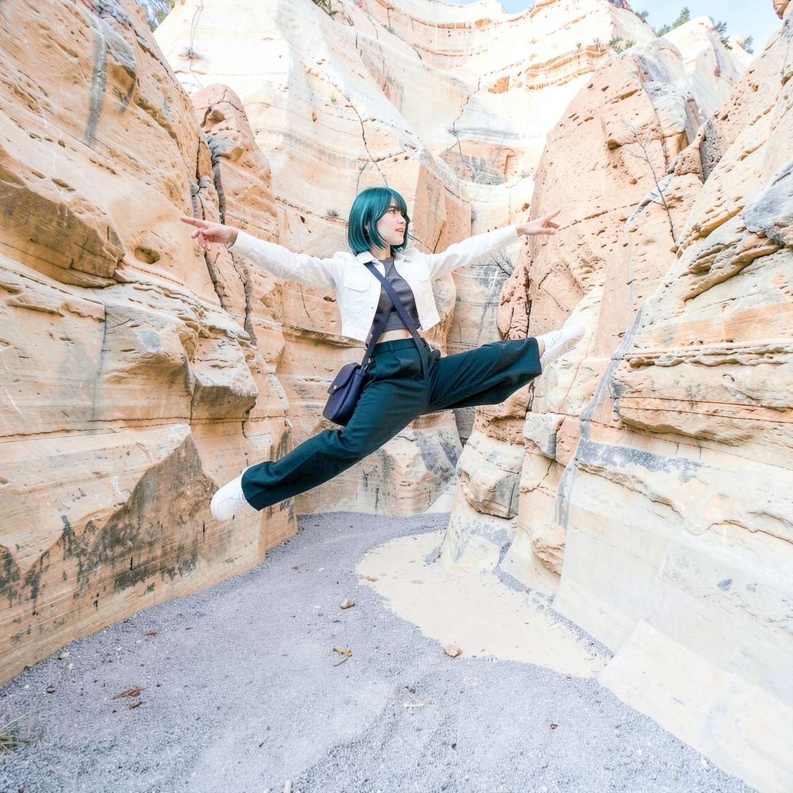
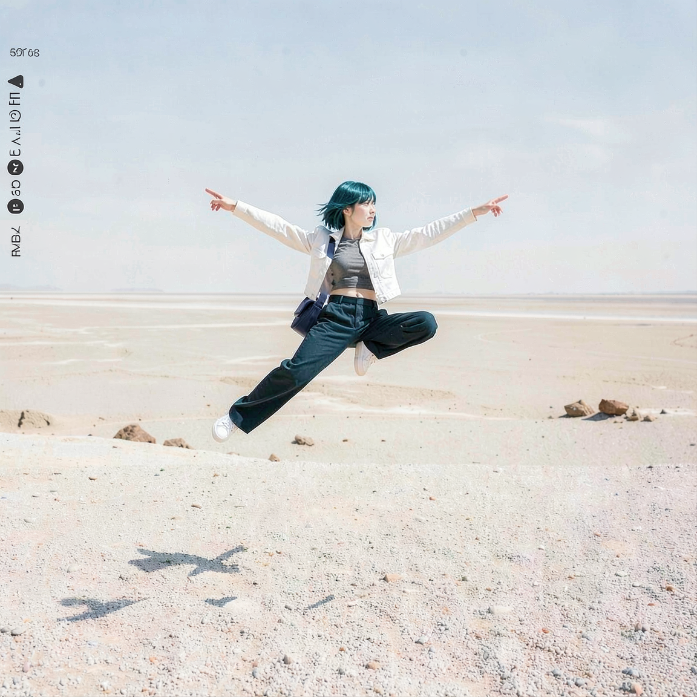
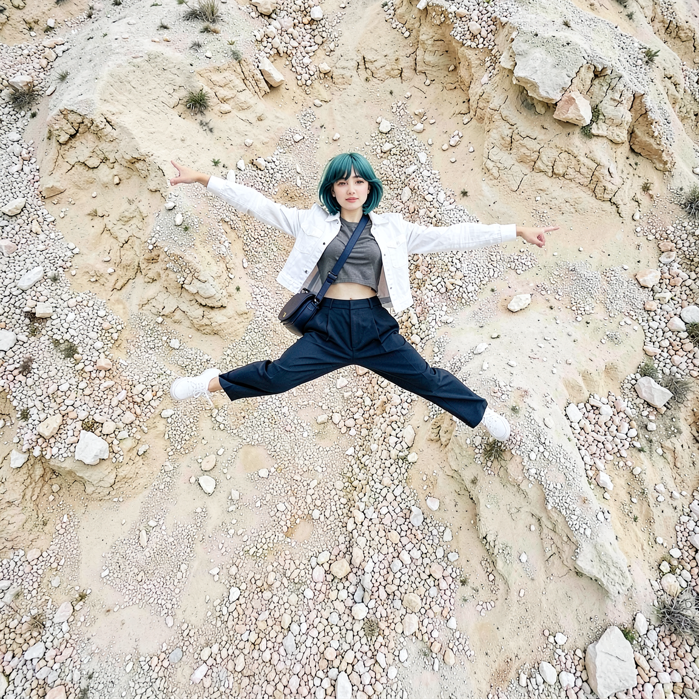
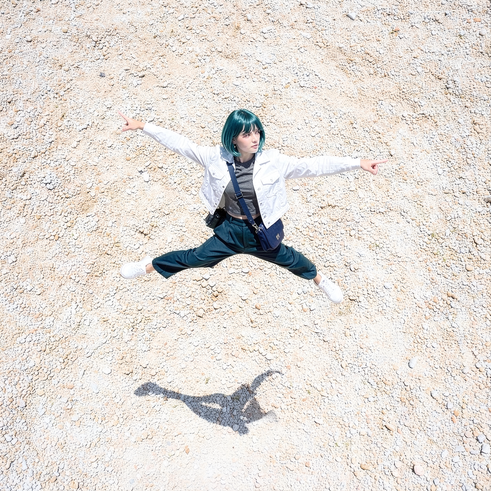

# P7-5.3 스토리보드 생성: FLUX 후보를 guide 이전에 검수하기

> Section ID: `P7-5.3`
> Version: `v2026.08.18`

이 절의 목적은 예쁜 한 장을 고르는 일이 아니라, 이후 단계가 믿고 읽을 수 있는 장면 기준을 만드는 일이다. 스토리보드의 인체·발·절벽·앞뒤 관계가 무너지면, 그 PNG에서 뽑은 Canny·상대 depth도 같은 오류를 구조 조건으로 전달한다. 따라서 후보 생성, 사람 승인, guide 추출, 참조 비교를 차례로 분리하며, 형상이 읽히지 않는 출력은 guide로 넘기지 않고 폐기한다.

## FLUX 후보는 장면 계약과 분리해 검수한다

현재 생성 경로는 FLUX.2 Klein 4B만 사용한다. 인체·가림·접지 검수를 통과한 PNG만 다음 guide 단계로 넘긴다.

이 절에서는 같은 전진 도약을 세 공간과 시점으로 나눈다. **A씬**은 협곡 바닥 가까이에서 올려다보는 넓은 로우앵글로 현대무용수와 벽 사이 간격을 함께 담는다. 각 prompt와 판정 기록은 독립된 장면 계약으로 유지한다.

**B씬**은 A씬과 동일한 인물·도약 동작·시선을 유지하면서 공간 규모와 인물 비율을 바꾼다. 먼 거리의 와이드 설정 숏으로 인물 전신을 화면 높이의 약 35~40%만 차지하게 하고, 위·아래·좌·우에 넉넉한 여백을 둔다. 좁고 높은 협곡 대신 낮은 수평선까지 사암·자갈 바닥이 멀리 이어지고, 작은 암석 지형만 원경에 놓인 열린 공간을 사용한다. 가까운 절벽이나 벽이 화면을 둘러싸지 않게 하므로, A/B 비교에서는 동일 동작이 공간 규모에 따라 어떻게 읽히는지 확인한다.

**C씬**은 B씬의 넓은 사암·자갈 공간과 동일 동작을 유지하면서 카메라를 수직 오버헤드로 옮긴다. 인물은 화면 높이 약 40%를 목표로 한다. Prompt의 높이 계약은 `높이 떠 있는 인물·멀리 떨어진 작고 부드러운 전신 그림자`만 남긴다. 수평선 없이 주변 지면과 자연스러운 원근 단축이 보이게 하며 사지 수 기준은 그대로 적용한다. B/C 비교에서는 열린 공간을 고정하고 시선 방향만 지상 원경에서 수직 하향으로 바꾼다.

| 고정 항목 | FLUX.2 Klein 4B |
| --- | --- |
| 장면별 seed | A `5420`, B `5421`, C `5422` |
| 해상도·step | `1152 x 1152`, 단일 생성 6 step |
| 인물 | 턱선 길이 단발, 긴 머리·포니테일 제외 |
| 자세·시선 | 인물은 화면 오른쪽 앞으로 높이 뛰며, 점프 정점에서 오른다리를 곧게 앞으로, 왼다리를 곧게 뒤로 뻗어 앞뒤로 크게 찢는 스플릿 점프를 한다. 팔 자세는 오른팔을 화면 오른쪽으로 뻗는 조건 하나만 둔다. 정확히 두 팔·두 손·두 다리·두 발만 요구하며 눈과 얼굴은 화면 오른쪽을 본다. |
| 공간 | 밝은 사암·자갈의 자연 계곡 바닥이 절벽 사이로 이어짐. 기암절벽은 인물의 양옆과 뒤에 솟지만 벽 사이와 인물 외곽에 넓고 읽을 수 있는 간격을 둠 |

스토리보드 생성 코드는 한 번의 text-to-image 호출로 인물과 공간이 포함된 완성 RGB를 직접 만들고, 그 RGB에서 상대 depth를 추출한다. 따라서 생성 단계는 하나이며 중간 캐릭터 PNG나 배경 편집 입력을 만들지 않는다. 기본 해상도는 `1152×1152`다. 최종 산출물은 **RGB와 상대 depth 두 종류로 항상 함께 출력**한다. depth 생성에 실패하면 RGB 단독 결과도 남기지 않아 두 파일의 대응 관계를 지킨다. 기본 생성 반복 수는 6 step이며 `--steps`로 조정한다. 단계별 preview는 기본적으로 끄고 `--preview-every 1`처럼 명시했을 때만 저장한다. 생성 성공은 통과가 아니며, 다음 질문에 모두 답할 수 있을 때만 PNG를 승인한다.

```bash
python docs/assets/part-07/chapter-05/p7_5_3_text_to_image_storyboard_spec.py \
  --scene A --seed 5420 --runs 1 --steps 6

python docs/assets/part-07/chapter-05/p7_5_3_text_to_image_storyboard_spec.py \
  --scene B --seed 5421 --runs 1 --steps 6

python docs/assets/part-07/chapter-05/p7_5_3_text_to_image_storyboard_spec.py \
  --scene C --seed 5422 --runs 1 --steps 6
```

## 스토리보드 생성기는 한 장면 계약만 다룬다

카메라 앵글·렌즈 화각·피사계 심도의 조합 실험은 기본 생성기에서 제거했지만, 장면 계약으로 고정한 시점은 선택할 수 있다. 이 코드는 동일한 도약 동작에서 A씬의 협곡, B씬의 열린 지상 원경, C씬의 열린 수직 오버헤드를 선택해 한 단계로 완성 RGB를 생성한다. 기본 seed는 A `5420`, B `5421`, C `5422`다. 공통 이름은 `p7-5-3-scene-c-482731-seed-5422-s6`처럼 씬→실행 코드→seed→step 순서로 구성한다. 뒤에는 `-00-contract.json`, `-01-storyboard-rgb.png`, `-02-storyboard-depth.png`를 붙인다. 계약에는 전체 prompt, 공백 기준 `prompt_word_count`, 실행 조건, `scene_id`, 산출물별 파일명과 depth 모델을 기록한다. 실제 실행 로그에도 같은 단어 수를 출력한다.

Prompt의 공통 인체 계약은 한 사람, 정확히 두 팔과 두 다리로 압축한다. 팔은 오른팔이 진행 방향을 가리킨다는 조건만 남기고, 다리는 한쪽이 진행 방향 앞으로 곧게, 다른 쪽이 뒤로 곧게 뻗는 앞뒤 스플릿만 남긴다. 손·발 총수, 관절 연결, 좌우 해부학 설명과 출력 규격에서 이미 정한 RGB·정사각형 표현은 제거한다. 씬별 문장은 A의 로우앵글 협곡과 B의 작은 인물·열린 수평선, C의 오버헤드·원거리 그림자 차이만 추가한다. 현재 생성기 기준 공백 단어 수는 A 82, B 77, C 77이다. 단어 수 감소나 자세 제약 축소가 인체 품질 개선을 보장하지는 않으므로 계약의 `prompt_word_count`와 실제 사지 검수를 함께 비교한다.

GPU를 쓰기 전에 `--dry-run`으로 후보 순서와 파일명을 확인할 수 있다.

```bash
python docs/assets/part-07/chapter-05/p7_5_3_text_to_image_storyboard_spec.py \
  --seed 5420 --runs 3 --dry-run
```

## seed는 후보 수만 늘린다

한 seed의 통과는 한 장면 후보의 관찰일 뿐이다. 같은 모델·prompt·해상도·step을 고정한 채 seed만 바꾸면 카메라의 세부 해석, 팔과 다리의 분리, 발의 접지, 절벽과 인물의 간격이 다른 콘티 후보로 나타난다. 이때 seed는 품질을 올리는 숫자가 아니라 **검수할 후보를 늘리는 조작 변수**다.

`--runs`는 시작 seed부터 연속된 후보를 만든다. 예를 들어 FLUX에서 `5420`부터 세 장을 비교하려면 다음처럼 실행한다. 각 PNG는 사람 검수 전까지는 후보일 뿐이며, 가장 예쁜 결과가 아니라 인체·가림·접지·공간 기준을 모두 만족한 결과 하나만 승인한다.

```bash
python docs/assets/part-07/chapter-05/p7_5_3_text_to_image_storyboard_spec.py \
  --seed 5420 --runs 3
```

## 승인 전에는 guide를 만들지 않는다

다음 항목 하나라도 실패하면 원칙적으로 PNG를 승인하거나 guide로 넘기지 않는다. 다만 사람이 남은 차이를 확인하고 장면 비교 기준으로 명시적으로 승인한 경우에는, 그 관찰점과 계약 JSON을 이미지 옆에 함께 남긴다.

| 확인 항목 | 통과 기준 |
| --- | --- |
| 인체 | 두 팔·두 다리·머리·몸통의 연결이 한 사람으로 읽힘 |
| 자세와 가림 | 앞뒤로 뻗은 두 다리와 양팔이 한 사람의 공중 스플릿으로 읽힘 |
| 발과 공간 | 두 발 외곽이 지면·절벽과 구분되고, 가까운 지형이 인물을 삼키지 않음 |
| 기준 정보 | 짧은 단발과 검정 레오타드·타이즈가 다음 작화 단계의 최소 기준으로 읽힘 |

사람 검수로 통과한 스토리보드 파일을 명시할 때만 guide를 만든다. 이 분리는 불완전한 인체나 지형의 오류가 후속 ControlNet·참조 병합의 입력으로 굳어지는 것을 막는다.

```bash
python docs/assets/part-07/chapter-05/p7_5_3_text_to_image_storyboard_spec.py \
  --derive-guides-from docs/assets/part-07/chapter-05/p7-5-3-scene-a-approved-storyboard-rgb.png \
  --output-dir docs/assets/part-07/chapter-05
```

압축한 최종 prompt로 생성한 A/B/C 결과를 사람 검수로 승인했다. 세 결과는 각각 고정 seed와 실행 계약 JSON을 별도 소스로 보존하고, 아래 표에서는 RGB와 상대 depth의 대응 관계만 한 행에서 비교한다. 이 승인은 세 장면의 현재 스토리보드 기준을 고정한다는 뜻이며, 다른 seed·카메라·동작까지 자동으로 통과한다는 뜻은 아니다.

| 승인 장면 | RGB | 상대 depth |
| --- | --- | --- |
| A씬 — 넓은 협곡 |  |  |
| B씬 — 열린 지상 원경 |  |  |
| C씬 — 열린 수직 오버헤드 |  |  |

A씬은 두 팔·두 다리, 앞뒤 스플릿과 넓어진 절벽 간격을 함께 유지하며 발끝도 절벽에서 분리된다. B씬은 열린 공간과 작은 인물 비율을 유지하지만 뒤쪽 다리가 접혀 있다. C씬은 두 팔·두 다리, 수직 오버헤드, 분리된 그림자를 함께 유지한다. 남은 차이는 숨기지 않고 이후 guide 또는 리파인 단계에서 다시 확인할 관찰점으로 남긴다.

### 승인 스토리보드 생성 소스와 실행 계약

이미지 비교표와 실행 원문을 섞지 않는다. Python과 장면별 JSON은 아래 패널을 펼칠 때만 불러온다.

<details id="p7-5-3-storyboard-generator" class="aibook-lazy-source" data-source="/AiBook/assets/part-07/chapter-05/p7_5_3_text_to_image_storyboard_spec.py" data-language="python">
<summary>A/B/C 스토리보드 생성 Python 보기</summary>
<div class="aibook-lazy-source__body">펼치면 Python 원문을 불러옵니다.</div>
</details>

<p><a class="aibook-source-link" href="/AiBook/assets/part-07/chapter-05/p7-5-3-scene-a-approved-contract.json" data-language="json">A씬 실행 계약 JSON 보기</a></p>

<p><a class="aibook-source-link" href="/AiBook/assets/part-07/chapter-05/p7-5-3-scene-b-approved-contract.json" data-language="json">B씬 실행 계약 JSON 보기</a></p>

<p><a class="aibook-source-link" href="/AiBook/assets/part-07/chapter-05/p7-5-3-scene-c-approved-contract.json" data-language="json">C씬 실행 계약 JSON 보기</a></p>

## depth와 전신 한 장의 역할을 분리한다

승인 스토리보드를 만들 때는 외부 캐릭터 PNG를 넣지 않는다. 후속 리파인에서만 상대 depth가 포즈와 구도를, P7-5.2 전신 이미지가 외형을 전달할 수 있는지 따로 시험한다. 여러 방향의 전신을 한꺼번에 넣으면 서로 다른 중립 자세가 추가 인물로 해석될 수 있으므로, 현재 기본 경로는 장면 방향에 가까운 전신 한 장만 사용한다.

<details id="p7-5-3-depth-character-scene-refine" class="aibook-lazy-source" data-source="/AiBook/assets/part-07/chapter-05/p7_5_3_refine_storyboard_four_outputs.py" data-language="python">
<summary>depth와 캐릭터 리파인으로 장면을 그리는 Python 보기</summary>
<div class="aibook-lazy-source__body">펼치면 Python 원문을 불러옵니다.</div>
</details>

현재 `scene` 경로는 첫 입력으로 승인 상대 depth 또는 승인 RGB를, 두 번째 입력으로 장면 방향에 가까운 P7-5.2 승인 리파인 전신 한 장을 받는다. `--guide-type depth`에서는 첫 이미지가 카메라·프레이밍·포즈·공간 깊이를 맡는다. `--guide-type rgb`에서는 여기에 원래 장면의 색·조명·그림자까지 보존 대상으로 더한다. 전신 한 장은 두 모드 모두 신체 비례·얼굴·단발·복장만 맡는다. 정면 얼굴이나 개별 소품 PNG는 직접 넣지 않는다.

`--scene A|B|C`를 고르면 선택한 guide 종류의 승인 자산과 방향별 기본 전신 한 장이 자동으로 연결된다. 기본 guide는 depth이며, RGB 비교에는 `--guide-type rgb`를 지정한다. 다른 첫 입력은 `--guide`, 다른 전신 기준은 `--body-references`로 바꾼다. 출력 크기는 첫 guide의 크기를 그대로 따르므로 현재 승인본은 `1152×1152`다.

```bash
python docs/assets/part-07/chapter-05/p7_5_3_refine_storyboard_four_outputs.py \
  --scene A \
  --guide-type depth \
  --steps 6 \
  --output-prefix p7-5-3-depth-character-scene

python docs/assets/part-07/chapter-05/p7_5_3_refine_storyboard_four_outputs.py \
  --scene A \
  --guide-type rgb \
  --steps 6 \
  --output-prefix p7-5-3-rgb-character-scene
```

생성 뒤에는 카메라·포즈·사지 수가 첫 guide에서 유지됐는지, 얼굴·복장·가방이 전신 참조에서 옮겨왔는지 확인한다. 이 구조·캐릭터 수용 판정과 공간 원근·광원·그림자 판정은 아래 Depth/RGB 비교에서 함께 기록한다.

### Depth와 RGB는 보존하는 정보가 다르다

첫 입력 종류만 바꾸고 `seed=62944`, 6 step, 장면별 전신 참조를 고정해 A/B/C를 다시 생성했다. 이 비교에서 depth는 밝기 단계로 표현된 상대적 공간 구조를 전달하지만 원래 RGB의 색과 조명을 직접 담지 않는다. RGB는 구조뿐 아니라 원래 배경의 표면·색·명암도 함께 보여 준다. 따라서 결과 차이는 단순한 품질 순위가 아니라 **첫 입력이 어떤 정보를 보존 대상으로 제공했는가**로 읽는다.

| A씬: Depth 참조 | A씬: RGB 참조 |
| --- | --- |
|  |  |
| 공중 스플릿은 읽히지만 오른발이 절벽에 닿고 지면 그림자가 없다. | 협곡의 원래 배치와 색을 더 직접적으로 이어받고 양발이 절벽에서 분리됐다. 그러나 지면 그림자는 여전히 없고 밝은 암벽의 하이라이트가 과도하다. |

| B씬: Depth 참조 | B씬: RGB 참조 |
| --- | --- |
|  |  |
| 열린 평원은 남지만 인물 그림자가 지형의 그림자와 다른 방향·길이로 나타난다. | 더 넓은 공간과 작은 인물 비율, 지면에서 분리된 그림자가 읽힌다. 반면 화면 왼쪽에 문자처럼 보이는 잡음이 생겼고 뒤쪽 다리의 굽힘도 남았다. |

| C씬: Depth 참조 | C씬: RGB 참조 |
| --- | --- |
|  |  |
| 오버헤드 배경과 정면에 가까운 인체가 충돌하고 그림자가 없어 누운 자세처럼 보인다. | 인물과 떨어진 전신 그림자가 생겨 공중 높이가 가장 분명해졌고, 오버헤드 인체 원근도 개선됐다. 다만 인물의 크기와 사지 각도는 승인 RGB와 완전히 같지 않다. |

세 쌍에서 얼굴·복장은 두 입력 모두 옮겨왔지만 공간·조명·그림자는 모두 완성 컷 기준에 미달했다. RGB 참조는 이 세 항목을 대체로 더 잘 보존했고, 특히 C씬에서는 분리된 그림자가 공중 도약을 읽게 했다. 그러나 B씬의 문자형 잡음과 장면별 자세 변화가 보여 주듯 RGB도 원본 픽셀을 그대로 고정하지 않는다. 따라서 depth 결과는 구조 단순화 실험, RGB 결과는 공간·조명 보존 실험으로만 수용한다. 이 비교의 어느 이미지도 공간·조명·그림자까지 승인한 최종 컷이 아니다.

## 체크리스트

- 후보 PNG를 guide나 후속 생성 입력으로 쓰기 전에 사람이 인체·가림·접지·거리 조건을 확인했는가?
- 미통과 후보는 승인 입력에서 제외하고, 재실험을 막는 검수 기록과 구분해 관리했는가?
- 승인한 한 장이 생긴 뒤에도 다른 seed·카메라·동작에서 같은 결과가 자동으로 보장된다고 가정하지 않는가?

## 출처와 참고 자료

- FLUX.2 Klein 4B는 텍스트 생성과 단일·다중 참조 이미지 편집을 지원하며 Apache-2.0으로 배포된다. 이 절에서는 텍스트로 스토리보드 후보를 만들고, 사람 승인 뒤 상대 depth와 전신 한 장을 분리된 역할로 사용한다. [FLUX.2 공식 저장소](https://github.com/black-forest-labs/flux2){: target="_blank" rel="noopener noreferrer"}, [FLUX.2 Klein 4B 모델 카드](https://huggingface.co/black-forest-labs/FLUX.2-klein-base-4b-fp8){: target="_blank" rel="noopener noreferrer"} (확인: 2026-08-07)
