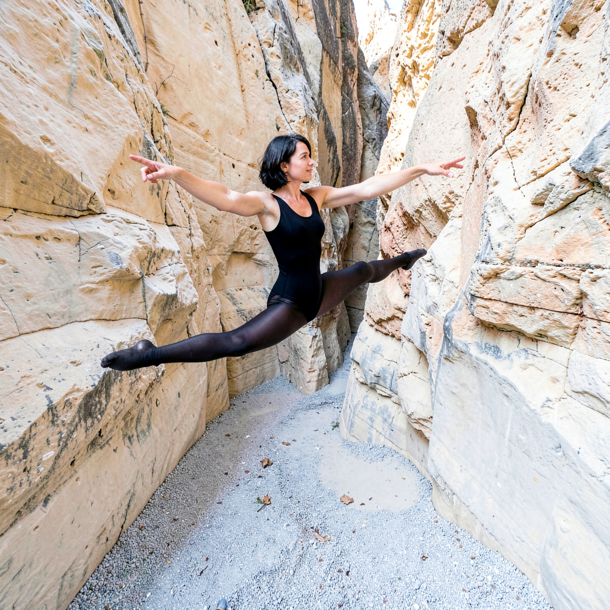
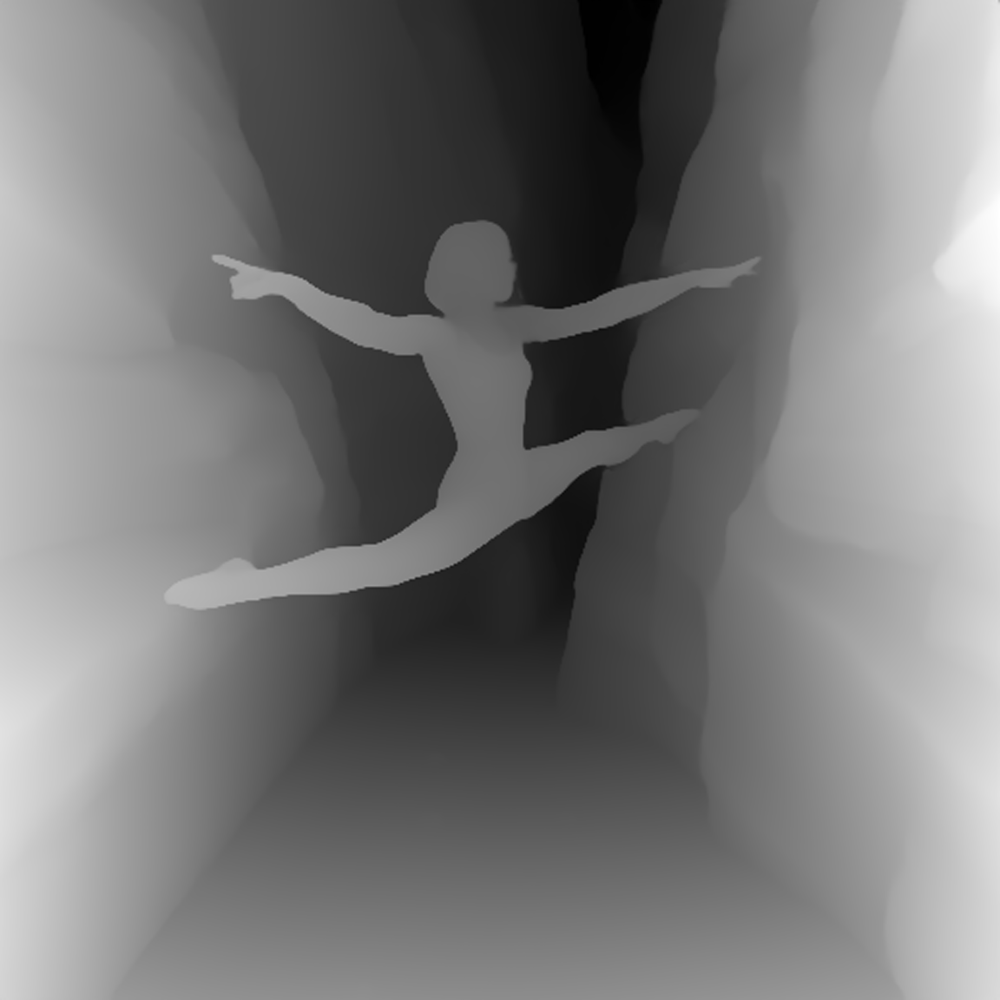
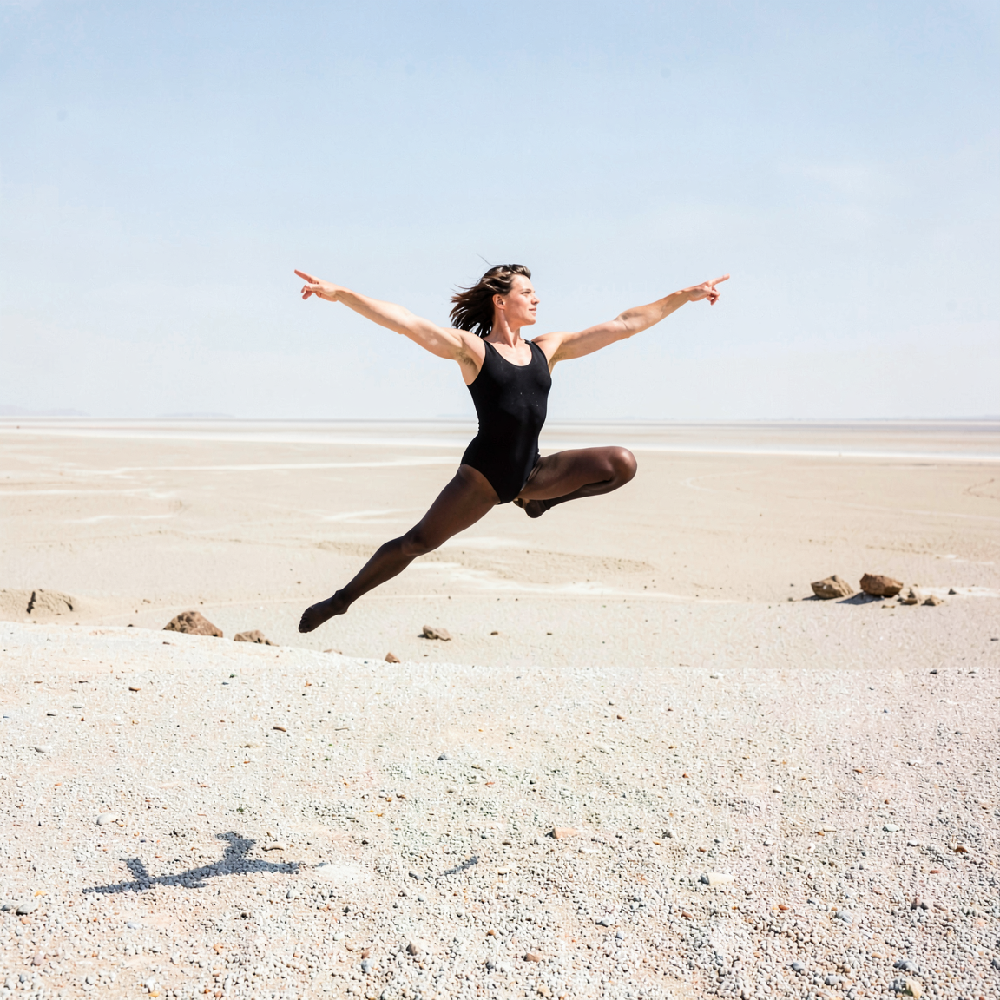
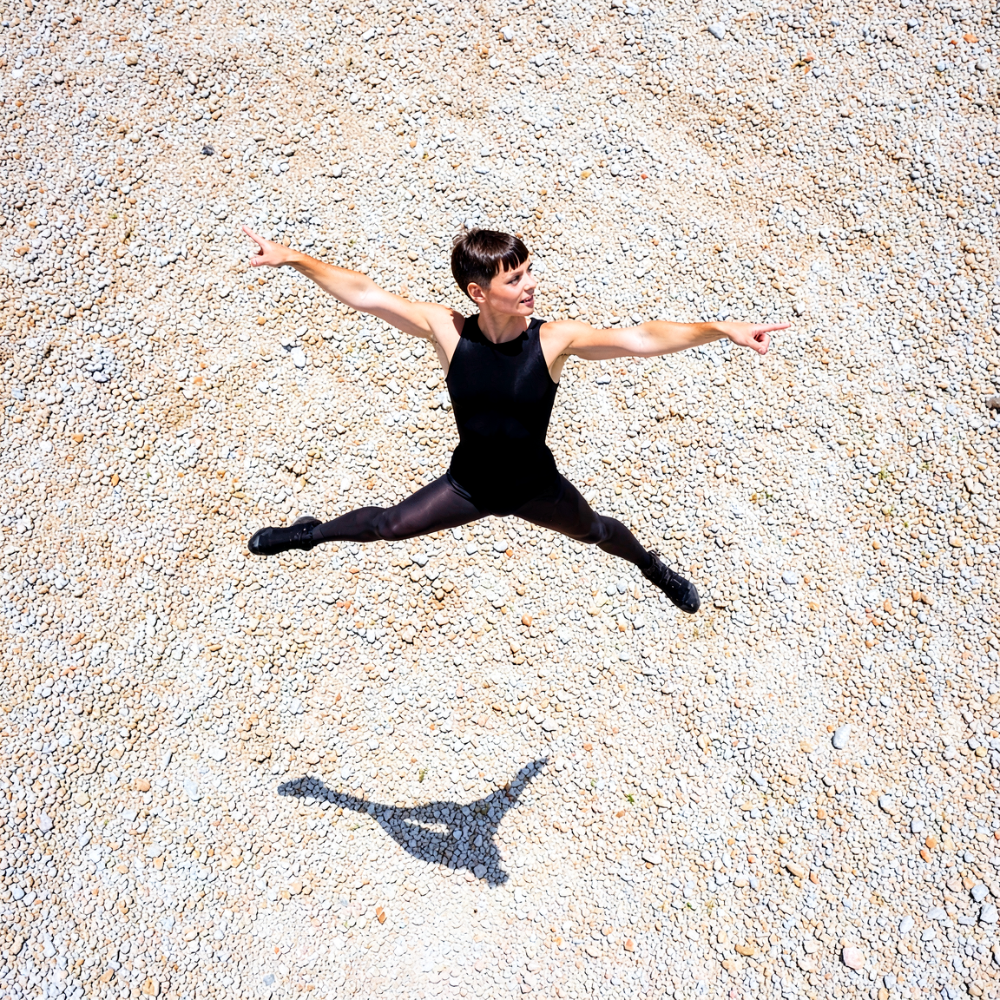
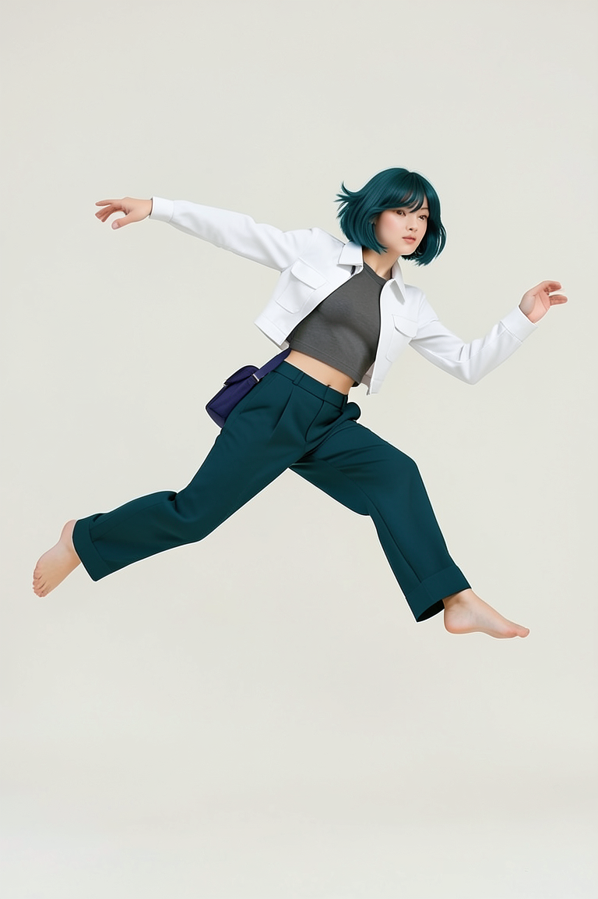
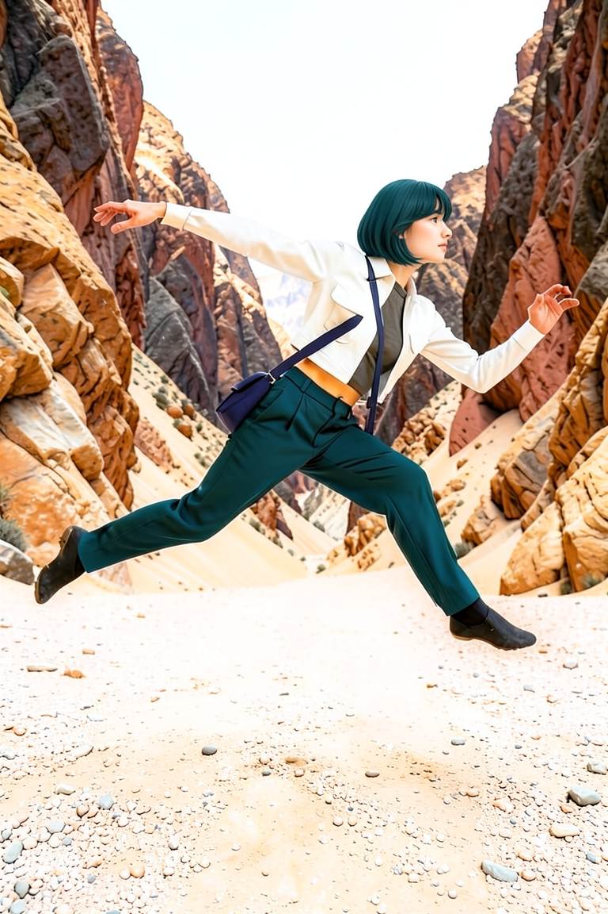
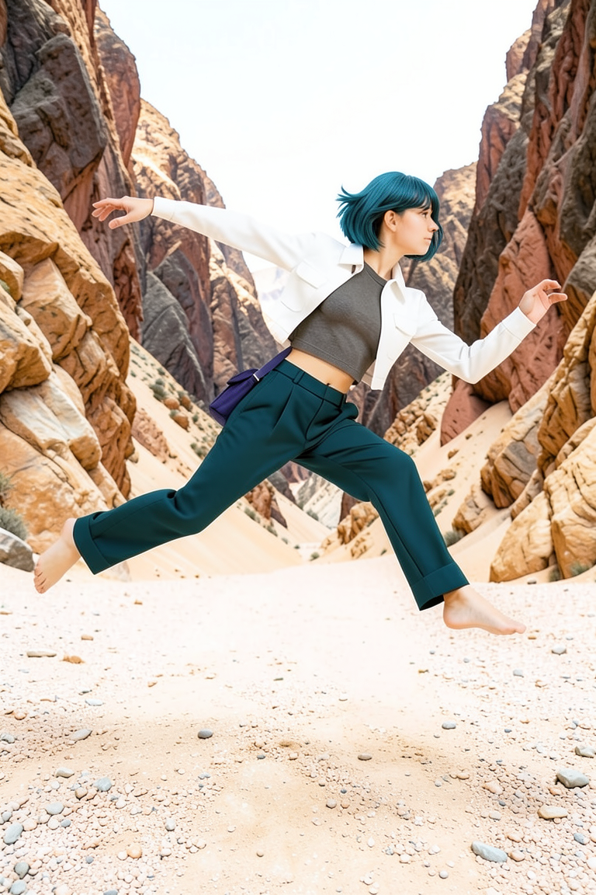
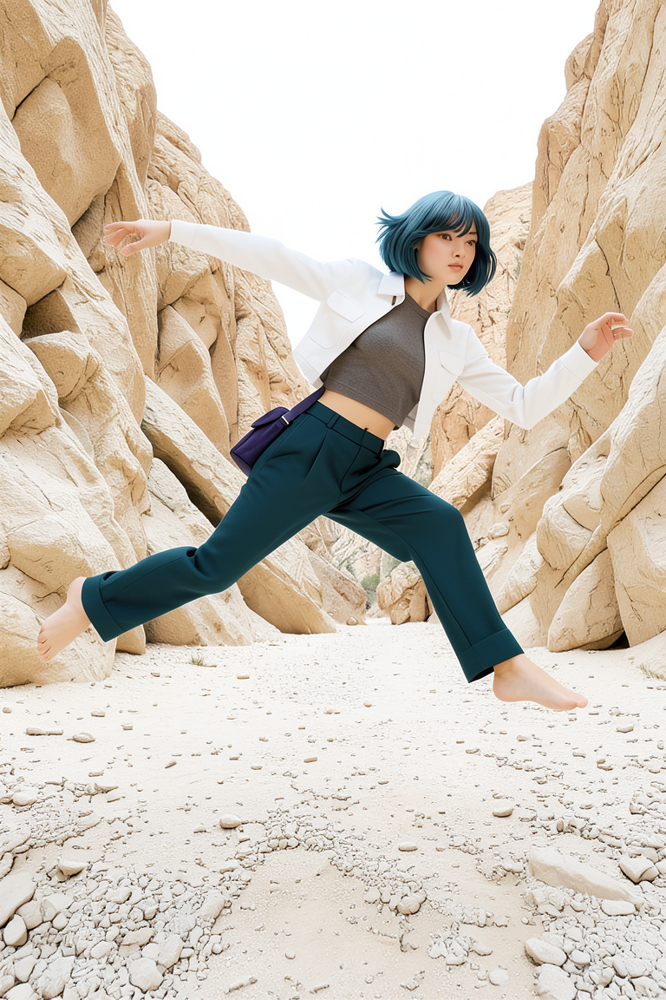

# P7-5.3 스토리보드 생성: FLUX 후보를 guide 이전에 검수하기

> Section ID: `P7-5.3`
> Version: `v2026.08.09`

이 절의 목적은 예쁜 한 장을 고르는 일이 아니라, 이후 단계가 믿고 읽을 수 있는 장면 기준을 만드는 일이다. 스토리보드의 인체·발·절벽·앞뒤 관계가 무너지면, 그 PNG에서 뽑은 Canny·상대 depth도 같은 오류를 구조 조건으로 전달한다. 따라서 후보 생성, 사람 승인, guide 추출, 참조 비교를 차례로 분리하며, 형상이 읽히지 않는 출력은 guide로 넘기지 않고 폐기한다.

## FLUX 후보는 장면 계약과 분리해 검수한다

현재 생성 경로는 FLUX.2 Klein 4B만 사용한다. 인체·가림·접지 검수를 통과한 PNG만 다음 guide 단계로 넘긴다.

이 절에서 현재 고정한 구도와 동작은 **A씬**으로 정의한다. A씬은 넓고 완만하게 높은 구도에서 화면 오른쪽으로 전진 도약하는 현대무용수와 양옆·뒤의 협곡을 함께 담는 장면이다. 이후 다른 장면을 추가하더라도 A씬의 prompt와 판정 기록은 독립된 장면 계약으로 유지한다.

**B씬**은 A씬과 동일한 인물·도약 동작·시선을 유지하면서 공간 규모와 인물 비율을 바꾼다. 먼 거리의 와이드 설정 숏으로 인물 전신을 화면 높이의 약 35~40%만 차지하게 하고, 위·아래·좌·우에 넉넉한 여백을 둔다. 좁고 높은 협곡 대신 낮은 수평선까지 사암·자갈 바닥이 멀리 이어지고, 작은 암석 지형만 원경에 놓인 열린 공간을 사용한다. 가까운 절벽이나 벽이 화면을 둘러싸지 않게 하므로, A/B 비교에서는 동일 동작이 공간 규모에 따라 어떻게 읽히는지 확인한다.

**C씬**은 B씬의 넓은 사암·자갈 공간과 동일 동작을 유지하면서 카메라를 수직 오버헤드로 옮긴다. 인물은 화면 높이 약 40%를 목표로 한다. Prompt의 높이 계약은 `높이 떠 있는 인물·멀리 떨어진 작고 부드러운 전신 그림자`만 남긴다. 수평선 없이 주변 지면과 자연스러운 원근 단축이 보이게 하며 사지 수 기준은 그대로 적용한다. B/C 비교에서는 열린 공간을 고정하고 시선 방향만 지상 원경에서 수직 하향으로 바꾼다.

| 고정 항목 | FLUX.2 Klein 4B |
| --- | --- |
| 기본 seed | `5420` |
| 해상도·step | `1152 x 1152`, 단일 생성 6 step |
| 인물 | 턱선 길이 단발, 긴 머리·포니테일 제외 |
| 자세·시선 | 인물은 화면 오른쪽 앞으로 높이 뛰며, 점프 정점에서 오른다리를 곧게 앞으로, 왼다리를 곧게 뒤로 뻗어 앞뒤로 크게 찢는 스플릿 점프를 한다. 팔 자세는 오른팔을 화면 오른쪽으로 뻗는 조건 하나만 둔다. 정확히 두 팔·두 손·두 다리·두 발만 요구하며 눈과 얼굴은 화면 오른쪽을 본다. |
| 공간 | 밝은 사암·자갈의 자연 계곡 바닥이 가까운 절벽 밑으로 이어짐. 기암절벽은 인물의 양옆과 뒤에 즉시 솟아 좁은 협곡을 이루되, 인물 외곽과는 좁은 보이는 간격을 둠 |

아래 [FLUX 스토리보드 코드](../../../assets/part-07/chapter-05/p7_5_3_text_to_image_storyboard_spec.py)는 한 번의 text-to-image 호출로 인물과 공간이 포함된 완성 RGB를 직접 만들고, 그 RGB에서 상대 depth를 추출한다. 따라서 생성 단계는 하나이며 중간 캐릭터 PNG나 배경 편집 입력을 만들지 않는다. 기본 해상도는 `1152×1152`다. 최종 산출물은 **RGB와 상대 depth 두 종류로 항상 함께 출력**한다. depth 생성에 실패하면 RGB 단독 결과도 남기지 않아 두 파일의 대응 관계를 지킨다. 기본 생성 반복 수는 6 step이며 `--steps`로 조정한다. 단계별 preview는 기본적으로 끄고 `--preview-every 1`처럼 명시했을 때만 저장한다. 생성 성공은 통과가 아니며, 다음 질문에 모두 답할 수 있을 때만 PNG를 승인한다.

```bash
python docs/assets/part-07/chapter-05/p7_5_3_text_to_image_storyboard_spec.py \
  --scene A --seed 5420 --runs 1 --steps 6

python docs/assets/part-07/chapter-05/p7_5_3_text_to_image_storyboard_spec.py \
  --scene B --seed 5421 --runs 1 --steps 6

python docs/assets/part-07/chapter-05/p7_5_3_text_to_image_storyboard_spec.py \
  --scene C --seed 5422 --runs 1 --steps 6
```

## 스토리보드 생성기는 한 장면 계약만 다룬다

카메라 앵글·렌즈 화각·피사계 심도의 조합 실험은 기본 생성기에서 제거했지만, 장면 계약으로 고정한 시점은 선택할 수 있다. 이 코드는 동일한 도약 동작에서 A씬의 협곡, B씬의 열린 지상 원경, C씬의 열린 수직 오버헤드를 선택해 한 단계로 완성 RGB를 생성한다. 기본 seed는 A `5420`, B `5421`, C `5422`다. 공통 이름은 `p7-5-3-scene-c-482731-seed-5422-s6`처럼 씬→실행 코드→seed→step 순서로 구성한다. 뒤에는 `-00-contract.json`, `-01-storyboard-rgb.png`, `-02-storyboard-depth.png`를 붙인다. 계약에는 전체 prompt, 공백 기준 `prompt_word_count`, 실행 조건, `scene_id`, 산출물별 파일명과 depth 모델을 기록한다. 실제 실행 로그에도 같은 단어 수를 출력한다.

Prompt의 공통 인체 계약은 한 사람, 정확히 두 팔과 두 다리로 압축한다. 팔은 오른팔이 진행 방향을 가리킨다는 조건만 남기고, 다리는 한쪽이 진행 방향 앞으로 곧게, 다른 쪽이 뒤로 곧게 뻗는 앞뒤 스플릿만 남긴다. 손·발 총수, 관절 연결, 좌우 해부학 설명과 출력 규격에서 이미 정한 RGB·정사각형 표현은 제거한다. 씬별 문장은 A의 협곡과 B의 작은 인물·열린 수평선, C의 오버헤드·원거리 그림자 차이만 추가한다. 현재 공백 기준 단어 수는 A 64, B 77, C 77이다. 단어 수 감소나 자세 제약 축소가 인체 품질 개선을 보장하지는 않으므로 계약의 `prompt_word_count`와 실제 사지 검수를 함께 비교한다.

GPU를 쓰기 전에 `--dry-run`으로 후보 순서와 파일명을 확인할 수 있다.

```bash
python docs/assets/part-07/chapter-05/p7_5_3_text_to_image_storyboard_spec.py \
  --seed 5420 --runs 3 --dry-run
```

## seed는 후보 수만 늘린다

한 seed의 통과는 한 장면 후보의 관찰일 뿐이다. 같은 모델·prompt·해상도·step을 고정한 채 seed만 바꾸면 카메라의 세부 해석, 팔과 다리의 분리, 발의 접지, 절벽과 인물의 간격이 다른 콘티 후보로 나타난다. 이때 seed는 품질을 올리는 숫자가 아니라 **검수할 후보를 늘리는 조작 변수**다.

`--runs`는 시작 seed부터 연속된 후보를 만든다. 예를 들어 FLUX에서 `5420`부터 세 장을 비교하려면 다음처럼 실행한다. 각 PNG는 사람 검수 전까지는 후보일 뿐이며, 가장 예쁜 결과가 아니라 인체·가림·접지·공간 기준을 모두 만족한 결과 하나만 승인한다.

```bash
python docs/assets/part-07/chapter-05/p7_5_3_text_to_image_storyboard_spec.py \
  --seed 5420 --runs 3
```

## 승인 전에는 guide를 만들지 않는다

다음 항목 하나라도 실패하면 원칙적으로 PNG를 승인하거나 guide로 넘기지 않는다. 다만 사람이 남은 차이를 확인하고 장면 비교 기준으로 명시적으로 승인한 경우에는, 그 관찰점과 계약 JSON을 이미지 옆에 함께 남긴다.

| 확인 항목 | 통과 기준 |
| --- | --- |
| 인체 | 두 팔·두 다리·머리·몸통의 연결이 한 사람으로 읽힘 |
| 자세와 가림 | 높은 대각선의 일자 든 다리·지지발·양팔이 한 사람의 자연스러운 균형 동작으로 읽힘 |
| 접지와 공간 | 지지발 외곽이 사암·자갈 바닥과 분리되고, 가까운 절벽이 인물을 삼키지 않음 |
| 기준 정보 | 짧은 단발과 검정 레오타드·타이즈가 다음 작화 단계의 최소 기준으로 읽힘 |

사람 검수로 통과한 스토리보드 파일을 명시할 때만 guide를 만든다. 이 분리는 불완전한 인체나 지형의 오류가 후속 ControlNet·참조 병합의 입력으로 굳어지는 것을 막는다.

```bash
python docs/assets/part-07/chapter-05/p7_5_3_text_to_image_storyboard_spec.py \
  --derive-guides-from docs/assets/part-07/chapter-05/p7-5-3-flux2-klein-storyboard-forward-leap-approved.png \
  --output-dir docs/assets/part-07/chapter-05
```

압축한 최종 prompt로 생성한 A/B/C 결과를 사람 검수로 승인했다. 세 결과는 각각 고정 seed와 실행 계약 JSON을 함께 보존하며, RGB와 상대 depth의 대응 관계를 한 행에서 비교한다. 이 승인은 세 장면의 현재 스토리보드 기준을 고정한다는 뜻이며, 다른 seed·카메라·동작까지 자동으로 통과한다는 뜻은 아니다.

| 승인 장면 | RGB | 상대 depth |
| --- | --- | --- |
| A씬 — 좁은 협곡<br>[실행 계약 JSON](../../../assets/part-07/chapter-05/p7-5-3-scene-a-037414-seed-5420-s6-00-contract.json) |  |  |
| B씬 — 열린 지상 원경<br>[실행 계약 JSON](../../../assets/part-07/chapter-05/p7-5-3-scene-b-088266-seed-5421-s6-00-contract.json) |  |  |
| C씬 — 열린 수직 오버헤드<br>[실행 계약 JSON](../../../assets/part-07/chapter-05/p7-5-3-scene-c-288128-seed-5422-s6-00-contract.json) |  |  |

A씬은 두 팔·두 다리와 협곡의 깊이를 유지하지만 앞쪽 발끝이 오른쪽 절벽에 닿아 보인다. B씬은 열린 공간과 작은 인물 비율을 유지하지만 뒤쪽 다리가 접혀 있다. C씬은 두 팔·두 다리, 수직 오버헤드, 분리된 그림자를 함께 유지한다. 이 차이는 숨기지 않고 이후 guide 또는 리파인 단계에서 다시 확인할 관찰점으로 남긴다.

## depth 리파인은 별도 가설로 검증한다

승인 스토리보드를 만들 때는 외부 캐릭터 PNG를 넣지 않는다. 반면 후속 리파인에서는 **상대 depth가 공중 도약의 실루엣만 전달하고**, P7-5.2의 착장·얼굴 기준 이미지가 인물의 외형을 보완할 수 있는지를 별도로 시험할 수 있다. 두 흐름을 섞으면 캐릭터 참조가 스토리보드 자체를 통과시킨 것처럼 보일 수 있으므로, 이 실험 결과에서는 guide를 다시 만들지 않고 최종 컷에도 사용하지 않는다.

아래 실행은 상대 depth, 전·후면 착장 기준, 얼굴 정면 기준을 함께 넣어 배경 없는 한 명의 도약 인물을 만든다. 기본값은 3 step이며, 결과 파일과 같은 이름의 검수 JSON에는 가설과 확인 항목을 남긴다.

```bash
python docs/assets/part-07/chapter-05/p7_5_3_refine_storyboard_four_outputs.py \
  --stage depth-character \
  --output-prefix p7-5-3-refine-hypothesis-depth-character
```



| 검수 항목 | 이번 표본의 관찰 | 판정 |
| --- | --- | --- |
| 동작·프레이밍 | 공중 전진 도약, 두 팔·두 다리, 전신 프레이밍이 상대 depth의 큰 실루엣과 함께 남았다. | 통과 |
| 얼굴·머리 | 밝은 피부, 청록 단발, 보이는 얼굴이 얼굴 정면 기준과 같은 방향으로 다시 나타났다. | 통과 |
| 착장 | 배꼽 높이의 하이웨이스트·넓은 통·발목 위 밑단과 재킷 바깥의 대각선 가방 스트랩이 읽힌다. | 통과 |
| 배경 분리 | 협곡·바닥을 다시 그리지 않고 옅은 중립 배경에 인물만 남겼다. | 통과 |
| 신발 | 입력 착장 기준에 신발 참조가 없어서 맨발로 생성됐다. | 미통과 |

이 표본은 짧은 리파인 계약이 자세·얼굴·바지·가방 경로를 함께 보존할 수 있다는 **가설의 일부만** 뒷받침한다. 신발처럼 기준 이미지에 없는 항목은 prompt만으로 자동 보완됐다고 판단하지 않는다. 따라서 이 결과는 신발 기준을 추가할 다음 실험의 비교 기준이며, 승인 스토리보드나 최종 장면 자산이 아니다.

### 구조 입력을 바꾼 세 경로 비교

같은 seed `62377`, 3 step에서 구조 입력 경로만 바꿔 세 후보를 만들었다. RGB 직접 리파인은 착장·배경·얼굴을 차례로 거치는 3단계 경로다. 두 2단계 경로는 먼저 depth-character로 인물만 만들고, 두 번째 단계에서 RGB 또는 Canny와 상대 depth로 협곡을 붙인다. 따라서 이 표는 모델 일반 성능이 아니라, 이 장면에서 **어떤 입력 조합이 무엇을 잃는가**를 읽기 위한 비교다.

| RGB 직접 3단계 | depth-character → RGB 2단계 | depth-character → Canny 2단계 |
| --- | --- | --- |
|  |  |  |
| 협곡·신발까지 다시 나타났지만, 단계가 많아 원본 RGB의 재해석도 함께 일어난다. | 인물 기준의 얼굴·넓은 바지·짧은 밑단을 비교적 보존하지만, 1단계의 맨발이 그대로 남는다. | 인물 기준은 대체로 남지만 Canny 경계가 협곡 표면을 더 강하게 다시 해석하며, 맨발도 해결하지 못한다. |

이 비교에서 바로 한 경로를 최종 경로로 고르지 않는다. 신발처럼 누락되면 안 되는 항목은 별도 기준 이미지나 명시적 후속 보정으로 해결할 문제이며, 현재 세 후보 모두 승인 스토리보드를 대체하지 않는다.

## LoRA 전환에는 별도 데이터와 학습 환경이 필요하다

다중참조만으로 얼굴과 복장이 약하게 섞이면 LoRA를 검토할 수 있다. 현 경로에 맞는 모델은 Apache-2.0인 **FLUX.2 Klein 4B Base**다. 학습은 Base checkpoint에서 하고, 완성한 adapter는 빠른 distilled 4B 추론 모델에 붙인다.

하지만 이는 현재 8 GB GPU에서 바로 실행할 다음 단계는 아니다. 공식 Klein LoRA 안내는 4B Base 학습을 약 24 GB VRAM·RTX 4090급에서 검증했다. 8 GB는 현재 승인 스토리보드 생성·다중참조 추론에는 맞지만, LoRA 학습 승인 기준에는 미달이다. FLUX.1-dev QLoRA의 약 9 GB 사례도 8 GB보다 크고 base model의 비상업 라이선스가 현재의 개방 라이선스 기준과 맞지 않는다.

학습을 시작하려면 먼저 올바른 데이터를 확보한다. 스타일·캐릭터 LoRA는 서로 다른 구도와 시점을 가진 15–40장의 검수된 이미지와 각 이미지의 내용 caption·동일 trigger word가 필요하다. 현재 P7-5.2의 23개 자산은 얼굴·전신·소품 기준 보드가 섞여 있어 그대로는 이 조건을 충족하지 않는다. 실패하거나 왜곡된 생성 이미지를 늘려 학습 데이터로 삼으면 얼굴·복장 오류를 adapter에 고정하므로 사용하지 않는다.

구도 보존과 캐릭터 교체를 함께 학습하려면 스타일 LoRA보다 **edit LoRA**가 더 직접적이다. 이 경우 승인 스토리보드 같은 입력과, 같은 포즈·구도에서 캐릭터·복장이 완성된 목표 이미지를 파일명별로 짝지은 50–200개의 검수된 쌍이 필요하다. 이 데이터와 24 GB 이상 학습 환경을 확보한 뒤에만 별도 실험으로 진행한다.

## 체크리스트

- 후보 PNG를 guide나 후속 생성 입력으로 쓰기 전에 사람이 인체·가림·접지·거리 조건을 확인했는가?
- 미통과 후보와 그 후보에서 뽑은 guide를 함께 삭제했는가?
- 승인한 한 장이 생긴 뒤에도 다른 seed·카메라·동작에서 같은 결과가 자동으로 보장된다고 가정하지 않는가?

## 출처와 참고 자료

- FLUX.2 Klein 4B는 텍스트 생성과 단일·다중 참조 이미지 편집을 지원하며 Apache-2.0으로 배포된다. 이 절에서는 텍스트만으로 장면 후보를 만들고, 사람 검수 뒤에만 파생 guide를 만든다. [FLUX.2 공식 저장소](https://github.com/black-forest-labs/flux2){: target="_blank" rel="noopener noreferrer"}, [FLUX.2 Klein 4B 모델 카드](https://huggingface.co/black-forest-labs/FLUX.2-klein-base-4b-fp8){: target="_blank" rel="noopener noreferrer"} (확인: 2026-08-07)
- FLUX.2 Klein LoRA의 공식 학습 안내는 Base 4B에서의 학습, 15–40장 스타일 데이터, 24 GB VRAM·RTX 4090급, 그리고 adapter를 distilled 4B 추론에 로드하는 흐름을 제시한다. edit LoRA는 입력·목표 이미지의 짝 데이터와 `control_path`를 사용한다. [FLUX.2 Klein LoRA 안내](https://huggingface.co/blog/black-forest-labs/flux-2-klein-lora){: target="_blank" rel="noopener noreferrer"} (확인: 2026-08-07)
- FLUX.1-dev QLoRA는 4-bit base·8-bit optimizer·gradient checkpointing·latent/text embedding cache를 함께 써도 공식 사례의 peak가 약 9 GB이며, 본 절의 8 GB·Apache-2.0 기준을 충족하는 대체 학습 경로로 보지 않는다. [Diffusers FLUX.1 QLoRA 안내](https://huggingface.co/blog/flux-qlora){: target="_blank" rel="noopener noreferrer"} (확인: 2026-08-07)
- SDXL inpaint는 mask 영역만 다시 그릴 수 있고, IP-Adapter Plus Face는 잘라낸 얼굴 이미지 조건을 SDXL에 넣을 수 있다. 이 절에서는 전신을 다시 생성하지 않는 국소 얼굴·헤어 보정 후보로만 검수한다. [Diffusers inpainting 안내](https://huggingface.co/docs/diffusers/main/api/pipelines/stable_diffusion/inpaint){: target="_blank" rel="noopener noreferrer"}, [Diffusers IP-Adapter 안내](https://huggingface.co/docs/diffusers/v0.31.0/using-diffusers/ip_adapter){: target="_blank" rel="noopener noreferrer"}, [IP-Adapter Plus Face SDXL 가중치](https://huggingface.co/h94/IP-Adapter/blob/main/sdxl_models/ip-adapter-plus-face_sdxl_vit-h.safetensors){: target="_blank" rel="noopener noreferrer"} (확인: 2026-08-07)
