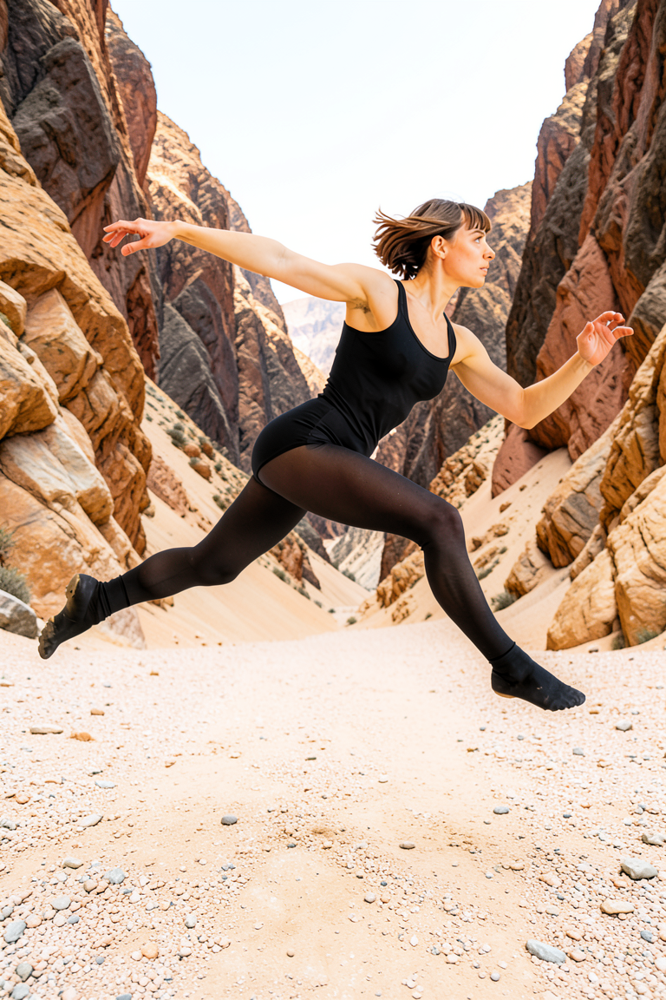
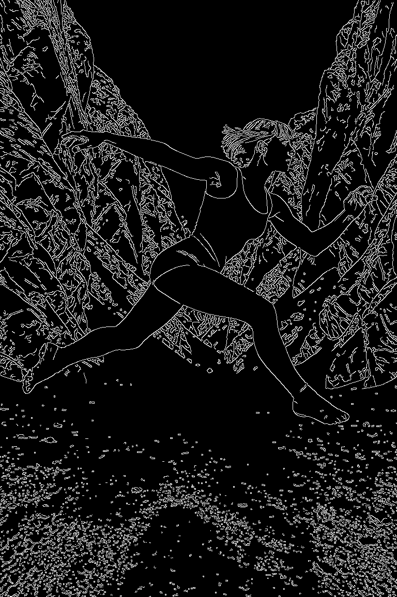
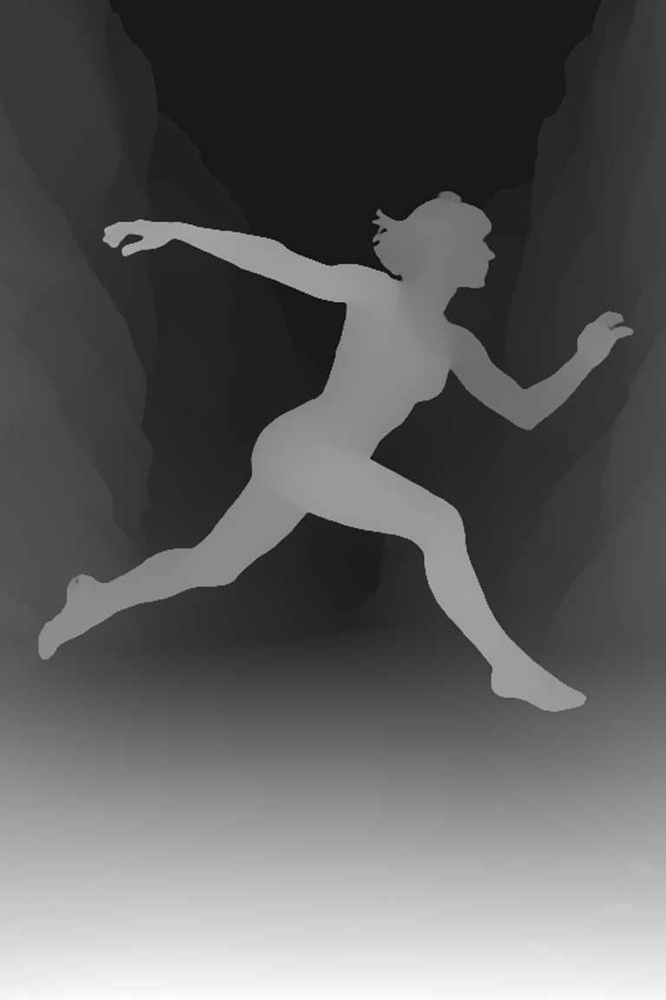
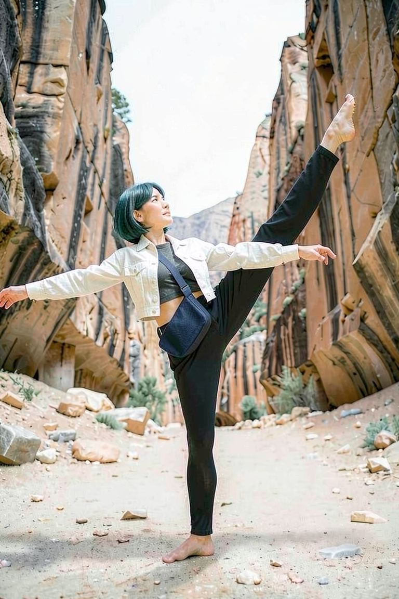
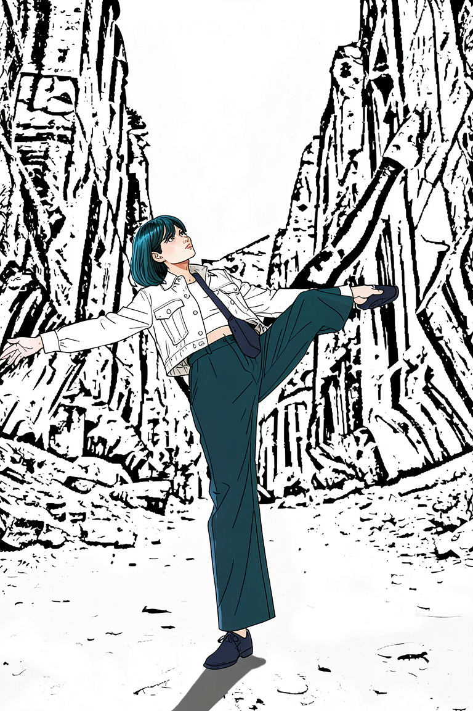
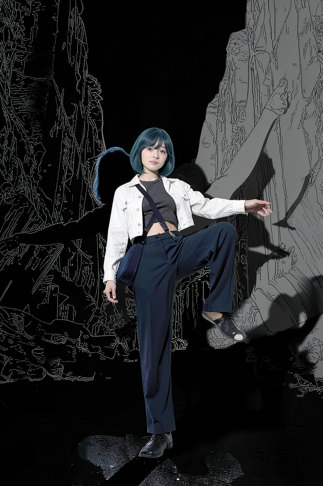
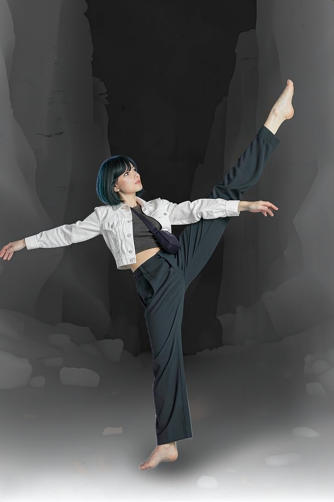

# P7-5.3 스토리보드 생성: FLUX 후보를 guide 이전에 검수하기

> Section ID: `P7-5.3`
> Version: `v2026.08.08`

이 절의 목적은 예쁜 한 장을 고르는 일이 아니라, 이후 단계가 믿고 읽을 수 있는 장면 기준을 만드는 일이다. 스토리보드의 인체·발·절벽·앞뒤 관계가 무너지면, 그 PNG에서 뽑은 Canny·상대 depth도 같은 오류를 구조 조건으로 전달한다. 따라서 후보 생성, 사람 승인, guide 추출, 참조 비교를 차례로 분리하며, 형상이 읽히지 않는 출력은 guide로 넘기지 않고 폐기한다.

## FLUX 후보는 장면 계약과 분리해 검수한다

현재 생성 경로는 FLUX.2 Klein 4B만 사용한다. 인체·가림·접지 검수를 통과한 PNG만 다음 guide 단계로 넘긴다.

| 고정 항목 | FLUX.2 Klein 4B |
| --- | --- |
| 기본 seed | `5420` |
| 해상도·step | `768 x 1152`, 캐릭터 3 step + 배경 3 step |
| 인물 | 턱선 길이 단발, 긴 머리·포니테일 제외 |
| 자세·시선 | 넓은 하이 앵글 뷰에서 인물 전신과 협곡 바닥·절벽 지형을 함께 보인다. 정확한 카메라 거리·탑뷰 각도는 고정하지 않는다. 인물은 앞쪽 진행 방향으로 뛰어 나가는 현대무용수다. 한 다리는 앞쪽으로 뻗고 다른 다리는 뒤로 길게 뻗는다. 눈과 얼굴은 화면 오른쪽을 본다. 팔의 개수·방향·위치는 별도로 지정하지 않는다. |
| 공간 | 밝은 사암·자갈의 자연 계곡 바닥이 가까운 절벽 밑으로 이어짐. 기암절벽은 인물의 양옆과 뒤에 즉시 솟아 좁은 협곡을 이루되, 인물 외곽과는 좁은 보이는 간격을 둠 |

아래 [FLUX 스토리보드 코드](../../../assets/part-07/chapter-05/p7_5_3_text_to_image_storyboard_spec.py)는 후보 PNG만 만든다. 첫 단계는 중립 배경에서 인물과 동작을 prompt로만 만들고, 둘째 단계는 그 생성 결과만 입력으로 받아 인물의 포즈·실루엣·비율을 바꾸지 않은 채 협곡 배경만 추가한다. 얼굴·전신·복장 같은 외부 캐릭터 특징 PNG는 어느 단계에도 입력하지 않는다. 두 단계의 기본값은 각각 3 step이며, `--character-steps`와 `--background-steps`로 따로 바꿀 수 있다. 생성 성공은 통과가 아니며, 다음 질문에 모두 답할 수 있을 때만 PNG를 승인한다.

동작 자체를 먼저 검수하려면 `--character-only`로 1차 캐릭터 PNG만 만들 수 있다. 이 옵션은 2차 배경 생성을 호출하지 않으므로, 동작·시선·전신 실루엣의 오류를 협곡 배경 재해석과 분리해 확인할 수 있다.

1차를 통과한 캐릭터 PNG만 2차에 넣으려면 `--character-from`에 그 파일을 명시한다. 이 옵션은 1차를 다시 만들지 않고, 해당 PNG의 인물 포즈·실루엣·복장을 유지한 채 협곡 배경만 생성한다.

이미 검수할 배경 후보가 있다면 `--background-from`에 그 파일을 명시해 기존처럼 캐릭터 단계만 실행할 수 있다. 이는 순서 전환 전의 단독 실험을 재현하기 위한 호환 경로이며, 기본 2단계 경로는 캐릭터→배경 순서다.

```bash
python docs/assets/part-07/chapter-05/p7_5_3_text_to_image_storyboard_spec.py \
  --seed 5420 --runs 1 \
  --background-steps 3 --character-steps 3

python docs/assets/part-07/chapter-05/p7_5_3_text_to_image_storyboard_spec.py \
  --seed 5420 \
  --background-from docs/assets/part-07/chapter-05/example-background.png \
  --character-steps 12
```

## seed는 후보 수만 늘린다

한 seed의 통과는 한 장면 후보의 관찰일 뿐이다. 같은 모델·prompt·해상도·step을 고정한 채 seed만 바꾸면 카메라의 세부 해석, 팔과 다리의 분리, 발의 접지, 절벽과 인물의 간격이 다른 콘티 후보로 나타난다. 이때 seed는 품질을 올리는 숫자가 아니라 **검수할 후보를 늘리는 조작 변수**다.

`--runs`는 시작 seed부터 연속된 후보를 만든다. 예를 들어 FLUX에서 `5420`부터 세 장을 비교하려면 다음처럼 실행한다. 각 PNG는 사람 검수 전까지는 후보일 뿐이며, 가장 예쁜 결과가 아니라 인체·가림·접지·공간 기준을 모두 만족한 결과 하나만 승인한다.

```bash
python docs/assets/part-07/chapter-05/p7_5_3_text_to_image_storyboard_spec.py \
  --model flux2-klein --seed 5420 --runs 3
```

## 승인 전에는 guide를 만들지 않는다

다음 항목 하나라도 실패하면 PNG와 guide를 모두 남기지 않는다.

| 확인 항목 | 통과 기준 |
| --- | --- |
| 인체 | 두 팔·두 다리·머리·몸통의 연결이 한 사람으로 읽힘 |
| 자세와 가림 | 높은 대각선의 일자 든 다리·지지발·양팔이 한 사람의 자연스러운 균형 동작으로 읽힘 |
| 접지와 공간 | 지지발 외곽이 사암·자갈 바닥과 분리되고, 가까운 절벽이 인물을 삼키지 않음 |
| 기준 정보 | 짧은 단발과 검정 레오타드·타이즈가 다음 작화 단계의 최소 기준으로 읽힘 |

사람 검수로 통과한 스토리보드 파일을 명시할 때만 guide를 만든다. 이 분리는 불완전한 인체나 지형의 오류가 후속 ControlNet·참조 병합의 입력으로 굳어지는 것을 막는다.

```bash
python docs/assets/part-07/chapter-05/p7_5_3_text_to_image_storyboard_spec.py \
  --derive-guides-from docs/assets/part-07/chapter-05/p7-5-3-flux2-klein-storyboard-forward-leap-approved.png \
  --output-dir docs/assets/part-07/chapter-05
```

seed `5420` 결과를 사람 검수로 승인했다. 이 장면에서는 화면 오른쪽으로 뛰어 나가는 공중 현대무용 동작, 앞·뒤로 분리된 두 다리와 두 팔, 사암·자갈 바닥과 가까운 절벽이 함께 읽힌다. 아래 RGB 원본과 Canny·상대 depth guide만 장면 기준으로 유지한다. 한 장면의 승인 결과가 다른 카메라·동작에서도 자동으로 통과함을 뜻하지는 않는다.

| 승인 RGB | Canny guide | 상대 depth guide |
| --- | --- | --- |
|  |  |  |
| 사람 검수로 승인한 장면 기준 RGB다. | 승인 RGB에서 추출한 강한 경계 guide다. | 승인 RGB의 앞뒤 관계를 회색 농도로 나타낸 상대 depth guide다. |

## guide와 이미지 참조는 같은 역할이 아니다

같은 seed `62377`과 같은 복장·얼굴 기준으로 RGB, lineart, Canny, 상대 depth를 각각 첫 이미지 참조로 넣어 비교했다. RGB만 쓴 조건은 협곡의 색·질감과 인체를 함께 유지했다. lineart와 Canny만 쓴 조건은 각각 선화·윤곽을 배경 자체로 재해석했고, 실제 협곡의 광원·질감과 원래 동작을 유지하지 못했다.

상대 depth만 쓴 조건은 배경을 단색 깊이 렌더처럼 남겼지만, 인물의 전후 배치, 높은 든 다리, 지지발과 양옆 절벽의 공간 관계는 네 조건 중 가장 직접적으로 드러냈다. 따라서 이 실험에서 depth 조건은 **최종 컷 후보가 아니라 공간·가림 의도를 가장 잘 드러낸 비교 기준**이다. 색·질감까지 복원하는 최종 컷에는 RGB 스토리보드가 필요하며, depth 단독 PNG를 승인 컷·guide·후속 입력으로 승격하지 않는다.

| FLUX RGB 단일 기준 결과 | FLUX lineart 단일 기준 결과 |
| --- | --- |
|  |  |
| 협곡의 색·질감과 인체를 함께 유지한 비교 후보다. | 선화를 배경으로 재해석해 최종 컷에는 쓰지 않는다. |

| FLUX Canny 단일 기준 결과 | FLUX depth 단일 기준 결과 |
| --- | --- |
|  |  |
| 윤곽 조건이 인체·배경을 크게 재해석해 최종 컷에는 쓰지 않는다. | 공간·가림 의도를 가장 직접적으로 드러내지만 최종 컷 후보는 아니다. |

## LoRA 전환에는 별도 데이터와 학습 환경이 필요하다

다중참조만으로 얼굴과 복장이 약하게 섞이면 LoRA를 검토할 수 있다. 현 경로에 맞는 모델은 Apache-2.0인 **FLUX.2 Klein 4B Base**다. 학습은 Base checkpoint에서 하고, 완성한 adapter는 빠른 distilled 4B 추론 모델에 붙인다.

하지만 이는 현재 8 GB GPU에서 바로 실행할 다음 단계는 아니다. 공식 Klein LoRA 안내는 4B Base 학습을 약 24 GB VRAM·RTX 4090급에서 검증했다. 8 GB는 현재 승인 스토리보드 생성·다중참조 추론에는 맞지만, LoRA 학습 승인 기준에는 미달이다. FLUX.1-dev QLoRA의 약 9 GB 사례도 8 GB보다 크고 base model의 비상업 라이선스가 현재의 개방 라이선스 기준과 맞지 않는다.

학습을 시작하려면 먼저 올바른 데이터를 확보한다. 스타일·캐릭터 LoRA는 서로 다른 구도와 시점을 가진 15–40장의 검수된 이미지와 각 이미지의 내용 caption·동일 trigger word가 필요하다. 현재 P7-5.2의 23개 자산은 얼굴·전신·소품 기준 보드가 섞여 있어 그대로는 이 조건을 충족하지 않는다. 실패하거나 왜곡된 생성 이미지를 늘려 학습 데이터로 삼으면 얼굴·복장 오류를 adapter에 고정하므로 사용하지 않는다.

구도 보존과 캐릭터 교체를 함께 학습하려면 스타일 LoRA보다 **edit LoRA**가 더 직접적이다. 이 경우 승인 스토리보드 같은 입력과, 같은 포즈·구도에서 캐릭터·복장이 완성된 목표 이미지를 파일명별로 짝지은 50–200개의 검수된 쌍이 필요하다. 이 데이터와 24 GB 이상 학습 환경을 확보한 뒤에만 별도 실험으로 진행한다.

## 체크리스트

- 후보 PNG를 guide나 후속 생성 입력으로 쓰기 전에 사람이 인체·가림·접지·거리 조건을 확인했는가?
- 미통과 후보와 그 후보에서 뽑은 guide를 함께 삭제했는가?
- 승인한 한 장이 생긴 뒤에도 다른 seed·카메라·동작에서 같은 결과가 자동으로 보장된다고 가정하지 않는가?

## 출처와 참고 자료

- FLUX.2 Klein 4B는 텍스트 생성과 단일·다중 참조 이미지 편집을 지원하며 Apache-2.0으로 배포된다. 이 절에서는 텍스트만으로 장면 후보를 만들고, 사람 검수 뒤에만 파생 guide를 만든다. [FLUX.2 공식 저장소](https://github.com/black-forest-labs/flux2){: target="_blank" rel="noopener noreferrer"}, [FLUX.2 Klein 4B 모델 카드](https://huggingface.co/black-forest-labs/FLUX.2-klein-base-4b-fp8){: target="_blank" rel="noopener noreferrer"} (확인: 2026-08-07)
- FLUX.2 Klein LoRA의 공식 학습 안내는 Base 4B에서의 학습, 15–40장 스타일 데이터, 24 GB VRAM·RTX 4090급, 그리고 adapter를 distilled 4B 추론에 로드하는 흐름을 제시한다. edit LoRA는 입력·목표 이미지의 짝 데이터와 `control_path`를 사용한다. [FLUX.2 Klein LoRA 안내](https://huggingface.co/blog/black-forest-labs/flux-2-klein-lora){: target="_blank" rel="noopener noreferrer"} (확인: 2026-08-07)
- FLUX.1-dev QLoRA는 4-bit base·8-bit optimizer·gradient checkpointing·latent/text embedding cache를 함께 써도 공식 사례의 peak가 약 9 GB이며, 본 절의 8 GB·Apache-2.0 기준을 충족하는 대체 학습 경로로 보지 않는다. [Diffusers FLUX.1 QLoRA 안내](https://huggingface.co/blog/flux-qlora){: target="_blank" rel="noopener noreferrer"} (확인: 2026-08-07)
- SDXL inpaint는 mask 영역만 다시 그릴 수 있고, IP-Adapter Plus Face는 잘라낸 얼굴 이미지 조건을 SDXL에 넣을 수 있다. 이 절에서는 전신을 다시 생성하지 않는 국소 얼굴·헤어 보정 후보로만 검수한다. [Diffusers inpainting 안내](https://huggingface.co/docs/diffusers/main/api/pipelines/stable_diffusion/inpaint){: target="_blank" rel="noopener noreferrer"}, [Diffusers IP-Adapter 안내](https://huggingface.co/docs/diffusers/v0.31.0/using-diffusers/ip_adapter){: target="_blank" rel="noopener noreferrer"}, [IP-Adapter Plus Face SDXL 가중치](https://huggingface.co/h94/IP-Adapter/blob/main/sdxl_models/ip-adapter-plus-face_sdxl_vit-h.safetensors){: target="_blank" rel="noopener noreferrer"} (확인: 2026-08-07)
