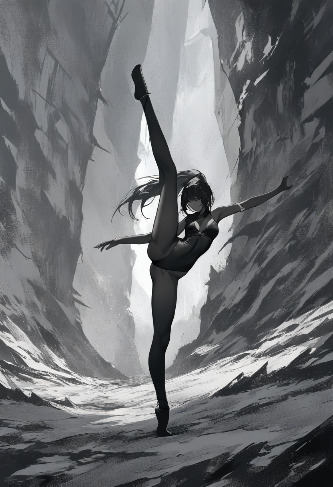
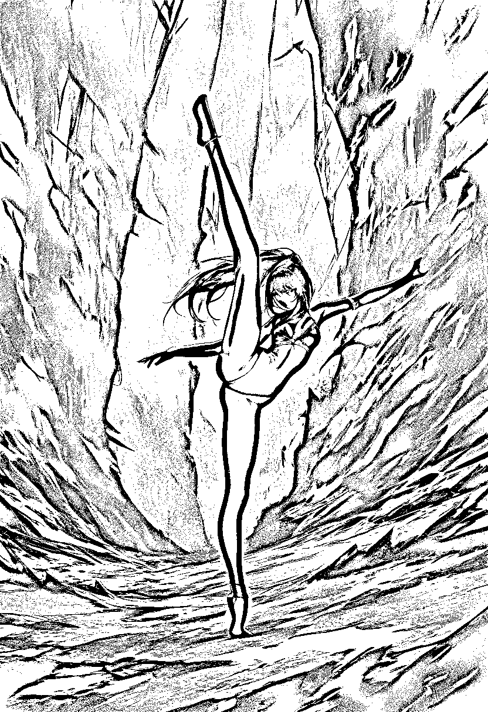
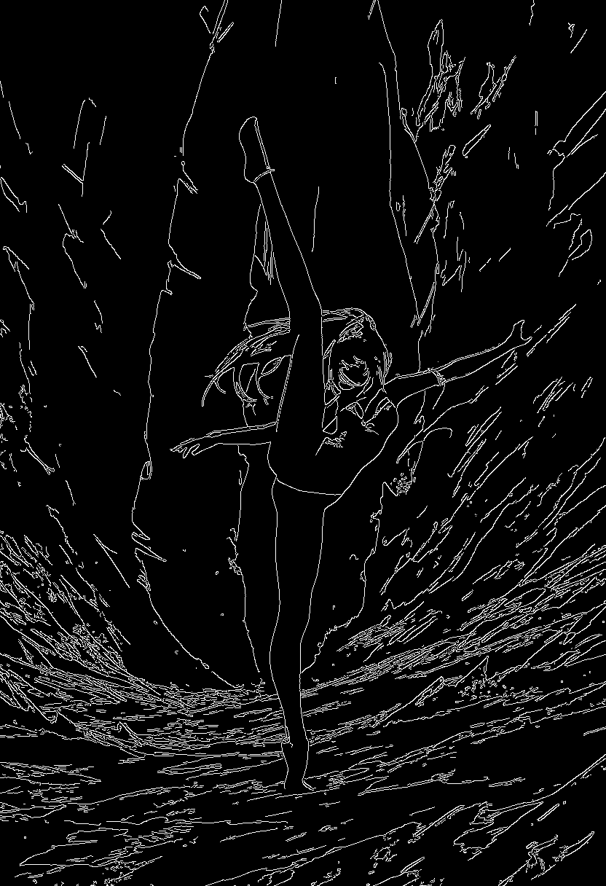
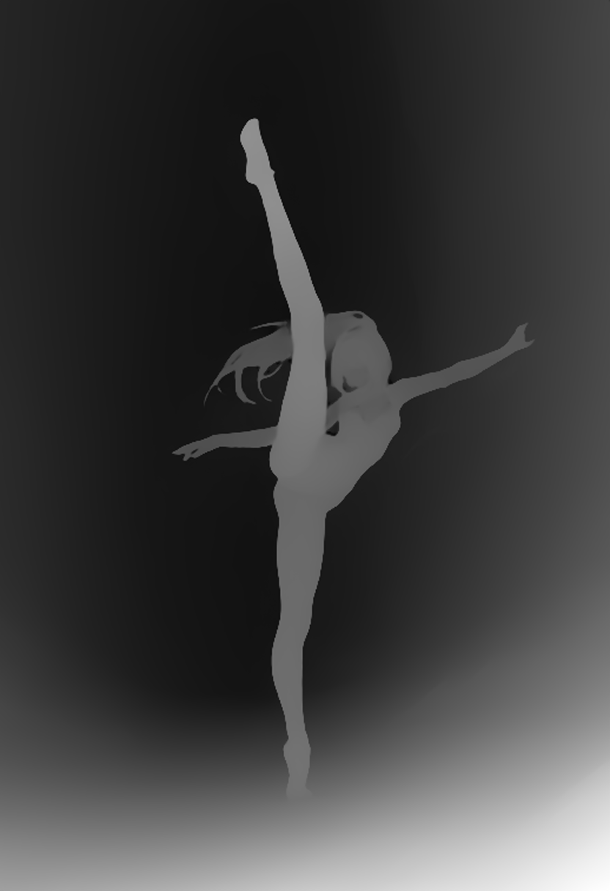

# P7-5.3 스토리보드 생성: 스토리보드에서 구조 guide 추출하기

> Section ID: `P7-5.3`
> Version: `v2026.08.07`

스토리보드는 **텍스트만으로** 먼저 만듭니다. 이전 장면, 배경, 인물 사진을 스토리보드 모델의 입력으로 넣지 않습니다. 사람이 읽을 수 있는 스토리보드만 통과시키고, 그 PNG에서 lineart·canny·상대 depth를 추출합니다. 따라서 guide는 장면을 새로 해석하는 시작점이 아니라, 이미 검수한 한 장면의 구조를 다음 생성에 전달하는 파생 산출물입니다.

## 먼저 한 장면 스토리보드를 사람 검수한다

이 실험의 고정 장면은 기암절벽 사이의 현대무용자입니다. 무용수는 양옆과 뒤쪽의 먼 절벽에서 떨어진 열린 평지에 서고, 검정 민소매 레오타드와 불투명 타이즈를 입은 채 한쪽 다리는 위로 길게 들며 다른 다리는 바닥을 지지하고, 한쪽 팔은 위로, 다른 팔은 옆으로 뻗습니다. 치마나 흩날리는 천은 다리·무릎·발의 연결을 가리므로 이 장면에 넣지 않습니다. 지지발은 발 전체와 밑창의 접지면이 보이고, 주변 바위와 외곽선이 붙거나 겹치지 않아야 합니다. 참조 사진에서 읽은 자세를 문장으로만 풀어 썼을 뿐, 사진 파일은 입력하지 않았습니다.

스토리보드에서는 인물의 이름·얼굴·의상보다 아래 구조가 읽히는지를 봅니다.

| 확인할 정보 | 이 장면에서 확인할 기준 |
| --- | --- |
| 인체 | 머리, 두 팔, 두 다리와 큰 동작 실루엣 |
| 행동 | 위로 든 다리와 바닥을 딛는 다리의 대비 |
| 공간 | 열린 평지의 인물과 양옆·뒤쪽 먼 기암절벽의 앞뒤 관계 |
| 경계 | 인물 윤곽, 절벽 통로, 바닥의 강한 경계 |
| 접지 | 지지발 전체·밑창·바닥 그림자가 읽히고, 발 외곽이 바위나 지형과 겹치지 않음 |

## 승인한 스토리보드의 입력 계약

승인한 경로는 Animagine XL 4.0 하나입니다. 태그형 prompt, `832 x 1216`, 28 step, CFG 5.0을 고정하고 텍스트만 입력합니다. 이 값은 한 장면·한 seed의 검수에서 정한 실행 계약이며, 모델 전체의 일반적인 우열을 뜻하지 않습니다.

| 고정 모델 | 적용한 계약 | 검수 결과 |
| --- | --- | --- |
| Animagine XL 4.0 | 태그형 prompt, 832 x 1216, 28 step, CFG 5.0, seed 5413 | 두 팔·두 다리, 큰 동작, 기암절벽이 함께 읽혀 사람 검수를 통과한 승인 스토리보드 |

다른 모델의 비교·미통과 판단은 이 절의 릴리즈노트에 실험 이력으로만 남기고, 실행 코드의 선택지로는 제공하지 않습니다.

아래 [로컬 GPU 실험 코드](../../../assets/part-07/chapter-05/p7_5_3_text_to_image_storyboard_spec.py)는 승인한 Animagine 계약만 사용합니다. 프롬프트는 소스 안에 고정되어 있고, 실행할 때마다 타임스탬프가 든 `storyboard`, `lineart`, `canny`, `depth` PNG를 저장합니다. `--runs`를 주면 모델은 한 번만 불러오고 seed를 1씩 늘려 여러 후보를 만든다. 후보는 각각 사람 검수한 뒤에만 승인 자산으로 옮긴다.

```bash
python docs/assets/part-07/chapter-05/p7_5_3_text_to_image_storyboard_spec.py --seed 5411
# seed 5411, 5412, 5413으로 후보 세 장을 생성한다.
python docs/assets/part-07/chapter-05/p7_5_3_text_to_image_storyboard_spec.py --seed 5411 --runs 3
```

### 승인 스토리보드와 파생 guide를 함께 비교한다

아래 네 장은 같은 승인 스토리보드에서 나온 한 세트다. 원본을 먼저 보고, 같은 장면에서 윤곽·강한 경계·상대 거리가 각각 얼마나 남는지 오른쪽과 다음 행에서 비교한다. 이 표의 guide PNG는 다음 생성에 쓰기 전에도 각각 사람 검수해야 한다.

| 원본과 전체 윤곽 | 강한 경계와 상대 거리 |
| --- | --- |
| **승인 스토리보드**<br><br>텍스트만으로 생성한 `seed=5413` 원본 | **lineart guide**<br><br>인물과 절벽의 전체 윤곽 |
| **Canny guide**<br><br>강한 경계와 동작 실루엣 | **상대 depth guide**<br><br>인물·바닥·절벽의 앞뒤 관계 |

lineart는 전체 윤곽, canny는 강한 경계, depth는 상대적인 거리만 담습니다. 세 guide는 스토리보드의 오류까지 함께 보존할 수 있으므로, 추출 뒤에도 한 번 더 확인해야 합니다. 특히 지지발·바닥 그림자와 주변 지형이 붙거나 겹치면 guide를 만들지 않고, 텍스트 스토리보드 단계로 되돌아가 접지면과 지형 배치를 다시 생성합니다.

## guide마다 보존하는 구조가 다르다

[구조 guide 웹툰 생성 코드](../../../assets/part-07/chapter-05/p7_5_3_structural_guided_webtoon.py)는 스토리보드 RGB를 초기 이미지로 쓰지 않습니다. seed 노이즈에서 시작하는 text-to-image ControlNet에 검수한 depth·Canny·lineart PNG를 하나 또는 둘만 전달합니다. 기본 prompt는 모델별로 소스에 고정하며, Animagine XL은 `1girl, solo, full body`와 복장·장면 태그를 씁니다. 그러므로 결과 차이의 우선 관찰 대상은 장면 묘사의 풍부함이 아니라 guide가 인물 윤곽, 발과 지면의 분리, 절벽의 상대 위치를 얼마나 유지하는가이다.

기본값은 Animagine XL Canny의 `768 x 1152`, 24 step, Canny `0.80`, seed `5413`입니다. 기본 실행에는 캐릭터 참조를 넣지 않습니다. 이 단계의 통과 여부는 오직 인체·지지발·협곡이라는 **구조**로 판정하기 때문입니다. `--backbone sd15`와 `--backbone sdxl`은 비교용으로 남깁니다. `--backbone flux1-dev`는 InstantX Flux.1-dev Canny·depth ControlNet을 받을 비교 후보이며, 비상업 조건을 확인했다는 뜻의 `--allow-restricted-license`가 있어야 실행됩니다. `qwen-image`와 `z-image-turbo`는 각각 Union ControlNet의 단일 guide 계약과 권장 step·CFG·scale을 사용합니다. 모든 실행은 PNG 옆에 seed, guide 종류·강도, 해상도, step, VRAM peak, 생성 시간, 사람 검수 항목을 담은 JSON 기록을 남깁니다.

| backbone | 구조 입력 계약 | 기본 비교 설정 | 8 GB 판정 상태 |
| --- | --- | --- | --- |
| `sd15` | Canny·depth·lineart, 두 guide 가능 | `512 x 768`, 24 step | 기존 실행 경로 있음 |
| `sdxl` | Canny·depth, 두 guide 가능 | `768 x 1152`, 28 step | CPU offload 전제 |
| `animagine-xl` | SDXL Canny·depth·OpenPose, 두 guide 가능 | `768 x 1152`, 24 step, Canny `0.80` | Canny 단일 조건만 기본값; 두 ControlNet은 sequential CPU offload 실험 대상 |
| `flux1-dev` | Canny·depth, 두 guide 가능 | `1024²`, 28 step, CFG 3.5 | 비상업 비교·미검수 |
| `qwen-image` | Union Canny·depth·soft-edge(선화), 한 guide | `1024²`, 30 step, true CFG 4.0 | 20B라 제외 후보 |
| `z-image-turbo` | Union Canny·depth·HED(선화), 한 guide | `1024²`, 9 step, CFG 0 | 공식 16 GB 기준·8 GB 제외 |

새 Animagine 스토리보드(`seed=5413`)에서 SD 1.5와 SDXL의 기존 후보는 사람 형상 또는 발·지형 분리 기준을 통과하지 못해 폐기했다. Animagine XL의 Canny 단일 guide에서 Canny `0.65`는 문자 artifact로 미통과, `0.95`는 절벽·인체 윤곽이 경직됐다. `0.80`은 두 팔·두 다리, 지지발과 협곡을 유지했다. 24·28·32 step 모두 구조를 보존했으며, 24 step은 19.1초로 28 step(21.6초), 32 step(24.4초)보다 빨라 기본값으로 선택했다. peak VRAM은 약 `6.43 GiB`였다. 공개 자산에는 위 표의 승인 스토리보드와 파생 guide PNG를 유지하고, 세부 실행 요약은 이 절의 릴리즈노트에 남긴다. 이 결과는 캐릭터 일치가 아니라 한 guide·한 seed의 **구조 수용도** 관찰이다.

### 참조·Inpaint·Redux의 역할을 섞지 않는다

`--face-reference`는 얼굴 turnaround를 Plus-Face IP-Adapter 한 그룹으로, `--character-reference`는 전신·의상 기준을 Plus로 전달한다. 두 그룹을 한 실행에 함께 쓰는 것은 Diffusers가 지원하는 형식이지만, 이 8 GB 측정에서는 메모리 부족이었다. 얼굴 기준 네 장과 Canny 하나, 그리고 흰 마스크 얼굴 Inpaint를 실제로 비교했지만 둘 다 머리색·얼굴형·의상 식별을 기준 이미지와 일치시키지 못했다. 따라서 이 참조 입력은 현재 **실험 옵션**이며 기본 경로도 캐릭터 통과 근거도 아니다.

참조 이미지만으로 해결되지 않아 P7-5.2의 최신 얼굴·전신 기준 11장을 Animagine XL UNet LoRA(rank 8, 384×512, BF16)로 300 step 학습했다. peak VRAM은 `6.56 GiB`였다. 첫 컷은 가방·바지·두 다리가 무너져 폐기했고, 짧은 prompt와 Canny `0.65` 재실행도 기준 얼굴의 눈·얼굴형·머리 형태와 가방·재킷 색·바지 실루엣을 재현하지 못해 폐기했다. 현 데이터·학습량의 LoRA를 P7-5.3 캐릭터 일관성 해결책으로 채택하지 않는다.

OpenPose는 Canny와 달리 관절·팔다리 관계만 전달하므로 얼굴이나 복장을 고정하지 않는다. `--extract-openpose-from 스토리보드.png`로 body-only OpenPose map을 만들고 곧바로 `openpose` guide로 쓸 수 있게 했지만, 현재 승인된 무용 스토리보드는 높이 `512`·`768`·`1024`·원본 `1216` 모두 사람 후보가 0개였다. 같은 detector는 일반 전신 기준 이미지에서 18개 관절을 검출했으므로 코드·가중치·해상도 문제가 아니다. 수직으로 든 다리가 몸통을 가리고, 옆으로 뻗은 팔과 검은 타이즈가 협곡의 강한 단색 윤곽에 겹치는 극단적 춤 포즈가 원인이다. 빈 검은 map은 코드가 오류로 중단하고 저장·LoRA 입력을 막는다. 그러므로 이 장면에서 OpenPose+LoRA 조합은 아직 시험 대상이 아니다. [ControlNet 문서](https://huggingface.co/docs/diffusers/using-diffusers/controlnet){: target="_blank" rel="noopener noreferrer"}, [SDXL OpenPose 모델 카드](https://huggingface.co/xinsir/controlnet-openpose-sdxl-1.0){: target="_blank" rel="noopener noreferrer"} (확인: 2026-08-07)

이 빈 지도 문제의 대안으로 Apache-2.0 `DWPose` ONNX 사람 검출·whole-body pose 가중치를 시험했다. `--extract-dwpose-from`은 추출 map을 같은 OpenPose ControlNet 입력으로 저장한다. 이 스토리보드에서는 사람 1명과 134개 keypoint 중 129개를 검출했지만, **들어 올린 다리의 관절 연결이 실제 자세와 다르게 배치됐다.** 즉, keypoint 수·신뢰도만으로 관절 지도를 통과시킬 수 없다. 상대 depth와 결합한 `512 x 768`, `768 x 1152` 생성도 각각 장면·수직 다리 관계를 지키지 못해 PNG·JSON을 삭제했다. 따라서 DWPose는 이 장면의 관절 추출 대안으로도 **미통과**다. 추출 map은 ControlNet이나 LoRA에 넘기기 전에 무릎·발목·지지발 연결을 사람이 반드시 확인해야 한다. [DWPose 공식 코드](https://github.com/IDEA-Research/DWPose){: target="_blank" rel="noopener noreferrer"}, [DWPose Apache-2.0 가중치](https://huggingface.co/yzd-v/DWPose){: target="_blank" rel="noopener noreferrer"} (확인: 2026-08-07)

image-to-pose가 아니라 텍스트에서 직접 포즈를 만드는 대안도 분리해 시험했다. 자연어 지시를 `지지발=오른발`, `들어 올린 다리=왼발·수직`, `양팔=수평`인 제한된 pose ticket으로 바꾸고, 운동학적 제약으로 22개 3D 관절을 만든 뒤 OpenPose·관절 depth 지도로 렌더했다. 지도 자체는 지지발·무릎·발목·양팔 연결을 통과했다. 그러나 SDXL OpenPose+관절 depth(`512 x 768`, 24 step, 23.3초, peak `1.50 GiB`)는 든 다리를 머리 뒤의 비정상 부속지로 바꾸고 지지발과 협곡 구도를 잃었다. 관절 depth를 원본 스토리보드의 협곡 depth로 바꾼 같은 조건(`23.2초`, peak `1.50 GiB`)도 경사 지형 일부만 남았을 뿐 양팔이 사라지고 든 다리·몸통이 하나로 합쳐져 미통과였다. 두 실행의 PNG·JSON은 삭제했다. 그러므로 **text-to-pose의 관절 컴파일은 통과했지만, 현재 ControlNet의 인체 수용도는 미통과**다. 다음 비교에서는 텍스트 pose ticket에서 나온 관절 지도와 별도의 사람 검수 3D surface/depth·배경 guide를 역할별로 분리해야 한다.

같은 guide를 인체·애니메이션 성향의 Animagine XL에 연결한 비교도 `512 x 768`, 24 step, 23.0초·peak `972 MiB`에서 인체가 정면 대칭 장식물처럼 재구성돼 수직 다리·양팔·협곡을 모두 잃었다. PNG·JSON을 삭제했으며, Animagine XL OpenPose도 이 text-to-pose 단계의 후보에서 제외한다.

이 결과만으로 모든 Stable Diffusion 계열이 OpenPose를 사용할 수 없다고 일반화하면 안 된다. ControlNet은 사전학습 확산 모델에 edge·depth·pose 같은 **공간 조건**을 더하는 구조이지, 관절의 앞뒤 가림·인체 표면·얼굴 정체성을 완전한 제약으로 푸는 모델은 아니다. [ControlNet 원논문](https://arxiv.org/abs/2302.05543){: target="_blank" rel="noopener noreferrer"}이 단일·다중 조건의 공간 제어를 보인 범위와 일치한다. 현재 SDXL OpenPose 가중치의 모델 카드도 학습 때 더 굵은 pose 선을 썼으므로 기본 선 렌더링은 불안정할 수 있다고 밝히며, `1024 x 1024` 또는 같은 bucket 해상도를 권장한다. 해당 카드의 HumanArt 2,000장 생성 평가 mAP도 `0.357`로, 일반 pose benchmark 점수일 뿐 이 절의 가림·극단 자세·얼굴·접지 동시 통과를 보장하지 않는다. [SDXL OpenPose 모델 카드](https://huggingface.co/xinsir/controlnet-openpose-sdxl-1.0){: target="_blank" rel="noopener noreferrer"}

우리의 `512 x 768`, 가는 관절선, 수직 다리의 몸통 교차, OpenPose와 depth의 동시 조건은 바로 이 미보장 영역이다. 더 직접적으로, NeurIPS 2024의 Stable-Pose는 기존 pose-guided T2I가 복잡한 자세(특히 측면·후면 인물)에서 성능이 제한된다고 보고한다. [Stable-Pose](https://proceedings.neurips.cc/paper_files/paper/2024/hash/78b9d95f6bb13b080c2a68bdea54cdbb-Abstract-Conference.html){: target="_blank" rel="noopener noreferrer"} 따라서 이 절의 판정은 **SD 계열 OpenPose가 단순·비가림 포즈의 보조 조건으로는 쓸 수 있으나, 현재 8 GB·단일 생성·캐릭터 기준·극단 교차 자세의 인체 수용도 기준에는 충분하지 않다**이다. 후속 경로는 사람 검수 3D 인체 표면/마스크 또는 그에 맞게 학습된 pose 특화 모델을 별도 검증해야 한다.

OpenPose만으로 앞뒤 가림을 결정할 수 없으므로, 텍스트에서 먼저 3D 관절 시퀀스를 만들고 한 프레임을 OpenPose와 **관절·뼈대 z-order 지도**로 함께 렌더하는 경로도 추가했다. `T2M-GPT`는 Apache-2.0 가중치로 HumanML3D 22관절 시퀀스를 만들며, 이 환경에서 `a dancer balances on one foot ...`라는 동작 prompt는 168 frame을 peak `1.30 GiB`로 출력했다. 그러나 선택된 프레임은 수직 다리라는 세부 동작을 맞추지 못했고, 이 뼈대 depth는 인체 표면·의상·실루엣이 아니라 교차한 뼈의 앞뒤 순서만 담는다. 코드의 `--render-3d-joints`는 이 NPY에서 두 guide를 만들고 `--use-rendered-skeleton-depth`로 함께 넘긴다.

두 SDXL ControlNet을 일반 CPU offload로 실행하면 `768 x 1152`와 `512 x 768` 모두 8 GB에서 OOM이 났다. `--sequential-cpu-offload`에서는 `512 x 768`, 24 step이 24.9초·peak `972 MiB`로 실행됐지만 얼굴, 한쪽 다리, 팔 연결을 잃었다. 해당 PNG와 JSON은 폐기했다. 따라서 **3D 관절+OpenPose+뼈대 depth도 이 장면의 채택 해법이 아니다.** 가려짐이 핵심이면 실제 표면 대응을 주는 mesh/DensePose 또는 사람이 검수·수정한 3D blockout에서 normal·depth·mask를 렌더하는 후속 경로를 별도 검증해야 한다. 다만 공개 가중치·8 GB·현재 장면의 세 조건을 모두 통과한 DensePose 경로는 아직 확인하지 못했으므로 기본 실행에 넣지 않는다. [T2M-GPT 모델 카드](https://huggingface.co/vumichien/T2M-GPT){: target="_blank" rel="noopener noreferrer"}, [T2M-GPT 코드](https://github.com/Mael-zys/T2M-GPT){: target="_blank" rel="noopener noreferrer"}, [DensePose 논문](https://arxiv.org/abs/1802.00434){: target="_blank" rel="noopener noreferrer"} (확인: 2026-08-07)

SMPL 계열은 원본 body model의 별도 배포 조건이 있어 이 절의 공개 라이선스 기본 경로로 바로 넣지 않았다. 대신 `--use-rendered-surface-guides`는 같은 22관절을 단순 capsule 표면으로 z-buffer 렌더해 silhouette Canny+surface-depth를 만든다. 이는 교차한 팔다리의 순서를 관절선보다 잘 보존했지만, T2M-GPT의 부정확한 자세와 거친 surface proxy가 결합해 `512 x 768`, 19.6초·peak `972 MiB` 생성에서도 얼굴·팔다리 세부가 뭉개졌다. PNG·JSON은 폐기했다. 따라서 **자동 capsule surface도 채택하지 않는다.** 사람 검수로 만든 정확한 3D blockout 또는 사용 조건을 확인한 표면 대응 모델이 생긴 뒤에만 다시 시험한다. [HumanML3D 배포 안내](https://github.com/EricGuo5513/HumanML3D){: target="_blank" rel="noopener noreferrer"} (확인: 2026-08-07)

Inpaint는 검은 마스크 영역을 보존하고 흰 마스크 영역만 다시 그리는 국소 보정이다. 즉, 이미 통과한 인물의 얼굴 정체성을 새로 만들기보다 발·손·의상 경계처럼 실패한 작은 영역을 고치는 데 적합하다. Flux Redux는 FLUX.1 base 모델에 참조 이미지를 넣는 adapter이므로 참조 일관성에는 직접적이지만, Flux.1-dev 계열의 라이선스와 8 GB 실행 성립을 별도로 검토해야 한다. 그러므로 현재 기본 경로로 채택하지 않는다.

### Flux.1 구조 제어와 Flux.2 다중 참조를 구분한다

Flux 계열을 한 모델의 기능처럼 섞지 않습니다. `flux1-dev`는 Canny·depth를 구조 조건으로 넣는 이 절의 ControlNet 후보입니다. 반면 이 저장소에서 P7-5.1·P7-5.2에 사용한 Flux.2 Klein은 `image=`에 한 장 또는 여러 장의 참조 이미지를 직접 넣는 이미지 편집·다중 참조 경로입니다. 현 Diffusers에는 Flux.1용 `FluxControlNetPipeline`은 있지만 Flux.2용 ControlNet pipeline은 없으므로, Flux.2를 Canny/depth 전용 `BACKBONE_DEFAULTS`에 넣지 않습니다.

| 계열 | 이 장면에서 검토할 입력 | 현재 판단 |
| --- | --- | --- |
| Flux.1-dev | Canny 또는 depth guide와 text | `flux1-dev` 정적 후보로 추가. 가중치·8 GB 실행 성립·품질은 미검수 |
| Flux.2 Klein | 승인한 캐릭터·화풍·장소 참조 이미지 한 장 또는 여러 장과 text | 다중 참조 편집 후보. 스토리보드 RGB를 넣지 않는 현재 P7-5.3 ControlNet 실험과는 입력 계약이 달라 별도 비교로 분리 |

```bash
python docs/assets/part-07/chapter-05/p7_5_3_structural_guided_webtoon.py \
  --guide docs/assets/part-07/chapter-05/p7-5-3-20260806-233009-animagine-run-03-seed-5413-canny.png
python docs/assets/part-07/chapter-05/p7_5_3_structural_guided_webtoon.py \
  --backbone sdxl --guide docs/assets/part-07/chapter-05/p7-5-3-20260806-233009-animagine-run-03-seed-5413-canny.png \
  --guide-kind canny --seed 5411 --scale 0.50 --steps 28 --width 768 --height 1152
python docs/assets/part-07/chapter-05/p7_5_3_structural_guided_webtoon.py \
  --guide docs/assets/part-07/chapter-05/p7-5-3-20260806-233009-animagine-run-03-seed-5413-canny.png \
  --guide-kind canny --seed 5411 --scale 0.65
python docs/assets/part-07/chapter-05/p7_5_3_structural_guided_webtoon.py \
  --guide docs/assets/part-07/chapter-05/p7-5-3-20260806-233009-animagine-run-03-seed-5413-canny.png \
  --guide-kind canny --scale 0.65 \
  --second-guide docs/assets/part-07/chapter-05/p7-5-3-20260806-233009-animagine-run-03-seed-5413-depth.png \
  --second-guide-kind depth --second-scale 0.35 --seed 5411
python docs/assets/part-07/chapter-05/p7_5_3_structural_guided_webtoon.py \
  --guide docs/assets/part-07/chapter-05/p7-5-3-20260806-233009-animagine-run-03-seed-5413-depth.png \
  --guide-kind depth --seed 5411 --scale 0.0
```

이전 guide 조건 웹툰 후보는 승인 자산이 아니므로 저장소에서 제거했습니다. 위 명령으로 새 컷을 만들 때마다 행동·인체·공간 관계와 화풍을 다시 사람 검수해야 하며, 얼굴 일관성·섬세한 손·최종 화풍 승인은 별도 단계에서 판단합니다.

## 출처와 참고 자료

- Hugging Face Diffusers는 ControlNet이 text prompt에 Canny·depth 같은 구조 제어를 더하고, 제어 강도를 별도로 조절하는 방식을 설명합니다. [ControlNet 문서](https://huggingface.co/docs/diffusers/using-diffusers/controlnet){: target="_blank" rel="noopener noreferrer"} (확인: 2026-08-06)
- Depth Anything V2 Small은 단일 이미지에서 상대 깊이를 추정하는 경량 모델입니다. 이 실험은 Transformers 호환 checkpoint를 `.tmp/`에 내려받아 사용했습니다. [Depth Anything V2 Small 모델 카드](https://huggingface.co/depth-anything/Depth-Anything-V2-Small-hf){: target="_blank" rel="noopener noreferrer"} (확인: 2026-08-06)
- Animagine XL 4.0 모델 카드는 태그형 caption, `masterpiece`·점수 태그, CFG 5와 28 step의 예시를 제시합니다. [Animagine XL 4.0 모델 카드](https://huggingface.co/cagliostrolab/animagine-xl-4.0){: target="_blank" rel="noopener noreferrer"} (확인: 2026-08-06)
- depth 조건 모델은 SD 1.5와 함께 쓰도록 변환된 ControlNet v1.1 checkpoint입니다. [ControlNet depth 모델 카드](https://huggingface.co/lllyasviel/control_v11f1p_sd15_depth){: target="_blank" rel="noopener noreferrer"} (확인: 2026-08-06)
- lineart 조건 모델은 SD 1.5와 함께 쓰는 ControlNet v1.1 checkpoint이며 Diffusers 사용 예시를 제공합니다. [ControlNet lineart 모델 카드](https://huggingface.co/lllyasviel/control_v11p_sd15_lineart){: target="_blank" rel="noopener noreferrer"} (확인: 2026-08-06)
- 소형 SDXL Canny ControlNet은 SDXL Base 1.0용으로 학습된 원본보다 7배 작은 실험적 checkpoint입니다. 모델 카드는 Canny 조건 강도 0.5와 CPU offload 예시를 제시하며, 복잡한 조건에서는 큰 checkpoint가 더 나을 수 있다고 설명합니다. [소형 SDXL Canny ControlNet 모델 카드](https://huggingface.co/diffusers/controlnet-canny-sdxl-1.0-small){: target="_blank" rel="noopener noreferrer"} (확인: 2026-08-06)
- Diffusers는 Flux.1의 `FluxControlNetPipeline`에서 InstantX의 Canny·depth·Union ControlNet과 XLabs의 Canny·depth·HED ControlNet을 지원한다고 안내합니다. 이 절은 공식 예시의 InstantX Flux.1-dev Canny 설정만 정적 후보로 추가했으며, 아직 실행 결과를 주장하지 않습니다. [Flux.1 ControlNet 문서](https://huggingface.co/docs/diffusers/api/pipelines/controlnet_flux){: target="_blank" rel="noopener noreferrer"} (확인: 2026-08-06)
- Flux.2 Klein은 이미지 한 장 또는 여러 장을 `image=`로 받는 이미지 조건 경로를 제공하며, Hugging Face는 최대 10장의 다중 참조를 설명합니다. 이 문서에서는 Flux.1 ControlNet과 기능을 혼동하지 않도록 별도 후보로만 기록합니다. [Flux.2 문서](https://huggingface.co/docs/diffusers/api/pipelines/flux2){: target="_blank" rel="noopener noreferrer"}, [Flux.2 다중 참조 안내](https://huggingface.co/blog/flux-2){: target="_blank" rel="noopener noreferrer"} (확인: 2026-08-06)
- Qwen-Image Union ControlNet은 Canny·soft edge·depth·pose를 하나의 구조 조건 모델로 받으며, 공식 예시는 30 step·true CFG 4.0·control scale 1.0을 사용합니다. Qwen-Image 본체는 20B이므로 이 절의 8 GB 기본 후보로 채택하지 않고 입력 계약 비교에만 둡니다. [Qwen-Image ControlNet 문서](https://huggingface.co/docs/diffusers/api/pipelines/qwenimage){: target="_blank" rel="noopener noreferrer"}, [Qwen-Image 모델 카드](https://huggingface.co/Qwen/Qwen-Image){: target="_blank" rel="noopener noreferrer"} (확인: 2026-08-06)
- Z-Image Turbo Union ControlNet은 Canny·HED·depth·pose·MLSD를 지원하며, Diffusers 예시는 9 step·CFG 0·control scale 0.75를 사용합니다. 공식 본체 안내는 16 GB 소비자 GPU 기준이므로 8 GB 실행 가능 여부는 실제 측정 전까지 미검수다. [Z-Image ControlNet 문서](https://huggingface.co/docs/diffusers/api/pipelines/z_image){: target="_blank" rel="noopener noreferrer"}, [Z-Image Turbo 모델 카드](https://huggingface.co/Tongyi-MAI/Z-Image-Turbo){: target="_blank" rel="noopener noreferrer"} (확인: 2026-08-06)
- 후속 컷신에서는 SD 계열의 IP-Adapter 참조 입력과 ControlNet 구조 입력을 함께 쓸 수 있다. 다만 참조는 인물·화풍, ControlNet은 포즈·접지·구도처럼 역할을 분리하고 각각의 강도를 한 번에 하나씩 바꿔 검수한다. [IP-Adapter와 ControlNet 결합 문서](https://huggingface.co/docs/diffusers/using-diffusers/ip_adapter){: target="_blank" rel="noopener noreferrer"} (확인: 2026-08-06)
- Diffusers는 inpaint에서 검은 마스크를 보존하고 흰 마스크만 다시 채우며, IP-Adapter를 inpaint에도 넣을 수 있음을 설명한다. 이 절에서는 이를 발·손·의상 경계의 국소 보정으로만 사용한다. [Inpainting 문서](https://huggingface.co/docs/diffusers/using-diffusers/inpaint){: target="_blank" rel="noopener noreferrer"} (확인: 2026-08-06)
- Flux Redux는 FLUX.1 base 모델을 위한 참조 이미지 adapter이다. 참조 일관성 후보이지만, 이 절의 8 GB·개방 라이선스 기본 경로에는 포함하지 않는다. [Flux Redux 문서](https://huggingface.co/docs/diffusers/api/pipelines/flux){: target="_blank" rel="noopener noreferrer"} (확인: 2026-08-06)
- T2M-GPT 모델 카드는 Apache-2.0 가중치와 VQ-VAE·Transformer checkpoint, HumanML3D용 평균·표준편차를 제공한다. 이 절에서는 이를 3D 관절→OpenPose·뼈대 z-order guide 탐색에만 썼고, 생성 컷의 통과 근거로 쓰지 않는다. [T2M-GPT 모델 카드](https://huggingface.co/vumichien/T2M-GPT){: target="_blank" rel="noopener noreferrer"}, [공식 코드](https://github.com/Mael-zys/T2M-GPT){: target="_blank" rel="noopener noreferrer"} (확인: 2026-08-07)
- DensePose는 영상의 사람 표면을 3D 인체 표면 좌표에 대응시키는 문제를 다룬다. 관절만 있는 OpenPose보다 가려짐에 더 직접적인 정보이지만, 이 절에서는 공개 8 GB 경로의 실제 검증 전까지 채택하지 않는다. [DensePose 논문](https://arxiv.org/abs/1802.00434){: target="_blank" rel="noopener noreferrer"} (확인: 2026-08-07)

## 체크리스트

> **반복 재실험 경고**: 이미 미통과로 확정한 `모델 backbone + guide 종류/출처 + 해상도 계약` 조합은 seed·step·강도만 바꿔 다시 시험하지 않는다. 재개하려면 가림 정보가 있는 새 guide, 다른 backbone, 다른 제어 구조처럼 **실패 원인을 바꿀 새 가설**을 먼저 적고, 무엇이 달라졌는지 실행 기록에 남긴다. 같은 실패를 반복해 얻은 PNG는 근거를 늘리지 않는다.

| 항목 | 확인 질문 |
| --- | --- |
| 스토리보드 | 행동·인체·거리 관계와 지지발의 윤곽·접지면이 먼저 읽히는가? |
| 입력 계약 | 승인 모델의 prompt 형식·해상도·step·guidance를 맞췄는가? |
| lineart·canny | 필요한 윤곽·경계만 남기고 잡음까지 고정하지 않았는가? |
| 구조 guide | depth·Canny·lineart 중 이 장면에서 실제로 필요한 구조를 더 잘 보존한 것은 무엇인가? |
| 채택 | 스토리보드와 모든 guide를 사람 검수한 뒤에만 다음 생성 입력으로 넘겼는가? |
