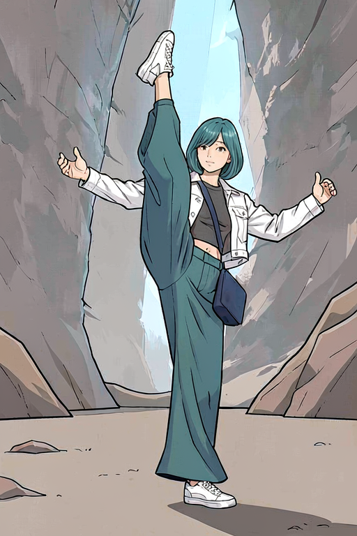

# P7-5.3 스토리보드 생성: 승인 스토리보드를 캐릭터 컷으로 잇기

> Section ID: `P7-5.3`
> Version: `v2026.08.07`

이 절의 경로는 텍스트만으로 장면의 뼈대를 먼저 만들고, 사람이 승인한 스토리보드를 장면 기준으로 삼아 캐릭터 컷으로 다시 그리는 순서다. 스토리보드는 즉시 최종 컷이 아니다. 행동·인체·공간 관계를 고정하는 **장면 기준 이미지**이고, 얼굴·복장 기준은 다음 단계에서 별도 입력으로 더한다.

## 먼저 한 장면 스토리보드를 사람 검수한다

고정 장면은 기암절벽 사이 열린 평지의 현대무용자다. 한 다리는 수직으로 들고 다른 다리는 바닥을 지지하며, 두 팔은 균형을 잡는 방향으로 펼친다. 인물은 양옆·뒤쪽 먼 절벽과 떨어져 있어야 한다. 이 단계에서는 캐릭터 이름·얼굴·복장을 넣지 않고, 텍스트만으로 장면이 읽히는지를 본다.

| 확인할 정보 | 이 장면에서 확인할 기준 |
| --- | --- |
| 인체 | 머리, 두 팔, 두 다리와 큰 동작 실루엣 |
| 행동 | 수직으로 든 다리와 바닥을 딛는 다리의 대비 |
| 공간 | 열린 평지의 인물과 양옆·뒤쪽 먼 기암절벽의 앞뒤 관계 |
| 경계 | 인물 윤곽, 절벽 통로, 바닥의 강한 경계 |
| 접지 | 지지발 전체·밑창·바닥 그림자가 읽히고, 발 외곽이 바위나 지형과 겹치지 않음 |

승인한 스토리보드는 Animagine XL 4.0의 태그형 prompt, `832 x 1216`, 28 step, CFG 5.0, seed `5413`으로 만들었다. 이 수치는 이 장면의 검수 계약이지 모델 일반의 품질 순위가 아니다.

아래 [텍스트 스토리보드 코드](../../../assets/part-07/chapter-05/p7_5_3_text_to_image_storyboard_spec.py)는 고정 prompt와 seed로 스토리보드, lineart, Canny, 상대 depth를 함께 저장한다.

```bash
python docs/assets/part-07/chapter-05/p7_5_3_text_to_image_storyboard_spec.py --seed 5413
```

## 승인 스토리보드에서 장면 기준을 읽는다

| 장면 기준 | 파생 구조 guide |
| --- | --- |
| **승인 스토리보드**<br><br>텍스트만으로 만든 장면 기준 | **lineart guide**<br><br>인물·절벽의 전체 윤곽 |
| **Canny guide**<br><br>강한 경계와 동작 실루엣 | **상대 depth guide**<br><br>인물·바닥·절벽의 앞뒤 관계 |

파생 guide는 장면이 어떤 윤곽과 앞뒤 관계를 갖는지 사람이 확인하는 보조 자료다. 현재 승인 경로에서는 이를 별도 ControlNet 조건으로 다시 해석하지 않고, 승인한 스토리보드 RGB 자체를 다음 단계의 장면 기준으로 사용한다.

## 장면·얼굴·복장을 함께 받아 캐릭터 컷을 만든다

FLUX.2 Klein 4B에는 다음 세 이미지를 순서대로 넣는다.

| 입력 | 역할 |
| --- | --- |
| 승인 스토리보드 | 협곡, 열린 바닥, 카메라, 수직 다리와 지지발의 장면 관계 |
| 얼굴 기준 | 청록 단발과 얼굴 특징 |
| 전신 복장 기준 | 흰 재킷, 청록 넓은 바지, 흰 운동화, 남색 크로스백 |

이 계약에서 `512 x 768`, 50 step, seed `5413`, sequential CPU offload로 만든 결과를 사람 검수로 승인했다. 긴 뒷머리 대신 턱선 길이 단발이 읽히며, 들어 올린 다리의 넓은 바지 주름과 드러난 발목은 동작에 따른 자연스러운 연출로 유지한다. 협곡·지지발·두 팔·수직으로 든 다리도 장면 기준과 함께 읽힌다.



전체 실행 기준은 [FLUX.2 캐릭터 컷 코드](../../../assets/part-07/chapter-05/p7_5_3_flux2_storyboard_character.py)에 둔다. `--steps`, `--seed`, 세 기준 이미지 경로를 바꿔 새 가설을 시험할 수 있지만, 새 결과는 기존 승인 컷을 자동으로 교체하지 않는다.

```bash
python docs/assets/part-07/chapter-05/p7_5_3_flux2_storyboard_character.py \
  --cache-dir .tmp/p7-5-3-flux2-klein-cache \
  --steps 50 --seed 5413
```

실행 기록에는 입력 경로, prompt, seed, 해상도, step, 실행 시간, peak VRAM을 남긴다. 이 승인 표본은 285.8초, peak `3.36 GiB`였다. 다른 카메라·동작·얼굴 방향에서 같은 수준의 일관성이 자동으로 보장되는 것은 아니므로, 컷마다 다시 검수한다.

## 승인 뒤에도 사람 검수를 남긴다

모델이 한 장면에서 통과했다고 해서 모든 컷이 통과한 것은 아니다. 다음 중 하나라도 읽히지 않으면 후보로만 남기고, 승인 자산을 교체하지 않는다.

| 항목 | 확인 질문 |
| --- | --- |
| 장면 | 협곡·열린 바닥·카메라와 인물의 거리가 스토리보드와 같은가? |
| 인체 | 머리, 두 팔, 두 다리, 수직으로 든 다리와 지지발이 모두 읽히는가? |
| 캐릭터 | 단발, 재킷, 바지, 신발, 가방의 수와 위치가 기준과 맞는가? |
| 경계 | 발·바지·가방·절벽이 서로 부자연스럽게 붙거나 중복되지 않는가? |
| 기록 | 입력 기준, prompt, seed, step, 사람 검수 결과를 남겼는가? |

## 출처와 참고 자료

- Animagine XL 4.0은 태그형 caption과 CFG 5, 28 step의 예시를 제시한다. 이 절의 텍스트 스토리보드는 같은 형식의 한 장면 계약으로만 검수했다. [Animagine XL 4.0 모델 카드](https://huggingface.co/cagliostrolab/animagine-xl-4.0){: target="_blank" rel="noopener noreferrer"} (확인: 2026-08-07)
- FLUX.2 Klein 4B는 텍스트 생성과 단일·다중 참조 이미지 편집을 지원하며 Apache-2.0으로 배포된다. 이 절에서는 세 이미지 입력을 장면·얼굴·복장 역할로 나누어 사용한다. [FLUX.2 공식 저장소](https://github.com/black-forest-labs/flux2){: target="_blank" rel="noopener noreferrer"}, [FLUX.2 Klein 4B 모델 카드](https://huggingface.co/black-forest-labs/FLUX.2-klein-base-4b-fp8){: target="_blank" rel="noopener noreferrer"} (확인: 2026-08-07)
