# P7-5.3 캐릭터 identity와 추가 페인팅으로 특징 완성하기

> Section ID: `P7-5.3`
> Version: `v2026.09.13`

[P7-5.2](section-02.md)의 정면 머리와 상반신 참조를 다른 자세의 전신으로 이어 쓰려면, 새로 추가할 특징과 유지할 특징을 나누어야 한다. 이 절에서는 **맨발 기본 의상 → 신발 추가 → 재킷 추가**로 착장을 만든 뒤, 카메라 회전과 동적 장면에서 무엇이 유지되는지 비교한다. 핵심은 입력에 맡긴 역할과 실제 출력의 보존 정도를 구분하는 것이다.

## 입력 역할을 나누고 직전 결과를 이어 쓴다

착장 편집에는 `Qwen/Qwen-Image-Edit-2511`을 사용한다. 단계마다 직전 결과를 첫 번째 참조로 이어 쓰고, 새로 필요한 외형 참조를 두 번째로 넣는다. 1단계만 아직 전신 이미지가 없으므로 OpenPose 구조 맵에서 출발한다.

| 단계 | 첫 번째 참조 | 두 번째 참조 | 추가할 특징과 비교할 대상 |
| --- | --- | --- | --- |
| 1단계 | 정면 body-only OpenPose | P7-5.2 정면 머리 | 맨발 기본 의상을 생성하고 전신 비례·얼굴·헤어를 비교 |
| 2단계 | 1단계 맨발 전신 | 흰색 스니커즈 | 신발을 추가하고 얼굴·기존 착장·자세의 변화도 비교 |
| 3단계 | 2단계 신발을 신은 전신 | P7-5.2 정면 머리 | 열린 흰 재킷을 추가하고 손·기본 착장·신발의 보존을 비교 |

이 표는 모델에 요청하는 역할을 나타낸다. 입력 순서를 나눴다고 얼굴이나 의상 픽셀이 고정되는 것은 아니다. 각 단계의 `result.json`에서 실제 입력과 프롬프트를 확인하고, 전후 이미지를 대조해야 한다. 완성한 3단계 전신은 회전의 유일한 이미지 입력이자 동적 장면의 착장 참조가 된다. 정면 토르소는 동적 장면에서 얼굴·헤어·선과 음영을 보강할 때 사용한다.

[Qwen-Image-Edit-2511 모델 카드](https://huggingface.co/Qwen/Qwen-Image-Edit-2511){: target="_blank" rel="noopener noreferrer"}

## OpenPose로 전신 비율과 프레이밍을 지정한다

OpenPose renderer는 BODY_18 관절 좌표를 색 선과 점으로 그린다. 얼굴·의상·화풍을 생성하는 모델이 아니며, 이 절에서는 맵을 native ControlNet 조건이 아닌 일반 이미지 참조로 넣는다. 맵에 맡긴 포즈와 프레이밍이 생성 결과에 얼마나 반영됐는지 확인해야 한다.

정면 body-only OpenPose는 이전 두 단계 경로의 재킷 전신 프레임을 기준으로 머리·어깨·골반 폭을 유지한 v7 맵이다. 이전 긴 다리 템플릿에서 다리 비중의 10%를 상체·허리 구간으로 옮겨, 전체 키는 그대로 두고 허리는 길게·다리는 짧게 조정했다. 전체 키는 90%로 축소해 960×1440 캔버스에 다시 렌더링했으며, 선과 관절은 각각 반폭·반지름 7px로 키웠다. 양팔은 바깥쪽 아래로 벌려 손목이 몸통 밖에 남는다. 이 맵은 캐릭터 방향을 만드는 장치가 아니라, 생성 결과의 머리·몸통·다리 비율과 화면 안 위치를 비교하는 기준이다.


[정면 v7 OpenPose 좌표 JSON](/AiBook/assets/part-07/chapter-05/p7-5-3-openpose-fullbody-stage2-open-arms-short-long-legs-v7-yaw+00_pitch+00.json)

[정면 v7 OpenPose result.json](/AiBook/assets/part-07/chapter-05/p7-5-3-openpose-fullbody-stage2-open-arms-short-long-legs-v7-result.json)

[OpenPose 관계 맵 Python 생성기](/AiBook/assets/part-07/chapter-05/p7_5_3_generate_openpose_turnaround_relation_maps.py){ .lazy-source }

관계 맵 생성기는 높이로 정규화한 `seven_head_standing` 템플릿에 `stage2-open-arms` 포즈를 적용한 뒤, BODY_18 좌표와 PNG를 함께 쓴다. `--body-pose`, `--frame`, `--targets`, `--height`는 구조 비교를 위해 바꿀 수 있는 값이다. 이 절의 1단계에는 `fullbody`·body-only 출력만 사용한다. FACE_70처럼 턱선·눈·코·입을 모두 포함한 점군은 얼굴 기하를 다시 지정해 P7-5.2의 얼굴 기준과 경쟁하므로 현재 입력에서 제외한다.

## 맨발 전신에 신발과 재킷을 차례로 더한다

### 1단계: 맨발 기본 의상

OpenPose와 정면 머리를 입력하고, 기본 의상 지시 뒤에 `with bare feet and no shoes`를 붙인다. 신발은 다음 단계의 별도 참조로 추가한다.

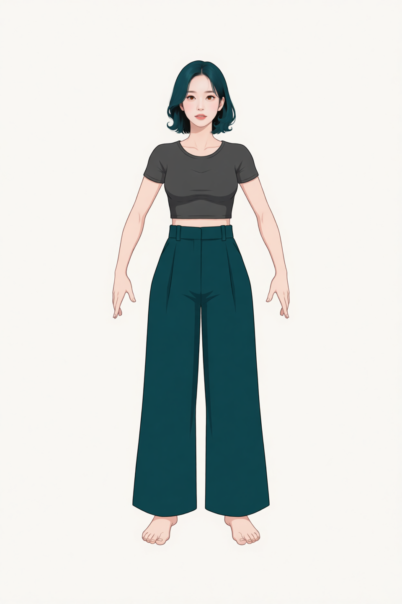

[새 1단계 입력·프롬프트·출력 기록](../../../assets/part-07/chapter-05/p7-5-3-qwen-edit-prompt-style-outfit_stage1_face_openpose-three-stage-v1-seed-62294-steps-10-result.json){ .lazy-source }

로컬 GPU에서 10스텝으로 생성한 결과, 두 발이 맨발로 드러났고 회색 상의와 딥틸 와이드 팬츠가 생성됐다. 상의와 바지 사이에는 좁은 맨허리 띠가 보인다. 입력 두 장과 출력의 해시를 결과 JSON과 대조했다.

### 스니커즈 참조 생성

착장 2단계에 사용할 신발 참조는 색과 형태를 텍스트로 지정해 만든다. `Qwen/Qwen-Image-2512`의 `QwenImagePipeline`에 텍스트만 전달했으며 입력 이미지는 없다.

> A pair of plain white low-top lace-up sneakers with white soles and white laces. Both shoes fully visible, side by side with a small gap, in a three-quarter view. Clean illustration with fine outlines and subtle shading on a plain white background. No colored panels, logos, text, person, feet, or other clothing.

흰 갑피·흰 끈·흰 밑창의 로우탑 스니커즈 두 개를 흰 배경에 나란히 놓고, 앞과 옆이 함께 보이는 각도로 그리도록 지시했다. 로컬 GPU의 BF16 모델과 순차 CPU offload로 1280×1280, 10스텝, seed `62294`, true CFG `4.0`에서 생성했다. 추가 LoRA와 마스크는 사용하지 않았다.

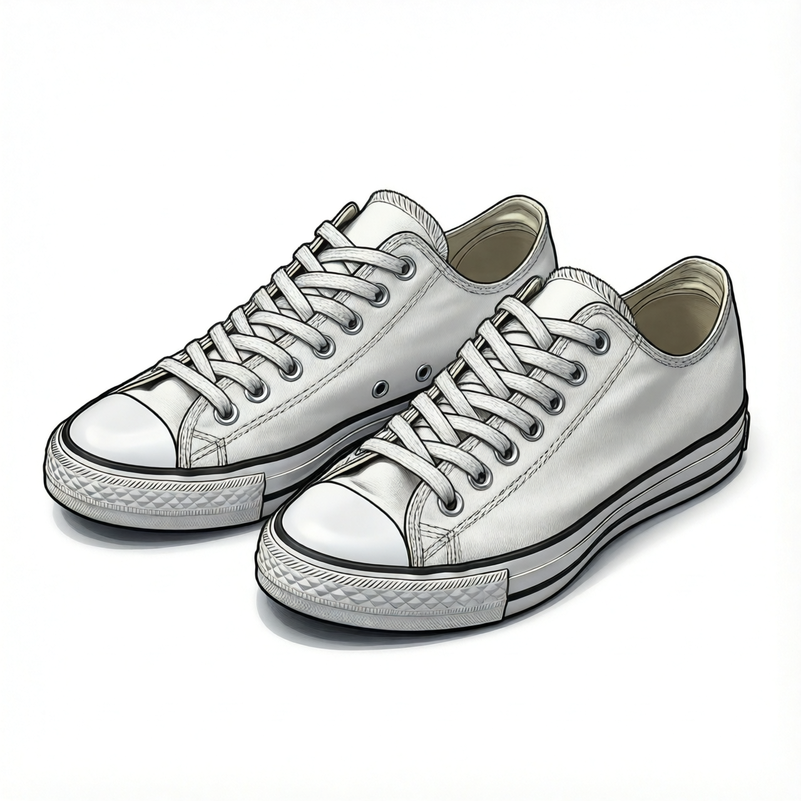

[흰색 스니커즈 프롬프트·실행 조건·출력 기록](../../../assets/part-07/chapter-05/p7-5-3-qwen-image-2512-white-sneakers-v1-size-1280x1280-seed-62294-steps-10-result.json){ .lazy-source }

흰 갑피와 끈, 고무 앞코가 있는 스니커즈 한 쌍이 생성됐고 사람이나 다른 의복은 보이지 않는다. 다만 밑창 가장자리에는 검은 줄이 생겼고, 두 신발은 일부 겹쳤다. 완전히 흰 밑창과 신발 사이 간격 지시까지 충족한 결과는 아니다. 기존 착장의 신발과 같은 제품을 복원한 것으로 취급하지 않고, 새로 정할 신발 디자인의 참조 후보로 검토한다.

[Qwen-Image-2512 신발 생성 코드](../../../assets/part-07/chapter-05/p7_5_3_qwen_image_2512_generate_white_sneakers.py){ .lazy-source }

저장소 루트에서 다음 명령을 사용한다. `--dry-run`을 빼면 생성하며, 기존 출력이 있으므로 재실행에는 새 `--run-label`을 지정한다.

```bash
.venv/bin/python docs/assets/part-07/chapter-05/p7_5_3_qwen_image_2512_generate_white_sneakers.py \
  --steps 10 --run-label v2 --dry-run
```

### 2단계: 신발 추가

2단계에서는 신발 디자인을 글로 다시 설명하지 않고 다음과 같이 참조를 지정한다.

> Put the shoes from Picture 2 on both feet of the woman in Picture 1. Preserve the shoe design and colors from Picture 2. Keep the face, hair, clothing, pose, proportions, and background of Picture 1 unchanged.

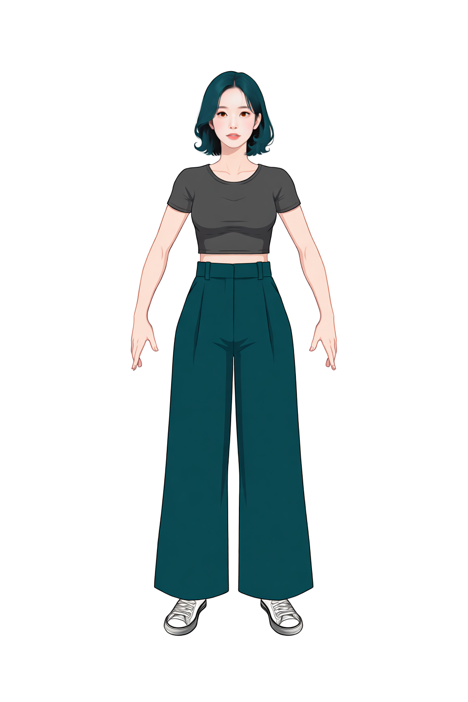

[2단계 입력·프롬프트·출력 기록](../../../assets/part-07/chapter-05/p7-5-3-qwen-edit-prompt-style-outfit_stage2_shoes-three-stage-v1-seed-62294-steps-10-result.json){ .lazy-source }

로컬 GPU에서 960×1440, 10스텝, seed `62294`, true CFG `4.0`으로 생성했다. 양발에 흰색 스니커즈가 추가됐고, 참조의 끈과 검은 밑창 테두리가 반영됐다. 정면 자세와 회색 크롭티·딥틸 와이드 팬츠는 대체로 유지됐다. 다만 배경이 흰색으로 바뀌고 얼굴·피부·의상의 음영이 단순해졌다. 신발 밖의 모든 픽셀이 보존된 결과는 아니다. 이 전신을 3단계 재킷 추가의 첫 입력으로 사용한다.

### 3단계: 재킷 추가

3단계는 2단계 전신을 첫 번째 참조로, P7-5.2 정면 머리를 두 번째 참조로 사용한다. 기존 크롭티·와이드 팬츠·스니커즈·비례를 유지하면서 열린 흰색 크롭 재킷을 더하도록 지시한다. 접혀 내려오는 뾰족한 칼라, 서로 닿지 않는 앞판, 손목까지 오는 소매와 소매 아래 드러나는 양손을 지정했다. 배경은 `Warm off-white background`로 요청했다.

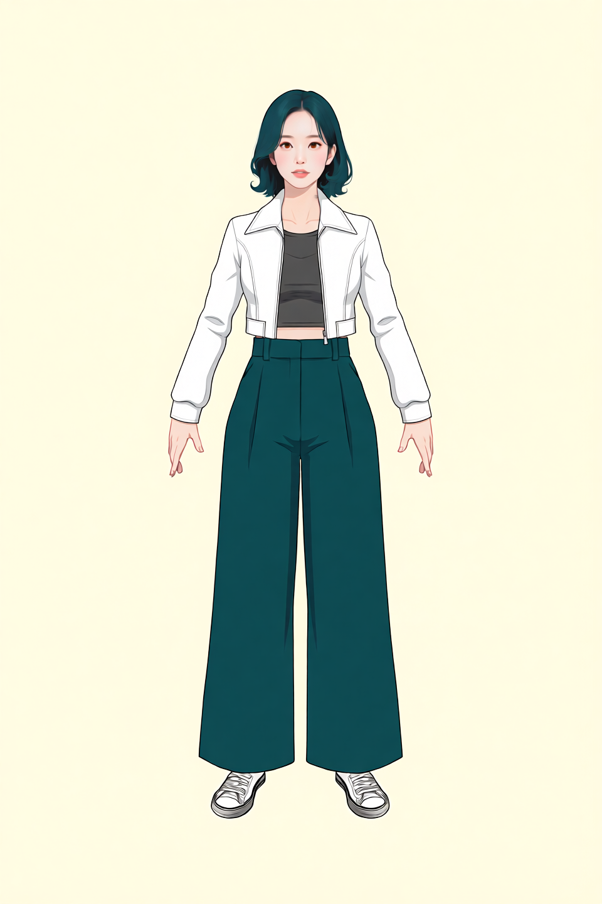

[3단계 입력·프롬프트·출력 기록](../../../assets/part-07/chapter-05/p7-5-3-qwen-edit-prompt-style-outfit_stage3_jacket_face-three-stage-v1-seed-62294-steps-10-result.json){ .lazy-source }

로컬 GPU에서 960×1440, 10스텝, seed `62294`, true CFG `4.0`으로 생성했다. 열린 흰색 재킷과 접힌 칼라가 추가됐고, 소매 아래로 양손이 보인다. 크롭티와 좁은 맨허리 띠, 딥틸 와이드 팬츠, 흰색 스니커즈와 정면 자세는 대체로 유지됐다. 배경은 지시한 대로 따뜻한 크림색으로 바뀌었다. 이 결과가 세 단계 착장 경로의 마지막 출력이며, 아래 회전 15방향과 앨리웁을 재생성할 때 착장 참조로 사용했다.

### 세 단계의 입력 연결과 재실행

착장 생성기는 `OUTFIT_STAGE_TARGETS`에 입력 순서·양성 및 음성 프롬프트·기본 크기·스텝을 둔다. 기본값은 960×1440·10스텝이며, `--targets`로 아래 세 단계를 실행하면 2·3단계가 같은 실행 이름·시드·스텝의 직전 출력을 자동으로 찾는다. 다른 실행의 PNG를 이어 쓰려면 `--target`으로 한 단계만 선택하고 `--input`에 이전 결과를 지정한다.

[착장 1~3단계 생성기](/AiBook/assets/part-07/chapter-05/p7_5_3_qwen_edit_outfit_stages.py){ .lazy-source }

기존 결과는 덮어쓰지 않으므로 사용하지 않은 `--run-label`을 지정한다.

```bash
.venv/bin/python docs/assets/part-07/chapter-05/p7_5_3_qwen_edit_outfit_stages.py \
  --targets outfit_stage1_face_openpose outfit_stage2_shoes outfit_stage3_jacket_face \
  --run-label three-stage-v2 --steps 10
```

`--steps`나 `--size`를 비교할 때는 다른 조건을 고정한다. 결과 JSON에는 선택한 단계, 두 입력과 출력의 해시, 프롬프트, 메모리 배치가 남는다. 착장 생성기의 attention slicing·순차 CPU offload와 회전·동적 장면 생성기의 순차 CPU offload는 메모리 운용 조건이며, 외형 보존의 판정 기준과 구분한다.

[Diffusers CPU offload 문서](https://huggingface.co/docs/diffusers/optimization/memory#cpu-offloading){: target="_blank" rel="noopener noreferrer"}

## 같은 착장을 회전하며 가림과 비례를 비교한다

방향과 카메라 높이가 바뀌면 의상이 몸을 가리는 방식도 달라진다. 이 회전 실험은 정면 3단계 착장에서 재킷·크롭티·팬츠·스니커즈·손의 가림 관계가 어떻게 바뀌는지만 대조한다. 다방향 OpenPose를 추가해 인체의 회전까지 고정하려고 하지 않았다.

정면 3단계 착장을 유일한 이미지 입력으로 사용하고, `Qwen/Qwen-Image-Edit-2511`에 Multiple-Angles LoRA와 Lightning LoRA를 함께 적용했다. Multiple-Angles는 카메라 조건을 보강하고 Lightning은 4-step 샘플링을 맡는다. 프롬프트는 `<sks> [azimuth] [elevation] [distance]` 카메라 토큰만 사용한다. 960×1440, 4-step, 순차 CPU offload로 저각·아이레벨·엘리베이티드와 yaw −90°·−45°·0°·+45°·+90°를 조합한 15방향을 만들었다. 얼굴 identity나 관절 구조를 별도 이미지로 중복 지시하지 않았다.

### 저각 5방향

| −90° | −45° | 정면 | +45° | +90° |
| --- | --- | --- | --- | --- |
| 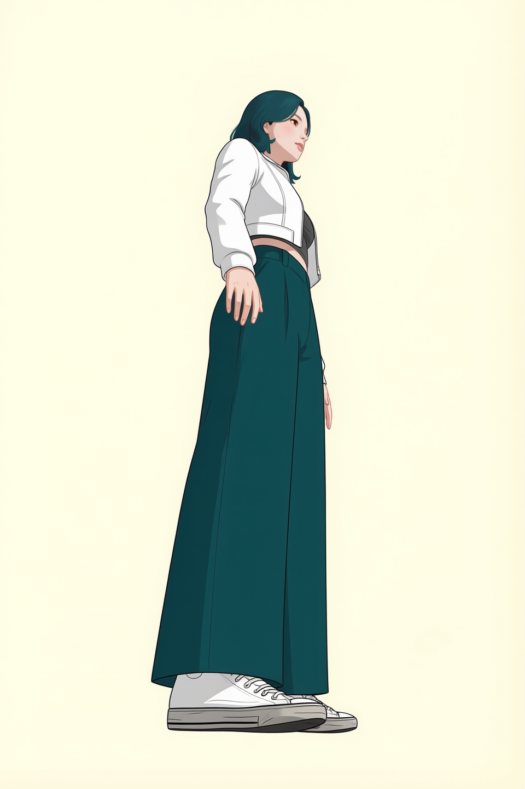 | 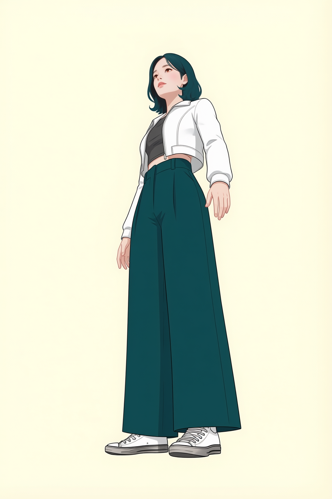 | 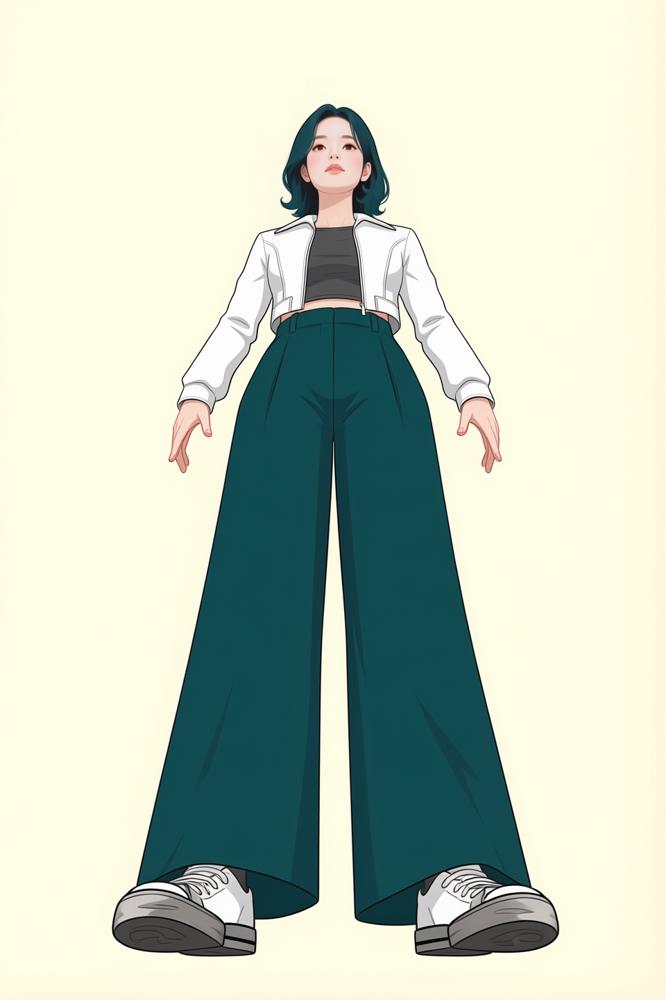 | 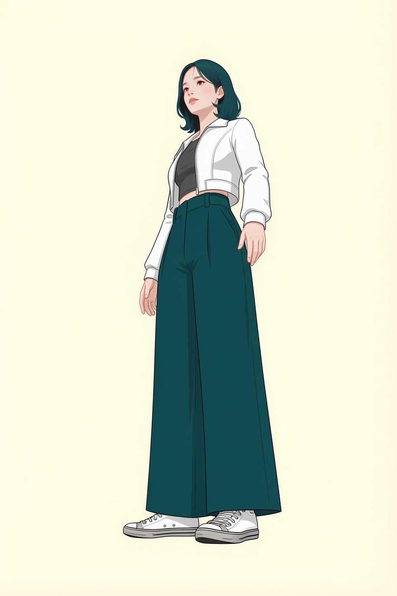 | 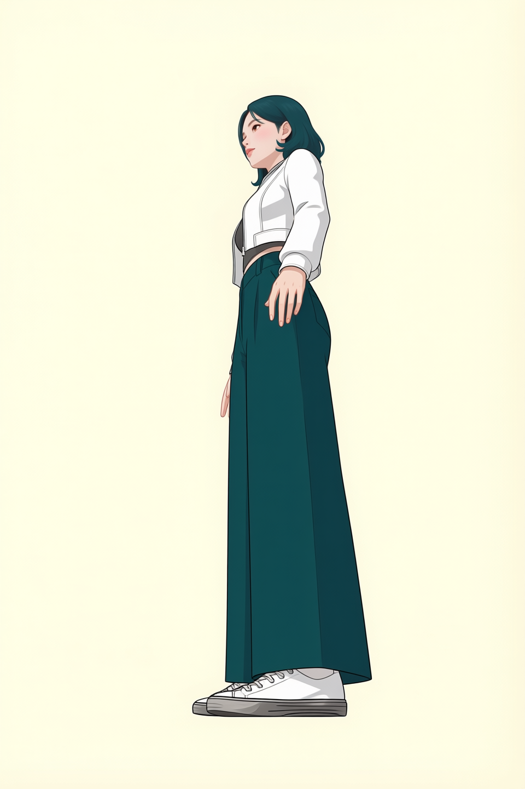 |

[저각 −90° result.json](/AiBook/assets/part-07/chapter-05/p7-5-3-qwen-outfit-stage3-vertical-low-yaw_minus_90-stage3-reference-v1-size-960x1440-seed-62294-steps-4-result.json)

[저각 −45° result.json](/AiBook/assets/part-07/chapter-05/p7-5-3-qwen-outfit-stage3-vertical-low-yaw_minus_45-stage3-reference-v1-size-960x1440-seed-62294-steps-4-result.json)

[저각 정면 result.json](/AiBook/assets/part-07/chapter-05/p7-5-3-qwen-outfit-stage3-vertical-low-yaw_zero-stage3-reference-v1-size-960x1440-seed-62294-steps-4-result.json)

[저각 +45° result.json](/AiBook/assets/part-07/chapter-05/p7-5-3-qwen-outfit-stage3-vertical-low-yaw_plus_45-stage3-reference-v1-size-960x1440-seed-62294-steps-4-result.json)

[저각 +90° result.json](/AiBook/assets/part-07/chapter-05/p7-5-3-qwen-outfit-stage3-vertical-low-yaw_plus_90-stage3-reference-v1-size-960x1440-seed-62294-steps-4-result.json)

### 아이레벨 5방향

| −90° | −45° | 정면 | +45° | +90° |
| --- | --- | --- | --- | --- |
| 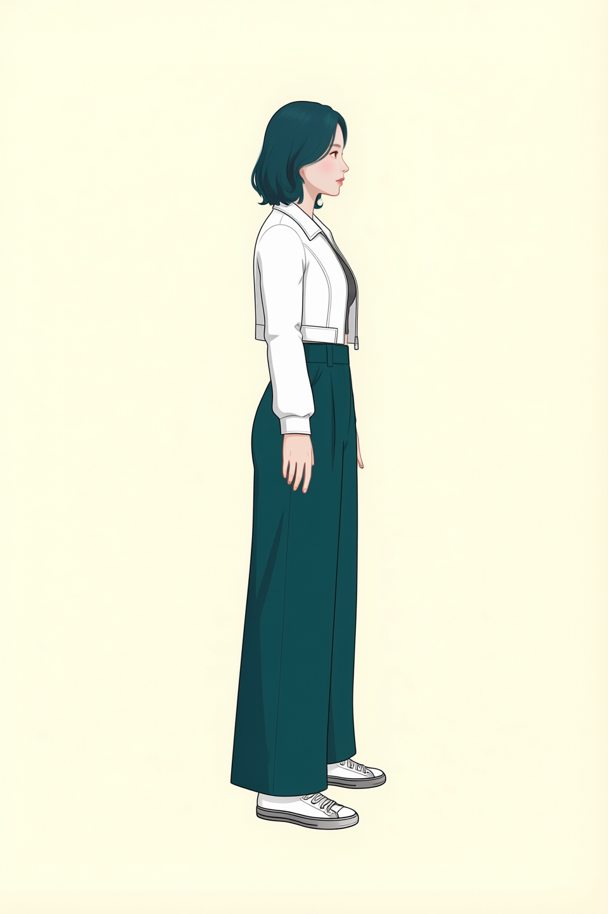 | 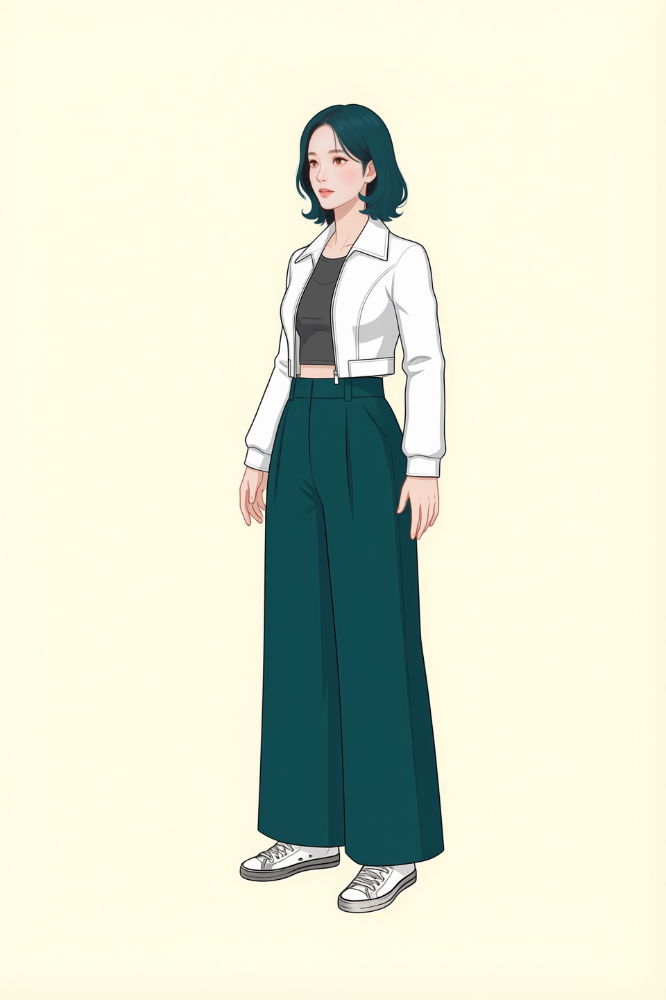 | 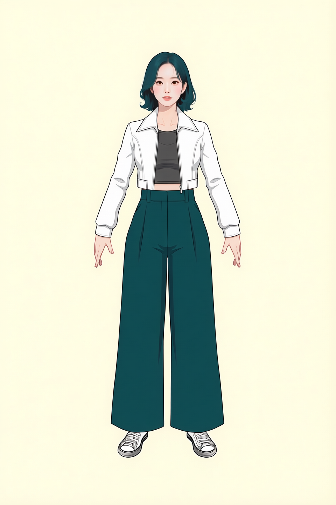 | 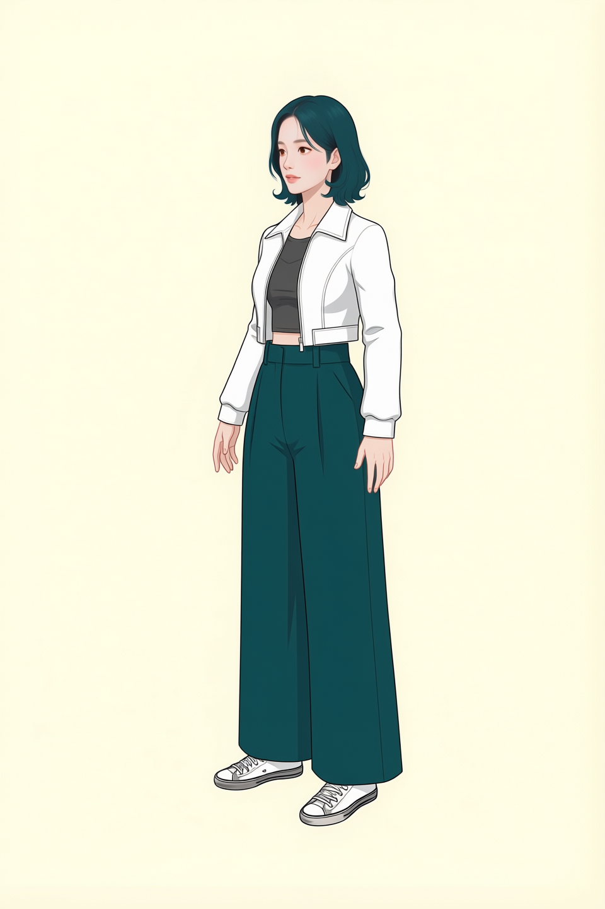 | 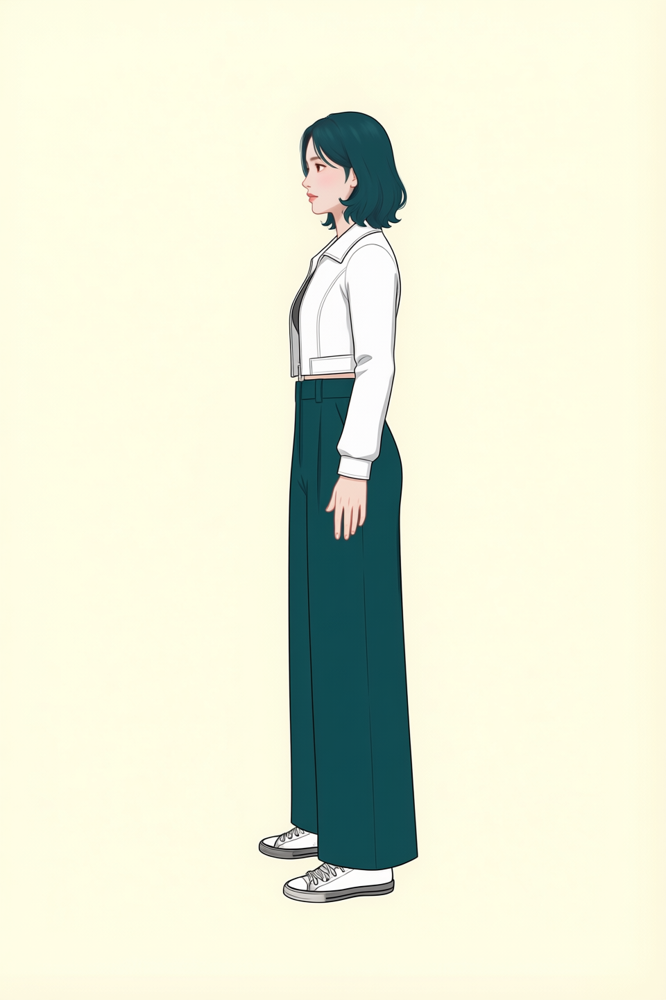 |

[아이레벨 −90° result.json](/AiBook/assets/part-07/chapter-05/p7-5-3-qwen-outfit-stage3-vertical-level-yaw_minus_90-stage3-reference-v1-size-960x1440-seed-62294-steps-4-result.json)

[아이레벨 −45° result.json](/AiBook/assets/part-07/chapter-05/p7-5-3-qwen-outfit-stage3-vertical-level-yaw_minus_45-stage3-reference-v1-size-960x1440-seed-62294-steps-4-result.json)

[아이레벨 정면 result.json](/AiBook/assets/part-07/chapter-05/p7-5-3-qwen-outfit-stage3-vertical-level-yaw_zero-stage3-reference-v1-size-960x1440-seed-62294-steps-4-result.json)

[아이레벨 +45° result.json](/AiBook/assets/part-07/chapter-05/p7-5-3-qwen-outfit-stage3-vertical-level-yaw_plus_45-stage3-reference-v1-size-960x1440-seed-62294-steps-4-result.json)

[아이레벨 +90° result.json](/AiBook/assets/part-07/chapter-05/p7-5-3-qwen-outfit-stage3-vertical-level-yaw_plus_90-stage3-reference-v1-size-960x1440-seed-62294-steps-4-result.json)

### 엘리베이티드 5방향

엘리베이티드 `−45°`는 시드 변경 실험의 `960×1440`·seed `62295`·4스텝 결과로 교체했다. 생성기는 `--seed`를 생략하면 이 방향에 `62295`, 나머지 방향에 `62294`를 적용한다. 명시적 `--seed`는 선택한 모든 방향에 우선 적용된다.

이 한 장은 카메라 조건뿐 아니라 시드도 다르므로, 다른 방향과의 차이를 카메라 변화만의 효과로 해석하지 않는다.

| −90° | −45° | 정면 | +45° | +90° |
| --- | --- | --- | --- | --- |
| 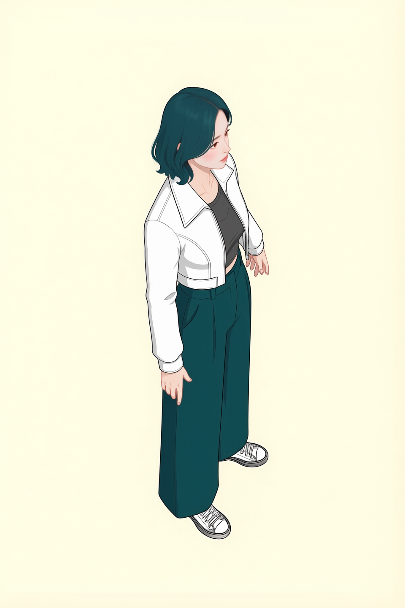 | 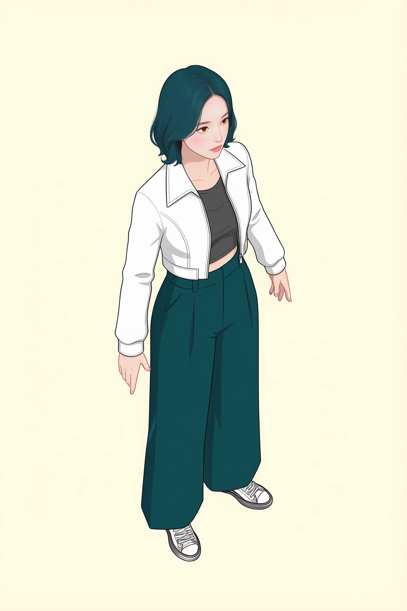 | 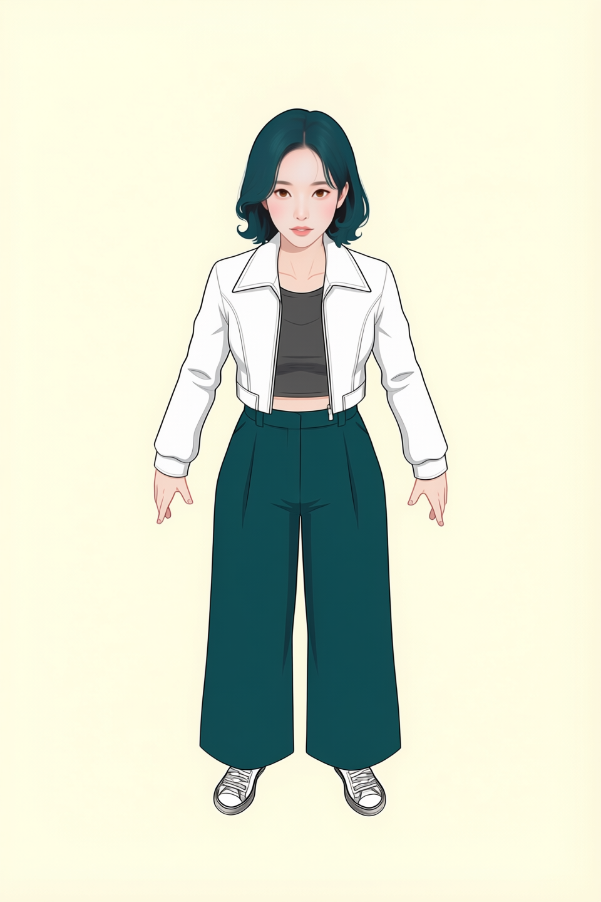 | 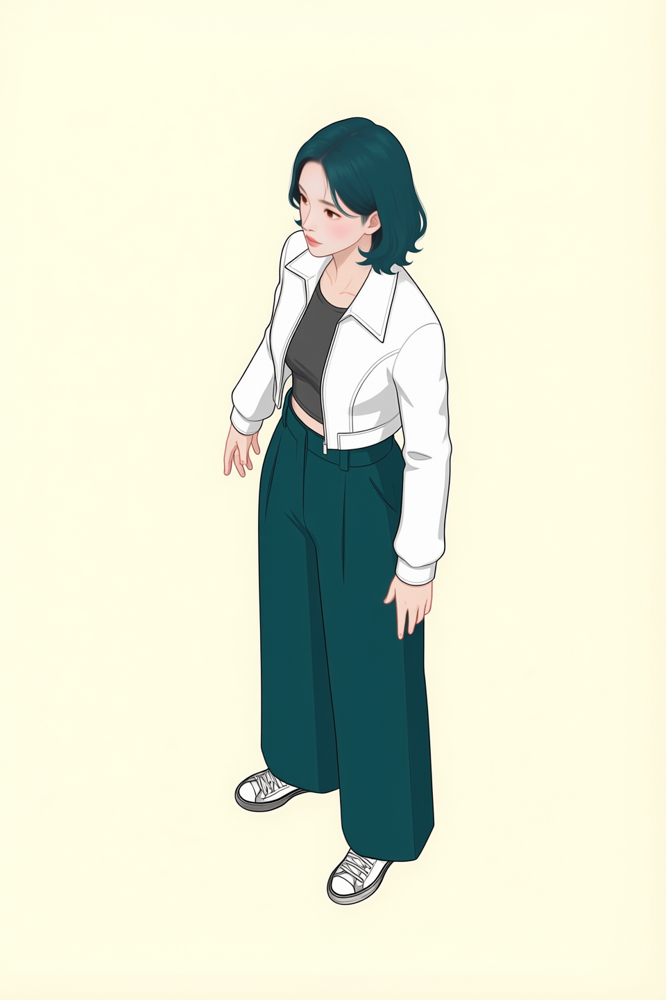 | 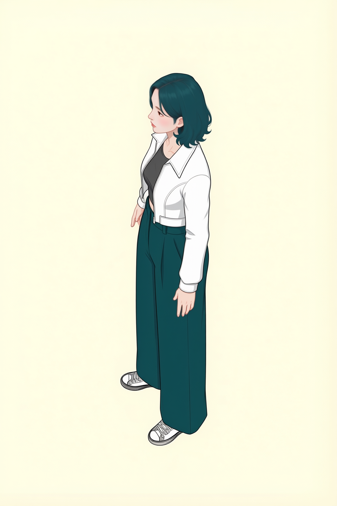 |

[엘리베이티드 −90° result.json](/AiBook/assets/part-07/chapter-05/p7-5-3-qwen-outfit-stage3-vertical-elevated-yaw_minus_90-stage3-reference-v1-size-960x1440-seed-62294-steps-4-result.json)

[엘리베이티드 −45° result.json](/AiBook/assets/part-07/chapter-05/p7-5-3-qwen-outfit-stage3-vertical-elevated-yaw_minus_45-minus45-seed-test-v1-size-960x1440-seed-62295-steps-4-result.json)

[엘리베이티드 정면 result.json](/AiBook/assets/part-07/chapter-05/p7-5-3-qwen-outfit-stage3-vertical-elevated-yaw_zero-stage3-reference-v1-size-960x1440-seed-62294-steps-4-result.json)

[엘리베이티드 +45° result.json](/AiBook/assets/part-07/chapter-05/p7-5-3-qwen-outfit-stage3-vertical-elevated-yaw_plus_45-stage3-reference-v1-size-960x1440-seed-62294-steps-4-result.json)

[엘리베이티드 +90° result.json](/AiBook/assets/part-07/chapter-05/p7-5-3-qwen-outfit-stage3-vertical-elevated-yaw_plus_90-stage3-reference-v1-size-960x1440-seed-62294-steps-4-result.json)

[최초 15방향 실행 기록과 엘리베이티드 −45° 교체 경로](../../../assets/part-07/chapter-05/p7-5-3-qwen-outfit-stage3-yaw-batch-stage3-reference-v1-size-960x1440-seed-62294-steps-4-result.json){ .lazy-source }

기본 결과는 3단계 착장으로 재생성한 `stage3-reference-v1`이며, 엘리베이티드 −45°만 위의 시드 변경 결과로 교체했다. 기본 seed는 `62294`, Multiple-Angles LoRA 강도는 `0.9`, Lightning LoRA 강도는 `1.0`, true CFG는 `1.0`이다. 저각 측면·눈높이 정면·높은 시점의 사선 결과를 대조하면 흰 재킷·딥틸 바지·스니커즈가 보이지만 얼굴 세부와 원근에 따른 비례는 달라진다. 전체 15장의 입력·출력 해시와 크기를 확인했으며, 같은 착장 참조가 모든 픽셀의 일치를 보장하는 것은 아니다.

[전신 착장 15방향 회전 Python 생성기](/AiBook/assets/part-07/chapter-05/p7_5_3_qwen_rotate_fullbody_outfit.py){ .lazy-source }

회전 생성기는 `YAW_CAMERA_VIEWS`와 `VERTICAL_CAMERA_VIEWS`의 곱으로 15개 실행 계획을 먼저 만든 뒤, 각 계획을 하나씩 실행한다. `--yaw`와 `--vertical`로 필요한 방향만 고르고, `--dry-run`으로 이미지 생성 전 prompt·파일명·출력 크기를 확인할 수 있다. Lightning 프로필은 4 step만 허용하며, `--width`와 `--height`는 32의 배수여야 한다. 각 `result.json`은 한 입력 착장, 카메라 조건, LoRA 강도, 4-step 샘플링, 출력 크기와 순차 CPU offload 기록을 남긴다. 이 15개 결과는 같은 착장 입력을 사용하는 카메라 변화 관찰용 출력이며, 특정 이미지 하나가 다음 단계의 기준 입력이 되지는 않는다. 이 형식과 카메라 방향 이름은 [fal Multiple-Angles LoRA 모델 카드](https://huggingface.co/fal/Qwen-Image-Edit-2511-Multiple-Angles-LoRA){: target="_blank" rel="noopener noreferrer"}를 따른다.

## 동적 장면은 전신 기준을 조합해 시험한다

정면 3단계 착장은 전신 의상·비례를, P7-5.2 정면 토르소는 얼굴·헤어·선과 음영을 맡긴다. 앨리웁 생성기는 이 두 이미지만 `Qwen/Qwen-Image-Edit-2511` 공식 BF16 pipeline에 입력한다. 공 하나를 든 오른팔, 균형을 잡는 왼팔, 앞쪽으로 든 왼 무릎과 뒤로 뻗은 오른다리를 짧게 지시하며, 직접 Diffusers와 순차 CPU offload만 사용한다.

아래 결과에서 공·골대·공중 자세와 재킷·바지 길이를 각각 비교해 보자. 동작 반영과 착장 보존을 따로 판정하고, 어느 특징이 달라졌는지 표시한다.

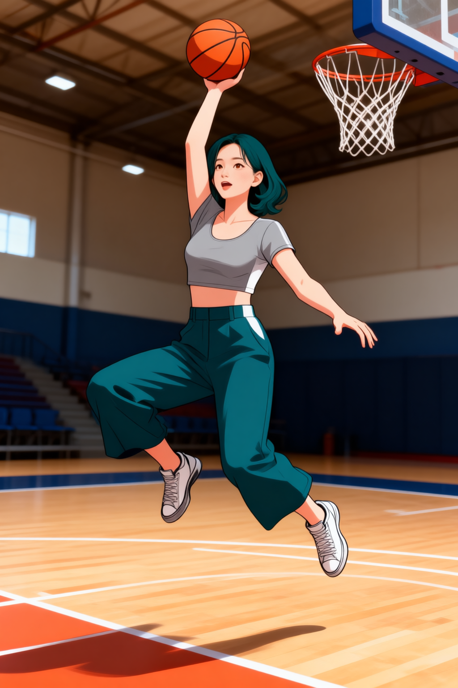

[2511 앨리웁 1024×1536, 20-step result.json](/AiBook/assets/part-07/chapter-05/p7-5-3-qwen-edit-2511-fullbody-alley-oop-stage3-reference-v1-size-1024x1536-seed-62294-steps-20-result.json)

이번 재생성은 3단계 착장과 정면 토르소를 입력으로 사용한 `stage3-reference-v1`이며, seed `62294`, true CFG `4.0`, 20스텝으로 실행했다. 공 하나와 골대 하나가 보이고, 양발이 바닥에서 떨어진 점프 자세와 스니커즈는 생성됐다. 그러나 **흰 재킷이 사라졌고 바지 끝이 발목 위로 올라가 길이가 짧아졌다.** 동작 생성과 착장 보존을 별도로 평가해야 하며, 이 결과를 착장 보존 성공 사례로 취급하지 않는다.

[앨리웁 전신 Python 생성기](/AiBook/assets/part-07/chapter-05/p7_5_3_qwen_edit_fullbody_alley_oop.py){ .lazy-source }

앨리웁 생성기는 `OUTFIT_REFERENCE`와 `TORSO_REFERENCE`를 이 순서로 입력한다. 비교 옵션은 `--steps`, `--size`, `--run-label`이며 기본값은 1024×1536·20스텝이다. 회전에서 쓰는 Lightning 4-step은 적용하지 않는다. 실행 기록에는 두 입력과 출력의 해시, 프롬프트, 스텝, 크기, 실행 시간이 남는다. 결과의 동작이 맞더라도 정면 착장 기준을 대체하지 않는다.

## 보충학습: 보이지 않던 신발 바닥면을 디자인한다 {#shoe-upper-outsole-reference}

앞·옆이 보이는 신발 이미지만으로는 발바닥이 카메라를 향한 장면의 밑창 모양을 직접 참조하기 어렵다. 착장 2단계에 사용한 흰 스니커즈 이미지를 Qwen Image Edit 2511의 단일 입력으로 넣고, 왼쪽에는 윗면, 오른쪽에는 바닥면을 배치한 그림을 생성한다. 끈과 앞코, 밑창 무늬를 한 장에서 볼 수 있어 [P7-5.5](section-05.md)의 A 전경 신발 보강에 사용할 참조로 준비한다.

> Show the sneakers from Picture 1 side by side: the left shoe from directly above, showing its upper and laces; the right shoe from directly below, showing a light taupe rubber outsole with clearly defined triangular tread grooves. Light both shoes evenly so the outsole pattern is clearly visible. Point both toes upward. Keep the white shoe design and illustration style on a white background.

원본에는 바닥의 홈 무늬가 보이지 않는다. 따라서 이 작업은 원본의 숨은 픽셀을 추출하거나 실제 제품의 밑창을 복원하는 과정이 아니라, 참조 신발과 함께 사용할 **새 바닥면 디자인을 생성하는 과정**이다. 발끝이 위, 뒤꿈치가 아래에 오고 밑창 전체가 보이는지 확인한 뒤 장면에 적용한다.

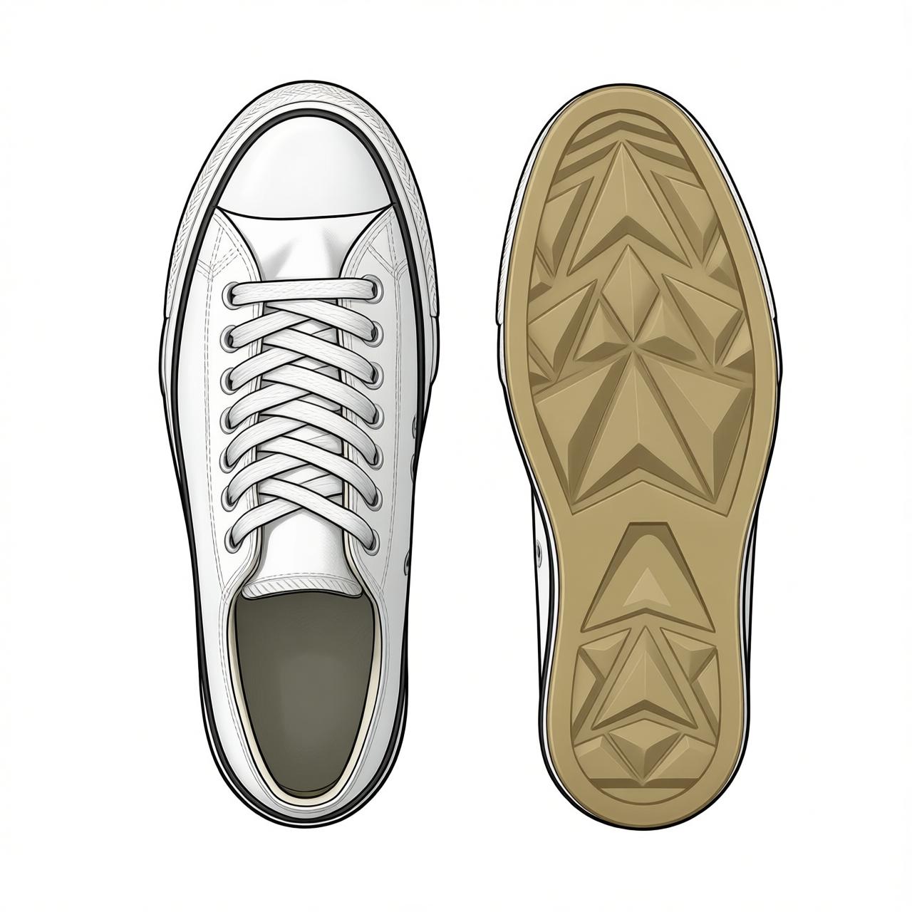

[신발 윗면·바닥면 입력·프롬프트·결과 기록](../../../assets/part-07/chapter-05/p7-5-3-qwen-2511-white-sneaker-outsole-upper-bottom-v3-size-1280x1280-seed-62294-steps-20-result.json){ .lazy-source }

왼쪽에는 흰 갑피·끈·앞코가 보이는 윗면, 오른쪽에는 밝은 황갈색 밑창이 생성됐다. 두 신발 모두 발끝이 위를 향하며, 밑창의 삼각형 홈이 뚜렷하게 보인다. 밑창이 검게 표현돼 무늬를 읽기 어려웠던 결과를 개선하기 위해 밝은 고무색과 고른 조명을 프롬프트에 명시했다. 원본과의 제품 동일성을 확인한 결과는 아니며, 이 윗면·바닥면 이미지를 장면에서 사용할 디자인 참조로 채택한다.

신발 윗면·바닥면 생성기는 로컬 `QwenImageEditPlusPipeline`에 이미지 한 장을 전달한다. BF16, sequential CPU offload, 1280×1280, 20스텝, seed `62294`, true CFG `4.0`을 사용하며 마스크와 LoRA는 넣지 않는다. 모델은 저장소의 `.tmp/download/huggingface/hub` 캐시에서 읽는다.

[신발 윗면·바닥면 생성 코드](../../../assets/part-07/chapter-05/p7_5_3_qwen_edit_2511_generate_shoe_outsole.py){ .lazy-source }

같은 폴더의 공통 경로·이미지 전처리·해시 함수를 가져오므로 재실행할 때 함께 유지한다.

```bash
.venv/bin/python docs/assets/part-07/chapter-05/p7_5_3_qwen_edit_2511_generate_shoe_outsole.py \
  --paired-views --steps 20 --run-label upper-bottom-repeat-v3 --dry-run
```

`--dry-run`을 빼면 생성한다. `--paired-views`는 윗면과 바닥면을 함께 생성하며, 생략하면 기존 바닥면 단독 지시를 사용한다. `--input`은 신발 참조, `--prompt`는 생성 지시를 바꾸며 `--steps`와 `--seed`로 생성 조건을 비교한다. 기존 결과를 덮어쓰지 않으므로 새 `--run-label`을 지정한다. 실행 JSON에는 입력·출력·생성 코드·공통 함수의 해시와 실제 프롬프트·환경을 기록한다. 지시를 바꿔 볼 때는 바닥면 노출과 신발 외곽·화풍 보존을 따로 살핀다.

## 체크리스트

| 확인할 것 | 스스로 답할 질문 |
| --- | --- |
| 역할 | 얼굴·헤어, 의상·손, 관절·프레이밍 중 무엇을 어느 입력이 맡는가? |
| 충돌 | 새 입력이 기존 입력의 얼굴형·착장·관절 역할을 다시 지정하지 않는가? |
| 전신 구조 | 정면 body-only guide의 관절 위치·비례와 실제 출력의 차이를 비교했는가? |
| 재현 | seed, step, 입력 자산, prompt와 `prompt_word_count`가 `result.json`에 남아 있는가? |
| 다음 비교 | 새 구도·장면·소품에서 무엇이 유지됐고 무엇이 달라졌는가? |

## 출처와 참고 자료

- fal, [Qwen-Image-Edit-2511-Multiple-Angles-LoRA 모델 카드](https://huggingface.co/fal/Qwen-Image-Edit-2511-Multiple-Angles-LoRA){: target="_blank" rel="noopener noreferrer" }, Hugging Face, 확인일: 2026-09-01.
- Qwen, [Qwen-Image-Edit-2511 모델 카드](https://huggingface.co/Qwen/Qwen-Image-Edit-2511){: target="_blank" rel="noopener noreferrer" }, Hugging Face, 확인일: 2026-09-01.
- Fannovel16, [ComfyUI ControlNet Auxiliary Preprocessors](https://github.com/Fannovel16/comfyui_controlnet_aux){: target="_blank" rel="noopener noreferrer" }, GitHub, 확인일: 2026-09-01.
- Hugging Face, [Diffusers — Reduce memory usage: CPU offloading](https://huggingface.co/docs/diffusers/optimization/memory#cpu-offloading){: target="_blank" rel="noopener noreferrer" }, Hugging Face, 확인일: 2026-09-11.
