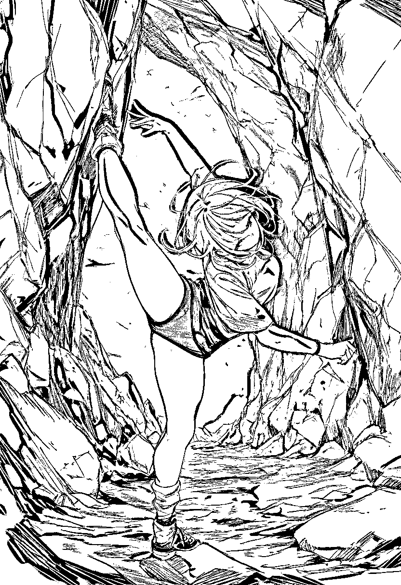
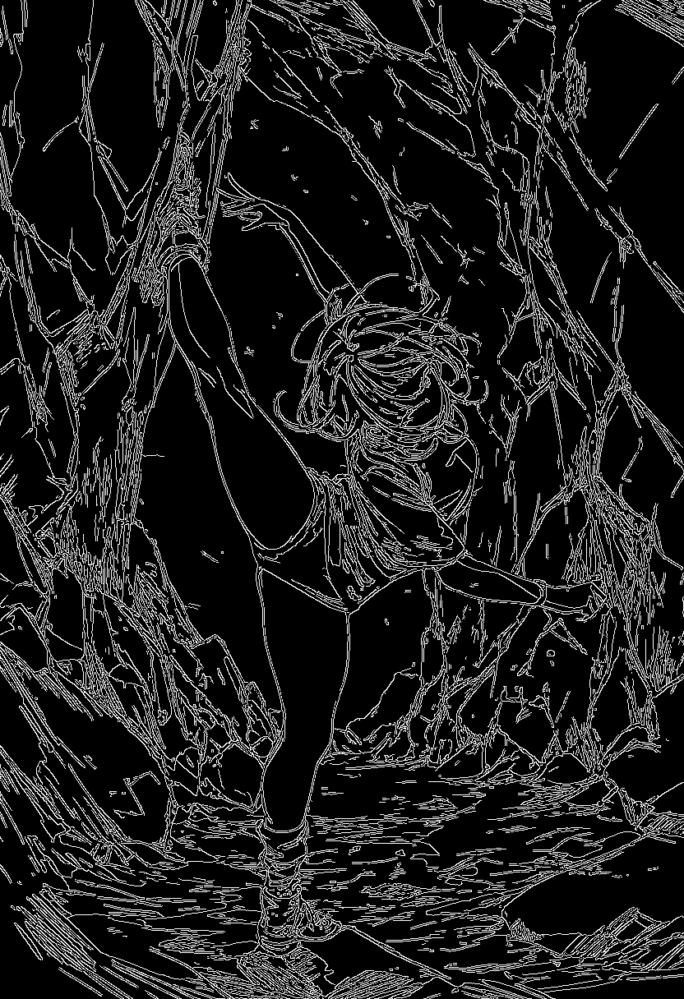
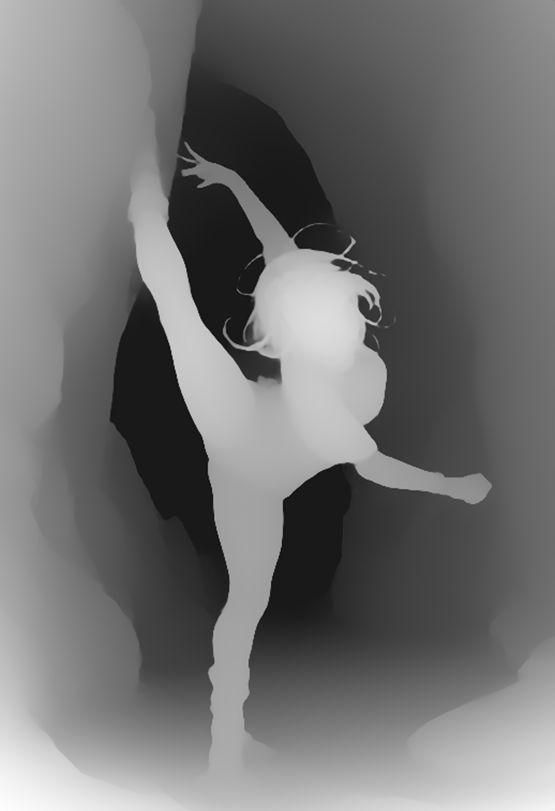

# P7-5.3 스토리보드 생성: 스토리보드에서 구조 guide 추출하기

> Section ID: `P7-5.3`
> Version: `v2026.08.06`

스토리보드는 **텍스트만으로** 먼저 만듭니다. 이전 장면, 배경, 인물 사진을 스토리보드 모델의 입력으로 넣지 않습니다. 사람이 읽을 수 있는 스토리보드만 통과시키고, 그 PNG에서 lineart·canny·상대 depth를 추출합니다. 따라서 guide는 장면을 새로 해석하는 시작점이 아니라, 이미 검수한 한 장면의 구조를 다음 생성에 전달하는 파생 산출물입니다.

## 먼저 한 장면 스토리보드를 사람 검수한다

이 실험의 고정 장면은 기암절벽 사이의 현대무용자입니다. 무용수는 양옆과 뒤쪽의 먼 절벽에서 떨어진 열린 평지에 서고, 검정 민소매 레오타드와 불투명 타이즈를 입은 채 한쪽 다리는 위로 길게 들며 다른 다리는 바닥을 지지하고, 한쪽 팔은 위로, 다른 팔은 옆으로 뻗습니다. 치마나 흩날리는 천은 다리·무릎·발의 연결을 가리므로 이 장면에 넣지 않습니다. 지지발은 발 전체와 밑창의 접지면이 보이고, 주변 바위와 외곽선이 붙거나 겹치지 않아야 합니다. 참조 사진에서 읽은 자세를 문장으로만 풀어 썼을 뿐, 사진 파일은 입력하지 않았습니다.

스토리보드에서는 인물의 이름·얼굴·의상보다 아래 구조가 읽히는지를 봅니다.

| 확인할 정보 | 이 장면에서 확인할 기준 |
| --- | --- |
| 인체 | 머리, 두 팔, 두 다리와 큰 동작 실루엣 |
| 행동 | 위로 든 다리와 바닥을 딛는 다리의 대비 |
| 공간 | 열린 평지의 인물과 양옆·뒤쪽 먼 기암절벽의 앞뒤 관계 |
| 경계 | 인물 윤곽, 절벽 통로, 바닥의 강한 경계 |
| 접지 | 지지발 전체·밑창·바닥 그림자가 읽히고, 발 외곽이 바위나 지형과 겹치지 않음 |

## 승인한 스토리보드의 입력 계약

승인한 경로는 Animagine XL 4.0 하나입니다. 태그형 prompt, `832 x 1216`, 28 step, CFG 5.0을 고정하고 텍스트만 입력합니다. 이 값은 한 장면·한 seed의 검수에서 정한 실행 계약이며, 모델 전체의 일반적인 우열을 뜻하지 않습니다.

| 고정 모델 | 적용한 계약 | 검수 결과 |
| --- | --- | --- |
| Animagine XL 4.0 | 태그형 prompt, 832 x 1216, 28 step, CFG 5.0 | 두 팔·두 다리, 큰 동작, 기암절벽이 함께 읽혀 사람 검수를 통과한 승인 스토리보드 |

다른 모델의 비교·미통과 판단은 이 절의 릴리즈노트에 실험 이력으로만 남기고, 실행 코드의 선택지로는 제공하지 않습니다.

아래 [로컬 GPU 실험 코드](../../../assets/part-07/chapter-05/p7_5_3_text_to_image_storyboard_spec.py)는 승인한 Animagine 계약만 사용합니다. 프롬프트는 소스 안에 고정되어 있고, 실행할 때마다 타임스탬프가 든 `storyboard`, `lineart`, `canny`, `depth` PNG를 저장합니다.

```bash
python docs/assets/part-07/chapter-05/p7_5_3_text_to_image_storyboard_spec.py --seed 5411
```

### 승인 스토리보드와 파생 guide








lineart는 전체 윤곽, canny는 강한 경계, depth는 상대적인 거리만 담습니다. 세 guide는 스토리보드의 오류까지 함께 보존할 수 있으므로, 추출 뒤에도 한 번 더 확인해야 합니다. 특히 지지발·바닥 그림자와 주변 지형이 붙거나 겹치면 guide를 만들지 않고, 텍스트 스토리보드 단계로 되돌아가 접지면과 지형 배치를 다시 생성합니다.

## guide마다 보존하는 구조가 다르다

[구조 guide 웹툰 생성 코드](../../../assets/part-07/chapter-05/p7_5_3_structural_guided_webtoon.py)는 스토리보드 RGB를 초기 이미지로 쓰지 않습니다. seed 노이즈에서 시작하는 text-to-image ControlNet에 장면·화풍 텍스트와 검수한 depth·Canny·lineart PNG를 하나 또는 둘만 전달합니다. 새 컷의 선, 색, 질감은 생성 모델이 다시 만들고, guide는 선택한 구조만 조건으로 줍니다.

프롬프트는 SD 1.5의 CLIP 77-token 한도 안으로 압축했습니다. 기본값은 소형 SDXL Canny의 `768 x 1152`, 28 step, Canny `0.50`이며, `--guide`와 `--seed`만 주면 이 계약으로 실행됩니다. `--backbone sd15`를 고르면 기본값은 `512 x 768`, 24 step, depth `0.65`로 바뀝니다. `--backbone flux1-dev`는 InstantX Flux.1-dev Canny·depth ControlNet을 받을 정적 후보이며, 공식 Canny 예시를 따라 `1024 x 1024`, 28 step, scale `0.50`을 넣었다. 이 저장소에는 아직 Flux.1-dev와 해당 ControlNet 가중치가 없고, 8 GB에서의 실행 성립·VRAM·품질은 검수하지 않았다. `--scale 0.0`은 같은 seed·prompt에서 guide를 끈 비교 기준선입니다.

### Flux.1 구조 제어와 Flux.2 다중 참조를 구분한다

Flux 계열을 한 모델의 기능처럼 섞지 않습니다. `flux1-dev`는 Canny·depth를 구조 조건으로 넣는 이 절의 ControlNet 후보입니다. 반면 이 저장소에서 P7-5.1·P7-5.2에 사용한 Flux.2 Klein은 `image=`에 한 장 또는 여러 장의 참조 이미지를 직접 넣는 이미지 편집·다중 참조 경로입니다. 현 Diffusers에는 Flux.1용 `FluxControlNetPipeline`은 있지만 Flux.2용 ControlNet pipeline은 없으므로, Flux.2를 Canny/depth 전용 `BACKBONE_DEFAULTS`에 넣지 않습니다.

| 계열 | 이 장면에서 검토할 입력 | 현재 판단 |
| --- | --- | --- |
| Flux.1-dev | Canny 또는 depth guide와 text | `flux1-dev` 정적 후보로 추가. 가중치·8 GB 실행 성립·품질은 미검수 |
| Flux.2 Klein | 승인한 캐릭터·화풍·장소 참조 이미지 한 장 또는 여러 장과 text | 다중 참조 편집 후보. 스토리보드 RGB를 넣지 않는 현재 P7-5.3 ControlNet 실험과는 입력 계약이 달라 별도 비교로 분리 |

```bash
python docs/assets/part-07/chapter-05/p7_5_3_structural_guided_webtoon.py \
  --guide docs/assets/part-07/chapter-05/p7-5-3-storyboard-guides/20260806-220313-animagine-seed-5411-canny.png \
  --seed 5411
python docs/assets/part-07/chapter-05/p7_5_3_structural_guided_webtoon.py \
  --backbone sdxl --guide docs/assets/part-07/chapter-05/p7-5-3-storyboard-guides/20260806-220313-animagine-seed-5411-canny.png \
  --guide-kind canny --seed 5411 --scale 0.50 --steps 28 --width 768 --height 1152
python docs/assets/part-07/chapter-05/p7_5_3_structural_guided_webtoon.py \
  --guide docs/assets/part-07/chapter-05/p7-5-3-storyboard-guides/20260806-220313-animagine-seed-5411-canny.png \
  --guide-kind canny --seed 5411 --scale 0.65
python docs/assets/part-07/chapter-05/p7_5_3_structural_guided_webtoon.py \
  --guide docs/assets/part-07/chapter-05/p7-5-3-storyboard-guides/20260806-220313-animagine-seed-5411-canny.png \
  --guide-kind canny --scale 0.65 \
  --second-guide docs/assets/part-07/chapter-05/p7-5-3-storyboard-guides/20260806-220313-animagine-seed-5411-depth.png \
  --second-guide-kind depth --second-scale 0.35 --seed 5411
python docs/assets/part-07/chapter-05/p7_5_3_structural_guided_webtoon.py \
  --guide docs/assets/part-07/chapter-05/p7-5-3-storyboard-guides/20260806-220313-animagine-seed-5411-depth.png \
  --guide-kind depth --seed 5411 --scale 0.0
```

이전 guide 조건 웹툰 후보는 승인 자산이 아니므로 저장소에서 제거했습니다. 위 명령으로 새 컷을 만들 때마다 행동·인체·공간 관계와 화풍을 다시 사람 검수해야 하며, 얼굴 일관성·섬세한 손·최종 화풍 승인은 별도 단계에서 판단합니다.

## 출처와 참고 자료

- Hugging Face Diffusers는 ControlNet이 text prompt에 Canny·depth 같은 구조 제어를 더하고, 제어 강도를 별도로 조절하는 방식을 설명합니다. [ControlNet 문서](https://huggingface.co/docs/diffusers/using-diffusers/controlnet){: target="_blank" rel="noopener noreferrer"} (확인: 2026-08-06)
- Depth Anything V2 Small은 단일 이미지에서 상대 깊이를 추정하는 경량 모델입니다. 이 실험은 Transformers 호환 checkpoint를 `.tmp/`에 내려받아 사용했습니다. [Depth Anything V2 Small 모델 카드](https://huggingface.co/depth-anything/Depth-Anything-V2-Small-hf){: target="_blank" rel="noopener noreferrer"} (확인: 2026-08-06)
- Animagine XL 4.0 모델 카드는 태그형 caption, `masterpiece`·점수 태그, CFG 5와 28 step의 예시를 제시합니다. [Animagine XL 4.0 모델 카드](https://huggingface.co/cagliostrolab/animagine-xl-4.0){: target="_blank" rel="noopener noreferrer"} (확인: 2026-08-06)
- depth 조건 모델은 SD 1.5와 함께 쓰도록 변환된 ControlNet v1.1 checkpoint입니다. [ControlNet depth 모델 카드](https://huggingface.co/lllyasviel/control_v11f1p_sd15_depth){: target="_blank" rel="noopener noreferrer"} (확인: 2026-08-06)
- lineart 조건 모델은 SD 1.5와 함께 쓰는 ControlNet v1.1 checkpoint이며 Diffusers 사용 예시를 제공합니다. [ControlNet lineart 모델 카드](https://huggingface.co/lllyasviel/control_v11p_sd15_lineart){: target="_blank" rel="noopener noreferrer"} (확인: 2026-08-06)
- 소형 SDXL Canny ControlNet은 SDXL Base 1.0용으로 학습된 원본보다 7배 작은 실험적 checkpoint입니다. 모델 카드는 Canny 조건 강도 0.5와 CPU offload 예시를 제시하며, 복잡한 조건에서는 큰 checkpoint가 더 나을 수 있다고 설명합니다. [소형 SDXL Canny ControlNet 모델 카드](https://huggingface.co/diffusers/controlnet-canny-sdxl-1.0-small){: target="_blank" rel="noopener noreferrer"} (확인: 2026-08-06)
- Diffusers는 Flux.1의 `FluxControlNetPipeline`에서 InstantX의 Canny·depth·Union ControlNet과 XLabs의 Canny·depth·HED ControlNet을 지원한다고 안내합니다. 이 절은 공식 예시의 InstantX Flux.1-dev Canny 설정만 정적 후보로 추가했으며, 아직 실행 결과를 주장하지 않습니다. [Flux.1 ControlNet 문서](https://huggingface.co/docs/diffusers/api/pipelines/controlnet_flux){: target="_blank" rel="noopener noreferrer"} (확인: 2026-08-06)
- Flux.2 Klein은 이미지 한 장 또는 여러 장을 `image=`로 받는 이미지 조건 경로를 제공하며, Hugging Face는 최대 10장의 다중 참조를 설명합니다. 이 문서에서는 Flux.1 ControlNet과 기능을 혼동하지 않도록 별도 후보로만 기록합니다. [Flux.2 문서](https://huggingface.co/docs/diffusers/api/pipelines/flux2){: target="_blank" rel="noopener noreferrer"}, [Flux.2 다중 참조 안내](https://huggingface.co/blog/flux-2){: target="_blank" rel="noopener noreferrer"} (확인: 2026-08-06)

## 체크리스트

| 확인할 것 | 스스로 답할 질문 |
| --- | --- |
| 스토리보드 | 행동·인체·거리 관계와 지지발의 윤곽·접지면이 먼저 읽히는가? |
| 입력 계약 | 승인 모델의 prompt 형식·해상도·step·guidance를 맞췄는가? |
| lineart·canny | 필요한 윤곽·경계만 남기고 잡음까지 고정하지 않았는가? |
| 구조 guide | depth·Canny·lineart 중 이 장면에서 실제로 필요한 구조를 더 잘 보존한 것은 무엇인가? |
| 채택 | 스토리보드와 모든 guide를 사람 검수한 뒤에만 다음 생성 입력으로 넘겼는가? |
