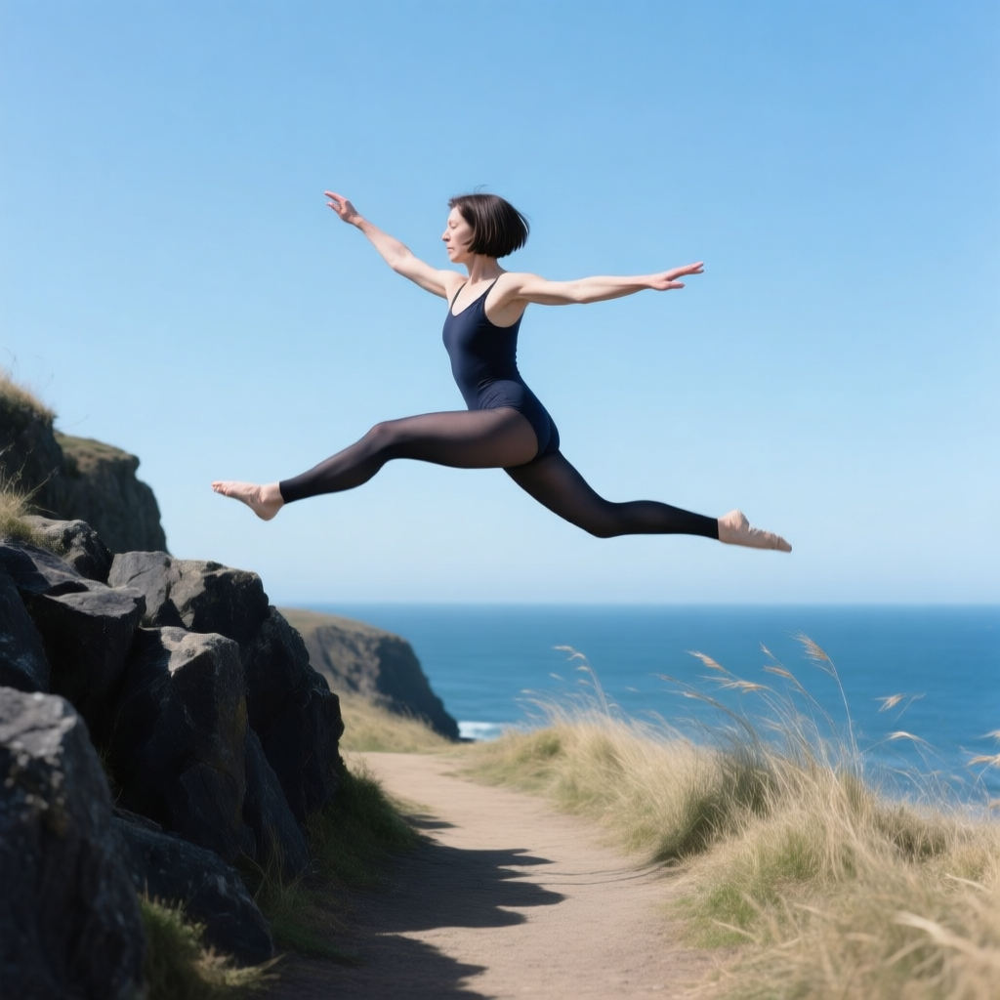
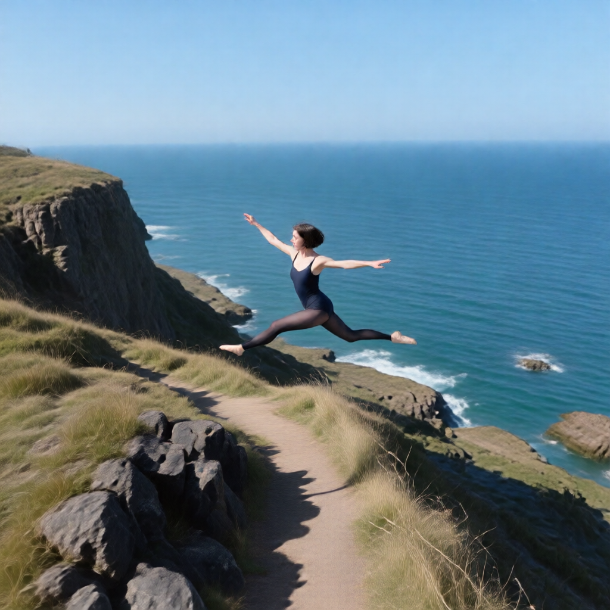
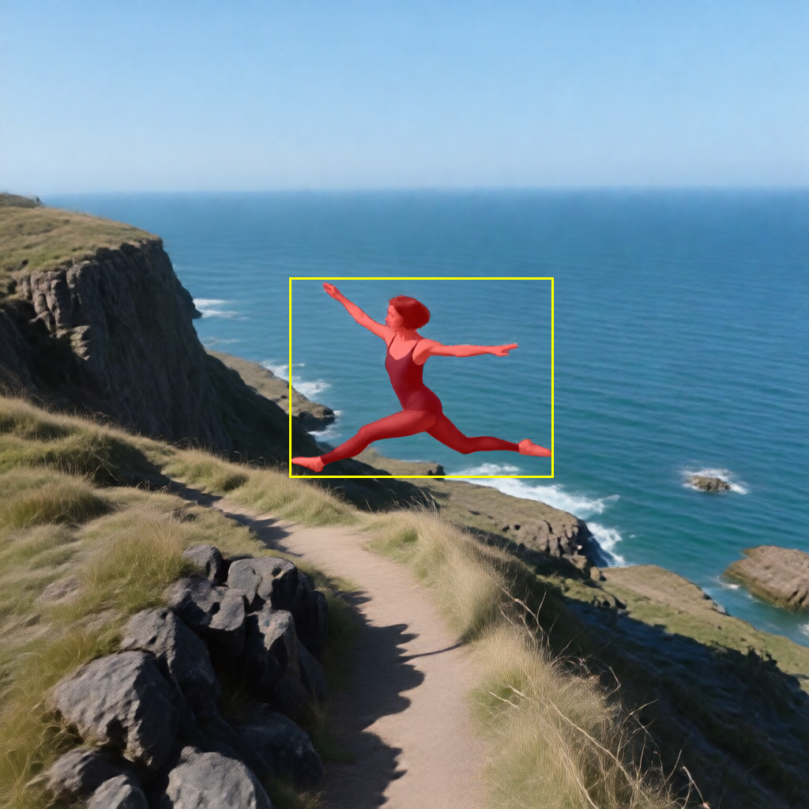
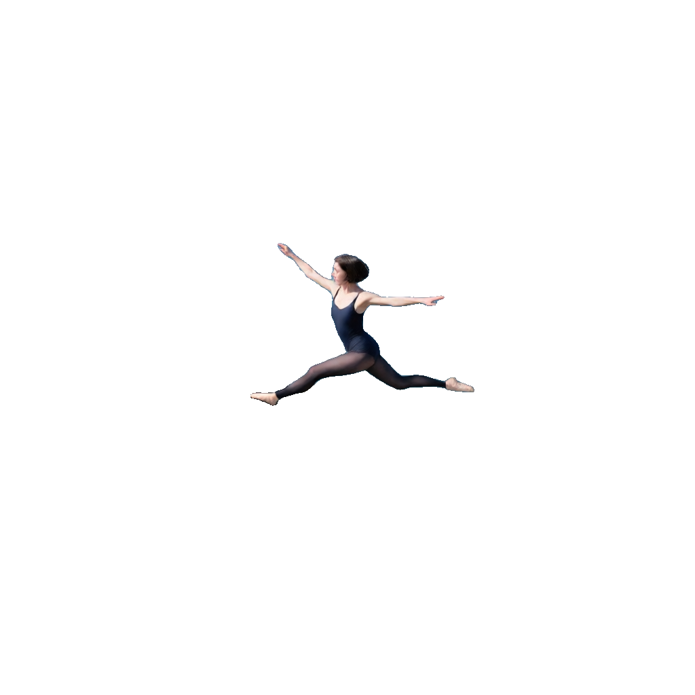
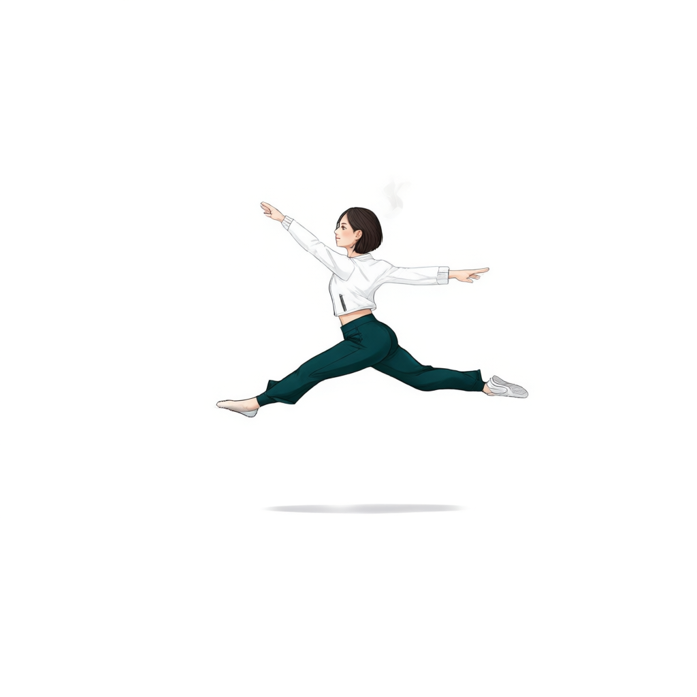
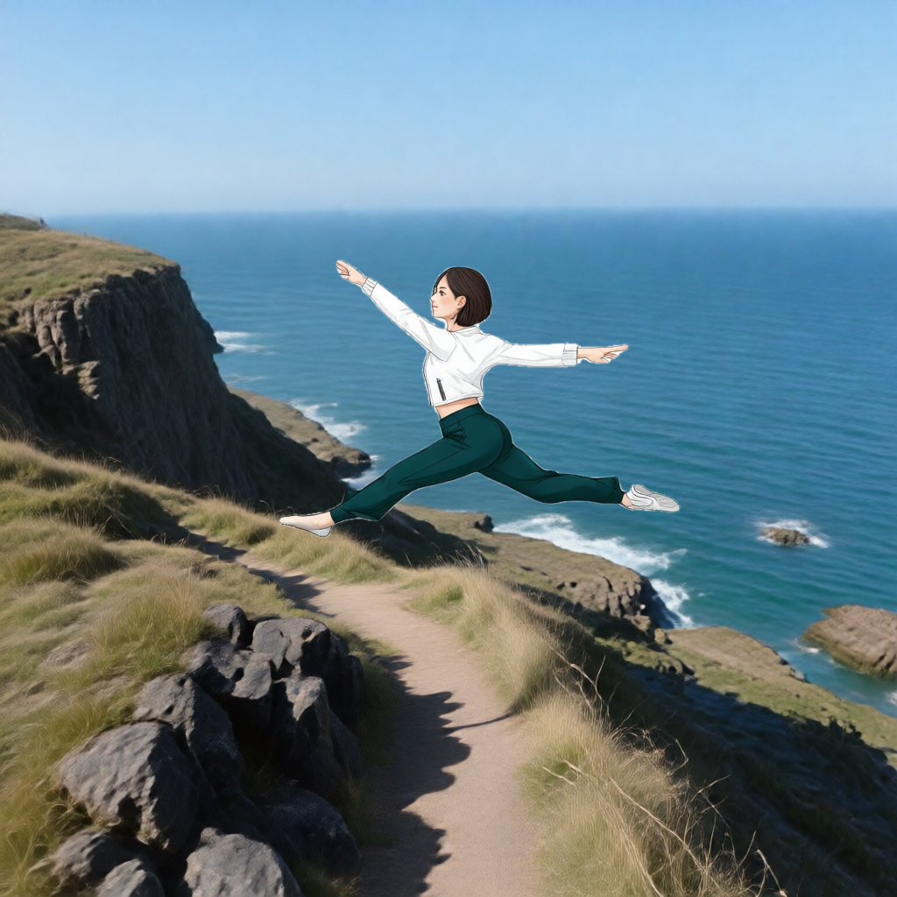

# P7-5.3 스토리보드 장면에 캐릭터를 합성하는 최단 경로

> Section ID: \`P7-5.3\`
> Version: \`v2026.08.27\`

이 절의 목표는 장면을 다시 생성할 때마다 캐릭터의 포즈·의상·얼굴이 달라지는 문제를 줄이는 것이다. 현재 경로는 장면에서 포즈와 배경을 분리하고, P7-5.2에서 만든 캐릭터를 그 포즈에 이식한 뒤, 마지막에 두 레이어를 합친다. 각 단계의 result.json에는 실제 입력 파일, SHA-256, 모델, seed, step을 남긴다. 따라서 이미지 파일 이름만 보고 추측하지 않고 결과 JSON을 따라 입력 관계를 확인한다.

## 장면 A를 카메라판으로 고정한다

먼저 해안 절벽 장면을 만들고, 완만한 높은 시점의 와이드 카메라판 한 장을 선택한다. 이 카메라판은 이후 포즈와 배경의 공통 기준이다.

| 장면 A | 카메라판 |
| --- | --- |
|  |  |
| [장면 result.json](../../../assets/part-07/chapter-05/p7-5-3-qwen-storyboard-scene-a-349252-seed-5420-steps-20-result.json) | [카메라 result.json](../../../assets/part-07/chapter-05/p7-5-3-qwen-2511-camera-no-azimuth-elevated-scene-a-v1-seed-5420-steps-4-result.json) |

카메라판을 직접 다음 단계의 기준으로 삼는 이유는, 배경·포즈·인물의 화면상 위치를 하나의 이미지에 고정하기 위해서다. 카메라 생성 JSON에는 이 결과가 Qwen Image Edit 2511 Multiple Angles의 elevated shot wide shot, seed 5420, 4 step으로 생성됐음이 기록돼 있다.

## 한 마스크를 포즈와 배경에 함께 쓴다

Grounding DINO와 SAM 2.1이 카메라판에서 인물을 찾아 흰색 마스크로 만든다. 이 마스크는 두 역할을 갖는다. 원래 인물을 흰색 무광 배경으로 잘라 포즈·프레이밍 참조를 만들고, 같은 영역을 LaMa로 메워 빈 배경판을 만든다. 같은 마스크를 쓰므로 두 결과의 인물 자리와 배경의 빈자리가 일치한다.

| 인물 마스크 검수 | 흰 배경 포즈 참조 | LaMa 배경판 |
| --- | --- | --- |
|  |  |  |
| [마스크 result.json](../../../assets/part-07/chapter-05/p7-5-3-sam2-person-mask-scene-a-2511-elevated-v1-result.json) | [포즈 컷아웃 result.json](../../../assets/part-07/chapter-05/p7-5-3-character-pose-cutout-white-scene-a-white-v2-result.json) | [배경판 result.json](../../../assets/part-07/chapter-05/p7-5-3-lama-background-scene-a-v3-result.json) |

마스크 JSON은 카메라판의 SHA-256과 검출 상자·마스크 의미를 기록한다. LaMa 결과 JSON은 같은 카메라판과 마스크를 입력으로 삼고, 흰 영역만 주변 배경으로 복원했음을 기록한다.

~~~bash
python docs/assets/part-07/chapter-05/p7_5_3_generate_person_mask.py \
  --reference docs/assets/part-07/chapter-05/p7-5-3-qwen-2511-camera-no-azimuth-elevated-scene-a-v1-seed-5420-steps-4.png \
  --run-label scene-a-2511-elevated-v1

python docs/assets/part-07/chapter-05/p7_5_3_extract_masked_character.py \
  --scene docs/assets/part-07/chapter-05/p7-5-3-qwen-2511-camera-no-azimuth-elevated-scene-a-v1-seed-5420-steps-4.png \
  --mask docs/assets/part-07/chapter-05/p7-5-3-sam2-person-mask-scene-a-2511-elevated-v1.png \
  --matte white --run-label pose-cutout-white-scene-a-white-v2

python docs/assets/part-07/chapter-05/p7_5_3_restore_background_lama.py \
  --scene docs/assets/part-07/chapter-05/p7-5-3-qwen-2511-camera-no-azimuth-elevated-scene-a-v1-seed-5420-steps-4.png \
  --mask docs/assets/part-07/chapter-05/p7-5-3-sam2-person-mask-scene-a-2511-elevated-v1.png \
  --run-label scene-a-v3 --grow 25
~~~

## 포즈에 캐릭터를 이식한다

Qwen Image Edit 2509에는 역할이 다른 두 이미지만 준다. 첫 번째는 위의 흰 배경 포즈 참조이고, 두 번째는 P7-5.2의 +90° 전신 착장 이미지다. 지시는 첫 이미지의 여성을 두 번째 이미지의 여성으로 바꾸되 포즈를 유지한다로 제한한다. 이 단계에서 배경을 넣지 않으므로, 배경의 색·화풍이 얼굴과 의상을 덮어쓰지 않는다.

| 포즈에 이식된 캐릭터 | 인물 알파 마스크 검수 |
| --- | --- |
|  |  |
| [포즈 이식 result.json](../../../assets/part-07/chapter-05/p7-5-3-qwen-2509-pose-transfer-plus90-replace-v2-seed-62294-steps-10-result.json) | [알파 마스크 result.json](../../../assets/part-07/chapter-05/p7-5-3-sam2-person-mask-pose-transfer-plus90-replace-v2-result.json) |

포즈 이식 JSON에는 두 입력의 SHA-256, seed 62294, 10 step, true_cfg_scale 4.0이 기록돼 있다. 이후 SAM2 마스크는 이식된 캐릭터의 실루엣만 남겨 배경과 안전하게 합치기 위한 알파 채널이다.

~~~bash
python docs/assets/part-07/chapter-05/p7_5_3_qwen_edit_pose_transfer.py \
  --pose docs/assets/part-07/chapter-05/p7-5-3-character-pose-cutout-white-scene-a-white-v2.png \
  --character docs/assets/part-07/chapter-05/p7-5-2-qwen-outfit-stage2-yaw_plus_90-multiple-angle-v1-seed-62294-steps-8.png \
  --run-label plus90-replace-v2 --steps 10
~~~

## 알파 합성 뒤에 광원과 화풍을 한 번만 정리한다

캐릭터 PNG, 캐릭터 마스크, LaMa 배경판을 알파 합성한다. 합성 단계는 캐릭터 가장자리만 0.8 픽셀로 부드럽게 하고, 포즈·위치·의상 픽셀을 다시 생성하지 않는다. 마지막 Qwen Image Edit 2509 단계에서만 배경을 캐릭터와 같은 일러스트 톤으로 맞추고, 좌상단의 부드러운 자연광을 공통 기준으로 적용한다.

| 알파 합성 | 최종 화풍·광원 통일 |
| --- | --- |
|  |  |
| [합성 result.json](../../../assets/part-07/chapter-05/p7-5-3-character-background-composite-scene-a-v1-result.json) | [최종 result.json](../../../assets/part-07/chapter-05/p7-5-3-qwen-2509-harmonized-composite-scene-a-v1-seed-62294-steps-10-result.json) |

최종 JSON은 바로 앞 합성 PNG의 SHA-256을 입력으로 기록한다. 따라서 최종 이미지를 다시 만들 때는 위 순서의 각 JSON에서 입력 해시가 연결되는지만 확인하면 된다.

~~~bash
python docs/assets/part-07/chapter-05/p7_5_3_composite_character_background.py \
  --character docs/assets/part-07/chapter-05/p7-5-3-qwen-2509-pose-transfer-plus90-replace-v2-seed-62294-steps-10.png \
  --mask docs/assets/part-07/chapter-05/p7-5-3-sam2-person-mask-pose-transfer-plus90-replace-v2.png \
  --background docs/assets/part-07/chapter-05/p7-5-3-lama-background-scene-a-v3.png \
  --run-label scene-a-v1

python docs/assets/part-07/chapter-05/p7_5_3_qwen_harmonize_composite.py \
  --input docs/assets/part-07/chapter-05/p7-5-3-character-background-composite-scene-a-v1.png \
  --run-label scene-a-v1 --steps 10
~~~

알파 합성 코드 보기

SAM2 마스크를 알파 채널로 적용해 캐릭터를 LaMa 배경판에 합성하고, 입력과 결과 해시를 result.json에 기록합니다.

광원·화풍 통일 코드 보기

합성 이미지를 하나만 입력해 포즈와 구도를 유지하면서 일러스트 톤과 좌상단 자연광을 정리합니다.

## 확인할 점

- 포즈·캐릭터·배경의 역할을 한 번의 Qwen 편집 입력에 모두 넣지 않는다.
- 같은 카메라판의 마스크로 포즈 참조와 배경판을 만들었는지 각 result.json의 입력 해시로 확인한다.
- 합성 전 캐릭터 마스크에 머리카락·손끝·양발이 포함됐는지 오버레이를 확인한다.
- 공중에 있는 인물에는 접지 그림자를 추가하지 않는다. 최종 단계는 광원과 렌더링 톤만 정리한다.
