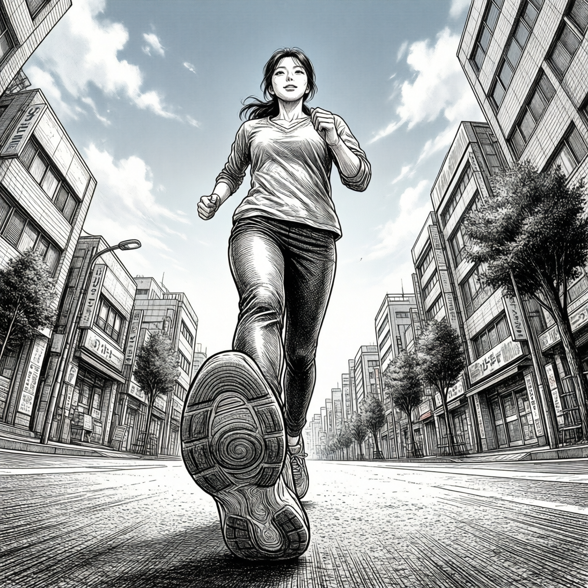
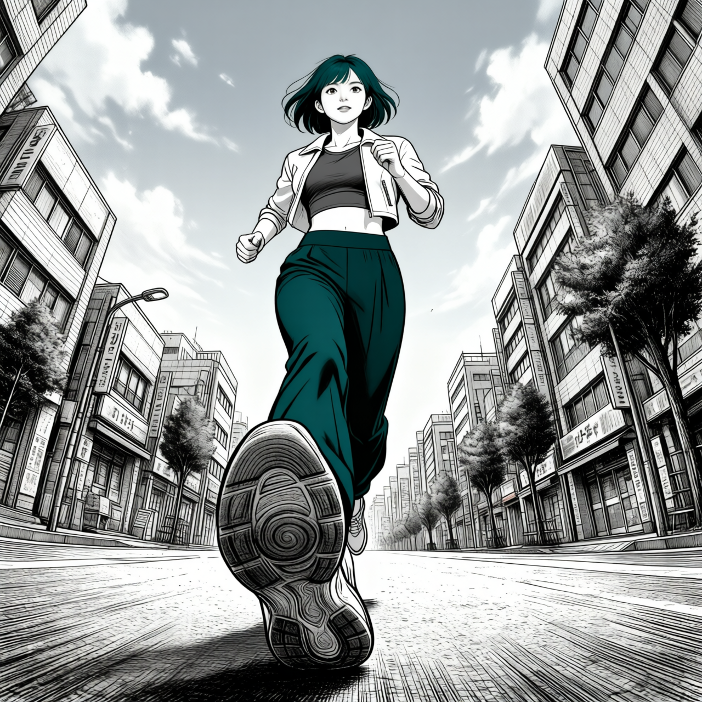
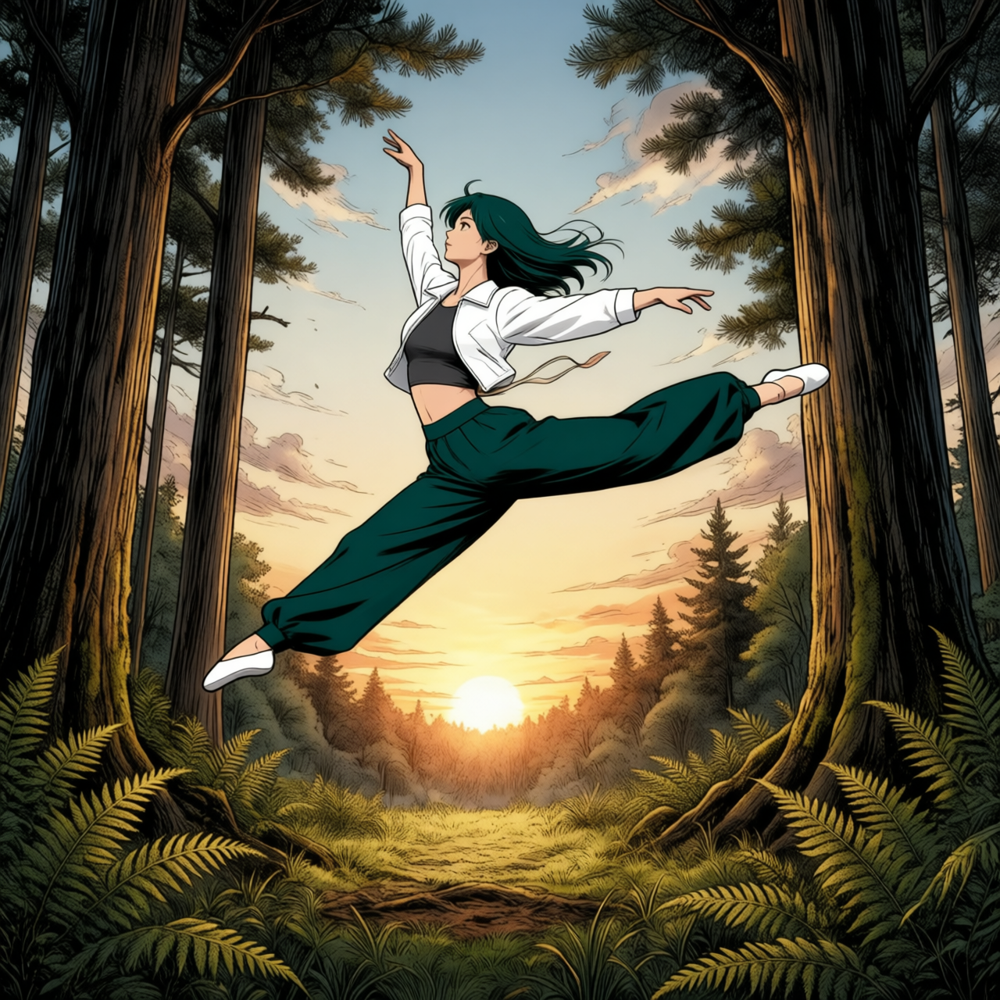
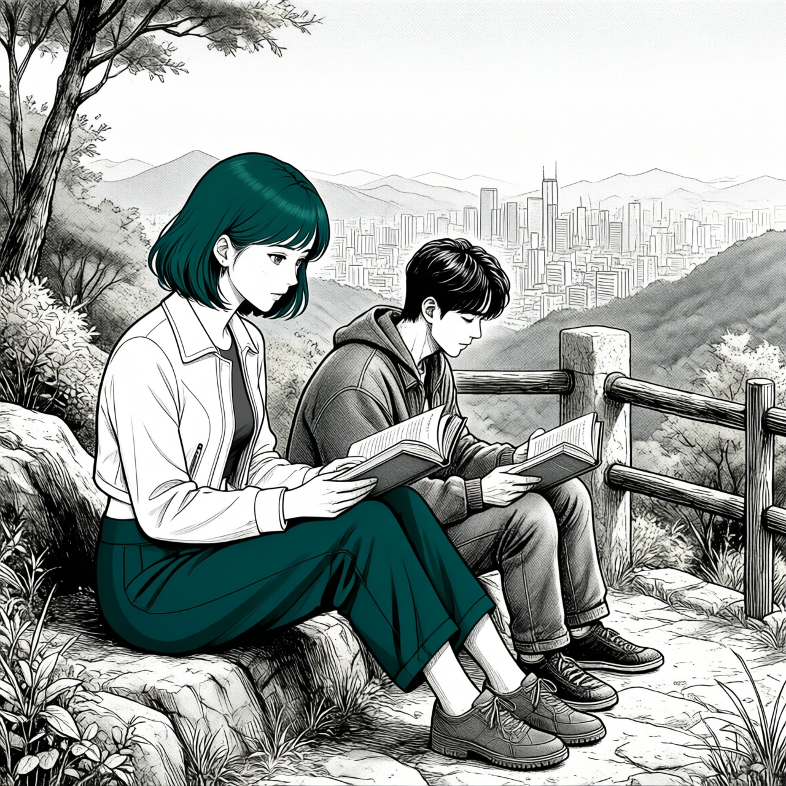
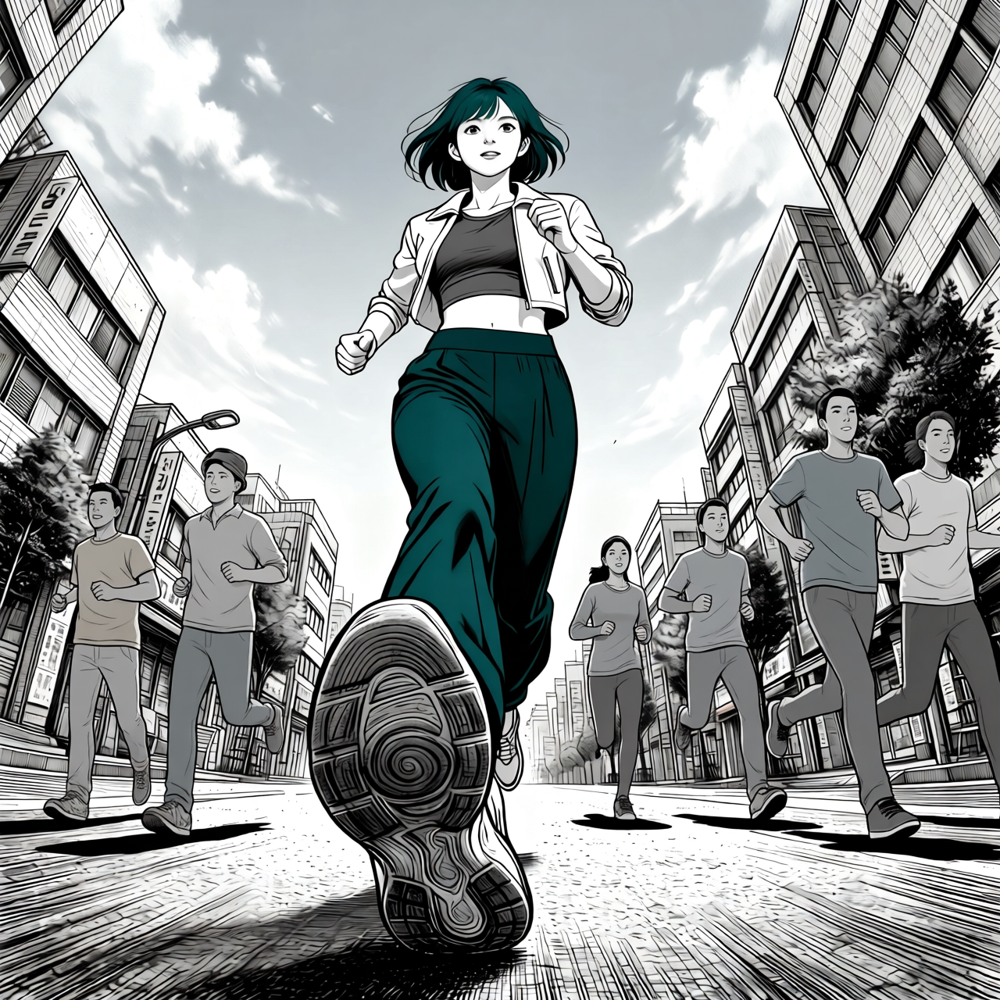
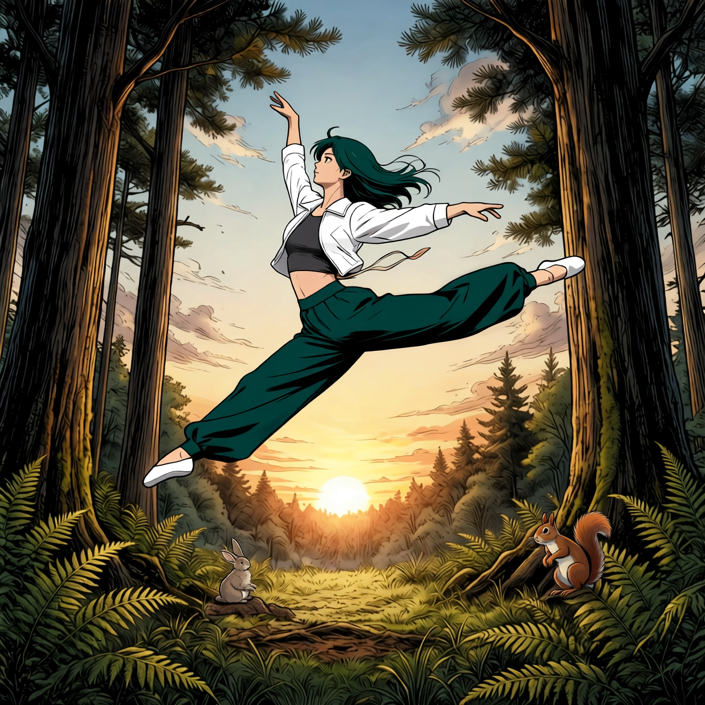
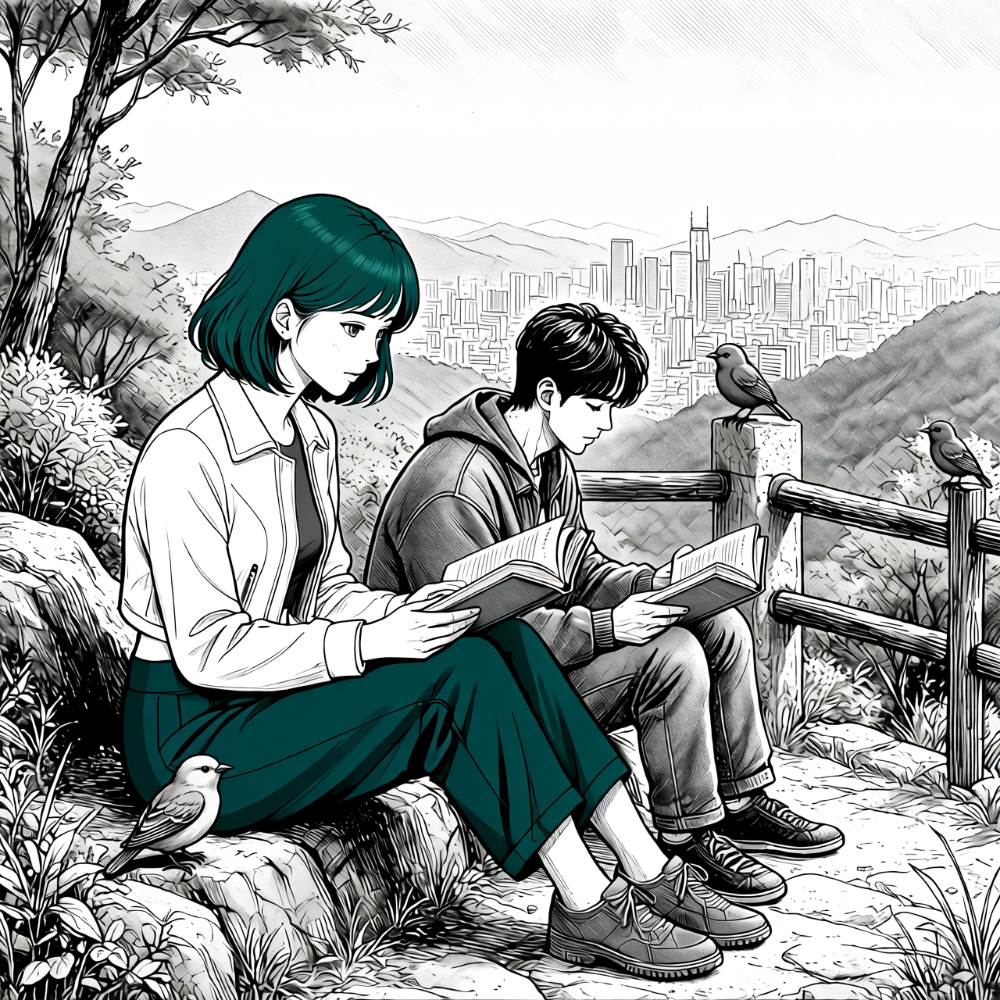

# P7-5.4 라인아트 구도에서 스토리보드 장면까지

> Section ID: `P7-5.4`
> Version: `v2026.09.08`

스토리보드 장면을 한 번의 생성으로 완성하려 하면, 카메라·인물 아이덴티티·착장·소품이 서로 영향을 주어 구도가 흔들리기 쉽다. 이 절에서는 라인아트로 장면의 구도와 동작을 만들고, Mira의 아이덴티티를 이식한 뒤 주변 인물과 오브젝트를 추가한다. 각 단계의 PNG와 `result.json`은 프롬프트, seed, step, 모델, 입력 파일을 따로 기록한다.

## 라인아트로 장면의 구도만 먼저 만든다

첫 단계는 `Qwen/Qwen-Image-2512` 텍스트-이미지 모델로 수행한다. 생성기의 기본 캔버스는 1280×1280이며, 이 단계에는 Mira 참조를 넣지 않는다. 인물의 정확한 얼굴이나 착장을 결정하려 하지 않고, 장면의 카메라 높이, 인물의 동작, 배경의 공간, 화면의 여백만 라인아트로 만든다. 정보량을 줄인 구도판이므로 다음 편집 단계에서 캐릭터를 바꾸더라도 포즈와 배경의 관계를 읽기 쉽다.

공통 화풍 표현은 생성기의 `STYLE_PROMPT` 상수에 한 번만 둔다. `SCENE_PROMPTS`는 장면마다 달라지는 구도와 사건만 맡는다.

- Scene A: 카메라를 향해 달리는 인물, 지면 높이 시점, 열린 하늘
- Scene B: 해 질 무렵 숲 공터에서 하는 grand jeté
- Scene C: 도시가 내려다보이는 언덕에서 두 사람이 책을 읽는 장면

생성기는 `--scene a`, `--scene b`, `--scene c`로 이 세 장면을 고른다. 기본 캔버스는 1280×1280이고 기본 샘플링은 20 step이다. `--steps`와 `--prompt`를 바꾸면 같은 장면에서 구도 지시의 민감도를 비교할 수 있다. 아래 결과에서는 하늘, 전방 달리기, 들린 앞발의 밑창이 함께 나타나는지 관찰한다.

[Scene A line-art result.json](../../../assets/part-07/chapter-05/p7-5-4-qwen-image-2512-scene-a-lineart-v1-size-1280x1280-seed-5420-steps-20-result.json){ .lazy-source }

Scene B는 같은 공통 화풍 상수에 숲 공터·석양·grand jeté만 추가해 20 step으로 생성했다. 이 결과에서는 점프 동작, 열린 하늘, 나무와 양치식물의 공간을 먼저 확인하고, Mira의 얼굴·착장·필요한 소품은 다음 편집 단계에서 보강한다.

[Scene B line-art result.json](../../../assets/part-07/chapter-05/p7-5-4-qwen-image-2512-scene-b-lineart-v1-size-1280x1280-seed-5421-steps-20-result.json){ .lazy-source }

Scene C도 같은 방식으로 생성했다. 두 인물, 책, 언덕 난간, 먼 도시 스카이라인이 장면의 기본 관계를 만든다. 이 단계에서 인물별 아이덴티티를 확정하지 않으므로, 이후 편집 단계에서 Mira와 두 번째 인물의 참조를 나누어 적용한다.

[Scene C line-art result.json](../../../assets/part-07/chapter-05/p7-5-4-qwen-image-2512-scene-c-lineart-v1-size-1280x1280-seed-5422-steps-20-result.json){ .lazy-source }

~~~bash
python docs/assets/part-07/chapter-05/p7_5_4_qwen_image_2512_generate_lineart_scene.py --scene a
python docs/assets/part-07/chapter-05/p7_5_4_qwen_image_2512_generate_lineart_scene.py --scene b
python docs/assets/part-07/chapter-05/p7_5_4_qwen_image_2512_generate_lineart_scene.py --scene c
~~~

[P7-5.4 라인아트 씬 생성기](../../../assets/part-07/chapter-05/p7_5_4_qwen_image_2512_generate_lineart_scene.py)

## 라인아트 구도에 Mira의 아이덴티티와 화풍을 이식한다

다음 단계에서는 Scene A 라인아트를 Picture 1로 유지하고, Mira 전신 착장 이미지를 Picture 2로 넣는다. Picture 1은 달리기 포즈·로우 앵글·도시 배경을 맡고, Picture 2는 Mira의 얼굴·헤어·착장·선화·절제된 색을 맡는다. 긴 외형 설명을 프롬프트에 다시 쓰지 않고 두 이미지의 역할을 분리해 두면, 구도가 달라졌는지와 Mira 참조가 부족한지를 별도로 읽을 수 있다.

Scene A 결과에서는 지면 높이의 달리기 구도와 신발 밑창을 유지하면서, 청록 단발·흰 크롭 재킷·회색 이너·청록 팬츠가 반영됐다. 이식 단계는 Qwen-Image-Edit-2511을 BF16 순차 CPU 오프로딩으로 직접 실행하며 ComfyUI 서버를 사용하지 않는다.

[Scene A Mira 이식 result.json](../../../assets/part-07/chapter-05/p7-5-4-qwen-2511-lineart-scene-a-mira-identity-v1-size-1280x1280-seed-5420-steps-20-result.json){ .lazy-source }

같은 생성기는 `--scenes b c`처럼 여러 장면을 받아 한 번 로드한 파이프라인으로 순차 처리한다. Scene B에서는 Mira가 숲 공터의 도약 인물을 맡고, Scene C에서는 왼쪽 독자만 Mira로 바꾸며 오른쪽 독자와 배경 관계를 유지한다.

[Scene B Mira 이식 result.json](../../../assets/part-07/chapter-05/p7-5-4-qwen-2511-lineart-scene-b-mira-identity-v1-size-1280x1280-seed-5421-steps-20-result.json){ .lazy-source }

[Scene C Mira 이식 result.json](../../../assets/part-07/chapter-05/p7-5-4-qwen-2511-lineart-scene-c-mira-identity-v1-size-1280x1280-seed-5422-steps-20-result.json){ .lazy-source }

~~~bash
python docs/assets/part-07/chapter-05/p7_5_4_qwen_edit_2511_apply_mira_to_lineart.py --scene a
python docs/assets/part-07/chapter-05/p7_5_4_qwen_edit_2511_apply_mira_to_lineart.py --scenes b c
~~~

[라인아트 Mira 아이덴티티 이식 생성기](../../../assets/part-07/chapter-05/p7_5_4_qwen_edit_2511_apply_mira_to_lineart.py)

## Mira를 이식한 장면에 주변 인물과 동물을 추가한다

주변 인물 보강은 앞 단계의 Mira 이식 결과 한 장을 Image 1로 사용한다. Scene A의 프롬프트는 `Add several pedestrians and several people running in casual clothing to Image 1.`이다. 행인 여러 명과 캐주얼 복장으로 달리는 사람 여러 명의 추가만 요청하며, 인물 수나 상대 크기, 기존 장면 보존 지시는 따로 넣지 않는다.

아래 v5는 Qwen-Image-Edit-2511을 로컬 GPU에서 BF16 순차 CPU 오프로딩으로 직접 실행한 1280×1280, 20 step, CFG 4.0 결과다. Mira 주변에 캐주얼 복장의 인물 여섯 명이 추가됐다. 대부분 달리는 자세여서, 행인과 달리는 사람을 구분해 요청한 내용이 결과에서도 나뉘어 표현됐는지 확인할 필요가 있다.

[Scene A 주변 인물 보강 result.json](../../../assets/part-07/chapter-05/p7-5-4-qwen-2511-lineart-scene-a-extras-v5-size-1280x1280-seed-5420-steps-20-result.json){ .lazy-source }

~~~bash
python docs/assets/part-07/chapter-05/p7_5_4_qwen_edit_2511_enrich_mira_scene_extras.py --scenes a --run-label extras-v5 --size 1280 --steps 20
~~~

[Mira 장면 주변 인물·오브젝트 보강 생성기](../../../assets/part-07/chapter-05/p7_5_4_qwen_edit_2511_enrich_mira_scene_extras.py)

생성기의 `--scenes`는 A·B·C를 선택한다. B는 작은 토끼와 다람쥐, C는 독자 주변에 앉아 있는 새를 추가한다.

Scene B는 Mira 이식 결과를 Image 1로 사용하고 작은 동물 두 마리의 위치를 각각 지정했다. 토끼는 왼쪽 아래 양치식물 옆 공터 바닥에 앉히고, 다람쥐는 오른쪽 나무 밑 지면에 배치하도록 요청했다.

아래 v8은 같은 로컬 GPU 실행 방식의 1280×1280, 20 step, CFG 4.0, seed 5421 결과다. 토끼는 왼쪽 아래 바위 위에, 다람쥐는 오른쪽 나무뿌리 주변에 나타났다. 두 동물은 Mira의 몸과 떨어져 있으며 고슴도치는 없다. 요청한 지면 위치와 실제로 발을 디딘 바위·나무뿌리를 구분해 관찰할 수 있다.

[Scene B 작은 동물 배치 result.json](../../../assets/part-07/chapter-05/p7-5-4-qwen-2511-lineart-scene-b-extras-v8-size-1280x1280-seed-5421-steps-20-result.json){ .lazy-source }

~~~bash
python docs/assets/part-07/chapter-05/p7_5_4_qwen_edit_2511_enrich_mira_scene_extras.py --scenes b --run-label extras-v8 --size 1280 --steps 20
~~~

Scene C는 Mira 이식 결과를 Image 1로 사용하고, 작은 새 세 마리가 앉을 위치를 각각 지정했다. 남성 독자 오른쪽의 기존 사각 난간 기둥 위, 오른쪽 가장자리의 기존 상단 나무 난간 위, Mira 옆 왼쪽 아래 바위 위다. 새를 추가한다는 요청에 기존 장면에서 발을 디딜 대상을 연결한 것이다.

아래 v7은 같은 로컬 GPU 실행 방식의 1280×1280, 20 step, CFG 4.0, seed 5422 결과다. 새 세 마리가 난간 기둥 두 곳과 왼쪽 아래 바위에 앉아 있고, 하늘에 떠 있는 새나 분리된 가지는 보이지 않는다. 다만 오른쪽 가장자리의 새는 요청한 가로 난간 대신 끝 기둥 위에 배치됐다. 앉는 동작의 반영과 정확한 위치의 일치는 따로 확인해야 한다.

[Scene C 새 배치 result.json](../../../assets/part-07/chapter-05/p7-5-4-qwen-2511-lineart-scene-c-extras-v7-size-1280x1280-seed-5422-steps-20-result.json){ .lazy-source }

~~~bash
python docs/assets/part-07/chapter-05/p7_5_4_qwen_edit_2511_enrich_mira_scene_extras.py --scenes c --run-label extras-v7 --size 1280 --steps 20
~~~

| 단계 | 입력 | 유지하거나 보강할 내용 |
| --- | --- | --- |
| 라인아트 구도 | 텍스트 | 카메라, 동작, 배경 공간, 화면 여백 |
| Mira 이식 | 라인아트 구도판, Mira 전신 착장 참조 | Mira의 얼굴·헤어·착장·화풍 |
| 주변 인물·오브젝트 보강 | Mira 이식 결과 한 장 | 주변 대상의 종류·복장·배치·크기 |

구도가 부족하면 라인아트 장면 프롬프트를, Mira의 외형이 부족하면 이식 단계의 참조를, 주변 인물의 복장이나 배치가 부족하면 보강 단계의 지시를 조정한다. 각 결과 JSON의 입력 경로를 따라가면 앞 단계의 어떤 산출물을 재사용했는지 확인할 수 있다.

## 체크리스트

- [ ] Scene A·B·C의 라인아트 구도는 화풍 상수와 장면별 프롬프트를 분리해 생성했는가?
- [ ] 라인아트 결과에서는 카메라·동작·배경 공간을, 이후 편집 결과에서는 Mira·착장·오브젝트를 각각 검수하는가?
- [ ] 편집 단계가 구도를 다시 바꾸지 않고 구도판을 유지하는지 입력 순서와 결과 이미지로 확인하는가?
- [ ] 각 단계의 PNG와 `result.json`을 함께 보관해 어떤 입력과 설정이 결과를 만들었는지 추적할 수 있는가?

## 출처와 참고 자료

- [Qwen-Image-2512 모델 카드](https://huggingface.co/Qwen/Qwen-Image-2512){: target="_blank" rel="noopener noreferrer"}: 텍스트-이미지 파이프라인과 Apache-2.0 라이선스 정보를 확인한 자료입니다.
- [Qwen-Image 컬렉션](https://huggingface.co/collections/Qwen/qwen-image){: target="_blank" rel="noopener noreferrer"}: 2512 텍스트-이미지 모델과 현재 공개된 `Qwen-Image-Edit-2511` 편집 모델의 구분을 확인한 자료입니다.
- [Qwen-Image-Edit-2511 모델 카드](https://huggingface.co/Qwen/Qwen-Image-Edit-2511){: target="_blank" rel="noopener noreferrer"}: 다중 이미지 참조를 포함한 후속 편집 단계의 입력 형식과 사용 예제를 확인하는 자료입니다.
