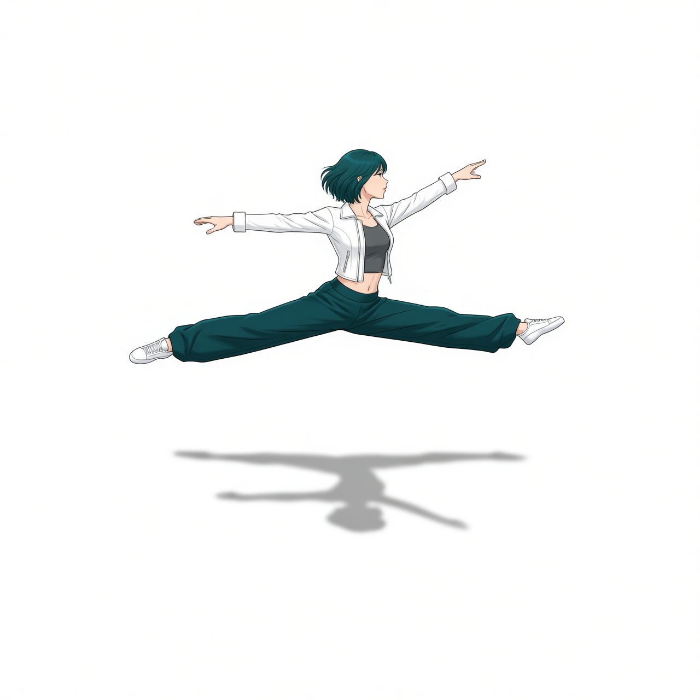
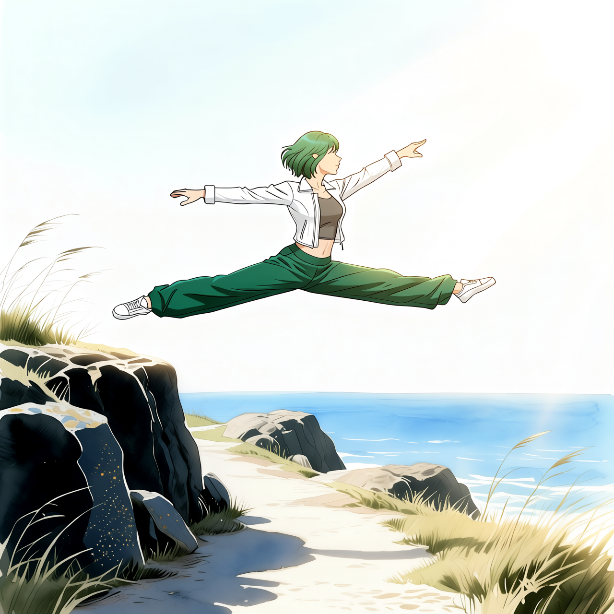
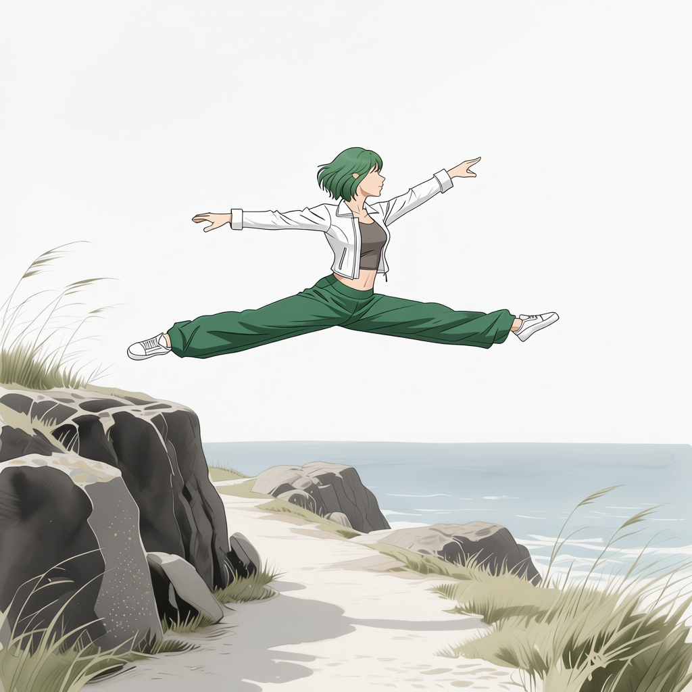
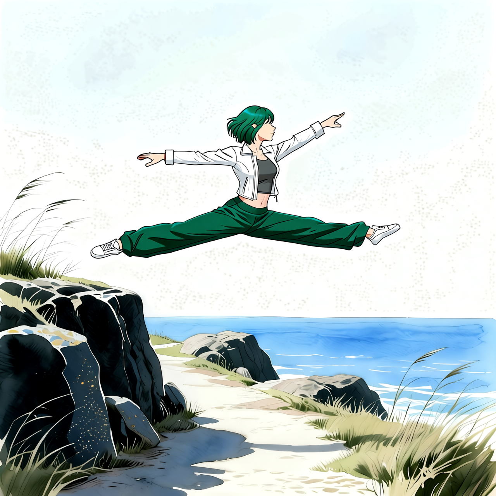

# P7-5.4 스토리보드 장면에 캐릭터를 합성하는 경로

> Section ID: \`P7-5.4\`
> Version: \`v2026.09.01\`

이 절의 목표는 장면을 다시 생성할 때마다 캐릭터의 포즈·의상·얼굴이 달라지는 문제를 줄이는 것이다. 기본 경로는 Qwen-Image가 참조 없이 첫 장면을 만들고, 카메라판에서 포즈 컷아웃을 만든 뒤 Qwen Image Edit 2511로 캐릭터 identity를 이식하는 순서다. 카메라판을 곧바로 원본 캐릭터 참조로 교체하는 방식은 identity를 온전히 반영하지 못해 기본 경로로 채택하지 않는다. 다만 포즈와 착장을 먼저 단일 인물 결과로 정리한 뒤에는, 그 결과를 두 번째 입력으로 하여 카메라판의 인물 자리에 다시 이식할 수 있다. 각 단계의 result.json에는 실제 입력 파일, SHA-256, 모델, seed, step을 남긴다. 따라서 이미지 파일 이름만 보고 추측하지 않고 결과 JSON을 따라 입력 관계를 확인한다.

## 한 모델이 아니라 역할이 다른 구성 요소

P7-5.4의 결과는 하나의 이미지 모델에서 바로 나온 것이 아니다. 장면을 새로 그리는 일, 카메라 위치만 바꾸는 일, 인물의 영역을 찾는 일, 빈 배경을 복원하는 일, 캐릭터를 포즈에 이식하는 일을 분리했다. 같은 입력을 여러 모델에 반복해 넣기보다, 각 단계에 필요한 정보만 넘기는 것이 이 절의 핵심이다.

| 구성 요소 | 맡긴 일 | 이 절에서의 입력·출력 경계 |
| --- | --- | --- |
| `Qwen/Qwen-Image` Q4_K_S GGUF + ComfyUI-GGUF | 장면 A·B·C의 최초 RGB 스토리보드 생성 | 텍스트 장면 계약 → 스토리보드 |
| `Qwen/Qwen-Image-Edit-2511` + Multiple-angles LoRA | 카메라판의 방위·높이·거리 변환 | 스토리보드 한 장 → 카메라판 한 장 |
| `Qwen/Qwen-Image-Edit-2511` | 카메라판 인물 이식과 DeLight 배경·캐릭터의 다중 참조 통합 | 카메라판·단일 인물 또는 배경판·캐릭터 → 장면 한 장 |
| Grounding DINO Tiny | `a woman`, `a person` 텍스트로 인물 상자 탐색 | 카메라판 → 인물 상자 |
| SAM 2.1 Hiera Small | 선택된 상자를 흰색 인물 마스크로 정밀화 | 인물 상자·카메라판 → 마스크 |
| LaMa ONNX | 마스크 영역만 메워 빈 배경판 생성 | 카메라판·마스크 → 배경판 |
| `Qwen/Qwen-Image-Edit-2509` + Nunchaku FP4 r128 transformer | 캐릭터 포즈 이식과 마지막 광원·화풍 통일 | 포즈 참조·착장 또는 합성본 → 캐릭터·최종 장면 |
| `Qwen/Qwen-Image-Edit-2511` + FoxBaze Try-On LoRA | 분리된 착장 기준물을 직접 이식 인물에 다시 입힘 | 인물 한 장·착장 한 장 → 단일 인물 한 장 |
| `Qwen/Qwen-Image-Edit-2509` + Studio DeLight LoRA | 배경판 또는 통합 장면의 방향광 색조를 중립화 | 배경판 또는 방향광 장면 → 중립 광원 장면 |
| `Qwen/Qwen-Image-Edit-2509` + dx8152 Relight LoRA | 통합 장면의 방향광을 다시 부여 | 중립화된 통합 장면 → 방향광 장면 |

`Qwen-Image`는 텍스트에서 이미지를 만드는 기반 모델이고, 이 절에서는 스토리보드만 맡긴다. 이번 A·B·C 첫 장면은 P7-5.10에서 검증한 Q4_K_S GGUF 저VRAM 경로로 생성했다. `Qwen-Image-Edit-2509`은 DeLight·리라이트처럼 한 장에서 조명을 편집하는 단계에 쓴다. Q4 GGUF와 Nunchaku FP4 r128은 각각 로컬 GPU에서 실행하기 위한 양자화 형식이며, 캐릭터나 카메라 규칙을 새로 추가하는 모델은 아니다. FoxBaze Try-On LoRA는 공식 Qwen Image Edit 2511 파이프라인에서 두 번째 입력을 착장 기준물로 해석하도록 보강한다. Studio DeLight LoRA는 이미 생긴 방향광을 균일한 스튜디오 광원으로 중립화하는 마지막 단계다. [Qwen-Image 모델 카드](https://huggingface.co/Qwen/Qwen-Image){: target="_blank" rel="noopener noreferrer"} · [Qwen-Image-Edit-2509 모델 카드](https://huggingface.co/Qwen/Qwen-Image-Edit-2509){: target="_blank" rel="noopener noreferrer"} · [Qwen-Image-Edit-2511 모델 카드](https://huggingface.co/Qwen/Qwen-Image-Edit-2511){: target="_blank" rel="noopener noreferrer"} · [Nunchaku Qwen-Image-Edit-2509 배포](https://huggingface.co/nunchaku-ai/nunchaku-qwen-image-edit-2509){: target="_blank" rel="noopener noreferrer"} · [FoxBaze Try-On LoRA 모델 카드](https://huggingface.co/FoxBaze/Try_On_Qwen_Edit_Lora_Alpha){: target="_blank" rel="noopener noreferrer"} · [Studio DeLight 모델 카드](https://huggingface.co/prithivMLmods/QIE-2511-Studio-DeLight){: target="_blank" rel="noopener noreferrer"}

카메라판에는 공식 `Qwen/Qwen-Image-Edit-2511` Diffusers 파이프라인과 Multiple-angles LoRA만 사용한다. 8 GB VRAM 환경에서는 가중치를 순차 CPU 오프로딩하고, 모델 카드가 정한 순서대로 `<sks> [azimuth] [elevation] [distance]` 세 항을 한 프롬프트에 넣는다. 이 단계는 캐릭터 identity를 새로 정하는 것이 아니라 장면의 카메라 조건을 바꾸는 단계다. [Qwen-Image-Edit-2511 모델 카드](https://huggingface.co/Qwen/Qwen-Image-Edit-2511){: target="_blank" rel="noopener noreferrer"} · [Multiple-angles LoRA 모델 카드](https://huggingface.co/fal/Qwen-Image-Edit-2511-Multiple-Angles-LoRA){: target="_blank" rel="noopener noreferrer"}

마스크 단계의 Grounding DINO Tiny는 텍스트로 대상 상자를 찾는 zero-shot 객체 검출 모델이고, SAM 2.1 Hiera Small은 그 상자를 인물 외곽 마스크로 바꾼다. LaMa ONNX는 그 마스크 안쪽만 복원한다. 즉 이 세 구성 요소는 캐릭터를 생성하거나 화풍을 정하지 않고, 카메라판에서 **어느 픽셀을 교체하고 어느 픽셀을 유지할지** 정한다. [Grounding DINO Tiny 모델 카드](https://huggingface.co/IDEA-Research/grounding-dino-tiny){: target="_blank" rel="noopener noreferrer"} · [SAM 2 공식 저장소](https://github.com/facebookresearch/sam2){: target="_blank" rel="noopener noreferrer"} · [LaMa ONNX 배포](https://huggingface.co/g-ronimo/lama){: target="_blank" rel="noopener noreferrer"}

위 공개 모델 카드와 저장소의 기능·배포 정보는 2026-08-29에 확인했다. 실제 실행에 쓴 파일명, 양자화 형식, 입력 순서와 seed·step은 각 단계의 `result.json`을 기준으로 확인한다.

## 같은 화풍 계약으로 정사각형 A·B·C 장면을 만든다

첫 장면은 외부 이미지나 잠재값을 넣지 않는 T2I다. 장소와 점프 포즈를 장면별로만 바꾸고, 공통 화풍은 P7-5.1 스타일 계약의 `character_scene_style_prompt`에서 그대로 가져온다. 배경 전용 `common_contract`에는 사람을 금지하는 조건이 있으므로, 인물이 있는 이 세 장면에는 쓰지 않는다.

P7-5.10의 Q4_K_S GGUF 저VRAM 경로에서 1280×1280, 20 step, CFG 4.0을 사용했다. 1280은 32의 배수인 정사각형 캔버스이며, 이번 환경에서 완료를 확인한 실사용 크기다. A·B·C는 각각 해안 절벽, 야생화 초원, 도심 공원으로 장소만 달리하고, 공중 스플릿 점프의 인물은 이후 카메라·포즈·캐릭터 교체의 자리표로 둔다.

| Scene A: 해안 절벽 | Scene B: 야생화 초원 | Scene C: 도심 공원 |
| --- | --- | --- |
|  |  |  |

[Scene A result.json — JSON — 1280 정사각형 T2I 실행 기록 보기](/AiBook/assets/part-07/chapter-05/p7-5-4-qwen-image-q4ks-style-contract-scene-a-v1-seed-5420-steps-20-result.json)

[Scene B result.json — JSON — 1280 정사각형 T2I 실행 기록 보기](/AiBook/assets/part-07/chapter-05/p7-5-4-qwen-image-q4ks-style-contract-scene-b-v1-seed-5421-steps-20-result.json)

[Scene C result.json — JSON — 1280 정사각형 T2I 실행 기록 보기](/AiBook/assets/part-07/chapter-05/p7-5-4-qwen-image-q4ks-style-contract-scene-c-v1-seed-5422-steps-20-result.json)

세 result JSON에는 같은 모델·해상도·step·CFG와 각 장면의 prompt, seed, ComfyUI graph가 남는다. 이 결과는 장면·포즈·공통 화풍을 가진 출발 이미지라는 관찰일 뿐, 토르소 기준 얼굴이나 최종 착장이 유지된다는 근거는 아니다. 캐릭터 identity와 의상은 다음 2511 편집 단계에서 별도 입력으로 이식한다. 실행 코드는 P7-5.10 Q4 GGUF 생성기를 사용한다.

[P7-5.10 Q4 GGUF 생성기](../../../assets/part-07/chapter-05/p7_5_9_qwen_image_gguf_low_vram_probe.py)

## 멀티플 앵글 카메라판을 먼저 만든다

컷아웃은 최초 T2I 장면에서 바로 만들지 않는다. 먼저 Qwen Image Edit 2511 Multiple-angles LoRA로 카메라의 방위·높이·거리를 전환한 카메라판을 만들고, **그 카메라판**에서만 인물을 마스크하고 잘라낸다. 따라서 이후 캐릭터 이식에 전달되는 포즈·화면 위치·원근은 최초 장면이 아니라 카메라 전환 뒤의 결과를 따른다.

카메라 생성기는 `--camera a|b|c`에 맞는 원본 Scene PNG를 코드 안에서 선택한다. A는 `front-left quarter view eye-level shot medium shot`, B는 `front-right quarter view high-angle shot medium shot`, C는 `front-left quarter view low-angle shot medium shot`이다. 따라서 다른 장면을 실수로 입력하는 문제를 줄이고, 필요할 때만 `--reference`로 명시적으로 덮어쓴다. 기본값은 seed `5420`, 20 step이다.

> 주의: 8GB VRAM에 맞춘 양자화 경로는 실행 가능성을 우선한 구성이다. 방위·높이·거리 같은 카메라 의도가 모두 충분히 반영되지 않을 수 있으므로, result.json의 프롬프트·입력 매핑 확인과 별도로 PNG에서 시점 변화를 직접 비교해야 한다. 이 경로의 실행 성공만으로 카메라 지시가 충족됐다고 판단하지 않는다.

~~~bash
# 각 카메라 preset은 대응하는 최초 Scene PNG를 자동 입력으로 쓴다.
python docs/assets/part-07/chapter-05/p7_5_4_qwen_edit_2511_camera_direct.py --camera a
python docs/assets/part-07/chapter-05/p7_5_4_qwen_edit_2511_camera_direct.py --camera b
python docs/assets/part-07/chapter-05/p7_5_4_qwen_edit_2511_camera_direct.py --camera c
~~~

| Scene A: 좌전방 쿼터·아이레벨·미디엄 | Scene B: 우전방 쿼터·하이앵글·미디엄 | Scene C: 좌전방 쿼터·로우앵글·미디엄 |
| --- | --- | --- |
|  |  |  |

[Scene A camera result.json — JSON — 공식 2511 아이레벨 20 step 재생성 기록 보기](/AiBook/assets/part-07/chapter-05/p7-5-3-qwen-2511-camera-front-left-quarter-view-eye-level-shot-medium-shot-official-direct-seed-5420-steps-20-result.json)

[Scene B camera result.json — JSON — 공식 2511 20 step 재생성 기록 보기](/AiBook/assets/part-07/chapter-05/p7-5-3-qwen-2511-camera-front-right-quarter-view-high-angle-shot-medium-shot-official-direct-seed-5420-steps-20-result.json)

[Scene C camera result.json — JSON — 공식 2511 20 step 실행 기록 보기](/AiBook/assets/part-07/chapter-05/p7-5-4-qwen-2511-camera-front-left-quarter-view-low-angle-shot-medium-shot-official-scene-c-v5-seed-5420-steps-20-result.json)

이 세 장은 공식 모델 카드 형식과 Scene별 입력 매핑이 실제로 적용된 실행 기록이다. 카메라 축의 시각적 일치 여부는 PNG를 사람 눈으로 별도로 비교하며, 이 결과만으로 포즈·캐릭터 identity의 보존을 주장하지 않는다.

[공식 Qwen Image Edit 2511 카메라 생성 코드 보기](/AiBook/assets/part-07/chapter-05/p7_5_4_qwen_edit_2511_camera_direct.py)

### 마스크와 컷아웃을 쓴다

마스크의 흰색은 인물, 검은색은 보존할 배경을 뜻한다. 오버레이에서는 빨간색으로 덮인 영역과 노란색 검출 상자를 함께 보므로, 머리·손가락·발끝 같은 전신 경계가 빠졌는지 컷아웃보다 먼저 확인할 수 있다.

| Scene A 마스크 오버레이 | Scene B 마스크 오버레이 | Scene C 마스크 오버레이 |
| --- | --- | --- |
|  |  |  |

| Scene A 포즈 컷아웃 | Scene B 포즈 컷아웃 | Scene C 포즈 컷아웃 |
| --- | --- | --- |
|  |  |  |

[Scene A mask result.json — JSON — 아이레벨 카메라판의 검출 상자와 SAM2 마스크 기록 보기](/AiBook/assets/part-07/chapter-05/p7-5-3-sam2-person-mask-official-camera-scene-a-v6-result.json)

[Scene A cutout result.json — JSON — 아이레벨 카메라판의 흰 배경 포즈 컷아웃 기록 보기](/AiBook/assets/part-07/chapter-05/p7-5-3-character-pose-cutout-white-official-camera-scene-a-v6-result.json)

[Scene B mask result.json — JSON — 재생성 카메라판의 검출 상자와 SAM2 마스크 기록 보기](/AiBook/assets/part-07/chapter-05/p7-5-4-sam2-person-mask-official-camera-scene-b-v7-result.json)

[Scene B cutout result.json — JSON — 재생성 카메라판의 흰 배경 포즈 컷아웃 기록 보기](/AiBook/assets/part-07/chapter-05/p7-5-3-character-pose-cutout-white-official-camera-scene-b-v7-result.json)

[Scene C mask result.json — JSON — 검출 상자와 SAM2 마스크 기록 보기](/AiBook/assets/part-07/chapter-05/p7-5-4-sam2-person-mask-official-camera-scene-c-v5-result.json)

[Scene C cutout result.json — JSON — 흰 배경 포즈 컷아웃 기록 보기](/AiBook/assets/part-07/chapter-05/p7-5-4-character-pose-cutout-white-official-camera-scene-c-v5-result.json)

세 마스크는 머리·양팔·양다리·발끝을 포함했다. 다만 Scene C 컷아웃의 오른손 끝에는 원본 배경의 작은 녹색 잔여물이 남아 있다. 이처럼 마스크가 완벽하지 않을 때는 컷아웃을 캐릭터 identity의 기준으로 쓰지 않으며, 픽셀 단위 외곽이 필요한 단계에서만 그 경계를 정제한다.

흰 배경 컷아웃은 알파 채널을 보존하는 최종 합성 자산이 아니다. 포즈 아이덴티 이식에서는 먼저 이 컷아웃에 그림자를 만들고, **그림자 포함 컷아웃**을 `Picture 1`과 초기 잠재값으로 쓴다. `Picture 1`은 포즈·인물 크기·프레이밍·그림자만, `Picture 2`의 캐릭터 identity 기준은 얼굴·헤어·착장만 맡도록 역할을 분리한다. 인물 레이어 보관과 빈 배경판 생성도 같은 마스크의 별도 활용이다.

### 컷아웃의 그림자는 따로 만들고 인물 주변을 보호한다

Scene A·B 원본에는 분리해 유지할 수 있는 캐릭터 그림자가 없었다. 그래서 흰 배경 컷아웃을 Qwen Image Edit 2511에 넣어 바닥 그림자만 생성하고, 마지막에는 원본 인물 마스크를 40 px 확장해 원래 캐릭터와 주변의 흰 배경을 다시 덮었다. 이 보호 영역은 Qwen이 인물 바깥에 새 팔·머리 같은 잔상을 그린 범위를 지운다.

| Scene A 그림자 포함 컷아웃 | Scene B 그림자 포함 컷아웃 |
| --- | --- |
|  |  |

이 결과는 **잔상 제거 구조**만 확인한다. 그림자 실루엣과 지면 원근은 아직 자연스럽지 않으므로, 이를 실제 장면에 바로 합성할 최종 그림자로 채택하지 않는다. 포즈 아이덴티 생성기는 A·B에서 이 그림자 포함 컷아웃을 자동으로 `Picture 1`에 사용한다. C도 먼저 같은 그림자 산출물을 만든 뒤에만 자동 실행할 수 있으며, 그림자 자산이 없으면 생성기가 중단해 흰 배경 원본 컷아웃으로 조용히 되돌아가지 않는다.

[Qwen 2511 컷아웃 그림자 생성기 보기](../../../assets/part-07/chapter-05/p7_5_4_qwen_edit_2511_generate_cutout_shadow.py)

[Scene A cutout shadow result.json — JSON — Qwen 후보와 확장 보호 마스크 기록 보기](/AiBook/assets/part-07/chapter-05/p7-5-4-qwen-2511-cutout-shadow-scene-a-eye-level-v2-size-1280x1280-seed-62294-steps-10-result.json)

[Scene B cutout shadow result.json — JSON — Qwen 후보와 확장 보호 마스크 기록 보기](/AiBook/assets/part-07/chapter-05/p7-5-4-qwen-2511-cutout-shadow-scene-b-v1-size-1280x1280-seed-62294-steps-10-result.json)

### 그림자 포함 포즈에 측면 캐릭터 identity를 이식한다

Scene A의 20 step 직접 이식 결과는 그림자가 포함된 Scene A 포즈 컷아웃을 입력으로 만든 결과다. Scene B는 그림자 포함 Scene B 컷아웃을 `Picture 1`, 왼쪽 프로필이 보이는 `yaw_plus_90` 측면 전신을 `Picture 2`로 넣어 같은 20 step으로 생성했다. `Picture 1`에는 스플릿 점프와 그 아래 그림자를 보존한다는 짧은 양성 지시를 더했다. 이 이미지는 포즈·프레이밍·바닥 그림자를 이미 갖고 있으므로, 이식 단계에서 카메라를 다시 설명하지 않는다.

| Scene A 직접 이식 결과 | Scene B 측면 참조 직접 이식 결과 |
| --- | --- |
|  |  |

[Scene A 직접 이식 result.json — JSON — 그림자 컷아웃과 identity 참조 입력, 실행 조건 보기](/AiBook/assets/part-07/chapter-05/p7-5-4-qwen-2511-pose-identity-official-camera-scene-a-cutout-shadow-v1-size-1280x1280-seed-62294-steps-20-result.json)

[Scene B 직접 이식 result.json — JSON — 그림자 포함 컷아웃, 측면 전신 참조, 프롬프트와 실행 조건 보기](/AiBook/assets/part-07/chapter-05/p7-5-4-qwen-2511-pose-identity-official-camera-scene-b-shadow-side-profile-v2-size-1280x1280-seed-62294-steps-20-result.json)

Scene B에서는 옆얼굴·청록 단발·재킷·스플릿 점프와 그림자가 함께 남았다. 반면 운동화는 발레 컷아웃의 발끝 형태에 다시 약해졌다. 따라서 포즈와 그림자를 고정하는 `Picture 1`과 측면 identity를 주는 `Picture 2`가 있어도, 작은 신발 특징까지 자동으로 보존되는지는 별도 착장 이식 단계에서 확인해야 한다.

### 측면 직접 이식 결과에 추출 착장을 다시 입힌다

Scene A에서는 그림자 포함 포즈에 캐릭터를 직접 이식한 결과를, Scene B에서는 바로 위 측면 직접 이식 결과를 각각 Try-On의 `Picture 1`로 사용했다. 두 결과는 포즈·얼굴·헤어·프레이밍을 맡고, Xabsurd 착장·신발 기준물을 공통 `Picture 2`로 사용한다. FoxBaze LoRA를 공식 Qwen Image Edit 2511 직접 Diffusers 경로에 로드해 1280×1280·seed `62294`·10 step·true CFG `4.0`으로 실행했다.

| Scene A 직접 이식 Try-On 결과 | Scene B 측면 직접 이식 Try-On 결과 |
| --- | --- |
|  |  |

두 열은 같은 2511·10 step 조건에서 직접 이식 결과를 Try-On의 `Picture 1`로 재사용한 비교다. A·B 모두 모자 없이 청록 단발·흰 재킷·회색 이너·청록 바지가 유지됐다. A에서는 양쪽 흰 운동화까지 이식됐고, B에서는 바닥 그림자가 유지됐지만 신발은 발레 컷아웃의 발끝 형태로 남았다. 따라서 이 단계는 포즈·헤어·그림자 보존과 신발 이식을 함께 보장하지 않으며, 장면별로 결과를 검수해야 한다.

[Qwen 2511 FoxBaze Try-On 코드 보기](../../../assets/part-07/chapter-05/p7_5_4_qwen_edit_2511_tryon_foxbaze.py)

[Scene A 직접 이식 Try-On result.json — JSON — Picture 1·Picture 2 입력, 2511·LoRA와 실행 조건 보기](/AiBook/assets/part-07/chapter-05/p7-5-4-qwen-2511-tryon-foxbaze-scene-a-direct-v1-size-1280x1280-seed-62294-steps-10-result.json)

[Scene B 측면 직접 이식 Try-On result.json — JSON — Picture 1·Picture 2 입력, 2511·LoRA와 실행 조건 보기](/AiBook/assets/part-07/chapter-05/p7-5-4-qwen-2511-tryon-foxbaze-scene-b-side-profile-direct-v1-size-1280x1280-seed-62294-steps-10-result.json)

### 컷아웃 캐릭터 identity에 Studio DeLight를 적용한다

직접 이식한 단일 인물은 배경과 합치기 전에 한 번 중립 광원으로 정리한다. Qwen Image Edit 2509와 Studio DeLight LoRA에 이 이미지 한 장만 넣고 모델 카드의 trigger prompt `Neutral uniform lighting Preserve identity and composition`을 사용했다. 이때 입력은 포즈·얼굴·헤어·재킷·이너·바지·신발을 모두 가진 인물 이미지이고, 해안 배경은 입력하지 않는다.

| Scene A DeLight 캐릭터 |
| --- |
|  |

1280×1280, seed `62294`, 10 step, true CFG `4.0`에서 포즈·얼굴 방향·헤어·재킷·이너·바지·신발은 유지됐다. 회색 바탕과 바닥 그림자는 중립화됐지만, 그림자의 지면 원근은 최종 합성의 접지감으로 판단하지 않는다.

[Studio DeLight 2509 실행 코드 보기](../../../assets/part-07/chapter-05/p7_5_4_qwen_edit_2509_studio_delight.py)

[Scene A DeLight 캐릭터 result.json — JSON — identity 이식 입력, trigger prompt와 2509 실행 조건 보기](/AiBook/assets/part-07/chapter-05/p7-5-4-qwen-2509-studio-delight-cutout-identity-v1-size-1280x1280-seed-62294-steps-10-result.json)

### 카메라판에서 캐릭터를 제거해 배경판을 만든다

컷아웃에 캐릭터 identity를 이식한 뒤에는, 같은 카메라판에서 인물을 비운 배경판도 별도 자산으로 만든다. 이 배경판은 인물의 얼굴·착장 기준을 다시 넣지 않는다. Qwen Image Edit 2511에 카메라판 한 장만 넣고, 인물 자리만 주변 배경으로 메우며 장소의 주요 지형·식생·구도를 보존하도록 짧게 지시했다. 이 단계의 목적은 포즈를 만들거나 캐릭터를 보정하는 것이 아니라, 이후 합성에서 쓸 배경 입력을 한 장으로 고정하는 것이다.

| Scene A 캐릭터 제거 배경판 | Scene B 캐릭터 제거 배경판 |
| --- | --- |
|  |  |

두 실행은 모두 1280×1280, seed `62294`, 10 step, true CFG `4.0`이다. 인물은 사라졌지만, A의 하늘은 밝고 단순한 색면으로 바뀌었고 B의 초원 중심부도 원본보다 단순해졌다. 따라서 인물 제거와 원본 배경의 모든 색·질감을 픽셀 단위로 보존하는 일은 같은 요구가 아니다.

[카메라판 배경 생성 코드 보기](../../../assets/part-07/chapter-05/p7_5_4_qwen_edit_2511_extract_camera_a_background.py)

[카메라 A 배경판 result.json — JSON — 카메라 입력, 인물 제거 지시와 2511 실행 조건 보기](/AiBook/assets/part-07/chapter-05/p7-5-4-qwen-2511-camera-a-background-camera-a-v1-size-1280x1280-seed-62294-steps-10-result.json)

[카메라 B 배경판 result.json — JSON — 카메라 입력, 인물 제거 지시와 2511 실행 조건 보기](/AiBook/assets/part-07/chapter-05/p7-5-4-qwen-2511-camera-b-background-camera-b-v1-size-1280x1280-seed-62294-steps-10-result.json)

### 배경판에 Studio DeLight를 적용한다

바로 위 배경판을 Qwen Image Edit 2509의 Studio DeLight 입력으로 사용해 중립 광원 처리를 한 번 더 적용했다. 프롬프트는 모델 카드의 trigger prompt인 `Neutral uniform lighting Preserve identity and composition`만 사용한다. 인물이 없는 배경판으로 분리했으므로, 이 단계에서 바뀌는 대상은 인물 identity나 포즈가 아니라 하늘·바다·바위·풀의 조명과 색조다.

| Scene A DeLight 배경판 |
| --- |
|  |

1280×1280, seed `62294`, 10 step, true CFG `4.0`에서 하늘·바다는 더 균일하고 밝아졌고 바위·풀·해안의 배치는 남았다. 그러나 야외 장면의 하늘은 거의 흰색에 가까워졌다. 이 출력은 중립화가 적용되는지 확인하는 배경 후보이며, 해안의 원래 광원과 색감을 보존해야 하는 최종 배경으로 자동 채택하지 않는다.

[Studio DeLight 2509 실행 코드 보기](../../../assets/part-07/chapter-05/p7_5_4_qwen_edit_2509_studio_delight.py)

[Studio DeLight 배경판 result.json — JSON — 배경판 입력, trigger prompt와 2509 실행 조건 보기](/AiBook/assets/part-07/chapter-05/p7-5-4-qwen-2509-studio-delight-camera-a-background-v1-size-1280x1280-seed-62294-steps-10-result.json)

### 새 캐릭터 마스크는 보관하고, 통합은 다중 참조로 먼저 시도한다

DeLight 캐릭터의 팔과 다리는 원래 카메라 A의 마스크와 픽셀 단위로 일치하지 않는다. 그래서 Grounding DINO와 SAM 2.1로 **DeLight 캐릭터 자체**에서 새 마스크를 만들었다. 빨간 오버레이는 인물 외곽이 새 입력과 맞는지 확인하기 위한 것이며, 이 마스크는 알파 합성이나 그림자 보정이 꼭 필요할 때의 후속 입력으로 보관한다.

| DeLight 캐릭터 새 마스크 오버레이 |
| --- |
|  |

[DeLight 캐릭터 마스크 생성 코드 보기](../../../assets/part-07/chapter-05/p7_5_4_generate_person_mask.py)

[DeLight 캐릭터 마스크 result.json — JSON — 검출 상자, SAM2 마스크와 입력 해시 보기](/AiBook/assets/part-07/chapter-05/p7-5-4-sam2-person-mask-delight-cutout-identity-v1-result.json)

첫 통합에서는 이 마스크를 쓰지 않았다. Qwen Image Edit 2511의 다중 참조에 DeLight 배경판을 `Picture 1`, DeLight 캐릭터를 `Picture 2`로만 넣었다. 프롬프트도 배경은 Picture 1의 해안 구도, 인물은 Picture 2의 스플릿 점프·identity·착장을 각각 보존하라는 양성 지시로 한정했다.

| 마스크 없는 DeLight 다중 참조 통합 |
| --- |
|  |

1280×1280, seed `62294`, 10 step, true CFG `4.0`에서 회색 컷아웃 배경은 남지 않고 해안·인물 경계가 통합됐다. 반면 공중 인물의 지면 그림자는 새로 설계되지 않았다. 따라서 이 결과는 마스크 없는 다중 참조 합성의 가능성을 확인하는 출력이며, 접지 그림자 보정까지 끝난 최종 장면은 아니다.

[Qwen 2511 DeLight 다중 참조 통합 코드 보기](../../../assets/part-07/chapter-05/p7_5_4_qwen_edit_2511_composite_delight_multireference.py)

[DeLight 다중 참조 통합 result.json — JSON — Picture 1·Picture 2 입력 순서와 실행 조건 보기](/AiBook/assets/part-07/chapter-05/p7-5-4-qwen-2511-delight-multireference-composite-camera-a-v1-size-1280x1280-seed-62294-steps-10-result.json)

### 통합 장면에 방향광을 다시 적용한다

DeLight는 캐릭터와 배경의 광원을 중립화했으므로, 통합 후에는 단일 이미지 리라이트로 장면의 광원 방향을 다시 정할 수 있다. 여기서는 `dx8152/Qwen-Image-Edit-2509-Relight` LoRA를 사용해 앞의 통합 이미지를 한 장만 입력하고, trigger `重新照明`과 `soft sunlight from the upper right`만 지시했다. 새 캐릭터 참조나 마스크는 이 단계에 넣지 않는다. [dx8152 Relight 모델 카드](https://huggingface.co/dx8152/Qwen-Image-Edit-2509-Relight){: target="_blank" rel="noopener noreferrer"}

| Scene A DeLight 통합 리라이트 |
| --- |
|  |

1280×1280, seed `62294`, 10 step, LoRA scale `1.0`, true CFG `4.0`에서 상단 우측은 따뜻하게 밝아지고 좌측 바위·풀은 더 어두워졌다. 인물의 포즈·착장과 해안 구도는 유지됐지만, 이 단일 이미지 리라이트가 공중 인물에 맞는 별도 접지 그림자를 새로 설계한 것은 아니다.

[Qwen 2509 Relight 실행 코드 보기](../../../assets/part-07/chapter-05/p7_5_4_qwen_edit_2509_relight.py)

[Scene A DeLight 통합 리라이트 result.json — JSON — 통합 입력, Relight trigger와 실행 조건 보기](/AiBook/assets/part-07/chapter-05/p7-5-4-qwen-2509-relight-camera-a-delight-multireference-v1-size-1280x1280-seed-62294-steps-10-result.json)

### 착장과 신발을 흰 배경 기준물로 분리한다

컷아웃이 포즈와 프레이밍을 고정한 다음에는, 착장 자체를 사람·배경과 분리해 확인할 수 있다. Xabsurd Clothing Extractor는 P7-5.3의 `-45°` 2단계 착장 이미지를 하나의 입력으로 받아, 흰 배경에 재킷·회색 이너·청록 바지·한 쌍의 흰 신발만 남긴 1280×1280 기준물을 만들었다. 이 결과는 사람을 새로 그리거나 포즈를 바꾸는 단계가 아니다. [Xabsurd Clothing Extractor 모델 카드](https://huggingface.co/Xabsurd/Clothing-Extractor){: target="_blank" rel="noopener noreferrer"}

| 착장·신발 추출 결과 |
| --- |
|  |

[착장·신발 추출 result.json — JSON — 입력 착장, 프롬프트와 실행 조건 보기](/AiBook/assets/part-07/chapter-05/p7-5-4-qwen-2511-xabsurd-clothing-extractor-shoe-gear-v2-size-1280x1280-seed-62294-steps-10-result.json)

Qwen Image Edit 2511과 Xabsurd LoRA를 직접 Diffusers 경로에서 seed `62294`, 10 step, true CFG `4.0`으로 실행했다. 출력에는 의류와 신발이 함께 남으며, 바로 앞의 직접 이식 결과에 착장을 다시 적용하는 다음 단계의 garment 입력으로 쓴다.

[Xabsurd 착장·신발 추출 코드 보기](../../../assets/part-07/chapter-05/p7_5_4_qwen_edit_2511_extract_outfit_gear.py)

### 카메라 A의 인물 자리에 Try-On 결과를 이식한다

여기서는 카메라 A를 다시 생성하지 않는다. 공식 `Qwen/Qwen-Image-Edit-2511`의 두 이미지 편집에서 카메라 A를 `Picture 1`로 넣어 해안 배경·화면 안의 인물 위치·점프 구도를 맡기고, 바로 위의 단일 인물 Try-On 결과를 `Picture 2`로 넣어 얼굴·헤어·재킷·이너·바지·신발을 맡긴다. 프롬프트는 `Replace the woman in Picture 1 with the woman in Picture 2, preserving the pose.` 한 문장만 쓴다. Multiple-angles LoRA와 추가 카메라 지시는 이 단계에 넣지 않는다.

| Scene A 카메라판에 이식한 Try-On 인물 |
| --- |
|  |

실행은 1280×1280, seed `62294`, 20 step, true CFG `4.0`이며 순차 CPU 오프로딩을 사용했다. 결과에서 확인할 항목은 인물이 한 명만 남는지, 카메라 A의 해안 배경과 점프 구도가 남는지, 그리고 Try-On 결과의 흰 재킷·회색 이너·청록 바지·흰 신발이 함께 유지되는지다. 그림자의 원근과 정확한 접지감은 이 이식 단계만으로 확정하지 않는다.

[Qwen 2511 카메라판 인물 이식 코드 보기](../../../assets/part-07/chapter-05/p7_5_4_qwen_edit_2511_pose_identity.py)

[Scene A 카메라판 Try-On 이식 result.json — JSON — Picture 1·Picture 2 입력과 2511 실행 조건 보기](/AiBook/assets/part-07/chapter-05/p7-5-4-qwen-2511-pose-identity-official-camera-scene-a-tryon-camera-replace-v1-size-1280x1280-seed-62294-steps-20-result.json)

### Studio DeLight로 통합 장면의 방향광을 중립화한다

Try-On 인물을 배경에 이식한 뒤에는 합성 단계에서 더해진 방향광이 캐릭터와 배경을 서로 다른 색조로 보이게 할 수 있다. 여기서는 바로 위 Try-On·배경 통합 결과에 상단 우측의 따뜻한 방향광을 추가한 이미지를 입력으로 두고, `prithivMLmods/QIE-2511-Studio-DeLight` LoRA로 균일한 중립 광원으로 바꿨다. 모델 카드의 trigger prompt는 `Neutral uniform lighting Preserve identity and composition`이다.

| 방향광이 적용된 Try-On·배경 통합 장면 | Studio DeLight 결과 |
| --- | --- |
|  |  |

왼쪽의 황금색 방향광은 오른쪽에서 균일한 광원으로 바뀌고, 인물의 포즈·착장은 유지됐다. 다만 야외 장면에서는 모델 카드가 경고한 것처럼 강한 햇빛도 중립화돼 하늘이 거의 흰색으로 바뀐다. 따라서 이 출력은 디라이트가 실제로 적용된 검증 결과이며, 해안 배경의 색을 보존해야 하는 최종 장면으로는 채택하지 않는다. 이 단계는 지면 그림자를 지우거나 새 그림자를 설계하는 기능도 아니다.

실행은 Qwen Image Edit 2509 bfloat16 직접 Diffusers 경로에서 순차 CPU 오프로딩을 사용해 Studio DeLight LoRA 하나만 적용했다. 캔버스는 1024×1024, seed `62294`, 10 step, true CFG `4.0`이다.

[Studio DeLight 2509 실행 코드 보기](../../../assets/part-07/chapter-05/p7_5_4_qwen_edit_2509_studio_delight.py)

[Studio DeLight result.json — JSON — 방향광 입력, trigger prompt와 2509 실행 조건 보기](/AiBook/assets/part-07/chapter-05/p7-5-4-qwen-2509-studio-delight-camera-a-upper-right-relight-v1-size-1024x1024-seed-62294-steps-10-result.json)

### 전역 얼굴·헤어 이식은 기준 경로로 채택하지 않는다

카메라 A의 Try-On 이식 결과를 `Picture 1`로, 5.2에서 만든 인물 참조를 `Picture 2`로 두고 공식 `Qwen/Qwen-Image-Edit-2511`로 얼굴과 헤어만 바꾸는 실험을 했다. 먼저 정면 얼굴 참조를 사용한 뒤, 화면 속 인물이 오른쪽을 향하므로 같은 방향의 왼쪽 프로필 참조로 다시 실행했다. 두 실행 모두 1280×1280, seed `62294`, 20 step, true CFG `4.0`, 순차 CPU 오프로딩 조건이다.

| 정면 얼굴 참조 | 방향을 맞춘 왼쪽 프로필 참조 |
| --- | --- |
|  |  |

방향 일치 참조로 바꿔도 얼굴형·헤어·눈의 식별 가능한 개선은 확인되지 않았고, 두 결과 모두 하늘과 절벽에 점상 노이즈가 생겼다. 따라서 장면 전체를 두 이미지로 다시 편집하는 얼굴 이식은 카메라 A 결과를 대체하지 않는다. 다음 개선은 참조 수를 더 늘리지 않고, 얼굴 영역만 다루는 국소 편집 경로에서 검증한다.

[Qwen 2511 얼굴·헤어 identity 이식 코드 보기](../../../assets/part-07/chapter-05/p7_5_4_qwen_edit_2511_apply_face_identity.py)

[정면 얼굴 참조 result.json — JSON — Picture 1·Picture 2 입력과 실행 조건 보기](/AiBook/assets/part-07/chapter-05/p7-5-4-qwen-2511-face-identity-camera-scene-a-face-identity-v1-size-1280x1280-seed-62294-steps-20-result.json)

[왼쪽 프로필 얼굴 참조 result.json — JSON — 방향 일치 재실험의 입력과 실행 조건 보기](/AiBook/assets/part-07/chapter-05/p7-5-4-qwen-2511-face-identity-camera-scene-a-side-face-identity-v1-size-1280x1280-seed-62294-steps-20-result.json)

## 장면 A를 카메라판으로 고정한다

먼저 해안 절벽 장면을 만들고, 완만한 높은 시점의 와이드 카메라판 한 장을 선택한다. 이 카메라판은 이후 포즈와 배경의 공통 기준이다.

| 장면 A | 카메라판 |
| --- | --- |
|  |  |

[장면 A result.json — JSON — 이전 장면 생성 기록 보기](/AiBook/assets/part-07/chapter-05/p7-5-4-qwen-storyboard-scene-a-349252-seed-5420-steps-20-result.json)

[장면 A 카메라 result.json — JSON — 이전 카메라 생성 기록 보기](/AiBook/assets/part-07/chapter-05/p7-5-4-qwen-2511-camera-no-azimuth-elevated-scene-a-v1-seed-5420-steps-4-result.json)

카메라판을 직접 다음 단계의 기준으로 삼는 이유는, 배경·포즈·인물의 화면상 위치를 하나의 이미지에 고정하기 위해서다. 카메라 생성 JSON에는 이 결과가 Qwen Image Edit 2511 Multiple Angles의 elevated shot wide shot, seed 5420, 4 step으로 생성됐음이 기록돼 있다.

## 한 마스크를 포즈와 배경에 함께 쓴다

Grounding DINO와 SAM 2.1이 카메라판에서 인물을 찾아 흰색 마스크로 만든다. 이 마스크는 두 역할을 갖는다. 원래 인물을 흰색 무광 배경으로 잘라 포즈·프레이밍 참조를 만들고, 같은 영역을 LaMa로 메워 빈 배경판을 만든다. 같은 마스크를 쓰므로 두 결과의 인물 자리와 배경의 빈자리가 일치한다.

| 인물 마스크 검수 | 흰 배경 포즈 참조 | LaMa 배경판 |
| --- | --- | --- |
|  |  |  |

[마스크 result.json — JSON — 이전 마스크 생성 기록 보기](/AiBook/assets/part-07/chapter-05/p7-5-4-sam2-person-mask-scene-a-2511-elevated-v1-result.json)

[포즈 컷아웃 result.json — JSON — 이전 컷아웃 생성 기록 보기](/AiBook/assets/part-07/chapter-05/p7-5-4-character-pose-cutout-white-scene-a-white-v2-result.json)

[LaMa 배경판 result.json — JSON — 이전 배경 복원 기록 보기](/AiBook/assets/part-07/chapter-05/p7-5-4-lama-background-scene-a-v3-result.json)

마스크 JSON은 카메라판의 SHA-256과 검출 상자·마스크 의미를 기록한다. LaMa 결과 JSON은 같은 카메라판과 마스크를 입력으로 삼고, 흰 영역만 주변 배경으로 복원했음을 기록한다.

~~~bash
python docs/assets/part-07/chapter-05/p7_5_4_generate_person_mask.py \
  --reference docs/assets/part-07/chapter-05/p7-5-4-qwen-2511-camera-no-azimuth-elevated-scene-a-v1-seed-5420-steps-4.png \
  --run-label scene-a-2511-elevated-v1

python docs/assets/part-07/chapter-05/p7_5_4_extract_masked_character.py \
  --scene docs/assets/part-07/chapter-05/p7-5-4-qwen-2511-camera-no-azimuth-elevated-scene-a-v1-seed-5420-steps-4.png \
  --mask docs/assets/part-07/chapter-05/p7-5-4-sam2-person-mask-scene-a-2511-elevated-v1.png \
  --matte white --run-label pose-cutout-white-scene-a-white-v2

python docs/assets/part-07/chapter-05/p7_5_4_restore_background_lama.py \
  --scene docs/assets/part-07/chapter-05/p7-5-4-qwen-2511-camera-no-azimuth-elevated-scene-a-v1-seed-5420-steps-4.png \
  --mask docs/assets/part-07/chapter-05/p7-5-4-sam2-person-mask-scene-a-2511-elevated-v1.png \
  --run-label scene-a-v3 --grow 25
~~~

## 포즈에 캐릭터를 이식한다

Qwen Image Edit 2509에는 역할이 다른 두 이미지만 준다. 첫 번째는 위의 흰 배경 포즈 참조이고, 두 번째는 P7-5.3의 +90° 전신 착장 이미지다. 지시는 첫 이미지의 여성을 두 번째 이미지의 여성으로 바꾸되 포즈를 유지한다로 제한한다. 이 단계에서 배경을 넣지 않으므로, 배경의 색·화풍이 얼굴과 의상을 덮어쓰지 않는다.

| 포즈에 이식된 캐릭터 | 인물 알파 마스크 검수 |
| --- | --- |
|  |  |

[포즈 이식 result.json — JSON — 이전 포즈 이식 기록 보기](/AiBook/assets/part-07/chapter-05/p7-5-4-qwen-2509-pose-transfer-plus90-replace-v2-seed-62294-steps-10-result.json)

[알파 마스크 result.json — JSON — 이전 인물 마스크 기록 보기](/AiBook/assets/part-07/chapter-05/p7-5-4-sam2-person-mask-pose-transfer-plus90-replace-v2-result.json)

포즈 이식 JSON에는 두 입력의 SHA-256, seed 62294, 10 step, true_cfg_scale 4.0이 기록돼 있다. 이후 SAM2 마스크는 이식된 캐릭터의 실루엣만 남겨 배경과 안전하게 합치기 위한 알파 채널이다.

~~~bash
python docs/assets/part-07/chapter-05/p7_5_4_qwen_edit_pose_transfer.py \
  --pose docs/assets/part-07/chapter-05/p7-5-4-character-pose-cutout-white-scene-a-white-v2.png \
  --character docs/assets/part-07/chapter-05/p7-5-3-qwen-outfit-stage2-yaw_plus_90-multiple-angle-v1-seed-62294-steps-8.png \
  --run-label plus90-replace-v2 --steps 10
~~~

### 포즈 참조와 초기 잠재값의 역할을 분리한다

두 이미지 편집에서는 텍스트의 `Picture 1`, `Picture 2` 역할만으로 우선순위가 완전히 정해지지 않는다. 초기 잠재값을 어느 이미지에서 인코딩하는지도 결과의 출발점을 정한다. Scene B의 흰 배경 점프 컷아웃을 첫 번째 조건 참조로 두고, P7-5.3의 `+45°` 쿼터뷰 2단계 착장을 두 번째 조건 참조이자 초기 잠재값으로 사용했다. 카메라 LoRA와 카메라 지시는 넣지 않았다.

| 캐릭터 잠재값에서 시작한 포즈 이식 |
| --- |
|  |

[포즈 이식 result.json — JSON — 초기 잠재값 비교 기록 보기](/AiBook/assets/part-07/chapter-05/p7-5-4-qwen-2511-pose-transfer-cutout-quarter-plus45-q4-0-v2-seed-62294-steps-8-result.json)

Qwen Image Edit 2511 Q4_0에서 seed 62294, 8 step으로 실행하고, `A split leap pose.`라는 짧은 양성 포즈 지시만 덧붙였다. 이 결과에서는 점프 자세는 첫 이미지의 조건 참조가, 청록 단발·흰 재킷·청록 와이드 팬츠는 두 번째 이미지의 초기 잠재값이 맡는다. 양쪽 다리와 신발은 생성됐지만, 컷아웃의 체커보드 배경도 함께 남았다. 따라서 이 결과는 포즈·캐릭터·착장을 전달하는 중간 PNG이며, 다음 2511 장면 교체 단계의 두 번째 입력으로만 쓴다. result.json의 `initial_latent`와 `prompt` 필드로 이 선택을 재현할 수 있다.

### 컷아웃에서 캐릭터 identity를 이식하는 기본 워크플로우

이번에 검증하는 대상은 Scene B 한 장의 품질이 아니라, 장면을 만들 때 입력의 역할을 분리하는 순서다. 장면의 공간·카메라·기존 인물의 포즈를 먼저 카메라판에 고정하고, 그 인물을 잘라 낸 흰 배경 컷아웃에서 캐릭터의 얼굴·헤어·착장을 이식한다. 카메라판 전체를 바로 교체하지 않는다.

1. Qwen-Image T2I로 A·B·C의 첫 장면을 만든 뒤, Qwen Image Edit 2511 Multiple Angles로 카메라판을 만든다. 이때 기존 인물은 화면 구도와 포즈의 자리표 역할을 한다.
2. 카메라판에서 인물 마스크와 흰 배경 포즈 컷아웃을 만든다. 이 컷아웃은 포즈·인물 크기·프레이밍만 Picture 1에 전달한다.
3. 검증된 캐릭터 identity·착장 PNG를 Picture 2로 넣고, 컷아웃을 1280×1280 흰색 1:1 캔버스로 정규화해 Picture 1이자 초기 잠재값으로 둔다. `Replace the woman in Picture 1 with the woman in Picture 2. Preserve Picture 1 pose and framing. Plain white 1:1 square background.`라는 짧은 지시로 identity를 이식한다. 캔버스 정규화는 전체 포즈를 자르지 않고 contain 방식으로 배치한다.
4. 컷아웃의 포즈·프레이밍과 캐릭터의 헤어·착장·팔다리가 함께 유지됐는지 확인한다. 이후 장면에 다시 합칠 때는 같은 마스크로 인물 경계를 제한한다. 빈 배경판이 필요한 별도 작업도 LaMa 대신 2511의 인물 제거 편집으로 구성할 수 있다.

## 별도 배경판이 필요할 때만 합성과 보정을 쓴다

컷아웃에서 identity를 이식한 뒤 인물만 따로 저장하거나 빈 배경판을 재사용해야 하는 경우에는 캐릭터 PNG·캐릭터 마스크·배경판을 알파 합성하고 별도 보정을 쓴다. 이때 빈 배경판 생성도 LaMa에 고정하지 않고 2511 인물 제거 편집으로 대체할 수 있다.

| 알파 합성 | 최종 화풍·광원 통일 |
| --- | --- |
|  |  |

[알파 합성 result.json — JSON — 합성 입력과 출력 기록 보기](/AiBook/assets/part-07/chapter-05/p7-5-4-character-background-composite-scene-a-v1-result.json)

[광원 — 화풍 통일 result.json — JSON — 최종 보정 기록 보기](/AiBook/assets/part-07/chapter-05/p7-5-4-qwen-2509-harmonized-composite-scene-a-v1-seed-62294-steps-10-result.json)

최종 JSON은 바로 앞 합성 PNG의 SHA-256을 입력으로 기록한다. 따라서 최종 이미지를 다시 만들 때는 위 순서의 각 JSON에서 입력 해시가 연결되는지만 확인하면 된다.

### 하이앵글 Scene B에 같은 경로 적용하기

Scene A의 해안 절벽 예시는 그대로 두고, 같은 분리·합성 경로를 야생화 초원의 Scene B에도 적용할 수 있다. 이 변형은 `front-left quarter view high-angle shot medium shot` 카메라판에서 포즈와 배경을 먼저 분리하고, `+45°` 착장 참조를 30 step으로 이식한 뒤 꽃밭 배경판에 합성했다. 마지막 보정은 Scene B 전용 프롬프트로 꽃밭과 인물의 수채화 질감·광원을 맞춘다.

| Scene B 최종 화풍·광원 통일 |
| --- |
|  |

[Scene B 최종 result.json — JSON — 장면별 보정 기록 보기](/AiBook/assets/part-07/chapter-05/p7-5-4-qwen-2509-harmonized-composite-scene-b-front-left-high-angle-plus45-v2-seed-62294-steps-10-result.json)

Scene B처럼 다른 장소를 보정할 때는 `p7_5_4_qwen_harmonize_composite.py`에 `--scene scene-b`를 지정한다. Scene A의 기본값과 해안 절벽 프롬프트는 그대로 유지된다.

~~~bash
python docs/assets/part-07/chapter-05/p7_5_4_composite_character_background.py \
  --character docs/assets/part-07/chapter-05/p7-5-4-qwen-2509-pose-transfer-plus90-replace-v2-seed-62294-steps-10.png \
  --mask docs/assets/part-07/chapter-05/p7-5-4-sam2-person-mask-pose-transfer-plus90-replace-v2.png \
  --background docs/assets/part-07/chapter-05/p7-5-4-lama-background-scene-a-v3.png \
  --run-label scene-a-v1

python docs/assets/part-07/chapter-05/p7_5_4_qwen_harmonize_composite.py \
  --input docs/assets/part-07/chapter-05/p7-5-4-character-background-composite-scene-a-v1.png \
  --run-label scene-a-v1 --steps 10
~~~

[알파 합성 코드 보기](/AiBook/assets/part-07/chapter-05/p7_5_4_composite_character_background.py)

[광원 — 화풍 통일 코드 보기](/AiBook/assets/part-07/chapter-05/p7_5_4_qwen_harmonize_composite.py)

## 확인할 점

- 포즈·캐릭터·배경의 역할을 한 번의 Qwen 편집 입력에 모두 넣지 않는다.
- 같은 카메라판의 마스크로 포즈 참조와 배경판을 만들었는지 각 result.json의 입력 해시로 확인한다.
- 합성 전 캐릭터 마스크에 머리카락·손끝·양발이 포함됐는지 오버레이를 확인한다.
- 공중에 있는 인물에는 접지 그림자를 추가하지 않는다. 최종 단계는 광원과 렌더링 톤만 정리한다.
