# P7-5.4 스토리보드 장면에 캐릭터를 합성하는 경로

> Section ID: \`P7-5.4\`
> Version: \`v2026.08.31\`

이 절의 목표는 장면을 다시 생성할 때마다 캐릭터의 포즈·의상·얼굴이 달라지는 문제를 줄이는 것이다. 기본 경로는 Qwen-Image가 참조 없이 첫 장면을 만들고, 카메라판에서 포즈 컷아웃을 만든 뒤 Qwen Image Edit 2511로 캐릭터 identity를 이식하는 순서다. 카메라판을 바로 캐릭터로 교체한 비교는 identity를 온전히 반영하지 못해 기본 경로로 채택하지 않는다. 각 단계의 result.json에는 실제 입력 파일, SHA-256, 모델, seed, step을 남긴다. 따라서 이미지 파일 이름만 보고 추측하지 않고 결과 JSON을 따라 입력 관계를 확인한다.

## 한 모델이 아니라 역할이 다른 여섯 구성 요소

P7-5.4의 결과는 하나의 이미지 모델에서 바로 나온 것이 아니다. 장면을 새로 그리는 일, 카메라 위치만 바꾸는 일, 인물의 영역을 찾는 일, 빈 배경을 복원하는 일, 캐릭터를 포즈에 이식하는 일을 분리했다. 같은 입력을 여러 모델에 반복해 넣기보다, 각 단계에 필요한 정보만 넘기는 것이 이 절의 핵심이다.

| 구성 요소 | 맡긴 일 | 이 절에서의 입력·출력 경계 |
| --- | --- | --- |
| `Qwen/Qwen-Image` Q4_K_S GGUF + ComfyUI-GGUF | 장면 A·B·C의 최초 RGB 스토리보드 생성 | 텍스트 장면 계약 → 스토리보드 |
| `Qwen/Qwen-Image-Edit-2511` + Multiple-angles LoRA | 카메라판의 방위·높이·거리 변환 | 스토리보드 한 장 → 카메라판 한 장 |
| Grounding DINO Tiny | `a woman`, `a person` 텍스트로 인물 상자 탐색 | 카메라판 → 인물 상자 |
| SAM 2.1 Hiera Small | 선택된 상자를 흰색 인물 마스크로 정밀화 | 인물 상자·카메라판 → 마스크 |
| LaMa ONNX | 마스크 영역만 메워 빈 배경판 생성 | 카메라판·마스크 → 배경판 |
| `Qwen/Qwen-Image-Edit-2509` + Nunchaku FP4 r128 transformer | 캐릭터 포즈 이식과 마지막 광원·화풍 통일 | 포즈 참조·착장 또는 합성본 → 캐릭터·최종 장면 |

`Qwen-Image`는 텍스트에서 이미지를 만드는 기반 모델이고, 이 절에서는 스토리보드만 맡긴다. 이번 A·B·C 첫 장면은 P7-5.10에서 검증한 Q4_K_S GGUF 저VRAM 경로로 생성했다. `Qwen-Image-Edit-2509`은 한 장에서 세 장까지의 이미지 입력을 조합해 편집할 수 있어 포즈 참조와 착장을 역할별로 나누는 단계에 쓴다. Q4 GGUF와 Nunchaku FP4 r128은 각각 로컬 GPU에서 실행하기 위한 양자화 형식이며, 캐릭터나 카메라 규칙을 새로 추가하는 모델은 아니다. [Qwen-Image 모델 카드](https://huggingface.co/Qwen/Qwen-Image){: target="_blank" rel="noopener noreferrer"} · [Qwen-Image-Edit-2509 모델 카드](https://huggingface.co/Qwen/Qwen-Image-Edit-2509){: target="_blank" rel="noopener noreferrer"} · [Nunchaku Qwen-Image-Edit-2509 배포](https://huggingface.co/nunchaku-ai/nunchaku-qwen-image-edit-2509){: target="_blank" rel="noopener noreferrer"}

카메라판에는 공식 `Qwen/Qwen-Image-Edit-2511` Diffusers 파이프라인과 Multiple-angles LoRA만 사용한다. 8 GB VRAM 환경에서는 가중치를 순차 CPU 오프로딩하고, 모델 카드가 정한 순서대로 `<sks> [azimuth] [elevation] [distance]` 세 항을 한 프롬프트에 넣는다. 이 단계는 캐릭터 identity를 새로 정하는 것이 아니라 장면의 카메라 조건을 바꾸는 단계다. [Qwen-Image-Edit-2511 모델 카드](https://huggingface.co/Qwen/Qwen-Image-Edit-2511){: target="_blank" rel="noopener noreferrer"} · [Multiple-angles LoRA 모델 카드](https://huggingface.co/fal/Qwen-Image-Edit-2511-Multiple-Angles-LoRA){: target="_blank" rel="noopener noreferrer"}

마스크 단계의 Grounding DINO Tiny는 텍스트로 대상 상자를 찾는 zero-shot 객체 검출 모델이고, SAM 2.1 Hiera Small은 그 상자를 인물 외곽 마스크로 바꾼다. LaMa ONNX는 그 마스크 안쪽만 복원한다. 즉 이 세 구성 요소는 캐릭터를 생성하거나 화풍을 정하지 않고, 카메라판에서 **어느 픽셀을 교체하고 어느 픽셀을 유지할지** 정한다. [Grounding DINO Tiny 모델 카드](https://huggingface.co/IDEA-Research/grounding-dino-tiny){: target="_blank" rel="noopener noreferrer"} · [SAM 2 공식 저장소](https://github.com/facebookresearch/sam2){: target="_blank" rel="noopener noreferrer"} · [LaMa ONNX 배포](https://huggingface.co/g-ronimo/lama){: target="_blank" rel="noopener noreferrer"}

위 공개 모델 카드와 저장소의 기능·배포 정보는 2026-08-29에 확인했다. 실제 실행에 쓴 파일명, 양자화 형식, 입력 순서와 seed·step은 각 단계의 `result.json`을 기준으로 확인한다.

## 같은 화풍 계약으로 정사각형 A·B·C 장면을 만든다

첫 장면은 외부 이미지나 잠재값을 넣지 않는 T2I다. 장소와 점프 포즈를 장면별로만 바꾸고, 공통 화풍은 P7-5.1 스타일 계약의 `character_scene_style_prompt`에서 그대로 가져온다. 배경 전용 `common_contract`에는 사람을 금지하는 조건이 있으므로, 인물이 있는 이 세 장면에는 쓰지 않는다.

P7-5.10의 Q4_K_S GGUF 저VRAM 경로에서 1280×1280, 20 step, CFG 4.0을 사용했다. 1280은 32의 배수인 정사각형 캔버스이며, 이번 환경에서 완료를 확인한 실사용 크기다. A·B·C는 각각 해안 절벽, 야생화 초원, 도심 공원으로 장소만 달리하고, 공중 스플릿 점프의 인물은 이후 카메라·포즈·캐릭터 교체의 자리표로 둔다.

| Scene A: 해안 절벽 | Scene B: 야생화 초원 | Scene C: 도심 공원 |
| --- | --- | --- |
|  | 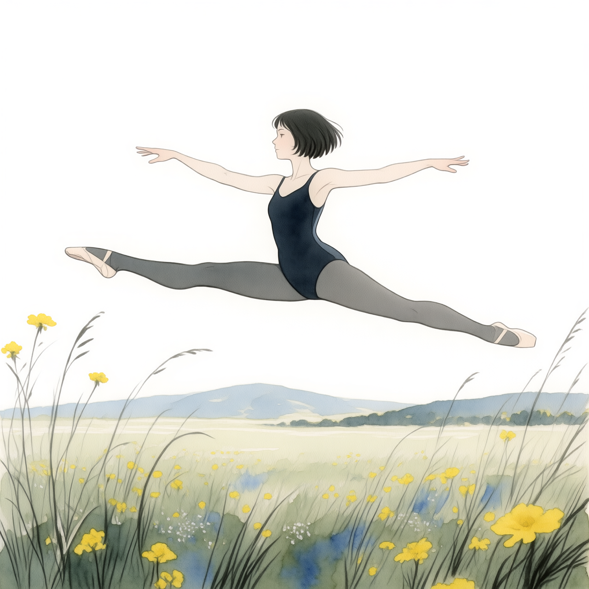 |  |

[Scene A result.json — JSON — 1280 정사각형 T2I 실행 기록 보기](/AiBook/assets/part-07/chapter-05/p7-5-4-qwen-image-q4ks-style-contract-scene-a-v1-seed-5420-steps-20-result.json)

[Scene B result.json — JSON — 1280 정사각형 T2I 실행 기록 보기](/AiBook/assets/part-07/chapter-05/p7-5-4-qwen-image-q4ks-style-contract-scene-b-v1-seed-5421-steps-20-result.json)

[Scene C result.json — JSON — 1280 정사각형 T2I 실행 기록 보기](/AiBook/assets/part-07/chapter-05/p7-5-4-qwen-image-q4ks-style-contract-scene-c-v1-seed-5422-steps-20-result.json)

세 result JSON에는 같은 모델·해상도·step·CFG와 각 장면의 prompt, seed, ComfyUI graph가 남는다. 이 결과는 장면·포즈·공통 화풍을 가진 출발 이미지라는 관찰일 뿐, 토르소 기준 얼굴이나 최종 착장이 유지된다는 근거는 아니다. 캐릭터 identity와 의상은 다음 2511 편집 단계에서 별도 입력으로 이식한다. 실행 코드는 P7-5.10 Q4 GGUF 생성기를 사용한다.

[P7-5.10 Q4 GGUF 생성기](../../../assets/part-07/chapter-05/p7_5_9_qwen_image_gguf_low_vram_probe.py)

## 멀티플 앵글 카메라판을 먼저 만든다

컷아웃은 최초 T2I 장면에서 바로 만들지 않는다. 먼저 Qwen Image Edit 2511 Multiple-angles LoRA로 카메라의 방위·높이·거리를 전환한 카메라판을 만들고, **그 카메라판**에서만 인물을 마스크하고 잘라낸다. 따라서 이후 캐릭터 이식에 전달되는 포즈·화면 위치·원근은 최초 장면이 아니라 카메라 전환 뒤의 결과를 따른다.

카메라 생성기는 `--camera a|b|c`에 맞는 원본 Scene PNG를 코드 안에서 선택한다. A는 `front view elevated shot medium shot`, B는 `front-right quarter view high-angle shot medium shot`, C는 `front-left quarter view low-angle shot medium shot`이다. 따라서 다른 장면을 실수로 입력하는 문제를 줄이고, 필요할 때만 `--reference`로 명시적으로 덮어쓴다. 기본값은 seed `5420`, 20 step이다.

> 주의: 8GB VRAM에 맞춘 양자화 경로는 실행 가능성을 우선한 구성이다. 방위·높이·거리 같은 카메라 의도가 모두 충분히 반영되지 않을 수 있으므로, result.json의 프롬프트·입력 매핑 확인과 별도로 PNG에서 시점 변화를 직접 비교해야 한다. 이 경로의 실행 성공만으로 카메라 지시가 충족됐다고 판단하지 않는다.

~~~bash
# 각 카메라 preset은 대응하는 최초 Scene PNG를 자동 입력으로 쓴다.
python docs/assets/part-07/chapter-05/p7_5_4_qwen_edit_2511_camera_direct.py --camera a
python docs/assets/part-07/chapter-05/p7_5_4_qwen_edit_2511_camera_direct.py --camera b
python docs/assets/part-07/chapter-05/p7_5_4_qwen_edit_2511_camera_direct.py --camera c
~~~

| Scene A: 정면·elevated·미디엄 | Scene B: 우전방 쿼터·하이앵글·미디엄 | Scene C: 좌전방 쿼터·로우앵글·미디엄 |
| --- | --- | --- |
| 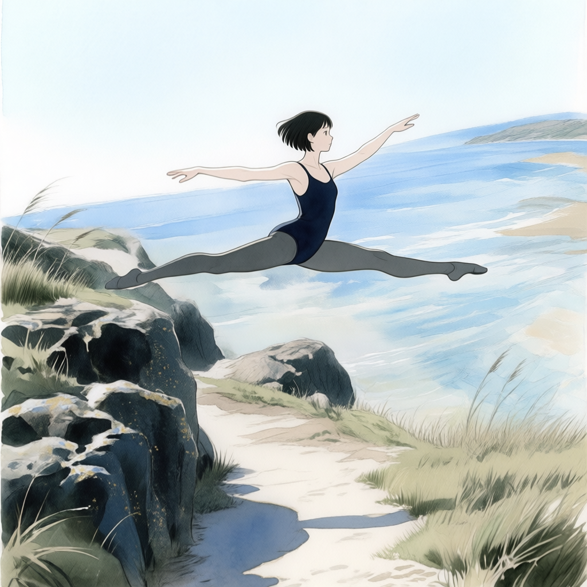 |  | 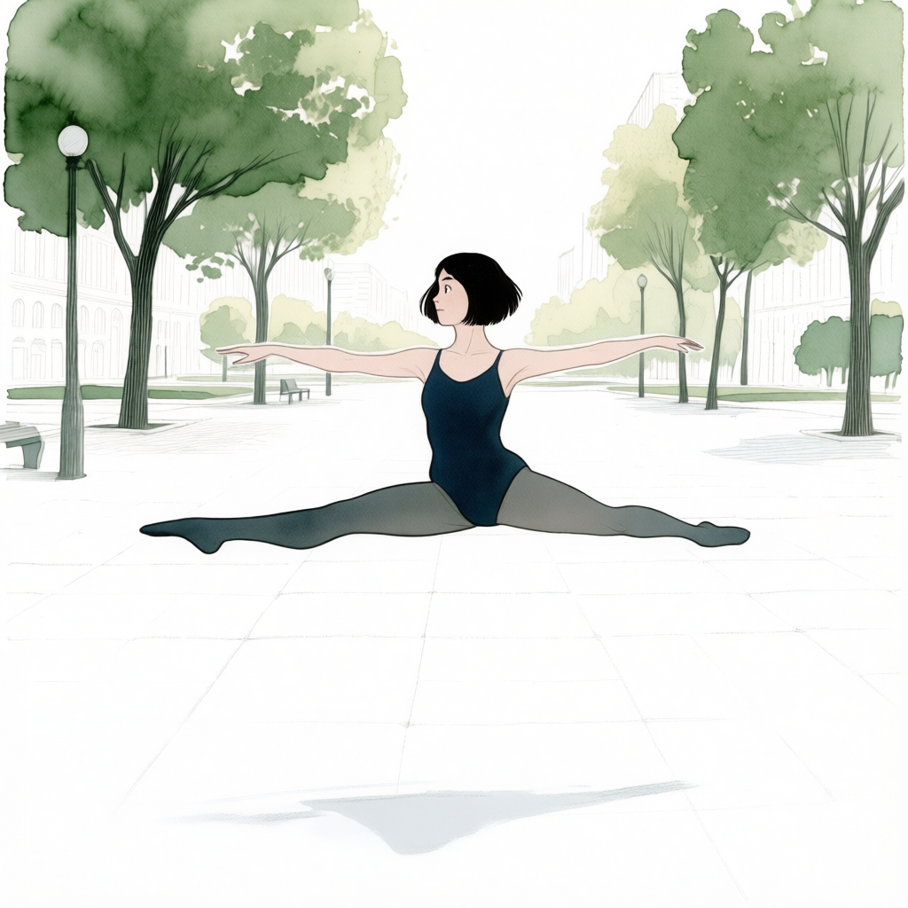 |

[Scene A camera result.json — JSON — 공식 2511 20 step 재생성 기록 보기](/AiBook/assets/part-07/chapter-05/p7-5-3-qwen-2511-camera-front-left-quarter-view-elevated-shot-medium-shot-official-direct-v2-seed-5420-steps-20-result.json)

[Scene B camera result.json — JSON — 공식 2511 20 step 실행 기록 보기](/AiBook/assets/part-07/chapter-05/p7-5-4-qwen-2511-camera-front-right-quarter-view-high-angle-shot-medium-shot-official-scene-b-v6-seed-5420-steps-20-result.json)

[Scene C camera result.json — JSON — 공식 2511 20 step 실행 기록 보기](/AiBook/assets/part-07/chapter-05/p7-5-4-qwen-2511-camera-front-left-quarter-view-low-angle-shot-medium-shot-official-scene-c-v5-seed-5420-steps-20-result.json)

이 세 장은 공식 모델 카드 형식과 Scene별 입력 매핑이 실제로 적용된 실행 기록이다. 카메라 축의 시각적 일치 여부는 PNG를 사람 눈으로 별도로 비교하며, 이 결과만으로 포즈·캐릭터 identity의 보존을 주장하지 않는다.

[공식 Qwen Image Edit 2511 카메라 생성 코드 보기](/AiBook/assets/part-07/chapter-05/p7_5_4_qwen_edit_2511_camera_direct.py)

### 마스크와 컷아웃을 쓴다

마스크의 흰색은 인물, 검은색은 보존할 배경을 뜻한다. 오버레이에서는 빨간색으로 덮인 영역과 노란색 검출 상자를 함께 보므로, 머리·손가락·발끝 같은 전신 경계가 빠졌는지 컷아웃보다 먼저 확인할 수 있다.

| Scene A 마스크 오버레이 | Scene B 마스크 오버레이 | Scene C 마스크 오버레이 |
| --- | --- | --- |
| 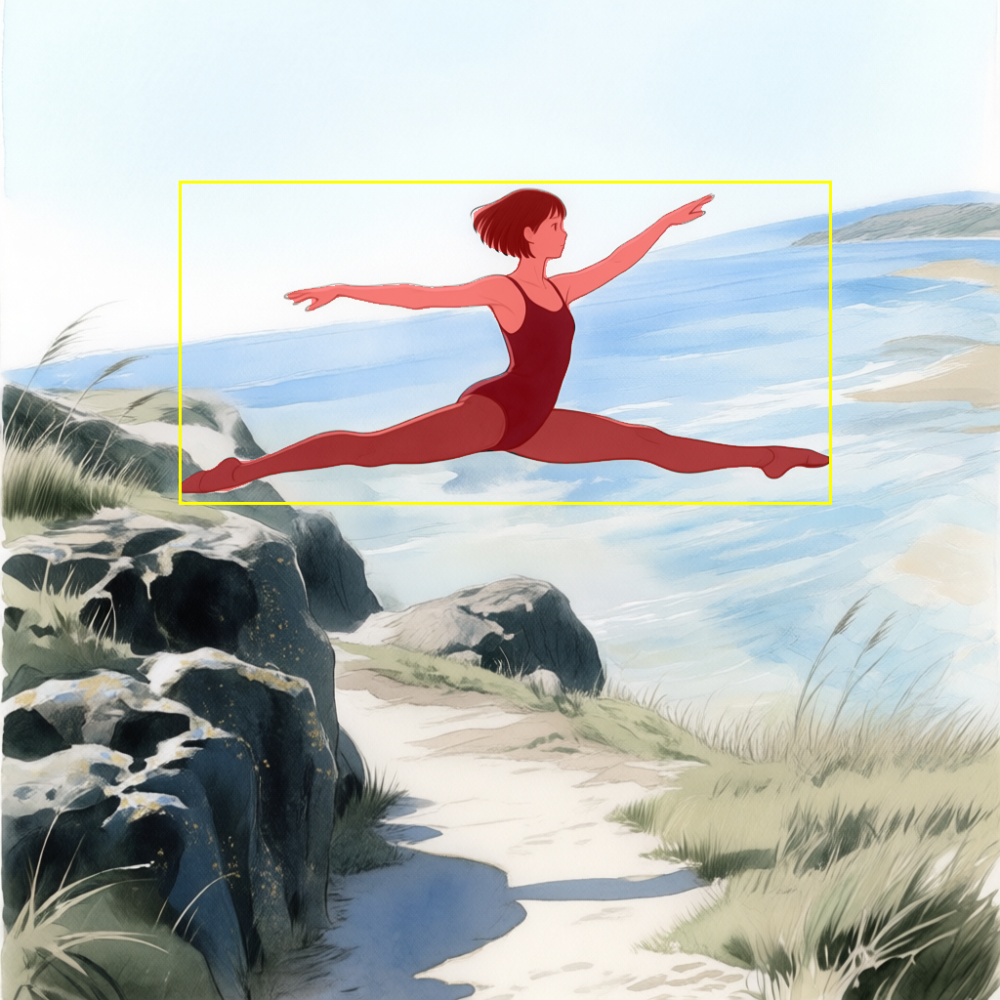 |  | 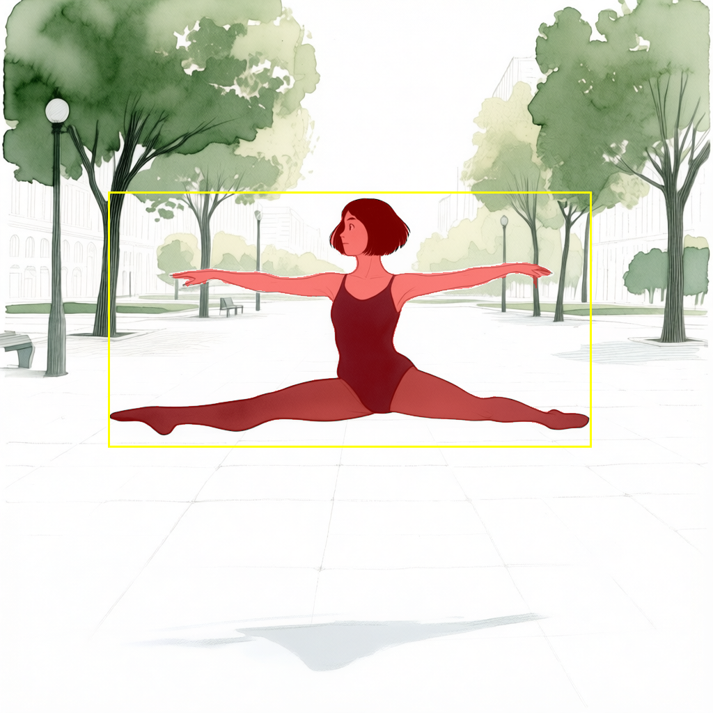 |

| Scene A 포즈 컷아웃 | Scene B 포즈 컷아웃 | Scene C 포즈 컷아웃 |
| --- | --- | --- |
| 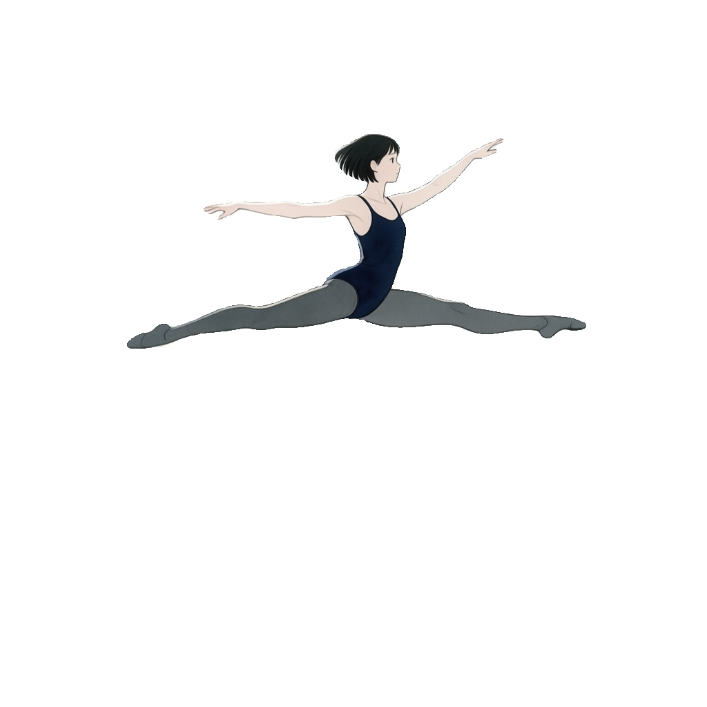 | 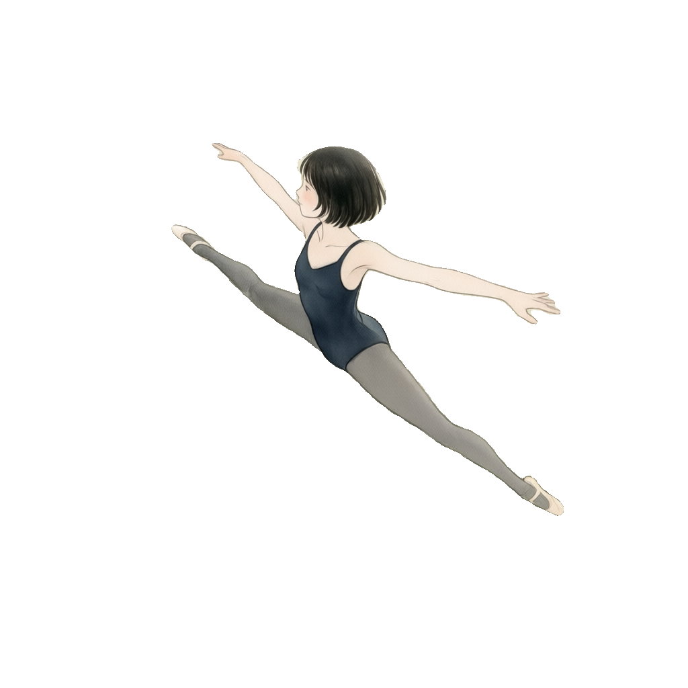 | 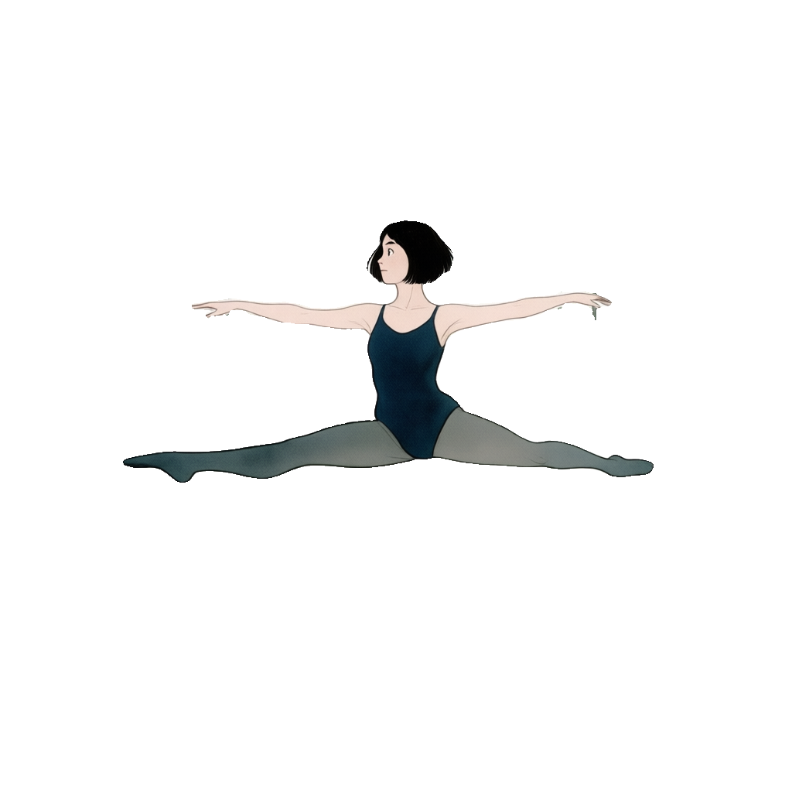 |

[Scene A mask result.json — JSON — 검출 상자와 SAM2 마스크 기록 보기](/AiBook/assets/part-07/chapter-05/p7-5-3-sam2-person-mask-official-camera-scene-a-v5-result.json)

[Scene A cutout result.json — JSON — 흰 배경 포즈 컷아웃 기록 보기](/AiBook/assets/part-07/chapter-05/p7-5-3-character-pose-cutout-white-official-camera-scene-a-v5-result.json)

[Scene B mask result.json — JSON — 검출 상자와 SAM2 마스크 기록 보기](/AiBook/assets/part-07/chapter-05/p7-5-4-sam2-person-mask-official-camera-scene-b-v6-result.json)

[Scene B cutout result.json — JSON — 흰 배경 포즈 컷아웃 기록 보기](/AiBook/assets/part-07/chapter-05/p7-5-4-character-pose-cutout-white-official-camera-scene-b-v6-result.json)

[Scene C mask result.json — JSON — 검출 상자와 SAM2 마스크 기록 보기](/AiBook/assets/part-07/chapter-05/p7-5-4-sam2-person-mask-official-camera-scene-c-v5-result.json)

[Scene C cutout result.json — JSON — 흰 배경 포즈 컷아웃 기록 보기](/AiBook/assets/part-07/chapter-05/p7-5-4-character-pose-cutout-white-official-camera-scene-c-v5-result.json)

세 마스크는 머리·양팔·양다리·발끝을 포함했다. 다만 Scene C 컷아웃의 오른손 끝에는 원본 배경의 작은 녹색 잔여물이 남아 있다. 이처럼 마스크가 완벽하지 않을 때는 컷아웃을 캐릭터 identity의 기준으로 쓰지 않으며, 픽셀 단위 외곽이 필요한 단계에서만 그 경계를 정제한다.

흰 배경 컷아웃은 알파 채널을 보존하는 최종 합성 자산이 아니다. 현재 경로에서는 이 컷아웃을 `Picture 1`과 초기 잠재값으로 쓴다. 컷아웃은 포즈·인물 크기·프레이밍만, `Picture 2`의 캐릭터 identity 기준은 얼굴·헤어·착장만 맡도록 역할을 분리한다. 인물 레이어 보관과 빈 배경판 생성도 같은 마스크의 별도 활용이다.

### 직접 이식 결과를 먼저 기준으로 검수한다

Scene A의 50 step 직접 이식 결과는 위 Scene A 포즈 컷아웃을 입력으로 만든 결과다. 이 이미지는 포즈와 프레이밍을 이미 갖고 있으므로 다시 포즈를 설명하지 않는다. 아래 결과는 착장을 별도로 추출하거나 보완하기 전의 캐릭터·포즈 기준이다.

| Scene A 직접 이식 결과 |
| --- |
| 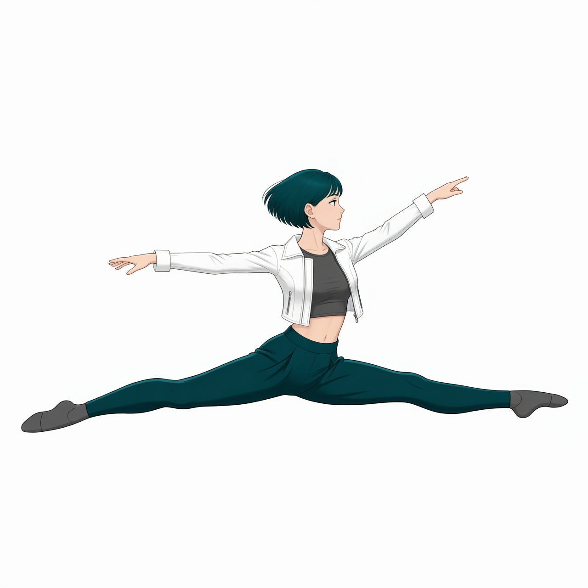 |

[Scene A 직접 이식 result.json — JSON — 입력과 실행 조건 보기](/AiBook/assets/part-07/chapter-05/p7-5-4-qwen-2511-pose-identity-official-camera-scene-a-direct-v2-size-1280x1280-seed-62294-steps-50-result.json)

관찰할 점은 포즈가 다시 바뀌지 않는지, 얼굴·헤어·재킷·이너·바지·신발의 형태가 다음 착장 처리 전에도 함께 유지되는지다.

### 착장과 신발을 흰 배경 기준물로 분리한다

컷아웃이 포즈와 프레이밍을 고정한 다음에는, 착장 자체를 사람·배경과 분리해 확인할 수 있다. Xabsurd Clothing Extractor는 P7-5.3의 `-45°` 2단계 착장 이미지를 하나의 입력으로 받아, 흰 배경에 재킷·회색 이너·청록 바지·한 쌍의 흰 신발만 남긴 1280×1280 기준물을 만들었다. 이 결과는 사람을 새로 그리거나 포즈를 바꾸는 단계가 아니다. [Xabsurd Clothing Extractor 모델 카드](https://huggingface.co/Xabsurd/Clothing-Extractor){: target="_blank" rel="noopener noreferrer"}

| 착장·신발 추출 결과 |
| --- |
| 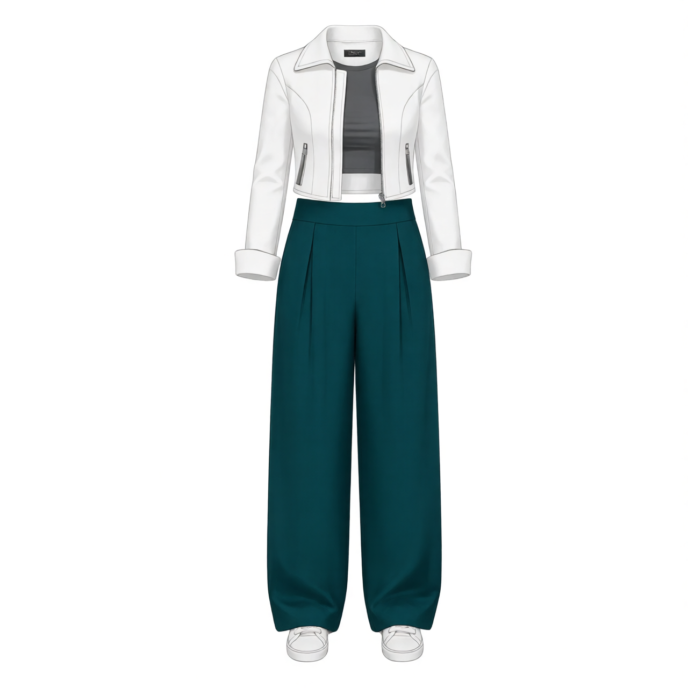 |

[착장·신발 추출 result.json — JSON — 입력 착장, 프롬프트와 실행 조건 보기](/AiBook/assets/part-07/chapter-05/p7-5-4-qwen-2511-xabsurd-clothing-extractor-shoe-gear-v2-size-1280x1280-seed-62294-steps-10-result.json)

Qwen Image Edit 2511과 Xabsurd LoRA를 직접 Diffusers 경로에서 seed `62294`, 10 step, true CFG `4.0`으로 실행했다. 출력에는 의류와 신발이 함께 남으며, 바로 앞의 직접 이식 결과에 착장을 다시 적용하는 다음 단계의 garment 입력으로 쓴다.

[Xabsurd 착장·신발 추출 코드 보기](../../../assets/part-07/chapter-05/p7_5_4_qwen_edit_2511_extract_outfit_gear.py)

## 장면 A를 카메라판으로 고정한다

먼저 해안 절벽 장면을 만들고, 완만한 높은 시점의 와이드 카메라판 한 장을 선택한다. 이 카메라판은 이후 포즈와 배경의 공통 기준이다.

| 장면 A | 카메라판 |
| --- | --- |
|  |  |

[장면 A result.json — JSON — 이전 장면 생성 기록 보기](/AiBook/assets/part-07/chapter-05/p7-5-4-qwen-storyboard-scene-a-349252-seed-5420-steps-20-result.json)

[장면 A 카메라 result.json — JSON — 이전 카메라 생성 기록 보기](/AiBook/assets/part-07/chapter-05/p7-5-4-qwen-2511-camera-no-azimuth-elevated-scene-a-v1-seed-5420-steps-4-result.json)

카메라판을 직접 다음 단계의 기준으로 삼는 이유는, 배경·포즈·인물의 화면상 위치를 하나의 이미지에 고정하기 위해서다. 카메라 생성 JSON에는 이 결과가 Qwen Image Edit 2511 Multiple Angles의 elevated shot wide shot, seed 5420, 4 step으로 생성됐음이 기록돼 있다.

## 한 마스크를 포즈와 배경에 함께 쓴다

Grounding DINO와 SAM 2.1이 카메라판에서 인물을 찾아 흰색 마스크로 만든다. 이 마스크는 두 역할을 갖는다. 원래 인물을 흰색 무광 배경으로 잘라 포즈·프레이밍 참조를 만들고, 같은 영역을 LaMa로 메워 빈 배경판을 만든다. 같은 마스크를 쓰므로 두 결과의 인물 자리와 배경의 빈자리가 일치한다.

| 인물 마스크 검수 | 흰 배경 포즈 참조 | LaMa 배경판 |
| --- | --- | --- |
|  |  | 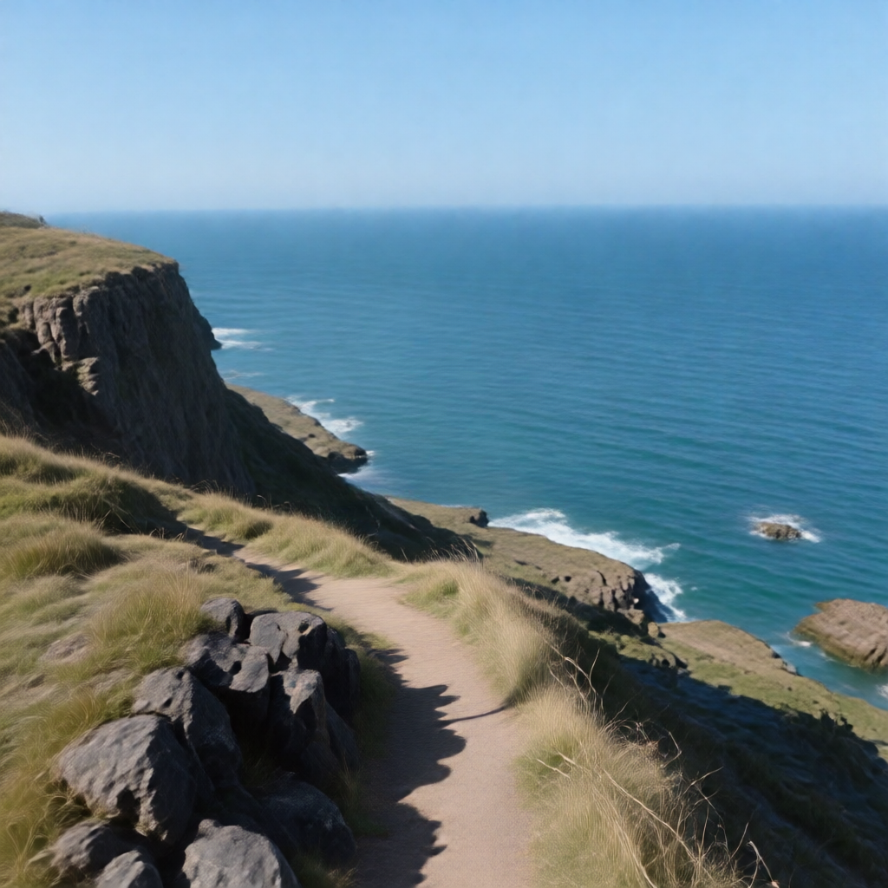 |

[마스크 result.json — JSON — 이전 마스크 생성 기록 보기](/AiBook/assets/part-07/chapter-05/p7-5-4-sam2-person-mask-scene-a-2511-elevated-v1-result.json)

[포즈 컷아웃 result.json — JSON — 이전 컷아웃 생성 기록 보기](/AiBook/assets/part-07/chapter-05/p7-5-4-character-pose-cutout-white-scene-a-white-v2-result.json)

[LaMa 배경판 result.json — JSON — 이전 배경 복원 기록 보기](/AiBook/assets/part-07/chapter-05/p7-5-4-lama-background-scene-a-v3-result.json)

마스크 JSON은 카메라판의 SHA-256과 검출 상자·마스크 의미를 기록한다. LaMa 결과 JSON은 같은 카메라판과 마스크를 입력으로 삼고, 흰 영역만 주변 배경으로 복원했음을 기록한다.

~~~bash
python docs/assets/part-07/chapter-05/p7_5_4_generate_person_mask.py \
  --reference docs/assets/part-07/chapter-05/p7-5-4-qwen-2511-camera-no-azimuth-elevated-scene-a-v1-seed-5420-steps-4.png \
  --run-label scene-a-2511-elevated-v1

python docs/assets/part-07/chapter-05/p7_5_4_extract_masked_character.py \
  --scene docs/assets/part-07/chapter-05/p7-5-4-qwen-2511-camera-no-azimuth-elevated-scene-a-v1-seed-5420-steps-4.png \
  --mask docs/assets/part-07/chapter-05/p7-5-4-sam2-person-mask-scene-a-2511-elevated-v1.png \
  --matte white --run-label pose-cutout-white-scene-a-white-v2

python docs/assets/part-07/chapter-05/p7_5_4_restore_background_lama.py \
  --scene docs/assets/part-07/chapter-05/p7-5-4-qwen-2511-camera-no-azimuth-elevated-scene-a-v1-seed-5420-steps-4.png \
  --mask docs/assets/part-07/chapter-05/p7-5-4-sam2-person-mask-scene-a-2511-elevated-v1.png \
  --run-label scene-a-v3 --grow 25
~~~

## 포즈에 캐릭터를 이식한다

Qwen Image Edit 2509에는 역할이 다른 두 이미지만 준다. 첫 번째는 위의 흰 배경 포즈 참조이고, 두 번째는 P7-5.3의 +90° 전신 착장 이미지다. 지시는 첫 이미지의 여성을 두 번째 이미지의 여성으로 바꾸되 포즈를 유지한다로 제한한다. 이 단계에서 배경을 넣지 않으므로, 배경의 색·화풍이 얼굴과 의상을 덮어쓰지 않는다.

| 포즈에 이식된 캐릭터 | 인물 알파 마스크 검수 |
| --- | --- |
|  | 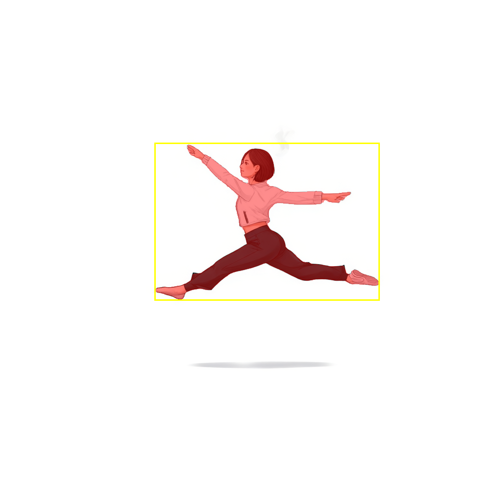 |

[포즈 이식 result.json — JSON — 이전 포즈 이식 기록 보기](/AiBook/assets/part-07/chapter-05/p7-5-4-qwen-2509-pose-transfer-plus90-replace-v2-seed-62294-steps-10-result.json)

[알파 마스크 result.json — JSON — 이전 인물 마스크 기록 보기](/AiBook/assets/part-07/chapter-05/p7-5-4-sam2-person-mask-pose-transfer-plus90-replace-v2-result.json)

포즈 이식 JSON에는 두 입력의 SHA-256, seed 62294, 10 step, true_cfg_scale 4.0이 기록돼 있다. 이후 SAM2 마스크는 이식된 캐릭터의 실루엣만 남겨 배경과 안전하게 합치기 위한 알파 채널이다.

~~~bash
python docs/assets/part-07/chapter-05/p7_5_4_qwen_edit_pose_transfer.py \
  --pose docs/assets/part-07/chapter-05/p7-5-4-character-pose-cutout-white-scene-a-white-v2.png \
  --character docs/assets/part-07/chapter-05/p7-5-3-qwen-outfit-stage2-yaw_plus_90-multiple-angle-v1-seed-62294-steps-8.png \
  --run-label plus90-replace-v2 --steps 10
~~~

### 포즈 참조와 초기 잠재값의 역할을 분리한다

두 이미지 편집에서는 텍스트의 `Picture 1`, `Picture 2` 역할만으로 우선순위가 완전히 정해지지 않는다. 초기 잠재값을 어느 이미지에서 인코딩하는지도 결과의 출발점을 정한다. Scene B의 흰 배경 점프 컷아웃을 첫 번째 조건 참조로 두고, P7-5.3의 `+45°` 쿼터뷰 2단계 착장을 두 번째 조건 참조이자 초기 잠재값으로 사용했다. 카메라 LoRA와 카메라 지시는 넣지 않았다.

| 캐릭터 잠재값에서 시작한 포즈 이식 |
| --- |
| 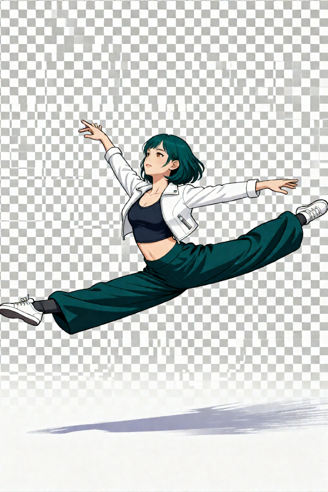 |

[포즈 이식 result.json — JSON — 초기 잠재값 비교 기록 보기](/AiBook/assets/part-07/chapter-05/p7-5-4-qwen-2511-pose-transfer-cutout-quarter-plus45-q4-0-v2-seed-62294-steps-8-result.json)

Qwen Image Edit 2511 Q4_0에서 seed 62294, 8 step으로 실행하고, `A split leap pose.`라는 짧은 양성 포즈 지시만 덧붙였다. 이 결과에서는 점프 자세는 첫 이미지의 조건 참조가, 청록 단발·흰 재킷·청록 와이드 팬츠는 두 번째 이미지의 초기 잠재값이 맡는다. 양쪽 다리와 신발은 생성됐지만, 컷아웃의 체커보드 배경도 함께 남았다. 따라서 이 결과는 포즈·캐릭터·착장을 전달하는 중간 PNG이며, 다음 2511 장면 교체 단계의 두 번째 입력으로만 쓴다. result.json의 `initial_latent`와 `prompt` 필드로 이 선택을 재현할 수 있다.

### 컷아웃에서 캐릭터 identity를 이식하는 기본 워크플로우

이번에 검증하는 대상은 Scene B 한 장의 품질이 아니라, 장면을 만들 때 입력의 역할을 분리하는 순서다. 장면의 공간·카메라·기존 인물의 포즈를 먼저 카메라판에 고정하고, 그 인물을 잘라 낸 흰 배경 컷아웃에서 캐릭터의 얼굴·헤어·착장을 이식한다. 카메라판 전체를 바로 교체하지 않는다.

1. Qwen-Image T2I로 A·B·C의 첫 장면을 만든 뒤, Qwen Image Edit 2511 Multiple Angles로 카메라판을 만든다. 이때 기존 인물은 화면 구도와 포즈의 자리표 역할을 한다.
2. 카메라판에서 인물 마스크와 흰 배경 포즈 컷아웃을 만든다. 이 컷아웃은 포즈·인물 크기·프레이밍만 Picture 1에 전달한다.
3. 검증된 캐릭터 identity·착장 PNG를 Picture 2로 넣고, 컷아웃을 1280×1280 흰색 1:1 캔버스로 정규화해 Picture 1이자 초기 잠재값으로 둔다. `Replace the woman in Picture 1 with the woman in Picture 2. Preserve Picture 1 pose and framing. Plain white 1:1 square background.`라는 짧은 지시로 identity를 이식한다. 캔버스 정규화는 전체 포즈를 자르지 않고 contain 방식으로 배치한다.
4. 컷아웃의 포즈·프레이밍과 캐릭터의 헤어·착장·팔다리가 함께 유지됐는지 확인한다. 이후 장면에 다시 합칠 때는 같은 마스크로 인물 경계를 제한한다. 빈 배경판이 필요한 별도 작업도 LaMa 대신 2511의 인물 제거 편집으로 구성할 수 있다.

## 별도 배경판이 필요할 때만 합성과 보정을 쓴다

컷아웃에서 identity를 이식한 뒤 인물만 따로 저장하거나 빈 배경판을 재사용해야 하는 경우에는 캐릭터 PNG·캐릭터 마스크·배경판을 알파 합성하고 별도 보정을 쓴다. 이때 빈 배경판 생성도 LaMa에 고정하지 않고 2511 인물 제거 편집으로 대체할 수 있다.

| 알파 합성 | 최종 화풍·광원 통일 |
| --- | --- |
|  | 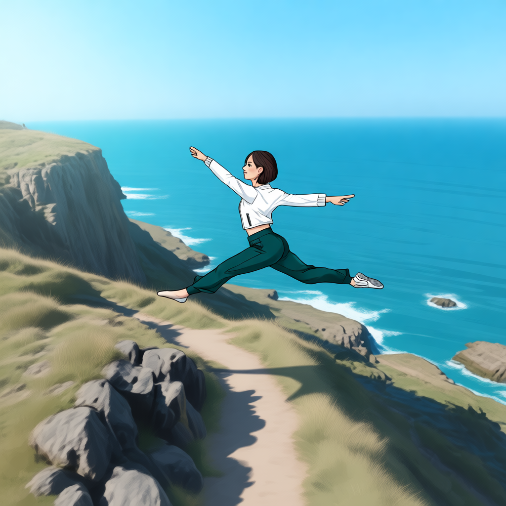 |

[알파 합성 result.json — JSON — 합성 입력과 출력 기록 보기](/AiBook/assets/part-07/chapter-05/p7-5-4-character-background-composite-scene-a-v1-result.json)

[광원 — 화풍 통일 result.json — JSON — 최종 보정 기록 보기](/AiBook/assets/part-07/chapter-05/p7-5-4-qwen-2509-harmonized-composite-scene-a-v1-seed-62294-steps-10-result.json)

최종 JSON은 바로 앞 합성 PNG의 SHA-256을 입력으로 기록한다. 따라서 최종 이미지를 다시 만들 때는 위 순서의 각 JSON에서 입력 해시가 연결되는지만 확인하면 된다.

### 하이앵글 Scene B에 같은 경로 적용하기

Scene A의 해안 절벽 예시는 그대로 두고, 같은 분리·합성 경로를 야생화 초원의 Scene B에도 적용할 수 있다. 이 변형은 `front-left quarter view high-angle shot medium shot` 카메라판에서 포즈와 배경을 먼저 분리하고, `+45°` 착장 참조를 30 step으로 이식한 뒤 꽃밭 배경판에 합성했다. 마지막 보정은 Scene B 전용 프롬프트로 꽃밭과 인물의 수채화 질감·광원을 맞춘다.

| Scene B 최종 화풍·광원 통일 |
| --- |
| 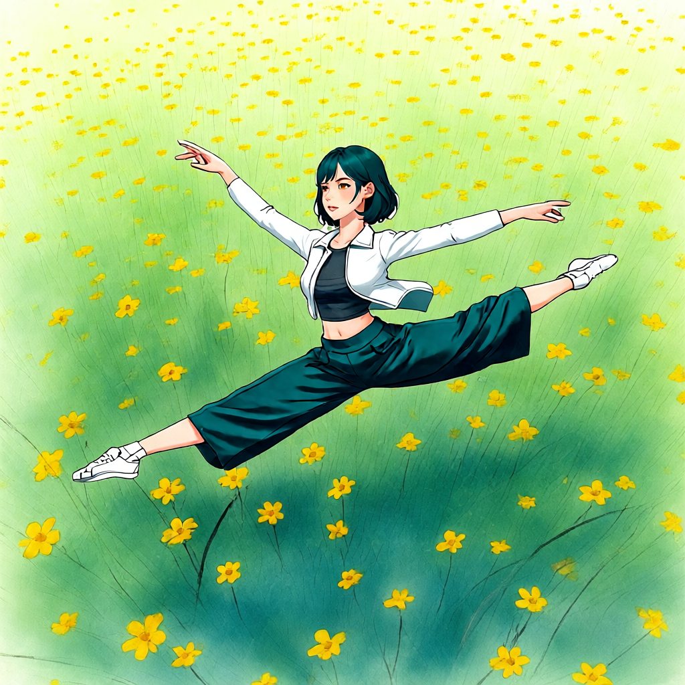 |

[Scene B 최종 result.json — JSON — 장면별 보정 기록 보기](/AiBook/assets/part-07/chapter-05/p7-5-4-qwen-2509-harmonized-composite-scene-b-front-left-high-angle-plus45-v2-seed-62294-steps-10-result.json)

Scene B처럼 다른 장소를 보정할 때는 `p7_5_4_qwen_harmonize_composite.py`에 `--scene scene-b`를 지정한다. Scene A의 기본값과 해안 절벽 프롬프트는 그대로 유지된다.

~~~bash
python docs/assets/part-07/chapter-05/p7_5_4_composite_character_background.py \
  --character docs/assets/part-07/chapter-05/p7-5-4-qwen-2509-pose-transfer-plus90-replace-v2-seed-62294-steps-10.png \
  --mask docs/assets/part-07/chapter-05/p7-5-4-sam2-person-mask-pose-transfer-plus90-replace-v2.png \
  --background docs/assets/part-07/chapter-05/p7-5-4-lama-background-scene-a-v3.png \
  --run-label scene-a-v1

python docs/assets/part-07/chapter-05/p7_5_4_qwen_harmonize_composite.py \
  --input docs/assets/part-07/chapter-05/p7-5-4-character-background-composite-scene-a-v1.png \
  --run-label scene-a-v1 --steps 10
~~~

[알파 합성 코드 보기](/AiBook/assets/part-07/chapter-05/p7_5_4_composite_character_background.py)

[광원 — 화풍 통일 코드 보기](/AiBook/assets/part-07/chapter-05/p7_5_4_qwen_harmonize_composite.py)

## 확인할 점

- 포즈·캐릭터·배경의 역할을 한 번의 Qwen 편집 입력에 모두 넣지 않는다.
- 같은 카메라판의 마스크로 포즈 참조와 배경판을 만들었는지 각 result.json의 입력 해시로 확인한다.
- 합성 전 캐릭터 마스크에 머리카락·손끝·양발이 포함됐는지 오버레이를 확인한다.
- 공중에 있는 인물에는 접지 그림자를 추가하지 않는다. 최종 단계는 광원과 렌더링 톤만 정리한다.
