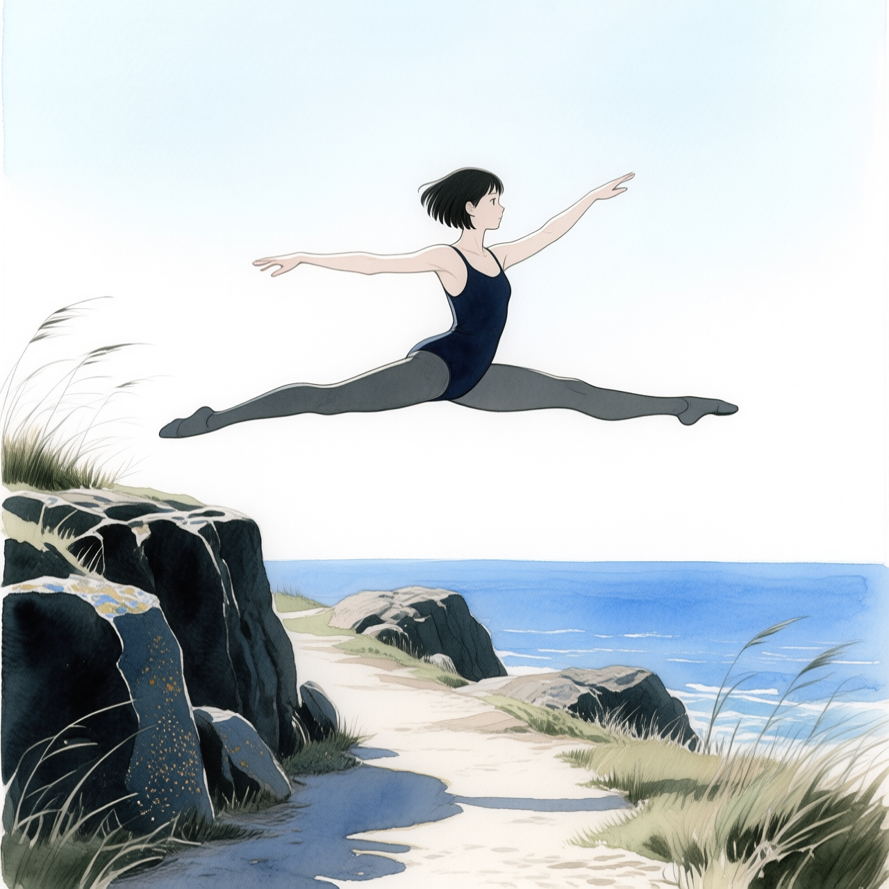
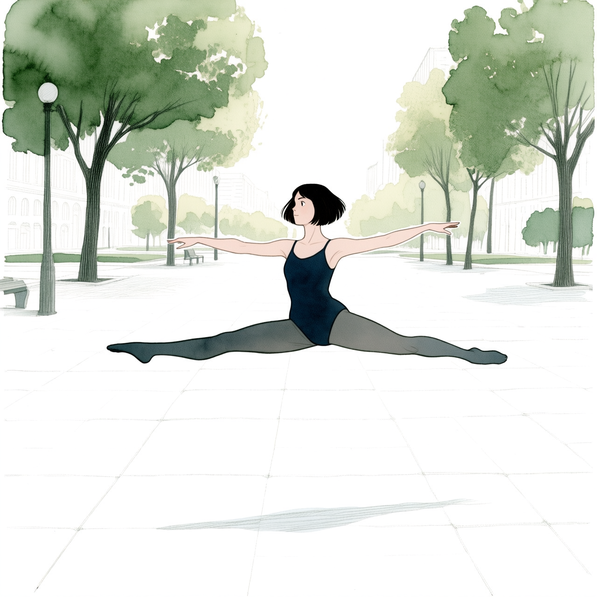

# P7-5.4 스토리보드 장면과 카메라판 만들기

> Section ID: `P7-5.4`
> Version: `v2026.09.05`

한 장면을 구성하기 전에 먼저 장소·동작·공통 화풍을 가진 출발 장면을 만들고, 그 장면을 카메라판으로 변환한다. 이 절은 이 두 단계까지만 다룬다. 카메라판에서 인물을 분리하고 Mira의 얼굴·헤어·착장을 이식해 배경과 통합하는 절차는 [P7-5.5](section-05.md)에서 이어진다. 각 단계의 `result.json`에는 실제 입력 파일, SHA-256, 모델, seed, step을 남긴다.

## 장면 생성과 카메라 변환은 다른 입력 계약을 쓴다

| 구성 요소 | 맡긴 일 | 입력·출력 경계 |
| --- | --- | --- |
| `Qwen/Qwen-Image-Edit-2511` BF16 + Diffusers | Mira 참조를 반영한 장면 A·B·C의 최초 RGB 스토리보드 생성 | Mira 전신 착장·정면 머리 참조와 장면 계약 → 스토리보드 |
| `Qwen/Qwen-Image-Edit-2511` + Multiple-angles LoRA | 카메라판의 방위·높이·거리 변환 | 스토리보드 한 장 → 카메라판 한 장 |

P7-5.4 생성기는 `Qwen-Image-Edit-2511` 공식 Diffusers 파이프라인에 Mira 전신 착장과 Mira 정면 머리를 순서대로 넣는다. 장면의 위치·포즈·프레이밍·배경은 장면 프롬프트가 맡고, 두 입력은 Mira identity와 선화 기준을 맡는다. 장면 프롬프트는 Mira의 헤어·얼굴·피부·눈·착장을 텍스트로 반복하지 않고, Pictures 1·2의 깨끗하고 섬세한 선화·부드러운 얼굴 렌더링을 주인공에 적용하도록만 지시한다. BF16 가중치는 모듈별로 순차 CPU 오프로딩하므로 ComfyUI 서버나 GGUF 경로를 거치지 않으며, 실행 시간은 늘어날 수 있지만 모든 가중치를 GPU 메모리에 동시에 올리지 않는다.

카메라판에는 공식 `Qwen/Qwen-Image-Edit-2511` Diffusers 파이프라인과 Multiple-angles LoRA만 사용한다. 8 GB VRAM 환경에서는 가중치를 순차 CPU 오프로딩하고, `<sks>` 뒤에 방위·높이·필요할 때만 거리 토큰을 넣는다. 이 단계는 캐릭터 identity를 새로 정하는 것이 아니라 장면의 카메라 조건을 바꾸는 단계다.

## Mira 참조와 같은 화풍 계약으로 정사각형 A·B·C 장면을 만든다

첫 장면은 Mira 전신 착장과 정면 머리만 참조하는 다중 참조 생성이다. 장소·동작·구도만 장면별 프롬프트로 바꾸고, 공통 화풍은 P7-5.1 스타일 계약의 `character_scene_style_prompt`에서 그대로 가져온다. 배경 전용 `common_contract`에는 사람을 금지하는 조건이 있으므로, 인물이 있는 이 세 장면에는 쓰지 않는다.

생성기의 기본값은 1280×1280, 20 step, true CFG 4.0이다. 1280은 32의 배수인 정사각형 캔버스다. Scene A는 Mira가 붐비는 도시 거리에서 카메라를 향해 달리고, Scene B는 해 질 무렵 해변 위에서 grand jeté를 하며, Scene C는 도시 전망의 언덕에서 동료와 책을 읽는다. 아래 기존 그림과 JSON은 이전 Q4 실행 기록이며, 새 2512 실행 결과를 만들면 해당 자산으로 교체한다.

| Scene A: 해안 절벽 | Scene B: 야생화 초원 | Scene C: 도심 공원 |
| --- | --- | --- |
|  |  |  |

[Scene A result.json — JSON — 1280 정사각형 T2I 실행 기록 보기](/AiBook/assets/part-07/chapter-05/p7-5-5-qwen-image-q4ks-style-contract-scene-a-v1-seed-5420-steps-20-result.json)

[Scene B result.json — JSON — 1280 정사각형 T2I 실행 기록 보기](/AiBook/assets/part-07/chapter-05/p7-5-5-qwen-image-q4ks-style-contract-scene-b-v1-seed-5421-steps-20-result.json)

[Scene C result.json — JSON — 1280 정사각형 T2I 실행 기록 보기](/AiBook/assets/part-07/chapter-05/p7-5-5-qwen-image-q4ks-style-contract-scene-c-v1-seed-5422-steps-20-result.json)

세 result JSON에는 같은 모델·해상도·step·CFG와 각 장면의 prompt, seed, 실행 환경이 남는다. 두 Mira 참조를 쓰더라도 얼굴·착장 보존 정도는 산출 PNG로 별도 검수한다. P7-5.5에서는 이 출발 장면을 카메라판으로 변환한 뒤, 후속 character identity·착장 이식 절차를 다룬다.

P7-5.4 생성기의 `SCENE_PROMPTS`는 A·B·C의 장소·동작·구도만 구분하고, `p7-5-1-style-prompt-contract.json`의 `character_scene_style_prompt`를 뒤에 붙인다. 기본값 `--scene a`, `--size 1280`, `--steps 20`은 Mira가 도시 거리에서 카메라 쪽으로 달려오는 장면이다. `--mira-fullbody`는 Picture 1의 착장 참조이고 `--mira-head`는 Picture 2의 identity 참조다. `--prompt`는 비교용 장면 지시 대체일 뿐 identity 설명을 보충하지 않는다. `--run-label`은 기존 결과를 덮어쓰지 않게 한다.

~~~bash
python docs/assets/part-07/chapter-05/p7_5_4_generate_storyboard_scene.py --scene a --dry-run
~~~

[P7-5.4 씬 생성기](../../../assets/part-07/chapter-05/p7_5_4_generate_storyboard_scene.py)

## 멀티플 앵글 카메라판을 먼저 만든다

마스크와 컷아웃은 최초 T2I 장면에서 바로 만들지 않는다. 먼저 Qwen Image Edit 2511 Multiple-angles LoRA로 카메라의 방위·높이·거리를 전환한 카메라판을 만들고, P7-5.5는 **그 카메라판**에서만 인물을 마스크하고 잘라낸다. 따라서 이후 캐릭터 이식에 전달되는 포즈·화면 위치·원근은 최초 장면이 아니라 카메라 전환 뒤의 결과를 따른다.

카메라 생성기는 `--camera a|b|c`에 맞는 원본 Scene PNG를 코드 안에서 선택한다. A는 `front-left quarter view eye-level shot medium shot`, B는 `front-right quarter view high-angle shot medium shot`, C는 `front-left quarter view low-angle shot`이다. 따라서 다른 장면을 실수로 입력하는 문제를 줄이고, 필요할 때만 `--reference`로 명시적으로 덮어쓴다. 기본값은 seed `5420`, 20 step이다.

> 주의: 8GB VRAM에 맞춘 양자화 경로는 실행 가능성을 우선한 구성이다. 방위·높이·거리 같은 카메라 의도가 모두 충분히 반영되지 않을 수 있으므로, result.json의 프롬프트·입력 매핑 확인과 별도로 PNG에서 시점 변화를 직접 비교해야 한다. 이 경로의 실행 성공만으로 카메라 지시가 충족됐다고 판단하지 않는다.

~~~bash
# 각 카메라 preset은 대응하는 최초 Scene PNG를 자동 입력으로 쓴다.
python docs/assets/part-07/chapter-05/p7_5_5_qwen_edit_2511_camera_direct.py --camera a
python docs/assets/part-07/chapter-05/p7_5_5_qwen_edit_2511_camera_direct.py --camera b
python docs/assets/part-07/chapter-05/p7_5_5_qwen_edit_2511_camera_direct.py --camera c
~~~

| Scene A: 좌전방 쿼터·아이레벨·미디엄 | Scene B: 우전방 쿼터·하이앵글·미디엄 | Scene C: 좌전방 쿼터·로우앵글 |
| --- | --- | --- |
|  |  |  |

[Scene A camera result.json — JSON — 공식 2511 아이레벨 20 step 재생성 기록 보기](/AiBook/assets/part-07/chapter-05/p7-5-3-qwen-2511-camera-front-left-quarter-view-eye-level-shot-medium-shot-official-direct-seed-5420-steps-20-result.json)

[Scene B camera result.json — JSON — 공식 2511 20 step 재생성 기록 보기](/AiBook/assets/part-07/chapter-05/p7-5-3-qwen-2511-camera-front-right-quarter-view-high-angle-shot-medium-shot-official-direct-seed-5420-steps-20-result.json)

[Scene C camera result.json — JSON — 거리 토큰 없이 실행한 공식 2511 20 step 기록 보기](/AiBook/assets/part-07/chapter-05/p7-5-3-qwen-2511-camera-front-left-quarter-view-low-angle-shot-no-closeup-v7-seed-5420-steps-20-result.json)

이 세 장은 공식 모델 카드 형식과 Scene별 입력 매핑이 실제로 적용된 실행 기록이다. 카메라 축의 시각적 일치 여부는 PNG를 사람 눈으로 별도로 비교하며, 이 결과만으로 포즈·캐릭터 identity의 보존을 주장하지 않는다.

[공식 Qwen Image Edit 2511 카메라 생성 코드 보기](/AiBook/assets/part-07/chapter-05/p7_5_5_qwen_edit_2511_camera_direct.py)

## 체크리스트

- [ ] 장면 A·B·C는 공통 화풍 계약과 장면별 장소·포즈만으로 만든 T2I 출발 이미지인가?
- [ ] 카메라판은 대응하는 최초 Scene PNG를 입력으로 썼는가?
- [ ] 카메라판 PNG와 result.json을 함께 보고 방위·높이·거리 변화가 실제로 보이는지 확인했는가?
- [ ] 다음 P7-5.5에서 쓸 포즈·프레이밍 기준을 최초 장면이 아닌 카메라판으로 고정했는가?

## 출처와 참고 자료

- [Qwen-Image-Edit-2511 모델 카드](https://huggingface.co/Qwen/Qwen-Image-Edit-2511){: target="_blank" rel="noopener noreferrer"}: Mira 전신·머리 참조를 입력으로 쓰는 공식 다중 이미지 편집 파이프라인의 입력 형식과 사용 예제입니다.
- [Qwen-Image-Edit-2511 모델 카드](https://huggingface.co/Qwen/Qwen-Image-Edit-2511){: target="_blank" rel="noopener noreferrer"}: 카메라판 편집에 사용한 공식 파이프라인의 입력 형식과 사용 예제를 확인합니다.
- [Qwen-Image-Edit-2511 Multiple-Angles LoRA 모델 카드](https://huggingface.co/fal/Qwen-Image-Edit-2511-Multiple-Angles-LoRA){: target="_blank" rel="noopener noreferrer"}: 카메라 방위·높이·거리 변환의 `<sks> [azimuth] [elevation] [distance]` 입력 형식을 확인합니다.

모델 카드의 일반 기능 설명과 별도로, 이 절에서 실제로 사용한 입력 순서·파일 해시·seed·step·출력 경로는 각 `result.json`을 기준으로 확인한다.
