# P7-5.4 스토리보드 장면에 캐릭터를 합성하는 경로

> Section ID: \`P7-5.4\`
> Version: \`v2026.09.02\`

이 절의 목표는 장면을 다시 생성할 때마다 캐릭터의 포즈·의상·얼굴이 달라지는 문제를 줄이는 것이다. 기본 경로는 Qwen-Image가 참조 없이 첫 장면을 만들고, 카메라판에서 포즈 컷아웃을 만든 뒤 Qwen Image Edit 2511로 캐릭터 identity를 이식하는 순서다. 카메라판을 곧바로 원본 캐릭터 참조로 교체하는 방식은 identity를 온전히 반영하지 못해 기본 경로로 채택하지 않는다. 다만 포즈와 착장을 먼저 단일 인물 결과로 정리한 뒤에는, 그 결과를 두 번째 입력으로 하여 카메라판의 인물 자리에 다시 이식할 수 있다. 각 단계의 result.json에는 실제 입력 파일, SHA-256, 모델, seed, step을 남긴다. 따라서 이미지 파일 이름만 보고 추측하지 않고 결과 JSON을 따라 입력 관계를 확인한다.

## 한 모델이 아니라 역할이 다른 구성 요소

P7-5.4의 결과는 하나의 이미지 모델에서 바로 나온 것이 아니다. 장면을 새로 그리는 일, 카메라 위치만 바꾸는 일, 인물의 영역을 찾는 일, 빈 배경을 복원하는 일, 캐릭터를 포즈에 이식하는 일을 분리했다. 같은 입력을 여러 모델에 반복해 넣기보다, 각 단계에 필요한 정보만 넘기는 것이 이 절의 핵심이다.

| 구성 요소 | 맡긴 일 | 이 절에서의 입력·출력 경계 |
| --- | --- | --- |
| `Qwen/Qwen-Image` Q4_K_S GGUF + ComfyUI-GGUF | 장면 A·B·C의 최초 RGB 스토리보드 생성 | 텍스트 장면 계약 → 스토리보드 |
| `Qwen/Qwen-Image-Edit-2511` + Multiple-angles LoRA | 카메라판의 방위·높이·거리 변환 | 스토리보드 한 장 → 카메라판 한 장 |
| `Qwen/Qwen-Image-Edit-2511` | 카메라판 인물 이식과 DeLight 배경·캐릭터의 다중 참조 통합 | 카메라판·단일 인물 또는 배경판·캐릭터 → 장면 한 장 |
| Grounding DINO Tiny | `a woman`, `a person` 텍스트로 인물 상자 탐색 | 카메라판 → 인물 상자 |
| SAM 2.1 Hiera Small | 선택된 상자를 흰색 인물 마스크로 정밀화 | 인물 상자·카메라판 → 마스크 |
| LaMa ONNX | 마스크 영역만 메워 빈 배경판 생성 | 카메라판·마스크 → 배경판 |
| `Qwen/Qwen-Image-Edit-2509` + Nunchaku FP4 r128 transformer | 캐릭터 포즈 이식과 마지막 광원·화풍 통일 | 포즈 참조·착장 또는 합성본 → 캐릭터·최종 장면 |
| `Qwen/Qwen-Image-Edit-2509` + Studio DeLight LoRA | 배경판 또는 통합 장면의 방향광 색조를 중립화 | 배경판 또는 방향광 장면 → 중립 광원 장면 |
| `Qwen/Qwen-Image-Edit-2509` + dx8152 Relight LoRA | 통합 장면의 방향광을 다시 부여 | 중립화된 통합 장면 → 방향광 장면 |

`Qwen-Image`는 텍스트에서 이미지를 만드는 기반 모델이고, 이 절에서는 스토리보드만 맡긴다. 이번 A·B·C 첫 장면은 P7-5.10에서 검증한 Q4_K_S GGUF 저VRAM 경로로 생성했다. `Qwen-Image-Edit-2509`은 DeLight·리라이트처럼 한 장에서 조명을 편집하는 단계에 쓴다. Q4 GGUF와 Nunchaku FP4 r128은 각각 로컬 GPU에서 실행하기 위한 양자화 형식이며, 캐릭터나 카메라 규칙을 새로 추가하는 모델은 아니다. Studio DeLight LoRA는 이미 생긴 방향광을 균일한 스튜디오 광원으로 중립화하는 마지막 단계다. [Qwen-Image 모델 카드](https://huggingface.co/Qwen/Qwen-Image){: target="_blank" rel="noopener noreferrer"} · [Qwen-Image-Edit-2509 모델 카드](https://huggingface.co/Qwen/Qwen-Image-Edit-2509){: target="_blank" rel="noopener noreferrer"} · [Qwen-Image-Edit-2511 모델 카드](https://huggingface.co/Qwen/Qwen-Image-Edit-2511){: target="_blank" rel="noopener noreferrer"} · [Nunchaku Qwen-Image-Edit-2509 배포](https://huggingface.co/nunchaku-ai/nunchaku-qwen-image-edit-2509){: target="_blank" rel="noopener noreferrer"} · [Studio DeLight 모델 카드](https://huggingface.co/prithivMLmods/QIE-2511-Studio-DeLight){: target="_blank" rel="noopener noreferrer"}

카메라판에는 공식 `Qwen/Qwen-Image-Edit-2511` Diffusers 파이프라인과 Multiple-angles LoRA만 사용한다. 8 GB VRAM 환경에서는 가중치를 순차 CPU 오프로딩하고, `<sks>` 뒤에 방위·높이·필요할 때만 거리 토큰을 넣는다. Scene C는 과도한 확대를 피하기 위해 거리 토큰을 생략한다. 이 단계는 캐릭터 identity를 새로 정하는 것이 아니라 장면의 카메라 조건을 바꾸는 단계다. [Qwen-Image-Edit-2511 모델 카드](https://huggingface.co/Qwen/Qwen-Image-Edit-2511){: target="_blank" rel="noopener noreferrer"} · [Multiple-angles LoRA 모델 카드](https://huggingface.co/fal/Qwen-Image-Edit-2511-Multiple-Angles-LoRA){: target="_blank" rel="noopener noreferrer"}

마스크 단계의 Grounding DINO Tiny는 텍스트로 대상 상자를 찾는 zero-shot 객체 검출 모델이고, SAM 2.1 Hiera Small은 그 상자를 인물 외곽 마스크로 바꾼다. LaMa ONNX는 그 마스크 안쪽만 복원한다. 즉 이 세 구성 요소는 캐릭터를 생성하거나 화풍을 정하지 않고, 카메라판에서 **어느 픽셀을 교체하고 어느 픽셀을 유지할지** 정한다. [Grounding DINO Tiny 모델 카드](https://huggingface.co/IDEA-Research/grounding-dino-tiny){: target="_blank" rel="noopener noreferrer"} · [SAM 2 공식 저장소](https://github.com/facebookresearch/sam2){: target="_blank" rel="noopener noreferrer"} · [LaMa ONNX 배포](https://huggingface.co/g-ronimo/lama){: target="_blank" rel="noopener noreferrer"}

위 공개 모델 카드와 저장소의 기능·배포 정보는 2026-08-29에 확인했다. 실제 실행에 쓴 파일명, 양자화 형식, 입력 순서와 seed·step은 각 단계의 `result.json`을 기준으로 확인한다.

## 같은 화풍 계약으로 정사각형 A·B·C 장면을 만든다

첫 장면은 외부 이미지나 잠재값을 넣지 않는 T2I다. 장소와 점프 포즈를 장면별로만 바꾸고, 공통 화풍은 P7-5.1 스타일 계약의 `character_scene_style_prompt`에서 그대로 가져온다. 배경 전용 `common_contract`에는 사람을 금지하는 조건이 있으므로, 인물이 있는 이 세 장면에는 쓰지 않는다.

P7-5.10의 Q4_K_S GGUF 저VRAM 경로에서 1280×1280, 20 step, CFG 4.0을 사용했다. 1280은 32의 배수인 정사각형 캔버스이며, 이번 환경에서 완료를 확인한 실사용 크기다. A·B·C는 각각 해안 절벽, 야생화 초원, 도심 공원으로 장소만 달리하고, 공중 스플릿 점프의 인물은 이후 카메라·포즈·캐릭터 교체의 자리표로 둔다.

| Scene A: 해안 절벽 | Scene B: 야생화 초원 | Scene C: 도심 공원 |
| --- | --- | --- |
|  |  |  |

[Scene A result.json — JSON — 1280 정사각형 T2I 실행 기록 보기](/AiBook/assets/part-07/chapter-05/p7-5-4-qwen-image-q4ks-style-contract-scene-a-v1-seed-5420-steps-20-result.json)

[Scene B result.json — JSON — 1280 정사각형 T2I 실행 기록 보기](/AiBook/assets/part-07/chapter-05/p7-5-4-qwen-image-q4ks-style-contract-scene-b-v1-seed-5421-steps-20-result.json)

[Scene C result.json — JSON — 1280 정사각형 T2I 실행 기록 보기](/AiBook/assets/part-07/chapter-05/p7-5-4-qwen-image-q4ks-style-contract-scene-c-v1-seed-5422-steps-20-result.json)

세 result JSON에는 같은 모델·해상도·step·CFG와 각 장면의 prompt, seed, ComfyUI graph가 남는다. 이 결과는 장면·포즈·공통 화풍을 가진 출발 이미지라는 관찰일 뿐, 토르소 기준 얼굴이나 최종 착장이 유지된다는 근거는 아니다. 캐릭터 identity와 의상은 다음 2511 편집 단계에서 별도 입력으로 이식한다. 실행 코드는 P7-5.10 Q4 GGUF 생성기를 사용한다.

[P7-5.10 Q4 GGUF 생성기](../../../assets/part-07/chapter-05/p7_5_9_qwen_image_gguf_low_vram_probe.py)

## 멀티플 앵글 카메라판을 먼저 만든다

컷아웃은 최초 T2I 장면에서 바로 만들지 않는다. 먼저 Qwen Image Edit 2511 Multiple-angles LoRA로 카메라의 방위·높이·거리를 전환한 카메라판을 만들고, **그 카메라판**에서만 인물을 마스크하고 잘라낸다. 따라서 이후 캐릭터 이식에 전달되는 포즈·화면 위치·원근은 최초 장면이 아니라 카메라 전환 뒤의 결과를 따른다.

카메라 생성기는 `--camera a|b|c`에 맞는 원본 Scene PNG를 코드 안에서 선택한다. A는 `front-left quarter view eye-level shot medium shot`, B는 `front-right quarter view high-angle shot medium shot`, C는 `front-left quarter view low-angle shot`이다. 따라서 다른 장면을 실수로 입력하는 문제를 줄이고, 필요할 때만 `--reference`로 명시적으로 덮어쓴다. 기본값은 seed `5420`, 20 step이다.

> 주의: 8GB VRAM에 맞춘 양자화 경로는 실행 가능성을 우선한 구성이다. 방위·높이·거리 같은 카메라 의도가 모두 충분히 반영되지 않을 수 있으므로, result.json의 프롬프트·입력 매핑 확인과 별도로 PNG에서 시점 변화를 직접 비교해야 한다. 이 경로의 실행 성공만으로 카메라 지시가 충족됐다고 판단하지 않는다.

~~~bash
# 각 카메라 preset은 대응하는 최초 Scene PNG를 자동 입력으로 쓴다.
python docs/assets/part-07/chapter-05/p7_5_4_qwen_edit_2511_camera_direct.py --camera a
python docs/assets/part-07/chapter-05/p7_5_4_qwen_edit_2511_camera_direct.py --camera b
python docs/assets/part-07/chapter-05/p7_5_4_qwen_edit_2511_camera_direct.py --camera c
~~~

| Scene A: 좌전방 쿼터·아이레벨·미디엄 | Scene B: 우전방 쿼터·하이앵글·미디엄 | Scene C: 좌전방 쿼터·로우앵글 |
| --- | --- | --- |
|  | 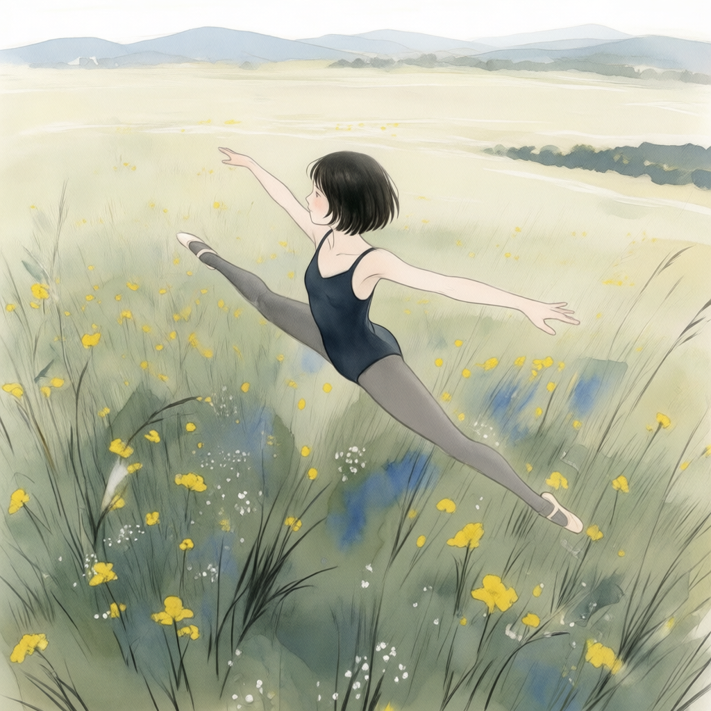 | 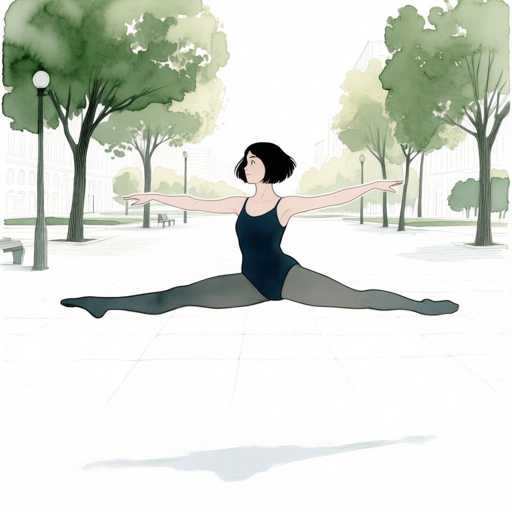 |

[Scene A camera result.json — JSON — 공식 2511 아이레벨 20 step 재생성 기록 보기](/AiBook/assets/part-07/chapter-05/p7-5-3-qwen-2511-camera-front-left-quarter-view-eye-level-shot-medium-shot-official-direct-seed-5420-steps-20-result.json)

[Scene B camera result.json — JSON — 공식 2511 20 step 재생성 기록 보기](/AiBook/assets/part-07/chapter-05/p7-5-3-qwen-2511-camera-front-right-quarter-view-high-angle-shot-medium-shot-official-direct-seed-5420-steps-20-result.json)

[Scene C camera result.json — JSON — 거리 토큰 없이 실행한 공식 2511 20 step 기록 보기](/AiBook/assets/part-07/chapter-05/p7-5-3-qwen-2511-camera-front-left-quarter-view-low-angle-shot-no-closeup-v7-seed-5420-steps-20-result.json)

이 세 장은 공식 모델 카드 형식과 Scene별 입력 매핑이 실제로 적용된 실행 기록이다. 카메라 축의 시각적 일치 여부는 PNG를 사람 눈으로 별도로 비교하며, 이 결과만으로 포즈·캐릭터 identity의 보존을 주장하지 않는다.

[공식 Qwen Image Edit 2511 카메라 생성 코드 보기](/AiBook/assets/part-07/chapter-05/p7_5_4_qwen_edit_2511_camera_direct.py)

### 마스크와 컷아웃을 쓴다

마스크의 흰색은 인물, 검은색은 보존할 배경을 뜻한다. 오버레이에서는 빨간색으로 덮인 영역과 노란색 검출 상자를 함께 보므로, 머리·손가락·발끝 같은 전신 경계가 빠졌는지 컷아웃보다 먼저 확인할 수 있다.

| Scene A 마스크 오버레이 | Scene B 마스크 오버레이 | Scene C 마스크 오버레이 |
| --- | --- | --- |
| 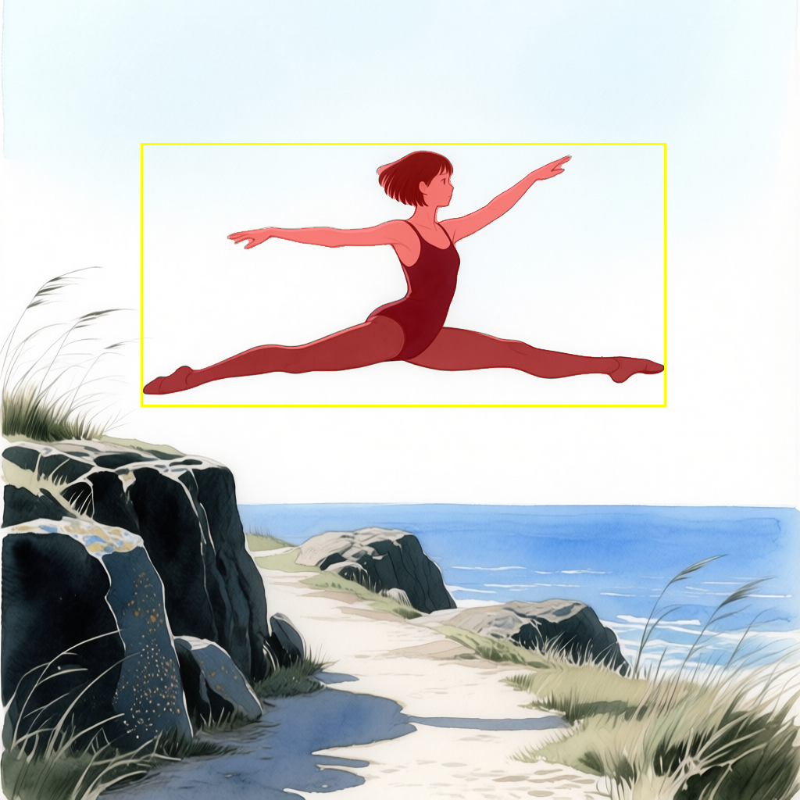 |  | 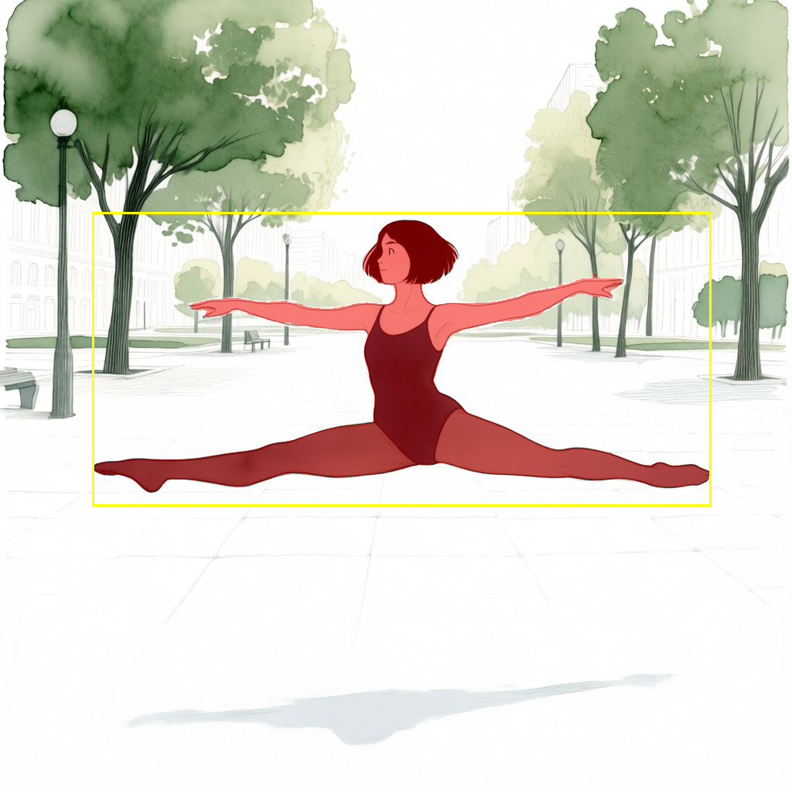 |

| Scene A 포즈 컷아웃 | Scene B 포즈 컷아웃 | Scene C 포즈 컷아웃 |
| --- | --- | --- |
|  |  | 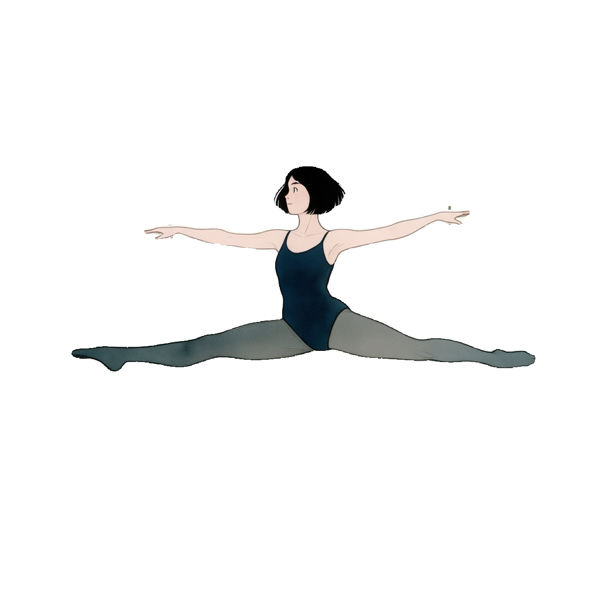 |

[Scene A mask result.json — JSON — 아이레벨 카메라판의 검출 상자와 SAM2 마스크 기록 보기](/AiBook/assets/part-07/chapter-05/p7-5-3-sam2-person-mask-official-camera-scene-a-v6-result.json)

[Scene A cutout result.json — JSON — 아이레벨 카메라판의 흰 배경 포즈 컷아웃 기록 보기](/AiBook/assets/part-07/chapter-05/p7-5-3-character-pose-cutout-white-official-camera-scene-a-v6-result.json)

[Scene B mask result.json — JSON — 재생성 카메라판의 검출 상자와 SAM2 마스크 기록 보기](/AiBook/assets/part-07/chapter-05/p7-5-4-sam2-person-mask-official-camera-scene-b-v7-result.json)

[Scene B cutout result.json — JSON — 재생성 카메라판의 흰 배경 포즈 컷아웃 기록 보기](/AiBook/assets/part-07/chapter-05/p7-5-3-character-pose-cutout-white-official-camera-scene-b-v7-result.json)

[Scene C mask result.json — JSON — 거리 토큰 없는 카메라판의 검출 상자와 SAM2 마스크 기록 보기](/AiBook/assets/part-07/chapter-05/p7-5-4-sam2-person-mask-official-camera-scene-c-no-closeup-v9-result.json)

[Scene C cutout result.json — JSON — 거리 토큰 없는 카메라판의 흰 배경 포즈 컷아웃 기록 보기](/AiBook/assets/part-07/chapter-05/p7-5-4-character-pose-cutout-white-official-camera-scene-c-no-closeup-v9-size-1280x1280-result.json)

세 마스크는 머리·양팔·양다리·발끝을 포함했다. 거리 토큰을 생략해 다시 만든 Scene C에서는 SAM2 마스크가 인물만 분리하고, 하단의 분리된 그림자는 배경으로 남겼다. 이처럼 마스크가 완벽하지 않을 때는 컷아웃을 캐릭터 identity의 기준으로 쓰지 않으며, 픽셀 단위 외곽이 필요한 단계에서만 그 경계를 정제한다.

[인물 마스크 생성 코드 보기](../../../assets/part-07/chapter-05/p7_5_4_generate_person_mask.py)

[흰 배경 포즈 컷아웃 생성 코드 보기](../../../assets/part-07/chapter-05/p7_5_4_extract_pose_cutout.py)

흰 배경 컷아웃은 알파 채널을 보존하는 최종 합성 자산이 아니다. 포즈 아이덴티 이식에서는 먼저 이 컷아웃에 그림자를 만들고, **그림자 포함 컷아웃**을 `Picture 1`과 초기 잠재값으로 쓴다. `Picture 1`은 포즈·인물 크기·프레이밍·그림자만, `Picture 2`의 캐릭터 identity 기준은 얼굴·헤어·착장만 맡도록 역할을 분리한다. 인물 레이어 보관과 빈 배경판 생성도 같은 마스크의 별도 활용이다.

### 컷아웃의 그림자는 따로 만들고 인물 주변을 보호한다

Scene A·B 원본에는 분리해 유지할 수 있는 캐릭터 그림자가 없었다. 그래서 흰 배경 컷아웃을 Qwen Image Edit 2511에 넣어 바닥 그림자만 생성하고, 마지막에는 원본 인물 마스크를 40 px 확장해 원래 캐릭터와 주변의 흰 배경을 다시 덮었다. 이 보호 영역은 Qwen이 인물 바깥에 새 팔·머리 같은 잔상을 그린 범위를 지운다. Scene C는 거리 토큰을 생략한 카메라판을 두 번째 참조로 넣어, 본체와 그림자의 세로 간격만 따르게 했다. C에서는 본체를 다시 그리지 않도록 하단 영역의 생성 픽셀만 남긴다.

| Scene A 그림자 포함 컷아웃 | Scene B 그림자 포함 컷아웃 | Scene C 그림자 포함 컷아웃 |
| --- | --- | --- |
| 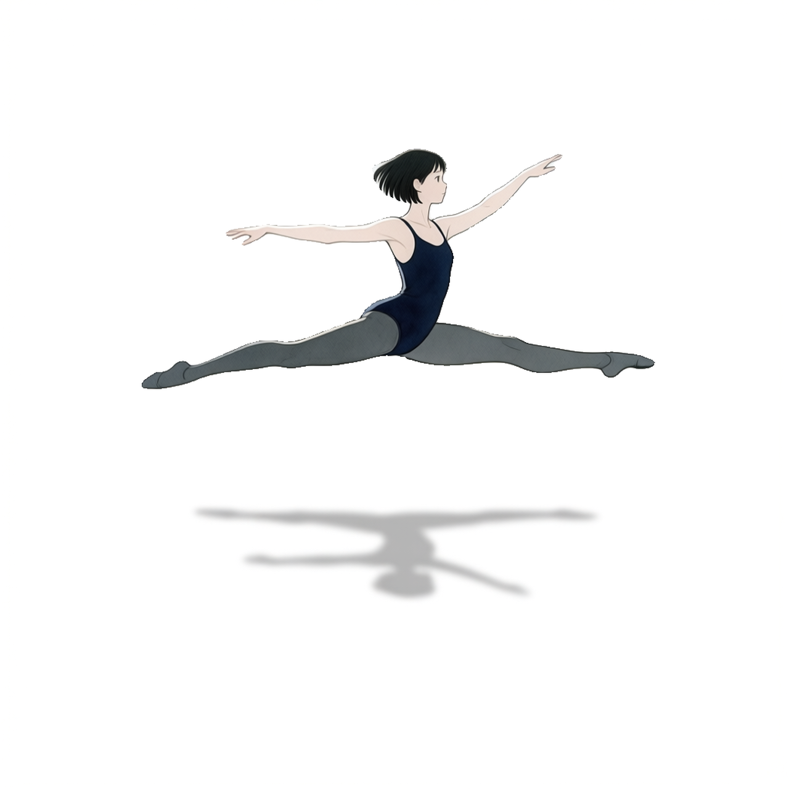 | 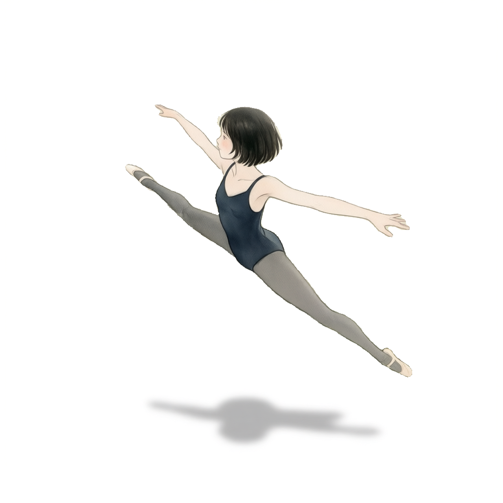 | 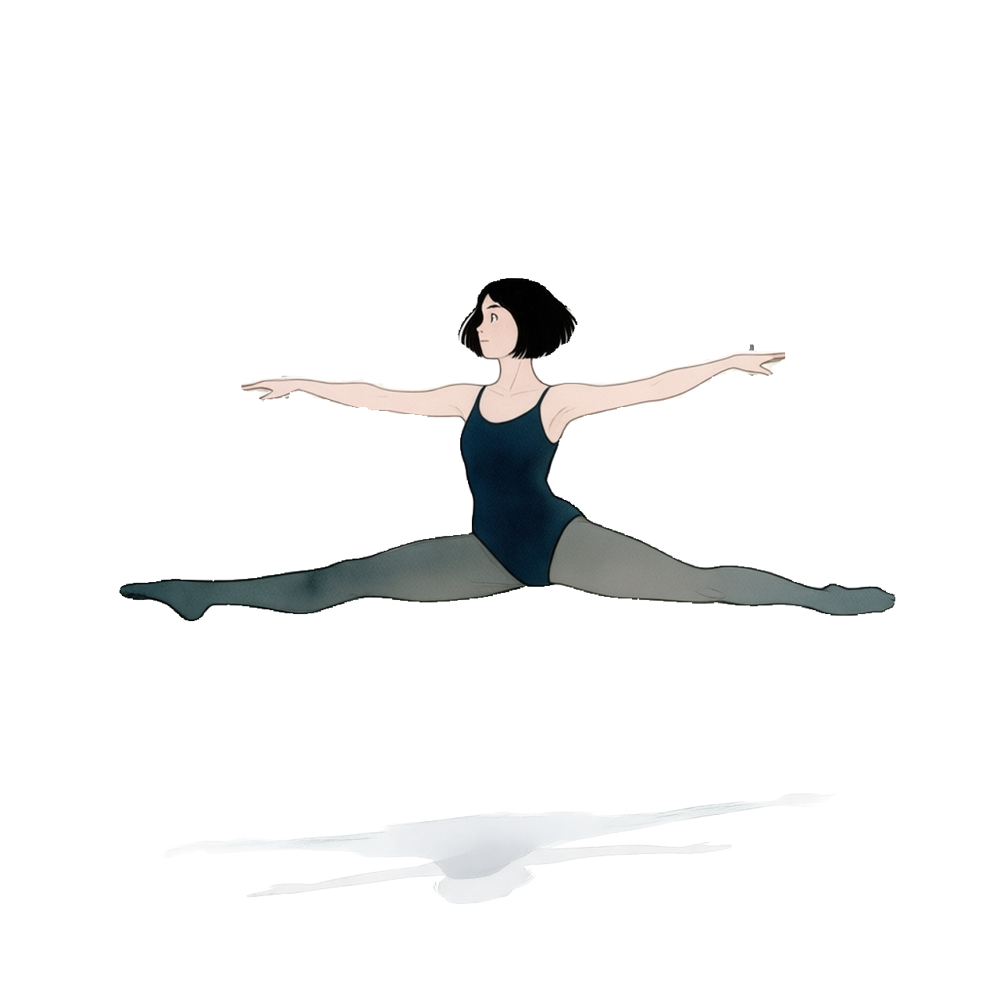 |

이 결과는 **잔상 제거 구조**만 확인한다. 그림자 실루엣과 지면 원근은 아직 자연스럽지 않으므로, 이를 실제 장면에 바로 합성할 최종 그림자로 채택하지 않는다. 포즈 아이덴티 생성기는 A·B에서 이 그림자 포함 컷아웃을 자동으로 `Picture 1`에 사용한다. C도 먼저 같은 그림자 산출물을 만든 뒤에만 자동 실행할 수 있으며, 그림자 자산이 없으면 생성기가 중단해 흰 배경 원본 컷아웃으로 조용히 되돌아가지 않는다.

[Qwen 2511 컷아웃 그림자 생성기 보기](../../../assets/part-07/chapter-05/p7_5_4_qwen_edit_2511_generate_cutout_shadow.py)

[Scene A cutout shadow result.json — JSON — Qwen 후보와 확장 보호 마스크 기록 보기](/AiBook/assets/part-07/chapter-05/p7-5-4-qwen-2511-cutout-shadow-scene-a-eye-level-v2-size-1280x1280-seed-62294-steps-10-result.json)

[Scene B cutout shadow result.json — JSON — Qwen 후보와 확장 보호 마스크 기록 보기](/AiBook/assets/part-07/chapter-05/p7-5-4-qwen-2511-cutout-shadow-scene-b-v1-size-1280x1280-seed-62294-steps-10-result.json)

[Scene C cutout shadow result.json — JSON — 카메라판 참조와 하단 그림자 합성 기록 보기](/AiBook/assets/part-07/chapter-05/p7-5-4-qwen-2511-cutout-shadow-scene-c-no-closeup-v1-size-1280x1280-seed-62294-steps-10-result.json)

### 그림자 포함 포즈에 측면 캐릭터 identity를 이식한다

Scene B·C는 각각 그림자 포함 컷아웃을 `Picture 1`, P7-5.3의 2단계 착장 이미지를 `Picture 2`로 넣었다. `Picture 1`은 스플릿 점프·인물 크기·프레이밍·바닥 그림자를, `Picture 2`는 청록 단발·흰 크롭 재킷·회색 이너·청록 바지를 맡는다. 카메라 LoRA나 추가 포즈 설명은 넣지 않고, `Replace the woman in Picture 1 with the woman in Picture 2, preserving the pose.`와 그림자 보존 지시만 사용했다.

| Scene B 그림자 컷아웃 다중 참조 결과 | Scene C 그림자 컷아웃 다중 참조 결과 |
| --- | --- |
| 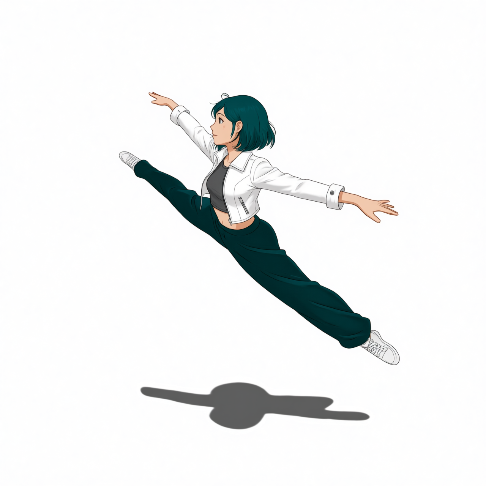 | 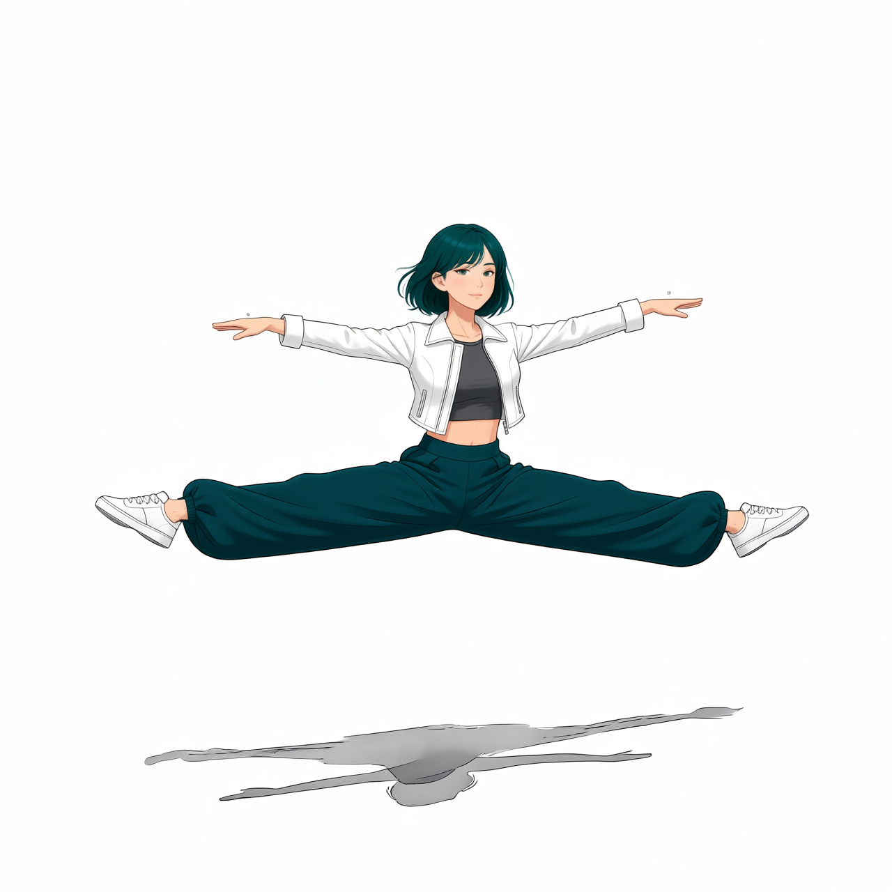 |

[Scene B 다중 참조 result.json — JSON — 그림자 컷아웃·Stage 2 착장의 입력 순서, 2511과 30 step 실행 조건 보기](/AiBook/assets/part-07/chapter-05/p7-5-4-qwen-2511-pose-identity-official-camera-scene-b-shadow-stage2-outfit-v1-size-1280x1280-seed-62294-steps-30-result.json)

[Scene C 다중 참조 result.json — JSON — 거리 토큰 없는 그림자 컷아웃·Stage 2 착장의 입력 순서, 2511과 30 step 실행 조건 보기](/AiBook/assets/part-07/chapter-05/p7-5-4-qwen-2511-pose-identity-official-camera-scene-c-shadow-stage2-outfit-no-closeup-v2-size-1280x1280-seed-62294-steps-30-result.json)

1280×1280, seed `62294`, 30 step, true CFG `4.0`에서 공중 스플릿 점프와 그 아래 그림자는 유지됐고, 두 번째 참조의 재킷·회색 이너·청록 바지도 함께 반영됐다. 따라서 5.4의 기본 경로는 별도 착장 추출이나 Try-On LoRA가 아니라, 역할을 나눈 두 이미지의 Qwen Image Edit 2511 다중 참조 이식으로 둔다. 착장 추출과 Try-On LoRA의 비교 실험은 P7-5.12에서 별도로 다룬다.

아래 실행은 위 result.json을 만든 기준 Python 코드다. `--pose`는 그림자 포함 포즈를 `Picture 1`로 고정하고, `--character`는 Stage 2 착장을 `Picture 2`로 넣는다. `--steps`를 바꾸면 동일한 입력·seed에서 step 수에 따른 의상·신발 세부 표현 변화를 비교할 수 있고, `--run-label`을 바꾸면 기존 결과 파일을 덮어쓰지 않는다.

~~~bash
python docs/assets/part-07/chapter-05/p7_5_4_qwen_edit_2511_pose_identity.py \
  --scenes b \
  --pose docs/assets/part-07/chapter-05/p7-5-4-qwen-2511-cutout-shadow-scene-b-v1-size-1280x1280-seed-62294-steps-10.png \
  --character docs/assets/part-07/chapter-05/p7-5-3-qwen-edit-prompt-style-outfit_stage2_jacket_face-long-trousers-folded-collar-v3-seed-62294-steps-30.png \
  --run-label shadow-stage2-outfit-v1 \
  --steps 30
~~~

[Qwen Image Edit 2511 다중 참조 이식 Python 코드 보기](../../../assets/part-07/chapter-05/p7_5_4_qwen_edit_2511_pose_identity.py)

### 컷아웃 캐릭터 identity에 Studio DeLight를 적용한다

직접 이식한 단일 인물은 배경과 합치기 전에 한 번 중립 광원으로 정리한다. Qwen Image Edit 2509와 Studio DeLight LoRA에 이 이미지 한 장만 넣고 모델 카드의 trigger prompt `Neutral uniform lighting Preserve identity and composition`을 사용했다. 이때 입력은 포즈·얼굴·헤어·재킷·이너·바지·신발을 모두 가진 인물 이미지이고, 해안 배경은 입력하지 않는다.

| Scene A DeLight 캐릭터 | Scene B DeLight 캐릭터 | Scene C DeLight 캐릭터 |
| --- | --- | --- |
| 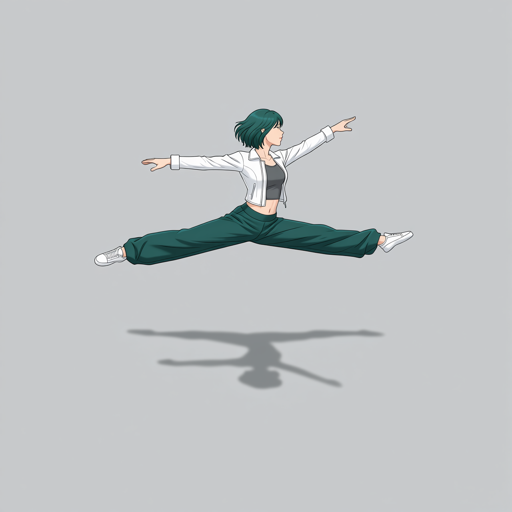 | 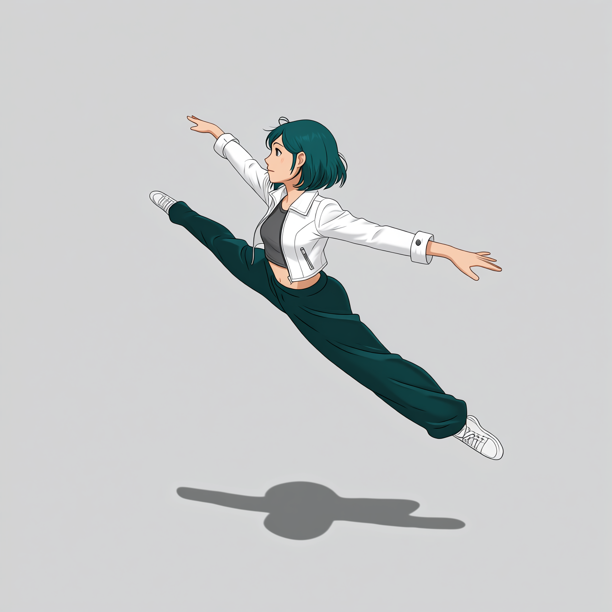 |  |

1280×1280, seed `62294`, 10 step, true CFG `4.0`에서 A·B·C는 포즈·얼굴 방향·헤어·재킷·이너·바지·신발을 유지했다. C는 거리 토큰 없는 그림자 포함 포즈에 이식한 Stage 2 착장을 입력으로 사용했다. 회색 바탕과 바닥 그림자는 중립화됐지만, 그림자의 지면 원근은 최종 합성의 접지감으로 판단하지 않는다.

[Studio DeLight 2509 실행 코드 보기](../../../assets/part-07/chapter-05/p7_5_4_qwen_edit_2509_studio_delight.py)

[Scene A DeLight 캐릭터 result.json — JSON — identity 이식 입력, trigger prompt와 2509 실행 조건 보기](/AiBook/assets/part-07/chapter-05/p7-5-4-qwen-2509-studio-delight-cutout-identity-v1-size-1280x1280-seed-62294-steps-10-result.json)

[Scene B DeLight 캐릭터 result.json — JSON — 캐릭터 입력, trigger prompt와 2509 실행 조건 보기](/AiBook/assets/part-07/chapter-05/p7-5-4-qwen-2509-studio-delight-character-b-size-1280x1280-seed-62294-steps-10-result.json)

[Scene C DeLight 캐릭터 result.json — JSON — Stage 2 착장 아이덴티 입력, trigger prompt와 2509 실행 조건 보기](/AiBook/assets/part-07/chapter-05/p7-5-4-qwen-2509-studio-delight-character-c-shadow-stage2-outfit-no-closeup-v3-size-1280x1280-seed-62294-steps-10-result.json)

### 카메라판에서 캐릭터를 제거해 배경판을 만든다

컷아웃에 캐릭터 identity를 이식한 뒤에는, 같은 카메라판에서 인물을 비운 배경판도 별도 자산으로 만든다. 이 배경판은 인물의 얼굴·착장 기준을 다시 넣지 않는다. Qwen Image Edit 2511에 카메라판 한 장만 넣고, 인물 자리만 주변 배경으로 메우며 장소의 주요 지형·식생·구도를 보존하도록 짧게 지시했다. 이 단계의 목적은 포즈를 만들거나 캐릭터를 보정하는 것이 아니라, 이후 합성에서 쓸 배경 입력을 한 장으로 고정하는 것이다.

| Scene A 캐릭터 제거 배경판 | Scene B 캐릭터 제거 배경판 | Scene C 캐릭터 제거 배경판 |
| --- | --- | --- |
|  |  |  |

두 실행은 모두 1280×1280, seed `62294`, 10 step, true CFG `4.0`이다. 인물은 사라졌지만, A의 하늘은 밝고 단순한 색면으로 바뀌었고 B의 초원 중심부도 원본보다 단순해졌다. 따라서 인물 제거와 원본 배경의 모든 색·질감을 픽셀 단위로 보존하는 일은 같은 요구가 아니다.

[카메라판 배경 생성 코드 보기](../../../assets/part-07/chapter-05/p7_5_4_qwen_edit_2511_extract_camera_a_background.py)

[카메라 A 배경판 result.json — JSON — 카메라 입력, 인물 제거 지시와 2511 실행 조건 보기](/AiBook/assets/part-07/chapter-05/p7-5-4-qwen-2511-camera-a-background-camera-a-v1-size-1280x1280-seed-62294-steps-10-result.json)

[카메라 B 배경판 result.json — JSON — 카메라 입력, 인물 제거 지시와 2511 실행 조건 보기](/AiBook/assets/part-07/chapter-05/p7-5-4-qwen-2511-camera-b-background-camera-b-v1-size-1280x1280-seed-62294-steps-10-result.json)

[카메라 C 배경판 result.json — JSON — 카메라 입력, 인물 제거 지시와 2511 실행 조건 보기](/AiBook/assets/part-07/chapter-05/p7-5-4-qwen-2511-camera-c-background-camera-c-v1-size-1280x1280-seed-62294-steps-10-result.json)

### 배경판에 Studio DeLight를 적용한다

바로 위 배경판을 Qwen Image Edit 2509의 Studio DeLight 입력으로 사용해 중립 광원 처리를 한 번 더 적용했다. 프롬프트는 모델 카드의 trigger prompt인 `Neutral uniform lighting Preserve identity and composition`만 사용한다. 인물이 없는 배경판으로 분리했으므로, 이 단계에서 바뀌는 대상은 인물 identity나 포즈가 아니라 하늘·바다·바위·풀의 조명과 색조다.

| Scene A DeLight 배경판 | Scene B DeLight 배경판 | Scene C DeLight 배경판 |
| --- | --- | --- |
|  |  |  |

1280×1280, seed `62294`, 10 step, true CFG `4.0`에서 하늘·바다는 더 균일하고 밝아졌고 바위·풀·해안의 배치는 남았다. 그러나 야외 장면의 하늘은 거의 흰색에 가까워졌다. 이 출력은 중립화가 적용되는지 확인하는 배경 후보이며, 해안의 원래 광원과 색감을 보존해야 하는 최종 배경으로 자동 채택하지 않는다.

[Studio DeLight 2509 실행 코드 보기](../../../assets/part-07/chapter-05/p7_5_4_qwen_edit_2509_studio_delight.py)

[Studio DeLight 배경판 result.json — JSON — 배경판 입력, trigger prompt와 2509 실행 조건 보기](/AiBook/assets/part-07/chapter-05/p7-5-4-qwen-2509-studio-delight-camera-a-background-v1-size-1280x1280-seed-62294-steps-10-result.json)

[Scene B DeLight 배경판 result.json — JSON — 배경판 입력, trigger prompt와 2509 실행 조건 보기](/AiBook/assets/part-07/chapter-05/p7-5-4-qwen-2509-studio-delight-background-b-size-1280x1280-seed-62294-steps-10-result.json)

[Scene C DeLight 배경판 result.json — JSON — 배경판 입력, trigger prompt와 2509 실행 조건 보기](/AiBook/assets/part-07/chapter-05/p7-5-4-qwen-2509-studio-delight-background-c-size-1280x1280-seed-62294-steps-10-result.json)

### 새 캐릭터 마스크는 보관하고, 통합은 다중 참조로 먼저 시도한다

DeLight 캐릭터의 팔과 다리는 원래 카메라 A의 마스크와 픽셀 단위로 일치하지 않는다. 그래서 Grounding DINO와 SAM 2.1로 **DeLight 캐릭터 자체**에서 새 마스크를 만들었다. 빨간 오버레이는 인물 외곽이 새 입력과 맞는지 확인하기 위한 것이며, 이 마스크는 알파 합성이나 그림자 보정이 꼭 필요할 때의 후속 입력으로 보관한다.

| DeLight 캐릭터 새 마스크 오버레이 |
| --- |
| 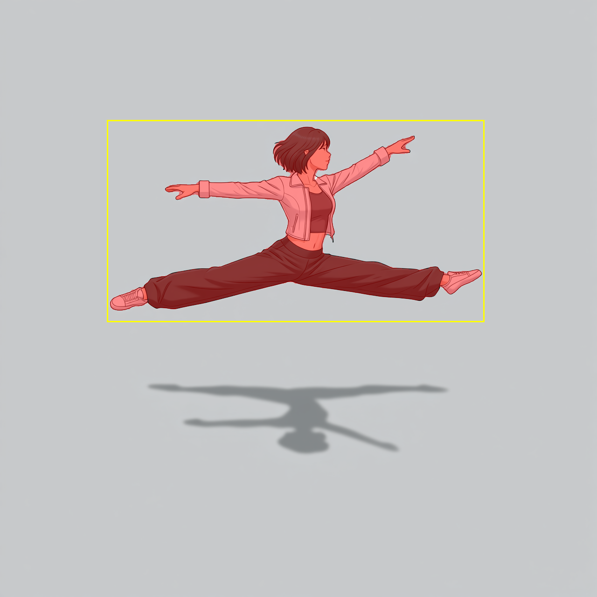 |

[DeLight 캐릭터 마스크 생성 코드 보기](../../../assets/part-07/chapter-05/p7_5_4_generate_person_mask.py)

[DeLight 캐릭터 마스크 result.json — JSON — 검출 상자, SAM2 마스크와 입력 해시 보기](/AiBook/assets/part-07/chapter-05/p7-5-4-sam2-person-mask-delight-cutout-identity-v1-result.json)

첫 통합에서는 이 마스크를 쓰지 않았다. Qwen Image Edit 2511의 다중 참조에 DeLight 배경판을 `Picture 1`, DeLight 캐릭터를 `Picture 2`로만 넣었다. 프롬프트도 배경은 Picture 1의 장소·구도, 인물은 Picture 2의 스플릿 점프·identity·착장을 각각 보존하라는 양성 지시로 한정했다. B·C 모두 Stage 2 착장을 가진 DeLight 캐릭터를 입력으로 썼다.

| Scene A 마스크 없는 DeLight 통합 | Scene B 마스크 없는 DeLight 통합 | Scene C 마스크 없는 DeLight 통합 |
| --- | --- | --- |
| 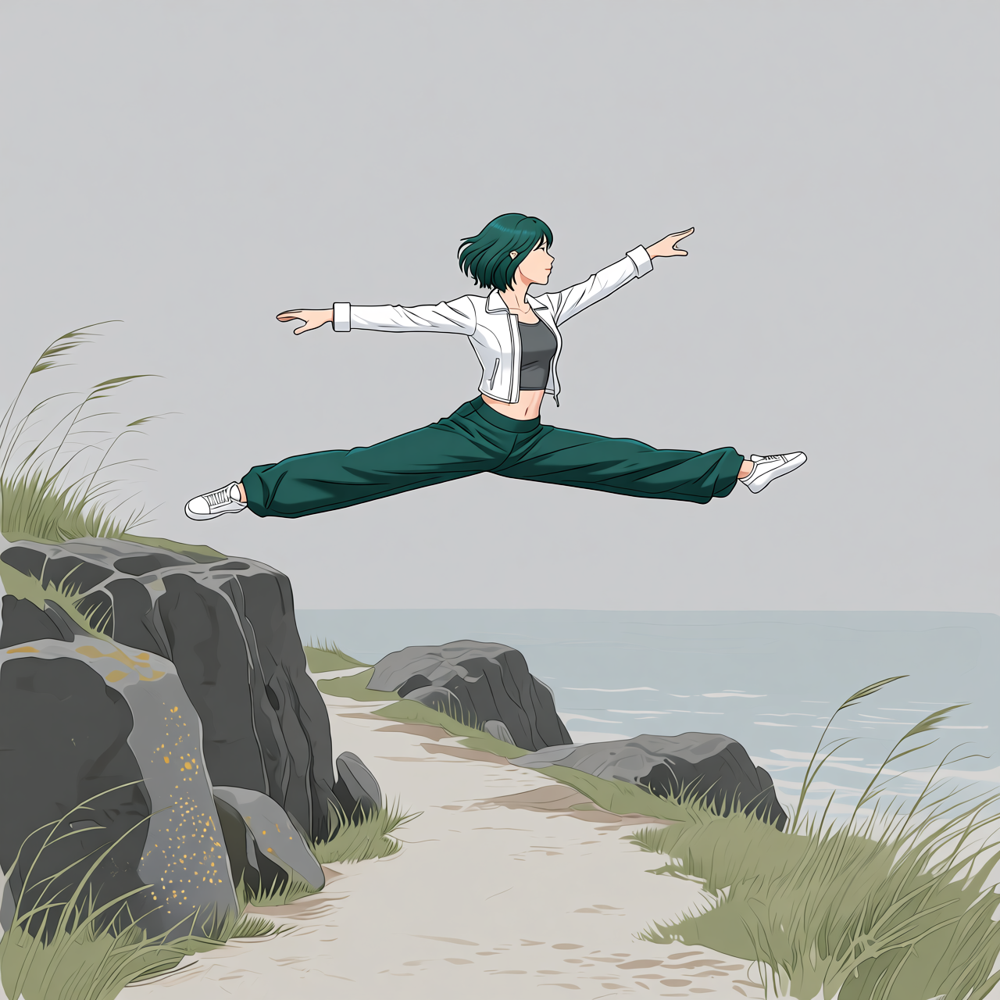 | 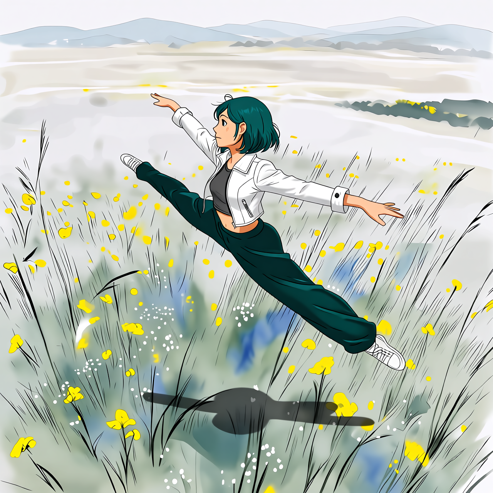 | 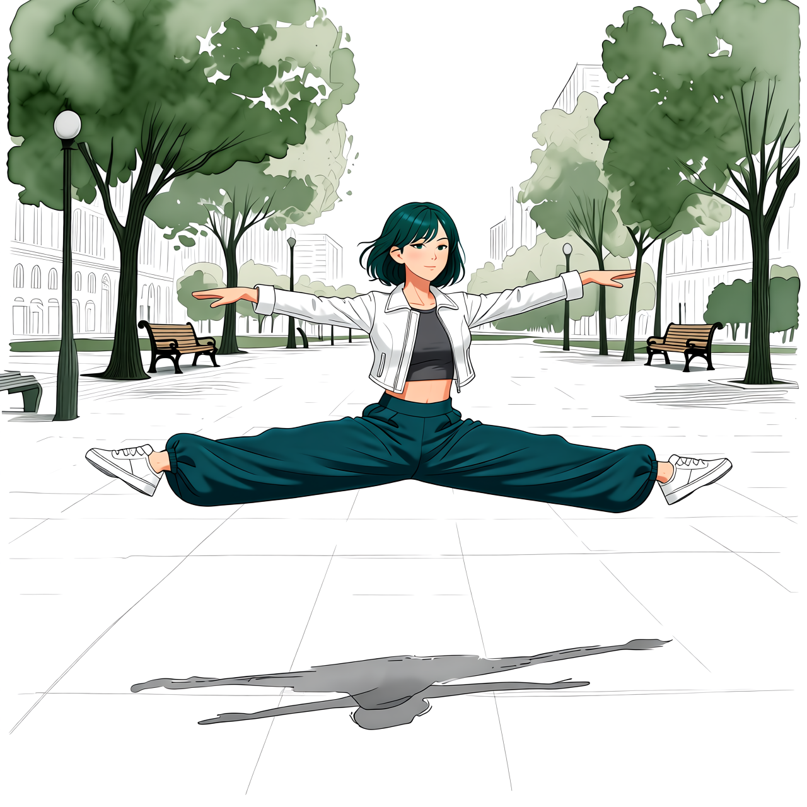 |

1280×1280, seed `62294`, 10 step, true CFG `4.0`에서 회색 컷아웃 배경은 남지 않고 각 장소와 인물 경계가 통합됐다. B는 꽃밭과 흰 재킷·청록 바지 캐릭터가 함께 남았고, C도 공원 배경에 흰 재킷·회색 이너·청록 바지가 함께 남았다. 즉 다중 참조 통합은 두 이미지의 역할을 따르며, `Picture 2`에 없는 착장을 새로 복원하지 않는다. 공중 인물의 지면 그림자는 새로 설계되지 않았으므로, 이 결과는 마스크 없는 다중 참조 합성의 관찰용 출력이며 접지 그림자 보정까지 끝난 최종 장면은 아니다.

[Qwen 2511 DeLight 다중 참조 통합 코드 보기](../../../assets/part-07/chapter-05/p7_5_4_qwen_edit_2511_composite_delight_multireference.py)

[Scene A DeLight 다중 참조 통합 result.json — JSON — Picture 1·Picture 2 입력 순서와 실행 조건 보기](/AiBook/assets/part-07/chapter-05/p7-5-4-qwen-2511-delight-multireference-composite-camera-a-v1-size-1280x1280-seed-62294-steps-10-result.json)

[Scene B DeLight 다중 참조 통합 result.json — JSON — 꽃밭 배경·B 캐릭터의 입력 순서와 실행 조건 보기](/AiBook/assets/part-07/chapter-05/p7-5-4-qwen-2511-delight-multireference-composite-scene-b-v1-size-1280x1280-seed-62294-steps-10-result.json)

[Scene C DeLight 다중 참조 통합 result.json — JSON — 공원 배경·C Stage 2 착장 캐릭터의 입력 순서와 실행 조건 보기](/AiBook/assets/part-07/chapter-05/p7-5-4-qwen-2511-delight-multireference-composite-scene-c-stage2-outfit-no-closeup-v2-size-1280x1280-seed-62294-steps-10-result.json)

### 통합 장면에 방향광을 다시 적용한다

DeLight는 캐릭터와 배경의 광원을 중립화했으므로, 통합 후에는 단일 이미지 리라이트로 장면의 광원 방향을 다시 정할 수 있다. 여기서는 `dx8152/Qwen-Image-Edit-2509-Relight` LoRA를 사용해 앞의 통합 이미지를 한 장만 입력하고, trigger `重新照明`과 `soft sunlight from the upper right`만 지시했다. 새 캐릭터 참조나 마스크는 이 단계에 넣지 않는다. [dx8152 Relight 모델 카드](https://huggingface.co/dx8152/Qwen-Image-Edit-2509-Relight){: target="_blank" rel="noopener noreferrer"}

| Scene A DeLight 통합 리라이트 |
| --- |
| 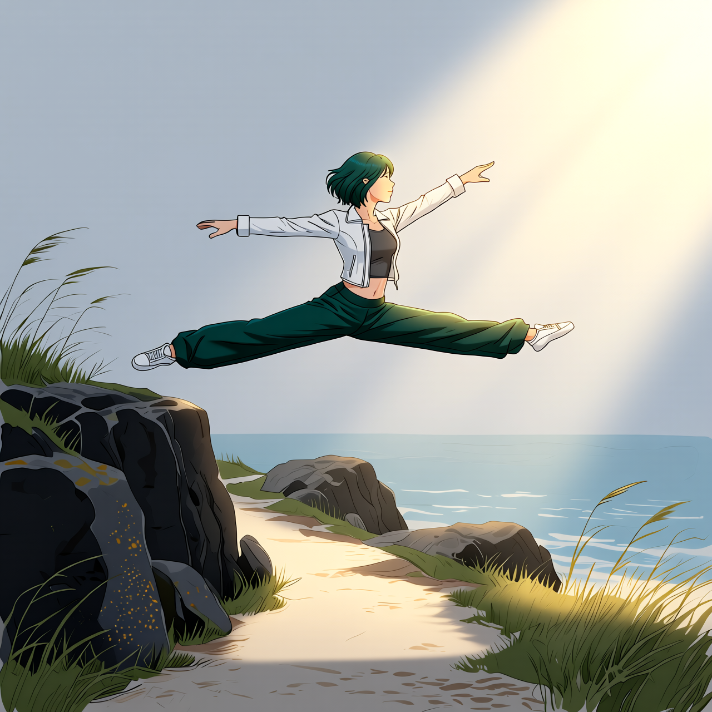 |

1280×1280, seed `62294`, 10 step, LoRA scale `1.0`, true CFG `4.0`에서 상단 우측은 따뜻하게 밝아지고 좌측 바위·풀은 더 어두워졌다. 인물의 포즈·착장과 해안 구도는 유지됐지만, 이 단일 이미지 리라이트가 공중 인물에 맞는 별도 접지 그림자를 새로 설계한 것은 아니다.

[Qwen 2509 Relight 실행 코드 보기](../../../assets/part-07/chapter-05/p7_5_4_qwen_edit_2509_relight.py)

[Scene A DeLight 통합 리라이트 result.json — JSON — 통합 입력, Relight trigger와 실행 조건 보기](/AiBook/assets/part-07/chapter-05/p7-5-4-qwen-2509-relight-camera-a-delight-multireference-v1-size-1280x1280-seed-62294-steps-10-result.json)

## 출처와 참고 자료

- [Qwen-Image 모델 카드](https://huggingface.co/Qwen/Qwen-Image){: target="_blank" rel="noopener noreferrer"}: 최초 T2I 장면 생성에 사용한 기반 모델의 공개 배포 정보입니다.
- [Qwen-Image-Edit-2511 모델 카드](https://huggingface.co/Qwen/Qwen-Image-Edit-2511){: target="_blank" rel="noopener noreferrer"}: 카메라판 편집, 그림자 포함 포즈·캐릭터 다중 참조 이식, 배경·캐릭터 통합에 사용한 공식 파이프라인의 입력 형식과 사용 예제를 확인합니다.
- [Qwen-Image-Edit-2511 Multiple-Angles LoRA 모델 카드](https://huggingface.co/fal/Qwen-Image-Edit-2511-Multiple-Angles-LoRA){: target="_blank" rel="noopener noreferrer"}: 카메라 방위·높이·거리 변환의 `<sks> [azimuth] [elevation] [distance]` 입력 형식을 확인합니다.
- [Grounding DINO Tiny 모델 카드](https://huggingface.co/IDEA-Research/grounding-dino-tiny){: target="_blank" rel="noopener noreferrer"} · [SAM 2 공식 저장소](https://github.com/facebookresearch/sam2){: target="_blank" rel="noopener noreferrer"}: 인물 탐색 상자와 정밀 마스크를 만드는 두 단계의 근거입니다.
- [LaMa ONNX 배포](https://huggingface.co/g-ronimo/lama){: target="_blank" rel="noopener noreferrer"}: 마스크 영역을 메워 빈 배경판을 만드는 도구의 배포 정보입니다.
- [Qwen-Image-Edit-2509 모델 카드](https://huggingface.co/Qwen/Qwen-Image-Edit-2509){: target="_blank" rel="noopener noreferrer"} · [Studio DeLight 모델 카드](https://huggingface.co/prithivMLmods/QIE-2511-Studio-DeLight){: target="_blank" rel="noopener noreferrer"} · [Relight 모델 카드](https://huggingface.co/dx8152/Qwen-Image-Edit-2509-Relight){: target="_blank" rel="noopener noreferrer"}: 배경·캐릭터의 중립 광원과 통합 장면의 방향광을 확인한 편집 경로입니다.

모델 카드의 일반 기능 설명과 별도로, 이 절에서 실제로 사용한 입력 순서·파일 해시·seed·step·출력 경로는 각 `result.json`을 기준으로 확인합니다.
