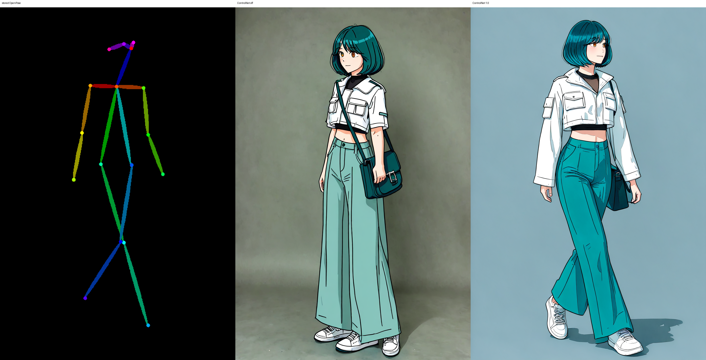
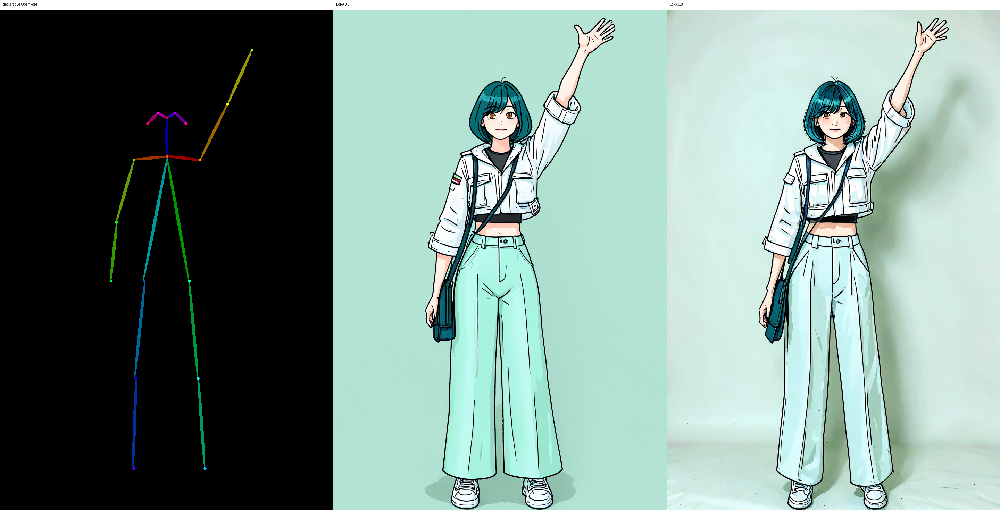
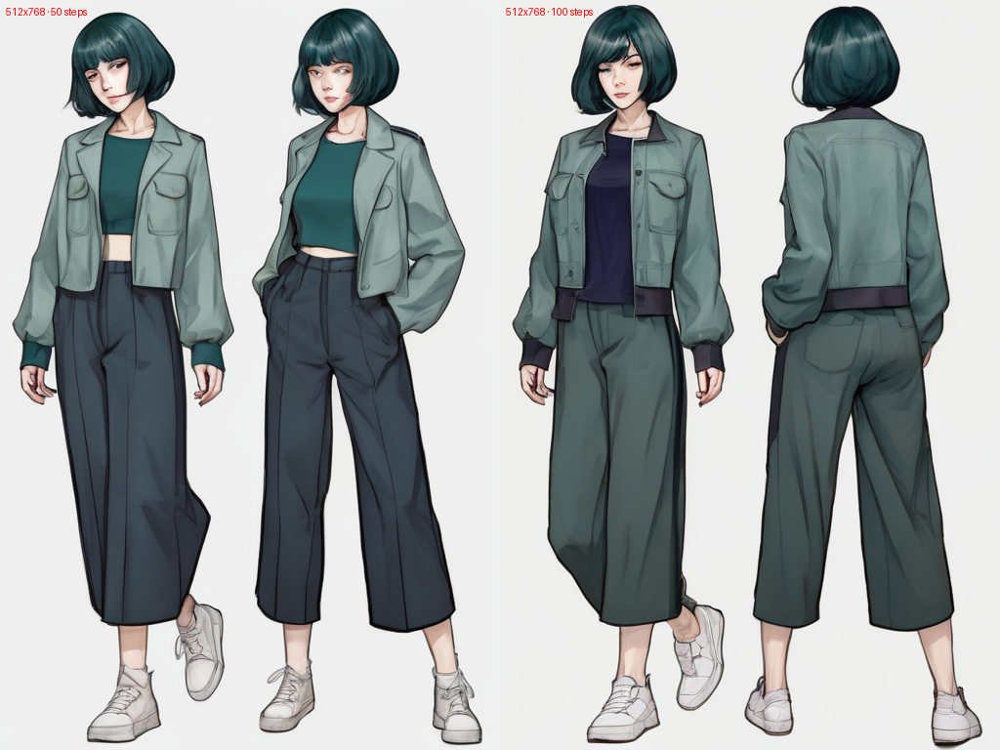
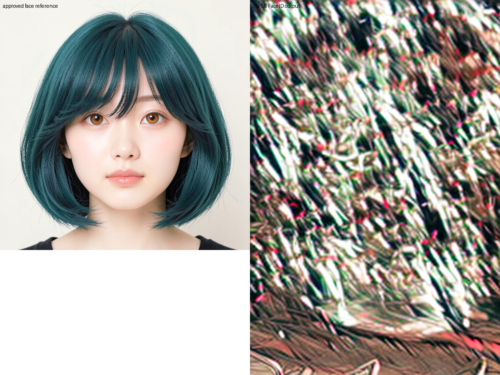
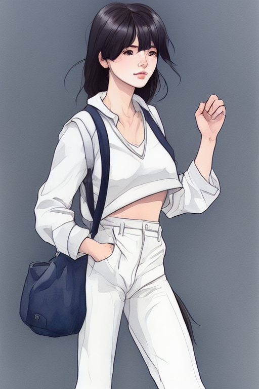
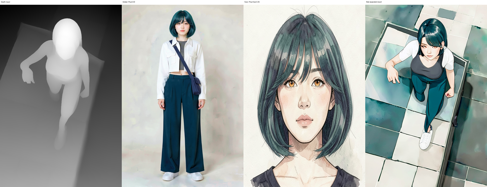
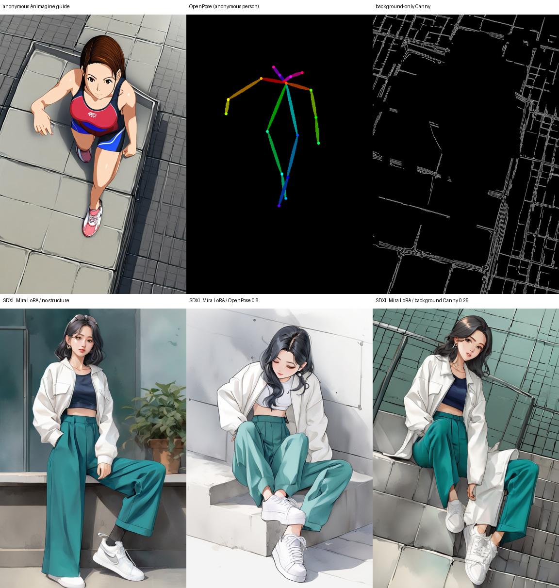

# P7-5.4 화풍·연속성 보정: 컷신의 구조와 디테일을 분리해 고치기

> Section ID: `P7-5.4`
> Version: `v2026.08.15`

이 절의 질문은 단순합니다. **카메라와 동작이 바뀌어도 같은 캐릭터를 같은 복장으로 그릴 수 있는가?** 이를 한 장의 보기 좋은 이미지가 아니라, 구조·얼굴·복장·화풍의 네 계약으로 나누어 검수했습니다.

## 먼저 확인한 기준: 수평 시점의 FLUX

FLUX는 수평에 가까운 전신·정면·쿼터 시점에서는 얼굴과 완성 착장을 비교적 안정적으로 재현했습니다. 청록 단발, 호박색 눈, 흰 크롭 재킷, 청록 와이드 바지, 흰 운동화, 남색 가방의 관계를 한 컷 안에 유지할 수 있었습니다.

문제는 카메라가 크게 위로 올라갈 때였습니다. 고각도에서는 얼굴, 재킷 레이어, 와이드 바지 실루엣, 가방의 앞뒤 가림이 함께 흔들렸습니다. 따라서 이후의 실험은 수평 시점의 결과를 더 다듬는 일이 아니라, **고각도에서도 이 네 계약을 함께 유지하는 방법을 찾는 일**이었습니다.

## 보조 도구가 넘지 못한 경계

여러 도구는 각각 일부 문제를 풀었습니다. 하지만 한 도구가 해결한 항목을 캐릭터 전체의 재현으로 해석하지 않았습니다.

| 수단 | 확인한 역할 | 남은 한계 |
| --- | --- | --- |
| character LoRA 학습 | 사람 승인 54장으로 화풍, 정면 복장 색, 일부 동작 후보를 더 일관되게 만들었다. | 고각도에서 새로 드러나는 재킷 레이어·와이드 바지·가방 가림 관계는 재현하지 못했다. |
| OpenPose | 팔·다리·접지처럼 복잡한 신체 동작을 전달하는 guide 역할을 했다. character 조건과 함께 쓴 최근 후보에서는 Mira의 단발·눈·재킷·바지·가방도 함께 남았다. | OpenPose만으로 얼굴·복장·소품·3D 회전을 보장하지는 않는다. |
| depth·Canny edge | 카메라의 큰 시점·원근·실루엣을 만들 수 있는 가능성을 보였다. 최근 Canny 후보는 기준의 사선 보행 frame과 얼굴·머리색·바지·가방을 함께 남겼다. | 흰 재킷 레이어처럼 세부 복장은 여전히 빠질 수 있어, 고각도에서 전 계약을 신뢰할 수는 없었다. |
| FaceID·FacePlus | 얼굴 조건을 추가하는 경로를 비교했다. FacePlus는 수평 시점의 얼굴 단서를 일부 보조했다. | FaceID는 일러스트 기준과 얼굴 embedding의 차이로 제작 gate를 통과하지 못했고, FacePlus도 고각도 캐릭터 재현을 보장하지 못했다. |
| IP-Adapter | 얼굴·전신·완성 착장 reference를 이미지 조건으로 전달했다. | 참조 수를 늘리거나 구조 조건과 결합해도 얼굴·가방·복장 레이어가 함께 안정화되지 않았고, 일부 조건에서는 복장 재현성이 낮아졌다. |
| mask inpaint·VTON | 수동 mask, 일반 inpaint, CatVTON을 비교해 국소 색·경계·기존 착장의 교체를 시험했다. | CatVTON은 수평 기준의 재킷 레이어를 부분적으로 전달했지만, 고각도에서 새로 보이거나 가려지는 신체와 의상 객체를 전신 단위로 재구성하지 못했다. |

특히 mask 기반 보정과 VTON은 FLUX의 수평 시점 성능이 준수했기 때문에 검토했습니다. 이미 성립한 인물성을 보존한 채 고각도 컷의 일부를 고칠 수 있는지 확인하려던 가설입니다. 그러나 새 카메라는 보이는 팔·몸통·다리와 의상 레이어의 관계 자체를 바꾸므로, 국소 픽셀 보존만으로는 충분하지 않았습니다.

아래 비교는 최근 산출물로 갱신했습니다. 왼쪽 OpenPose는 character 조건을 함께 두면 관절 map을 따르면서 Mira의 단발·호박색 눈·재킷·와이드 바지·가방을 남긴 사례입니다. 가운데 Canny는 사선 보행 frame과 얼굴·바지·가방을 남겼지만 흰 재킷이 빠진 사례입니다. 오른쪽 DiffEdit는 자동 mask가 머리와 신발까지 넓어져 원하는 재킷만 고치지 못한 사례입니다.

| OpenPose: 동작 guide | Canny: 카메라 guide | DiffEdit: 자동 mask |
| --- | --- | --- |
|  |  |  |
| 동작 guide와 character 조건을 결합하면 부분 통과 | camera·silhouette은 부분 통과, 복장 계약은 미통과 | 편집 범위와 결과가 모두 의도에서 벗어남 |

### 저장한 전신 OpenPose map으로 다시 확인한 범위

detector를 매번 다시 실행하지 않도록 P7-5.2의 승인 전신 기준에서 정면·우측 쿼터·좌우 측면·후면의 skeleton map 다섯 장을 저장했습니다. [정면](../../../assets/part-07/chapter-05/p7-5-4-openpose-fullbody-front-reference.png) · [우측 쿼터](../../../assets/part-07/chapter-05/p7-5-4-openpose-fullbody-front-quarter-right-reference.png) · [좌측 측면](../../../assets/part-07/chapter-05/p7-5-4-openpose-fullbody-profile-left-reference.png) · [우측 측면](../../../assets/part-07/chapter-05/p7-5-4-openpose-fullbody-profile-right-reference.png) · [후면](../../../assets/part-07/chapter-05/p7-5-4-openpose-fullbody-rear-reference.png)입니다.

네 비교는 모두 54컷 Animagine character LoRA, Animagine XL, SDXL OpenPose ControlNet, `960×1440`, 30 step을 사용하며, image reference·Canny·inpaint·VTON은 넣지 않았습니다.

| 실험 | 비교한 변수 | 사람 검수 결과 |
| --- | --- | --- |
| 저장 우측 쿼터 map | ControlNet `0.0/1.0`, seed `62296`, LoRA `0.6` | `1.0`은 넓어진 다리·발의 2D 배치를 더 잘 따르면서 청록 단발, 호박색 눈, 흰 재킷, 와이드 바지, 가방을 함께 남겼다. |
| 선언형 오른팔 올리기 map | ControlNet `0.0/1.0`, seed `62301`, LoRA `0.6` | `1.0`에서 오른팔을 올린 동작과 캐릭터·화풍·복장 계약을 함께 유지했다. 바지색·가방 세부는 남은 검수 항목이다. |
| 선언형 오른팔 올리기 map | LoRA `0.6/0.8`, ControlNet `1.0`, seed `62301` | 두 후보 모두 동작·재킷·가방은 남았지만 `0.8`은 와이드 바지를 거의 흰색으로 끌어가 색 계약이 더 나빠졌다. 기준 scale은 `0.6`으로 유지했다. |
| 선언형 오른팔 올리기 map | eye-level/high-angle 문구, seed `62302`, LoRA `0.6`, ControlNet `1.0` | 두 후보가 복장은 유지했지만 high-angle도 거의 정면 전신에 머물렀다. OpenPose와 camera 문구만으로 고각도 원근은 만들지 못했다. |

| 선언형 동작: ControlNet off/on | 선언형 동작: LoRA scale `0.6/0.8` |
| --- | --- |
|  |  |
| `1.0`에서 팔의 2D 구조가 map에 맞춰짐 | scale 상승은 바지 색 이탈의 해법이 아님 |

| 선언형 동작: 카메라 문구 비교 |
| --- |
|  |
| 고각도 문구만으로는 위에서 내려다보는 전신 원근을 만들지 못함 |

각 조건의 원본 실행 기록도 [저장 우측 쿼터](../../../assets/part-07/chapter-05/p7-5-4-openpose-lora-experiments/static-quarter-right-report.json), [선언형 동작 ControlNet](../../../assets/part-07/chapter-05/p7-5-4-openpose-lora-experiments/declarative-reach-up-controlnet-ab-report.json), [LoRA scale](../../../assets/part-07/chapter-05/p7-5-4-openpose-lora-experiments/declarative-reach-up-lora-scale-ab-report.json), [카메라 문구](../../../assets/part-07/chapter-05/p7-5-4-openpose-lora-experiments/declarative-reach-up-camera-ab-report.json)에서 확인할 수 있습니다.

따라서 이 묶음은 OpenPose가 **동작의 2D 배치를 재현 가능하게 전달하고, 잘 학습된 LoRA가 일부 캐릭터·복장 계약을 보조한다**는 결과입니다. 다섯 방향 전체나 머리·흉곽의 정확한 회전, 가방의 앞뒤 가림까지 검증한 결과는 아니므로, camera·3D pose 일반화의 근거로 사용하지 않습니다.

### SDXL Base 얼굴 기준선과 전신 OpenPose probe

먼저 reference·ControlNet·LoRA를 모두 제외한 SDXL Base 1.0 단독으로 정상적인 정면 얼굴이 형성되는지 확인했습니다. `1024×1024`, 50 step, CFG `5.0`, seed `62295`에서 청록 단발·호박색 눈·수채화 웹툰이라는 텍스트만 주었습니다. 이 이미지는 Mira identity의 승인 기준이 아니라, **base model이 50 step에서 얼굴 자체를 만들 수 있는가**를 분리한 기준선입니다.


[실행 기록](../../../assets/part-07/chapter-05/p7-5-4-sdxl-base-face-50step/run.json)은 prompt·seed·해상도와 조건 제외 범위를 보관합니다. 따라서 이후의 전신 결과에서 얼굴 또는 정체성이 흔들릴 때, 이를 base model이 얼굴을 전혀 형성하지 못한 문제로 바로 해석하지 않습니다.

그 다음 전신 probe에서는 “얼굴이 무너진 원인”을 OpenPose 하나로 단정하지 않기 위해 FaceID와 전신 착장 image adapter를 제외하고 Plus Face `0.15`, character LoRA `0.30`, seed `62295`, CFG `5.0`을 고정했습니다. `960×1440`, 50 step은 전신 구조와 얼굴이 함께 형성되는지 확인하기 위해 선택한 조건입니다.


OpenPose off에서는 얼굴 윤곽과 전신은 형성됐지만 승인 재킷·바지·가방 계약이 다릅니다. on에서는 map의 다리·몸통 배치를 더 따르지만, 고양이 귀·머리 길이·복장처럼 identity와 outfit도 다시 이탈했습니다.


이 비교는 Base 단독 50 step 얼굴 기준선과 달리, 전신·조건 결합에서는 그 예산만으로 캐릭터 고정이 해결되지 않았음을 보입니다. OpenPose를 켜면 skeleton의 2D 배치는 더 강해지지만, 이 조건에서는 머리·얼굴과 승인 복장으로부터 독립적으로 끌려가는 현상도 나타났습니다. 따라서 이 결과를 OpenPose의 일반적 실패로 확대하지 않고, `SDXL + 약한 FacePlus + character LoRA` 조합에서의 identity·outfit 미통과 비교군으로만 사용합니다.

저해상도 `512×768`의 50/100 step 결과도 별도로 보관했습니다. step을 두 배로 늘려도 얼굴·복장이 자동으로 승인 기준에 수렴하지 않았습니다. 즉, step은 구조와 얼굴 형성의 필요 조건일 수 있지만, reference 역할 분리와 복장·소품 가림 관계를 대신하지는 않습니다.



재현에 필요한 조건은 [OpenPose off 실행 기록](../../../assets/part-07/chapter-05/p7-5-4-sdxl-safe-face-openpose-fullbody/without-openpose-960x1440-run.json)과 [OpenPose on 실행 기록](../../../assets/part-07/chapter-05/p7-5-4-sdxl-safe-face-openpose-fullbody/with-openpose-960x1440-run.json)에 보관했습니다.

나머지 보조 실험도 산출물로 확인했습니다. LoRA on은 off보다 화풍·착장을 끌어오지만 원래 복장과 동작을 정확히 고정하지는 않습니다. FaceID probe는 일러스트 얼굴과 embedding 조건의 차이가 심하게 드러난 사례입니다. CatVTON은 수평 기준의 재킷 레이어를 가장 가깝게 전달했지만 이 결과만으로 고각도 일반화를 주장할 수는 없습니다.

| character LoRA on/off | FaceID probe | FacePlus + FaceID |
| --- | --- | --- |
|  |  |  |
| LoRA on에서 화풍·착장 경향은 생기지만 인물 계약 전체는 미통과 | FaceID 단독 조건은 제작 gate 미통과 | 얼굴 단서는 생겨도 전체 캐릭터 계약은 미통과 |

### FaceID와 FullFace 결합의 A/B

같은 기준 얼굴을 FaceID 단독으로 준 후보와 FaceID·FullFace 결합 후보도 비교했습니다. FaceID 단독 실행은 seed `62294`, 24 step, FaceID weight `0.8`, FaceID LoRA strength `0.5`로 기록되어 있습니다. 전신·가방은 남았지만 검은 장발과 흰 바지로 바뀌어 Mira의 얼굴·머리·복장 계약을 잃었습니다. FullFace를 결합한 후보는 청록 단발과 호박색 눈 단서를 더 많이 남겼지만, 화면이 흉상에 가까워지고 재킷·바지·전신 동작 계약이 사라졌습니다.

| FaceID 단독 | FaceID + FullFace |
| --- | --- |
|  |  |
| 전신 frame은 부분 유지, identity·복장 미통과 | 얼굴 단서는 부분 회복, 전신·복장 미통과 |

[FaceID 단독 실행 기록](../../../assets/part-07/chapter-05/p7-5-4-faceid-fullface-experiment/faceid-only-report.json)은 기준 얼굴, seed·step·weight와 prompt를 보관합니다. 이 A/B는 얼굴 조건을 강하게 만드는 것만으로는 전신 캐릭터 재현을 보장하지 않는다는 비교군입니다.

### FitDiT: 고각도 상반신 좁은 mask 착장 교체

FitDiT에는 고각도 원본의 카메라·자세·하체를 고정하고, 상반신만 감싼 좁은 수동 mask와 전면 완성 착장을 주었습니다. `768×1024`, 30 step, guidance `2.5`, seed `62431`에서 약 `33.55초`가 걸렸습니다. 결과는 원본의 고각도와 하체를 대체로 남겼지만, 재킷은 어깨의 회색 덩어리와 짧은 흰 앞면으로 바뀌고 가방 strap·가방 본체도 사라졌습니다.


따라서 이 결과는 mask 경계를 좁혀도 고각도에서 새로 보이는 어깨·재킷·가방의 3D 관계를 완성 착장 reference대로 복원하지 못한다는 사례입니다. FitDiT는 이 조건에서 고각도 컷의 전신 착장 보정 도구로는 미통과이며, 실행 조건과 입력·후보는 [기록 JSON](../../../assets/part-07/chapter-05/p7-5-4-fitdit-high-angle-upperbody-complete-outfit-tight-mask/run.json) 및 같은 자산 폴더에서 확인할 수 있습니다.

### SDXL depth + 역할 분리 adapter

고각도 익명 depth scaffold에 전신 완성 착장을 global 조건, 얼굴 기준을 face 조건으로 나누고 character LoRA와 outfit LoRA를 함께 연결했습니다. SDXL Base 1.0, `768×1152`, 50 step, seed `62431`, depth ControlNet `0.8`, global IP-Adapter `0.30`, face IP-Adapter `0.35`, character LoRA `0.6`, outfit LoRA `0.3`의 조건입니다.



결과는 depth가 준 고각도·타일 바닥 원근과 청록 단발·호박색 눈 단서를 비교적 유지했습니다. 그러나 기준의 흰 크롭 재킷은 짧은 흰 상의로 바뀌고 가방·strap도 남지 않았습니다. 즉, 구조·얼굴·전신 착장을 adapter 역할로 나누는 방식은 일부 조건의 충돌을 줄였지만, 고각도에서 복장 객체와 가림 관계를 재현하는 제작 gate는 통과하지 못했습니다. [실행 기록](../../../assets/part-07/chapter-05/p7-5-4-sdxl-depth-role-separated/run.json)은 adapter scale·seed·해상도를 보관합니다.

| CatVTON 전면 재킷 |
| --- |
|  |
| 수평 기준 재킷 레이어는 부분 통과, 고각도 전신 재구성은 별도 실패 |

## LoRA용 54컷은 별도 데이터 구성 실험이었다

character LoRA의 결과를 해석하려면, 학습 전 **무엇을 어떤 비율로 넣었는지**도 확인해야 합니다. 이 실험은 P7-5.2에서 사람 승인한 identity anchor 18장(얼굴·기본 전신·리파인 전신의 여섯 방향)과, P7-5.4에서 자세를 먼저 만들고 화풍을 두 번째 단계에서 입힌 사람 승인 동작 36장을 합쳐 54컷을 구성했습니다.

동작 36장은 서기·보행·쪼그리기·점프·스포츠 동작처럼 전신 변화가 큰 사례를 포함합니다. 1단계는 포즈·비례·의상 실루엣을 만들고, 2단계는 같은 인물에 절제된 웹툰 수채화 화풍을 적용한 뒤 각각 review JSON으로 승인 여부를 남겼습니다. 이 데이터 구성은 LoRA가 화풍과 수평 시점의 복장을 얼마나 보조하는지 확인하기 위한 실험 입력입니다. 고각도·새 동작·가림 관계의 자동 일반화를 증명하거나, P7-5.3 컷에 자동 적용하는 승인 자산은 아닙니다.

[36장 1단계 동작 검수 시트](../../../assets/part-07/chapter-05/p7-5-4-character-lora-54/stage1-actions-review-contact-sheet.png)를 통해 포즈 다양성을 확인할 수 있습니다. 아래 manifest에는 54개 입력의 파일 경로, SHA-256, caption, view·pose 분류와 사람 승인 출처를 기록했습니다. 36개 동작의 1·2단계 PNG와 review JSON은 `p7-5-4-character-lora-54/actions/`에 모았습니다.

<details id="character-lora-54-dataset" class="aibook-lazy-source" data-source="../../../../assets/part-07/chapter-05/p7-5-4-character-lora-54/dataset-manifest.json" data-language="json">
<summary>54컷 character LoRA 데이터셋 manifest 보기</summary>
<div class="aibook-lazy-source__body">펼치면 identity 18장과 사람 승인 동작 36장의 파일·caption·hash·분류를 불러옵니다.</div>
</details>

<details id="character-lora-54-preparation" class="aibook-lazy-source" data-source="../../../../assets/part-07/chapter-05/p7_5_4_prepare_character_lora_action_dataset.py" data-language="python">
<summary>54컷 데이터셋을 로컬 학습 디렉터리로 준비하는 코드 보기</summary>
<div class="aibook-lazy-source__body">펼치면 승인 record를 검증하고 PNG symlink·caption·manifest를 만드는 코드를 불러옵니다.</div>
</details>

## 고각도 구도와 캐릭터를 분리한다

고각도 스토리보드 자체가 병목은 아니었습니다. 문제는 FLUX, SDXL, Animagine이 고각도 스토리보드 안에서 Mira의 얼굴·복장·소품을 함께 재현하지 못한 점입니다. 그래서 캐릭터 정보가 없는 익명 인물로 고각도 보행 guide를 만들었습니다. 여기서 Animagine은 최종 캐릭터 생성기가 아니라, 지붕·원근·보행 배치만 가진 구조용 초안입니다.


이렇게 하면 “고각도 구도가 있는가”와 “그 구도 안에서 Mira를 재현하는가”를 분리할 수 있습니다. FLUX·SDXL·Animagine의 보조 실험은 고각도 구도에 캐릭터를 재현하는 두 번째 문제를 해결하지 못했습니다.

### 익명 고각도 guide를 SDXL Mira 조건으로 전이한 비교

익명 guide의 인물 RGB·얼굴·복장은 모두 버리고, 그로부터 만든 OpenPose와 **인물을 제외한 배경 Canny**만 SDXL에 전달했습니다. 같은 SDXL Base 1.0과 character LoRA `0.6`, seed `62431`, 50 step, `768×1152`에서 구조 조건을 하나씩 켜서, 익명 인물의 외형이 그대로 복사되지 않도록 설계한 비교입니다.



구조 조건이 없을 때는 Mira와 비슷한 색·재킷 단서가 나타나도 high-angle 구도가 사라져 camera gate를 통과하지 못했습니다. OpenPose만 켠 후보는 위쪽 카메라의 단서를 일부 받았지만, 달리는 guide가 앉거나 쪼그린 자세로 바뀌어 action gate를 잃었습니다. 배경 Canny만 켠 후보는 바닥·벽의 기울기는 남겼지만, 인물에는 구조 조건이 없어 다리 실루엣이 중복되었습니다. OpenPose와 배경 Canny를 함께 쓰는 조건은 `768×1152`와 `512×768` 모두 현재 8 GB sequential-offload Diffusers 경로에서 두 ControlNet이 종료되어 후보를 만들지 못했습니다.

따라서 이 실험은 **익명 guide에서 사람 외곽을 배제한 배경 Canny를 추출하고, pose와 camera 입력을 분리하는 방법** 자체는 확인한 체크포인트입니다. 반면 이 SDXL 경로는 고각도·달리기 동작·Mira의 얼굴·복장을 함께 재현하는 제작 도구로는 미통과입니다. [사람 검수 기록](../../../assets/part-07/chapter-05/p7-5-4-sdxl-anonymous-high-angle-transfer/review.json)과 [실행 조건](../../../assets/part-07/chapter-05/p7-5-4-sdxl-anonymous-high-angle-transfer/report.json)은 같은 자산 폴더에 보관했습니다.

보조 실험의 노드 구성은 아래와 같습니다. OpenPose와 depth·Canny는 구조 조건 파이프라인, FaceID·FacePlus·IP-Adapter·LoRA는 캐릭터 조건 파이프라인, mask·VTON은 생성 뒤의 국소 복장 보정 파이프라인으로 분리했습니다. 이 도식은 실험 도구가 연결된 구조만 보여 주며, 도구별 통과·미통과 해석은 앞 표와 비교 이미지에서 확인합니다.

```mermaid
--8<-- "assets/part-07/chapter-05/p7-5-4-supporting-pipeline-ko.mmd"
```

## 세 입력을 역할별로 나눈 Qwen 편집

[Qwen-Image-Edit-2509](https://github.com/QwenLM/Qwen-Image/blob/main/Qwen-Image-Edit-2509.md){: target="_blank" rel="noopener noreferrer" }은 1–3장의 입력 이미지를 함께 받을 수 있습니다. 8 GB 환경에서는 [Nunchaku의 Qwen 편집 예제](https://github.com/nunchaku-ai/nunchaku/blob/main/examples/v1/qwen-image-edit-2509.py){: target="_blank" rel="noopener noreferrer" }를 따라 FP4 r128과 per-layer CPU offload를 적용했습니다. `768×1152`, 40 step에서 GPU 사용량 약 `3.5–3.7 GiB`로 실행했으며, 한 장당 약 16분 32초가 걸렸습니다.

처음에는 고각도 guide와 전신 인물 참조만 넣었습니다. 이어 세 입력을 넣되 복장 조건을 충분히 분리하지 않은 경우도 비교했습니다.

| 2입력: 착장·가방 누락 | 3입력: 신발·바지 드리프트 |
| --- | --- |
|  |  |
| 고각도·얼굴은 남았지만 재킷·가방·strap이 없음 | 재킷·가방은 돌아왔지만 흰 운동화·와이드 바지 계약이 깨짐 |

통과 경로에서는 각 입력의 역할을 고정했습니다.

| 입력 | 맡긴 정보 |
| --- | --- |
| image 1 | 지붕, 고각도 카메라, 보행 배치 |
| image 2 | 정면 얼굴 identity |
| image 3 | 재킷·바지·신발·가방을 포함한 완성 착장 |

prompt는 이 역할을 중복해 설명하지 않고, 청록 턱선 단발·양쪽 호박색 눈·흰 크롭 재킷·청록 와이드 바지·흰 운동화·남색 crossbody bag과 재킷 바깥 strap만 짧게 확인했습니다.

| seed `62294` | seed `62295` |
| --- | --- |
|  |  |
| 고각도·보행·얼굴·착장 계약 통과 | 같은 입력 역할에서 교차 seed 통과 |

두 seed 모두 고각도 투영, 얼굴, 복장, 가방과 재킷 바깥 strap을 함께 유지했습니다. 따라서 **구조용 guide로 카메라·행동·배경을 정하고, 얼굴과 완성 착장을 역할별 reference로 분리하면 8 GB에서도 기본적인 컷신 구성과 캐릭터 재현이 가능하다**는 지점을 확인했습니다.

이 결과는 고정한 보행 guide의 범위에만 적용합니다. 다른 pose·다른 guide·후면·강한 가림은 같은 세 역할을 유지해 다시 생성하고 사람 검수를 거쳐야 합니다. 또한 이 두 결과는 P7-5.4의 승인 실험 자산이며, P7-5.3 스토리보드를 자동으로 교체하거나 LoRA 학습 데이터로 자동 승격하지 않습니다.

## 컷신을 승인하는 기준

| 계약 | 확인할 질문 |
| --- | --- |
| structure | 카메라, 인체 동작, 거리와 가림이 장면 의도에 맞는가? |
| identity | 얼굴과 신체 비율이 같은 캐릭터로 읽히는가? |
| outfit | 재킷·상의·바지·신발·가방의 형태와 레이어가 유지됐는가? |
| style | 승인한 선화·색·질감의 범위 안에 있는가? |

네 계약 중 하나라도 실패하면 국소 inpaint로 덮지 않고, 해당 계약을 맡은 입력 또는 생성 단계를 다시 검토합니다.

## 출처와 참고 자료

- Qwen Team, [Qwen-Image-Edit-2509](https://github.com/QwenLM/Qwen-Image/blob/main/Qwen-Image-Edit-2509.md){: target="_blank" rel="noopener noreferrer" }, 확인일: 2026-08-15. 1–3 입력 이미지 편집 범위를 확인했다.
- Nunchaku, [Qwen-Image-Edit-2509 실행 예제](https://github.com/nunchaku-ai/nunchaku/blob/main/examples/v1/qwen-image-edit-2509.py){: target="_blank" rel="noopener noreferrer" }, 확인일: 2026-08-15. FP4 transformer와 offload 기반 로컬 실행 경로를 확인했다.
- Zhang et al., [ControlNet](https://github.com/lllyasviel/ControlNet){: target="_blank" rel="noopener noreferrer" }, 확인일: 2026-08-15. 구조 조건의 기본 역할을 참고했다.
- Tencent AI Lab, [IP-Adapter](https://github.com/tencent-ailab/IP-Adapter){: target="_blank" rel="noopener noreferrer" }, 확인일: 2026-08-15. 이미지 참조 조건의 기본 역할을 참고했다.
- Hugging Face, [Diffusers inpainting guide](https://huggingface.co/docs/diffusers/en/using-diffusers/inpaint){: target="_blank" rel="noopener noreferrer" }, 확인일: 2026-08-15. mask 기반 국소 편집의 동작 범위를 참고했다.
