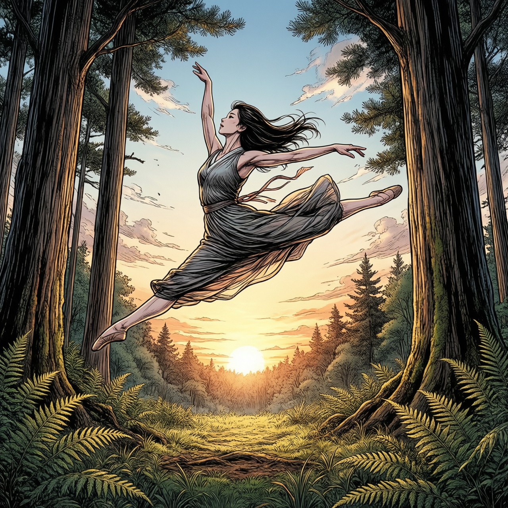
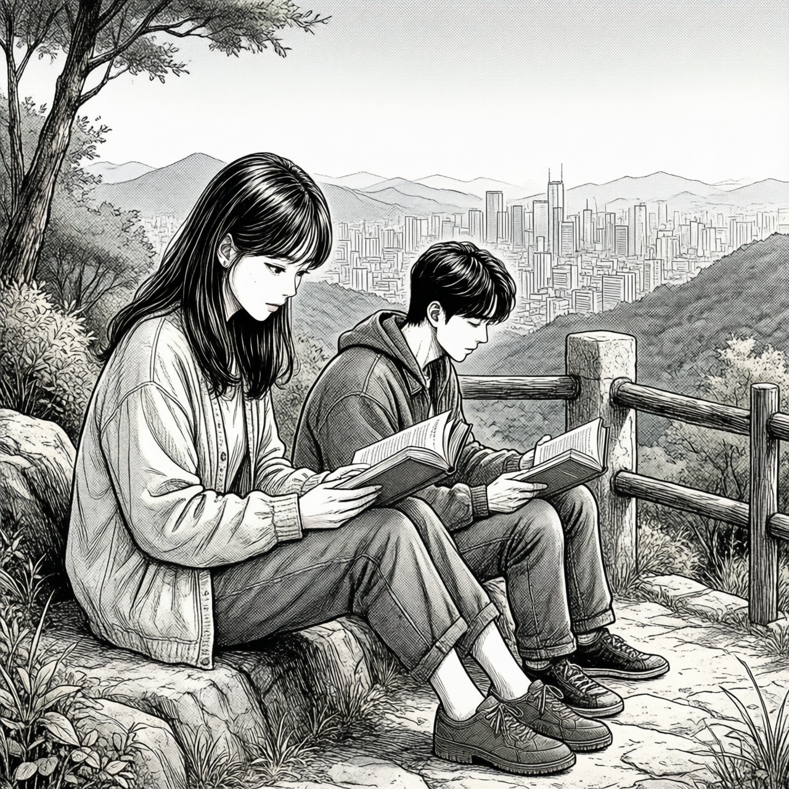
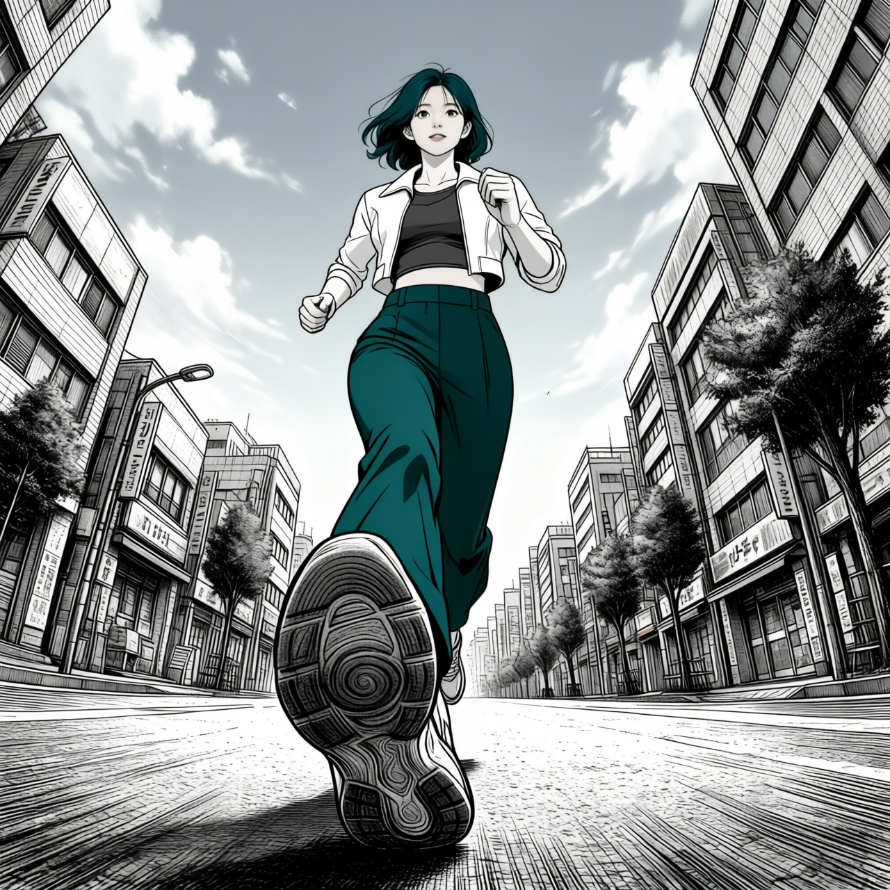
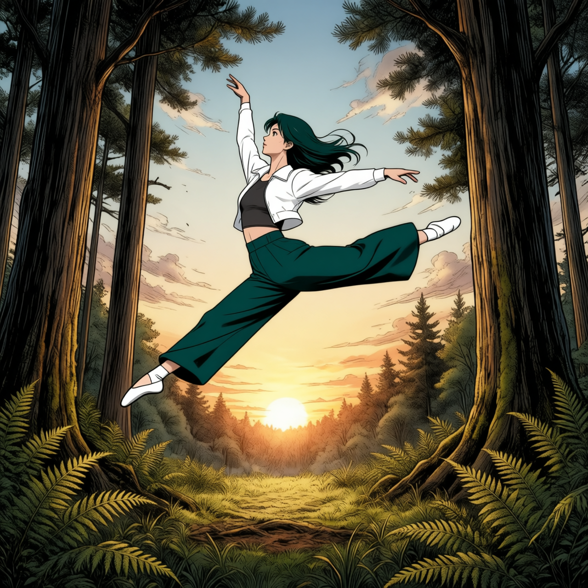
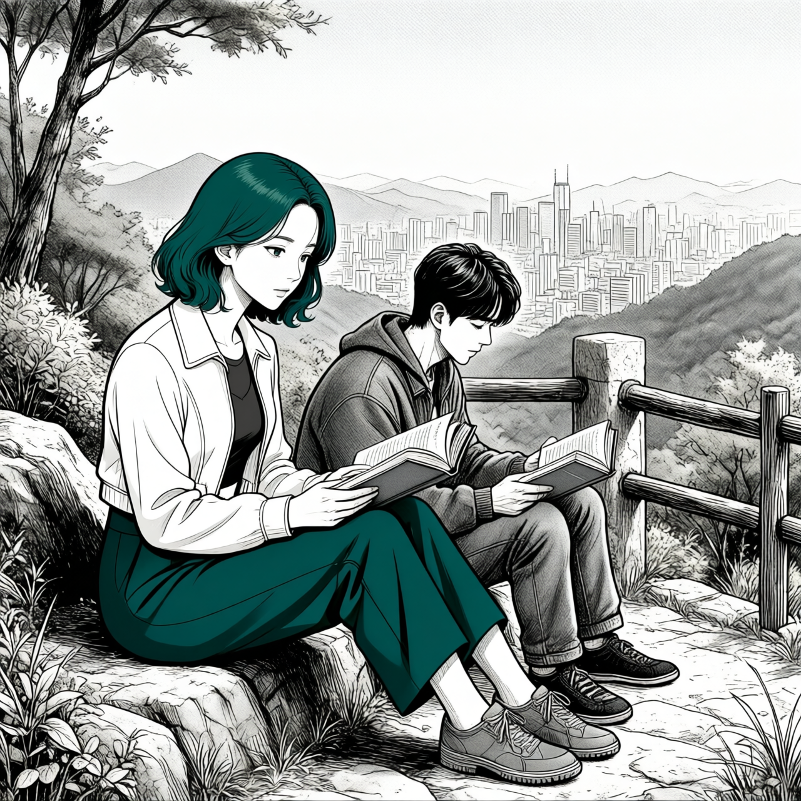

# P7-5.4 라인아트 구도에서 스토리보드 장면까지

> Section ID: `P7-5.4`
> Version: `v2026.09.10`

스토리보드 장면을 만들 때는 구도, 인물의 외형, 주변 대상의 배치를 각각 확인해야 한다. 이 절에서는 라인아트로 장면의 구도와 동작을 만들고, Mira의 아이덴티티를 이식한 뒤 주변 인물과 오브젝트를 추가한다. 단계별 입력과 출력을 비교하며 원하는 특징이 반영된 부분과 달라진 부분을 구분한다. 결과 이미지는 PNG로 보관하고, `result.json`에는 프롬프트, seed, step, 모델, 입력 파일을 기록한다.

## 라인아트로 장면의 구도를 먼저 잡는다

첫 단계는 `Qwen/Qwen-Image-2512` 텍스트-이미지 모델로 수행한다. 생성기의 기본 캔버스는 1280×1280이며, 이 단계에는 Mira 참조를 넣지 않는다. 인물의 정확한 얼굴이나 착장을 확정하기에 앞서, 카메라 높이, 인물의 동작, 배경 공간, 화면 여백을 평가할 구도판을 만든다. 여기서 라인아트는 선 중심의 그림을 요청하는 화풍 표현이다. 아래 Scene B처럼 색과 명암, 석양 조명도 함께 생성될 수 있으므로, 라인아트 요청이 무채색이나 윤곽선만의 출력을 보장한다고 해석하지 않는다.

공통 화풍 표현은 생성기의 `STYLE_PROMPT` 상수에 한 번만 둔다. `SCENE_PROMPTS`는 장면마다 달라지는 구도와 사건만 맡는다.

아래 구도판은 원고에 연결된 생성기를 실제로 다시 실행한 `lineart-audit-20260909-v1` 결과다. A·B·C 모두 1280×1280, 20 step으로 생성했고, seed는 각각 `5420`, `5421`, `5422`다. 이전 실행과 주요 설정은 같았지만 픽셀과 파일 해시가 완전히 같지는 않았다. 따라서 이전 결과를 새 실행 기록으로 덮어쓰지 않고, 각 실행의 PNG와 JSON을 한 쌍으로 보관한다.

- Scene A: 카메라를 향해 달리는 인물, 지면 높이 시점, 열린 하늘
- Scene B: 해 질 무렵 숲 공터에서 하는 grand jeté — 공중에서 두 다리를 앞뒤로 크게 벌리는 도약
- Scene C: 도시가 내려다보이는 언덕에서 두 사람이 책을 읽는 장면

생성기는 `--scene a`, `--scene b`, `--scene c`로 이 세 장면을 고른다. 기본 캔버스는 1280×1280이고 기본 샘플링은 20 step이다. 구도 지시의 영향을 비교할 때는 seed와 step을 고정하고 `--prompt`의 구도 표현 하나를 바꾼다. 반복 횟수의 영향을 보려면 프롬프트를 고정하고 `--steps`만 바꾼다. 아래 결과에서는 하늘, 전방 달리기, 들린 앞발의 밑창이 함께 나타나는지 관찰한다. 재실행한 Scene A에서는 전경 신발의 밑창이 크게 강조됐다. 밑창의 앞부분과 뒤꿈치를 나누어 살펴보고, 다음 편집에서도 이 원근 표현이 어떻게 이어지는지 비교한다.

Scene B는 같은 공통 화풍 상수에 숲 공터·석양·grand jeté만 추가해 20 step으로 생성했다. 이 결과에서는 점프 동작, 열린 하늘, 나무와 양치식물의 공간을 먼저 확인하고, Mira의 얼굴·착장·필요한 소품은 다음 편집 단계에서 보강한다.

Scene C도 같은 방식으로 생성했다. 두 인물, 책, 언덕 난간, 먼 도시 스카이라인이 장면의 기본 관계를 만든다. 이후 편집에서는 왼쪽 독자에게만 Mira 참조를 적용하고, 오른쪽 독자는 이 구도판의 인물을 유지하도록 요청한다. 두 번째 인물의 별도 참조 이미지는 사용하지 않는다.

| Scene A · 도시 달리기 | Scene B · 숲 공터 도약 | Scene C · 언덕 독서 |
| --- | --- | --- |
|  |  |  |

[Scene A line-art result.json](../../../assets/part-07/chapter-05/p7-5-4-qwen-image-2512-scene-a-lineart-audit-20260909-v1-size-1280x1280-seed-5420-steps-20-result.json){ .lazy-source }

[Scene B line-art result.json](../../../assets/part-07/chapter-05/p7-5-4-qwen-image-2512-scene-b-lineart-audit-20260909-v1-size-1280x1280-seed-5421-steps-20-result.json){ .lazy-source }

[Scene C line-art result.json](../../../assets/part-07/chapter-05/p7-5-4-qwen-image-2512-scene-c-lineart-audit-20260909-v1-size-1280x1280-seed-5422-steps-20-result.json){ .lazy-source }

아래 명령은 저장소 루트에서 실행하며, 필요한 패키지가 설치된 `.venv` 환경을 사용한다. 실행에는 CUDA GPU와 BF16 모델을 CPU 메모리와 GPU 사이에 나누어 올리는 순차 CPU 오프로딩 환경이 필요하다. 패키지 구성은 각 결과 JSON의 `runtime.packages`에서 확인할 수 있다. 생성기는 기본적으로 저장소의 `.tmp/download/huggingface/hub` 캐시에서 모델을 읽는다. 해당 모델이 준비되지 않았다면 실행 명령에 `--allow-download`를 추가해야 한다.

재실행 결과는 공개 자산과 충돌하지 않도록 `/tmp/p7-5-4-practice`에 저장한다. 같은 출력이 이미 있으면 덮어쓰기 방지 오류로 중단되므로, 다시 비교할 때는 `--output-dir`을 새 폴더로 바꾸거나 `--run-label`에 새 이름을 준다. 폴더나 실행 이름을 바꾸면 후속 명령의 입력 PNG 경로도 함께 바꾼다. `/tmp`의 결과는 임시 파일이므로 보관할 PNG와 JSON은 함께 별도 저장한다.

~~~bash
assets=docs/assets/part-07/chapter-05
for scene in a b c; do
  .venv/bin/python "$assets/p7_5_4_qwen_image_2512_generate_lineart_scene.py" \
    --scene "$scene" --run-label lineart-audit-20260909-v1 \
    --size 1280 --steps 20 --output-dir /tmp/p7-5-4-practice || break
done
~~~

[P7-5.4 라인아트 씬 생성기](../../../assets/part-07/chapter-05/p7_5_4_qwen_image_2512_generate_lineart_scene.py)

## 라인아트 구도에 Mira의 아이덴티티와 화풍을 이식한다

다음 단계에서는 Scene A 라인아트를 Picture 1로 넣고, [P7-5.3의 3단계 재킷 착장 참조](../../../assets/part-07/chapter-05/p7-5-3-qwen-edit-prompt-style-outfit_stage3_jacket_face-three-stage-v1-seed-62294-steps-10.png)를 Picture 2로 넣는다. Picture 1은 달리기 포즈·로우 앵글·도시 배경을 맡고, Picture 2는 Mira의 얼굴·헤어·착장·선화·절제된 색을 맡는다. 이 역할은 프롬프트로 요청하는 조건이며, 이미지 일부를 잠그는 기능은 아니다. 출력에서 구도와 외형이 각각 얼마나 유지됐는지 다시 비교해야 한다.

아래 A·B·C는 이번에 생성한 라인아트에 3단계 착장을 참조한 `mira-audit-20260909-v1` 재실행 결과다. 로컬 GPU에서 1280×1280, 20스텝, true CFG `4.0`으로 실행했으며 seed는 각각 `5420`, `5421`, `5422`다. Scene A에서는 지면 높이의 달리기 구도와 크게 보이는 신발 밑창, 청록 단발·흰 크롭 재킷·회색 이너·딥틸 팬츠가 나타났다. 이식 단계는 Qwen-Image-Edit-2511을 BF16 순차 CPU 오프로딩으로 직접 실행하며 ComfyUI 서버를 사용하지 않는다.

같은 생성기는 `--scenes b c`처럼 여러 장면을 받아 한 번 로드한 파이프라인으로 순차 처리한다. Scene B에서는 숲 공터의 도약 인물을, Scene C에서는 왼쪽 독자를 Mira로 바꾸도록 요청한다. Scene C의 오른쪽 독자와 배경 관계는 보존 대상으로 지시한다.

| Scene A · 도시 달리기 | Scene B · 숲 공터 도약 | Scene C · 언덕 독서 |
| --- | --- | --- |
|  |  |  |

[Scene A Mira 이식 result.json](../../../assets/part-07/chapter-05/p7-5-4-qwen-2511-lineart-scene-a-mira-audit-20260909-v1-size-1280x1280-seed-5420-steps-20-result.json){ .lazy-source }

[Scene B Mira 이식 result.json](../../../assets/part-07/chapter-05/p7-5-4-qwen-2511-lineart-scene-b-mira-audit-20260909-v1-size-1280x1280-seed-5421-steps-20-result.json){ .lazy-source }

[Scene C Mira 이식 result.json](../../../assets/part-07/chapter-05/p7-5-4-qwen-2511-lineart-scene-c-mira-audit-20260909-v1-size-1280x1280-seed-5422-steps-20-result.json){ .lazy-source }

청록 머리와 흰 재킷이 나타났다는 사실만으로 참조의 외형이 모두 보존됐다고 판단할 수는 없다. 다음은 위 결과와 Mira 전신 참조를 비교한 관찰이다.

| 장면 | 반영된 특징 | 차이와 확인 한계 |
| --- | --- | --- |
| A | 청록 단발, 흰 크롭 재킷, 회색 이너, 청록 팬츠 | 재킷 소매가 걷힌 형태이며 얼굴의 눈·윤곽 표현이 달라짐. 신발 밑창이 크게 보이는 구도라 참조 정면만으로 밑창 무늬의 일치를 판단하기 어려움 |
| B | 청록 머리, 흰 재킷, 딥틸 팬츠와 도약 자세 | 머리카락이 단발보다 길어지고, 스니커즈가 발레화 같은 형태로 바뀜. 바지 끝이 발목 위로 올라감 |
| C | 청록 단발, 흰 재킷, 딥틸 하의와 독서 자세. 오른쪽 독자와 배경의 배치 | 바지 밑단 아래로 발목이 드러남. 신발이 참조의 흰 캔버스화와 다른 회색 운동화 형태이며, 얼굴의 눈·윤곽 표현도 달라짐 |

세 장면의 구도 유지와 캐릭터 외형의 일치는 별도 판단이다. 주변 대상을 추가하는 다음 단계에서도 이 차이가 저절로 교정되는 것은 아니므로, 최종 결과를 전신 참조와 다시 대조한다.

아래 편집 명령은 앞 단계에서 `/tmp/p7-5-4-practice`에 생성한 라인아트를 `--lineart`로 지정한다. 장면마다 입력 파일이 다르므로 한 장면씩 실행하며, `--mira-reference`에는 3단계 착장 참조를 명시한다. 기본 입력에 의존하면 저장소의 이전 구도판을 다시 사용할 수 있으므로, 단계 사이의 PNG 경로를 직접 연결한다. `--dry-run`을 추가하면 모델을 실행하지 않고 입력·프롬프트·출력 경로를 확인할 수 있다.

~~~bash
assets=docs/assets/part-07/chapter-05
output=/tmp/p7-5-4-practice
for pair in a:5420 b:5421 c:5422; do
  scene=${pair%:*}
  seed=${pair#*:}
  .venv/bin/python "$assets/p7_5_4_qwen_edit_2511_apply_mira_to_lineart.py" \
    --scenes "$scene" \
    --lineart "$output/p7-5-4-qwen-image-2512-scene-$scene-lineart-audit-20260909-v1-size-1280x1280-seed-$seed-steps-20.png" \
    --mira-reference "$assets/p7-5-3-qwen-edit-prompt-style-outfit_stage3_jacket_face-three-stage-v1-seed-62294-steps-10.png" \
    --run-label mira-audit-20260909-v1 --size 1280 --steps 20 \
    --output-dir "$output" || break
done
~~~

[라인아트 Mira 아이덴티티 이식 생성기](../../../assets/part-07/chapter-05/p7_5_4_qwen_edit_2511_apply_mira_to_lineart.py)

## Mira를 이식한 장면에 주변 인물과 동물을 추가한다

주변 인물 보강은 Mira 이식 결과 한 장을 Image 1로 사용한다. 아래 A·B·C의 `extras-audit-20260909-v1`은 모두 앞 단계의 같은 장면 `mira-audit-20260909-v1` PNG를 입력으로 재실행한 결과다. 라인아트 생성부터 Mira 이식, 주변 대상 추가까지 이번 실행에서 만든 산출물을 순서대로 연결했다. 아래 명령은 한 장면씩 선택하고 `--scene-image`에 앞 단계의 새 PNG 경로를 지정한다. 이 생성기도 `--dry-run`으로 실행 계획을 확인할 수 있다.

| Scene A · 도시 달리기 | Scene B · 숲 공터 도약 | Scene C · 언덕 독서 |
| --- | --- | --- |
|  |  |  |

[Scene A 주변 인물 보강 result.json](../../../assets/part-07/chapter-05/p7-5-4-qwen-2511-lineart-scene-a-extras-audit-20260909-v1-size-1280x1280-seed-5420-steps-20-result.json){ .lazy-source }

[Scene B 작은 동물 배치 result.json](../../../assets/part-07/chapter-05/p7-5-4-qwen-2511-lineart-scene-b-extras-audit-20260909-v1-size-1280x1280-seed-5421-steps-20-result.json){ .lazy-source }

[Scene C 새 배치 result.json](../../../assets/part-07/chapter-05/p7-5-4-qwen-2511-lineart-scene-c-extras-audit-20260909-v1-size-1280x1280-seed-5422-steps-20-result.json){ .lazy-source }

Scene A의 프롬프트는 `Add several pedestrians and several people running in casual clothing to Image 1.`이다. 행인 여러 명과 캐주얼 복장으로 달리는 사람 여러 명의 추가만 요청하며, 인물 수나 상대 크기, 기존 장면 보존 지시는 따로 넣지 않는다.

Scene A의 `extras-audit-20260909-v1`은 Qwen-Image-Edit-2511을 로컬 GPU에서 BF16 순차 CPU 오프로딩으로 직접 실행한 1280×1280, 20 step, CFG 4.0 결과다. Mira 주변에 캐주얼 복장의 인물 여섯 명이 추가됐다. 대부분 달리는 자세여서, 행인과 달리는 사람을 구분해 요청한 내용이 결과에서도 나뉘어 표현됐는지 확인할 필요가 있다. 중심 인물의 구도와 착장은 대체로 유지됐지만, 배경 나무와 구름의 세부 표현도 달라졌다. 주변 인물 추가가 나머지 모든 픽셀의 보존을 뜻하지는 않는다.

~~~bash
assets=docs/assets/part-07/chapter-05
output=/tmp/p7-5-4-practice
.venv/bin/python "$assets/p7_5_4_qwen_edit_2511_enrich_mira_scene_extras.py" \
  --scenes a \
  --scene-image "$output/p7-5-4-qwen-2511-lineart-scene-a-mira-audit-20260909-v1-size-1280x1280-seed-5420-steps-20.png" \
  --run-label extras-audit-20260909-v1 --size 1280 --steps 20 \
  --output-dir "$output"
~~~

[Mira 장면 주변 인물·오브젝트 보강 생성기](../../../assets/part-07/chapter-05/p7_5_4_qwen_edit_2511_enrich_mira_scene_extras.py)

생성기의 `--scenes`는 A·B·C를 선택한다. B는 작은 토끼와 다람쥐, C는 독자 주변에 앉아 있는 새를 추가한다.

Scene B는 Mira 이식 결과를 Image 1로 사용하고 작은 동물 두 마리의 위치를 각각 지정했다. 토끼는 왼쪽 아래 양치식물 옆 공터 바닥에 앉히고, 다람쥐는 오른쪽 나무 밑 지면에 배치하도록 요청했다.

Scene B의 `extras-audit-20260909-v1`은 같은 로컬 GPU 실행 방식의 1280×1280, 20 step, CFG 4.0, seed 5421 결과다. 토끼는 왼쪽 아래 양치식물 옆 지면에, 다람쥐는 오른쪽 나무뿌리 위에 앉은 모습으로 나타났다. 두 동물은 Mira의 몸과 떨어져 있으며 고슴도치는 없다. 다람쥐는 지면에 서 있으라는 요청과 자세·지지 위치가 다르다. Mira의 긴 머리와 발레화 형태, 발목 노출도 이전 단계에서 이어졌다.

~~~bash
assets=docs/assets/part-07/chapter-05
output=/tmp/p7-5-4-practice
.venv/bin/python "$assets/p7_5_4_qwen_edit_2511_enrich_mira_scene_extras.py" \
  --scenes b \
  --scene-image "$output/p7-5-4-qwen-2511-lineart-scene-b-mira-audit-20260909-v1-size-1280x1280-seed-5421-steps-20.png" \
  --run-label extras-audit-20260909-v1 --size 1280 --steps 20 \
  --output-dir "$output"
~~~

Scene C는 Mira 이식 결과를 Image 1로 사용하고, 작은 새 세 마리가 앉을 위치를 각각 지정했다. 남성 독자 오른쪽의 기존 사각 난간 기둥 위, 오른쪽 가장자리의 기존 상단 나무 난간 위, Mira 옆 왼쪽 아래 바위 위다. 새를 추가한다는 요청에 기존 장면에서 발을 디딜 대상을 연결한 것이다.

Scene C의 `extras-audit-20260909-v1`은 같은 로컬 GPU 실행 방식의 1280×1280, 20 step, CFG 4.0, seed 5422 결과다. 새 세 마리가 난간 기둥 두 곳과 왼쪽 아래 바위에 앉아 있고, 하늘에 떠 있는 새나 분리된 가지는 보이지 않는다. 다만 오른쪽 가장자리의 새는 요청한 가로 난간 대신 끝 기둥 위에 배치됐다. 앉는 동작의 반영과 정확한 위치의 일치는 따로 확인해야 한다. 조연의 옷 주름과 배경의 선 표현도 달라졌으므로, 인물·배경의 배치 유지와 세부 픽셀 보존을 구분한다.

~~~bash
assets=docs/assets/part-07/chapter-05
output=/tmp/p7-5-4-practice
.venv/bin/python "$assets/p7_5_4_qwen_edit_2511_enrich_mira_scene_extras.py" \
  --scenes c \
  --scene-image "$output/p7-5-4-qwen-2511-lineart-scene-c-mira-audit-20260909-v1-size-1280x1280-seed-5422-steps-20.png" \
  --run-label extras-audit-20260909-v1 --size 1280 --steps 20 \
  --output-dir "$output"
~~~

| 단계 | 입력 | 유지하거나 보강할 내용 |
| --- | --- | --- |
| 라인아트 구도 | 텍스트 | 카메라, 동작, 배경 공간, 화면 여백 |
| Mira 이식 | 라인아트 구도판, Mira 전신 착장 참조 | Mira의 얼굴·헤어·착장·화풍 |
| 주변 인물·오브젝트 보강 | Mira 이식 결과 한 장 | 주변 대상의 종류·복장·배치·크기 |

구도가 부족하면 라인아트 장면 프롬프트를, Mira의 외형이 부족하면 이식 단계의 참조를, 주변 인물의 복장이나 배치가 부족하면 보강 단계의 지시를 조정한다. 각 결과 JSON의 입력 경로를 따라가면 앞 단계의 어떤 산출물을 재사용했는지 확인할 수 있다.

이번 재실행에서는 생성기 세 개로 A·B·C의 세 단계를 모두 실행했다. 전체 실행 점검 기록에는 소스코드 해시, 실제 실행 명령, 아홉 결과의 입력·출력 해시와 설정, 시각 검토 내용을 모았다. 원고의 명령도 실습용 출력 폴더를 제외하면 이 실행과 같은 입력 연결·설정을 사용한다. 기록의 검증 통과는 코드 실행과 산출물 연결을 확인했다는 뜻이며, 참조 외형이나 요청 위치가 모두 정확히 재현됐다는 뜻은 아니다.

[전체 실행 점검 기록](../../../assets/part-07/chapter-05/p7-5-4-generation-audit-20260909-v1.json){ .lazy-source }

## 체크리스트

- [ ] Scene A·B·C의 라인아트 구도는 화풍 상수와 장면별 프롬프트를 분리해 생성했는가?
- [ ] 라인아트 결과에서는 카메라·동작·배경 공간을, 이후 편집 결과에서는 Mira·착장·오브젝트를 각각 검수하는가?
- [ ] 편집 단계가 구도를 다시 바꾸지 않고 구도판을 유지하는지 입력 순서와 결과 이미지로 확인하는가?
- [ ] 머리색·착장색의 반영과 머리 길이·바지 길이·신발 형태의 보존을 구분해 기록했는가?
- [ ] 재실행 출력 경로가 기존 자산과 겹치지 않으며, 후속 단계가 실제로 비교하려는 PNG를 입력으로 사용하는가?
- [ ] 각 단계의 PNG와 `result.json`을 함께 보관해 어떤 입력과 설정이 결과를 만들었는지 추적할 수 있는가?

## 출처와 참고 자료

- [Qwen-Image-2512 모델 카드](https://huggingface.co/Qwen/Qwen-Image-2512){: target="_blank" rel="noopener noreferrer"}: 텍스트-이미지 파이프라인과 Apache-2.0 라이선스 정보를 확인한 자료입니다.
- [Qwen-Image 컬렉션](https://huggingface.co/collections/Qwen/qwen-image){: target="_blank" rel="noopener noreferrer"}: 2512 텍스트-이미지 모델과 현재 공개된 `Qwen-Image-Edit-2511` 편집 모델의 구분을 확인한 자료입니다.
- [Qwen-Image-Edit-2511 모델 카드](https://huggingface.co/Qwen/Qwen-Image-Edit-2511){: target="_blank" rel="noopener noreferrer"}: 다중 이미지 참조를 포함한 후속 편집 단계의 입력 형식과 사용 예제를 확인하는 자료입니다.
