# P7-5.4 화풍·연속성 보정: 컷신의 구조와 디테일을 분리해 고치기

> Section ID: `P7-5.4`
> Version: `v2026.08.10`

이 절은 `P7-5.3`에서 인체·가림·공간 관계를 검수한 장면 기준과 전체 컷이 생긴 뒤에 시작하는 후속 단계입니다. 현재 P7-5.3에는 구조·캐릭터 정보의 수용을 승인한 A/B/C 장면이 있지만, 공간·조명·그림자까지 통과한 완성 컷은 없습니다. 따라서 보정 도구를 최종 승인처럼 앞당겨 쓰지 않습니다. 목표는 한 장의 예쁜 이미지를 만드는 것이 아니라, 다른 pose·camera·장소의 네 컷에서 인물성, 화풍, 구조, 국소 디테일을 분리해 판정하는 것입니다. ControlNet은 pose·camera·silhouette 같은 구조 입력을 확인하는 수단이고, inpaint는 그 전체 frame이 통과한 뒤에만 얼굴·손·발·소품 접점을 고치는 수단입니다.

## LoRA 전환에는 별도 데이터와 학습 환경이 필요하다

참조 이미지만으로 얼굴과 복장이 약하게 섞일 때는 LoRA를 검토할 수 있다. 현 FLUX 경로에 맞는 학습 대상은 Apache-2.0인 **FLUX.2 Klein 4B Base**다. 학습은 Base checkpoint에서 하고, 완성한 adapter는 빠른 distilled 4B 추론 모델에 붙인다.

하지만 이는 현재 8 GB GPU에서 바로 실행할 다음 단계가 아니다. 공식 Klein LoRA 안내의 4B Base 학습 예시는 약 24 GB VRAM 환경을 전제로 한다. 이는 모든 설정의 절대 최소치가 아니라 공식 예제의 검증 조건이지만, 현재 8 GB 환경에서 같은 학습을 승인할 근거로 사용할 수는 없다. FLUX.1-dev QLoRA 공식 사례의 peak도 약 9 GB이고 base model의 비상업 라이선스가 현재의 개방 라이선스 기준과 맞지 않는다.

학습을 시작하려면 먼저 올바른 데이터를 확보한다. 공식 예시의 스타일 LoRA는 서로 다른 구도와 시점을 가진 15–40장의 이미지와 각 이미지의 내용 caption·동일 trigger word를 사용한다. 현재 P7-5.2 기준 자산은 얼굴·전신·소품 보드가 섞여 있어 그 자체를 하나의 학습 데이터셋으로 보지 않는다. 실패하거나 왜곡된 생성 이미지도 학습 데이터로 사용하지 않는다.

구도 보존과 캐릭터 교체를 함께 학습하려면 입력 이미지와 목표 이미지를 짝짓는 **edit LoRA** 형식이 더 직접적이다. 공식 안내는 `control_path`로 이 쌍을 연결하지만 보편적인 최소 쌍 수를 보장하지 않는다. 따라서 필요한 데이터 수는 임의로 확정하지 않고, 같은 포즈·구도에서 캐릭터·복장이 완성된 검수 쌍과 별도 학습 환경을 확보한 뒤 실험으로 정한다.

## 8 GB에서 확인할 순서는 실행 가능성과 품질을 섞지 않는다

8 GB에서 RAM이나 SSD를 보조로 쓰는 실행기는 VRAM을 물리적으로 늘리는 장치가 아니다. 현재 쓰지 않는 가중치를 CPU RAM 또는 디스크에 두었다가 GPU로 옮기는 방식이므로, 실행이 끝났다는 사실만으로 웹툰 컷의 품질이나 학습 가능성을 뜻하지 않는다. CUDA Unified Memory도 하드웨어·운영체제 조건에 따라 메모리 초과 할당과 페이지 이동을 지원하지만, 이동과 page fault가 반복되면 속도가 크게 떨어질 수 있다. 특히 Windows와 WSL에서는 oversubscription 조건이 더 제한적이다.

따라서 아직 전체 frame을 통과한 P7-5.3 컷이 없는 현재 단계에서는, 아래 순서를 **제작 컷이 아닌 권리·입력 조건이 확인된 고정 시험 이미지**에서 먼저 확인한다. 시험용 이미지의 통과는 P7-5.3 장면의 승인이 아니며, 그 장면을 inpaint할 권한도 만들지 않는다.

| 순서 | 비교할 수단 | 고정 조건과 기록 | 다음 단계로 갈 조건 |
| --- | --- | --- | --- |
| 0 | 실행 환경 | GPU·드라이버·OS·CUDA, 물리 VRAM, RAM, SSD 여유 공간을 기록한다. | 외부 GPU에서 CUDA가 실제로 보인다. |
| 1 | SDXL inpaint 실행기 | 기존 Diffusers sequential CPU offload와 ComfyUI Dynamic VRAM을 같은 모델·mask·seed·해상도로 비교한다. VRAM peak, RAM, SSD I/O, 장당 시간을 남긴다. | 둘 중 하나가 OOM 없이 반복 실행된다. |
| 2 | 저정밀 추론 | 같은 SDXL inpaint에서 FP8 layerwise casting 또는 4-bit 양자화를 한 번에 하나씩 비교한다. 원본과 mask 경계·색·얼굴 손상을 함께 판정한다. | 기준 실행보다 메모리 또는 시간이 개선되고 품질 하락이 허용 범위다. |
| 3 | LoRA 최소 학습 | SD 1.5, `512 x 768`, batch 1에서 style과 character를 섞지 않은 소규모 LoRA를 학습한다. 데이터 권리, caption, loss, peak VRAM, sample grid를 남긴다. | 학습이 끝나고 held-out prompt에서 trigger와 화풍 또는 인물성 중 하나를 재현한다. |
| 4 | LoRA와 국소 편집의 결합 | 통과한 adapter 하나만 SD 1.5 inpaint checkpoint에 연결하고, LoRA 없음/on을 같은 mask·seed로 비교한다. 이어서 수동 mask와 DiffEdit 자동 mask를 같은 수정 요청에서 비교한다. | 변경 영역 밖의 화풍·인물성이 유지되고, 경계 누수와 새 구조 오류가 없다. |
| 5 | 제작 컷 적용 | P7-5.3의 전체 frame이 별도 검수를 통과한 뒤에만, 통과한 한 조합을 얼굴·손·발·소품의 승인 mask에 적용한다. | 네 컷 ledger에서 identity·structure·style·local detail이 모두 통과한다. |

ComfyUI Dynamic VRAM은 메모리 운영을 바꾸는 후보이고, SDXL inpaint의 화풍·인물 품질을 보장하는 모델 교체가 아니다. Diffusers의 FP8 layerwise casting과 4-bit 양자화도 가중치 저장 메모리를 줄일 수 있지만 활성값 peak와 출력 품질은 별도로 측정해야 한다. 특히 layerwise casting은 PEFT/LoRA가 들어간 사용자 정의 경로에서 호환되지 않을 수 있으므로, LoRA를 붙이기 전과 후를 분리한다.

SD 3.5 Medium의 4-bit 추론은 현대적인 저정밀 base의 별도 후보로 남긴다. 그러나 이 절의 목표인 LoRA와 mask inpaint를 같은 계약으로 비교할 공식 inpainting checkpoint를 확인하지 못했으므로, 순서 1–4의 기준선으로 바꾸지 않는다. T2I-Adapter와 StyleAligned도 각각 구조 제어와 학습 없는 화풍 일관성의 연구 후보이지만, T2I-Adapter의 공식 SDXL 예시는 최소 15 GB 추론을 명시하고 StyleAligned의 8 GB 재현 조건도 확인되지 않았다. 현재 8 GB 실험 순서에는 넣지 않고, 기준선이 통과한 뒤 별도 비교로만 다룬다.

## DiffEdit 자동 mask의 첫 8 GB 결과

가장 작은 추가 모델 경로가 실제로 국소 보정을 대신할 수 있는지 먼저 확인했다. P7-5.2의 승인 전신 정면을 **고정 시험 입력**으로 두고, charcoal crop top에 cropped white jacket을 추가하라는 목표 prompt로 DiffEdit mask를 만들었다. 이 입력은 P7-5.3의 승인 full-frame 컷이 아니므로, 이 실행은 제작 컷 보정이나 승인 후보 생성이 아니라 자동 mask의 실행·실패 조건을 확인하는 preflight다.

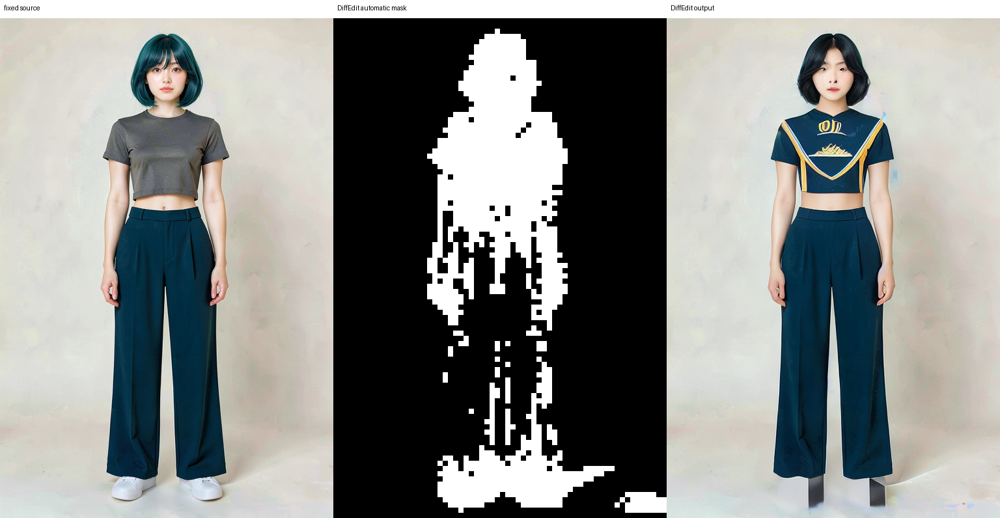

`512 x 768`, 20 step, mask map 4개, seed `5404`에서 SD 1.5 base와 DiffEdit만 사용했다. sequential CPU offload와 attention slicing으로 실행은 `20.6초`, 관측 peak VRAM은 `2,723 MiB`였고, ControlNet·IP-Adapter·LoRA는 추가하지 않았다. 따라서 **8 GB에서 실행 가능**이라는 항목은 통과했다.

그러나 자동 mask는 재킷이 있어야 할 몸통에 머물지 않고 머리·얼굴·바지·신발·바닥까지 넓게 잡았다. 출력은 흰 cropped jacket 대신 로고처럼 보이는 어두운 상의를 만들었고, 얼굴·머리·신발도 함께 바꿨다. 즉 변경 영역 밖 보존, 요청한 의상 반영, 경계 누수 없음의 세 품질 gate는 모두 실패했다. 이 PNG를 제작 자산이나 후속 inpaint 입력으로 승인하지 않으며, DiffEdit은 현재 **자동 mask 실패 대조군**으로만 보관한다.

prompt와 mask 설정을 바꾼 반복도 세 번으로 닫았다. threshold를 `8.0`으로 높이고 mask encode strength를 `0.2`로 낮춘 첫 반복은 `35.1초`, peak `6,336 MiB`에서 mask 확산을 줄였지만 재킷 영역까지 거의 없애 버렸다. threshold를 `5.0`으로 완화하고 목표를 white cropped jacket 하나로 줄인 마지막 반복은 `34.0초`, peak `7,236 MiB`였지만, 다시 얼굴·바지·신발까지 선택했고 상의·허리띠 artifact만 남겼다.

| 설정 | mask 판정 | 요청 편집 | 편집 밖 보존 | 판정 |
| --- | --- | --- | --- |
| 초기 20 step, ratio 3.0 | 전신·바닥으로 확산 | 흰 재킷 실패 | 얼굴·머리·신발 변경 | fail |
| 반복 30 step, ratio 8.0 | 지나치게 희소 | 재킷을 거의 바꾸지 않음 | 작은 비의도 변경 | fail |
| 반복 30 step, ratio 5.0, 재킷+상의 | 얼굴·하체·신발로 재확산 | 재킷 실패 | 작은 의상·신발 artifact | fail |
| 반복 30 step, ratio 5.0, 단일 의상 목표 | 얼굴·하체·신발로 재확산 | 흰 재킷 대신 상의·허리띠 artifact | 비의도 변경 | fail |

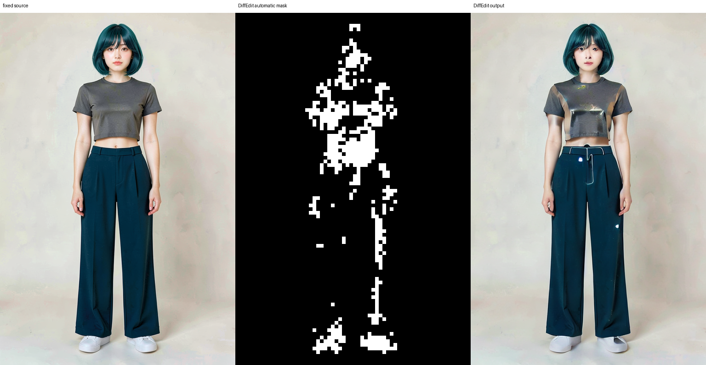

따라서 다음 비교는 DiffEdit의 prompt나 step을 계속 늘리는 것이 아니다. 전체 frame이 통과한 panel이 생긴 뒤, 사람이 제한한 mask와 같은 수정 요청을 나란히 놓아 자동 mask가 정말 필요한지 판단한다. 그 전까지는 이 반복 실패 결과로 DiffEdit을 제작 파이프라인에서 제외한다.

다음 실행은 사람이 만든 black/white mask를 필수 입력으로 받는 SDXL inpaint 대조다. white는 편집, black은 보존이라는 계약과 입력·mask의 같은 해상도를 실행 전에 검사한다. 기본값은 `local_files_only`여서 checkpoint를 자동으로 내려받지 않으며, 다운로드를 허용하는 `--allow-download`는 별도 결정이 필요하다. 준비 시점에는 이 checkpoint와 ComfyUI가 없었으므로, Diffusers 단일 경로만 먼저 실행했다.

실행 준비 뒤에는 P7-5.2 승인 전신을 고정 preflight 입력으로 사용해, 얼굴·바지·신발·바닥을 제외하는 거친 운영자 지정 재킷 mask를 실제로 실행했다. 첫 실행은 `width`·`height`를 파이프라인 호출에 넘기지 않아 SDXL 기본 canvas가 섞였다. 따라서 처음 contact sheet의 잘린 출력은 mask 품질 판정 근거가 아니라, 출력 canvas 계약 누락을 드러낸 실패 기록이다. checkpoint 다운로드와 로딩까지 포함한 그 실행의 총 시간은 `276.4초`, 관측 peak VRAM은 `3,292 MiB`였다.

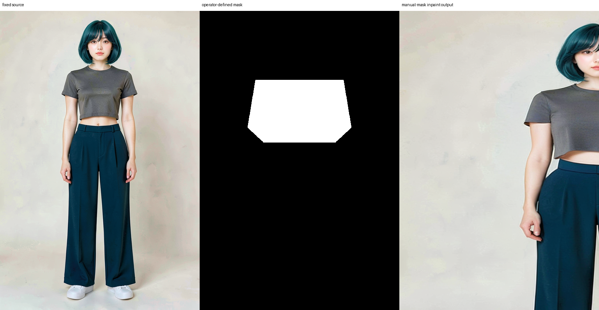

수정 실행에서는 목표 `512 x 768`을 명시하고, 생성 결과의 mask 밖 픽셀을 고정 source로 되돌리는 feathered composite를 추가했다. `strength=0.4`, 20 step에서는 full frame과 mask 밖 영역이 보존됐지만 재킷 편집이 거의 일어나지 않았다. `strength=0.8`, 30 step으로 높이면 mask 안은 바뀌었지만 요청한 open cropped white denim jacket 대신 회색 긴소매 상의가 생성됐다.

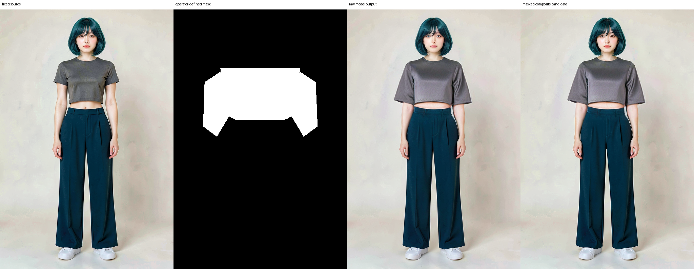

그러므로 이번 비교는 canvas·외부 보존 경로만 통과했고, 의상 지시 이행은 두 조건 모두 실패했다. step·strength만 더 올리는 것은 다음 가설이 아니다. 이후 비교는 conditioning 또는 모델 경로를 바꿔야 하며, 이 coarse preflight mask와 두 출력은 제작 컷에 사용하지 않는다.

이를 확인하기 위해 wide/narrow mask, strength `0.55`~`0.85`, CFG `10`·`12`·`15`, seed `5501`·`62294`·`62382`, 긴 prompt와 압축 prompt를 한 변수씩 바꾼 10회 반복을 했다. 모든 composited 후보는 full frame과 mask 밖 영역을 유지했고 peak VRAM은 `1,785`~`2,185 MiB`, 실행 시간은 `13.4`~`19.3초`였다. 그러나 crop 길이나 앞여밈 모양이 일부 나타나도 재킷 색은 모두 회색·어두운 색에 머물러, **흰 open-front cropped jacket**이라는 세 조건을 함께 충족한 후보는 없었다.

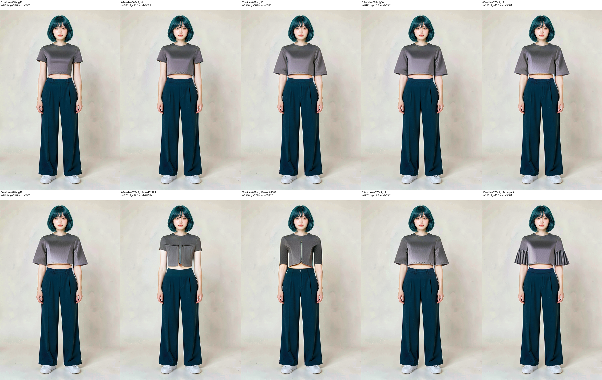

따라서 이 prompt·CFG·strength·seed·coarse mask sweep은 여기서 종료한다. 다음 가설은 같은 텍스트를 더 세게 반복하는 것이 아니라, 의상 reference를 조건으로 넣는 경로 또는 다른 inpaint 모델 경로가 색·형태 계약을 회복하는지 비교하는 것이다.

그 다음에는 승인한 `jacket-crop-top-front` 이미지를 일반 SDXL IP-Adapter의 의상 참조로 추가했다. Plus adapter는 이 Diffusers 버전에서 attention slicing을 켠 inpaint pipeline과 충돌했다. slicing을 빼고 공식 예시와 같은 일반 `ip-adapter_sdxl.bin`으로 바꾸면 `512 x 768`, 30 step, adapter scale `0.55`, seed `62294`에서 `20.1초`, peak `1,885 MiB`로 실행됐다.

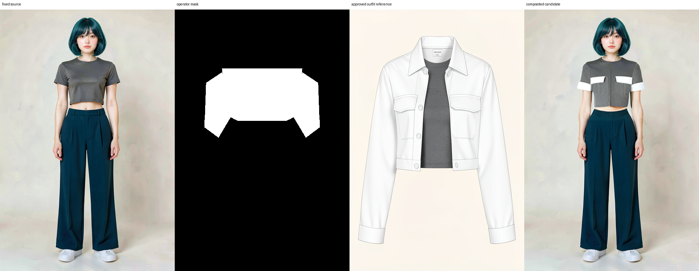

전신·mask 밖 보존은 유지됐고 흰 포켓 flap과 소매 끝이 일부 나타났다. 그러나 재킷 몸판은 여전히 회색이어서 흰 open-front cropped jacket 계약에는 미통과다. 이 출력은 제작 자산이 아니며, 다음 비교에서는 adapter scale만 바꿔 참조 강도가 몸판 색까지 전달되는지 확인한다.

같은 입력·seed에서 adapter scale을 `0.85`로 올렸지만, peak VRAM `2,085 MiB`, `19.7초`로 실행된 후보도 포켓 flap·소매 끝만 흰색이고 몸판은 회색이었다. `0.55`보다 재킷 색·앞여밈 계약이 실질적으로 좋아지지 않았으므로 adapter scale sweep은 종료한다.

마스크 가설도 분리했다. 기존 wide mask는 상체 전체를 한 덩어리로 바꿔 중앙 크롭탑과 재킷 shell을 구분하지 못했다. 그래서 칼라·좌우 재킷 패널·긴소매만 white로 두고, 얼굴·머리·중앙 charcoal crop top·하체·배경은 black으로 유지하는 jacket-shell mask를 만들었다. 같은 IP-Adapter scale `0.55`, seed `62294` 조건에서 `20.1초`, peak `1,646 MiB`로 생성한 결과는 open-front·크롭 레이어·긴소매 구조를 유지했다.

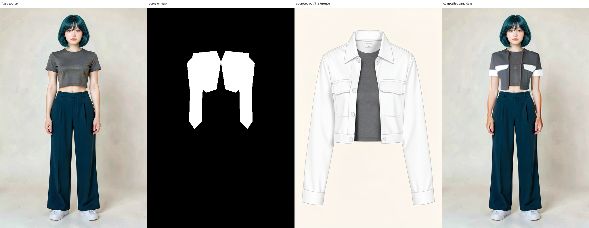

따라서 mask 범위는 실제 구조 병목이었다. 그러나 편집된 재킷 패널은 여전히 회색이므로 흰 fabric color 계약은 별도 실패다. 이 mask는 다음 색 조건 또는 모델 경로 비교의 통제 입력으로 보관하지만, 출력은 제작 자산으로 승인하지 않는다.

원본 인물의 어깨·팔·손목·크롭탑 opening·높은 밑단을 더 촘촘히 따르는 fitted-shell raster mask도 만들었다. 같은 조건에서 `18.6초`, peak `1,991 MiB`로 생성하면 mask 경계의 부자연스러움은 줄었지만, 재킷 패널은 계속 회색이었다. 따라서 다각형을 계속 손질하는 것은 다음 가설이 아니다. 이 입력은 mask 정밀화의 종료 기록이며, 남은 변수는 흰 fabric color를 전달하는 conditioning이다.

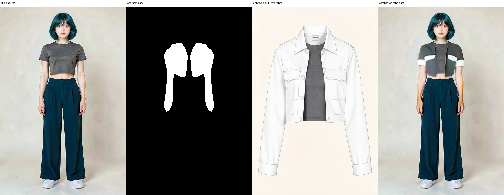

경계 여유 자체도 분리했다. fitted-shell의 white 영역을 원본 해상도에서 바깥쪽으로 `16px` 확장한 뒤 같은 조건으로 실행하면 버튼과 연속된 재킷 몸판은 더 잘 나타났다. 그러나 출력은 흰 open-front 재킷이 아니라 회색의 닫힌 크롭 재킷이 됐다. 즉 border 확장은 구조에는 영향을 주지만 흰 fabric color와 앞여밈 계약을 해결하지 않는다.

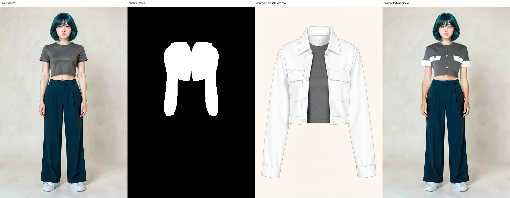

참조의 회색 crop top이 흰 원단 신호를 약화했는지도 분리했다. 레이어 참조 대신 흰 재킷만 있는 승인 소품 참조를 입력해도, `19.2초`, peak `1,814 MiB`의 후보는 회색 패널과 흰 포켓·소매 끝에 머물렀다. 따라서 이전의 회색 몸판은 레이어 참조에 회색 top이 포함됐기 때문이 아니다. 이 generic IP-Adapter 경로는 white detail을 일부 전달하지만 white jacket body를 강제하지 못한다.

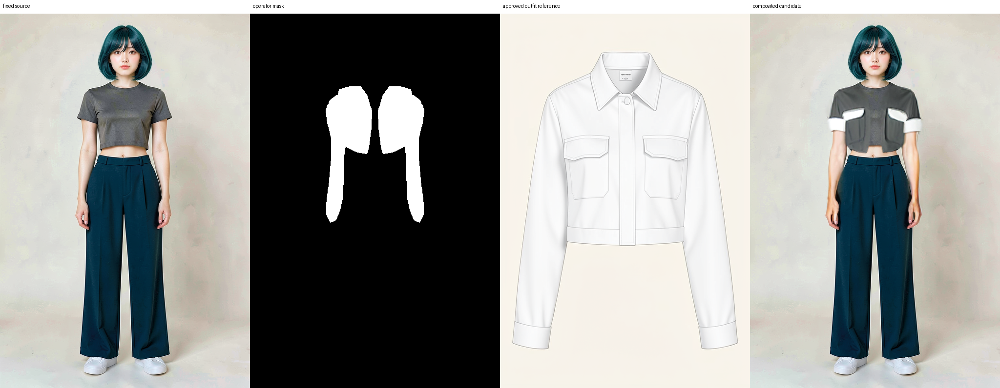

외부 문서도 다음 원인을 점검하게 했다. 이 SDXL inpaint checkpoint는 `1024 x 1024`에서 학습됐고, Diffusers는 mask 주위를 잘라 다시 확대하는 `padding_mask_crop`을 국소 품질 개선 수단으로 안내한다. 따라서 fitted-shell 주변에 padding `64`를 주고 같은 `512 x 768` 출력으로 다시 그린 뒤 합성했다. `26.1초`, peak `2,206 MiB`로 실행은 됐지만 회색 몸판은 남고 소매는 흰 짧은 소매로 바뀌며 open-front도 사라졌다. 국소 해상도 부족만이 원인이라는 가설은 기각한다.

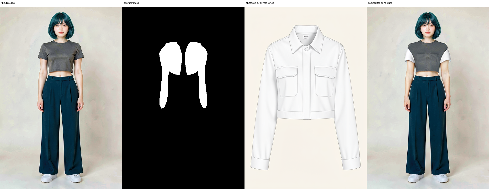

마지막으로 이 결론이 padding `64` 한 조건에만 묶이지 않는지, fitted-shell mask를 고정하고 ten-condition 탐색을 했다. crop padding `32`·`96`, mask border 확장 `4px`·`8px`, adapter scale `0.30`·`1.00`, strength `0.60`·`0.85`, CFG `7`을 기준 조건과 각각 하나씩 비교했다. 모두 `512 x 768`, 30 step, seed `62294`에서 실행됐으며 `16.1`~`23.7초`, peak `1,661`~`2,323 MiB`였다. full-frame 보존은 전부 통과했지만, 열 가지 후보 모두 회색 몸판 또는 짧은 소매에 머물러 **흰 몸판·긴 흰 cuffed 소매·보존된 crop top 위의 open front**를 함께 만족하지 못했다.

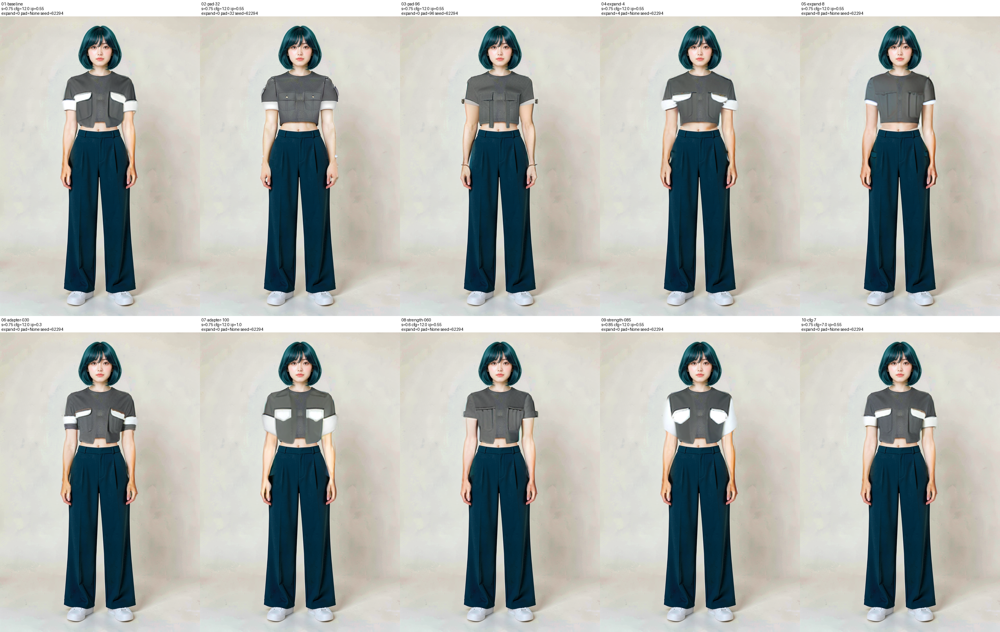

그러므로 이 generic IP-Adapter + SDXL inpaint 경로에서는 mask·crop padding·adapter scale·strength·CFG의 미세 sweep을 끝낸다. 다음 실험은 이 변수들을 더 조절하는 것이 아니라, 흰 원단 색과 open-front 구조를 별도로 조건화할 수 있는 다른 inpaint 모델 또는 conditioning 방식을 비교해야 한다.

이 문제에는 일반 image prompt보다 사람 이미지·의상 이미지·의상 mask를 함께 받도록 학습한 virtual try-on 경로가 더 직접적이다. CatVTON은 `768 x 1024`, bf16, 50 step, seed `62294`에서 peak `5,443 MiB`, `46.7초`로 8 GB GPU에서 실행됐다. 평면 재킷 소품만 넣었을 때는 흰 전면 패널은 생겼지만 긴소매가 빠졌다. 반면 전면 jacket-crop-top 레이어 참조와 중앙 crop top을 보존하는 jacket-shell mask를 결합하자, 긴 흰 소매와 open-front가 함께 나타났다.

목선과 어깨의 회색 잔존을 줄이기 위해 이 mask의 white 영역을 원본 기준 `16px` 확장했다. `8px` 확장은 검은 칼라를 더 남겨 탈락했고, `16px`은 흰 cropped jacket 몸판·긴 소매·전면 포켓·보존된 charcoal crop top을 함께 만들었다. guidance `3.5`에서 전면 버튼선과 포켓 대응이 조금 더 안정됐다. 아래 결과는 fixed preflight의 **사람 검수 후보**일 뿐, P7-5.3 장면이나 제작 자산의 자동 승인을 뜻하지 않는다.

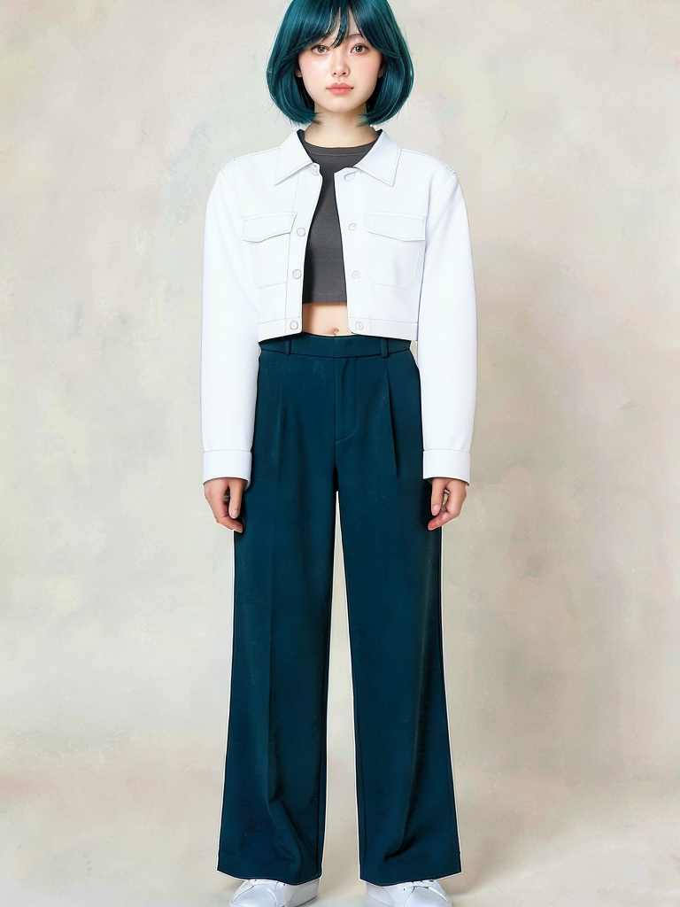

후속 비교에서는 바꿀 값 하나만 남겼다. 같은 jacket-shell `16px` mask·전면 레이어 참조·50 step·seed `62294`에서 guidance `2.5`와 `3.5`는 둘 다 기본 의상 gate를 통과했지만, 목선·좌우 대칭·원단 질감에 사람 검수로 구별할 만큼의 차이를 만들지 못했다. 따라서 guidance sweep은 닫고 `3.5`를 이후의 고정 비교값으로만 쓴다.

흰 재킷 단독 소품을 넣어 레이어 참조의 charcoal crop top을 빼는 대조도 했다. 흰 소매 일부는 전달됐지만 몸판·칼라가 회갈색이 되고 open-front 구조가 깨졌다. 이 입력은 재킷과 crop top의 관계를 보존하지 못하므로 탈락이다. **전면 jacket-crop-top 레이어 참조**는 유지해야 한다.

마지막으로 mask 경계를 분리했다. 손목·어깨·밑단을 더 촘촘히 따르는 fitted-shell에서 경계 여유를 `0px`로 없애면 흰 전면 패널만 남고 어깨·소매는 어두운 원본 색으로 남았다. 같은 fitted-shell을 `16px` 확장하면 흰 cropped jacket·긴 소매·open front·보존된 crop top을 함께 유지했다. 즉 이 고정 입력에서는 세밀한 윤곽만으로 충분하지 않고, **fitted-shell + 16px 확장 + 전면 레이어 참조**가 현재의 사람 검수 후보 조건이다.

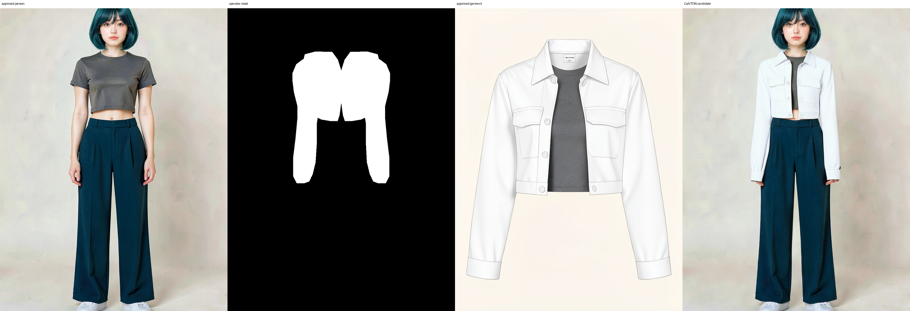

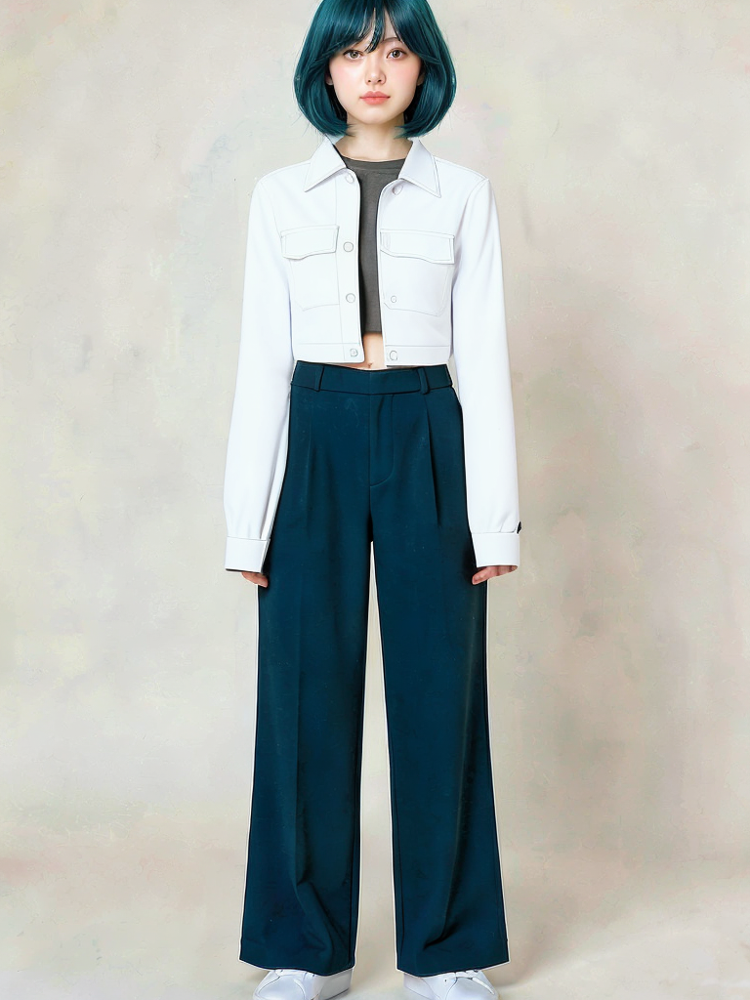

수동 mask SDXL inpaint 대조 실행 전문 보기

승인 full-frame PNG와 사람이 만든 같은 크기의 mask PNG를 명시적으로 전달한 뒤, `--steps`·`--strength`를 바꿔 보존 범위와 편집 범위를 비교합니다.

수동 mask 첫 preflight 검수 기록 보기

mask 범위와 full-frame 보존·요청 의상 gate의 분리 판정을 확인합니다.

수동 mask canvas 수정 후 검수 기록 보기

낮은·높은 strength 조건을 분리해 canvas, mask 밖 보존, 요청 의상 gate를 확인합니다.

수동 mask 10회 반복 검수 기록 보기

strength·CFG·seed·mask 범위를 바꾼 10개 조건과 공통 탈락 기준을 확인합니다.

수동 mask 반복 결과 contact sheet 생성기 보기

10개 실행 폴더의 `run.json`과 composited PNG를 같은 격자로 정리합니다.

의상 참조 IP-Adapter 수동 mask inpaint 실행기 보기

승인 의상 참조 하나를 새 조건으로 추가하고, IP-Adapter와 충돌하는 attention slicing을 피합니다.

의상 참조 IP-Adapter 10조건 탐색 실행기 보기

source·fitted-shell mask·분리 재킷 참조·seed를 고정하고, padding·border·adapter scale·strength·CFG 중 하나만 바꾼 열 조건을 순차 실행합니다.

의상 참조 IP-Adapter 10조건 검수 기록 보기

열 조건의 실제 시간·peak VRAM과 공통 탈락 기준을 확인합니다.

CatVTON 사람·의상·운영자 mask 실행기 보기

CatVTON이 요구하는 person·garment·mask 계약에 승인 입력을 연결하고, 해상도·step·VRAM·실행 시간을 기록합니다.

CatVTON 재킷 후보 검수 기록 보기

통과한 의상 gate와 사람 검수에서 남은 목선·좌우 대칭·원단 질감 점검 항목을 확인합니다.

CatVTON guidance·의상 참조·fitted-shell 경계 비교 기록 보기

guidance sweep, 재킷 단독 참조, 0px/16px fitted-shell 경계의 고정 조건·runtime·탈락 또는 검수 후보 판정을 확인합니다.

CatVTON guidance A/B 준비·실행기 보기

source·mask·garment·seed·step을 고정하고 guidance만 바꿔, 실행 전 계획 JSON과 사람 검수 gate를 남깁니다.

의상 참조 IP-Adapter 첫 검수 기록 보기

호환성, 외부 보존, 재킷 참조 전달을 분리해 판정합니다.

의상 참조 IP-Adapter scale 0.85 검수 기록 보기

같은 입력에서 scale만 올린 비교와 sweep 종료 근거를 확인합니다.

정밀 jacket-shell mask 검수 기록 보기

재킷 구조 회복과 흰 fabric color 실패를 별도 gate로 확인합니다.

fitted-shell raster mask 검수 기록 보기

경계 정밀화 효과와 흰 fabric color 실패가 분리되어 기록됩니다.

fitted-shell 16px border 확장 검수 기록 보기

마스크 경계 여유가 재킷 구조와 색 계약에 미친 영향을 분리해 확인합니다.

분리된 흰 재킷 참조 검수 기록 보기

레이어 참조의 회색 top이 원인인지 분리한 가설 검증 기록입니다.

padding-mask-crop 64 검수 기록 보기

국소 영역 확대가 의상 계약에 미친 영향을 확인합니다.

DiffEdit 첫 8 GB probe 전문 보기

`--steps`와 `--mask-maps`를 바꾸면 자동 mask·VRAM·시간이 어떻게 달라지는지 다시 확인할 수 있습니다.

DiffEdit 첫 probe 검수 기록 보기

실행 조건과 자동 mask·보존·요청 편집의 실패 판정을 확인합니다.

DiffEdit 반복 실험 검수 기록 보기

세 설정의 mask 범위, 출력 보존, VRAM·시간과 제외 결정을 확인합니다.

## 한 컷에 하나의 주 제어만 둔다

| panel | 진입 전략 | 주 ControlNet | 먼저 통과할 항목 | inpaint 대상 |
| --- | --- | --- | --- | --- |
| 01 | face-first | lineart | 얼굴과 시선 | 눈, 앞머리 |
| 02 | pose-first | OpenPose | 전신, 손목, 발 접지 | 손목, 발 |
| 03 | camera-background-first | depth | 원근과 전신 구도 | 실루엣, 배경 |
| 04 | object-first | lineart | 손-소품 접점 | 손, 시선 |

시작 조건은 SD 1.5, character LoRA, ControlNet 하나, `512 x 768`, batch 1입니다. IP-Adapter, 두 번째 ControlNet, high-resolution fix는 동시에 추가하지 않습니다. 전체 frame이 structure와 identity를 통과한 뒤에만 얼굴, 손, 발, 배경 mask를 따로 inpaint합니다.

## 구조만 분리한 OpenPose 실행

먼저 identity 조건을 넣지 않고, 표준 SD 1.5와 `control_v11p_sd15_openpose` 하나만 실제 실행했습니다. 네 held-out 장면에서 OpenPose body map만 추출했습니다. 이 map에는 source 이미지의 얼굴, 머리색, 의상, 가방, 배경 픽셀이 들어가지 않습니다. 같은 짧은 prompt와 seed에서 ControlNet scale `0.0`과 `1.0`만 바꿨습니다.

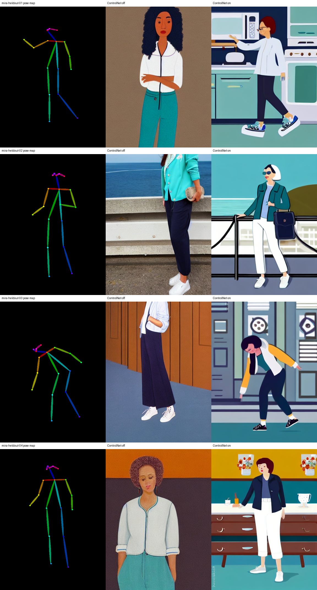

scale `1.0`은 scale `0.0`보다 pose map의 팔·몸통·다리 방향을 따르고, 주방·난간·영화관·작업대의 큰 구조를 더 자주 만들었습니다. peak VRAM은 약 `3,211 MiB`였습니다. 반면 얼굴, 머리, 의상, 가방은 Mira 기준과 일치하지 않습니다. 이는 실패가 아니라 **structure만 부분 통과**한 결과입니다. 이 실험에는 identity 입력이 없으므로 동일 인물성의 근거로 쓰지 않습니다.

WD 1.5와 같은 OpenPose ControlNet을 묶으려는 시도는 text context 차원이 `1024` 대 `768`로 달라 실행 전에 중단했습니다. 따라서 이후 identity 결합은 WD base에 억지로 붙이지 않고, 이 SD 1.5 구조 baseline과 호환되는 별도 identity 조건을 off/on 비교해야 합니다.

## 호환되는 identity 조건을 더한 비교

SDXL OpenPose ControlNet과 SDXL IP-Adapter는 같은 계열이라 결합할 수 있습니다. 새 Mira 전신 기준을 IP-Adapter에 넣고 scale `0.0`과 `0.45`를 비교했습니다. `512 x 768`, 15 step은 일반 CPU offload에서 8 GB OOM이 났지만 sequential CPU offload에서는 완료했습니다.

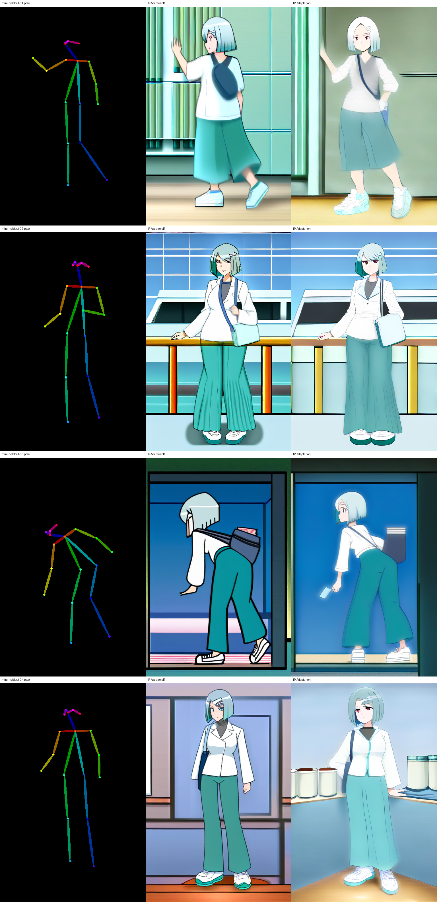

IP-Adapter on은 청록 단발, 흰 재킷, 청록 바지, crossbody 가방을 더 자주 남기면서 큰 pose와 장면 구조도 유지했습니다. 그러나 얼굴 세부, 가방 geometry, 손, 일부 camera와 장소는 여전히 흔들립니다. 따라서 이는 identity와 structure의 **부분 통과**이며, 최종 웹툰 컷 품질 통과가 아닙니다. 실행 조건은 아래 코드에서 확인합니다.

정면·3/4·얼굴·가방 detail을 포함한 다섯 reference도 같은 조건에서 비교했지만, 얼굴·가방 geometry는 안정화되지 않았고 일부 컷은 더 옅어졌습니다. [다중 reference 결과](../../../assets/part-07/chapter-05/p7-5-4-sdxl-multiref-ipadapter-openpose-contact-sheet.png)는 reference 수만 늘려서는 현재 결함을 고치지 못함을 보입니다. 이 경로는 inpaint나 두 번째 ControlNet으로 확장하지 않습니다.

SDXL IP-Adapter OpenPose probe 전문 보기

펼치면 Python 원문을 불러옵니다.

## 카메라 구조를 Canny로 분리해 보기

저각도 cinema 컷에서는 OpenPose보다 인물 실루엣과 배경 원근을 더 많이 담는 Canny 조건도 비교했습니다. 동일한 SDXL 범용 IP-Adapter와 seed에서 Canny scale만 `0.0`과 `0.75`로 바꿨습니다. 입력 Canny에는 기준 이미지의 색·질감이 아니라 윤곽선만 남습니다.

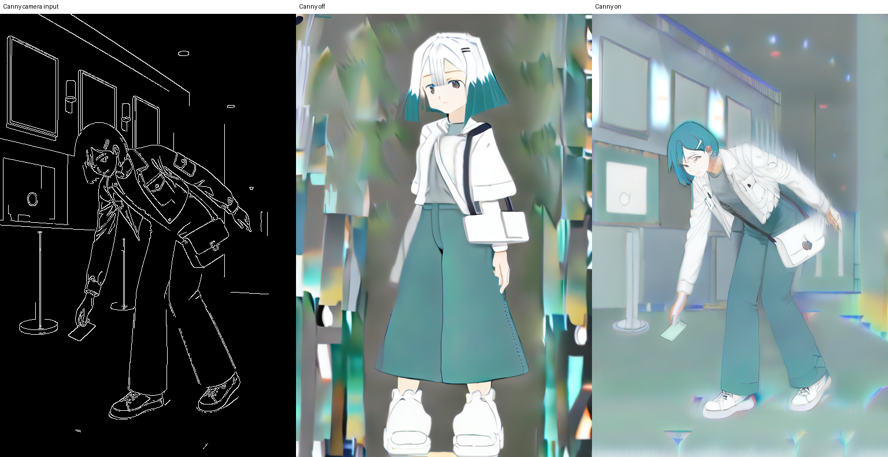

Canny on은 몸을 굽혀 ticket 쪽으로 향하는 큰 방향과 foyer의 사선 원근을 off보다 더 따릅니다. 그러나 얼굴, 가방, 손, 전신 비례는 모두 품질 gate를 통과하지 못했습니다. 이 결과는 Canny가 **camera와 silhouette의 구조 보조 입력**으로는 유효하지만, identity나 작화 품질을 대신하지 못한다는 근거입니다. 이 PNG를 웹툰 완성 컷으로 채택하지 않습니다.

SDXL Canny 카메라 비교 전문 보기

펼치면 Python 원문을 불러옵니다.

## Identity 없이 Canny 구조만 비교하기

앞 비교에는 범용 IP-Adapter가 함께 들어가 있어, Canny가 camera를 바꾼 효과와 identity reference가 만든 효과를 완전히 분리하지 못했습니다. 그래서 옆면 전신 turnaround에서 Canny edge만 추출하고, RGB 원본·IP-Adapter·LoRA·inpaint를 모두 빼고 다시 비교했습니다. 같은 seed `5101`에서 ControlNet scale `0.0`과 `0.75`만 바꿨습니다.

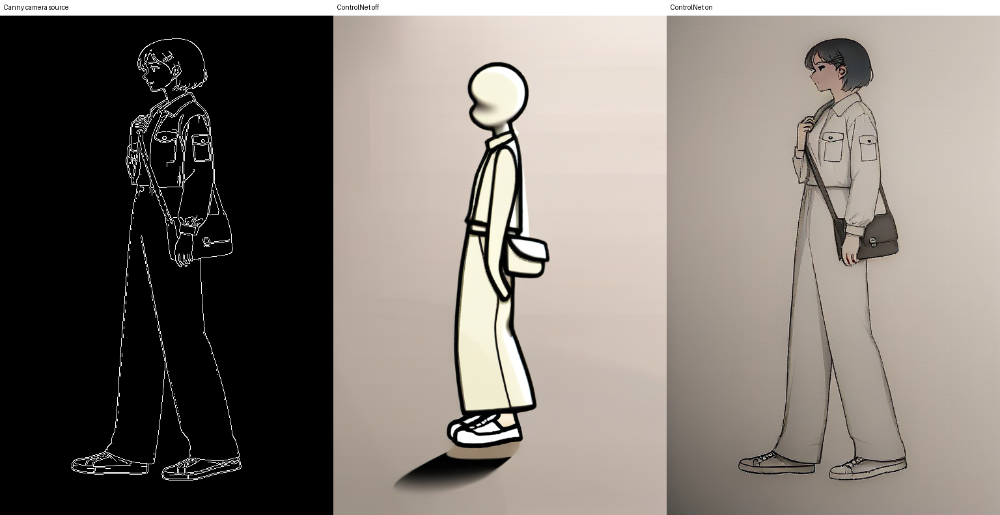

off 결과는 옆면과 전신 비례를 따르지 못한 단순 인물입니다. 반면 on 결과는 왼쪽 side profile, 머리-목-어깨 방향, 전신 frame, 가방과 손의 큰 상대 위치를 Canny source에 가깝게 만듭니다. `512 x 768`, 15 step, sequential CPU offload에서 `33.5초`, 관측 peak VRAM `1,733MiB`로 실행됐습니다. 이 실험은 **camera·silhouette 구조 통과**의 근거입니다. 색, 얼굴, hair clip, 재킷·가방의 정확한 형태는 입력하지 않았으므로 identity나 style의 통과 근거는 아닙니다.

이 결과에서 조작할 값은 `controlnet_conditioning_scale`입니다. `0.0`과 `0.75`를 비교해 side profile과 bag 위치가 실제로 바뀌는지 본 뒤에만, 다음 실험에서 승인한 identity anchor 하나를 추가할 수 있습니다. 아래 코드에서 scale 또는 seed를 바꿔 같은 비교를 반복할 수 있습니다.

SDXL Canny structure-only probe 전문 보기

펼치면 Python 원문을 불러옵니다.

이 구조 baseline에 전신 identity reference 하나를 IP-Adapter scale `0.35`로 추가한 뒤에도 같은 비교를 했다. 정면/3-4 master와 Canny source와 같은 side reference를 각각 넣었지만, 두 경우 모두 side profile 구조는 남은 반면 hair가 옅은 흰색으로 바뀌고 face·bag geometry가 기준으로 돌아오지 않았다. 이 결함은 국소 inpaint 대상이 아니다. 이미 다중 reference와 Plus/Plus Face 비교도 실패했으므로 scale sweep, reference 추가, 두 번째 ControlNet으로 확장하지 않는다.

## Inpaint 전에 하는 panel 판정

결합 출력의 IP-Adapter on 네 panel을 다시 검토한 결과, identity·structure·style이 모두 `pass`인 panel은 없습니다. 따라서 현재 inpaint 가능 panel 수는 `0`입니다. 얼굴, 가방, 손, 소품 접점은 모두 문제이지만, full-frame identity 또는 structure가 먼저 실패한 상태에서 mask 보정으로 통과시키지 않습니다.

로컬 panel review ledger는 각 컷의 결함과 gate를 기록합니다. [review checker](../../../assets/part-07/chapter-05/p7_5_4_panel_review_check.py)는 이 기록에서 full-frame 통과와 repair eligibility가 모순되지 않는지 검사합니다.

후보 교체도 실제로 확인했습니다. SDXL Plus와 Plus Face를 기존 bigG 인코더 대신 ViT-H 인코더에 연결하고, 전신 기준과 독립 얼굴 detail을 별도 adapter slot으로 넣었습니다. `512 x 768`, 15 step, sequential CPU offload에서 두 조합 모두 생성은 완료했으므로 모델 계열·인코더·복수 adapter API·8 GB 실행 경로는 호환됩니다. 그러나 Plus 단독은 가방 geometry와 색 일관성을 충분히 개선하지 못했고, Plus Face 추가는 옆얼굴에 잘못된 세부를 만들며 배경도 약화했습니다. 따라서 이 교체는 quality gate에서 제외합니다. 실패 PNG와 실행 리포트는 보관하지 않습니다.

SDXL Plus 및 Plus Face 교체 프리플라이트 전문 보기

펼치면 Python 원문을 불러옵니다.

## 생성 전에 지키는 입력 계약

이전 manifest 검사기는 삭제했다. P7-5.3의 [FLUX 스토리보드 코드](../../../assets/part-07/chapter-05/p7_5_3_text_to_image_storyboard_spec.py)는 후보 스토리보드를 만들고, 사람 검수로 승인한 PNG를 명시할 때만 lineart·Canny·depth를 파생한다. 현재 A/B/C의 구조 수용 결과는 있지만 공간·조명·그림자까지 통과한 완성 컷은 없으므로, 이 절의 inpaint 판단은 전체 frame 검수 뒤에만 시작한다.

P7-5.4에서 inpaint를 검토할 수 있는 조건도 같다. 먼저 P7-5.3에서 행동·인체·거리 관계가 읽히는 스토리보드와 전체 웹툰 컷을 사람 검수한다. 그 전체 frame이 통과하지 않으면 얼굴·손·발·소품의 mask 보정으로 넘어가지 않는다.

실제 structure probe의 조건은 아래 실행 코드에서 확인합니다.

SD 1.5 OpenPose structure probe 전문 보기

펼치면 Python 원문을 불러옵니다.

## 네 컷으로 최종 판정하기

각 panel은 ControlNet off/on PNG와 identity anchor off/on PNG를 남깁니다. 마지막 contact sheet에서 아래 네 값을 독립적으로 `pass` 또는 `fail`로 기록합니다.

| 항목 | 실패하면 돌아갈 곳 |
| --- | --- |
| identity | 참조 팩, LoRA 데이터, caption |
| structure | pose/depth/line control 입력과 scale |
| style | style sheet, LoRA weight, prompt |
| local detail | 승인한 mask의 inpaint 설정 |

구조가 틀린 컷을 얼굴 inpaint로 고치거나, identity가 흔들리는 컷을 ControlNet scale로 해결하려 하면 원인을 잃습니다. 네 컷 모두가 통과하기 전의 단일 PNG는 파이프라인 통과 근거가 아닙니다.

## 체크리스트

| 확인할 것 | 스스로 답할 질문 |
| --- | --- |
| 승인 | 참조 팩·권리·컷별 control image가 모두 승인됐는가? |
| 비교 | ControlNet과 identity anchor의 on/off 비교를 분리했는가? |
| 보정 | 전체 구조 통과 뒤에만 mask inpaint를 했는가? |
| 연속성 | 네 컷 contact sheet에서 같은 기준으로 pass/fail을 기록했는가? |

## 출처와 참고 자료

- Zhang et al., [ControlNet](https://github.com/lllyasviel/ControlNet){: target="_blank" rel="noopener noreferrer" }, 확인일: 2026-08-02.
- Tencent AI Lab, [IP-Adapter](https://github.com/tencent-ailab/IP-Adapter){: target="_blank" rel="noopener noreferrer" }, 확인일: 2026-08-03.
- Hugging Face, [Diffusers IP-Adapter guide](https://huggingface.co/docs/diffusers/v0.36.0/using-diffusers/ip_adapter){: target="_blank" rel="noopener noreferrer" }, 확인일: 2026-08-03.
- Comfy-Org, [ControlNet workflow](https://docs.comfy.org/tutorials/controlnet/controlnet){: target="_blank" rel="noopener noreferrer" }, 확인일: 2026-08-02.
- Comfy-Org, [Inpainting](https://docs.comfy.org/tutorials/basic/inpaint){: target="_blank" rel="noopener noreferrer" }, 확인일: 2026-08-02.
- NVIDIA, [Unified and System Memory](https://docs.nvidia.com/cuda/cuda-programming-guide/02-basics/understanding-memory.html){: target="_blank" rel="noopener noreferrer" }, 확인일: 2026-08-09. CUDA Unified Memory의 운영체제·하드웨어별 조건, Linux HMM/ATS와 Windows·WSL 제한을 확인했다.
- Comfy-Org, [Changelog](https://docs.comfy.org/changelog){: target="_blank" rel="noopener noreferrer" }, 확인일: 2026-08-09. Dynamic VRAM, FP16 intermediates, FP8·동적 offload 관련 변경을 확인했다.
- Hugging Face, [Reduce memory usage](https://huggingface.co/docs/diffusers/optimization/memory){: target="_blank" rel="noopener noreferrer" }, 확인일: 2026-08-09. sequential/group/disk offload와 layerwise casting의 메모리·속도·PEFT 호환성 한계를 확인했다.
- Hugging Face, [SDXL Inpainting 0.1](https://huggingface.co/diffusers/stable-diffusion-xl-1.0-inpainting-0.1){: target="_blank" rel="noopener noreferrer" }, 확인일: 2026-08-09. SDXL inpaint 기준 checkpoint와 라이선스·학습 해상도를 확인했다.
- Hugging Face, [Diffusers inpainting guide](https://huggingface.co/docs/diffusers/en/using-diffusers/inpaint){: target="_blank" rel="noopener noreferrer" }, 확인일: 2026-08-10. `padding_mask_crop`의 국소 crop·확대·원본 합성 동작을 확인했다.
- Chong et al., [CatVTON 공식 구현](https://github.com/Zheng-Chong/CatVTON){: target="_blank" rel="noopener noreferrer" }, 확인일: 2026-08-10. person·garment·mask 입력 계약, `1024 x 768` 8 GB 미만 추론 주장, CC BY-NC-SA 4.0 이용 조건을 확인했다.
- Hugging Face, [DiffEdit](https://huggingface.co/docs/diffusers/v0.17.0/api/pipelines/diffedit){: target="_blank" rel="noopener noreferrer" }, 확인일: 2026-08-09. prompt 차이로 semantic edit mask를 추정하는 비교 수단을 확인했다.
- Hugging Face, [SD 3.5 Medium](https://huggingface.co/stabilityai/stable-diffusion-3.5-medium){: target="_blank" rel="noopener noreferrer" }, 확인일: 2026-08-09. 공식 4-bit 추론 예시와 모델 라이선스를 확인했다.
- Tencent ARC, [T2I-Adapter](https://github.com/TencentARC/T2I-Adapter){: target="_blank" rel="noopener noreferrer" }, 확인일: 2026-08-09. 공식 SDXL 예시의 최소 15 GB 추론 조건을 확인했다.
- Hertz et al., [StyleAligned](https://style-aligned-gen.github.io/){: target="_blank" rel="noopener noreferrer" }, 확인일: 2026-08-09. 학습 없이 reference style을 공유 attention으로 맞추는 연구 후보와 재현 조건의 한계를 확인했다.
- Black Forest Labs, [FLUX.2 Klein LoRA 학습 안내](https://huggingface.co/blog/black-forest-labs/flux-2-klein-lora){: target="_blank" rel="noopener noreferrer" }, 확인일: 2026-08-07. Base 4B 학습, 15–40장 스타일 예시, 약 24 GB VRAM의 공식 예제 조건과 edit LoRA의 `control_path` 형식을 확인했다.
- Hugging Face, [FLUX.1-dev QLoRA 안내](https://huggingface.co/blog/flux-qlora){: target="_blank" rel="noopener noreferrer" }, 확인일: 2026-08-07. 공식 사례의 약 9 GB peak와 저메모리 설정을 비교 근거로 사용했다.
