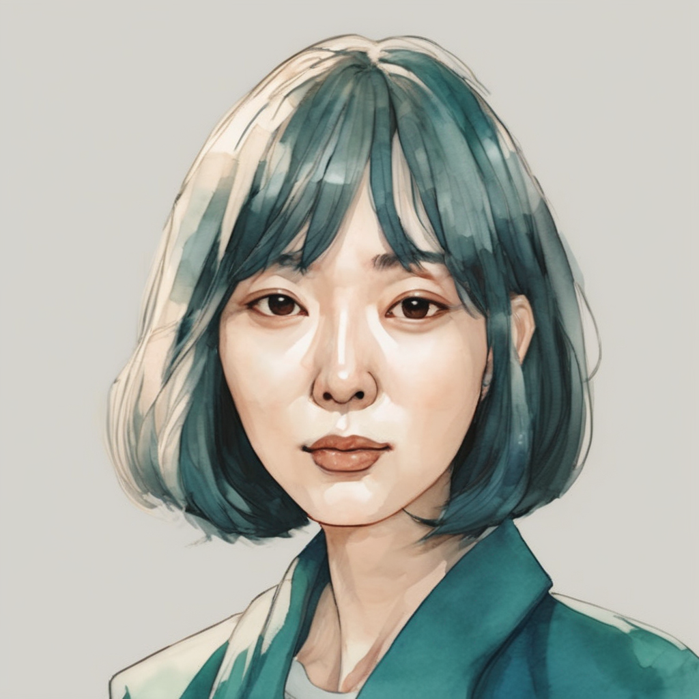
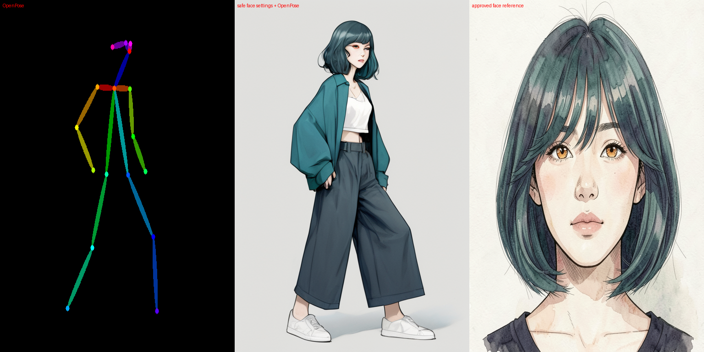
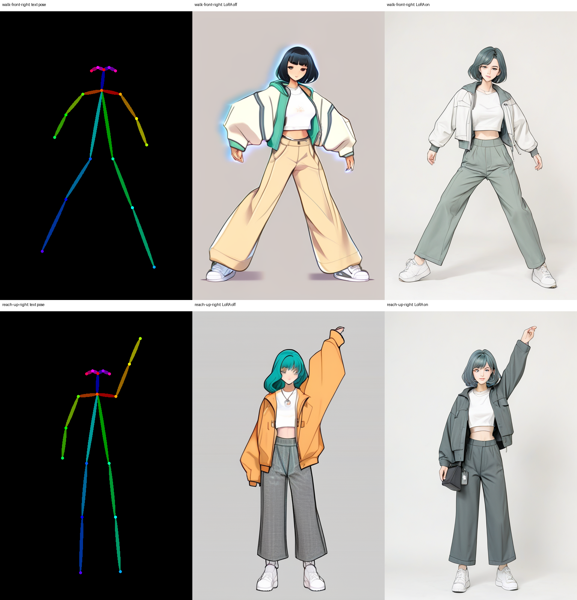
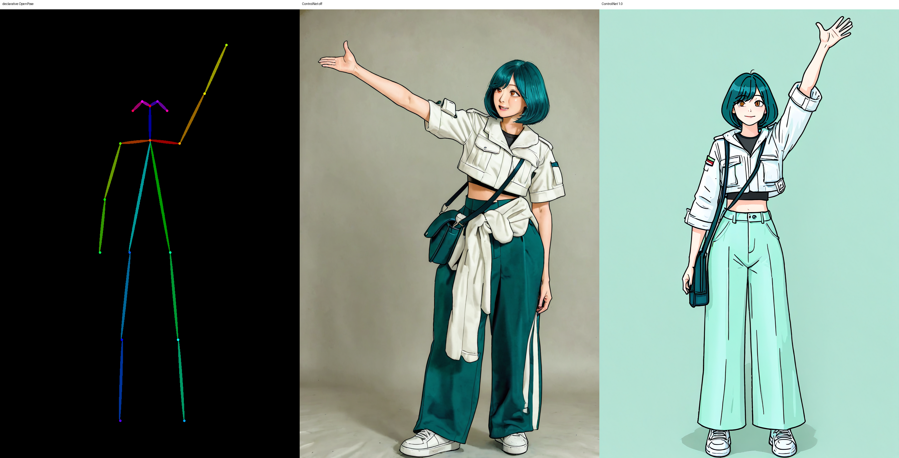
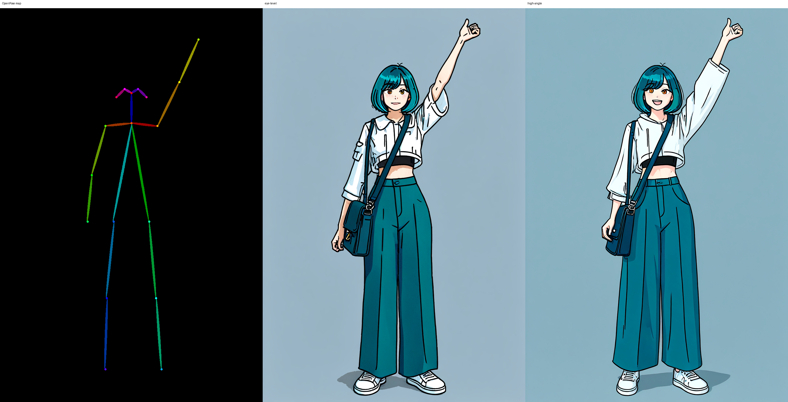
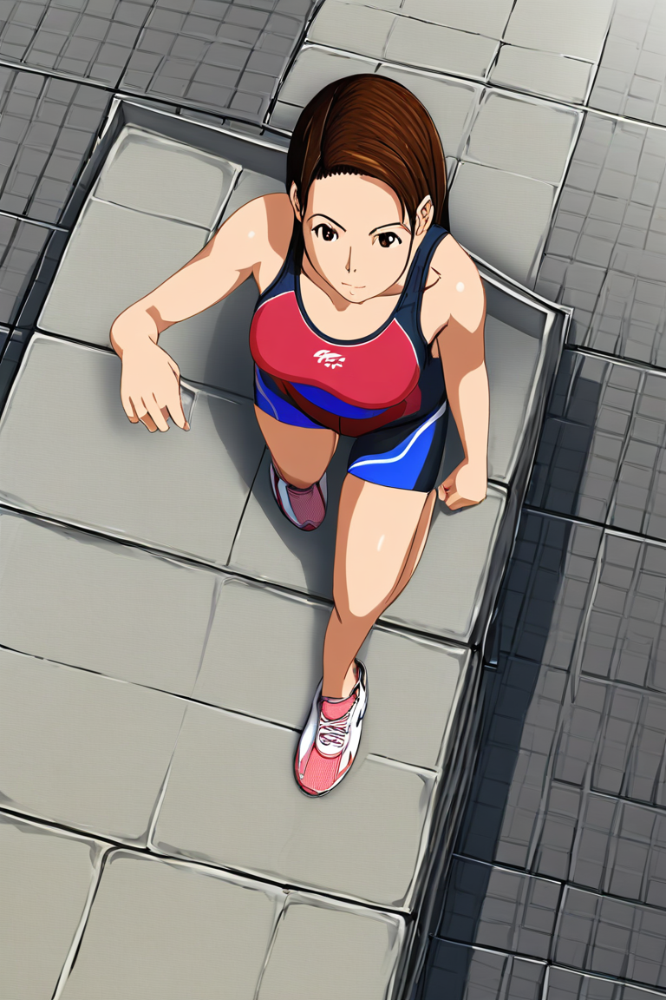
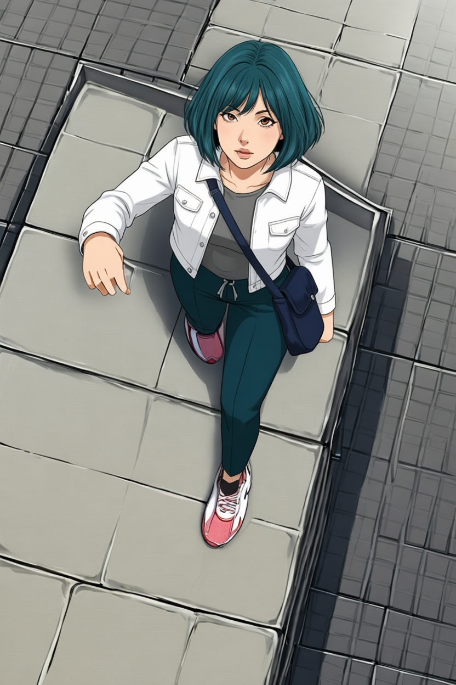
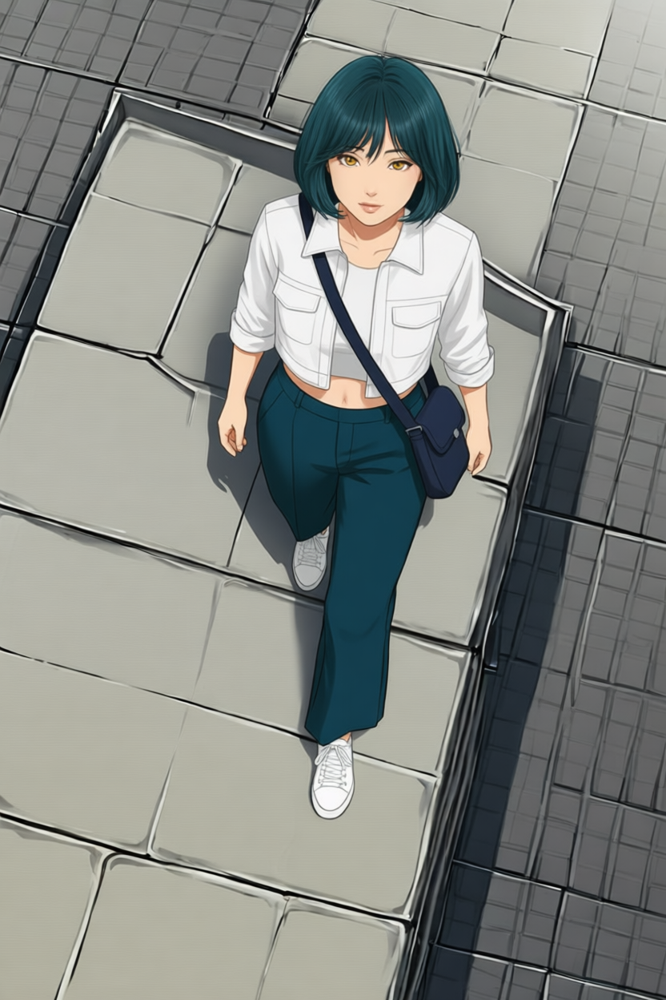

# P7-5.4 화풍·연속성 보정: 컷신의 구조와 디테일을 분리해 고치기

> Section ID: `P7-5.4`
> Version: `v2026.08.21`

같은 캐릭터를 다른 카메라와 동작에서도 다시 그릴 수 있을까? 이 절에서는 한 장이 그럴듯한지를 보지 않고, 아래 네 계약을 동시에 확인했다. 실험은 하나의 도구를 고르는 과정이 아니라, 어느 계약이 깨지는지 찾아 다음 입력의 역할을 좁히는 과정이었다.

| 계약 | 확인할 질문 |
| --- | --- |
| structure | 카메라, 인체 동작, 거리와 가림이 장면 의도에 맞는가? |
| identity | 얼굴과 신체 비율이 같은 캐릭터로 읽히는가? |
| outfit | 재킷·상의·바지·신발·가방의 형태와 레이어가 유지됐는가? |
| style | 승인한 선화·색·질감의 범위 안에 있는가? |

여기서 **계약**은 생성기에 요구하는 문장이 아니라, 결과를 보고 사람이 판정하는 약속이다. structure는 “카메라와 몸의 큰 배치가 맞는가”, identity는 “같은 사람으로 보이는가”, outfit은 “옷과 소품의 형태·겹침이 맞는가”, style은 “승인한 그림 방식과 어울리는가”로 읽는다. 한 계약만 통과해도 다른 계약의 실패를 덮어쓰지 않는다.

!!! abstract "실험 결론"

    수평 시점에서 확인한 캐릭터 계약은 고각도에서 함께 깨졌다. 얼굴·동작·카메라·복장을 하나의 조건에 맡긴 보조 실험들은 각각 일부 계약만 보존했다. 최종적으로 고각도 guide, 정면 얼굴, 완성 착장을 서로 다른 입력 역할로 나눈 Qwen 편집에서 네 계약을 함께 통과했다. 아래의 `보조 실험`은 이 역할 분리가 필요한 이유와 적용 범위를 확인한 기록이다.

아래 흐름은 도구의 이름이 아니라 **실패한 계약이 다음 선택을 어떻게 바꾸었는지**를 압축한다. 뒤의 보조 실험은 각 화살표의 근거다.

```mermaid
--8<-- "assets/part-07/chapter-05/p7-5-4-experiment-decision-flow-ko.mmd"
```

## 고각도에서는 네 계약이 함께 흔들렸다

FLUX는 수평에 가까운 정면·쿼터 전신에서 청록 단발, 호박색 눈, 흰 크롭 재킷, 청록 와이드 바지, 흰 운동화, 남색 가방의 관계를 비교적 안정적으로 재현했다. 문제가 된 것은 카메라가 위로 올라간 뒤였다. 고각도에서는 얼굴, 재킷 레이어, 와이드 바지 실루엣, 가방의 앞뒤 가림이 함께 흔들렸다.

그래서 이후의 질문은 “수평 결과를 조금 더 다듬을 수 있는가?”가 아니었다. **고각도에서 바뀌는 구조를 누가 맡고, 그 안에서 얼굴·복장·화풍을 누가 보존할 것인가?**가 되었다.

## 정상적인 얼굴 생성과 전신 캐릭터 재현은 다른 검증이다

> **이 보조 실험이 확인한 것:** 50 step의 base model은 얼굴을 만들 수 있지만, 전신에 조건을 결합한 뒤의 identity·outfit 실패를 그 문제로 환원할 수는 없다.

먼저 reference·ControlNet·LoRA를 모두 제외한 SDXL Base 1.0 단독으로 정상적인 정면 얼굴이 형성되는지 확인했다. `1024×1024`, 50 step, CFG `5.0`, seed `62295`에서 청록 단발·호박색 눈·수채화 웹툰이라는 텍스트만 주었다. 이 결과는 Mira identity의 승인 기준이 아니라, **base model이 얼굴 자체를 만들 수 있는가**를 분리한 기준선이다.



따라서 전신 결과에서 얼굴이나 정체성이 흔들린다고 해서 base model이 얼굴을 전혀 만들지 못한다고 해석할 수는 없다. 아래 실행 기록은 이 기준선의 prompt·seed·해상도와 제외한 조건을 보관한다.

<details id="sdxl-base-face-result" class="aibook-lazy-source" data-source="/AiBook/assets/part-07/chapter-05/p7-5-4-sdxl-base-face-50step-result.json" data-language="json">
<summary><code>p7-5-4-sdxl-base-face-50step-result.json</code> · JSON · SDXL Base 얼굴 기준선 실행 기록 보기</summary>
<div class="aibook-lazy-source__body">prompt·seed·해상도와 제외한 조건을 불러옵니다.</div>
</details>

같은 생각으로 전신에서는 FaceID와 전신 착장 image adapter를 빼고 Plus Face `0.15`, character LoRA `0.30`, seed `62295`, CFG `5.0`, `960×1440`, 50 step을 고정해 OpenPose off/on을 비교했다. OpenPose를 켜면 다리·몸통의 2D 배치는 더 따랐지만, 머리 길이와 복장이 이탈했다. off도 얼굴 윤곽과 전신은 만들었으나 승인 재킷·바지·가방은 유지하지 못했다.




이 두 비교에서는 “얼굴이 그럴듯한가”만 보지 않는다. OpenPose on/off 시트에서는 다리·몸통의 배치가 map에 가까워졌는지를, 얼굴 기준 비교에서는 그 과정에서 청록 단발·승인 재킷·와이드 바지·가방이 같은 캐릭터 계약으로 남았는지를 따로 본다. 즉 구조 단서가 좋아진 한 후보를 곧바로 전체 통과로 읽지 않는 비교다.

저해상도 `512×768`에서 50/100 step도 비교했다. step을 늘려도 identity·outfit이 자동으로 승인 기준에 수렴하지 않았다. step과 해상도는 얼굴·구조 형성의 조건일 수 있지만, 캐릭터 고정이나 복장 가림 관계를 대신하지 않는다. 아래 기록에 전신 off/on 조건을 남겼다.

<details id="sdxl-safe-face-off-result" class="aibook-lazy-source" data-source="/AiBook/assets/part-07/chapter-05/p7-5-4-sdxl-safe-face-without-openpose-960x1440-result.json" data-language="json">
<summary><code>p7-5-4-sdxl-safe-face-without-openpose-960x1440-result.json</code> · JSON · OpenPose off 실행 기록 보기</summary>
<div class="aibook-lazy-source__body">전신 조건과 생성 설정을 불러옵니다.</div>
</details>

<details id="sdxl-safe-face-on-result" class="aibook-lazy-source" data-source="/AiBook/assets/part-07/chapter-05/p7-5-4-sdxl-safe-face-with-openpose-960x1440-result.json" data-language="json">
<summary><code>p7-5-4-sdxl-safe-face-with-openpose-960x1440-result.json</code> · JSON · OpenPose on 실행 기록 보기</summary>
<div class="aibook-lazy-source__body">전신 조건과 생성 설정을 불러옵니다.</div>
</details>

얼굴 조건을 더 강하게 넣어도 전신 계약이 따라오지는 않았다. FaceID 단독은 전신 frame을 남겼지만 검은 장발·다른 착장으로 바뀌었고, FullFace 결합은 청록 단발·호박색 눈 단서를 늘렸지만 흉상 구도로 수렴했다. 이 비교는 얼굴 embedding을 세게 주는 것만으로 전신 캐릭터가 재현되지는 않는다는 뜻이다.

| FaceID 단독 | FaceID + FullFace |
| --- | --- |
|  |  |
| 전신 frame 일부 유지, identity·outfit 미통과 | 얼굴 단서는 일부 회복, 전신·outfit 미통과 |

왼쪽 후보는 전신 구도를 남겼지만 얼굴과 착장이 승인 기준에서 벗어나고, 오른쪽 후보는 얼굴 단서를 늘리는 대신 흉상으로 좁아진다. 이 교환은 얼굴 reference의 강도를 올리는 일이 전신 구도·복장을 보존하는 조건과 독립적이지 않음을 보여 준다. 따라서 이 절에서는 두 후보 모두 전체 캐릭터 재현의 통과 사례로 쓰지 않는다.

## 삭제한 FLUX 학습셋은 LoRA 근거로 쓰지 않는다

P7-5.2의 방향 원본과 P7-5.4의 동작 원본으로 구성했던 FLUX 승인 이미지·review·54컷 manifest는 모두 제거했다. 따라서 이 절은 해당 데이터셋의 LoRA 효과를 현재 근거로 사용하지 않는다. 새 학습셋은 생성 모델, 이미지, 사람 검수 기록, caption·hash manifest를 한 세트로 새로 승인한 뒤에만 실험에 연결한다.

LoRA on은 off보다 화풍과 착장 경향을 끌어올 수 있지만, 정확한 얼굴·동작·가방을 단독으로 고정하지는 못한다. FacePlus와 FaceID를 함께 써도 얼굴 단서는 보조할 뿐 전신 계약을 통과시키지 못했다.

| character LoRA on/off | FacePlus + FaceID |
| --- | --- |
|  |  |
| 화풍·착장 경향은 보조 | 얼굴 단서는 생겨도 전신 계약 미통과 |

이 비교가 말하는 것은 데이터 수만으로 새 동작을 모두 해결할 수 없다는 점이다. 얼굴·동작·가방의 정확한 관계는 별도 조건 없이는 흔들리므로, 얼굴 개선만을 성공으로 세지 않는다.

## OpenPose는 2D 관절 배치까지만 전달했다

> **이 보조 실험이 확인한 것:** OpenPose는 팔·다리·접지의 2D 배치를 전달하지만, 고각도 카메라와 3D 가림 관계를 결정하지는 않는다.

강화한 LoRA를 넣은 뒤에는 OpenPose가 무엇을 실제로 맡는지 다시 확인했다. P7-5.2의 승인 전신에서 저장한 우측 쿼터 skeleton map을 재사용해 detector를 매번 다시 실행하지 않도록 했다. 아래 비교는 왼쪽의 입력 map과 그 map을 사용한 ControlNet off/on 산출물을 함께 보여 준다.


검수 시트의 왼쪽은 입력 map, 가운데는 ControlNet off, 오른쪽은 `1.0` 조건이다. 오른쪽 후보의 다리·발 배치가 map 쪽으로 더 가까워진 것이 이 실험에서 확인할 수 있는 효과다. 반면 map에는 카메라가 어디에 있는지, 머리와 흉곽이 얼마나 회전했는지, 가방이 몸의 앞·뒤 어느 쪽을 지나야 하는지가 들어 있지 않다. 그래서 이 비교는 2D 관절 배치의 보조 효과만 보여 주며, 고각도 전체 컷의 통과 증거는 아니다.

Animagine XL `960×1440`, 30 step에서 LoRA `0.6`을 고정했을 때, 저장 우측 쿼터 map의 ControlNet `1.0`은 `0.0`보다 다리·발의 2D 배치를 더 잘 따르면서 단발·눈·재킷·와이드 바지·가방을 일부 남겼다. 선언형 오른팔 올리기 map에서도 `1.0`은 팔의 방향을 따라갔다. 반면 LoRA를 `0.8`로 올리면 바지가 거의 흰색이 되고, high-angle 문구를 보태도 위에서 내려다보는 원근은 생기지 않았다.

| 동작 guide off/on | LoRA `0.6/0.8` |
| --- | --- |
|  |  |
| 팔의 2D 구조는 map에 맞춰짐 | scale 상승은 색 계약의 해법이 아님 |



선언형 동작 시트는 같은 팔 방향을 요구할 때 ControlNet이 팔의 2D 방향을 어느 정도 따르게 하는지, LoRA scale 시트는 그 강도를 높인다고 의상 색이 자동으로 안정되지는 않는지를 보여 준다. 마지막 시트는 high-angle 문구만 추가해도 시점 원근이 바뀌지 않는 경우다. 세 비교를 함께 읽으면 관절 배치, 화풍·복장, 카메라 원근은 서로 다른 입력 역할로 다뤄야 한다는 결론이 나온다.

이 결과가 가리킨 다음 문제는 분명했다. OpenPose는 팔·다리·접지의 **2D 배치**를 전달할 수 있지만, 카메라의 3D 원근, 머리·흉곽 회전, 가방의 앞뒤 가림을 결정하지는 못한다. 따라서 고각도에는 별도의 구조용 guide가 필요했다. 아래 실행 기록은 저장 map, 동작 off/on, LoRA scale, 카메라 문구 비교의 조건을 보관한다.

<details id="openpose-static-quarter-right-report" class="aibook-lazy-source" data-source="/AiBook/assets/part-07/chapter-05/p7-5-4-openpose-static-quarter-right-report.json" data-language="json">
<summary><code>p7-5-4-openpose-static-quarter-right-report.json</code> · JSON · 저장 map 비교 기록 보기</summary>
<div class="aibook-lazy-source__body">저장한 우측 쿼터 map의 비교 조건을 불러옵니다.</div>
</details>

<details id="openpose-declarative-controlnet-report" class="aibook-lazy-source" data-source="/AiBook/assets/part-07/chapter-05/p7-5-4-openpose-declarative-reach-up-controlnet-ab-report.json" data-language="json">
<summary><code>p7-5-4-openpose-declarative-reach-up-controlnet-ab-report.json</code> · JSON · 동작 OpenPose off/on 비교 기록 보기</summary>
<div class="aibook-lazy-source__body">선언형 동작 map과 ControlNet 비교 조건을 불러옵니다.</div>
</details>

<details id="openpose-declarative-lora-scale-report" class="aibook-lazy-source" data-source="/AiBook/assets/part-07/chapter-05/p7-5-4-openpose-declarative-reach-up-lora-scale-ab-report.json" data-language="json">
<summary><code>p7-5-4-openpose-declarative-reach-up-lora-scale-ab-report.json</code> · JSON · LoRA scale 비교 기록 보기</summary>
<div class="aibook-lazy-source__body">LoRA scale 비교 조건을 불러옵니다.</div>
</details>

<details id="openpose-declarative-camera-report" class="aibook-lazy-source" data-source="/AiBook/assets/part-07/chapter-05/p7-5-4-openpose-declarative-reach-up-camera-ab-report.json" data-language="json">
<summary><code>p7-5-4-openpose-declarative-reach-up-camera-ab-report.json</code> · JSON · 카메라 문구 비교 기록 보기</summary>
<div class="aibook-lazy-source__body">카메라 문구만 바꾼 비교 조건을 불러옵니다.</div>
</details>

## 고각도 guide와 캐릭터 전이는 따로 검증해야 했다

고각도 스토리보드 자체가 병목은 아니었다. 캐릭터 정보가 없는 익명 인물로 지붕·원근·보행 배치만 가진 초안을 만들 수 있었다. 이 실험에서는 Animagine으로 고각도 스토리보드를 만들고, 그 결과를 카메라와 동작을 분리한 구조용 guide로 사용했다. 이 용도는 Animagine의 일반적 역할이나 최종 캐릭터 생성 가능성을 규정하지 않는다.



### SDXL에서는 구조 조건을 나눠도 네 계약을 합치지 못했다

> **이 보조 실험이 확인한 것:** 인물 외곽을 뺀 background Canny와 OpenPose는 분리할 수 있지만, 현 8 GB SDXL 경로는 고각도·동작·identity·outfit을 함께 통과시키지 못했다.

그 guide의 인물 RGB·얼굴·복장은 버리고, OpenPose와 **인물을 제외한 배경 Canny**만 SDXL에 전달했다. SDXL Base 1.0, character LoRA `0.6`, seed `62431`, 50 step, `768×1152`에서 구조 조건을 하나씩 켠 비교다.


여기서 익명 guide는 최종 캐릭터 reference가 아니다. 원본 guide의 인물 RGB·얼굴·복장을 버린 뒤, 몸의 2D 배치와 사람을 뺀 배경의 원근 단서만 각각 전달했을 때를 비교한다. 따라서 시트의 후보가 guide 인물과 닮지 않는 것은 실패가 아니라, 구조 조건과 캐릭터 조건을 섞지 않았는지 확인하기 위한 전제다.

구조 조건이 없으면 high-angle이 사라졌다. OpenPose만 켜면 위쪽 카메라의 단서는 일부 남아도 달리기 동작이 앉거나 쪼그린 자세로 바뀌었다. 배경 Canny만 켜면 타일 원근은 남지만 인물 실루엣이 중복되었다. 두 ControlNet을 함께 쓰는 조건은 `768×1152`와 `512×768` 모두 현재 8 GB sequential-offload Diffusers 경로에서 완료되지 않았다. 사람 외곽을 뺀 background Canny와 pose/camera 입력 분리는 유효한 체크포인트였지만, 이 SDXL 경로는 고각도·동작·Mira identity·복장을 함께 재현하는 제작 도구로는 미통과다. 아래 검수·실행 기록에 판정과 조건을 보관했다.

<details id="sdxl-anonymous-high-angle-transfer-review" class="aibook-lazy-source" data-source="/AiBook/assets/part-07/chapter-05/p7-5-4-sdxl-anonymous-high-angle-transfer-review.json" data-language="json">
<summary><code>p7-5-4-sdxl-anonymous-high-angle-transfer-review.json</code> · JSON · 익명 고각도 전이 검수 기록 보기</summary>
<div class="aibook-lazy-source__body">각 조건의 계약 판정을 불러옵니다.</div>
</details>

<details id="sdxl-anonymous-high-angle-transfer-report" class="aibook-lazy-source" data-source="/AiBook/assets/part-07/chapter-05/p7-5-4-sdxl-anonymous-high-angle-transfer-report.json" data-language="json">
<summary><code>p7-5-4-sdxl-anonymous-high-angle-transfer-report.json</code> · JSON · 익명 고각도 전이 실행 조건 보기</summary>
<div class="aibook-lazy-source__body">생성 경로와 조건을 불러옵니다.</div>
</details>

### depth·Canny는 원근을 남겨도 승인 복장을 보장하지 않았다

depth와 역할 분리 adapter도 같은 경계를 보였다. 고각도 depth scaffold, 전신 완성 착장 global 조건, 얼굴 face 조건, character·outfit LoRA를 나눠 연결하면 타일 바닥 원근과 머리·눈 단서는 일부 남았다. 그러나 흰 크롭 재킷은 짧은 흰 상의가 되고 가방·strap은 사라졌다.


Canny도 카메라·실루엣의 보조 조건으로는 쓸 수 있었지만, 최근 사선 보행 후보에서는 얼굴·바지·가방 일부가 남는 대신 흰 재킷 레이어가 빠졌다. 구조를 더 강하게 전달하는 일과 승인 복장을 보존하는 일은 여전히 경쟁했다.


두 시트는 depth나 Canny가 쓸모없다는 판정이 아니다. depth 시트는 바닥 원근과 얼굴 단서가 남아도 재킷·가방의 겹침까지 보장하지 않는 사례이고, Canny 시트는 사선 camera와 실루엣을 보조해도 의상 레이어를 독립적으로 지켜 주지 않는 사례다. 그래서 다음 입력에는 구조를 더 세게 누적하는 대신, 완성 착장을 독립 reference로 유지했다.

### 실패 관찰을 다음 입력 역할로 번역하기

| 관찰한 결과 | 피한 해석 | 다음 선택 |
| --- | --- | --- |
| 50 step Base는 얼굴을 만들지만 전신 조건에서는 identity·outfit이 이탈 | step만 늘리면 캐릭터가 고정된다는 해석 | 얼굴·착장·구조 조건의 역할을 분리 |
| OpenPose는 팔·다리의 2D 배치를 따르게 함 | OpenPose가 카메라 회전까지 결정한다는 해석 | 고각도 camera는 별도 guide로 제공 |
| depth·Canny는 원근 또는 실루엣을 남기지만 재킷·가방이 빠짐 | 구조 조건을 강하게 주면 복장도 따라온다는 해석 | 완성 착장을 독립 reference로 유지 |
| mask·VTON은 수평 레이어를 부분 보정 | 국소 편집이 새 3D 가림 관계를 만들 수 있다는 해석 | 전신 계약이 맞는 생성 단계로 되돌아감 |

이 표가 중요한 이유는 “어떤 모델이 좋았는가”보다, 실패를 다음 조건의 역할로 번역했기 때문이다. 이 번역이 없으면 adapter·step·mask를 계속 누적하는 실험이 되지만, 역할을 분리하면 어느 입력을 바꿔야 하는지 다시 판단할 수 있다.

## 국소 보정은 새 카메라의 3D 가림 관계를 만들지 못했다

> **이 보조 실험이 확인한 것:** mask·VTON은 이미 성립한 수평 레이어를 부분 보정할 수 있어도, 고각도에서 새로 보이거나 가려지는 전신 관계를 재구성하지는 못한다.

고각도에서 문제를 국소 영역만 고쳐 해결할 수 있는지도 확인했다. 자동 DiffEdit mask는 머리와 신발까지 퍼져 재킷만 고치지 못했다. FitDiT에는 고각도 원본의 카메라·자세·하체를 고정하고 상반신만 감싼 좁은 mask와 완성 착장을 주었지만, 재킷은 회색 덩어리와 짧은 흰 앞면으로 바뀌고 가방·strap이 사라졌다. CatVTON은 수평 전면에서 재킷 레이어를 부분적으로 전달했지만, 고각도 전신을 다시 구성하는 증거는 아니었다.

| DiffEdit 자동 mask | FitDiT 고각도 상반신 | CatVTON 수평 재킷 |
| --- | --- | --- |
|  |  |  |
| 편집 범위가 전신으로 확산 | 어깨·재킷·가방의 새 가림 관계 미통과 | 수평 재킷 레이어만 부분 통과 |

세 결과는 같은 실패가 아니다. DiffEdit은 고칠 영역을 충분히 좁히지 못했고, FitDiT는 좁힌 영역 안에서도 새 카메라가 요구한 어깨·가방의 앞뒤 관계를 만들지 못했다. CatVTON은 수평 전면에서 이미 성립한 레이어를 옮긴 사례다. 따라서 마지막 결과를 고각도 전신의 증거로 확장하지 않고, 국소 보정은 구조가 먼저 통과한 뒤에만 쓰는 후보로 남긴다.

이 결과는 mask를 더 정교하게 그리거나 reference를 더 주는 일이 고각도에서 새로 보이거나 가려지는 팔·몸통·다리·가방의 관계를 대신하지 못한다는 뜻이다. 아래 실행 기록은 각 조건을 남긴다.

<details id="fitdit-high-angle-upperbody-result" class="aibook-lazy-source" data-source="/AiBook/assets/part-07/chapter-05/p7-5-4-fitdit-high-angle-upperbody-complete-outfit-result.json" data-language="json">
<summary><code>p7-5-4-fitdit-high-angle-upperbody-complete-outfit-result.json</code> · JSON · FitDiT 고각도 상반신 실행 기록 보기</summary>
<div class="aibook-lazy-source__body">mask·착장 reference·생성 조건을 불러옵니다.</div>
</details>

<details id="sdxl-depth-role-separated-result" class="aibook-lazy-source" data-source="/AiBook/assets/part-07/chapter-05/p7-5-4-sdxl-depth-role-separated-result.json" data-language="json">
<summary><code>p7-5-4-sdxl-depth-role-separated-result.json</code> · JSON · SDXL depth 역할 분리 실행 기록 보기</summary>
<div class="aibook-lazy-source__body">depth·adapter·LoRA 역할 분리 조건을 불러옵니다.</div>
</details>

### 보조 조건의 결합은 보조 실험 안에 한정됐다

OpenPose와 depth·Canny는 구조 조건, FaceID·FacePlus·IP-Adapter·LoRA는 캐릭터 조건, mask·VTON은 생성 뒤 국소 보정으로 분리했다. 아래 도식은 **SDXL·Animagine 보조 실험에서만** 이 조건들이 만나는 위치를 보여 준다. Qwen의 세 입력 경로에는 이 adapter·ControlNet·mask·VTON 조건을 연결하지 않았다.

```mermaid
--8<-- "assets/part-07/chapter-05/p7-5-4-supporting-pipeline-ko.mmd"
```

## Qwen의 세 입력 역할 분리는 고정 guide에서 네 계약을 함께 보였다

앞선 보조 실험은 한 입력에 카메라·얼굴·완성 착장을 함께 맡기지 말아야 한다는 결론을 주었다. 그러나 Qwen-Image-Edit-2509는 그 보조 조건들을 결합하지 않고, 세 이미지 입력 자체의 역할만 분리했다.

| 입력 | 맡긴 정보 |
| --- | --- |
| image 1 | 지붕, 고각도 카메라, 보행 배치 |
| image 2 | 정면 얼굴 identity |
| image 3 | 재킷·바지·신발·가방을 포함한 완성 착장 |

처음의 2입력은 재킷·가방을 잃었고, 역할을 충분히 분리하지 않은 3입력은 분홍 신발·좁은 바지를 만들었다. 이것이 복장 입력을 별도 역할로 고정한 이유다.

| 2입력: 착장·가방 누락 | 역할 미분리 3입력: 신발·바지 드리프트 |
| --- | --- |
|  |  |
| 재킷·가방·strap 미통과 | 흰 운동화·와이드 바지 미통과 |

<details id="qwen-high-angle-role-comparison-source" class="aibook-lazy-source" data-source="/AiBook/assets/part-07/chapter-05/p7_5_4_qwen_edit_high_angle_role_comparison.py" data-language="python">
<summary><code>p7_5_4_qwen_edit_high_angle_role_comparison.py</code> · Python · 2입력 착장 누락과 3입력 역할 분리 고각도 비교 생성 코드 보기</summary>
<div class="aibook-lazy-source__body">두 조건의 입력 역할·seed·prompt·Nunchaku offload 설정과 SHA-256 실행 기록을 불러옵니다.</div>
</details>

이 코드는 `--condition two-input --seed 62294`로 왼쪽 PNG를, `--condition role-separated --seed 62295`로 아래 오른쪽 승인 PNG를 만든다. 재실행 결과는 패키지 버전과 런타임에 따라 픽셀까지 같지 않을 수 있으므로, 기록된 SHA-256 대조와 사람 검수를 새로 수행한다.

이 비교의 핵심은 입력 수 자체가 아니라 입력마다 맡긴 정보다. 2입력에서 구조와 얼굴을 우선하면 완성 착장의 레이어가 빠졌고, 역할이 겹친 3입력에서는 착장 단서끼리 충돌해 신발·바지가 바뀌었다. 그래서 다음 조건에서는 guide가 장면 구조만, 얼굴 reference가 identity만, 완성 착장이 옷·가방만 맡도록 서로의 판정 범위를 좁혔다.

Nunchaku FP4 r128과 per-layer CPU offload에서 `768×1152`, 40 step으로 실행한 역할 분리 조건은 GPU 약 `3.5–3.7 GiB`, 장당 약 16분 32초가 걸렸다. seed `62294/62295` 두 후보 모두 고각도 투영, 보행, 얼굴, 재킷·바지·신발·가방과 재킷 바깥 strap을 함께 유지했다.

| seed `62294` | seed `62295` |
| --- | --- |
|  |  |
| 네 계약 통과 | 같은 입력 역할에서 교차 seed 통과 |

따라서 고정한 보행 guide 범위에서는 **구조용 guide로 카메라·행동·배경을 정하고, 얼굴과 완성 착장을 역할별 reference로 분리하는 경로**가 8 GB에서도 기본적인 컷신 구성과 캐릭터 재현을 가능하게 했다. 다른 pose·guide·후면·강한 가림에는 같은 역할 분리를 유지한 새 후보와 사람 검수가 필요하다. 이 두 결과는 P7-5.3 스토리보드를 자동으로 교체하거나 LoRA 학습 데이터로 승격하지 않는다.

## 체크리스트

- OpenPose off/on 비교에서 달라진 부분을 하나 고르고, 그것이 structure·identity·outfit·style 중 어느 계약인지 적는다. 다른 세 계약은 결과 이미지에서 따로 판정한다.
- DiffEdit·FitDiT·CatVTON 비교에서 “부분 보정이 통과했다”와 “새 고각도 전신 컷이 통과했다”를 구분한다. 후자에는 네 계약이 모두 필요하다.
- Qwen의 두 seed 결과를 보고 네 계약을 각각 통과·미통과로 표시한다. 두 seed가 통과했더라도, 다른 pose·후면·강한 가림까지 자동 통과한다고 결론내리지 않는다.

## 출처와 참고 자료

- Stability AI, [SDXL Generative Models](https://github.com/Stability-AI/generative-models){: target="_blank" rel="noopener noreferrer" }, 확인일: 2026-08-16. SDXL Base 1.0의 기준 모델을 확인했다.
- Cagliostro Research Lab, [Animagine XL 4.0 model card](https://huggingface.co/cagliostrolab/animagine-xl-4.0){: target="_blank" rel="noopener noreferrer" }, 확인일: 2026-08-16. guide와 LoRA 비교에 쓴 SDXL 계열 모델의 실행·제한 정보를 확인했다.
- Cao et al., [OpenPose](https://github.com/CMU-Perceptual-Computing-Lab/openpose){: target="_blank" rel="noopener noreferrer" }, 확인일: 2026-08-16. 2D 신체 keypoint map의 출발점을 확인했다.
- Hu et al., [LoRA: Low-Rank Adaptation of Large Language Models](https://arxiv.org/abs/2106.09685){: target="_blank" rel="noopener noreferrer" }, 확인일: 2026-08-16. low-rank adapter의 기본 개념을 확인했다.
- cubiq, [ComfyUI InstantID](https://github.com/cubiq/ComfyUI_InstantID){: target="_blank" rel="noopener noreferrer" }, 확인일: 2026-08-16. FaceID·얼굴 reference 조건의 실행 경계를 확인했다.
- Qwen Team, [Qwen-Image-Edit-2509](https://github.com/QwenLM/Qwen-Image/blob/main/Qwen-Image-Edit-2509.md){: target="_blank" rel="noopener noreferrer" }, 확인일: 2026-08-15. 1–3 입력 이미지 편집 범위를 확인했다.
- Nunchaku, [Qwen-Image-Edit-2509 실행 예제](https://github.com/nunchaku-ai/nunchaku/blob/main/examples/v1/qwen-image-edit-2509.py){: target="_blank" rel="noopener noreferrer" }, 확인일: 2026-08-15. FP4 transformer와 offload 기반 로컬 실행 경로를 확인했다.
- Zhang et al., [ControlNet](https://github.com/lllyasviel/ControlNet){: target="_blank" rel="noopener noreferrer" }, 확인일: 2026-08-15. 구조 조건의 기본 역할을 참고했다.
- Tencent AI Lab, [IP-Adapter](https://github.com/tencent-ailab/IP-Adapter){: target="_blank" rel="noopener noreferrer" }, 확인일: 2026-08-15. 이미지 참조 조건의 기본 역할을 참고했다.
- Hugging Face, [Diffusers inpainting guide](https://huggingface.co/docs/diffusers/en/using-diffusers/inpaint){: target="_blank" rel="noopener noreferrer" }, 확인일: 2026-08-15. mask 기반 국소 편집의 동작 범위를 참고했다.
- Couairon et al., [DiffEdit](https://arxiv.org/abs/2210.11427){: target="_blank" rel="noopener noreferrer" }, 확인일: 2026-08-16. text-guided mask 기반 편집의 기본 방법을 확인했다.
- Jiang et al., [FitDiT](https://github.com/BoyuanJiang/FitDiT){: target="_blank" rel="noopener noreferrer" }, 확인일: 2026-08-16. garment detail virtual try-on의 입력 경계를 확인했다.
- Zheng et al., [CatVTON](https://github.com/Zheng-Chong/CatVTON){: target="_blank" rel="noopener noreferrer" }, 확인일: 2026-08-16. 가상 착장 전이 실험의 구현과 입력 형식을 확인했다.
