# P7-5.5 스토리보드 장면에 캐릭터를 합성하는 경로

> Section ID: `P7-5.5`
> Version: `v2026.09.10`

이 절은 [P7-5.4](section-04.md)의 마지막 단계에서 주변 인물과 동물까지 추가한 A·B·C를 입력으로 이어받는다. 이 절에서는 장면에서 Mira와 조연을 각각 분리한 뒤, 분리된 캐릭터에 아이덴티티를 적용한다. 여기서 아이덴티티는 같은 인물로 알아볼 수 있는 얼굴·머리 모양·착장 등의 외형을 뜻한다. 분리 단계가 원본에서 보이는 픽셀을 고르는 작업이라면, 아이덴티티 적용 단계는 참조나 텍스트에 따라 외형을 다시 생성하는 작업이다. 별도의 그림자 추가 단계는 두지 않는다. 각 후속 결과의 `result.json`에는 실제 입력 파일, SHA-256과 실행 조건을 남겨 입력 장면과 출력의 관계를 확인한다.

## P7-5.4의 최종 장면을 입력으로 고정한다

세 입력은 모두 1280×1280이다. A·B·C 모두 P7-5.4에서 재생성한 `extras-audit-20260909-v1`을 사용한다. A는 주변 인물 여섯 명, B는 토끼와 다람쥐, C는 앉아 있는 새 세 마리를 포함한다. 원본 자산을 P7-5.5용으로 복제하지 않고 P7-5.4의 파일을 직접 참조한다.


[Scene A 입력 result.json](../../../assets/part-07/chapter-05/p7-5-4-qwen-2511-lineart-scene-a-extras-audit-20260909-v1-size-1280x1280-seed-5420-steps-20-result.json){ .lazy-source }


[Scene B 입력 result.json](../../../assets/part-07/chapter-05/p7-5-4-qwen-2511-lineart-scene-b-extras-audit-20260909-v1-size-1280x1280-seed-5421-steps-20-result.json){ .lazy-source }


[Scene C 입력 result.json](../../../assets/part-07/chapter-05/p7-5-4-qwen-2511-lineart-scene-c-extras-audit-20260909-v1-size-1280x1280-seed-5422-steps-20-result.json){ .lazy-source }

## 편집할 인물과 보존할 대상을 나눈다

| 장면 | 인물 마스크·컷아웃 대상 | 인물 편집에서 보존할 주변 대상 |
| --- | --- | --- |
| A | 화면 중앙에서 달리는 Mira | 주변 인물 여섯 명, 도로와 건물 |
| B | 공중에서 도약하는 Mira | 왼쪽 아래 토끼, 오른쪽 나무 밑 다람쥐, 나무와 양치식물 |
| C | 왼쪽 Mira와 오른쪽 조연을 각각 별도 마스크로 분리 | 각 마스크에서 다른 인물, 책, 새 세 마리, 난간과 도시 배경 |

A와 C에는 여러 인물이 있으므로 `a person` 검출 결과를 그대로 모두 합치지 않고 Mira에 해당하는 상자와 마스크를 확인해야 한다. C에서는 손과 책이 겹치는 경계도 확인한다. Mira를 제거한 배경판을 만들 때도 주변 인물·동물까지 함께 지워서는 안 된다.

현재 실행 흐름은 `P7-5.4 최종 장면 → 인물별 마스크·컷아웃 → 아이덴티티 적용 → 결과 비교`다. A·B·C의 Mira는 P7-5.3 최종 착장을 참조하고, C 조연은 텍스트로 새 외형을 지정한다. 컷아웃이 포즈·인물 크기·프레이밍을 전달하더라도 생성 결과에서 그대로 유지되는지는 별도로 확인한다. 직접 적용에서 기존 외형이 남은 B·C에는 컷아웃을 마네킨으로 바꾸는 단계를 제시한다. 이어서 착장 적용 결과와 A의 기존 마네킨을 사용한 신발 편집 비교를 다룬다. 이전 입력의 마네킨·배경·조명 통합 실험은 보충학습에서 구분한다.

## Mira와 조연을 각각 분리한다

아래 네 컷아웃과 마스크는 위의 신규 `extras-audit-20260909-v1` A·B·C에서 재생성한 결과다. 인물별 입력 해시와 검출 문구, 상자, 포함점·제외점을 설정 파일에 고정했다. 분리는 Grounding DINO와 SAM 2.1의 추론으로 수행하며, 흰 배경·투명 컷아웃은 추론된 마스크에 따라 원본 픽셀을 복사한다.

먼저 장면에서 어느 인물을 분리할지 지정한다. 로컬 GPU에서 Grounding DINO Tiny로 인물 상자를 찾고 SAM 2.1 Hiera Small로 마스크를 만들었다. 여기서 마스크는 복사할 인물 픽셀을 흰색, 제외할 영역을 검은색으로 표시한 이미지다. 모델이 Mira라는 이름을 알아본 것은 아니다. 청록색 머리와 위치를 눈으로 확인한 뒤 대상 좌표를 지정했으며, 겹친 영역은 상자·포함점·제외점을 모델에 전달해 다시 추론했다. C에서는 포함점이 놓인 마스크 조각을 유지하고 작은 내부 구멍을 채우는 후처리도 사용했다. [Grounding DINO 모델 카드](https://huggingface.co/IDEA-Research/grounding-dino-tiny){: target="_blank" rel="noopener noreferrer"} · [SAM 2.1 모델 카드](https://huggingface.co/facebook/sam2.1-hiera-small){: target="_blank" rel="noopener noreferrer"}

A에서는 화면 앞으로 크게 나온 신발 끝까지 포함하고 배경의 달리는 사람은 제외했다. B에서는 도약하는 Mira만 선택하고 토끼와 다람쥐를 제외했다. C에서는 Mira와 조연을 따로 선택했다. 조연은 Mira에 가려 상체와 하체가 떨어져 보이므로, 가장 큰 덩어리 하나만 남기면 상체가 사라질 수 있다. 이번에는 포함점이 놓인 여러 덩어리를 함께 유지했다.

아래 흰 배경 컷아웃은 분리 영역을 확인하는 이미지다. 함께 저장한 투명 PNG는 같은 마스크를 알파 채널로 사용한다. 네 파일 모두 원본과 같은 1280×1280 캔버스와 인물 위치를 유지하며, 선택된 픽셀의 색을 원본에서 그대로 복사했다.

### Scene A Mira


[Scene A Mira 투명 PNG](../../../assets/part-07/chapter-05/p7-5-5-character-cutout-scene-a-mira-audit-20260909-v1-rgba.png) · [마스크](../../../assets/part-07/chapter-05/p7-5-5-sam2-person-mask-scene-a-mira-audit-20260909-v1.png) · [마스크 오버레이](../../../assets/part-07/chapter-05/p7-5-5-sam2-person-mask-scene-a-mira-audit-20260909-v1-overlay.png)

[마스크 실행 기록](../../../assets/part-07/chapter-05/p7-5-5-sam2-person-mask-scene-a-mira-audit-20260909-v1-result.json){ .lazy-source } · [컷아웃 실행 기록](../../../assets/part-07/chapter-05/p7-5-5-character-cutout-scene-a-mira-audit-20260909-v1-result.json){ .lazy-source }

### Scene B Mira


[Scene B Mira 투명 PNG](../../../assets/part-07/chapter-05/p7-5-5-character-cutout-scene-b-mira-audit-20260909-v1-rgba.png) · [마스크](../../../assets/part-07/chapter-05/p7-5-5-sam2-person-mask-scene-b-mira-audit-20260909-v1.png) · [마스크 오버레이](../../../assets/part-07/chapter-05/p7-5-5-sam2-person-mask-scene-b-mira-audit-20260909-v1-overlay.png)

[마스크 실행 기록](../../../assets/part-07/chapter-05/p7-5-5-sam2-person-mask-scene-b-mira-audit-20260909-v1-result.json){ .lazy-source } · [컷아웃 실행 기록](../../../assets/part-07/chapter-05/p7-5-5-character-cutout-scene-b-mira-audit-20260909-v1-result.json){ .lazy-source }

### Scene C Mira


[Scene C Mira 투명 PNG](../../../assets/part-07/chapter-05/p7-5-5-character-cutout-scene-c-mira-audit-20260909-v6-rgba.png) · [마스크](../../../assets/part-07/chapter-05/p7-5-5-sam2-person-mask-scene-c-mira-audit-20260909-v6.png) · [마스크 오버레이](../../../assets/part-07/chapter-05/p7-5-5-sam2-person-mask-scene-c-mira-audit-20260909-v6-overlay.png)

[마스크 실행 기록](../../../assets/part-07/chapter-05/p7-5-5-sam2-person-mask-scene-c-mira-audit-20260909-v6-result.json){ .lazy-source } · [컷아웃 실행 기록](../../../assets/part-07/chapter-05/p7-5-5-character-cutout-scene-c-mira-audit-20260909-v6-result.json){ .lazy-source }

### Scene C 조연


[Scene C 조연 투명 PNG](../../../assets/part-07/chapter-05/p7-5-5-character-cutout-scene-c-supporting-audit-20260909-v2-rgba.png) · [마스크](../../../assets/part-07/chapter-05/p7-5-5-sam2-person-mask-scene-c-supporting-audit-20260909-v2.png) · [마스크 오버레이](../../../assets/part-07/chapter-05/p7-5-5-sam2-person-mask-scene-c-supporting-audit-20260909-v2-overlay.png)

[마스크 실행 기록](../../../assets/part-07/chapter-05/p7-5-5-sam2-person-mask-scene-c-supporting-audit-20260909-v2-result.json){ .lazy-source } · [컷아웃 실행 기록](../../../assets/part-07/chapter-05/p7-5-5-character-cutout-scene-c-supporting-audit-20260909-v2-result.json){ .lazy-source }

### 분리 결과의 한계와 재현

C의 빈 부분은 다른 인물·책·새에 가려져 원본에 보이지 않는 영역을 포함한다. 이번 작업은 보이는 픽셀을 분리한 것이며, 가려진 신체를 새로 그리지 않았다. 손과 책, 머리카락과 배경이 맞닿는 경계에는 일부 거친 가장자리와 미세 누락이 남아 있다. 다른 배경에 옮길 때는 이 경계를 다시 확인해야 한다. 두 C 마스크 사이에는 경계의 중복 픽셀 10개가 남아 있으며, 네 투명 PNG의 알파 채널이 해당 마스크와 일치하는지 확인했다.

[인물별 입력·선택 조건과 실행 기록](../../../assets/part-07/chapter-05/p7-5-5-character-separation-audit-20260909-v1-result.json){ .lazy-source }에 네 분리 결과를 모았다. 재실행은 [분리 재현 실행 코드](../../../assets/part-07/chapter-05/p7_5_5_reproduce_character_separation.py)와 [인물별 설정 파일](../../../assets/part-07/chapter-05/p7-5-5-character-separation-recipe-v1.json){ .lazy-source }을 사용한다. 설정 파일은 현재 1280×1280 입력의 SHA-256, 대상 인물의 선택점, 추가 포함점·제외점, 상자와 후처리 옵션을 기록한다. 다른 이미지에 그대로 적용하는 일반 좌표가 아니므로 입력 해시가 다르면 실행 전에 중단한다.

저장소 루트에서 필요한 패키지가 설치된 `.venv`로 실행한다. Grounding DINO Tiny와 SAM 2.1 Hiera Small 모델은 `.tmp/download/huggingface/hub`에 준비돼 있어야 하며, 추론에는 CUDA GPU를 사용한다. 우선 다음 명령으로 모델을 읽지 않고 네 인물의 입력과 출력 계획을 확인한다.

~~~bash
.venv/bin/python docs/assets/part-07/chapter-05/p7_5_5_reproduce_character_separation.py \
  --output-dir /tmp/p7-5-5-separation-repeat --dry-run
~~~

다음 명령은 A·B·C 미라와 C 조연을 차례로 분리한다. 각 인물마다 마스크·오버레이·흰 배경 컷아웃·투명 PNG와 두 실행 JSON을 저장한다. 마지막에는 전체 검증 결과 JSON도 저장한다.

~~~bash
.venv/bin/python docs/assets/part-07/chapter-05/p7_5_5_reproduce_character_separation.py \
  --output-dir /tmp/p7-5-5-separation-repeat
~~~

C 미라와 조연만 재현하려면 대상을 선택한다.

~~~bash
.venv/bin/python docs/assets/part-07/chapter-05/p7_5_5_reproduce_character_separation.py \
  --targets c-mira c-supporting \
  --output-dir /tmp/p7-5-5-separation-c-repeat
~~~

기존 파일이 있는 출력 경로는 전체 실행 전에 거부한다. 다시 실행할 때는 새 출력 폴더 또는 `--run-label`을 지정한다. 실행 코드는 출력 이름을 기준으로 다음 컷아웃 입력을 연결하므로, 마스크 경로를 따로 고칠 필요가 없다. 인물별 상자와 좌표를 바꾸는 실험은 설정 파일의 `mask_args`에서 조정하며, 이 경우 기존 기준 이미지와 일치하지 않을 수 있다.

[실제 재실행 검증 기록](../../../assets/part-07/chapter-05/p7-5-5-character-separation-reproduction-check-v1-result.json){ .lazy-source }에서는 네 인물 모두 마스크·흰 배경·투명 PNG가 기준 이미지와 픽셀 단위로 일치했다. 검증은 투명 PNG의 알파와 마스크 일치, 선택된 원본 픽셀의 보존, 흰 배경과 출력 크기도 확인한다. 기준과 다르거나 픽셀 검사가 실패하면 결과 JSON을 남기고 오류로 종료한다. 이 재현 확인은 기록된 로컬 환경에서 수행했으며, 모델·패키지 환경이 달라지면 결과 JSON의 실행 환경과 차이 항목을 확인해야 한다. 경계의 미세 누락이나 C의 가림 영역까지 복구됐다는 의미는 아니다.

실제 추론은 [인물 마스크 생성 코드](../../../assets/part-07/chapter-05/p7_5_5_generate_person_mask.py)가, 픽셀 복사와 알파 저장은 [흰 배경·투명 컷아웃 생성 코드](../../../assets/part-07/chapter-05/p7_5_5_extract_pose_cutout.py)가 담당한다.

## 분리한 캐릭터에 아이덴티티를 적용한다

위에서 얻은 흰 배경 컷아웃 네 장을 Qwen Image Edit 2511에 직접 넣는다. 분리할 때 만든 마스크는 이 편집 단계에 전달하지 않는다. 따라서 결과는 원본 픽셀을 복사한 컷아웃과 달리, 포즈·얼굴·옷·경계가 함께 바뀔 수 있는 생성 이미지다. 출력 PNG도 투명 레이어가 아닌 흰 배경 이미지다.

| 대상 | Picture 1 | Picture 2 또는 텍스트의 역할 |
| --- | --- | --- |
| A·B·C Mira | 각 장면의 신규 Mira 컷아웃 | P7-5.3 최종 3단계 착장에서 인물 외형·착장 참조 |
| C 조연 | 신규 조연 컷아웃 | 두 번째 이미지 없이 텍스트로 새 외형 지정 |

[Mira의 P7-5.3 최종 3단계 착장 참조](../../../assets/part-07/chapter-05/p7-5-3-qwen-edit-prompt-style-outfit_stage3_jacket_face-three-stage-v1-seed-62294-steps-10.png)를 세 장에 공통으로 사용한다. Mira의 외형을 텍스트로 다시 묘사하지 않고 다음 지시를 전달했다.

> Replace the woman in Picture 1 with the woman in Picture 2, preserving the pose. Preserve the framing and white background of Picture 1.

이는 1번 여성의 포즈를 유지하면서 2번 여성으로 교체하고, 1번의 프레이밍과 흰 배경을 보존하라는 뜻이다. C 조연에게는 별도 인물 참조 대신 다음 지시로 짧은 갈색 머리, 둥근 안경, 파란 후드티, 차콜색 바지와 흰 스니커즈를 지정했다.

> Give the man in Picture 1 a new character identity: a young adult man with short dark brown hair, round glasses, a muted blue hoodie, charcoal trousers, and white sneakers. Preserve the seated pose, body proportions, framing and white background of Picture 1.

### 신규 생성기로 네 장을 실행한다

[컷아웃 아이덴티티 생성기](../../../assets/part-07/chapter-05/p7_5_5_qwen_edit_2511_cutout_identity.py)는 신규 컷아웃 경로와 Mira 참조를 기본값으로 고정한다. 기존 포즈 생성기의 경로·이미지 전처리·해시·실행 환경 기록 함수를 재사용하며, 네 대상의 입력 구성과 프롬프트, 생성 루프는 신규 코드에서 관리한다. 로컬 CUDA GPU에서 BF16, sequential CPU offload로 실행했고, 추가 LoRA는 사용하지 않았다.

출력은 네 장 모두 1280×1280, 30스텝, seed `62294`, true CFG `4.0`이다. CPU 난수 생성기를 사용하며, 각 입력은 비율을 유지해 1280×1280 흰 캔버스에 배치한다. 저장소의 `.venv`와 로컬 모델 캐시를 준비한 상태에서 다음 명령으로 입력·프롬프트·출력 계획을 확인한다.

~~~bash
.venv/bin/python docs/assets/part-07/chapter-05/p7_5_5_qwen_edit_2511_cutout_identity.py \
  --targets a-mira b-mira c-mira c-supporting \
  --steps 30 --run-label identity-repeat-v1 \
  --supporting-prompt "Give the man in Picture 1 a new character identity: a young adult man with short dark brown hair, round glasses, a muted blue hoodie, charcoal trousers, and white sneakers. Preserve the seated pose, body proportions, framing and white background of Picture 1." \
  --dry-run
~~~

`--dry-run`을 빼면 네 장을 순서대로 생성한다. `--targets`로 대상, `--reference`로 Mira 참조, `--supporting-prompt`로 조연 외형, `--steps`와 `--seed`로 생성 조건을 바꿀 수 있다. 기존 PNG·JSON이 있으면 실행 전에 중단하므로 재실행에는 새 `--run-label`이나 `--output-dir`을 지정한다. 각 JSON에는 실제 입력·참조·출력 해시와 프롬프트·실행 환경을 기록한다. 조연의 텍스트 전용 실행에서는 참조 경로가 `null`, `text_only`가 `true`다.

### 네 결과에서 반영과 보존을 비교한다

#### A Mira


달리는 자세와 크게 보이는 신발 밑창은 유지됐다. 얼굴과 선·채색에는 변화가 있지만, 착장 참조보다 기존 컷아웃의 외형이 강하게 남았다.

[A Mira 입력·프롬프트·출력 기록](../../../assets/part-07/chapter-05/p7-5-5-qwen-2511-cutout-identity-a-mira-audit-20260909-v1-size-1280x1280-seed-62294-steps-30-result.json){ .lazy-source }

#### B Mira


도약 자세는 유지됐으나 긴 머리와 발레화 형태가 남았다. 참조의 단발과 스니커즈가 적용됐다고 볼 수 없다.

[B Mira 입력·프롬프트·출력 기록](../../../assets/part-07/chapter-05/p7-5-5-qwen-2511-cutout-identity-b-mira-audit-20260909-v1-size-1280x1280-seed-62294-steps-30-result.json){ .lazy-source }

#### C Mira


얼굴과 손에 피부색이 반영됐다. 기존 회색 신발과 손·옷 주변의 가림 경계가 남았으며, 참조의 외형 전체가 교체된 결과는 아니다.

[C Mira 입력·프롬프트·출력 기록](../../../assets/part-07/chapter-05/p7-5-5-qwen-2511-cutout-identity-c-mira-audit-20260909-v1-size-1280x1280-seed-62294-steps-30-result.json){ .lazy-source }

#### C 조연


갈색 머리·둥근 안경·파란 후드티·흰 스니커즈가 반영됐다. 한편 떨어져 있던 상체와 하체 사이를 새로 그리면서 손과 몸 형태도 바뀌었다. 이는 가려진 신체의 원래 모습을 복원한 결과가 아니라 모델이 채운 형상이다.

[C 조연 입력·프롬프트·출력 기록](../../../assets/part-07/chapter-05/p7-5-5-qwen-2511-cutout-identity-c-supporting-audit-20260909-v1-size-1280x1280-seed-62294-steps-30-result.json){ .lazy-source }

네 결과의 입력·참조·출력 해시와 크기를 확인했다. 파일 기록이 일치하는 것과 인물 외형이 의도대로 바뀌는 것은 다른 검사다. 이번 결과에서는 Mira의 참조 적용이 제한적이고 조연의 가림 영역·자세에 변화가 있으므로, 장면에 다시 합성하기 전에 각 항목을 검토해야 한다.

## B·C 컷아웃의 외형을 마네킨으로 바꿔 본다

위의 직접 아이덴티티 적용에서는 컷아웃의 기존 머리·착장이 강하게 남았다. B·C에서 이를 줄여 볼 목적으로 `원본 컷아웃 → 마네킨 → 아이덴티티 적용`의 중간 단계를 준비한다. 여기서 마네킨은 얼굴 없는 회색 모형이 아니라, 얼굴과 관절 방향을 읽을 수 있는 성인 여성의 포즈용 이미지다. 아주 짧은 스포츠머리, 회색 스포츠 브라와 짧은 하의, 맨발을 지정해 기존 외형을 바꾼다.

입력은 아이덴티티 적용 결과가 아닌 분리 단계의 원본 Mira 컷아웃이다. 한 장의 컷아웃만 로컬 Qwen Image Edit 2511에 넣고, 마스크·캐릭터 참조·추가 LoRA는 사용하지 않는다. B는 도약 자세를, C는 앉은 자세를 보존하도록 지시했다. 다만 원본에 가려져 보이지 않는 신체와 옷 아래 형상을 모델이 새로 그리므로, 마네킨에서도 포즈와 신체 비율을 다시 확인해야 한다.

### B Mira의 20스텝 마네킨


긴 머리·재킷·바지·신발이 짧은 머리와 회색 운동복·맨발로 바뀌었다. 다리를 벌린 도약 자세의 큰 형태는 남았지만 얼굴 방향과 팔·다리의 세부 각도가 변했다.

[B 마네킨 입력·프롬프트·출력 기록](../../../assets/part-07/chapter-05/p7-5-5-qwen-2511-cutout-mannequin-b-mira-cutout-v1-size-1280x1280-seed-62294-steps-20-result.json){ .lazy-source }

### C Mira의 20스텝 마네킨


짧은 머리와 회색 운동복·맨발이 반영됐다. 앉은 자세는 남았지만 원본 컷아웃의 빈 가림 영역이 채워지고 손·다리 형태가 변했다. 채워진 신체는 원본에서 확인된 형상이 아니다.

[C 마네킨 입력·프롬프트·출력 기록](../../../assets/part-07/chapter-05/p7-5-5-qwen-2511-cutout-mannequin-c-mira-cutout-v1-size-1280x1280-seed-62294-steps-20-result.json){ .lazy-source }

### B·C 마네킨 생성 조건을 재현한다

[신규 컷아웃 마네킨 생성기](../../../assets/part-07/chapter-05/p7_5_5_qwen_edit_2511_cutout_mannequin.py)는 분리 설정 파일에서 각 Mira의 흰 배경 컷아웃을 찾는다. 출력은 1280×1280, 20스텝, seed `62294`, true CFG `4.0`이며 CPU 난수 생성기를 사용했다. 원본 캔버스를 그대로 입력하고, BF16과 sequential CPU offload로 로컬 CUDA GPU에서 생성했다. 다음 명령은 B·C 두 컷의 입력·프롬프트를 확인한다.

~~~bash
.venv/bin/python docs/assets/part-07/chapter-05/p7_5_5_qwen_edit_2511_cutout_mannequin.py \
  --scenes b c --steps 20 --run-label manuscript-repeat-v1 --dry-run
~~~

`--dry-run`을 빼면 생성한다. `--scenes`로 대상, `--prompt`로 공통 외형 지시, `--steps`와 `--seed`로 조건을 바꿀 수 있다. 기존 결과를 덮어쓰지 않으므로 새 `--run-label`이나 `--output-dir`을 사용한다. 실행 JSON에는 실제 프롬프트와 입력·출력 해시를 남긴다. B·C의 실제 지시는 각각의 JSON으로 확인한다.

앞서 제시한 30스텝 아이덴티티 결과는 원본 컷아웃에서 직접 생성한 것이다. B·C는 위 마네킨을 입력으로 착장을 입히는 별도의 경로를 사용한다. 아래 A 신발·착장 결과는 이미 생성된 실험용 마네킨으로 수행한 비교 기록이다.

## A 마네킨에 신발부터 적용하며 편집 한계를 확인한다

착장 전체를 입히기 전에 신발만 적용할 수 있는지, 기존 실험용 맨발 A 마네킨에서 별도로 실험했다. 아래 결과는 기존 착장 1차 생성의 입력을 대체한 것이 아니라 신발 처리의 한계를 확인하는 비교 실험이다. 얼굴과 머리 보강은 최종 BFS 과정으로 남긴다.

### 신발 생성과 참조 디자인 적용을 구분한다

신발 참조 없이 마네킨 한 장에 흰 스니커즈를 지시한 20스텝 결과에서는 양발에 신발이 생겼다. 앞쪽에는 밑창이 보이며 마네킨의 운동복과 달리는 자세가 대체로 남았다. 다만 특정 신발 디자인을 재현한 결과는 아니다.

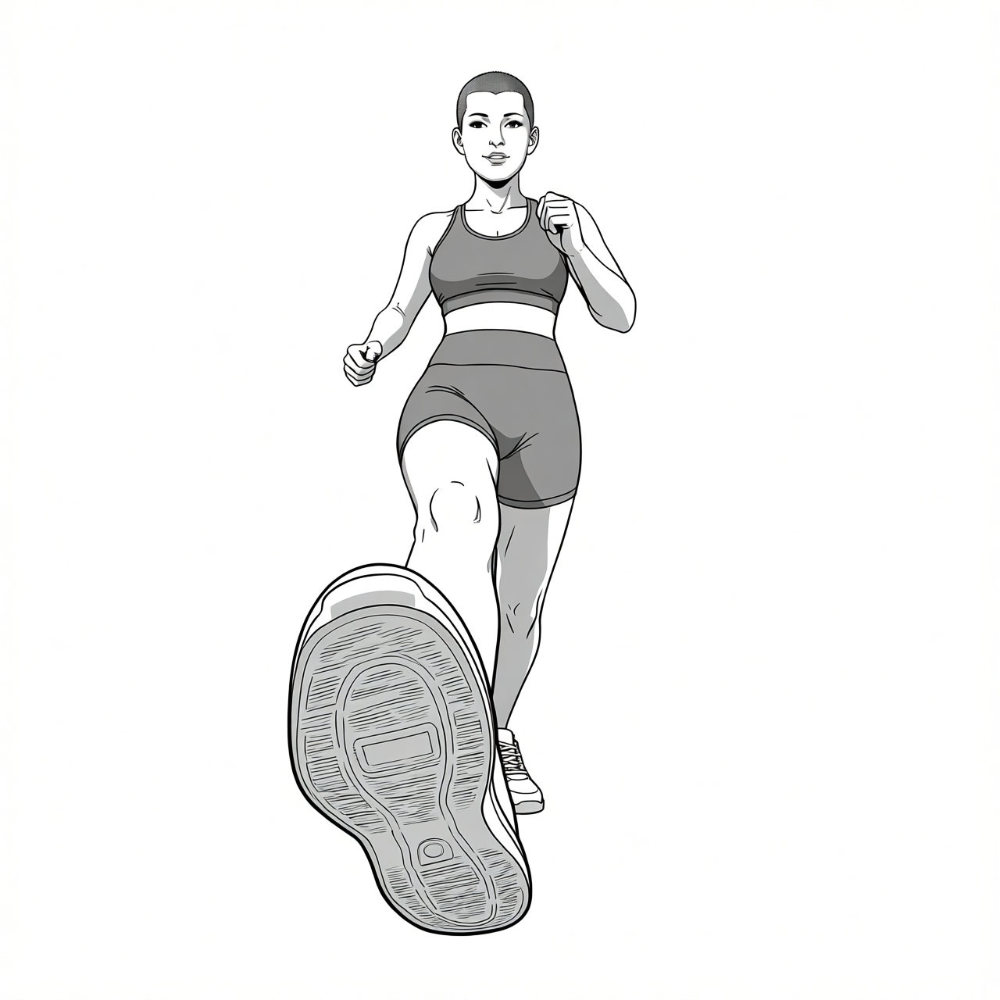

[마네킨 단일 입력의 신발 생성 실행 기록](../../../assets/part-07/chapter-05/p7-5-5-qwen-2511-mannequin-shoes-a-v1-size-1280x1280-seed-62294-steps-20-result.json){ .lazy-source }

다음에는 [P7-5.3의 윗면·바닥면 신발 디자인](../../../assets/part-07/chapter-05/p7-5-3-qwen-2511-white-sneaker-outsole-upper-bottom-v3-size-1280x1280-seed-62294-steps-20.png)을 Picture 1, 맨발 마네킨을 Picture 2로 넣었다. 아래 지시의 30스텝 결과에서 앞쪽 신발에는 참조의 황갈색 밑창과 삼각형 무늬가 반영됐지만, 뒤쪽 발은 맨발로 남았다.

> Make the woman in Picture 2 wear the sneakers shown in Picture 1. Replace the foreground bare foot with a sneaker, showing its outsole toward the camera. Keep everything else unchanged.

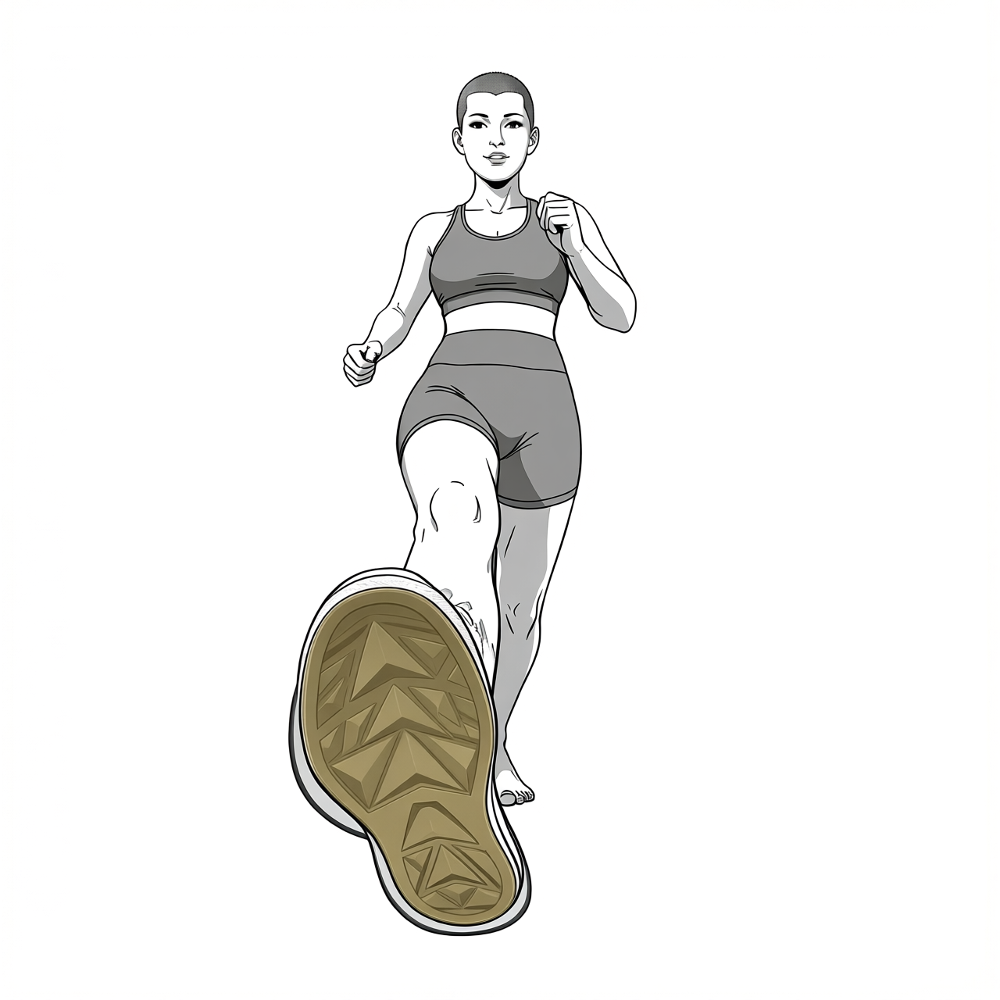

[신발 디자인 우선 참조의 30스텝 결과 실행 기록](../../../assets/part-07/chapter-05/p7-5-5-qwen-2511-mannequin-shoes-a-design-first-v4-size-1280x1280-seed-62294-steps-30-result.json){ .lazy-source }

양발을 함께 교체하도록 지시를 바꾸고 카메라 방향과 나머지 부분 유지 문장을 제거한 10스텝 실험에서는 앞쪽 발바닥 색만 달라지고 양발은 맨발로 남았다.

> Replace both the foreground and rear bare feet of the woman in Picture 2 with the sneakers from Picture 1.

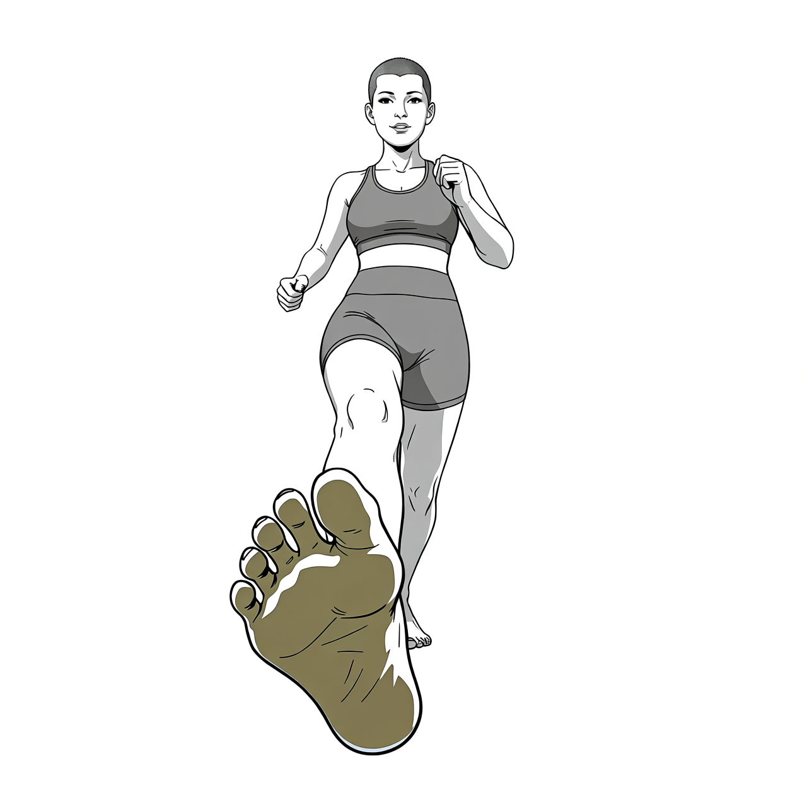

[교체 지시만 사용한 마네킨 10스텝 결과 실행 기록](../../../assets/part-07/chapter-05/p7-5-5-qwen-2511-mannequin-shoes-a-replace-only-v8-size-1280x1280-seed-62294-steps-10-result.json){ .lazy-source }

참조 순서와 문장, 스텝에 따라 결과가 달라졌다. 특히 위 30스텝과 10스텝은 문장과 스텝 수를 함께 바꿨으므로, 프롬프트 압축 하나를 실패 원인으로 단정하지 않는다. 신발 생성 자체와 지정한 디자인을 양발에 정확히 적용하는 작업은 별도로 평가해야 한다.

### 원본 컷아웃에서 아웃솔만 바꿔 본다

마네킨의 맨발을 신발로 바꾸는 대신, 이미 신발을 신은 원본 A 컷아웃에서 편집 범위를 아웃솔로 좁혔다. Picture 1은 같은 신발 디자인, Picture 2는 위에서 분리한 원본 A 컷아웃이다. 10스텝 실행 지시는 다음과 같다.

> Replace only the outsole of the foreground sneaker in Picture 2 with the outsole design shown on the right in Picture 1.

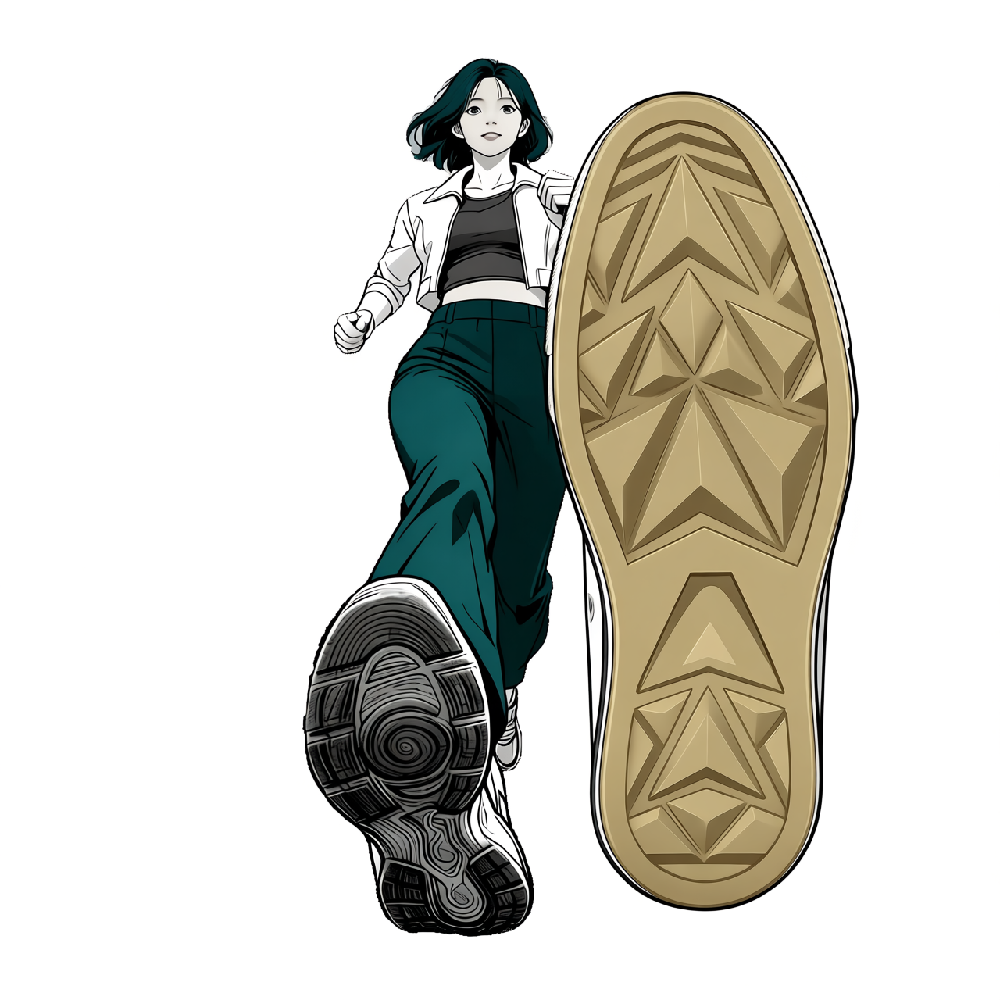

[원본 컷아웃의 아웃솔 교체 10스텝 결과 실행 기록](../../../assets/part-07/chapter-05/p7-5-5-qwen-2511-cutout-shoes-a-outsole-only-v2-size-1280x1280-seed-62294-steps-10-result.json){ .lazy-source }

기존 신발의 검은 원형 밑창 무늬는 그대로 남고, 참조의 황갈색 아웃솔이 화면 오른쪽에 커다란 별도 객체로 생성됐다. 참조 무늬가 출력에 나타났어도 목표 신발 부위에 적용되지 않았으므로 교체 성공으로 보지 않는다.

이 일련의 실험에서는 **참조 신발 디자인을 지정한 부위에 안정적으로 적용하는 모델 성능이 부족했다**고 정리한다. 앞쪽 신발만 바뀐 사례는 있으나, 양발의 디자인 적용을 완료한 결과는 얻지 못했다. 이는 여기서 사용한 입력·프롬프트·생성 조건의 관찰이며, 모든 신발 편집이 불가능하다는 뜻이나 파이프라인 오류를 입증한 결과는 아니다.

### 신발 비교 실험을 재실행한다

[마네킨·컷아웃 신발 실험 생성기](../../../assets/part-07/chapter-05/p7_5_5_qwen_edit_2511_mannequin_shoes_a.py)는 로컬 Qwen Image Edit 2511을 BF16과 sequential CPU offload로 실행한다. 위 결과는 1280×1280, seed `62294`, true CFG `4.0`, CPU 난수 생성기를 사용했으며 마스크·추가 LoRA·결과 합성은 사용하지 않았다. 다음 명령은 마네킨의 교체 지시만 사용한 실험과 컷아웃의 아웃솔 실험을 각각 재현한다.

~~~bash
.venv/bin/python docs/assets/part-07/chapter-05/p7_5_5_qwen_edit_2511_mannequin_shoes_a.py \
  --design-reference --design-first --steps 10 --run-label mannequin-replace-repeat-v8 \
  --prompt "Replace both the foreground and rear bare feet of the woman in Picture 2 with the sneakers from Picture 1." --dry-run

.venv/bin/python docs/assets/part-07/chapter-05/p7_5_5_qwen_edit_2511_mannequin_shoes_a.py \
  --cutout --design-reference --design-first --steps 10 --run-label cutout-outsole-repeat-v2 \
  --prompt "Replace only the outsole of the foreground sneaker in Picture 2 with the outsole design shown on the right in Picture 1." --dry-run
~~~

`--dry-run`을 빼면 생성한다. `--design-reference`는 윗면·바닥면 한 장을 추가하고, `--design-first`는 이를 첫 입력으로 둔다. `--cutout`은 맨발 마네킨 대신 원본 A 컷아웃을 선택한다. 명시한 `--prompt`의 이미지 번호는 실제 입력 순서에 맞춰 작성해야 한다. 기존 출력을 덮어쓰지 않도록 새 실행 이름을 사용하며, 입력·출력·프롬프트와 코드 해시는 각 결과 JSON에서 확인한다.

## 마네킨에 5.3 최종 착장을 입힌다

원본 컷아웃의 외형을 줄인 뒤에도 참조의 옷과 신발을 제대로 입힐 수 있는지 확인한다. 입력 순서는 Picture 1에 각 마네킨, Picture 2에 P7-5.3의 최종 3단계 착장 이미지다. A는 맨발로 수정한 `compressed-v2`, B·C는 `cutout-v1` 마네킨을 사용한다. 이 단계는 `원본 컷아웃 → 마네킨 → 착장 1차 적용`으로 이어진다. 뒤에서는 A 신발과 B 크기·포즈를 별도로 보강해 참조의 역할을 비교한다.

[공통 3단계 착장 참조](../../../assets/part-07/chapter-05/p7-5-3-qwen-edit-prompt-style-outfit_stage3_jacket_face-three-stage-v1-seed-62294-steps-10.png)를 사용하고, 옷의 색·길이·디자인을 텍스트로 다시 풀어 쓰지 않았다. 실제 프롬프트는 다음 두 문장이다.

> Dress the woman in Picture 1 in the complete outfit, including shoes, from Picture 2. Keep the face, hairstyle, pose, perspective, framing and white background of Picture 1.

이는 2번의 전체 착장과 신발을 1번 여성에게 입히되, 1번의 얼굴·머리·포즈·원근·프레이밍과 흰 배경은 유지하라는 뜻이다. 얼굴과 머리를 유지하는 지시가 들어 있으므로 세 출력에서 이 조건도 함께 확인한다.

### 착장 1차 적용 생성기

[마네킨 착장 생성기](../../../assets/part-07/chapter-05/p7_5_5_qwen_edit_2511_mannequin_outfit.py)는 세 마네킨을 고정된 입력으로 읽고 공통 착장 참조와 함께 편집한다. 로컬 Qwen Image Edit 2511의 `QwenImageEditPlusPipeline`을 BF16과 sequential CPU offload로 실행했다. 마스크·추가 LoRA·결과 합성은 사용하지 않았다. 두 입력은 비율을 유지해 각각 1280×1280 흰 캔버스에 배치한다.

세 출력 모두 1280×1280, 20스텝, seed `62294`, true CFG `4.0`이며 CPU 난수 생성기를 사용했다. 다음 명령은 모델을 불러오지 않고 세 입력과 공통 프롬프트·출력 계획을 확인한다.

~~~bash
.venv/bin/python docs/assets/part-07/chapter-05/p7_5_5_qwen_edit_2511_mannequin_outfit.py \
  --scenes a b c --steps 20 --run-label stage3-repeat-v1 --dry-run
~~~

`--dry-run`을 빼면 A·B·C를 순서대로 생성한다. `--scenes`는 대상, `--reference`는 착장 참조, `--prompt`는 편집 지시, `--steps`와 `--seed`는 생성 조건을 바꾼다. 기존 PNG·JSON이 있으면 실행 전에 중단하므로 재실행에는 새 `--run-label`이나 `--output-dir`을 지정한다. JSON에는 실제 두 입력·출력의 해시, 프롬프트, 코드 해시와 실행 환경을 저장한다.

### A 착장 적용 결과

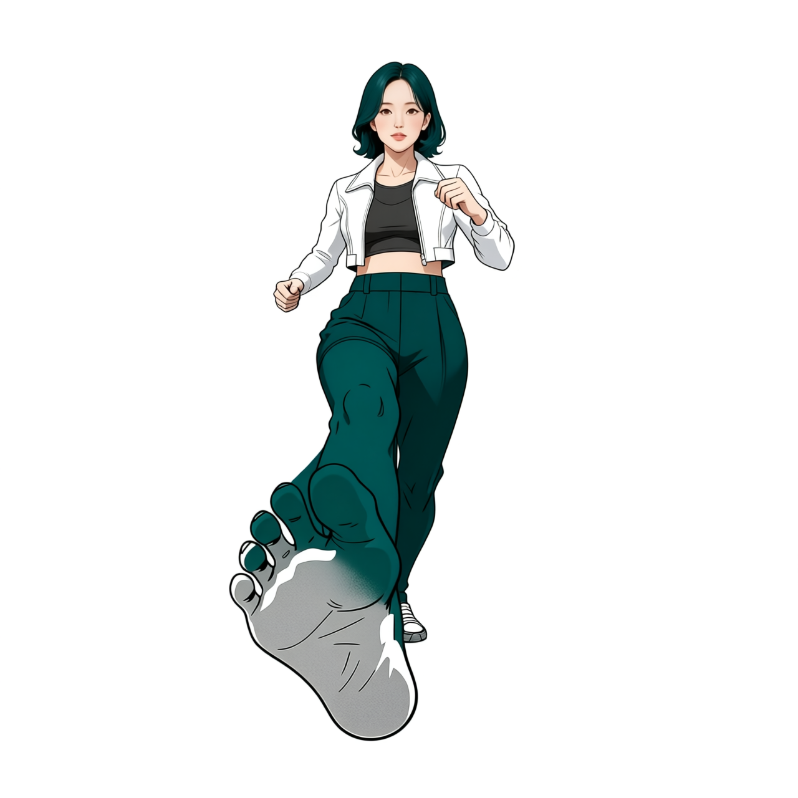

흰 재킷과 청록색 바지가 반영됐고, 유지하도록 지시한 얼굴·머리도 참조의 Mira 외형으로 바뀌었다. 뒤쪽 발에는 신발이 생겼으나 앞쪽 큰 발은 신발로 바뀌지 않았다. 발가락 쪽에 바지색이 번지고 발바닥 형태가 남았으므로, 앞쪽 신발은 보강 대상이다.

[A 착장 입력·프롬프트·출력 기록](../../../assets/part-07/chapter-05/p7-5-5-qwen-2511-mannequin-outfit-a-mira-stage3-v1-size-1280x1280-seed-62294-steps-20-result.json){ .lazy-source }

### B 착장 적용 결과


흰 재킷·넓은 바지와 양쪽 흰 스니커즈가 반영됐다. 마네킨의 짧은 머리는 유지됐지만 인물 크기가 커지고 팔다리 배치가 변했다. 착장 반영과 별개로 기존 장면에 맞는 크기·포즈인지 비교해야 한다.

[B 착장 입력·프롬프트·출력 기록](../../../assets/part-07/chapter-05/p7-5-5-qwen-2511-mannequin-outfit-b-mira-stage3-v1-size-1280x1280-seed-62294-steps-20-result.json){ .lazy-source }

### C 착장 적용 결과


흰 재킷·넓은 바지와 양쪽 흰 스니커즈가 반영됐다. 짧은 머리와 앉은 자세의 큰 형태는 대체로 유지됐다. 이것은 착장 적용 결과이며, Mira의 얼굴·헤어 아이덴티티까지 완성한 결과는 아니다.

[C 착장 입력·프롬프트·출력 기록](../../../assets/part-07/chapter-05/p7-5-5-qwen-2511-mannequin-outfit-c-mira-stage3-v1-size-1280x1280-seed-62294-steps-20-result.json){ .lazy-source }

세 장 모두 파일 크기와 입력·참조·출력 해시를 확인했다. B·C에서 옷과 신발이 반영된 것과 달리 A에는 앞쪽 발의 오류가 남았다. 또한 같은 얼굴·머리 보존 지시에도 A와 B·C의 반응이 달랐다. 따라서 후속 보강은 일괄 적용하기보다 A의 앞쪽 신발, B의 크기·포즈 변화처럼 결과별로 확인된 항목을 기준으로 정한다. 다음 보강 실험은 이 1차 결과와 분리해 입력과 관찰을 기록한다.

## A는 신발 바닥면을 참조해 보강한다

전신 착장의 작은 신발 대신, [P7-5.3에서 생성한 바닥면](section-03.md#신발의-바닥면을-별도-참조로-만든다)을 참조한다. Picture 1은 앞쪽 발 오류가 남은 A 착장 1차 결과, Picture 2는 신발 밑창 전체가 보이는 이미지다. 앞서 텍스트만으로 신발을 만든 결과를 누적 편집하지 않고 같은 1차 결과에서 출발한다.

> Replace the large foreground bare foot in Picture 1 with the sneaker from Picture 2, its outsole facing the camera. Keep everything else in Picture 1 unchanged.

[A 전용 신발 보강 코드](../../../assets/part-07/chapter-05/p7_5_5_qwen_edit_2511_refine_a_foreground_shoe.py)의 기본 참조를 5.3 바닥면으로 수정했다. 얼굴과 머리 보강은 최종 BFS 과정으로 남기며, 이 실행은 전경 신발만 지시한다. 로컬 Qwen Edit 2511, BF16, sequential CPU offload, 1280×1280, 20스텝, seed `62294`, true CFG `4.0`이며 마스크와 추가 LoRA는 사용하지 않는다.

```bash
.venv/bin/python docs/assets/part-07/chapter-05/p7_5_5_qwen_edit_2511_refine_a_foreground_shoe.py \
  --steps 20 --run-label outsole-repeat-v1 --dry-run
```

`--dry-run`을 빼면 생성한다. `--input`으로 편집 대상, `--reference`로 신발 참조, `--prompt`로 지시를 바꿀 수 있다. `--no-reference`는 두 번째 이미지를 빼고 흰 운동화를 텍스트로 지시하는 비교 경로다. 이 옵션은 기본 프롬프트도 바꾸므로 참조 유무만 비교하려면 양쪽 실행에 같은 `--prompt`를 지정한다. 실제 입력·출력과 코드 해시는 JSON에 기록된다.

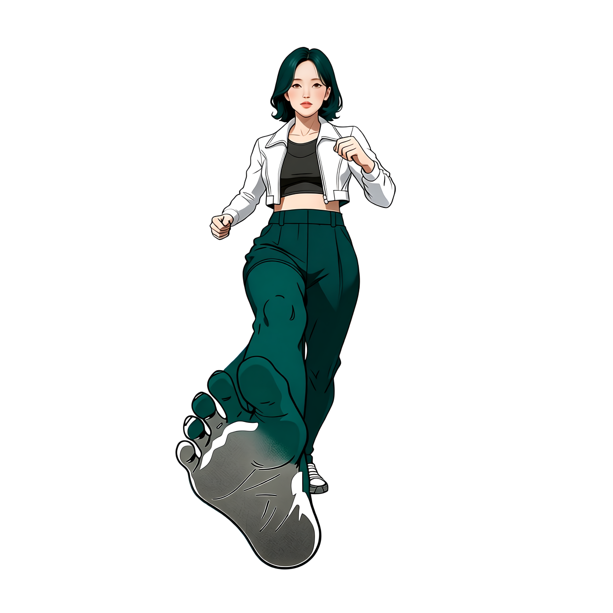

[A 바닥면 참조 보강 실행 기록](../../../assets/part-07/chapter-05/p7-5-5-qwen-2511-refine-a-foreground-shoe-outsole-v3-size-1280x1280-seed-62294-steps-20-result.json){ .lazy-source }

**바닥면 참조를 추가했지만 신발 교체에는 실패했다.** 앞쪽 발가락 윤곽과 발바닥 형태가 남고, 회색 부분이 어두워지며 표면 질감이 달라졌다. 참조의 삼각형 홈 무늬와 완결된 신발 외곽은 반영되지 않았다. 상체·재킷·바지의 큰 배치는 유지됐지만 얼굴의 선과 음영에도 변화가 있어, 편집 대상 밖의 픽셀 보존까지 단정할 수 없다.

비교를 위해 같은 착장 1차 결과에서 참조 없이 생성한 이전 결과도 함께 본다.

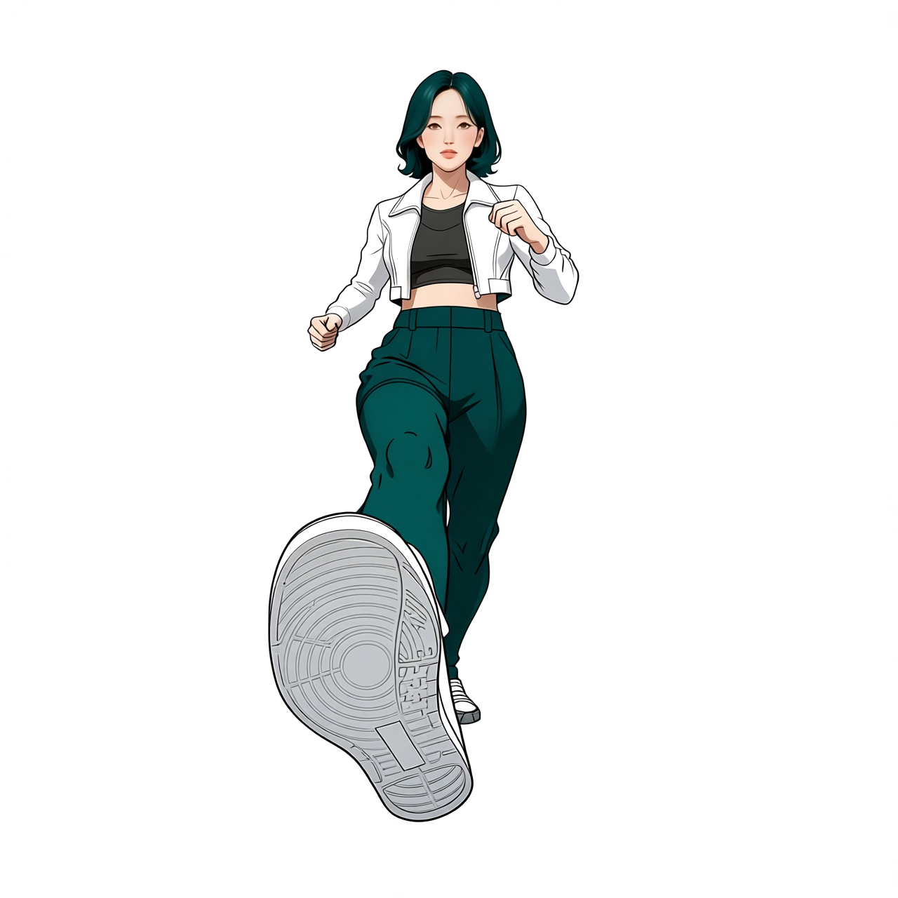

[A 단일 이미지 보강 실행 기록](../../../assets/part-07/chapter-05/p7-5-5-qwen-2511-refine-a-foreground-shoe-single-v2-size-1280x1280-seed-62294-steps-20-result.json){ .lazy-source }

단일 이미지 실험의 지시는 `Replace the large foreground bare foot in Picture 1 with a white sneaker, its sole facing the camera. Keep everything else unchanged.`였다. 이때는 발가락이 사라지고 회색 홈이 있는 운동화 밑창이 생성됐지만, 5.3 신발을 참조하지 않아 그 디자인과의 일치는 검증하지 않았다. 두 결과는 참조 유무와 지시 문장이 함께 다르다. 이 비교만으로 다중 참조나 파이프라인 자체가 실패 원인이라고 확정할 수는 없다.

### 신발 형태와 밑창 무늬를 나눠 편집한다

입력 기록과 로컬 파이프라인 호출을 확인하면 두 이미지가 모두 전달됐다. 또한 밑창을 크게 보여 주는 참조로 바꿔도 맨발 교체에 실패했으므로, 전신 참조에서 신발이 작다는 설명만으로는 이 결과를 설명하기 어렵다. 여기서는 맨발을 신발로 바꾸는 형태 변경과 밑창 디자인 전이를 나누는 방법을 시험한다. 이는 원인이 확정됐다는 뜻이 아니라, 앞서 성공한 신발 형태를 이용해 편집 범위를 줄이는 작업 가설이다.

A 생성기에 `--sole-only`를 추가했다. 첫 입력은 맨발이 남은 착장 1차 결과 대신 신발 교체에 성공한 `single-v2`이고, 두 번째 입력은 같은 5.3 바닥면이다. 기본 지시는 다음과 같다.

> Change the sole of the large foreground sneaker in Picture 1 to match Picture 2. Keep everything else unchanged.

[밑창만 변경한 v4 이미지](../../../assets/part-07/chapter-05/p7-5-5-qwen-2511-refine-a-foreground-shoe-sole-only-v4-size-1280x1280-seed-62294-steps-20.png) · [v4 실행 기록](../../../assets/part-07/chapter-05/p7-5-5-qwen-2511-refine-a-foreground-shoe-sole-only-v4-size-1280x1280-seed-62294-steps-20-result.json){ .lazy-source }

20스텝 결과는 운동화 형태를 유지하고 밑창을 어두운 회갈색으로 바꿨다. 그러나 참조의 삼각형 홈 대신 입력의 원형·곡선 홈이 남았다. 색 변화와 무늬 교체는 다른 관찰 항목이다. 이 실행은 입력과 지시가 함께 바뀌었으므로 형태 변경을 분리한 효과만 측정한 실험으로 해석하지 않는다.

다음 실행은 v4와 같은 두 입력·20스텝·seed·CFG·코드를 유지하고 프롬프트만 바꿨다. 변경 전 무늬와 변경할 무늬를 직접 지정했다.

> Replace the circular tread on the foreground sneaker in Picture 1 with the triangular tread from Picture 2. Keep everything else unchanged.

```bash
.venv/bin/python docs/assets/part-07/chapter-05/p7_5_5_qwen_edit_2511_refine_a_foreground_shoe.py \
  --sole-only --steps 20 --run-label sole-tread-repeat-v1 \
  --prompt "Replace the circular tread on the foreground sneaker in Picture 1 with the triangular tread from Picture 2. Keep everything else unchanged." \
  --dry-run
```

`--dry-run`을 빼면 생성한다. `--sole-only`와 `--no-reference`는 함께 사용할 수 없다. `--sole-only`에서 `--input`을 생략하면 신발 교체 성공 결과를 읽으며, 명시하면 지정한 이미지가 우선한다.

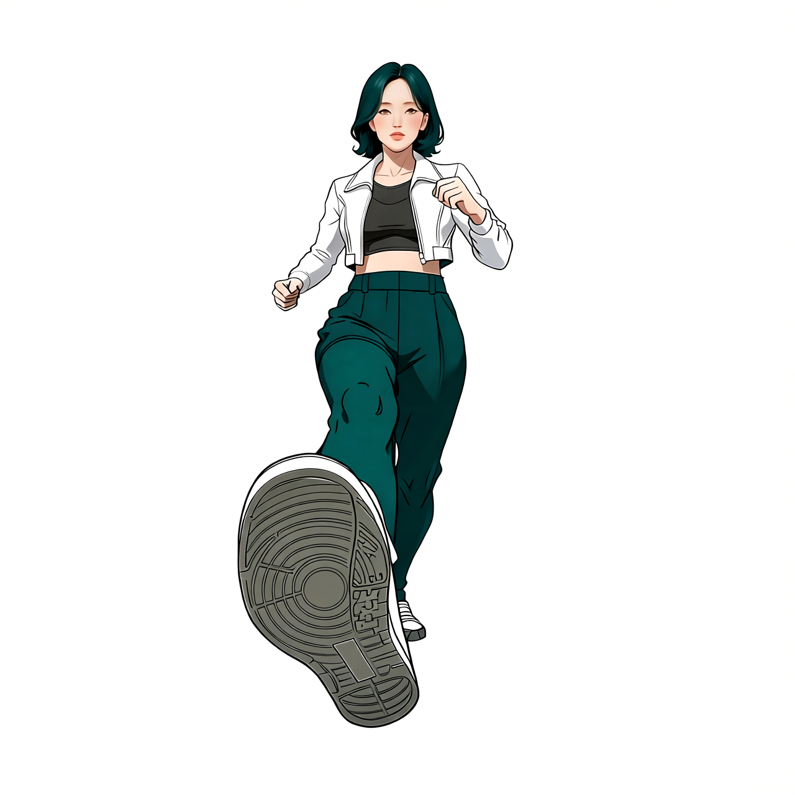

[v5 프롬프트 비교 실행 기록](../../../assets/part-07/chapter-05/p7-5-5-qwen-2511-refine-a-foreground-shoe-sole-tread-v5-size-1280x1280-seed-62294-steps-20-result.json){ .lazy-source }

무늬를 직접 지정해도 원형·곡선 홈이 남아 **참조 무늬 전이는 해결되지 않았다.** v4처럼 밑창은 어두워졌지만, 삼각형 홈으로 바뀌지는 않았다. 이미 생성된 운동화 형태를 유지하는 것과 참조 디자인으로 바꾸는 것을 같은 개선으로 판단하지 않는다.

로컬 processor로 같은 두 이미지와 프롬프트를 처리한 결과는 총 502토큰이었고, 파이프라인이 앞부분 64토큰을 제외한 뒤에도 편집 지시 전체가 남았다. 코드에서도 두 이미지가 텍스트 인코더의 시각 입력과 VAE 입력으로 전달되는 것을 확인했다. 이 점검 범위에서는 이미지 누락이나 프롬프트 잘림을 원인으로 볼 증거가 없다. 현재 확인된 한계는 이 입력·20스텝·CFG 조건에서 색은 바뀌지만 기존 홈 구조가 강하게 남는다는 것이다. 모델 전체의 결함이나 프롬프트 길이 하나의 문제로 일반화하지 않는다.

## B는 참조 순서를 바꿔 포즈 보존을 비교한다

착장 적용 뒤 커진 인물을 마네킨의 크기·포즈로 돌리기 위해, Picture 1에 B 마네킨을, Picture 2에 B 착장 1차 결과를 넣었다. 두 번째 이미지는 옷과 신발 참조로만 지정했다. 얼굴과 머리 보강은 최종 BFS 과정으로 남긴다.

> Dress the woman in Picture 1 in the outfit and shoes from Picture 2. Keep the pose, subject size, placement and white background of Picture 1.

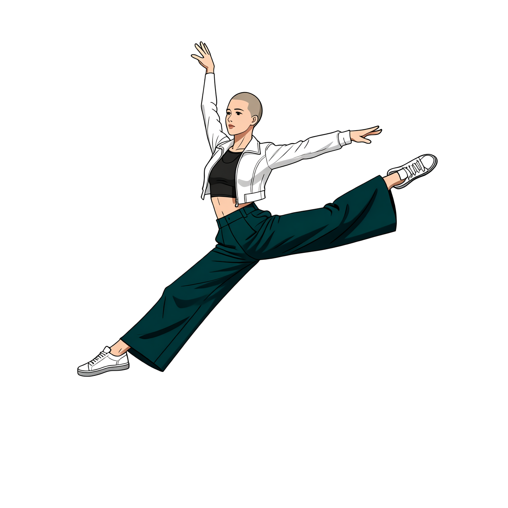

[B 보강 실행 기록](../../../assets/part-07/chapter-05/p7-5-5-qwen-2511-refine-b-pose-mannequin-first-v2-size-1280x1280-seed-62294-steps-20-result.json){ .lazy-source } · [B 전용 보강 코드](../../../assets/part-07/chapter-05/p7_5_5_qwen_edit_2511_refine_b_pose.py)

옷과 흰 운동화는 남았지만, 팔다리 배치와 인물 크기는 두 번째 착장 이미지에 가깝다. **마네킨의 크기·포즈 복원에는 실패했다.** 흰 배경을 제외한 외곽의 대략적인 폭×높이는 마네킨 761×724, 착장 1차 908×844, 이번 결과 909×846픽셀이다. 이는 밝기 임계값으로 잡은 외곽 비교이며 관절 좌표의 정확도를 뜻하지 않는다. 참조 순서와 프롬프트를 함께 바꿨으므로 순서 하나의 효과를 분리한 실험도 아니다.

로컬 Qwen Edit 2511, BF16, 1280×1280, 20스텝, seed `62294`, true CFG `4.0`으로 실행했다. 마스크와 추가 LoRA는 사용하지 않았다. 다음 명령에서 `--dry-run`을 빼면 새 이름으로 재생성한다.

```bash
.venv/bin/python docs/assets/part-07/chapter-05/p7_5_5_qwen_edit_2511_refine_b_pose.py \
  --mannequin-first --steps 20 --run-label mannequin-first-repeat-v1 --dry-run
```

`--mannequin-first`는 입력 순서와 역할 지시를 함께 선택한다. `--input`은 착장 이미지, `--reference`는 마네킨 경로이며, 이 옵션에서는 마네킨이 실제 첫 입력이다. `--prompt`로 지시를 바꿔 볼 때 옷 반영과 몸의 크기·관절 배치를 따로 비교한다. 결과 JSON에는 실제 입력 순서와 프롬프트가 기록된다.

## 보충학습: 이전 마네킨·조명·합성 실험

아래 결과는 위의 신규 분리·아이덴티티 적용과 별도의 입력으로 수행한 실험이다. 현재 네 결과의 다음 단계로 연결하지 않는다.

### B의 포즈를 남긴 마네킨에 Mira를 다시 적용한다

이하 마네킨·착장 보정은 이전 B `extras-v8` 컷아웃에서 수행한 실험 기록이다. 위의 신규 컷아웃으로 재생성한 결과가 아니며, 실행 JSON의 입력·해시는 당시 기록을 유지한다. 이전 장면 입력은 저장소 이력의 커밋 `82f957926`에서 확인할 수 있다.

착장 일부를 반복해서 보정하면 앞 단계의 형태가 남거나 옷 주름이 단순해질 수 있다. B에서는 기존 얼굴·착장의 영향을 줄여 볼 목적으로, 원본 컷아웃을 짧은 스포츠머리와 스포츠 브라·짧은 하의를 입은 성인 여성으로 바꾼 뒤 Mira 참조를 적용했다. 여기서 마네킨은 얼굴이 없는 회색 모형이 아니라, 얼굴과 팔다리 자세가 보이는 생성 이미지다. `B 원본 컷아웃 → 20스텝 마네킨 → 5.3 착장 참조를 사용한 30스텝 인물 교체`로 이어지며, 조명 보정을 거치지 않고 원본 컷아웃에서 시작했다.

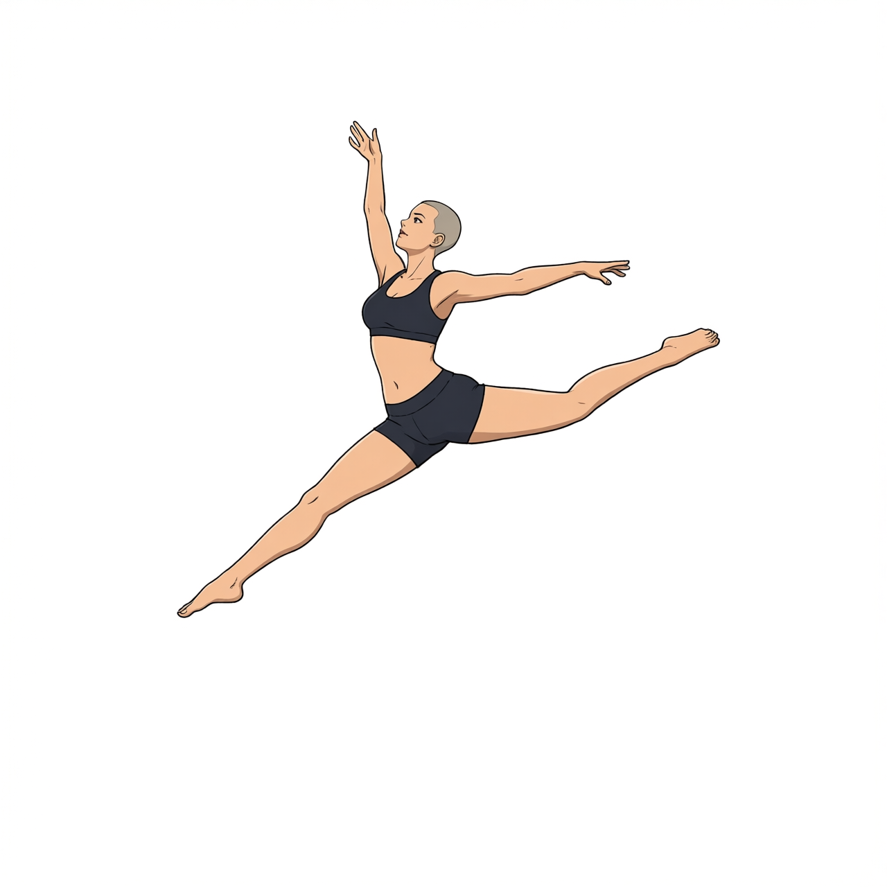

[마네킨 입력·생성 지시·출력 기록](../../../assets/part-07/chapter-05/p7-5-5-qwen-2511-scene-b-pose-person-v1-size-1280x1280-seed-62294-steps-20-result.json){ .lazy-source }

Picture 1에는 위 마네킨을, Picture 2에는 [P7-5.3의 최종 전신 착장 이미지](../../../assets/part-07/chapter-05/p7-5-3-qwen-edit-prompt-style-outfit_stage2_jacket_face-long-trousers-folded-collar-v3-seed-62294-steps-30.png)를 넣었다. 얼굴 전용 head 파일은 이번 실행의 참조가 아니다. 머리색이나 의복 형태를 텍스트로 덧붙이지 않고 다음 두 문장을 사용했다.

> Replace the woman in Picture 1 with the woman in Picture 2, preserving the pose. Preserve the split-leap pose and the cast shadow beneath the woman.

이 지시는 1번 여성의 자세를 유지하면서 2번 여성으로 교체하고, 다리를 벌린 도약 자세와 인물 아래 그림자를 보존하라는 뜻이다. 마지막 그림자 문장은 그림자가 있던 이전 실험의 표현을 그대로 비교한 조건이다. 이번 마네킨에는 바닥 그림자가 없으므로, 지시와 입력이 일치하는지도 결과에서 확인해야 한다.

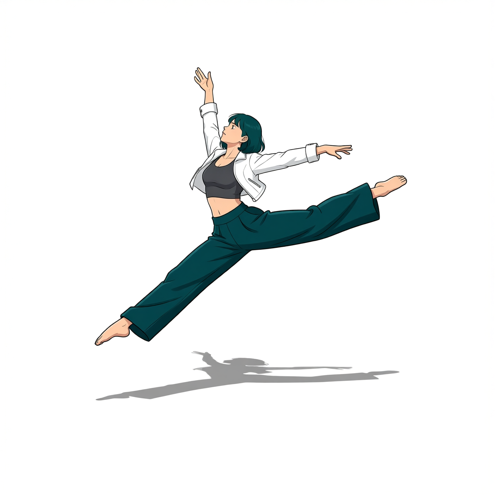

[v5-outfit 입력 순서·프롬프트·설정·출력 기록](../../../assets/part-07/chapter-05/p7-5-5-qwen-2511-scene-b-pose-person-face-hair-v5-outfit-size-1280x1280-seed-62294-steps-30-result.json){ .lazy-source }

청록색 단발, 흰 재킷과 넓은 바지가 반영됐고 다리를 벌린 도약 자세도 대체로 남았다. 그러나 참조의 운동화는 적용되지 않아 양쪽 발이 맨발이며, 얼굴·팔다리 윤곽과 의복 세부도 입력 및 참조와 다르다. 마네킨에 없던 바닥 그림자까지 추가됐다. 이 결과는 인물 교체가 진행된 사례이며, 착장과 배경 보존까지 완료된 최종 합성 자산은 아니다. 특히 `보존`이라는 단어를 썼더라도 입력에 없는 대상을 언급하면 새 요소가 생길 수 있음을 이번 출력에서 관찰했다.

로컬 Qwen Image Edit 2511의 `QwenImageEditPlusPipeline`을 BF16과 sequential CPU offload로 실행했다. 출력은 1280×1280, 30스텝, seed `62294`, true CFG `4.0`이다. 1번 입력은 1280×1280, 2번은 960×1440의 비율을 유지해 전달했으며, 마스크·추가 LoRA·출력 합성은 사용하지 않았다. 두 입력과 출력의 SHA-256은 JSON 기록과 일치한다.

[마네킨·다중 참조 실험 생성기](../../../assets/part-07/chapter-05/p7_5_5_qwen_edit_2511_mannequin_identity.py)에서 이번 실행은 `pose-person-face-hair` 단계의 프롬프트를 전체 인물 교체로 바꾸고 `--face-reference`로 전신 착장을 지정했다. 파일명과 옵션에 `face`가 남아 있어도 실제 편집 범위는 위 프롬프트와 참조 파일로 판단한다. 저장소 루트에서 재실행하려면 다음처럼 새 출력 이름을 사용한다.

```bash
.venv/bin/python docs/assets/part-07/chapter-05/p7_5_5_qwen_edit_2511_mannequin_identity.py \
  --stage pose-person-face-hair --run-label v5-outfit-repeat --steps 30 \
  --face-reference docs/assets/part-07/chapter-05/p7-5-3-qwen-edit-prompt-style-outfit_stage2_jacket_face-long-trousers-folded-collar-v3-seed-62294-steps-30.png
```

이 명령은 저장된 20스텝 마네킨에서 시작한다. 코드의 프롬프트가 이후 바뀌었다면 먼저 위 JSON의 문장과 대조한다. 이번 실행은 CUDA 난수 생성기를 사용하므로, 같은 seed를 CPU 난수 생성기에 전달한 이전 실행과 초기 노이즈가 같다고 보지 않는다.

이하 조명 보정과 카메라판 합성도 당시 입력을 사용한 실험이다. 신규 컷아웃·아이덴티티 적용 결과와 이어진 출력으로 해석하지 않는다. 기존 후속 생성 코드의 기본 입력은 이전 실험을 가리킬 수 있으므로 실행 전에 입력을 확인한다.

C의 신발·화풍 보정은 이전 컷아웃에서 파생된 조명 실험의 결과다. 그 뒤 카메라판 합성 실험의 Scene A·B·C는 각각 해안 절벽·야생화 초원·도심 공원의 이전 입력을 뜻한다. 그림자를 포함한 중간 산출물도 당시 입력 기록 그대로 남아 있지만, 그림자를 추가하는 절차와 실행 안내는 현재 경로에서 제외한다.

### 이전 C 실험의 신발과 조연 화풍 보정

다음 두 결과는 이전 조명 보정 실험의 중간 산출물을 입력으로 사용했다. 현재 컷아웃에서 바로 이어지는 보정 단계가 아니며, 각 JSON의 실제 입력을 기준으로 확인한다. C Mira의 신발은 P7-5.3 착장 참조를 사용하고, C 조연은 C Mira의 DeLight 결과에서 선과 절제된 채색 표현만 참조한다. 여자 캐릭터의 얼굴·머리·의상까지 조연에게 옮기는 작업은 아니다.

| 보정 항목 | Image 1: 편집 대상 | Image 2: 참조할 특징 |
| --- | --- | --- |
| C 신발 | C Mira DeLight 결과 | P7-5.3 2단계 착장 참조의 흰 로우탑 스니커즈 |
| C 조연 화풍 | C 조연 DeLight 결과 | C Mira DeLight 결과의 선·채색 표현 |

[추가 보정 생성기](../../../assets/part-07/chapter-05/p7_5_5_qwen_edit_2511_refine_delight.py)는 로컬 GPU의 Qwen Image Edit 2511에 두 이미지를 순서대로 넣는다. 두 작업은 각각의 DeLight 원본에서 시작한다. 새 그림자나 배경을 만드는 단계는 추가하지 않는다.

먼저 다음 명령으로 모델을 불러오지 않고 입력·참조·프롬프트·출력 경로를 확인한다. `--dry-run`을 빼면 지정한 두 보정을 실행한다. 기본값은 1280×1280, seed `62294`, 20 step, true CFG `4.0`이다.

~~~bash
.venv/bin/python docs/assets/part-07/chapter-05/p7_5_5_qwen_edit_2511_refine_delight.py --tasks c-shoes c-supporting-style --dry-run
~~~

다른 결과를 이어받으려면 단일 작업에 `--input`을 지정한다. 단일 작업의 참조와 지시는 `--reference`, `--prompt`로 바꿀 수 있으며, 두 작업의 참조는 각각 `--mira-reference`, `--style-reference`로 바꾼다. 재실행에는 새 `--run-label`을 사용한다.

이 생성기의 기본 프롬프트는 해당 부위나 화풍만 수정하고 자세·얼굴·의상·배경을 보존하도록 지시한다. 마스크로 픽셀을 고정하는 방식은 아니므로 결과를 확인할 때는 수정한 항목과 수정하지 않은 부분을 함께 대조해야 한다. C의 가림 영역 복원과 DeLight에서 생긴 그림자 문제는 이 보정들로 해결됐다고 간주하지 않는다. 다음은 두 작업을 기본 조건으로 로컬 GPU에서 실행한 결과다. 각 JSON에는 실제 입력·참조의 SHA-256과 프롬프트를 기록했다.

#### C 신발 보정

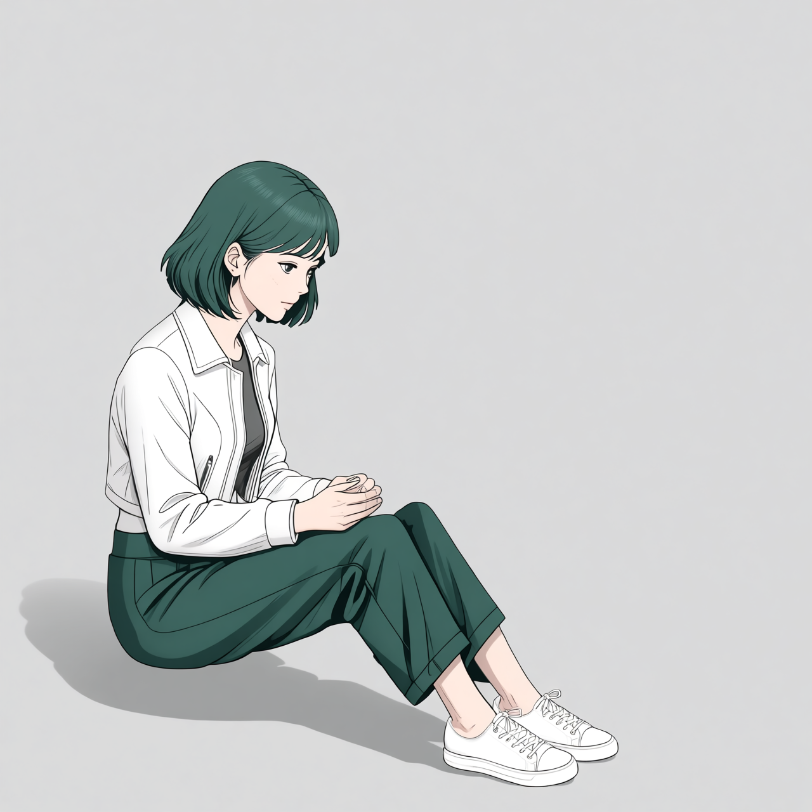

앉은 자세의 양쪽 회색 신발이 흰 끈 스니커즈로 바뀌었다. 청록 단발과 의상, 두 다리의 큰 배치는 유지됐다. 발목과 바지 밑단의 세부선에도 변화가 있고, 기존 왼쪽 아래 방향의 그림자는 남아 있다.

[입력·참조·프롬프트·출력 기록](../../../assets/part-07/chapter-05/p7-5-5-qwen-2511-delight-refine-c-shoes-v1-size-1280x1280-seed-62294-steps-20-result.json){ .lazy-source }

#### C 조연 화풍 보정

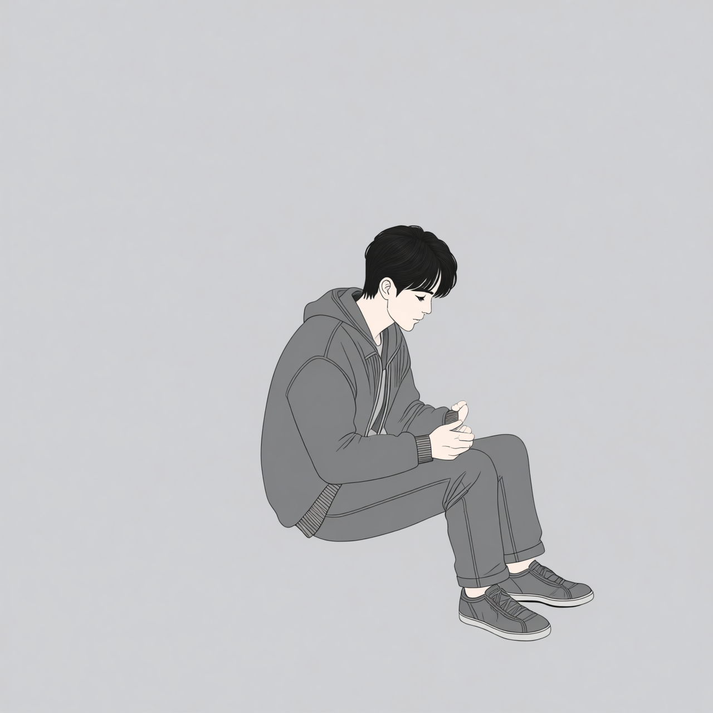

DeLight 결과의 입체적인 피부·옷 질감이 선과 평면적인 채색 중심의 표현으로 바뀌었다. 검은 머리, 회색 후드와 바지, 고개를 숙여 앉은 자세는 유지됐다. 얼굴·손·주름의 세부와 바닥 그림자도 달라졌으며, 앞 단계에서 채워진 몸통은 그대로 남아 있다.

[입력·참조·프롬프트·출력 기록](../../../assets/part-07/chapter-05/p7-5-5-qwen-2511-delight-refine-c-supporting-style-v1-size-1280x1280-seed-62294-steps-20-result.json){ .lazy-source }

두 보정 결과는 1280×1280이다. C Mira는 `c-shoes`, C 조연은 `c-supporting-style`을 각각 구분해 사용한다. 추가 보정은 마스크 없이 Qwen Edit에 수정 대상과 보존할 내용을 지시한다. 수정 대상 외의 내용을 최대한 유지하는 것이 이 편집 방식의 목적이며, 결과에서는 해당 부위의 개선과 다른 부분의 보존을 함께 확인한다.

### 한 모델이 아니라 역할이 다른 구성 요소

이전 합성 실험의 결과는 하나의 이미지 모델에서 바로 나온 것이 아니다. 당시 카메라판에서 인물의 영역을 찾고, 포즈에 캐릭터를 이식하고, 배경판을 만들고, 둘을 통합하는 일을 분리했다. 같은 입력을 여러 모델에 반복해 넣기보다, 각 단계에 필요한 정보만 넘기는 것이 이 절의 핵심이다.

| 구성 요소 | 맡긴 일 | 이 절에서의 입력·출력 경계 |
| --- | --- | --- |
| `Qwen/Qwen-Image-Edit-2511` | 카메라판의 인물·배경판 편집과 DeLight 배경·캐릭터의 다중 참조 통합 | 카메라판·단일 인물 또는 배경판·캐릭터 → 장면 한 장 |
| Grounding DINO Tiny | `a woman`, `a person` 텍스트로 인물 상자 탐색 | 카메라판 → 인물 상자 |
| SAM 2.1 Hiera Small | 선택된 상자를 흰색 인물 마스크로 정밀화 | 인물 상자·카메라판 → 마스크 |
| `Qwen/Qwen-Image-Edit-2509` + Studio DeLight LoRA | 배경판 또는 통합 장면의 방향광 색조를 중립화 | 배경판 또는 방향광 장면 → 중립 광원 장면 |
| `Qwen/Qwen-Image-Edit-2509` + dx8152 Relight LoRA | 통합 장면의 방향광을 다시 부여 | 중립화된 통합 장면 → 방향광 장면 |

`Qwen-Image-Edit-2509`은 DeLight·리라이트처럼 한 장에서 조명을 편집하는 단계에 쓴다. Studio DeLight LoRA는 이미 생긴 방향광을 균일한 스튜디오 광원으로 중립화한다. `Qwen-Image-Edit-2511`은 카메라판에서 인물·배경을 편집하고 다중 참조를 통합한다. 당시 카메라판과 현재 P7-5.4 최종 장면은 서로 다른 입력이다. [Qwen-Image-Edit-2509 모델 카드](https://huggingface.co/Qwen/Qwen-Image-Edit-2509){: target="_blank" rel="noopener noreferrer"} · [Qwen-Image-Edit-2511 모델 카드](https://huggingface.co/Qwen/Qwen-Image-Edit-2511){: target="_blank" rel="noopener noreferrer"} · [Studio DeLight 모델 카드](https://huggingface.co/prithivMLmods/QIE-2511-Studio-DeLight){: target="_blank" rel="noopener noreferrer"}

마스크 단계의 Grounding DINO Tiny는 텍스트로 대상 상자를 찾는 zero-shot 객체 검출 모델이고, SAM 2.1 Hiera Small은 그 상자를 인물 외곽 마스크로 바꾼다. 두 구성 요소는 캐릭터를 생성하거나 화풍을 정하지 않고, 카메라판에서 **어느 픽셀을 인물로 읽고 보존할지** 정한다. 빈 배경판은 이후 Qwen Image Edit 2511이 카메라판 한 장을 직접 편집해 만든다. [Grounding DINO Tiny 모델 카드](https://huggingface.co/IDEA-Research/grounding-dino-tiny){: target="_blank" rel="noopener noreferrer"} · [SAM 2 공식 저장소](https://github.com/facebookresearch/sam2){: target="_blank" rel="noopener noreferrer"}

위 공개 모델 카드와 저장소의 기능·배포 정보는 2026-08-29에 확인했다. 실제 실행에 쓴 입력 순서와 seed·step은 각 단계의 `result.json`을 기준으로 확인한다.

### 카메라판에서 마스크와 컷아웃을 쓴다

마스크의 흰색은 인물, 검은색은 보존할 배경을 뜻한다. 오버레이에서는 빨간색으로 덮인 영역과 노란색 검출 상자를 함께 보므로, 머리·손가락·발끝 같은 전신 경계가 빠졌는지 컷아웃보다 먼저 확인할 수 있다.

| Scene A 마스크 오버레이 | Scene B 마스크 오버레이 | Scene C 마스크 오버레이 |
| --- | --- | --- |
|  | 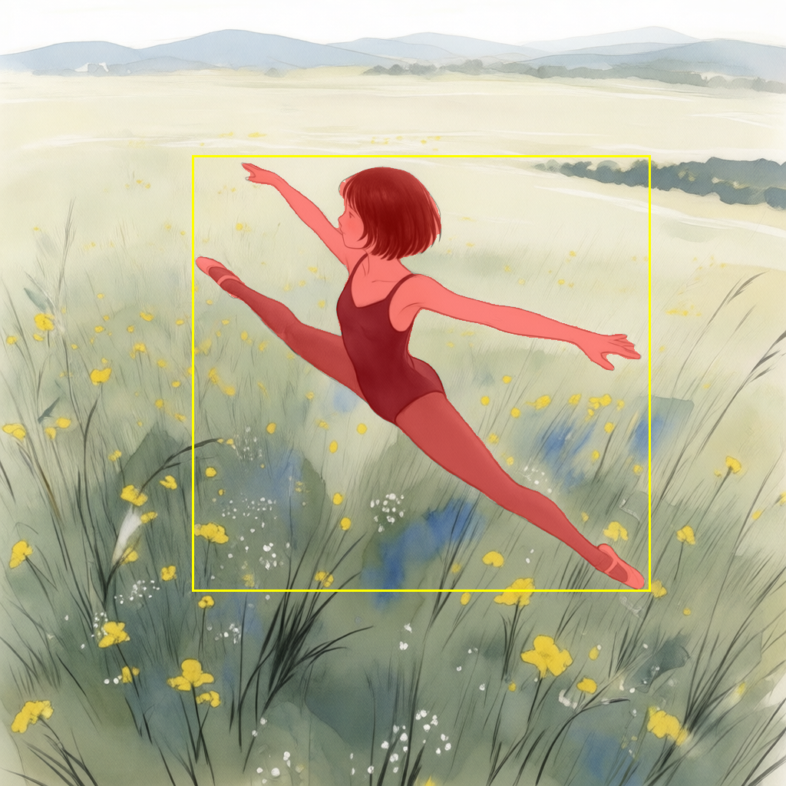 |  |

| Scene A 포즈 컷아웃 | Scene B 포즈 컷아웃 | Scene C 포즈 컷아웃 |
| --- | --- | --- |
|  |  |  |

[Scene A mask result.json — JSON — 아이레벨 카메라판의 검출 상자와 SAM2 마스크 기록 보기](/AiBook/assets/part-07/chapter-05/p7-5-3-sam2-person-mask-official-camera-scene-a-v6-result.json)

[Scene A cutout result.json — JSON — 아이레벨 카메라판의 흰 배경 포즈 컷아웃 기록 보기](/AiBook/assets/part-07/chapter-05/p7-5-3-character-pose-cutout-white-official-camera-scene-a-v6-result.json)

[Scene B mask result.json — JSON — 재생성 카메라판의 검출 상자와 SAM2 마스크 기록 보기](/AiBook/assets/part-07/chapter-05/p7-5-5-sam2-person-mask-official-camera-scene-b-v7-result.json)

[Scene B cutout result.json — JSON — 재생성 카메라판의 흰 배경 포즈 컷아웃 기록 보기](/AiBook/assets/part-07/chapter-05/p7-5-3-character-pose-cutout-white-official-camera-scene-b-v7-result.json)

[Scene C mask result.json — JSON — 거리 토큰 없는 카메라판의 검출 상자와 SAM2 마스크 기록 보기](/AiBook/assets/part-07/chapter-05/p7-5-5-sam2-person-mask-official-camera-scene-c-no-closeup-v9-result.json)

[Scene C cutout result.json — JSON — 거리 토큰 없는 카메라판의 흰 배경 포즈 컷아웃 기록 보기](/AiBook/assets/part-07/chapter-05/p7-5-5-character-pose-cutout-white-official-camera-scene-c-no-closeup-v9-size-1280x1280-result.json)

세 마스크는 머리·양팔·양다리·발끝을 포함했다. 거리 토큰을 생략해 다시 만든 Scene C에서는 SAM2 마스크가 인물만 분리하고, 하단의 분리된 그림자는 배경으로 남겼다. 이처럼 마스크가 완벽하지 않을 때는 컷아웃을 캐릭터 identity의 기준으로 쓰지 않으며, 픽셀 단위 외곽이 필요한 단계에서만 그 경계를 정제한다.

[인물 마스크 생성 코드 보기](../../../assets/part-07/chapter-05/p7_5_5_generate_person_mask.py)

[흰 배경 포즈 컷아웃 생성 코드 보기](../../../assets/part-07/chapter-05/p7_5_5_extract_pose_cutout.py)

흰 배경 컷아웃은 포즈와 프레이밍을 전달하는 참조이며, 알파 채널을 보존하는 최종 합성 자산은 아니다. 인물 레이어 보관과 빈 배경판 생성은 같은 마스크를 활용하는 별도 작업이다.

#### 포즈에 측면 캐릭터 identity를 이식한 이전 결과

Scene B·C는 각각 그림자 포함 컷아웃을 `Picture 1`, P7-5.3의 2단계 착장 이미지를 `Picture 2`로 넣었다. `Picture 1`은 스플릿 점프·인물 크기·프레이밍·바닥 그림자를, `Picture 2`는 청록 단발·흰 크롭 재킷·회색 이너·청록 바지를 맡는다. 카메라 LoRA나 추가 포즈 설명은 넣지 않고, `Replace the woman in Picture 1 with the woman in Picture 2, preserving the pose.`와 그림자 보존 지시만 사용했다.

| Scene A 그림자 컷아웃 다중 참조 결과 | Scene B 그림자 컷아웃 다중 참조 결과 | Scene C 그림자 컷아웃 다중 참조 결과 |
| --- | --- | --- |
| 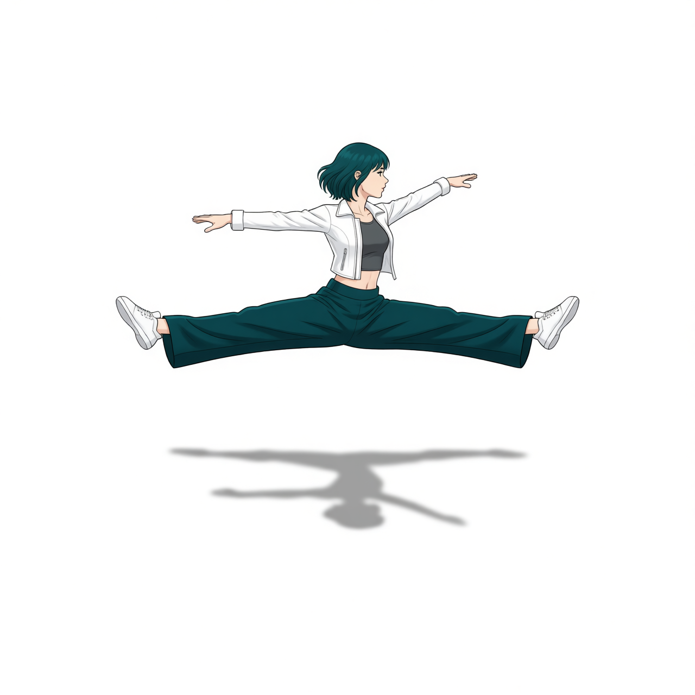 |  |  |

[Scene A 다중 참조 result.json — JSON — 그림자 컷아웃·Stage 2 착장의 입력 순서, 2511과 30 step 실행 조건 보기](/AiBook/assets/part-07/chapter-05/p7-5-5-qwen-2511-pose-identity-official-camera-scene-a-shadow-stage2-outfit-v2-size-1280x1280-seed-62294-steps-30-result.json)

[Scene B 다중 참조 result.json — JSON — 그림자 컷아웃·Stage 2 착장의 입력 순서, 2511과 30 step 실행 조건 보기](/AiBook/assets/part-07/chapter-05/p7-5-5-qwen-2511-pose-identity-official-camera-scene-b-shadow-stage2-outfit-v1-size-1280x1280-seed-62294-steps-30-result.json)

[Scene C 다중 참조 result.json — JSON — 거리 토큰 없는 그림자 컷아웃·Stage 2 착장의 입력 순서, 2511과 30 step 실행 조건 보기](/AiBook/assets/part-07/chapter-05/p7-5-5-qwen-2511-pose-identity-official-camera-scene-c-shadow-stage2-outfit-no-closeup-v2-size-1280x1280-seed-62294-steps-30-result.json)

1280×1280, seed `62294`, 30 step, true CFG `4.0`에서 공중 스플릿 점프와 그 아래 그림자는 유지됐고, 두 번째 참조의 재킷·회색 이너·청록 바지도 함께 반영됐다. 이전 실험에서는 역할을 나눈 두 이미지의 Qwen Image Edit 2511 다중 참조 이식을 사용했다. 착장 추출과 Try-On LoRA의 비교 실험은 P7-5.12에서 별도로 다룬다.

이전 결과의 입력 순서와 실행 조건은 위 JSON에 남아 있다. 아래 코드는 이전 실험의 재현용이며, 새 장면의 그림자 없는 컷아웃을 적용하려면 입력 선택과 그림자 보존 지시를 먼저 조정해야 한다.

[Qwen Image Edit 2511 다중 참조 이식 Python 코드 보기](../../../assets/part-07/chapter-05/p7_5_5_qwen_edit_2511_pose_identity.py)

#### 컷아웃 캐릭터 identity에 Studio DeLight를 적용한다

직접 이식한 단일 인물은 배경과 합치기 전에 한 번 중립 광원으로 정리한다. Qwen Image Edit 2509와 Studio DeLight LoRA에 이 이미지 한 장만 넣고 모델 카드의 trigger prompt `Neutral uniform lighting Preserve identity and composition`을 사용했다. 이때 입력은 포즈·얼굴·헤어·재킷·이너·바지·신발을 모두 가진 인물 이미지이고, 해안 배경은 입력하지 않는다.

| Scene A DeLight 캐릭터 | Scene B DeLight 캐릭터 | Scene C DeLight 캐릭터 |
| --- | --- | --- |
|  |  |  |

1280×1280, seed `62294`, 10 step, true CFG `4.0`에서 A·B·C는 포즈·얼굴 방향·헤어·재킷·이너·바지·신발을 유지했다. C는 거리 토큰 없는 그림자 포함 포즈에 이식한 Stage 2 착장을 입력으로 사용했다. 회색 바탕과 바닥 그림자는 중립화됐지만, 그림자의 지면 원근은 최종 합성의 접지감으로 판단하지 않는다.

[Studio DeLight 2509 실행 코드 보기](../../../assets/part-07/chapter-05/p7_5_5_qwen_edit_2509_studio_delight.py)

[Scene A DeLight 캐릭터 result.json — JSON — identity 이식 입력, trigger prompt와 2509 실행 조건 보기](/AiBook/assets/part-07/chapter-05/p7-5-5-qwen-2509-studio-delight-cutout-identity-v1-size-1280x1280-seed-62294-steps-10-result.json)

[Scene B DeLight 캐릭터 result.json — JSON — 캐릭터 입력, trigger prompt와 2509 실행 조건 보기](/AiBook/assets/part-07/chapter-05/p7-5-5-qwen-2509-studio-delight-character-b-size-1280x1280-seed-62294-steps-10-result.json)

[Scene C DeLight 캐릭터 result.json — JSON — Stage 2 착장 아이덴티 입력, trigger prompt와 2509 실행 조건 보기](/AiBook/assets/part-07/chapter-05/p7-5-5-qwen-2509-studio-delight-character-c-shadow-stage2-outfit-no-closeup-v3-size-1280x1280-seed-62294-steps-10-result.json)

#### DeLight 캐릭터에 45도 얼굴 identity를 이식한다

DeLight 캐릭터는 배경과 분리된 상태이므로, 얼굴·헤어만 바꾸는 BFS Head V5의 입력으로 사용하기 좋다. Picture 1에는 Scene B·C DeLight 캐릭터 컷아웃, Picture 2에는 45도 얼굴 참조를 넣었다. 포즈·흰 재킷·회색 이너·청록 바지·바닥 그림자는 Picture 1에 남기고, 얼굴 방향·앰버 홍채·청록 헤어의 기준만 Picture 2가 맡는다.

| Scene A BFS 45도 얼굴 이식 | Scene B BFS 45도 얼굴 이식 | Scene C BFS 45도 얼굴 이식 |
| --- | --- | --- |
|  |  |  |

Scene A·B·C 모두 10 step에서 45도 얼굴 방향과 앰버 홍채가 반영됐다. C의 30 step 비교는 눈·머리카락의 세부를 뚜렷하게 개선하지 못했으므로, 이 실행기의 기본값은 10 step으로 둔다. 이 결과는 다음 리라이트 통합본의 얼굴 이식 결과와 비교할 수 있도록, 그림자 포함 캐릭터와 DeLight 캐릭터 컷아웃을 입력으로 남긴다.

[BFS Head V5 얼굴·헤어 이식 코드 보기](../../../assets/part-07/chapter-05/p7_5_5_qwen_edit_2511_bfs_head_identity.py)

[Scene A 45도 얼굴 참조 BFS result.json — JSON — 그림자 포함 입력과 얼굴 참조의 순서, LoRA 파일, seed와 step 보기](/AiBook/assets/part-07/chapter-05/p7-5-5-qwen-2511-bfs-head-v5-delight-character-cutout-a-quarter-left-v1-size-1280x1280-seed-62294-steps-10-result.json)

[Scene B 45도 얼굴 참조 BFS result.json — JSON — 두 입력의 순서, LoRA 파일, seed와 step 보기](/AiBook/assets/part-07/chapter-05/p7-5-5-qwen-2511-bfs-head-v5-delight-character-cutout-b-quarter-left-v1-size-1280x1280-seed-62294-steps-10-result.json)

[Scene C 45도 얼굴 참조 BFS result.json — JSON — 두 입력의 순서, LoRA 파일, seed와 step 보기](/AiBook/assets/part-07/chapter-05/p7-5-5-qwen-2511-bfs-head-v5-delight-character-cutout-c-quarter-left-v1-size-1280x1280-seed-62294-steps-10-result.json)

#### 카메라판에서 캐릭터를 제거해 배경판을 만든다

컷아웃에 캐릭터 identity를 이식한 뒤에는, 같은 카메라판에서 인물을 비운 배경판도 별도 자산으로 만든다. 이 배경판은 인물의 얼굴·착장 기준을 다시 넣지 않는다. Qwen Image Edit 2511에 카메라판 한 장만 넣고, 인물 자리만 주변 배경으로 메우며 장소의 주요 지형·식생·구도를 보존하도록 짧게 지시했다. 이 단계의 목적은 포즈를 만들거나 캐릭터를 보정하는 것이 아니라, 이후 합성에서 쓸 배경 입력을 한 장으로 고정하는 것이다.

| Scene A 캐릭터 제거 배경판 | Scene B 캐릭터 제거 배경판 | Scene C 캐릭터 제거 배경판 |
| --- | --- | --- |
| 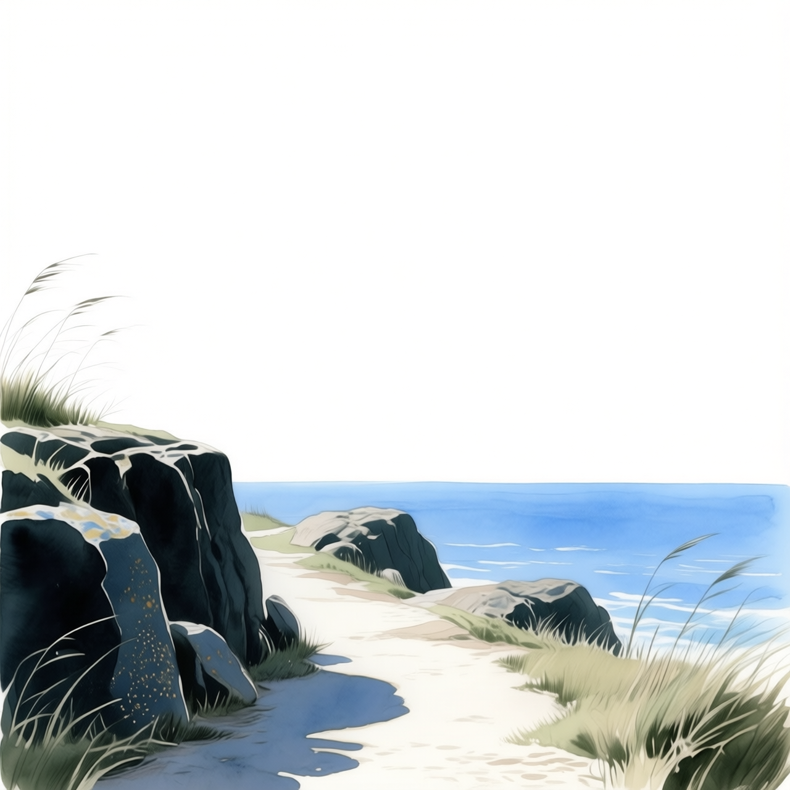 | 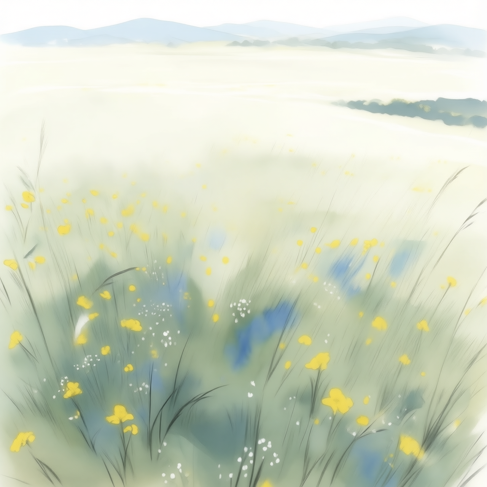 | 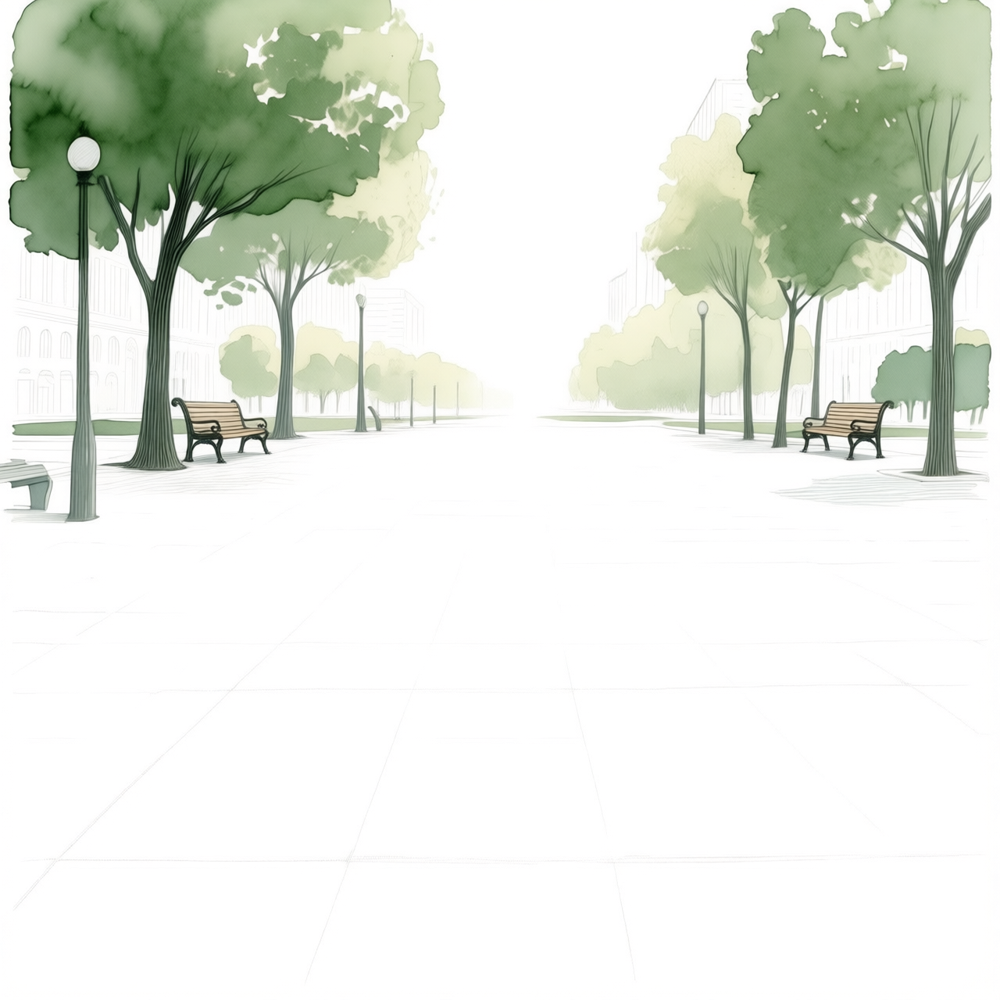 |

두 실행은 모두 1280×1280, seed `62294`, 10 step, true CFG `4.0`이다. 인물은 사라졌지만, A의 하늘은 밝고 단순한 색면으로 바뀌었고 B의 초원 중심부도 원본보다 단순해졌다. 따라서 인물 제거와 원본 배경의 모든 색·질감을 픽셀 단위로 보존하는 일은 같은 요구가 아니다.

[카메라판 배경 생성 코드 보기](../../../assets/part-07/chapter-05/p7_5_5_qwen_edit_2511_extract_camera_a_background.py)

[카메라 A 배경판 result.json — JSON — 카메라 입력, 인물 제거 지시와 2511 실행 조건 보기](/AiBook/assets/part-07/chapter-05/p7-5-5-qwen-2511-camera-a-background-camera-a-v1-size-1280x1280-seed-62294-steps-10-result.json)

[카메라 B 배경판 result.json — JSON — 카메라 입력, 인물 제거 지시와 2511 실행 조건 보기](/AiBook/assets/part-07/chapter-05/p7-5-5-qwen-2511-camera-b-background-camera-b-v1-size-1280x1280-seed-62294-steps-10-result.json)

[카메라 C 배경판 result.json — JSON — 카메라 입력, 인물 제거 지시와 2511 실행 조건 보기](/AiBook/assets/part-07/chapter-05/p7-5-5-qwen-2511-camera-c-background-camera-c-v1-size-1280x1280-seed-62294-steps-10-result.json)

#### 배경판에 Studio DeLight를 적용한다

바로 위 배경판을 Qwen Image Edit 2509의 Studio DeLight 입력으로 사용해 중립 광원 처리를 한 번 더 적용했다. 프롬프트는 모델 카드의 trigger prompt인 `Neutral uniform lighting Preserve identity and composition`만 사용한다. 인물이 없는 배경판으로 분리했으므로, 이 단계에서 바뀌는 대상은 인물 identity나 포즈가 아니라 하늘·바다·바위·풀의 조명과 색조다.

| Scene A DeLight 배경판 | Scene B DeLight 배경판 | Scene C DeLight 배경판 |
| --- | --- | --- |
| 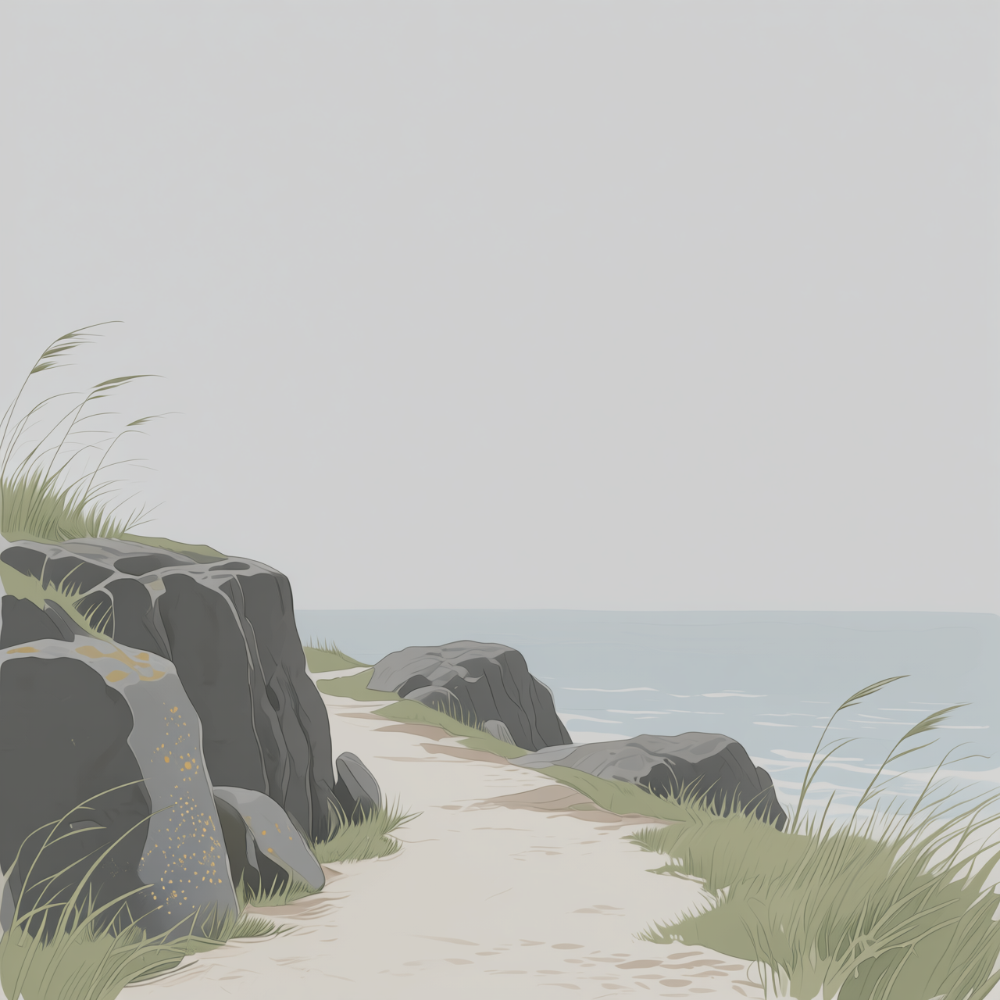 | 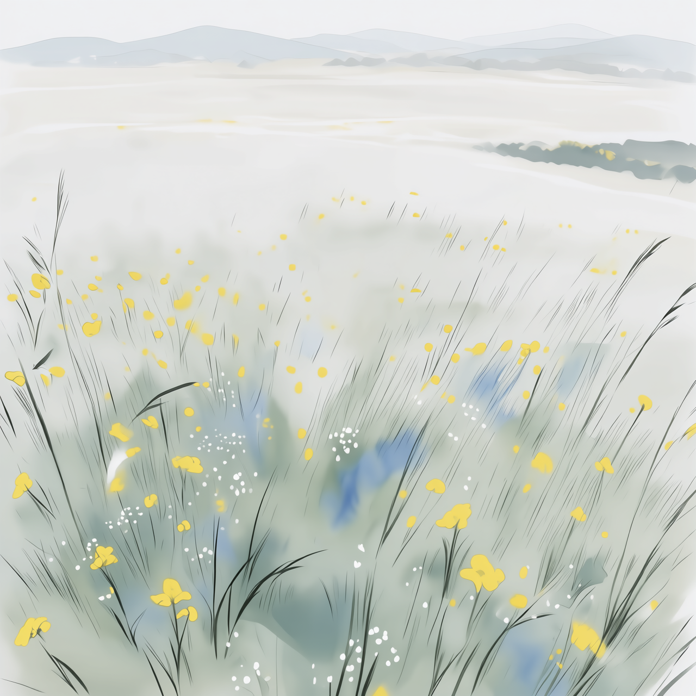 | 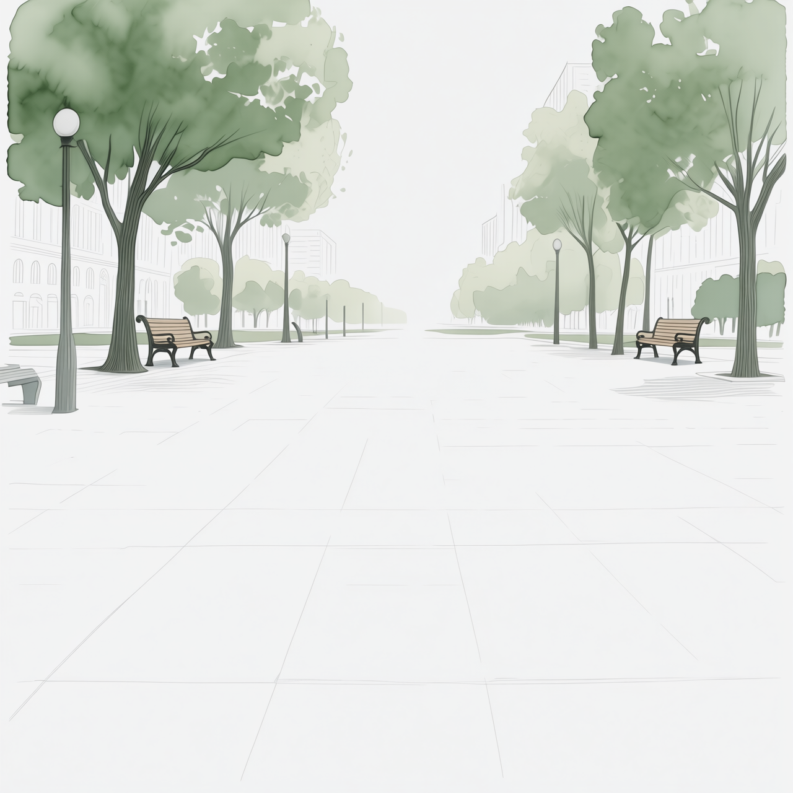 |

1280×1280, seed `62294`, 10 step, true CFG `4.0`에서 하늘·바다는 더 균일하고 밝아졌고 바위·풀·해안의 배치는 남았다. 그러나 야외 장면의 하늘은 거의 흰색에 가까워졌다. 이 출력은 중립화가 적용되는지 확인하는 배경 후보이며, 해안의 원래 광원과 색감을 보존해야 하는 최종 배경으로 자동 채택하지 않는다.

[Studio DeLight 2509 실행 코드 보기](../../../assets/part-07/chapter-05/p7_5_5_qwen_edit_2509_studio_delight.py)

[Studio DeLight 배경판 result.json — JSON — 배경판 입력, trigger prompt와 2509 실행 조건 보기](/AiBook/assets/part-07/chapter-05/p7-5-5-qwen-2509-studio-delight-camera-a-background-v1-size-1280x1280-seed-62294-steps-10-result.json)

[Scene B DeLight 배경판 result.json — JSON — 배경판 입력, trigger prompt와 2509 실행 조건 보기](/AiBook/assets/part-07/chapter-05/p7-5-5-qwen-2509-studio-delight-background-b-size-1280x1280-seed-62294-steps-10-result.json)

[Scene C DeLight 배경판 result.json — JSON — 배경판 입력, trigger prompt와 2509 실행 조건 보기](/AiBook/assets/part-07/chapter-05/p7-5-5-qwen-2509-studio-delight-background-c-size-1280x1280-seed-62294-steps-10-result.json)

#### DeLight 배경과 캐릭터를 다중 참조로 통합한다

첫 통합에서는 이 마스크를 쓰지 않았다. Qwen Image Edit 2511의 다중 참조에 DeLight 배경판을 `Picture 1`, BFS 45도 얼굴 참조를 이식한 캐릭터를 `Picture 2`로만 넣었다. 프롬프트도 배경은 Picture 1의 장소·구도, 인물은 Picture 2의 스플릿 점프·identity·착장을 각각 보존하라는 양성 지시로 한정했다.

| Scene A BFS DeLight 통합 | Scene B BFS DeLight 통합 | Scene C BFS DeLight 통합 |
| --- | --- | --- |
| 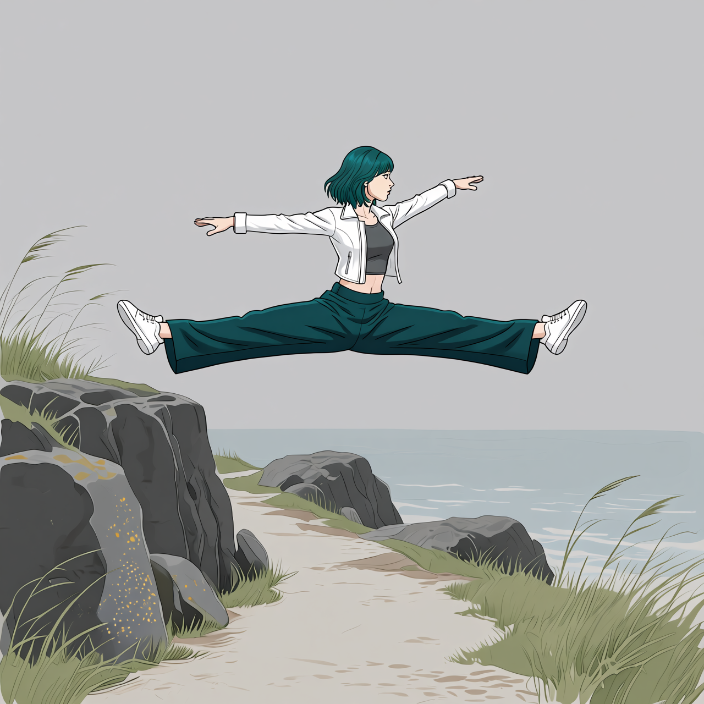 | 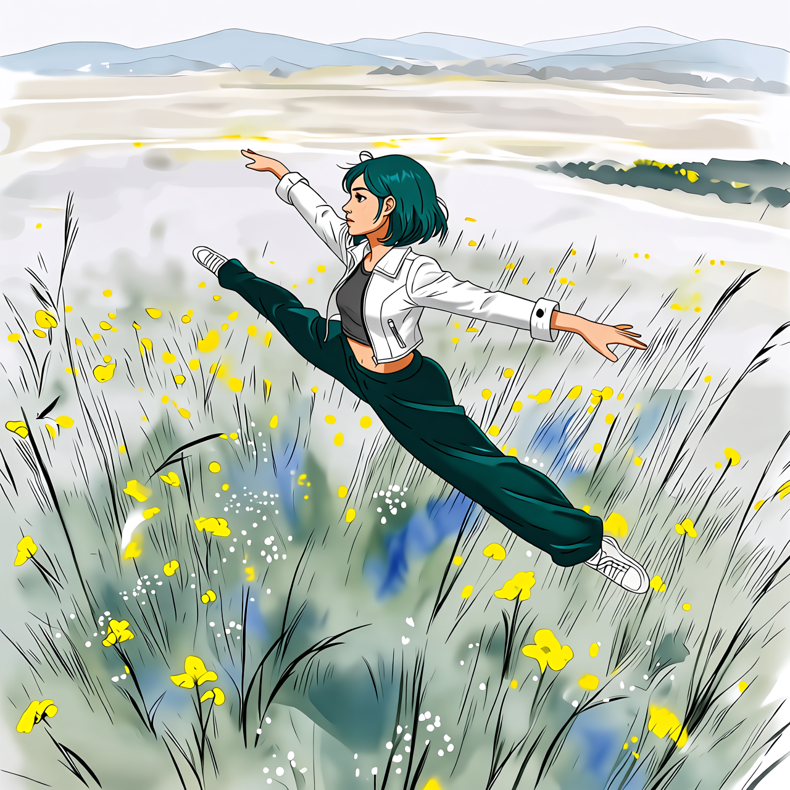 | 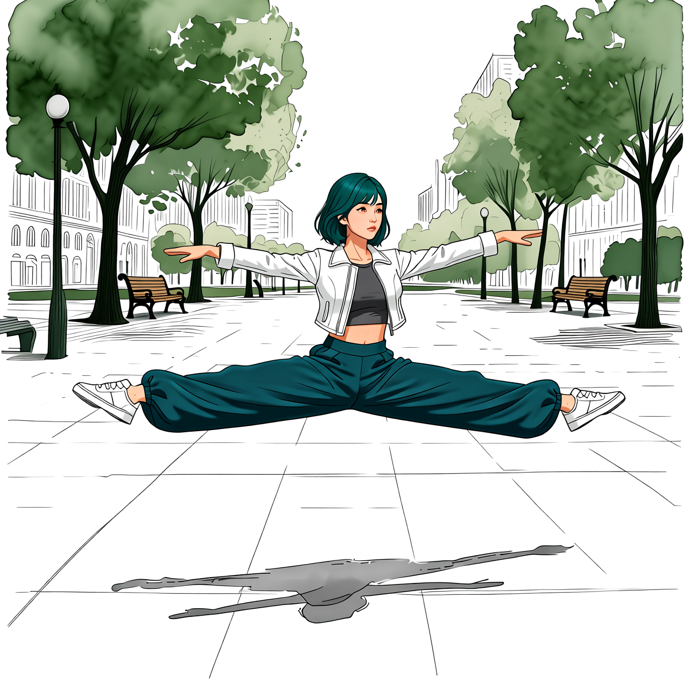 |

1280×1280, seed `62294`, 10 step, true CFG `4.0`에서 회색 컷아웃 배경은 남지 않고 각 장소와 인물 경계가 통합됐다. A·B·C 모두 45도 얼굴 참조의 청록 헤어를 가진 흰 재킷·회색 이너·청록 바지 캐릭터를 각 배경에 넣었다. 즉 다중 참조 통합은 두 이미지의 역할을 따르며, `Picture 2`에 없는 착장을 새로 복원하지 않는다. 공중 인물의 지면 그림자는 새로 설계되지 않았으므로, 이 결과는 마스크 없는 다중 참조 합성의 관찰용 출력이며 접지 그림자 보정까지 끝난 최종 장면은 아니다.

[Qwen 2511 DeLight 다중 참조 통합 코드 보기](../../../assets/part-07/chapter-05/p7_5_5_qwen_edit_2511_composite_delight_multireference.py)

[Scene A BFS DeLight 다중 참조 통합 result.json — JSON — 해안 배경·그림자 포함 BFS 캐릭터의 입력 순서와 실행 조건 보기](/AiBook/assets/part-07/chapter-05/p7-5-5-qwen-2511-delight-multireference-composite-scene-a-bfs-quarter-left-v1-size-1280x1280-seed-62294-steps-10-result.json)

[Scene B BFS DeLight 다중 참조 통합 result.json — JSON — 꽃밭 배경·BFS 캐릭터의 입력 순서와 실행 조건 보기](/AiBook/assets/part-07/chapter-05/p7-5-5-qwen-2511-delight-multireference-composite-scene-b-bfs-quarter-left-v1-size-1280x1280-seed-62294-steps-10-result.json)

[Scene C DeLight 다중 참조 통합 result.json — JSON — 공원 배경·45도 얼굴 참조 캐릭터의 입력 순서와 실행 조건 보기](/AiBook/assets/part-07/chapter-05/p7-5-5-qwen-2511-delight-multireference-composite-scene-c-bfs-quarter-left-v1-size-1280x1280-seed-62294-steps-10-result.json)

#### 통합 장면에 방향광을 다시 적용한다

DeLight는 캐릭터와 배경의 광원을 중립화했으므로, 통합 후에는 단일 이미지 리라이트로 장면의 광원 방향을 다시 정할 수 있다. 여기서는 `dx8152/Qwen-Image-Edit-2509-Relight` LoRA를 사용해 앞의 통합 이미지를 한 장만 입력하고, trigger `重新照明`과 `soft sunlight from the upper right`만 지시했다. 새 캐릭터 참조나 마스크는 이 단계에 넣지 않는다. [dx8152 Relight 모델 카드](https://huggingface.co/dx8152/Qwen-Image-Edit-2509-Relight){: target="_blank" rel="noopener noreferrer"}

| Scene A BFS 통합 리라이트 | Scene B BFS 통합 리라이트 | Scene C BFS 통합 리라이트 |
| --- | --- | --- |
|  |  |  |

1280×1280, seed `62294`, 10 step, LoRA scale `1.0`, true CFG `4.0`에서 A·B·C는 상단 우측이 따뜻하게 밝아지고 반대편은 더 어두워졌다. 인물의 포즈·착장과 각 장소의 구도는 유지됐지만, 이 단일 이미지 리라이트가 공중 인물에 맞는 별도 접지 그림자를 새로 설계한 것은 아니다.

[Qwen 2509 Relight 실행 코드 보기](../../../assets/part-07/chapter-05/p7_5_5_qwen_edit_2509_relight.py)

[Scene A BFS 통합 리라이트 result.json — JSON — BFS 통합 입력, Relight trigger와 실행 조건 보기](/AiBook/assets/part-07/chapter-05/p7-5-5-qwen-2509-relight-scene-a-bfs-quarter-left-v1-size-1280x1280-seed-62294-steps-10-result.json)

[Scene B BFS 통합 리라이트 result.json — JSON — BFS 통합 입력, Relight trigger와 실행 조건 보기](/AiBook/assets/part-07/chapter-05/p7-5-5-qwen-2509-relight-scene-b-bfs-quarter-left-v1-size-1280x1280-seed-62294-steps-10-result.json)

[Scene C BFS 통합 리라이트 result.json — JSON — BFS 통합 입력, Relight trigger와 실행 조건 보기](/AiBook/assets/part-07/chapter-05/p7-5-5-qwen-2509-relight-scene-c-bfs-quarter-left-v1-size-1280x1280-seed-62294-steps-10-result.json)

## 체크리스트

- [ ] P7-5.4의 신규 `extras-audit-20260909-v1` A·B·C와 각 입력 JSON을 연결했는가?
- [ ] A·B·C Mira와 C 조연을 각각 분리하고, 가림 영역·경계 누락·두 C 마스크의 중복을 확인했는가?
- [ ] 원본 픽셀을 복사하는 분리 단계와 외형을 다시 생성하는 아이덴티티 적용 단계를 구분했는가?
- [ ] Mira는 Picture 2의 5.3 최종 3단계 착장을, 조연은 텍스트만 사용했는가?
- [ ] Mira의 머리·신발에 남은 기존 외형과 조연의 손·몸·가림 영역 변화를 확인했는가?
- [ ] 원본 컷아웃의 직접 아이덴티티 적용과 마네킨을 거친 착장 1차 적용의 입력을 구분했는가?
- [ ] A의 앞쪽 발 오류와 얼굴·머리 변화, B의 크기·포즈 변화, C의 착장 반영을 각각 확인했는가?
- [ ] A의 맨발 교체에서 관찰된 개선과 프롬프트 압축·신발 지시 구체화의 원인 해석을 구분했는가?
- [ ] A의 단일 이미지 신발 교체와 바닥면 참조 실패, B의 착장 반영과 포즈 복원 실패를 구분했는가?
- [ ] 현재 결과와 이전 마네킨·조명·합성 실험을 별도 입력의 결과로 구분했는가?

## 출처와 참고 자료

- [Qwen-Image-Edit-2511 모델 카드](https://huggingface.co/Qwen/Qwen-Image-Edit-2511){: target="_blank" rel="noopener noreferrer"}: 그림자 포함 포즈·캐릭터 다중 참조 이식, 배경·캐릭터 통합에 사용한 공식 파이프라인의 입력 형식과 사용 예제를 확인합니다.
- [Grounding DINO Tiny 모델 카드](https://huggingface.co/IDEA-Research/grounding-dino-tiny){: target="_blank" rel="noopener noreferrer"} · [SAM 2 공식 저장소](https://github.com/facebookresearch/sam2){: target="_blank" rel="noopener noreferrer"}: 인물 탐색 상자와 정밀 마스크를 만드는 두 단계의 근거입니다.
- [Qwen-Image-Edit-2509 모델 카드](https://huggingface.co/Qwen/Qwen-Image-Edit-2509){: target="_blank" rel="noopener noreferrer"} · [Studio DeLight 모델 카드](https://huggingface.co/prithivMLmods/QIE-2511-Studio-DeLight){: target="_blank" rel="noopener noreferrer"} · [Relight 모델 카드](https://huggingface.co/dx8152/Qwen-Image-Edit-2509-Relight){: target="_blank" rel="noopener noreferrer"}: 배경·캐릭터의 중립 광원과 통합 장면의 방향광을 확인한 편집 경로입니다.

모델 카드의 일반 기능 설명과 별도로, 이 절에서 실제로 사용한 입력 순서·파일 해시·seed·step·출력 경로는 각 `result.json`을 기준으로 확인합니다.
