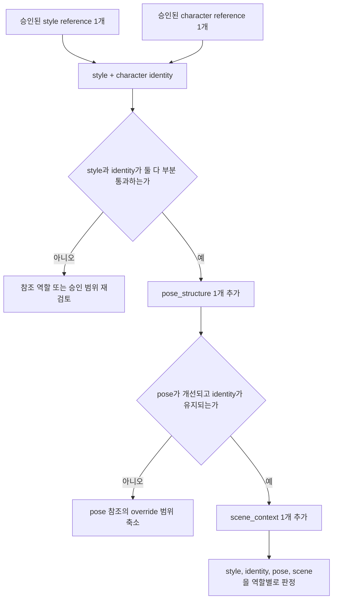
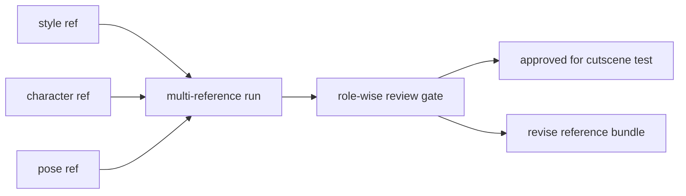

# P7-5.5 보충학습: FLUX 다중참조로 참조 묶음 만들기

> Section ID: `P7-5.5`
> Version: `v2026.08.04`

이 절은 P7-5.1부터 P7-5.4까지의 [생성](../../../reference/concept-glossary-parts/07-siot.md#generation) 파이프라인을 바꾸는 본 실험이 아니라, 그 뒤에 붙는 **보충학습**입니다. 목적은 FLUX.2 Klein 4B의 multi-reference editing을 이용해 여러 참조 이미지를 하나의 참조 묶음으로 구성하고, 그 묶음을 웹툰 컷 생성 전 단계에서 어떻게 사용하는지 설명하는 것입니다.

다중참조는 간단히 말해 **이미지 여러 장을 각각 다른 역할의 참고 자료로 넣고, 새 이미지를 만들거나 고치는 방식**입니다. 예를 들어 한 이미지는 화풍을 맡고, 다른 이미지는 캐릭터 얼굴을 맡고, 또 다른 이미지는 pose나 배경을 맡습니다. 그래서 다중참조는 `좋은 그림 여러 장을 한꺼번에 넣는 것`이 아니라, **각 이미지가 무엇을 담당하는지 정해서 넣는 것**입니다.

이 절의 질문은 **FLUX.2 Klein 4B의 다중참조 기능으로 웹툰 참조 묶음을 만들려면, 어떤 참조를 어떤 순서로 넣고 무엇을 따로 검수해야 하는가**입니다. 산출물은 완성 이미지가 아니라, `style`, `character identity`, `pose/camera`, `scene context`, `local detail`을 서로 다른 참조 역할로 나누어 다중참조 입력으로 사용하는 방법표와 검수 기준입니다.

| 방식 | 입력이 하는 일 | 웹툰 컷 예시 |
| --- | --- | --- |
| prompt만 쓰기 | 문장으로 원하는 장면을 설명함 | `청록색 단발 캐릭터가 비 오는 밤 승강장에 서 있다` |
| 단일참조 | 이미지 한 장을 기준으로 삼음 | 캐릭터 이미지 1장을 넣고, 같은 인물을 다른 장면에 세움 |
| 다중참조 | 여러 이미지를 역할별 참고 자료로 함께 넣음 | 캐릭터는 1번, 화풍은 2번, pose는 3번, 배경은 4번을 참고하게 함 |

웹툰 작업에서 다중참조 입력은 다음처럼 읽습니다.

| 참조 이미지 | [모델](../../../reference/concept-glossary-parts/05-mieum.md#model)에게 맡기는 역할 |
| --- | --- |
| 화풍 배경 1장 | 이런 선, 색감, 수채화 느낌으로 그리라는 기준 |
| 캐릭터 정면 1장 | 얼굴, 눈매, 머리 모양을 유지하라는 기준 |
| 캐릭터 전신 1장 | 의상, 몸 비례, 소품 위치를 참고하라는 기준 |
| pose 이미지 1장 | 자세와 카메라 각도를 따라가라는 기준 |
| 장소 이미지 1장 | 공간 구조와 조명을 참고하라는 기준 |

여기서 조심할 점은 참조를 많이 넣는다고 무조건 좋아지지는 않는다는 것입니다. 배경 이미지의 푸른 조명이 캐릭터 머리색까지 바꿔 버리거나, pose 참조가 캐릭터 얼굴까지 끌고 와서 인물이 달라질 수 있습니다. 그래서 다중참조는 `많이 넣기`가 아니라 **역할을 나눠 넣고, 무엇이 무너졌는지 검수하는 방법**입니다.

## 왜 다중참조를 따로 배워야 하는가

생성형 이미지 모델 실습은 처음에는 텍스트 [프롬프트](../../../reference/concept-glossary-parts/13-pieup.md#prompt)와 seed를 바꾸는 방식으로 시작하기 쉽습니다. 하지만 웹툰처럼 같은 인물과 화풍을 여러 컷에 반복해야 하는 작업에서는 prompt만으로는 부족합니다. 그래서 이전 세대의 실습 흐름에서는 LoRA로 인물이나 화풍을 별도 학습하고, ControlNet으로 pose·depth·edge 같은 구조를 따로 넣고, IP-Adapter 같은 참조 입력으로 이미지 특징을 더하는 식으로 조건을 분리했습니다. 이 방식의 장점은 실패 원인을 비교적 잘 나눌 수 있다는 점입니다. pose가 틀렸는지, identity가 틀렸는지, 색이 틀렸는지를 서로 다른 입력 축에서 확인할 수 있습니다.

FLUX.2 계열은 이 흐름을 다른 방향으로 발전시킵니다. Diffusers 문서는 Flux.2를 FLUX.1 뒤에 나온 새 계열로 설명하고, 새 architecture와 새 pre-training으로 만들어졌다고 밝힙니다. Black Forest Labs의 FLUX.2 공개 저장소는 FLUX.2 모델군이 text-to-image, single-reference editing, multi-reference editing을 지원한다고 정리합니다. 즉, 예전처럼 별도 보조 모델을 계속 붙이는 방식만 있는 것이 아니라, 생성과 편집, 단일 참조와 다중참조를 한 모델 계열 안에서 함께 다루는 방향이 생긴 것입니다.

이 변화가 편집 기준을 없애지는 않습니다. 오히려 P7-5의 학습 관점에서는 더 좋은 질문을 만듭니다. 예전 방식에서는 입력 도구가 나뉘어 있었기 때문에 역할도 어느 정도 나뉘어 보였습니다. FLUX.2 Klein 4B에서는 같은 파이프라인 안에 여러 참조가 들어갈 수 있으므로, 사람이 먼저 참조 역할을 선언하고 출력 뒤에 어떤 역할이 보존되었는지 판정해야 합니다.

| 역사적 흐름 | 대표 입력 방식 | 장점 | P7-5에서 회수할 질문 |
| --- | --- | --- | --- |
| text-to-image 중심 | prompt, seed, step, guidance | 실행이 단순하고 baseline을 만들기 쉬움 | 텍스트만으로 화풍과 장면이 얼마나 남는가 |
| 보조 조건 분리 | LoRA, ControlNet, IP-Adapter, inpaint | identity, structure, local repair를 따로 비교하기 쉬움 | 실패가 어느 입력 축에서 생겼는가 |
| 통합 생성·편집 계열 | FLUX.2의 single-reference와 multi-reference editing | 같은 모델 계열에서 생성과 편집을 이어 볼 수 있음 | 여러 참조가 서로 충돌할 때 무엇을 기준으로 판정할 것인가 |

## FLUX.2 Klein 4B에서 다중참조는 참조 묶음을 실험하는 방법이다

FLUX.2 Klein 4B 모델 카드는 이 모델을 4B 규모의 rectified-flow transformer로 설명하고, text-to-image, image editing, multi-reference editing을 지원한다고 밝힙니다. 공개 가중치는 Apache 2.0 라이선스로 제공됩니다. Black Forest Labs의 FLUX.2 저장소도 klein 4B를 consumer GPU용 빠른 모델로 제시하며, 4B 모델이 text-to-image와 단일·다중 참조 편집을 지원한다고 정리합니다.

이 장점은 이 보충학습의 출발점입니다. 여기서는 FLUX.2 Klein 4B의 다중참조 기능을 이용해 `style reference + character reference`, `style reference + character reference + pose reference`, `style reference + character reference + pose reference + scene reference`처럼 입력 묶음을 단계적으로 구성하는 방법을 설명합니다. 그러나 모델 카드의 한계 설명처럼, 모델은 prompt를 완전히 따르지 못하거나 렌더링된 글자와 세부 표현을 왜곡할 수 있습니다. 따라서 `multi-reference 지원`은 여러 참조를 넣어 실험할 수 있다는 뜻이지, 여러 참조의 화풍·인물성·소품 geometry·pose가 모두 통과한다는 뜻이 아닙니다.

P7-5.1에서 만든 화풍 참조 셋, P7-5.2에서 만들 캐릭터 참조 셋, P7-5.3의 컷신 조건, P7-5.4의 보정 조건은 다중참조 한 번으로 합쳐서 없앨 단계가 아닙니다. 다중참조 실험은 이 네 단계에서 승인한 입력을 FLUX.2 Klein 4B의 한 편집 입력 묶음으로 조합해 보고, **어떤 역할이 잘 결합되고 어떤 역할이 서로 덮어쓰는지**를 확인하는 보충 단계입니다.

| FLUX.2 Klein 4B의 유리한 점 | 바로 따라오는 검수 필요 |
| --- | --- |
| 생성과 편집을 같은 모델 계열에서 이어 볼 수 있음 | 생성 성공과 승인 통과를 분리해야 함 |
| single-reference와 multi-reference editing을 지원함 | 참조를 역할별 묶음으로 넣고, 참조 수 증가가 identity 안정화나 style 보존을 보장하지 않음을 확인해야 함 |
| 4B 공개 가중치와 Apache 2.0 라이선스가 제공됨 | 실험 조건, 참조 역할, 실패 신호를 manifest에 남겨야 함 |
| 빠른 후보 반복을 목표로 한 klein 계열임 | 빠른 반복은 검수 생략의 근거가 아님 |

## 대표 모델은 역할이 조금씩 다르다

다중참조를 설명할 때 모든 모델을 같은 범주로 묶으면 오히려 흐름이 흐려집니다. P7-5.5의 중심 모델은 FLUX.2 Klein 4B입니다. 이 모델을 쓰는 이유는 공개 가중치와 Diffusers 실행 경로를 바탕으로, 8 GB급 로컬 환경에서 참조 묶음을 작게 나누어 실험할 수 있기 때문입니다. 반면 Gemini Image와 Seedream 4.0은 다중참조가 상용 이미지 생성·편집 모델에서 어떤 방향으로 쓰이는지 보여 주는 비교 사례입니다. IP-Adapter 계열은 FLUX.2 이전의 참조 입력 사고방식을 설명하는 역사적 기준점입니다.

| 모델 또는 계열 | 다중참조에서 두드러지는 점 | 이 절에서의 역할 |
| --- | --- | --- |
| FLUX.2 Klein 4B | text-to-image와 image editing, multi-reference editing을 같은 klein 계열에서 다룸 | 이 절의 중심 실험 모델 |
| FLUX.2 pro/flex/max 계열 | BFL API와 playground에서 여러 input image를 함께 써 professional editing과 composite를 구성 | FLUX.2 다중참조 사용법의 상위 비교 사례 |
| Gemini Image 계열 | 여러 reference image를 섞어 object fidelity와 character consistency를 유지하는 흐름을 강조 | 상용 다중참조의 고성능 비교 사례 |
| Seedream 4.0 | 이미지 생성과 편집을 통합하고, 여러 reference image를 한 번에 받아 reference consistency와 image composition을 다룸 | 통합 생성·편집 모델의 다른 구현 사례 |
| IP-Adapter 계열 | Stable Diffusion 계열에 image prompt/reference 기능을 adapter로 붙임 | FLUX.2 이전의 보조 입력 분리 흐름 |

이 표에서 FLUX.2 Klein 4B를 대표로 두는 이유는 `가장 강한 모델`이어서가 아닙니다. P7-5의 학습 목표가 로컬 실행, 입력 조건 분리, 실패 추적이기 때문입니다. Gemini Image나 Seedream 4.0은 다중참조 기능이 더 넓은 상용 워크플로우에서 어떻게 쓰이는지 보여 주지만, 이 절의 실험 기록 단위는 FLUX.2 Klein 4B의 작은 참조 묶음으로 유지합니다.

## 참조 이미지는 역할을 먼저 붙인다

앞에서 다중참조를 역할별 참고 자료라고 잡았다면, 다음 단계는 그 역할을 파일마다 명시하는 것입니다. 좋은 화풍 예시, 좋은 정면 얼굴, 좋은 전신 pose, 좋은 배경을 한 번에 넣어도 역할이 적혀 있지 않으면 모델이 어떤 이미지를 색 기준으로 삼고, 어떤 이미지를 얼굴 기준으로 삼고, 어떤 이미지를 camera 기준으로 삼아야 하는지 충돌할 수 있습니다. 그래서 참조는 파일 이름보다 먼저 역할을 가져야 합니다.

| 참조 역할 | 입력 예 | 보존하려는 것 | 덮어쓰면 안 되는 것 |
| --- | --- | --- | --- |
| `style` | P7-5.1에서 승인한 프레임 없는 배경 화풍 원본 | 선, 수채화 색층, 광원, camera 폭 | 캐릭터 얼굴·피부·머리 기본색 |
| `character_identity` | P7-5.2의 정면·3/4·전신 기준 | 얼굴 인상, hair shape, 의상, 소품 | 장면 배경, 시간대 조명 전체 |
| `pose_structure` | pose 또는 silhouette 기준 이미지 | 몸 방향, 손발 위치, camera angle | 얼굴 세부, 화풍 색층 |
| `scene_context` | 장소·시간·배경 reference | 공간 구조, 광원, 전경·후경 관계 | 캐릭터 identity |
| `local_detail` | 손, 얼굴, 소품 접점 detail | 작은 부위의 형태 확인 | full-frame 구조와 인물성 |

이 표의 핵심은 `무엇을 보존할지`만 쓰지 않는다는 점입니다. 각 참조가 `무엇을 덮어쓰면 안 되는지`까지 써야 합니다. 예를 들어 우천 야간 배경 reference는 장면의 남색 그림자와 반사광을 줄 수 있지만, 캐릭터의 머리카락 기본색을 회색으로 바꾸는 근거가 되어서는 안 됩니다. 얼굴 close-up reference는 눈매와 앞머리를 확인하는 입력일 수 있지만, 전신 비례와 가방 위치를 새로 정의하는 입력은 아닙니다.

## 8 GB 실험에서는 한 번에 많이 넣지 않는다

P7-5.1의 기본 가정은 8 GB VRAM에서 `화풍 참조 셋 -> 캐릭터 참조 셋 -> 컷씬 -> 화풍 보정`을 분절해 실행하는 것입니다. 다중참조 보충학습도 같은 제약을 유지합니다. 한 번에 참조를 많이 넣는 실험은 메모리뿐 아니라 해석도 어렵게 만듭니다. 출력이 실패했을 때 style reference가 문제인지, character reference가 문제인지, pose reference가 문제인지 구분할 수 없기 때문입니다.

따라서 시작 실험은 `style` 하나와 `character_identity` 하나만 묶습니다. 이 조합에서 화풍과 인물성이 부분 통과하는지 본 뒤, `pose_structure`를 하나 추가합니다. 그다음에야 `scene_context`를 추가합니다. 실패가 생기면 마지막에 추가한 참조 역할부터 의심합니다. 이 방식은 빠른 생성보다 학습 해석을 우선하는 절차입니다.

이 도식에서 중요한 것은 화살표가 `참조를 더 넣으면 좋아진다`로 읽히지 않는다는 점입니다. 각 단계는 새 참조를 하나 넣고, 이전에 통과한 역할이 무너졌는지 확인하는 ablation입니다. 결과가 나빠지면 다음 참조를 더하지 않고, 방금 추가한 역할과 금지 override를 다시 봅니다.

아래는 실제 실행 전에 작성해 두는 실험 예제입니다. 이 절에서는 모델을 실행하지 않지만, 나중에 실행한다면 한 행씩만 바꾸고 관찰 항목을 같은 순서로 비교합니다.

| run ID | 참조 묶음 | 이번 행에서 바뀌는 것 | 관찰할 출력 변화 | 중단 신호 |
| --- | --- | --- | --- | --- |
| `run_5_5_ablation_01` | `style` + `character_identity` | 다중참조의 최소 묶음 | 화풍 선·색층과 캐릭터 얼굴·머리·의상이 함께 남는가 | 캐릭터 기본색이 배경 화풍에 묻힘 |
| `run_5_5_ablation_02` | `style` + `character_identity` + `pose_structure` | pose 참조 1개 추가 | pose와 camera가 개선되면서 identity가 유지되는가 | pose는 맞지만 얼굴·hair·의상이 바뀜 |
| `run_5_5_ablation_03` | `style` + `character_identity` + `pose_structure` + `scene_context` | 장면 참조 1개 추가 | 공간 구조와 조명이 붙어도 style·identity·pose가 유지되는가 | 배경 조명이 피부·머리·의상 기본색을 덮어씀 |

이 예제의 비교값은 `참조 묶음`입니다. seed, prompt, 해상도, step 같은 실행 조건은 같은 값으로 고정해야 참조 추가의 효과를 볼 수 있습니다. [모델 출력](../../../reference/concept-glossary-parts/05-mieum.md#model-output) 이미지를 얻었다면 각 행을 `pass`, `partial`, `fail`로만 끝내지 않고, 어느 참조 역할이 무엇을 침범했는지 한 문장으로 남깁니다.

## 입력 manifest는 상세하게, 실행 차트는 간단하게 쓴다

다중참조 실험의 입력 manifest는 상세해야 합니다. 하지만 Mermaid 차트는 너무 많은 파일명과 판정 문구를 넣으면 읽기 어렵습니다. 그래서 문서 안에서는 두 층으로 나눕니다. 상세 manifest에는 실제 파일, 역할, 승인 범위, 금지 override, 실패 신호를 적습니다. 차트에는 역할 묶음과 판정 gate만 넣습니다.

| manifest 필드 | 예시 | 쓰는 이유 |
| --- | --- | --- |
| `reference_id` | `style_indoor_dawn_approved_01` | 사람이 추적할 참조 단위 |
| `reference_role` | `style` | 모델에 기대하는 역할 |
| `source_section` | `P7-5.1` | 어느 승인 절차에서 온 입력인지 |
| `approved_scope` | `thin line, transparent watercolor layer, dawn atrium light` | 이 참조가 바꿔도 되는 범위 |
| `must_not_override` | `character hair color, face identity, outfit color` | 이 참조가 바꾸면 실패인 범위 |
| `used_in_run` | `run_5_5_ablation_02` | 실제 실행 기록과 연결 |
| `failure_signals` | `hair desaturated, face drift, panel border appears` | 출력 뒤 검수할 신호 |

차트에는 이 상세 정보를 모두 넣지 않고, 다음처럼 역할 묶음만 넣습니다.

이렇게 나누면 원고를 읽는 독자는 큰 흐름을 차트로 보고, 실제 실험자는 manifest에서 입력 조건을 재현할 수 있습니다. 차트가 manifest를 대신하지 않고, manifest가 본문 흐름을 어지럽히지 않는 구조입니다.

## 실행 전에 참조 역할표를 먼저 채운다

이 연습은 모델을 실행하지 않습니다. 목표는 손에 있는 참조 후보를 보고, 각 이미지가 다중참조 묶음 안에서 어떤 역할을 맡아야 하는지 먼저 분류하는 것입니다. 아래 표의 빈칸을 채울 때 한 이미지에 여러 역할을 주고 싶다면, 그중 주 역할 하나를 먼저 고릅니다.

| 참조 후보 | 주 역할 | 바꿔도 되는 범위 | 바꾸면 안 되는 범위 | 실패하면 의심할 신호 |
| --- | --- | --- | --- | --- |
| 프레임 없는 실내 새벽 배경 화풍 원본 |  |  |  |  |
| 캐릭터 정면 얼굴 기준 |  |  |  |  |
| 캐릭터 전신 의상 기준 |  |  |  |  |
| 옆면 pose 또는 silhouette 기준 |  |  |  |  |
| 우천 야간 승강장 배경 기준 |  |  |  |  |

채운 표를 검토할 때는 두 가지를 봅니다. 첫째, 모든 참조가 `style`, `character_identity`, `pose_structure`, `scene_context`, `local_detail` 중 하나의 주 역할을 갖는지 확인합니다. 둘째, `바꿔도 되는 범위`보다 `바꾸면 안 되는 범위`가 더 모호한 행을 찾습니다. 예를 들어 우천 야간 배경 기준의 금지 범위에 캐릭터 피부·머리·의상 기본색이 적혀 있지 않다면, 다중참조 실행 전에 manifest를 다시 써야 합니다.

## 실패는 충돌 유형으로 기록한다

다중참조 실패는 단순히 `나쁨`으로 적으면 다음 실험을 고칠 수 없습니다. 어떤 참조 역할이 어떤 역할을 침범했는지 적어야 합니다.

| 실패 신호 | 가능한 충돌 | 다음 조치 |
| --- | --- | --- |
| 얼굴이 style 이미지의 인물 없는 색감에 묻힘 | `style`이 `character_identity`를 덮어씀 | style reference의 승인 범위를 선·색층·광원으로 좁힘 |
| pose는 맞지만 hair와 의상이 바뀜 | `pose_structure`가 identity까지 끌고 옴 | pose reference를 silhouette 중심으로 바꾸거나 character reference를 먼저 고정 |
| 배경 reference의 야간 색이 피부색을 바꿈 | `scene_context`가 캐릭터 기본색을 덮어씀 | scene reference의 `must_not_override`를 피부·머리·의상으로 명시 |
| close-up 얼굴은 좋아졌지만 전신 비례가 무너짐 | `local_detail`이 full-frame 구조를 침범 | local detail은 full-frame 통과 뒤 보정 단계로 이동 |
| 여러 참조를 넣었는데 원인 추적이 안 됨 | 입력 역할이 동시에 너무 많이 바뀜 | 마지막으로 추가한 참조를 제거하고 하나씩 다시 비교 |

FLUX.2 Klein 4B의 다중참조 기능은 P7-5의 웹툰 파이프라인을 단축하는 마법 버튼이 아니라, 승인된 참조 묶음을 더 풍부하게 시험하는 방법입니다. 역사적으로 입력 조건은 text prompt에서 보조 조건 분리로, 다시 통합 생성·편집 계열의 다중참조로 발전했습니다. 하지만 학습자가 붙잡아야 할 기준은 바뀌지 않습니다. **입력을 역할로 나누고, 출력 실패를 역할 충돌로 읽고, 승인 gate를 통과한 것만 다음 단계로 넘긴다**는 점입니다.

## 체크리스트

- 다중참조 묶음에 들어가는 각 이미지가 `style`, `character_identity`, `pose_structure`, `scene_context`, `local_detail` 중 하나의 주 역할을 갖는가?
- 각 참조의 `approved_scope`와 `must_not_override`가 manifest에 함께 적혀 있는가?
- 처음부터 모든 참조를 넣지 않고, `style + character`에서 시작해 pose와 scene을 하나씩 추가했는가?
- 새 참조를 추가한 뒤 이전에 통과한 style, identity, pose가 무너지지 않았는지 따로 판정했는가?
- 실패했을 때 마지막으로 추가한 참조 역할부터 제거하고 다시 비교할 수 있는 기록이 남아 있는가?

## 참고 자료

- Hugging Face Diffusers, [LoRA training guide](https://huggingface.co/docs/diffusers/main/en/training/lora){: target="_blank" rel="noopener noreferrer" }, 확인일: 2026-08-04.
- Zhang et al., [ControlNet official implementation](https://github.com/lllyasviel/ControlNet){: target="_blank" rel="noopener noreferrer" }, 확인일: 2026-08-04.
- Tencent AI Lab, [IP-Adapter official implementation](https://github.com/tencent-ailab/IP-Adapter){: target="_blank" rel="noopener noreferrer" }, 확인일: 2026-08-04.
- Black Forest Labs, [FLUX.2 공개 저장소](https://github.com/black-forest-labs/flux2){: target="_blank" rel="noopener noreferrer" }, 확인일: 2026-08-04.
- Black Forest Labs, [FLUX.2 Klein 4B 모델 카드](https://huggingface.co/black-forest-labs/FLUX.2-klein-4B){: target="_blank" rel="noopener noreferrer" }, 확인일: 2026-08-04.
- Black Forest Labs, [FLUX.2 image editing documentation](https://bfl.mintlify.app/flux_2/flux2_image_editing){: target="_blank" rel="noopener noreferrer" }, 확인일: 2026-08-04.
- Black Forest Labs, [FLUX.2 multi-reference editing guide](https://bfl.mintlify.app/guides/prompting_editing_multi_reference){: target="_blank" rel="noopener noreferrer" }, 확인일: 2026-08-04.
- Google AI for Developers, [Gemini API image generation](https://ai.google.dev/gemini-api/docs/image-generation){: target="_blank" rel="noopener noreferrer" }, 확인일: 2026-08-04.
- ByteDance Seed, [Seedream 4.0](https://seed.bytedance.com/en/seedream4_0){: target="_blank" rel="noopener noreferrer" }, 확인일: 2026-08-04.
- Hugging Face Diffusers, [Flux2 pipeline documentation](https://huggingface.co/docs/diffusers/api/pipelines/flux2){: target="_blank" rel="noopener noreferrer" }, 확인일: 2026-08-04.
