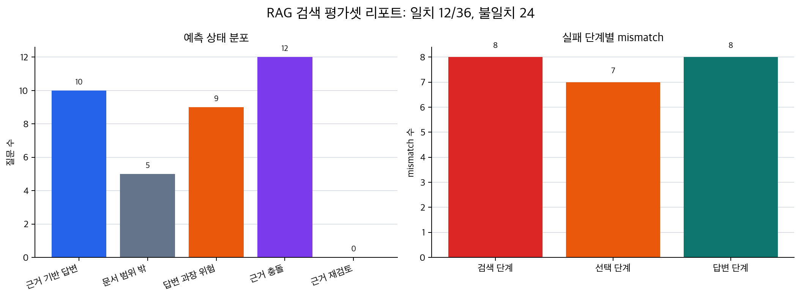

# P7-5.5 검색 평가셋으로 근거 품질을 다시 점검하기

Section ID: `P7-5.5`
Version: `v2026.07.23`

P7-5.4에서는 ChromaDB와 TF-IDF 임베딩을 사용해 검색 설정이 후보 목록을 어떻게 바꾸는지 보았습니다. 하지만 실제 RAG 프로젝트에서는 `검색 결과가 나왔다`만으로 품질을 닫을 수 없습니다. 질문이 문서 범위 안에 있는지, 검색 후보가 직접 답 근거인지, 후보가 있어도 답변이 과장될 위험이 있는지 따로 점검해야 합니다.

검색 평가셋(retrieval evaluation set)은 이런 점검을 위해 만든 작은 질문 묶음입니다. 각 질문에는 기대 상태를 붙입니다. 어떤 질문은 근거 기반 답변이 가능해야 하고, 어떤 질문은 문서 범위 밖이라 멈춰야 하며, 어떤 질문은 검색 후보가 있어도 답변 과장 위험을 남겨야 합니다.

## 검색 결과와 답변 가능 상태는 다르다

- 검색 점수가 높으면 항상 답변해도 되는가?
- 문서 범위 밖 질문과 검색 실패는 어떻게 다르게 기록하는가?
- RAG 평가셋에는 왜 정답 문장뿐 아니라 기대 상태를 남겨야 하는가?

핵심은 검색 후보 목록을 `답변 재료`로만 보지 않는 것입니다. 후보 목록은 답변하기 전에 먼저 검토해야 하는 품질 신호입니다. 문서가 없으면 거절해야 하고, 문서가 있어도 질문이 너무 강하게 일반화하면 답변 과장 위험을 남겨야 합니다.

## 판단 기준

- RAG 검색 평가셋을 `질문`, `기대 상태`, `실패 단계`, `검토 초점`으로 설명할 수 있습니다.
- 검색 점수와 답변 가능 상태가 같은 것이 아님을 설명할 수 있습니다.
- 검색 평가 결과를 mismatch 목록과 다음 보강 항목으로 남길 수 있습니다.

## 입력 파일

- 문서 조각 파일: [`p7-5-rag-documents.csv`](../../../assets/part-07/chapter-05/p7-5-rag-documents.csv){ .csv-preview }
- 검색 평가셋 파일: [`p7-5-boundary-cases.csv`](../../../assets/part-07/chapter-05/p7-5-boundary-cases.csv){ .csv-preview }

평가셋의 한 행은 `질문 하나`입니다. 중요한 열은 다음과 같습니다.

| 열 | 의미 |
| --- | --- |
| `question` | 검색 시스템에 넣을 질문 |
| `expected_state` | 기대하는 답변 가능 상태 |
| `failure_stage` | 실패한다면 검색, 선택, 답변 중 어디서 멈춰야 하는지 |
| `focus` | 이 질문을 평가셋에 넣은 이유 |

여기서 `expected_state`는 모델이 맞혀야 하는 정답 문장이라기보다, RAG 프로젝트가 남겨야 하는 상태 라벨입니다. 예를 들어 문서에 없는 가격 정책을 물으면 좋은 답변은 그럴듯한 가격 설명이 아니라 `문서 범위 밖` 상태를 남기는 것입니다.

## Python 예제

예제는 scikit-learn의 `TfidfVectorizer`와 `cosine_similarity`로 질문과 문서의 유사도를 계산합니다. 이것은 완성된 RAG 평가기가 아니라, 검색 평가셋을 어떤 형태로 기록할 수 있는지 보여 주는 작은 실험입니다. 규칙 기반 상태 판정은 일부러 단순하게 둡니다. 단순한 규칙이 어디서 틀리는지를 보는 것이 이 절의 학습 목표이기 때문입니다.

- 문제 상황: 검색 점수만으로 답변 가능 상태를 판단하면 어떤 mismatch가 남는지 확인한다.
- 입력: 문서 조각 36개, 검색 평가 질문 36개
- 조작할 값: `top_k`, `min_score`, `margin_threshold`
- 관찰할 출력: 상태별 개수, 기대 상태와 다른 사례, 먼저 보강할 질문

```python
import csv
from collections import Counter
from pathlib import Path

from sklearn.feature_extraction.text import TfidfVectorizer
from sklearn.metrics.pairwise import cosine_similarity

document_path = Path("docs/assets/part-07/chapter-05/p7-5-rag-documents.csv")
case_path = Path("docs/assets/part-07/chapter-05/p7-5-boundary-cases.csv")

documents = list(csv.DictReader(document_path.open(encoding="utf-8")))
cases = list(csv.DictReader(case_path.open(encoding="utf-8")))

# 조작 변수: 후보 수와 낮은 점수 기준을 바꾸면 mismatch 구조가 달라진다.
top_k = 3
min_score = 0.16
margin_threshold = 0.04

vectorizer = TfidfVectorizer(ngram_range=(1, 2), min_df=1)
document_matrix = vectorizer.fit_transform([document["text"] for document in documents])
query_matrix = vectorizer.transform([case["question"] for case in cases])
similarity_matrix = cosine_similarity(query_matrix, document_matrix)

def classify_search_state(case, retrieved_documents):
    question = case["question"]
    top_score = retrieved_documents[0]["score"]
    second_score = retrieved_documents[1]["score"] if len(retrieved_documents) > 1 else 0
    margin = top_score - second_score
    joined_text = " ".join(document["text"] for document in retrieved_documents)

    if top_score < min_score:
        return "문서 범위 밖"
    if any(word in joined_text for word in ["충돌", "최신 정책", "예전 FAQ", "버전"]):
        return "근거 충돌"
    if any(word in question for word in ["항상", "모든", "완전히", "해결되는가"]):
        return "답변 과장 위험"
    if margin < margin_threshold:
        return "근거 재검토"
    return "근거 기반 답변"

records = []

for case_index, case in enumerate(cases):
    ranking = similarity_matrix[case_index].argsort()[::-1][:top_k]
    retrieved_documents = [
        {
            "doc_id": documents[document_index]["doc_id"],
            "text": documents[document_index]["text"],
            "score": round(float(similarity_matrix[case_index, document_index]), 3),
        }
        for document_index in ranking
    ]

    predicted_state = classify_search_state(case, retrieved_documents)
    records.append(
        {
            "case_id": case["case_id"],
            "expected_state": case["expected_state"],
            "predicted_state": predicted_state,
            "match": predicted_state == case["expected_state"],
            "failure_stage": case["failure_stage"],
            "top_doc": retrieved_documents[0]["doc_id"],
            "top_score": retrieved_documents[0]["score"],
            "focus": case["focus"],
        }
    )

summary = {
    "평가 질문 수": len(records),
    "상태 일치 수": sum(record["match"] for record in records),
    "상태 불일치 수": sum(not record["match"] for record in records),
    "예측 상태 분포": dict(Counter(record["predicted_state"] for record in records)),
}

mismatches = [record for record in records if not record["match"]]
priority_reviews = sorted(
    mismatches,
    key=lambda record: (record["failure_stage"] != "검색 단계", -record["top_score"]),
)[:6]

print("검색 평가 요약 =", summary)
print("먼저 검토할 mismatch =")
for record in priority_reviews:
    print(record)
```

실행하면 다음처럼 `정답률`보다 먼저 볼 mismatch 목록이 나옵니다.

```text
검색 평가 요약 = {'평가 질문 수': 36, '상태 일치 수': 12, '상태 불일치 수': 24, '예측 상태 분포': {'근거 기반 답변': 10, '문서 범위 밖': 5, '답변 과장 위험': 9, '근거 충돌': 12}}
먼저 검토할 mismatch =
{'case_id': '연습-11', 'expected_state': '문서 범위 밖', 'predicted_state': '근거 충돌', 'match': False, 'failure_stage': '검색 단계', 'top_doc': '문서-13', 'top_score': 0.38, 'focus': '근거 부족 거절'}
{'case_id': '연습-19', 'expected_state': '문서 범위 밖', 'predicted_state': '근거 충돌', 'match': False, 'failure_stage': '검색 단계', 'top_doc': '문서-13', 'top_score': 0.38, 'focus': '근거 부족 거절'}
{'case_id': '연습-07', 'expected_state': '검색 실패', 'predicted_state': '근거 기반 답변', 'match': False, 'failure_stage': '검색 단계', 'top_doc': '문서-11', 'top_score': 0.274, 'focus': '문서 집합에는 관련 내용이 있지만 현재 검색 규칙이 표현 차이를 놓치는 경우'}
...
```

평가 결과를 공유할 때는 mismatch 목록만 붙이면 전체 구조가 잘 보이지 않습니다. 다음 리포트 이미지는 [`p7_5_retrieval_eval_report.py`](../../../assets/part-07/chapter-05/p7_5_retrieval_eval_report.py)가 같은 문서 조각과 평가셋을 읽어 만든 요약입니다.



왼쪽 그래프는 규칙이 어떤 상태를 많이 예측했는지 보여 줍니다. 오른쪽 그래프는 기대 상태와 달랐던 사례가 어느 실패 단계에 몰리는지 보여 줍니다. 보고서에는 이런 그림을 먼저 두고, 그 아래에 `먼저 검토할 mismatch` 목록을 붙이면 검색 설정 문제와 답변 정책 문제를 구분하기 쉬워집니다.

이 결과에서 `상태 일치 수`가 낮다는 사실만 보면 규칙이 나쁜 것처럼 보입니다. 하지만 이 절의 목적은 좋은 자동 평가기를 완성하는 것이 아닙니다. 더 중요한 것은 어떤 질문이 검색 단계에서 멈춰야 하는데도 답변 가능으로 보였는지, 어떤 질문이 근거 충돌로 과하게 묶였는지, 어떤 단어 규칙이 기대 상태를 흐렸는지 발견하는 것입니다.

즉, RAG 검색 평가셋은 다음 질문을 남기기 위한 장치입니다.

| mismatch 유형 | 다음 보강 질문 |
| --- | --- |
| 문서 범위 밖인데 근거 기반 답변으로 나옴 | 낮은 점수 기준이나 허용 문서 범위를 더 보수적으로 잡아야 하는가? |
| 검색 실패인데 근거 기반 답변으로 나옴 | 표현 차이를 잡기 위해 query rewrite 또는 동의어 처리가 필요한가? |
| 근거 기반 답변인데 근거 충돌로 나옴 | 충돌 감지 규칙이 너무 넓게 작동하지 않는가? |
| 답변 과장 위험인데 근거 기반 답변으로 나옴 | 질문의 `항상`, `모든`, `완전히` 같은 강한 표현을 따로 검사해야 하는가? |

## 직접 바꿔 보며 확인할 것

1. `top_k = 3`을 `top_k = 5`로 바꿔 봅니다.
   - 관찰할 점: 후보가 늘면 근거 충돌이나 과장 위험 판정이 늘어나는가?

2. `min_score = 0.16`을 `0.20`으로 바꿔 봅니다.
   - 관찰할 점: 문서 범위 밖으로 처리되는 질문이 늘어나는가?

3. `margin_threshold = 0.04`를 `0.10`으로 바꿔 봅니다.
   - 관찰할 점: 근거 재검토 상태가 더 많이 나오며, 그 변화가 실제로 유용한가?

핵심은 검색 평가셋이 높은 점수만 찾는 도구가 아니라는 점입니다. 좋은 RAG 기록은 답변 성공뿐 아니라 `멈춰야 하는 질문`, `검색은 됐지만 답변하면 위험한 질문`, `근거가 충돌하는 질문`을 함께 남깁니다.

## 체크리스트

- [ ] 검색 평가셋에 답변 가능한 질문과 멈춰야 하는 질문이 함께 들어 있는가?
- [ ] 검색 점수와 답변 가능 상태를 같은 것으로 취급하지 않았는가?
- [ ] mismatch를 실패 점수로만 보지 않고 다음 보강 질문으로 바꾸었는가?
- [ ] `top_k`, `min_score`, `margin_threshold`를 바꿨을 때 어떤 상태가 늘어나는지 확인했는가?

## 출처와 참고 자료

- scikit-learn, [Pairwise metrics, Affinities and Kernels: Cosine similarity](https://scikit-learn.org/stable/modules/metrics.html#cosine-similarity){: target="_blank" rel="noopener noreferrer" }, 확인일: 2026-07-23.
