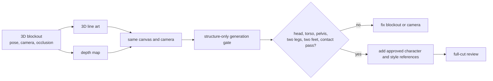
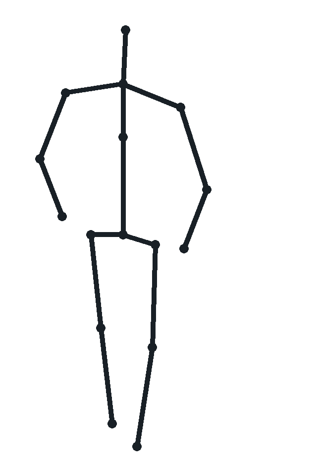
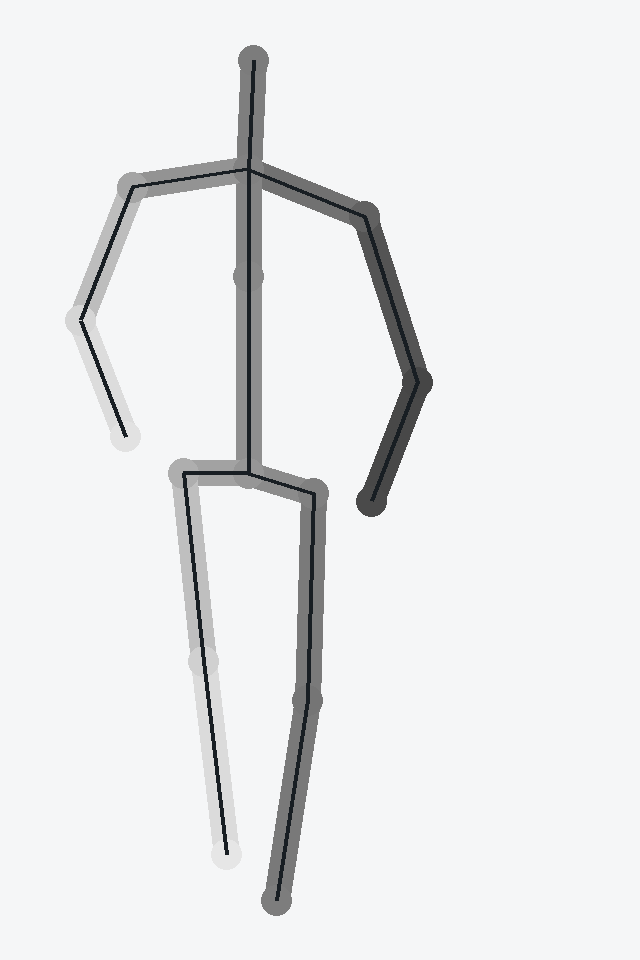

# P7-5.6 보충학습: 3D 선화와 depth+선화로 구조 입력 읽기

> Section ID: `P7-5.6`
> Version: `v2026.08.04`

P7-5.3의 컷신에서 pose와 camera를 바꾸려면, 생성 모델에 무엇을 유지해야 하는지 먼저 정해야 합니다. 이 보충학습에서는 요청한 `3D linear`를 **3D 장면을 카메라로 투영해 얻은 선화(line art)**라는 뜻으로 사용합니다. 3D 선화는 관절 연결, 몸의 외곽, 화면 안 위치를 알려 줍니다. 여기에 depth map을 더한 `3D depth+선화`는 같은 위치의 앞뒤 순서와 가림 관계도 알려 줍니다.

이 절의 질문은 **웹툰 컷의 구조 입력에서 3D 선화만으로 남는 정보와 depth를 더했을 때 추가되는 정보는 무엇인가**입니다. 산출물은 선화와 depth+선화의 역할을 구분하는 판단표, 그리고 투영 각도를 바꿔 두 구조 지도를 출력해 보는 Python 예제입니다. 이것은 캐릭터 원화나 완성 컷을 만드는 절이 아닙니다.

## 윤곽은 보이지만 앞뒤는 비어 있다

3D 선화는 3D 장면에서 camera가 보는 윤곽과 연결선을 2D 화면으로 옮긴 결과입니다. Blender의 Freestyle은 mesh와 Z-depth 정보를 이용해 edge와 line을 만들 수 있지만, 최종 Freestyle 결과 자체에는 Z-depth 정보가 남지 않는다고 설명합니다. 즉 선화 이미지를 받은 생성 모델은 `어디가 연결되는가`는 읽을 수 있어도, 교차한 두 선 중 어느 쪽이 카메라에 가까운지는 별도 정보 없이 확정하기 어렵습니다. [Blender Freestyle 소개](https://docs.blender.org/manual/en/2.90/render/freestyle/introduction.html){: target="_blank" rel="noopener noreferrer" }

| 3D 선화가 주는 것 | 3D 선화만으로는 약한 것 | 웹툰 컷에서 확인할 오류 |
| --- | --- | --- |
| 관절 연결, 팔다리 방향, 윤곽, 화면 안 위치 | 팔과 몸통의 앞뒤, 두 다리의 가림 순서, 카메라까지의 상대 거리 | 팔이 몸 뒤로 가야 하는데 앞에 그려짐, 다리가 겹쳐 보임 |
| camera yaw와 pitch가 바뀐 실루엣 | 얼굴·의상·소품의 identity, 손가락·눈의 세부 형태 | 인물은 같은 pose인데 다른 사람처럼 바뀜 |
| 넓은 구도와 빈 공간 | 조명, 화풍, 색층, 최종 작화 품질 | 선을 따르지만 수채화 선과 색이 무너짐 |

따라서 선화는 `인물이 이 자리에 있어야 한다`는 구조 조건이지, `이 캐릭터를 이 화풍으로 완성하라`는 조건이 아닙니다. ControlNet 논문도 edge, depth, pose처럼 서로 다른 공간 조건을 text-to-image diffusion에 더하는 방식을 다룹니다. 조건 하나가 출력의 모든 성질을 보장한다는 뜻은 아닙니다. [ControlNet 논문](https://openaccess.thecvf.com/content/ICCV2023/papers/Zhang_Adding_Conditional_Control_to_Text-to-Image_Diffusion_Models_ICCV_2023_paper.pdf){: target="_blank" rel="noopener noreferrer" }

## depth가 더하는 것은 가림 순서다

depth map은 각 화면 위치가 camera에서 상대적으로 얼마나 가까운지를 밝기나 값으로 기록한 지도입니다. 이 절의 예제처럼 가까운 부위를 진하게, 먼 부위를 옅게 정할 수도 있고 반대로 정할 수도 있습니다. 중요한 것은 색의 방향이 아니라 **한 장 안에서 어느 규칙이 가까움과 멂을 뜻하는지 일관되게 유지하는 것**입니다.

선화 위에 depth를 더하면 팔이 몸통보다 앞인지, 어느 다리가 camera 쪽인지, 인물이 배경보다 얼마나 앞에 있는지처럼 2D 윤곽만으로 모호했던 정보를 보강할 수 있습니다. 원 ControlNet 공개 구현도 Canny edge와 depth를 별도 조건 입력으로 제공하며, depth 조건은 상세 depth map을 보존하는 방향의 제어를 설명합니다. [ControlNet 공식 구현](https://github.com/lllyasviel/ControlNet){: target="_blank" rel="noopener noreferrer" }

| 입력 | 구조적으로 강해지는 것 | 여전히 사람 검수가 필요한 것 |
| --- | --- | --- |
| 선화만 | 실루엣, 관절 연결, frame 안 위치 | 앞뒤 가림, 두 팔다리의 깊이 순서 |
| depth만 | 거리 층, 몸통·팔다리의 큰 체적, 배경과 인물의 분리 | 선의 정확한 윤곽, 손·얼굴의 세부 경계 |
| depth+선화 | 윤곽과 거리 층을 함께 제공 | 캐릭터 identity, 화풍, 소품 계약, 해부학적 완성도 |

이 표는 `depth+선화가 언제나 더 좋은 이미지`라는 뜻이 아닙니다. depth가 잘못 렌더링되거나 camera와 출력 비율이 다르면, 잘못된 가림 순서를 더 강하게 강요할 수 있습니다. P7-5.3에서 사용하려면 먼저 structure-only 결과가 머리·몸통·골반·두 다리·두 발의 수와 접지를 지키는지 확인하고, 그 다음에만 character와 style 조건을 더해야 합니다.

## 3D 장면과 생성 조건은 다른 역할이다

3D blockout은 최종 캐릭터를 대신하는 모델이 아닙니다. 이는 camera, pose, 거리, 가림을 사람이 먼저 정하는 도구입니다. Blender의 Line Art 기능도 장면·collection·object를 source geometry로 선택하고, 어떤 edge type을 stroke로 넣을지 고를 수 있습니다. 즉 3D 선화는 모델이 선을 자동으로 이해한 결과가 아니라, 사람이 구조를 선택해 만든 조건 이미지입니다. [Blender Line Art 설명](https://docs.blender.org/manual/en/3.6/grease_pencil/modifiers/generate/line_art.html){: target="_blank" rel="noopener noreferrer" }



이 흐름에서 character reference는 P7-5.2의 얼굴·의상 기준을, style reference는 P7-5.1의 선·색층 기준을 맡습니다. 3D 선화나 depth에 얼굴을 그려 넣어 identity를 대신시키지 않고, 화풍 reference에 pose를 맡기지도 않습니다. 입력 역할을 섞으면 실패 원인을 다시 분리할 수 없기 때문입니다.

## Python 실습: 투영 각도를 바꾸어 두 지도를 비교한다

아래 예제는 단순 3D 인체 blockout을 orthographic camera로 투영합니다. 왼쪽 출력은 선화만, 오른쪽 출력은 같은 선화에 상대 depth 명암을 더한 지도입니다. `YAW_DEGREES`를 `32`에서 `-32`로 바꾸면 좌우 앞뒤 관계가 바뀌고, `PITCH_DEGREES`를 바꾸면 위아래에서 내려다보는 정도가 달라집니다.

| 3D 선화만 | 3D depth+선화 |
| --- | --- |
|  |  |

<details id="three-d-structure-maps" class="aibook-lazy-source" data-source="/AiBook/assets/part-07/chapter-05/p7_5_6_3d_structure_maps.py" data-language="python">
<summary>3D 선화와 depth+선화 지도 생성 코드 보기</summary>
<div class="aibook-lazy-source__body">펼치면 Python 원문을 불러옵니다.</div>
</details>

```bash
.venv/bin/python docs/assets/part-07/chapter-05/p7_5_6_3d_structure_maps.py
```

| 조작할 값 | 바꾸면 관찰할 것 |
| --- | --- |
| `YAW_DEGREES` | 어느 팔과 다리가 camera 가까이에 오는지, 선화만으로 가림 순서를 확정할 수 있는지 |
| `PITCH_DEGREES` | 어깨·골반·발의 세로 배치와 고각도/저각도 느낌이 어떻게 바뀌는지 |
| `JOINTS`의 z 값 | 같은 2D 위치에 가까운 팔다리와 먼 팔다리를 둘 때 depth+선화에서 명암 순서가 달라지는지 |

이 예제의 출력은 흑백 구조 지도이며, 실제 사람 mesh의 깊이 pass가 아닙니다. 따라서 이것을 그대로 웹툰 생성의 정답 입력으로 쓰지 않습니다. 대신 `선화가 준 정보`, `depth가 추가한 정보`, `둘 다 주지 못한 identity와 화풍 정보`를 분리해 보는 실습으로 사용합니다.

## 구조 입력을 승인하는 순서

3D 선화나 depth+선화를 만들었다고 곧바로 P7-5.3의 컷신 조건으로 승인하지 않습니다. 다음 순서로 구조만 먼저 검수합니다.

1. target camera와 output canvas의 가로세로 비율이 같은지 확인합니다.
2. head, torso, pelvis, left/right leg, left/right foot가 각각 하나씩 보이는지 확인합니다.
3. 가까운 팔·다리와 먼 팔·다리의 가림 순서가 depth 규칙과 맞는지 확인합니다.
4. structure-only 출력에서 위 조건이 통과한 경우에만 character identity와 style을 한 역할씩 더합니다.
5. 최종 컷에서도 pose, camera, identity, style, prop을 따로 판정합니다.

이 순서는 P7-5.4의 국소 보정으로 구조 오류를 숨기지 않게 합니다. 예를 들어 손가락이나 얼굴 detail은 구조 통과 뒤의 local repair 후보이며, depth가 틀려서 두 발이 겹친 문제를 inpaint만으로 통과 처리하는 근거가 될 수 없습니다.

## 체크리스트

- 선화 입력이 전달하는 윤곽·관절·screen position과, 전달하지 못하는 가림 순서를 구분할 수 있는가?
- depth 값의 밝고 어두운 방향을 정한 뒤 한 run 안에서 일관되게 유지했는가?
- line art와 depth map이 같은 camera, canvas 비율, crop에서 렌더링되었는가?
- structure-only gate에서 head, torso, pelvis, 두 다리, 두 발, 접지를 먼저 확인했는가?
- character identity와 style reference를 3D 구조 입력의 대체물로 쓰지 않았는가?
- 구조 입력이 통과해도 얼굴, 손, 소품, 화풍은 별도 gate가 필요하다는 점을 기록했는가?

## 참고 자료

- Blender Foundation, [Freestyle introduction](https://docs.blender.org/manual/en/2.90/render/freestyle/introduction.html){: target="_blank" rel="noopener noreferrer" }, 확인일: 2026-08-04.
- Blender Foundation, [Line Art modifier](https://docs.blender.org/manual/en/3.6/grease_pencil/modifiers/generate/line_art.html){: target="_blank" rel="noopener noreferrer" }, 확인일: 2026-08-04.
- Zhang, Rao, Agrawala, [Adding Conditional Control to Text-to-Image Diffusion Models](https://openaccess.thecvf.com/content/ICCV2023/papers/Zhang_Adding_Conditional_Control_to_Text-to-Image_Diffusion_Models_ICCV_2023_paper.pdf){: target="_blank" rel="noopener noreferrer" }, ICCV 2023, 확인일: 2026-08-04.
- lllyasviel, [ControlNet official implementation](https://github.com/lllyasviel/ControlNet){: target="_blank" rel="noopener noreferrer" }, 확인일: 2026-08-04.
