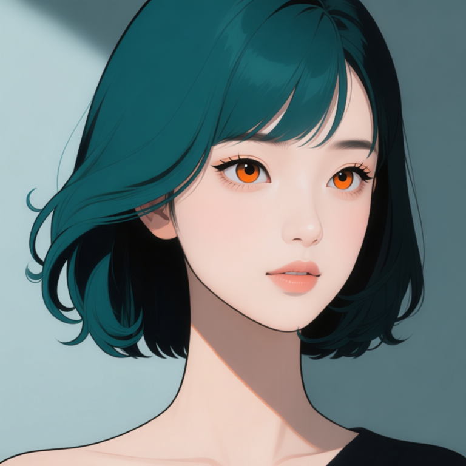

# P7-5.7 얼굴 정면과 카메라 회전: identity와 시점 역할 분리하기

> Section ID: `P7-5.7`
> Version: `v2026.08.21`

같은 인물의 얼굴을 여러 방향으로 만들 때, 정면 이미지와 회전 지시를 한 prompt 안에 모두 반복하면 헤어·이목구비·화풍이 쉽게 흔들린다. 이 절은 **정면 얼굴은 identity와 렌더링을 맡고, 전용 다중 앵글 LoRA는 카메라 회전만 맡는** Qwen 경로를 기록한다. 전신·착장·body-only OpenPose는 [P7-5.2](section-02.md)에서 별도로 관리한다.

## 1. 어떤 모델을 어떤 역할로 쓰는가

이 실험의 기반 편집 모델은 `Qwen/Qwen-Image-Edit-2509`이다. Qwen의 공식 모델 카드는 이 모델을 이미지-투-이미지 편집 모델로 제공하며, 단일 입력에서 사람 편집의 얼굴 identity 보존을 개선 대상으로 설명한다. 이 절에서는 그 성질을 이미 보장된 결과로 받아들이지 않고, **승인 정면 얼굴 한 장을 기준 입력으로 놓고 실제 출력에서만** 확인한다. [Qwen, *Qwen-Image-Edit-2509 model card* (Hugging Face, 확인: 2026-08-21)](https://huggingface.co/Qwen/Qwen-Image-Edit-2509){: target="_blank" rel="noopener noreferrer"}

카메라 조건에는 `dx8152/Qwen-Edit-2509-Multiple-angles` LoRA를 덧붙였다. 이 adapter의 모델 카드는 기반 모델을 `Qwen-Image-Edit-2509`로 표시하고, 별도 trigger word 없이 카메라 이동·좌우 회전·위아래 보기 명령을 사용할 수 있다고 안내한다. 같은 카드가 일관성이 불안정할 수 있다는 사용자 보고와 재학습본 업로드도 함께 남기므로, 모델 카드의 예시만으로 후보를 승인하지 않는다. [dx8152, *Qwen-Edit-2509-Multiple-angles model card* (Hugging Face, 확인: 2026-08-21)](https://huggingface.co/dx8152/Qwen-Edit-2509-Multiple-angles){: target="_blank" rel="noopener noreferrer"}

로컬 실행은 `QwenImageEditPlusPipeline`과 저정밀 Nunchaku transformer·Lightning 가중치를 사용했다. 이는 현재 8GB GPU에서 실행하기 위한 런타임 구성이다. 기반 모델 또는 LoRA의 일반 성능 비교가 아니므로, 정확한 가중치·해시·offload 조건과 사람 검수 상태를 하나의 review JSON에 함께 기록한다.

## 2. 정면 얼굴을 기준으로 고정한다

정면 얼굴은 참조 이미지 없이 Qwen으로 생성한 뒤 사람이 승인한 기준이다. 중앙 정면 구도와 정수리 전체가 보이는 상단 여백, 높은 콧대와 곧은 코선, 주황·호박색 홍채, 청록과 검정이 나뉜 볼륨 단발, 어두운 윤곽선과 평면 색을 대조하는 데만 쓴다. 표정, 전신, 의상, 장면은 이 승인 범위에 포함되지 않는다.

| 승인된 Qwen 정면 얼굴 | 검수 기록 |
| --- | --- |
|  | <a class="aibook-source-link" href="/AiBook/assets/part-07/chapter-05/p7-5-7-face-front-qwen-reference-review.json" data-language="json">review.json</a> |

정면 얼굴 생성의 기본값은 승인본과 같은 10 step이다. 회전 편집의 step 수까지 이 값으로 고정하지 않는다.

<a class="aibook-source-link" href="/AiBook/assets/part-07/chapter-05/p7-5-7-face-identity-contract.json" data-language="json">얼굴 identity 계약</a> · <a class="aibook-source-link" href="/AiBook/assets/part-07/chapter-05/p7-5-7-face-style-prompt-contract.json" data-language="json">얼굴 화풍 계약</a> · <a class="aibook-source-link" href="/AiBook/assets/part-07/chapter-05/p7-5-7-face-illustration-prompt-contract.json" data-language="json">일러스트 계약</a>

## 3. 입력의 역할을 섞지 않는다

회전 후보에는 승인 정면 얼굴 한 장만 이미지 입력으로 넣는다. 이 입력이 identity·헤어·일러스트 표현을 맡는다. 다중 앵글 LoRA와 짧은 중국어 카메라 명령은 yaw·pitch 변환만 맡는다. 얼굴 OpenPose, 전신 OpenPose, 착장 이미지는 이 얼굴 회전 경로에 넣지 않는다.

| 입력 또는 조건 | 맡는 역할 | 맡지 않는 역할 |
| --- | --- | --- |
| 승인 정면 얼굴 | identity, 홍채, 앞머리·볼륨 단발, 선·음영 | 회전 각도 |
| 다중 앵글 LoRA | 카메라 yaw·pitch | 다른 인물의 얼굴·헤어를 새로 정의하는 일 |
| 짧은 카메라 명령 | 좌·우 45°/90°, 위·아래 각도 | identity 설명의 반복 |

이 분리는 정면 설명을 길게 적어 회전을 강제하는 방법보다 어느 조건이 실패했는지 구분하기 쉽다. LoRA가 회전을 수행했다는 사실은 identity 보존을 자동 보장하지 않는다.

## 4. 승인된 회전 결과를 등록한다

아래 네 결과는 승인 정면 얼굴만을 입력으로 쓴 8-step 결과다. 각 승인은 해당 yaw, `pitch 0°` 이미지 한 장에만 한정한다. 다른 yaw·pitch·표정·전신·장면 조건으로 자동 확장하지 않는다.

| 정면 | 좌측 쿼터 `yaw −45°` | 우측 쿼터 `yaw +45°` |
| --- | --- | --- |
|  |  |  |

| 좌측 측면 `yaw −90°` | 우측 측면 `yaw +90°` |
| --- | --- |
|  |  |

<a class="aibook-source-link" href="/AiBook/assets/part-07/chapter-05/p7-5-7-face-quarter-left-qwen-camera-angle-reference-review.json" data-language="json">좌측 쿼터 review.json</a> · <a class="aibook-source-link" href="/AiBook/assets/part-07/chapter-05/p7-5-7-face-quarter-right-qwen-camera-angle-reference-review.json" data-language="json">우측 쿼터 review.json</a> · <a class="aibook-source-link" href="/AiBook/assets/part-07/chapter-05/p7-5-7-face-profile-left-qwen-camera-angle-reference-review.json" data-language="json">좌측 측면 review.json</a> · <a class="aibook-source-link" href="/AiBook/assets/part-07/chapter-05/p7-5-7-face-profile-right-qwen-camera-angle-reference-review.json" data-language="json">우측 측면 review.json</a>

## 5. 사람 검수는 네 축을 동시에 본다

| 항목 | 확인할 질문 |
| --- | --- |
| 방향 | 코끝, 가까운 쪽 눈·볼, 귀와 머리카락의 가림이 요청한 쿼터·측면 방향과 맞는가? |
| 얼굴 identity | 정면 기준과 얼굴 폭, 눈 간격, 코선, 홍채색이 같은 인물로 읽히는가? |
| 헤어 | 청록·검정 색 분할, 앞머리, 볼륨, S웨이브와 안쪽 컬이 유지되는가? |
| 화풍 | 정면 기준의 선, 대비, 음영이 단순화되거나 사진풍으로 바뀌지 않았는가? |

방향만 맞고 머리카락이나 이목구비가 달라졌다면 통과가 아니다. 반대로 닮았지만 회전이 실패한 후보도 통과가 아니다. 이 결과는 다음에 step·LoRA 강도·명령 문구를 한 축씩 바꾸는 근거로 남긴다.

## 6. 재실행 기록을 남긴다

Qwen 정면 얼굴 후보 생성 코드 보기

이미지 입력 없이 정면 얼굴 후보와 review JSON만 생성합니다.

Qwen 2509 다중 앵글 얼굴 회전 후보 생성 코드 보기

승인 정면 얼굴 하나를 identity·헤어·화풍 기준으로 쓰고, 2509 다중 앵글 LoRA가 pitch 0의 카메라 회전만 맡습니다.

review JSON에는 입력 이미지 해시, LoRA 저장소와 가중치 해시, target yaw·pitch, seed, step, prompt, `prompt_word_count`, 출력 해시와 검수 결정을 함께 남긴다. 승인 기준의 실행 원본은 같은 파일의 `execution` 필드에 보존한다. 후보 파일은 chapter asset 루트에 `p7-5-7-qwen-head-…` 이름으로 저장해 승인 자산과 구분한다.

## 체크리스트

| 확인할 것 | 스스로 답할 질문 |
| --- | --- |
| 기준 | 정면 얼굴이 사람 승인된 현재 기준이며, 회전 후보의 유일한 이미지 입력인가? |
| 역할 | identity·헤어·화풍은 정면 얼굴이, yaw·pitch는 LoRA와 카메라 명령이 맡는가? |
| 방향 | 요청한 카메라 회전과 얼굴의 가림 관계가 같은 방향을 가리키는가? |
| 재현 | seed, step, LoRA, prompt와 `prompt_word_count`가 review JSON에 남아 있는가? |
| 승인 | 승인 범위를 해당 yaw 이미지에만 한정하고, 다른 회전·전신·장면으로 자동 확장하지 않았는가? |
| 다음 단계 | 통과 후보만 P7-5.2의 전신 identity 입력 또는 P7-5.3 장면 입력으로 승격하는가? |

## 출처와 참고 자료

- 정면 얼굴의 사람 판정은 이 절에서 연결한 local review JSON을 기준으로 확인한다.
- 회전 실험의 조건·입력·출력 해시는 각 local review JSON을 기준으로 확인한다.
- 다중 앵글 LoRA의 저장소·가중치 정보는 review JSON에 기록한다. 외부 가중치는 재배포하지 않는다.
- Qwen, [*Qwen-Image-Edit-2509 model card*](https://huggingface.co/Qwen/Qwen-Image-Edit-2509){: target="_blank" rel="noopener noreferrer"}, Hugging Face, 확인: 2026-08-21.
- dx8152, [*Qwen-Edit-2509-Multiple-angles model card*](https://huggingface.co/dx8152/Qwen-Edit-2509-Multiple-angles){: target="_blank" rel="noopener noreferrer"}, Hugging Face, 확인: 2026-08-21.
