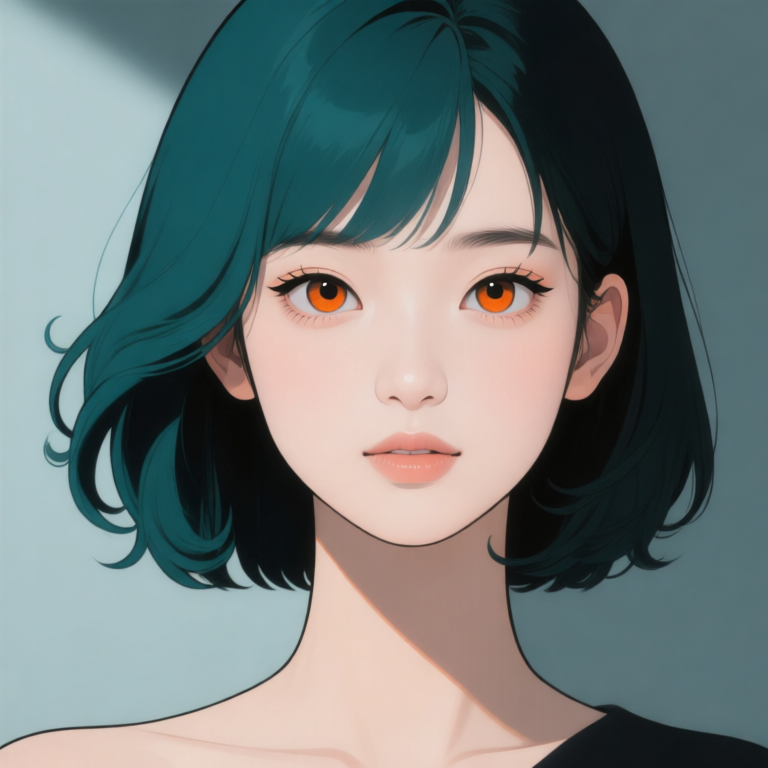
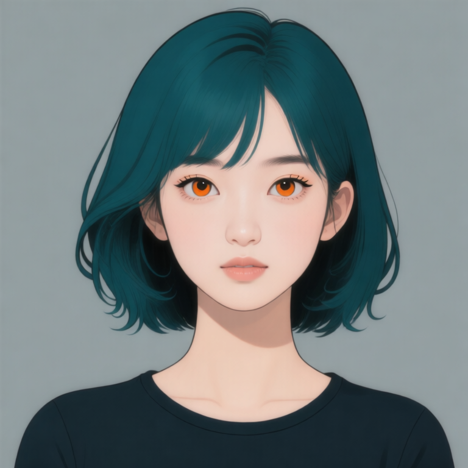
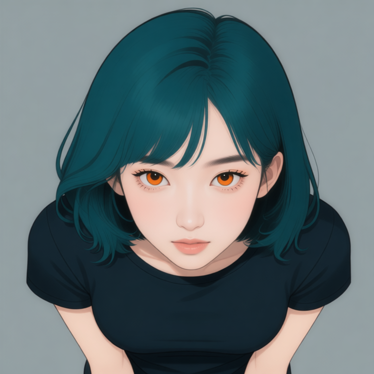
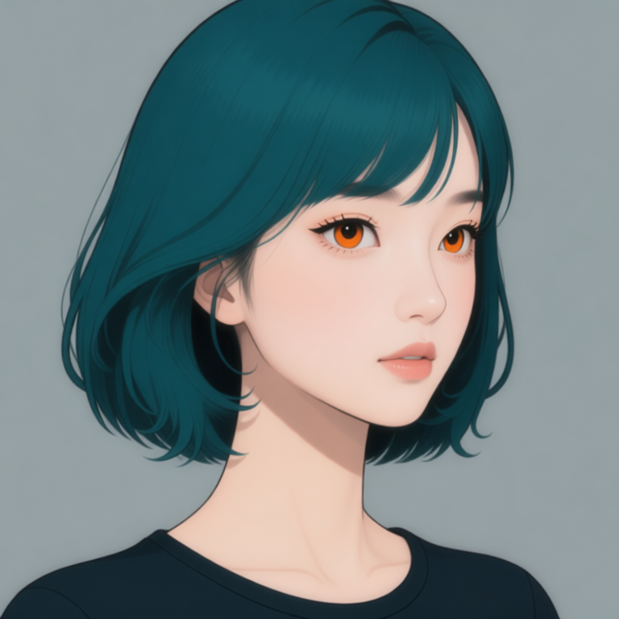
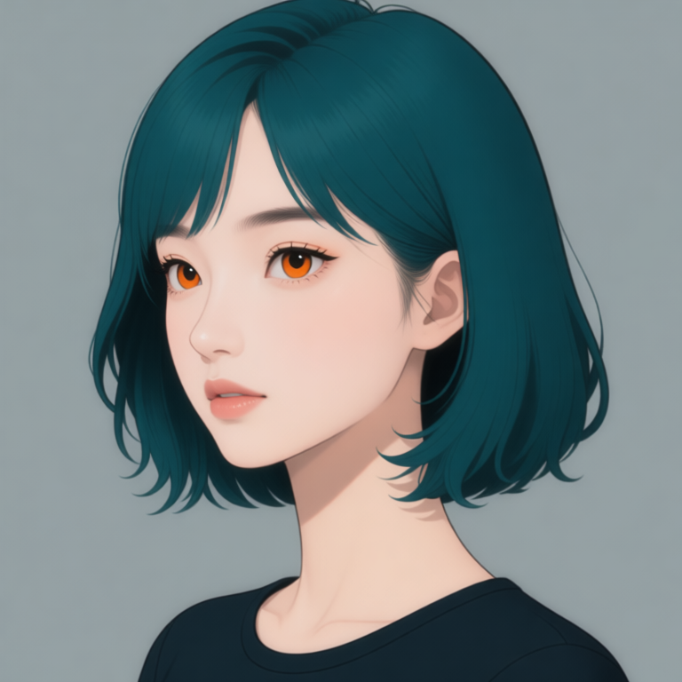
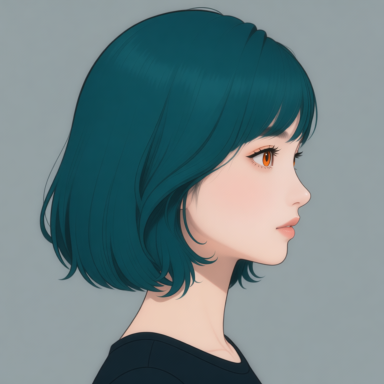
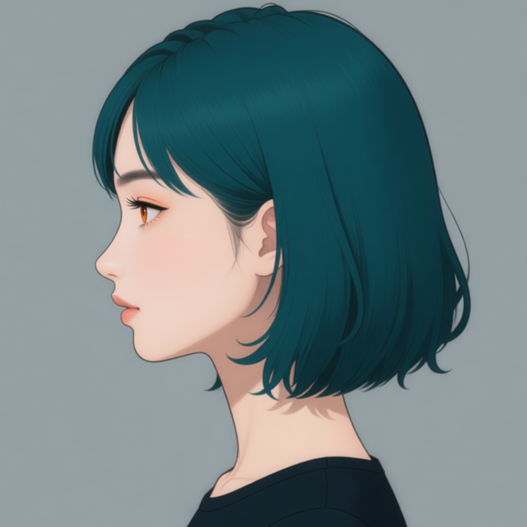

# P7-5.7 정면 얼굴과 체스트 카메라 앵글: identity와 시점 역할 분리하기

> Section ID: `P7-5.7`
> Version: `v2026.08.22`

같은 인물의 얼굴을 여러 방향으로 만들 때, 정면 이미지와 회전 지시를 한 prompt 안에 모두 반복하면 헤어·이목구비·화풍이 쉽게 흔들린다. 이 절은 **정면 얼굴은 identity 기준을 마련하고, 가슴 중간까지 포함한 체스트 참조는 얼굴·헤어·어깨 연결을 전달하며, 전용 다중 앵글 LoRA는 카메라 변환만 맡는** Qwen 경로를 기록한다. 전신·착장·body-only OpenPose는 [P7-5.2](section-02.md)에서 별도로 다룬다.

## 1. 어떤 모델을 어떤 역할로 쓰는가

이 실험의 기반 편집 모델은 `Qwen/Qwen-Image-Edit-2509`이다. Qwen의 공식 모델 카드는 이 모델을 이미지-투-이미지 편집 모델로 제공하며, 단일 입력에서 사람 편집의 얼굴 identity 보존을 개선 대상으로 설명한다. 이 절에서는 그 성질을 보장된 결과로 받아들이지 않고, **정면 참조 한 장을 기준 입력으로 놓은 실제 출력에서만** 확인한다. [Qwen, *Qwen-Image-Edit-2509 model card* (Hugging Face, 확인: 2026-08-21)](https://huggingface.co/Qwen/Qwen-Image-Edit-2509){: target="_blank" rel="noopener noreferrer"}

카메라 조건에는 `dx8152/Qwen-Edit-2509-Multiple-angles` LoRA를 덧붙였다. 이 adapter의 모델 카드는 기반 모델을 `Qwen-Image-Edit-2509`로 표시하고, 별도 trigger word 없이 카메라 이동·좌우 회전·위아래 보기 명령을 사용할 수 있다고 안내한다. 같은 카드가 일관성이 불안정할 수 있다는 사용자 보고와 재학습본 업로드도 함께 남기므로, 모델 카드의 예시만으로 출력 성질을 일반화하지 않는다. [dx8152, *Qwen-Edit-2509-Multiple-angles model card* (Hugging Face, 확인: 2026-08-21)](https://huggingface.co/dx8152/Qwen-Edit-2509-Multiple-angles){: target="_blank" rel="noopener noreferrer"}

로컬 실행은 `QwenImageEditPlusPipeline`과 저정밀 Nunchaku transformer·Lightning 가중치를 사용했다. 이는 현재 8GB GPU에서 실행하기 위한 런타임 구성이다. 기반 모델 또는 LoRA의 일반 성능 비교가 아니므로, 정확한 가중치·해시·offload 조건을 result JSON에 함께 기록한다.

## 2. 정면 참조를 마련한다

정면 얼굴은 참조 이미지 없이 Qwen으로 생성한 기준 이미지다. 중앙 정면 구도와 정수리 전체가 보이는 상단 여백, 높은 콧대와 곧은 코선, 주황·호박색 홍채, 청록과 검정이 나뉜 볼륨 단발, 어두운 윤곽선과 평면 색을 대조하는 데 쓴다.

| Qwen 정면 얼굴 기준 | 실행 기록 |
| --- | --- |
|  | <a class="aibook-source-link" href="/AiBook/assets/part-07/chapter-05/p7-5-7-face-front-qwen-reference-result.json" data-language="json">result.json</a> |

정면 얼굴 생성의 기본값은 이 기준 이미지와 같은 10 step이다. 회전 편집의 step 수까지 이 값으로 고정하지 않는다.

<a class="aibook-source-link" href="/AiBook/assets/part-07/chapter-05/p7-5-7-face-identity-contract.json" data-language="json">얼굴 identity 계약</a> · <a class="aibook-source-link" href="/AiBook/assets/part-07/chapter-05/p7-5-7-face-style-prompt-contract.json" data-language="json">얼굴 화풍 계약</a> · <a class="aibook-source-link" href="/AiBook/assets/part-07/chapter-05/p7-5-7-face-illustration-prompt-contract.json" data-language="json">일러스트 계약</a>

가슴 중간까지 포함한 체스트 참조는 얼굴뿐 아니라 어깨·쇄골·상반신이 카메라 회전에서 어떻게 이어지는지 확인하기 위한 입력이다. 현재 카메라 회전 생성기의 기본 입력으로 사용한다. 이 파일은 전신·의상 조건을 포함하지 않는다.

| 체스트 정면 후보 | 체스트 기준 하이앵글 후보 |
| --- | --- |
|  |  |

<a class="aibook-source-link" href="/AiBook/assets/part-07/chapter-05/p7-5-7-qwen-face-torso-chest-v1-seed-62294-steps-10-result.json" data-language="json">체스트 정면 result.json</a> · <a class="aibook-source-link" href="/AiBook/assets/part-07/chapter-05/p7-5-7-qwen-torso-pitch-high-angle-chest-reference-v1-seed-62294-steps-8-result.json" data-language="json">하이앵글 result.json</a>

## 3. 입력의 역할을 섞지 않는다

카메라 앵글 생성에는 체스트 참조 한 장만 이미지 입력으로 넣는다. 이 입력이 identity·헤어·일러스트 표현과 어깨·상반신의 연결을 맡는다. 다중 앵글 LoRA와 짧은 중국어 카메라 명령은 yaw·pitch 변환만 맡는다. 얼굴 OpenPose, 전신 OpenPose, 착장 이미지는 이 경로에 넣지 않는다.

| 입력 또는 조건 | 맡는 역할 | 맡지 않는 역할 |
| --- | --- | --- |
| 정면 얼굴 기준 | identity, 홍채, 앞머리·볼륨 단발, 선·음영의 기준 관찰 | 카메라 각도·상반신 연결 |
| 체스트 정면 참조 | identity·헤어·화풍과 어깨·상반신 연결 | 전신·의상 조건 |
| 다중 앵글 LoRA | 카메라 yaw·pitch | 다른 인물의 얼굴·헤어를 새로 정의하는 일 |
| 짧은 카메라 명령 | 좌·우 45°/90°, 위·아래 각도 | identity 설명의 반복 |

이 분리는 정면 얼굴을 길게 설명해 회전을 강제하는 방법보다 어느 조건이 실패했는지 구분하기 쉽다. LoRA가 카메라 변환을 수행했다는 사실은 identity·헤어·상반신 연결 보존을 자동 보장하지 않는다.

## 4. 체스트 기준 카메라 앵글 결과를 비교한다

아래 결과는 체스트 정면 참조만을 입력으로 쓴 8-step 결과다. yaw 비교에서는 `pitch 0°`를, pitch 비교에서는 yaw를 `0°`로 고정했다. 즉 체스트를 기준으로 한 카메라 변환을 관찰하며, 기존 얼굴 전용 회전 이미지는 이 표의 근거로 사용하지 않는다.

| 체스트 정면 `yaw 0°` | 좌측 쿼터 `yaw −45°` | 우측 쿼터 `yaw +45°` |
| --- | --- | --- |
|  |  |  |

| 좌측 측면 `yaw −90°` | 우측 측면 `yaw +90°` | 체스트 기준 하이앵글 |
| --- | --- | --- |
|  |  |  |

<a class="aibook-source-link" href="/AiBook/assets/part-07/chapter-05/p7-5-7-qwen-torso-yaw-quarter-left-chest-front-yaw-v1-seed-62294-steps-8-result.json" data-language="json">좌측 쿼터 result.json</a> · <a class="aibook-source-link" href="/AiBook/assets/part-07/chapter-05/p7-5-7-qwen-torso-yaw-quarter-right-chest-front-yaw-v1-seed-62294-steps-8-result.json" data-language="json">우측 쿼터 result.json</a> · <a class="aibook-source-link" href="/AiBook/assets/part-07/chapter-05/p7-5-7-qwen-torso-yaw-profile-left-chest-front-yaw-v1-seed-62294-steps-8-result.json" data-language="json">좌측 측면 result.json</a> · <a class="aibook-source-link" href="/AiBook/assets/part-07/chapter-05/p7-5-7-qwen-torso-yaw-profile-right-chest-front-yaw-v1-seed-62294-steps-8-result.json" data-language="json">우측 측면 result.json</a> · <a class="aibook-source-link" href="/AiBook/assets/part-07/chapter-05/p7-5-7-qwen-torso-pitch-high-angle-chest-reference-v1-seed-62294-steps-8-result.json" data-language="json">하이앵글 result.json</a>

## 5. 출력은 네 축으로 비교한다

| 항목 | 확인할 질문 |
| --- | --- |
| 방향 | 코끝, 가까운 쪽 눈·볼, 귀와 머리카락의 가림이 요청한 쿼터·측면 방향과 맞는가? |
| 얼굴 identity | 정면 기준과 얼굴 폭, 눈 간격, 코선, 홍채색이 같은 인물로 읽히는가? |
| 헤어·상반신 연결 | 청록·검정 색 분할, 앞머리, 볼륨, S웨이브와 안쪽 컬, 목·어깨·가슴 위 경계가 유지되는가? |
| 화풍 | 체스트 기준의 선, 대비, 음영이 단순화되거나 사진풍으로 바뀌지 않았는가? |

방향만 맞고 머리카락·상반신 연결이나 이목구비가 달라진 출력과, 닮았지만 카메라 방향이 달라진 출력을 구분해 읽는다. 이 비교는 다음에 step·LoRA 강도·명령 문구를 한 축씩 바꾸는 근거로 남긴다.

## 6. 재실행 기록을 남긴다

Qwen 정면 얼굴 후보 생성 코드 보기

이미지 입력 없이 정면 얼굴 또는 체스트 후보와 result JSON만 생성합니다.

Qwen 2509 다중 앵글 체스트 카메라 앵글 생성 코드 보기

체스트 참조 한 장을 identity·헤어·화풍·상반신 연결 기준으로 쓰고, 2509 다중 앵글 LoRA가 한 축의 카메라 변환만 맡습니다.

result JSON에는 입력 이미지 해시, LoRA 저장소와 가중치 해시, target yaw·pitch, seed, step, prompt, `prompt_word_count`, 출력 해시를 함께 남긴다. 출력 파일은 chapter asset 루트에 `p7-5-7-qwen-head-…` 또는 `p7-5-7-qwen-torso-…` 이름으로 저장한다.

## 체크리스트

| 확인할 것 | 스스로 답할 질문 |
| --- | --- |
| 기준 | 정면 참조가 하나뿐이며, result JSON에 입력 역할이 남아 있는가? |
| 역할 | identity·헤어·화풍의 기준은 정면 얼굴에, 카메라 변환의 입력은 체스트에, yaw·pitch는 LoRA와 카메라 명령에 분리되어 있는가? |
| 방향 | 요청한 카메라 변환과 얼굴·목·어깨의 가림 관계가 같은 방향을 가리키는가? |
| 재현 | seed, step, LoRA, prompt와 `prompt_word_count`가 result JSON에 남아 있는가? |
| 범위 | 정면 참조에 없는 전신·의상·장면 조건을 결과에 덧붙여 해석하지 않았는가? |
| 다음 단계 | 관찰된 역할과 한계를 기록한 뒤에만 P7-5.2 전신 또는 P7-5.3 장면 실험의 입력으로 쓰는가? |

## 출처와 참고 자료

- 정면 얼굴 기준의 생성 조건은 이 절에서 연결한 local 실행 기록을 기준으로 확인한다.
- 체스트 참조와 하이앵글 결과의 입력·출력 해시는 각 local result JSON을 기준으로 확인한다.
- 다중 앵글 LoRA의 저장소·가중치 정보는 result JSON에 기록한다. 외부 가중치는 재배포하지 않는다.
- Qwen, [*Qwen-Image-Edit-2509 model card*](https://huggingface.co/Qwen/Qwen-Image-Edit-2509){: target="_blank" rel="noopener noreferrer"}, Hugging Face, 확인: 2026-08-21.
- dx8152, [*Qwen-Edit-2509-Multiple-angles model card*](https://huggingface.co/dx8152/Qwen-Edit-2509-Multiple-angles){: target="_blank" rel="noopener noreferrer"}, Hugging Face, 확인: 2026-08-21.
