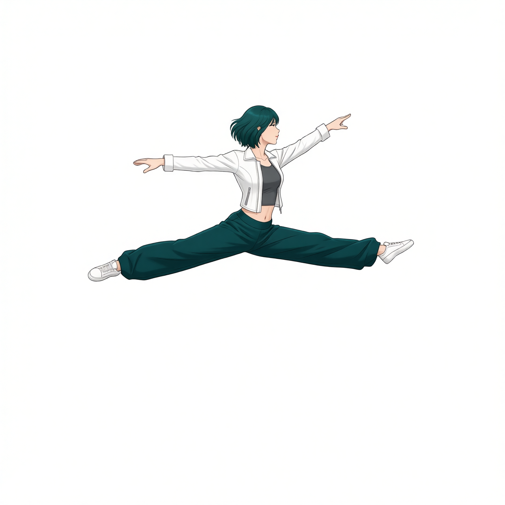
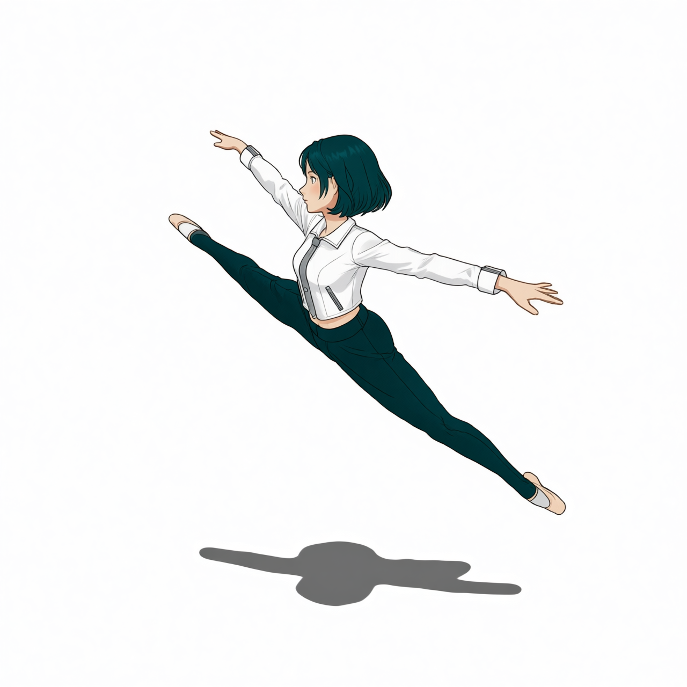

# P7-5.7 보충학습: 착장 추출과 Try-On LoRA

> Section ID: `P7-5.7`
> Version: `v2026.09.11`

[P7-5.5](section-05.md)에서 캐릭터와 배경을 단계별로 처리해 한 장면으로 합치는 기본 파이프라인을 살펴봤다. 이 보충학습에서는 포즈·프레이밍을 가진 인물에 의상만 다시 입히는 별도 경로를 다룬다. **착장을 흰 배경 기준물로 추출한 뒤 Try-On LoRA에 넣으면 입력 역할과 보존 범위가 어떻게 달라지는가**를 확인한다. 기본 파이프라인의 필수 단계는 아니며, 추출된 착장과 모델별 입력 조건을 검토하는 보조 실험이다.

## 착장 추출은 인물 교체와 다른 작업이다

Xabsurd Clothing Extractor는 P7-5.3의 `-45°` 2단계 착장 이미지를 하나의 입력으로 받아, 사람·피부·배경 대신 의류와 신발을 흰 배경에 남기는 용도로 사용했다. 의류를 분리한 기준물을 만드는 단계이며, 인물의 포즈나 캐릭터 아이덴티티를 적용하는 단계와 구분한다. 이후 Try-On에서 참조할 수 있는 garment 기준물을 만드는 단계다. [Xabsurd Clothing Extractor 모델 카드](https://huggingface.co/Xabsurd/Clothing-Extractor){: target="_blank" rel="noopener noreferrer"}

| Xabsurd 착장·신발 추출 |
| --- |
|  |

[Xabsurd 추출 result.json — JSON — 원본 착장 입력, 추출 프롬프트와 2511 실행 조건 보기](/AiBook/assets/part-07/chapter-05/p7-5-7-qwen-2511-xabsurd-clothing-extractor-shoe-gear-v2-size-1280x1280-seed-62294-steps-10-result.json)

이 실행은 Qwen Image Edit 2511 직접 Diffusers 경로에서 1280×1280, seed `62294`, 10 step, true CFG `4.0`으로 만들었다.

[Xabsurd 착장·신발 추출 코드 보기](../../../assets/part-07/chapter-05/p7_5_7_qwen_edit_2511_extract_outfit_gear.py)

## James와 FoxBaze의 입력 조건

JamesDigitalOcean Try-On 코드는 Qwen Image Edit 2509에서 추출된 garment를 `Picture 1`, 옷을 받을 사람을 `Picture 2`로 넣고 `tryon_clothes dress the clothing onto the person` trigger를 사용한다. 저장소에는 이 두 입력 순서와 adapter 이름 `tryonclothes`를 기록한 코드가 남아 있다. 그러나 현재 공개 자산에는 이 코드로 만든 James 결과 PNG·`result.json`이 없다. 따라서 James는 **입력 계약을 읽는 코드 템플릿**으로만 다루고, 품질 비교의 근거로 사용하지 않는다. [James Try-On 모델](https://huggingface.co/JamesDigitalOcean/Qwen_Image_Edit_Try_On_Clothes){: target="_blank" rel="noopener noreferrer"} · [공개 실행 예제](https://huggingface.co/spaces/JamesDigitalOcean/Qwen_Image_Edit_Try_On_Clothes/blob/main/app.py){: target="_blank" rel="noopener noreferrer"}

FoxBaze의 두 `result.json`은 직접 이식된 인물을 `Picture 1`, Xabsurd 기준물을 `Picture 2`로 두고 2511·10 step으로 실행했음을 기록한다. 코드의 `published_base`는 2509이고 실제 실행 모델은 2511이므로, 이 결과는 **교차 버전 실험**이다.

| 구분 | James 코드의 설정 | FoxBaze 실행 기록 |
| --- | --- | --- |
| 베이스 모델 | Qwen Image Edit 2509 | Qwen Image Edit 2511 |
| Picture 1 → Picture 2 | 추출 착장 → 인물 | 인물 → 추출 착장 |
| 프롬프트 | `tryon_clothes dress the clothing onto the person` | `A single full-body image of the woman in Picture 1, wearing every article of clothing from Picture 2` |
| 결과 자료 | PNG·JSON 없음 | Scene A·B의 PNG·JSON 각 1개 |

이 표에서 비교할 수 있는 것은 입력 순서와 실행 설정이다. James의 출력이 없으므로 의상 재현이나 포즈 보존에서 어느 LoRA가 더 나은지는 판단할 수 없다.

## FoxBaze 입력과 결과

Scene A와 B는 같은 추출 착장을 사용하고 인물 입력만 달리했다. 두 실행 모두 1280×1280, seed `62294`, 10 step, LoRA 강도 `1.0`, true CFG `4.0`이다. JSON에 기록된 실행 시간은 A가 460.30초, B가 490.83초다.

| 인물 입력 — Picture 1 | FoxBaze 결과 |
| --- | --- |
| **Scene A 입력**  | **Scene A 결과**  |
| **Scene B 입력**  | **Scene B 결과**  |

[FoxBaze Scene A result.json — JSON — 두 입력과 2511·LoRA 실행 조건 보기](/AiBook/assets/part-07/chapter-05/p7-5-7-qwen-2511-tryon-foxbaze-scene-a-direct-v1-size-1280x1280-seed-62294-steps-10-result.json)

[FoxBaze Scene B result.json — JSON — 측면 인물·garment 입력과 실행 조건 보기](/AiBook/assets/part-07/chapter-05/p7-5-7-qwen-2511-tryon-foxbaze-scene-b-side-profile-direct-v1-size-1280x1280-seed-62294-steps-10-result.json)

[James Try-On 실행 코드 보기](../../../assets/part-07/chapter-05/p7_5_7_qwen_edit_2509_tryon_james.py)

[FoxBaze Try-On 실행 코드 보기](../../../assets/part-07/chapter-05/p7_5_7_qwen_edit_2511_tryon_foxbaze.py)

## 의상·신발·포즈의 변화

| 관찰 항목 | Scene A | Scene B |
| --- | --- | --- |
| 재킷·이너 | 입력부터 흰 재킷과 회색 이너가 있다. 결과에서도 보이지만 새로 이식된 특징으로 세기 어렵다. | 재킷 앞쪽이 더 열리며 회색 이너가 넓게 드러난다. |
| 바지 | 청록색과 넓은 바지 형태가 이어지며 주름과 윤곽이 달라진다. | 화면 오른쪽 아래로 뻗은 다리의 바짓단이 넓어진다. 반대쪽 다리는 여전히 좁게 보인다. |
| 신발 | 입력과 결과 모두 흰 끈 스니커즈다. 추출 착장의 신발로 교체됐다는 근거는 부족하다. | 추출 착장에는 흰 스니커즈가 있지만 결과에는 입력의 발레화 형태가 남는다. |
| 포즈·프레이밍 | 팔을 벌린 수평 스플릿 점프는 남지만 인물 크기와 팔다리 윤곽이 달라진다. | 대각선 스플릿 점프와 얼굴 방향은 남지만 인물 위치와 윤곽이 조금 달라진다. |
| 그림자 | 입력의 바닥 그림자가 사라진다. | 바닥 그림자는 남지만 모양이 달라진다. |

두 입력은 이미 흰 재킷과 청록 바지를 입고 있다. 결과의 색이 기준물과 같다는 사실만으로 착장 전체가 이식됐다고 볼 수 없다. 이 사례에서 뚜렷한 변화는 Scene B의 재킷 앞섶과 한쪽 바짓단이며, 신발 교체는 이루어지지 않았다. Scene A의 그림자 소실은 의상 외 요소도 편집됐음을 보여 준다.

James와 FoxBaze의 결과를 비교하려면 같은 인물·착장으로 만든 James 출력이 추가로 필요하다. 베이스 모델도 맞추거나 모델 차이를 별도 조건으로 기록하고, LoRA를 끈 결과를 함께 두어야 일반 이미지 편집과 LoRA의 효과를 구분할 수 있다. 현재 두 장은 FoxBaze의 변화와 누락을 관찰하는 자료이며, LoRA 간 품질 순위를 뒷받침하지 않는다.

## 체크리스트

- 추출 이미지는 포즈 기준 이미지가 아니라 다음 Try-On의 garment 입력이다.
- James는 입력 계약 코드만 남아 있고, FoxBaze에만 현재 PNG·result.json이 남아 있음을 구분한다.
- FoxBaze 결과는 2509용으로 표기된 LoRA를 2511에서 실행한 교차 버전 실험이므로, 기본 파이프라인의 호환성 보장으로 읽지 않는다.
- 재킷·바지의 큰 특징이 보인다고 신발·손·포즈까지 보존됐다고 판단하지 않는다.
- 착장 추출 → Try-On의 입력 연결을 설명하고, 이 보조 실험과 P7-5.5의 기본 파이프라인을 구분한다.

## 출처와 참고 자료

- Xabsurd, [Clothing-Extractor 모델 카드](https://huggingface.co/Xabsurd/Clothing-Extractor){: target="_blank" rel="noopener noreferrer" }, Hugging Face, 확인일: 2026-09-11.
- JamesDigitalOcean, [Qwen_Image_Edit_Try_On_Clothes 모델 카드](https://huggingface.co/JamesDigitalOcean/Qwen_Image_Edit_Try_On_Clothes){: target="_blank" rel="noopener noreferrer" }, Hugging Face, 확인일: 2026-09-11.
- JamesDigitalOcean, [Qwen_Image_Edit_Try_On_Clothes — app.py](https://huggingface.co/spaces/JamesDigitalOcean/Qwen_Image_Edit_Try_On_Clothes/blob/main/app.py){: target="_blank" rel="noopener noreferrer" }, Hugging Face Spaces, 확인일: 2026-09-11.
- FoxBaze, [Try_On_Qwen_Edit_Lora_Alpha 모델 카드](https://huggingface.co/FoxBaze/Try_On_Qwen_Edit_Lora_Alpha){: target="_blank" rel="noopener noreferrer" }, Hugging Face, 확인일: 2026-09-11.
- Qwen, [Qwen-Image-Edit-2509 모델 카드](https://huggingface.co/Qwen/Qwen-Image-Edit-2509){: target="_blank" rel="noopener noreferrer" }, Hugging Face, 확인일: 2026-09-11.
- Qwen, [Qwen-Image-Edit-2511 모델 카드](https://huggingface.co/Qwen/Qwen-Image-Edit-2511){: target="_blank" rel="noopener noreferrer" }, Hugging Face, 확인일: 2026-09-11.
