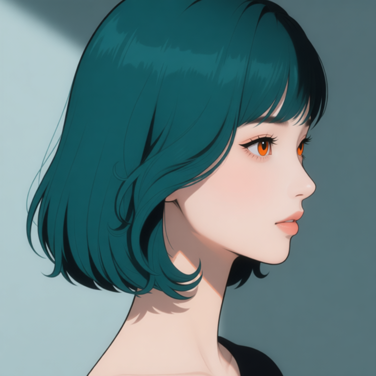
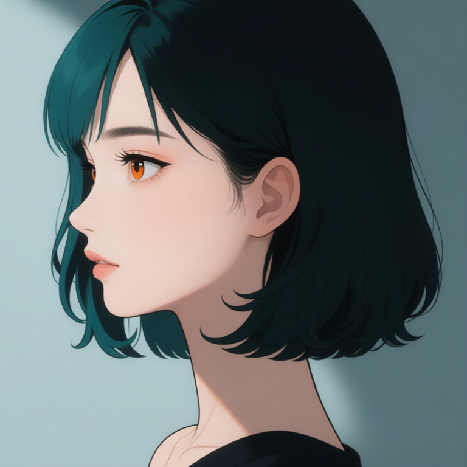
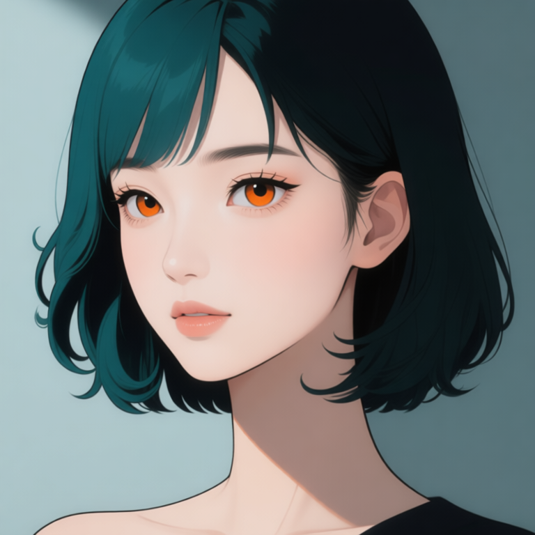
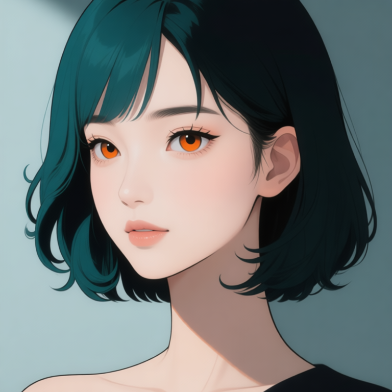

# P7-5.7 얼굴 정면과 카메라 회전: identity와 시점 역할 분리하기

> Section ID: `P7-5.7`
> Version: `v2026.08.21`

같은 인물의 얼굴을 여러 방향으로 만들 때, 정면 이미지와 회전 지시를 한 prompt 안에 모두 반복하면 헤어·이목구비·화풍이 쉽게 흔들린다. 이 절은 **정면 얼굴이 identity와 렌더링을 맡고, 전용 다중 앵글 LoRA가 카메라 회전만 맡는** Qwen 경로를 기록한다. 전신·착장·body-only OpenPose는 [P7-5.2](section-02.md)에서 별도로 관리한다.

## 먼저 정면 얼굴을 고정한다

정면 얼굴은 참조 이미지 없이 Qwen으로 생성한 뒤 사람이 승인한 기준이다. 이 기준은 중앙 정면 구도, 높은 콧대와 곧은 코선, 주황·호박색 홍채, 청록과 검정이 나뉜 볼륨 단발, 선과 음영을 대조하는 데만 쓴다. 표정, 전신, 의상, 장면은 이 승인 범위에 포함되지 않는다.

| 승인된 Qwen 정면 얼굴 | 검수 기록 |
| --- | --- |
|  | <a class="aibook-source-link" href="/AiBook/assets/part-07/chapter-05/p7-5-7-face-front-qwen-reference-review.json" data-language="json">review.json</a> |

정면 얼굴 생성의 기본값은 승인본과 같은 10 step이다. 회전 편집의 step 수까지 이 값으로 고정하지 않는다. 회전 결과는 정면 기준과 나란히 놓고 identity·헤어·화풍이 유지되는지 별도로 판정한다.

<a class="aibook-source-link" href="/AiBook/assets/part-07/chapter-05/p7-5-7-face-identity-contract.json" data-language="json">얼굴 identity 계약</a> · <a class="aibook-source-link" href="/AiBook/assets/part-07/chapter-05/p7-5-7-face-style-prompt-contract.json" data-language="json">얼굴 화풍 계약</a> · <a class="aibook-source-link" href="/AiBook/assets/part-07/chapter-05/p7-5-7-face-illustration-prompt-contract.json" data-language="json">일러스트 계약</a>

## 회전은 카메라 조건으로만 준다

회전 후보에는 승인 정면 얼굴 한 장만 이미지 입력으로 넣는다. 이 입력이 identity·헤어·일러스트 표현을 맡는다. `dx8152/Qwen-Edit-2509-Multiple-angles` LoRA와 짧은 중국어 카메라 명령은 yaw·pitch 변환만 맡는다. 얼굴 OpenPose, 전신 OpenPose, 착장 이미지는 이 얼굴 회전 경로에 넣지 않는다.

| 입력 또는 조건 | 맡는 역할 | 맡지 않는 역할 |
| --- | --- | --- |
| 승인 정면 얼굴 | identity, 홍채, 앞머리·볼륨 단발, 선·음영 | 회전 각도 |
| 다중 앵글 LoRA | 카메라 yaw·pitch | 다른 인물의 얼굴·헤어를 새로 정의하는 일 |
| 짧은 카메라 명령 | 좌·우 45°/90°, 위·아래 각도 | identity 설명의 반복 |

이 분리는 정면 설명을 길게 적어 회전을 강제하는 방법보다, 어느 조건이 실패했는지 구분하기 쉽다. 다만 LoRA가 회전을 수행했다는 사실은 identity 보존을 자동 보장하지 않는다.

## 승인된 좌측 측면 기준과 후보를 나눈다

아래 좌·우 측면은 승인 정면 얼굴만을 입력으로 쓴 8-step 결과이며, 사람 검수를 거쳐 P7-5.7의 안정 얼굴 회전 기준으로 승인했다. 각 승인은 해당 측면에만 한정하며, 다른 yaw·pitch·표정·전신에는 자동으로 확장되지 않는다.

| 정면 기준 | 승인된 좌측 측면 | 승인된 우측 측면 |
| --- | --- | --- |
|  |  |  |

<a class="aibook-source-link" href="/AiBook/assets/part-07/chapter-05/p7-5-7-face-profile-left-qwen-camera-angle-reference-review.json" data-language="json">좌측 측면 review.json</a> · <a class="aibook-source-link" href="/AiBook/assets/part-07/chapter-05/p7-5-7-face-profile-left-qwen-camera-angle-reference-run.json" data-language="json">run.json</a> · <a class="aibook-source-link" href="/AiBook/assets/part-07/chapter-05/p7-5-7-face-profile-right-qwen-camera-angle-reference-review.json" data-language="json">우측 측면 review.json</a> · <a class="aibook-source-link" href="/AiBook/assets/part-07/chapter-05/p7-5-7-face-profile-right-qwen-camera-angle-reference-run.json" data-language="json">run.json</a>

| 승인된 우측 쿼터 | 실행·검수 기록 |
| --- | --- |
|  | <a class="aibook-source-link" href="/AiBook/assets/part-07/chapter-05/p7-5-7-face-quarter-right-qwen-camera-angle-reference-review.json" data-language="json">review.json</a> · <a class="aibook-source-link" href="/AiBook/assets/part-07/chapter-05/p7-5-7-face-quarter-right-qwen-camera-angle-reference-run.json" data-language="json">run.json</a> |

아래 우측 쿼터 후보는 현재 여러 회전 실험 중 정면 기준의 헤어와 화풍 차이가 가장 적게 관찰된 review-only 결과다. 아직 사람 승인 전이므로 P7-5.2의 안정 전신 자산이나 P7-5.3 장면 입력으로 승격하지 않는다.

| 정면 기준 | 우측 쿼터 review-only 후보 |
| --- | --- |
|  |  |

<a class="aibook-source-link" href="/AiBook/assets/part-07/chapter-05/p7-5-7-qwen-head-quarter_right-dx8152-camera-angle-lightning-v2-seed-62294-steps-8-run.json" data-language="json">우측 쿼터 run.json</a>

피치 `−20°` 5방향 후보는 얼굴 비율과 identity 보존이 부족해 탈락 처리하고 폐기했다. 피치 변화는 새 입력 계약을 설계한 뒤 별도 실험으로 다시 시작한다.

## 사람 검수는 네 축을 동시에 본다

| 항목 | 확인할 질문 |
| --- | --- |
| 방향 | 코끝, 가까운 쪽 눈·볼, 귀와 머리카락의 가림이 요청한 쿼터·측면 방향과 맞는가? |
| 얼굴 identity | 정면 기준과 얼굴 폭, 눈 간격, 코선, 홍채색이 같은 인물로 읽히는가? |
| 헤어 | 청록·검정 색 분할, 앞머리, 볼륨, S웨이브와 안쪽 컬이 유지되는가? |
| 화풍 | 정면 기준의 선, 대비, 음영이 단순화되거나 사진풍으로 바뀌지 않았는가? |

방향만 맞고 머리카락이나 이목구비가 달라졌다면 통과가 아니다. 반대로 닮았지만 회전이 실패한 후보도 통과가 아니다. 이 결과는 다음에 step·LoRA 강도·명령 문구를 한 축씩 바꾸는 근거로 남긴다.

## 재실행 코드를 분리해 둔다

Qwen 정면 얼굴 후보 생성 코드 보기

이미지 입력 없이 정면 얼굴 후보와 run JSON만 생성합니다.

Qwen 2509 다중 앵글 얼굴 회전 후보 생성 코드 보기

승인 정면 얼굴 하나를 identity·헤어·화풍 기준으로 쓰고, 다중 앵글 LoRA가 카메라 회전만 맡습니다.

run JSON에는 입력 이미지 해시, LoRA 저장소와 가중치 해시, target yaw·pitch, seed, step, prompt, `prompt_word_count`, 출력 해시를 남긴다. 후보 파일은 chapter asset 루트에 `p7-5-7-qwen-head-…` 이름으로 저장해 P7-5.2 전신 자산과 구분한다.

## 체크리스트

| 확인할 것 | 스스로 답할 질문 |
| --- | --- |
| 기준 | 정면 얼굴이 사람 승인된 현재 기준이며, 회전 후보의 유일한 이미지 입력인가? |
| 역할 | identity·헤어·화풍은 정면 얼굴이, yaw·pitch는 LoRA와 카메라 명령이 맡는가? |
| 방향 | 요청한 카메라 회전과 얼굴의 가림 관계가 같은 방향을 가리키는가? |
| 재현 | seed, step, LoRA, prompt와 `prompt_word_count`가 run JSON에 남아 있는가? |
| 승인 | 승인된 yaw만 안정 턴어라운드로 쓰고, review-only 후보를 전신·장면 입력으로 오해하지 않았는가? |
| 다음 단계 | 통과 후보만 P7-5.2의 전신 identity 입력 또는 P7-5.3 장면 입력으로 승격하는가? |

## 출처와 참고 자료

- 정면 얼굴의 사람 판정은 이 절에서 연결한 local review JSON을 기준으로 확인한다.
- 회전 실험의 조건·입력·출력 해시는 각 local run JSON을 기준으로 확인한다.
- 다중 앵글 LoRA의 저장소·가중치 정보는 run JSON에 기록한다. 외부 가중치는 재배포하지 않는다.
