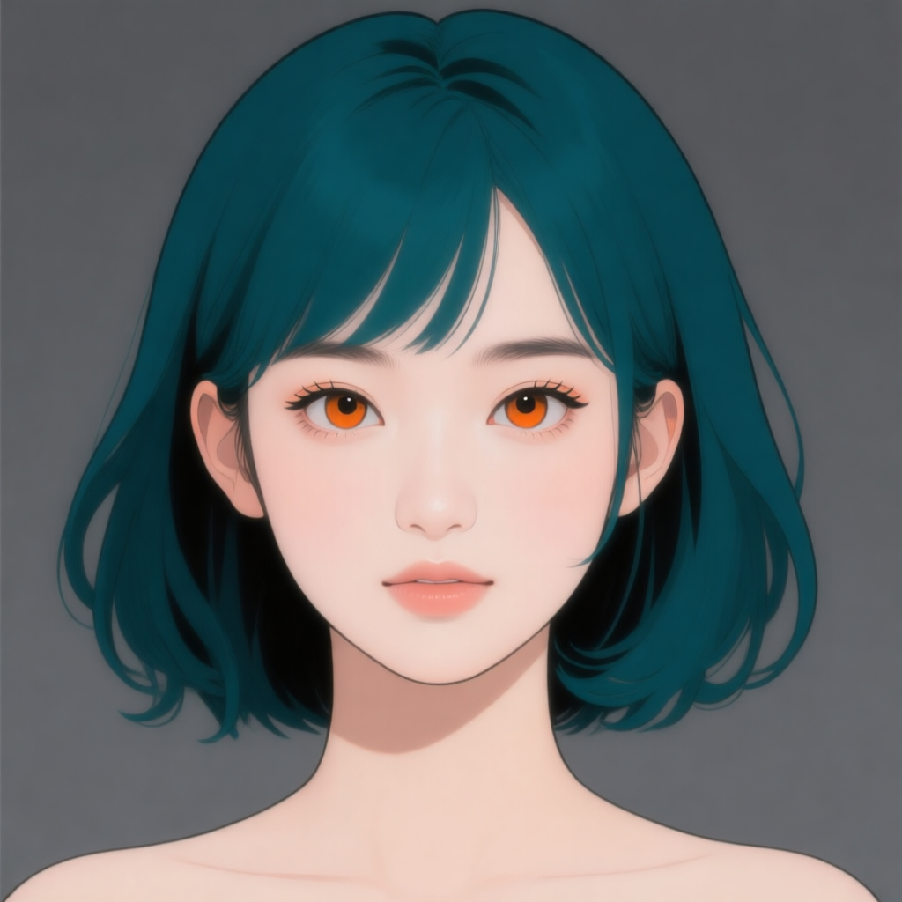
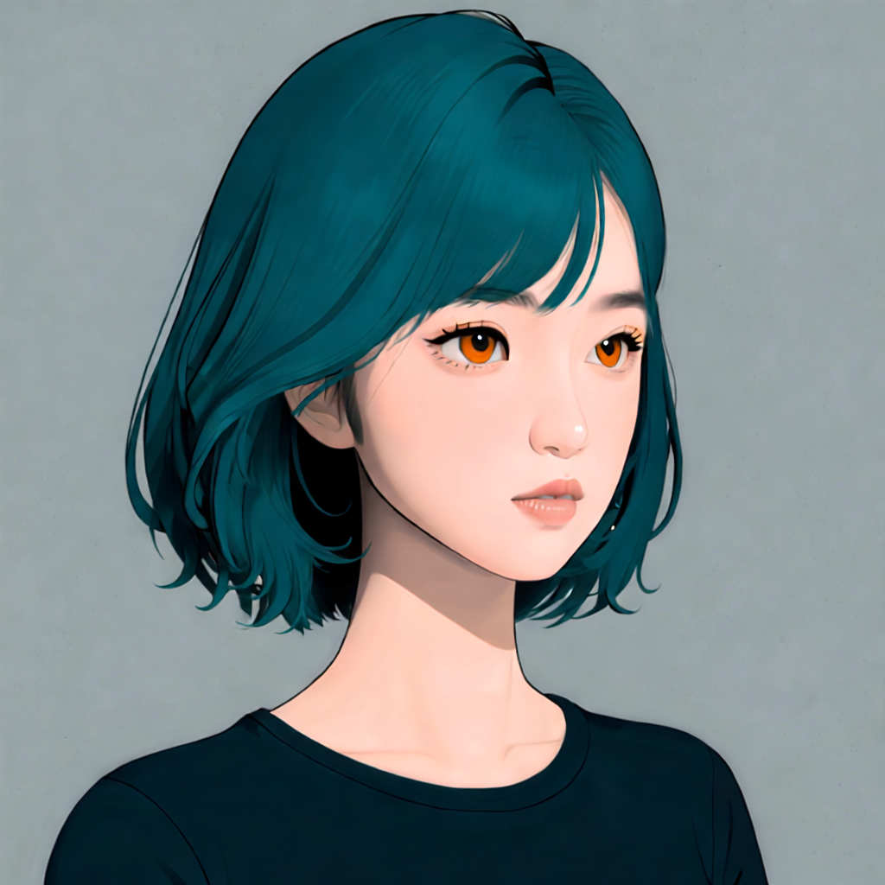
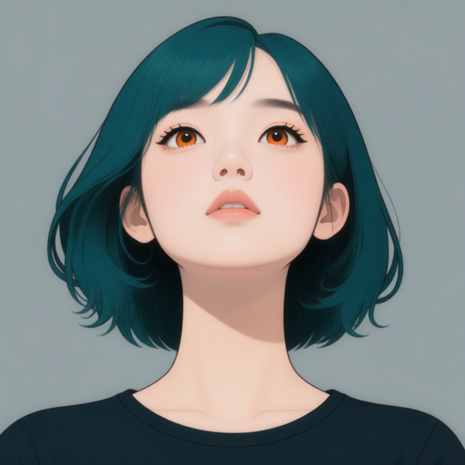
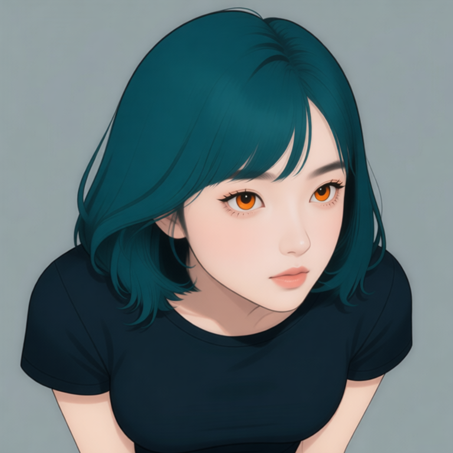
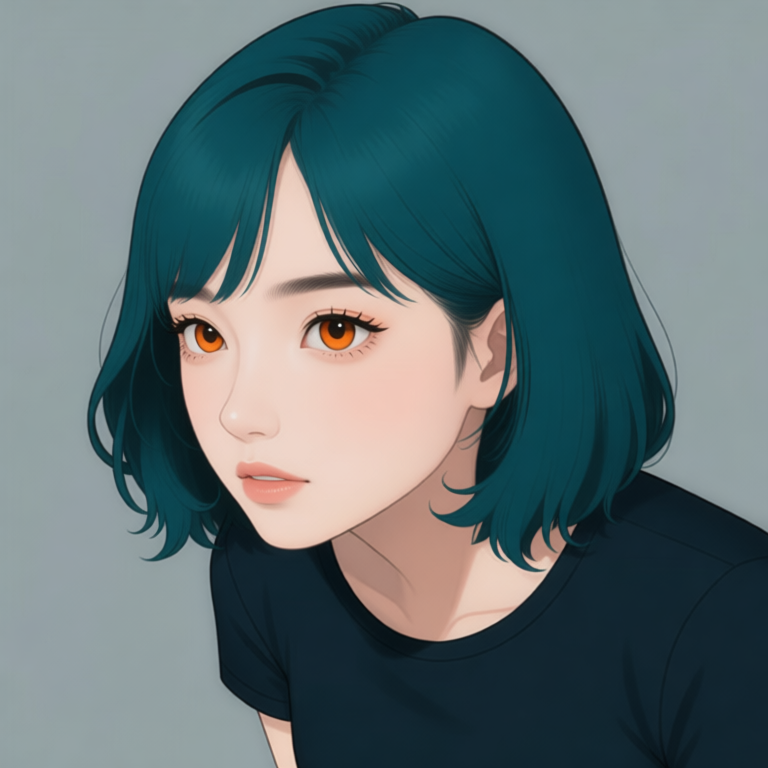
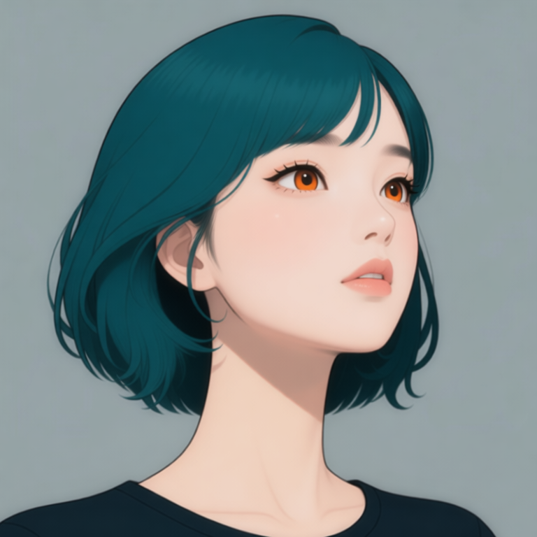
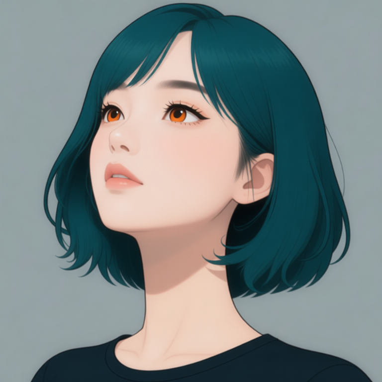

# P7-5.7 정면 얼굴과 체스트 카메라 앵글: identity와 시점 역할 분리하기

> Section ID: `P7-5.7`
> Version: `v2026.08.23`

같은 인물의 얼굴을 여러 방향으로 만들 때, 정면 이미지와 회전 지시를 한 prompt 안에 모두 반복하면 헤어·이목구비·화풍이 쉽게 흔들린다. 이 절은 **정면 얼굴은 identity 기준을 마련하고, 가슴 중간까지 포함한 체스트 참조는 얼굴·헤어·어깨 연결을 전달하며, 전용 다중 앵글 LoRA는 카메라 변환만 맡는** Qwen 경로를 기록한다. 전신·착장·body-only OpenPose는 [P7-5.2](section-02.md)에서 별도로 다룬다.

## 1. 정면 얼굴과 체스트가 서로 다른 기준을 제공한다

정면 얼굴은 참조 이미지 없이 Qwen으로 생성한 기준 이미지다. 중앙 정면 구도와 정수리 전체가 보이는 상단 여백, 높은 콧대와 곧은 코선, 주황·호박색 홍채, 청록과 검정이 나뉜 볼륨 단발, 어두운 윤곽선과 평면 색을 대조하는 데 쓴다.

| Qwen 정면 얼굴 기준 | 실행 기록 |
| --- | --- |
|  | <a class="aibook-source-link" href="/AiBook/assets/part-07/chapter-05/p7-5-7-qwen-face-head-front-1024-reference-v1-seed-62294-steps-10-size-1024-result.json" data-language="json">result.json</a> |

정면 얼굴 생성의 기본값은 이 기준 이미지와 같은 10 step이다. 카메라 앵글 생성의 step 수까지 이 값으로 고정하지 않는다.

<p><a class="aibook-source-link" href="/AiBook/assets/part-07/chapter-05/p7-5-7-face-identity-contract.json" data-language="json">얼굴 identity 계약</a> · <a class="aibook-source-link" href="/AiBook/assets/part-07/chapter-05/p7-5-7-face-style-prompt-contract.json" data-language="json">얼굴 화풍 계약</a> · <a class="aibook-source-link" href="/AiBook/assets/part-07/chapter-05/p7-5-7-face-illustration-prompt-contract.json" data-language="json">일러스트 계약</a></p>

가슴 중간까지 포함한 체스트 참조는 얼굴뿐 아니라 어깨·쇄골·상반신이 카메라 앵글 변화에서 어떻게 이어지는지 확인하기 위한 입력이다. 현재 카메라 앵글 생성기의 기본 입력으로 사용한다. 이 파일은 전신·의상 조건을 포함하지 않는다.

<p><a class="aibook-source-link" href="/AiBook/assets/part-07/chapter-05/p7-5-7-qwen-torso-yaw-front-cfg4-front-1024-v4-seed-62294-steps-8-result.json" data-language="json">체스트 정면 result.json</a></p>

## 2. 카메라 변환은 LoRA와 한 축의 명령으로 분리한다

이 경로의 기반 편집 모델은 `Qwen/Qwen-Image-Edit-2509`이다. Qwen의 공식 모델 카드는 이 모델을 이미지-투-이미지 편집 모델로 제공하며, 단일 입력에서 사람 편집의 얼굴 identity 보존을 개선 대상으로 설명한다. 이 절에서는 그 성질을 보장된 결과로 받아들이지 않고, **정면 참조 한 장을 기준 입력으로 놓은 실제 출력에서만** 확인한다. [Qwen, *Qwen-Image-Edit-2509 model card* (Hugging Face, 확인: 2026-08-22)](https://huggingface.co/Qwen/Qwen-Image-Edit-2509){: target="_blank" rel="noopener noreferrer"}

카메라 조건에는 `dx8152/Qwen-Edit-2509-Multiple-angles` LoRA를 덧붙였다. 이 adapter의 모델 카드는 기반 모델을 `Qwen-Image-Edit-2509`로 표시하고, 별도 trigger word 없이 카메라 이동·좌우 회전·위아래 보기 명령을 사용할 수 있다고 안내한다. 같은 카드가 일관성이 불안정할 수 있다는 사용자 보고와 재학습본 업로드도 함께 남기므로, 모델 카드의 예시만으로 출력 성질을 일반화하지 않는다. [dx8152, *Qwen-Edit-2509-Multiple-angles model card* (Hugging Face, 확인: 2026-08-22)](https://huggingface.co/dx8152/Qwen-Edit-2509-Multiple-angles){: target="_blank" rel="noopener noreferrer"}

### 다중 앵글 LoRA는 카메라 제어용 adapter다

LoRA는 기반 모델 전체를 다시 저장한 독립 모델이 아니라, 일부 가중치에 작은 추가 갱신을 붙여 특정 작업으로 출력을 유도하는 parameter-efficient adapter 방식이다. 이 가중치는 `Qwen-Image-Edit-2509` 위에 함께 로드되며, 이 절에서는 **입력 이미지가 인물 identity·헤어·화풍을, 다중 앵글 LoRA가 카메라 명령에 반응하는 경향을** 맡도록 역할을 나눈다. [Hugging Face, *LoRA documentation* (확인: 2026-08-22)](https://huggingface.co/docs/peft/v0.20.0/package_reference/lora){: target="_blank" rel="noopener noreferrer"} [dx8152, *Qwen-Edit-2509-Multiple-angles model card* (확인: 2026-08-22)](https://huggingface.co/dx8152/Qwen-Edit-2509-Multiple-angles){: target="_blank" rel="noopener noreferrer"}

이 adapter가 `왼쪽으로 45도 회전` 같은 문장을 받는다고 해서, 이미지 안의 인물을 측정 가능한 3차원 공간에서 정확히 회전시키는 것은 아니다. 보이지 않던 귀·머리카락·어깨·배경은 편집 모델이 새로 합성해야 한다. 따라서 result JSON의 `yaw`와 `pitch`는 이 실험에서 비교하기 위한 **카메라 명령 라벨**이며, 실제 카메라의 보정된 물리 각도라는 뜻은 아니다. 방향이 맞더라도 identity나 헤어가 달라질 수 있는 이유도 여기에 있다.

| 제어 범주 | 모델 카드가 제시한 명령의 예 | P7-5.7에서의 처리 |
| --- | --- | --- |
| 이동 | 카메라를 앞·왼쪽·오른쪽·아래로 이동 | 화면 위치 변화가 함께 섞이므로 yaw·pitch 비교와 분리 |
| 좌우 회전 | 카메라를 왼쪽 또는 오른쪽으로 45°/90° 회전 | `yaw` 한 축으로만 생성 |
| 위·아래 보기 | 카메라를 위에서 내려다보거나 아래에서 올려다보기 | `pitch` 한 축으로만 생성 |
| 렌즈 | 광각 또는 클로즈업 | 프레이밍 변수가 추가되므로 현재 비교표에서는 제외 |

현재 로컬 실행기는 저정밀 Nunchaku transformer에 일반 PEFT 로더 대신 전용 `apply_lora` 처리를 사용한다. 적용된 transformer 모듈 수, LoRA 가중치 해시, 강도(`1.0`)를 result JSON에 남겨 가중치가 실제 적용되지 않은 실행과 구분한다. 또한 yaw·pitch·이동·렌즈를 한 prompt에 섞지 않고 한 축만 허용한다. 이는 복합 명령에서 화면 전체가 불안정하게 회전했던 이 실험의 관찰을 분리해 재현 가능하게 비교하기 위한 설계다.

카메라 앵글 생성에는 체스트 참조 한 장만 이미지 입력으로 넣는다. 이 입력이 identity·헤어·일러스트 표현과 어깨·상반신의 연결을 맡는다. 다중 앵글 LoRA와 짧은 중국어 카메라 명령은 yaw·pitch 변환만 맡는다. 얼굴 OpenPose, 전신 OpenPose, 착장 이미지는 이 경로에 넣지 않는다.

| 입력 또는 조건 | 맡는 역할 | 맡지 않는 역할 |
| --- | --- | --- |
| 정면 얼굴 기준 | identity, 홍채, 앞머리·볼륨 단발, 선·음영의 기준 관찰 | 카메라 각도·상반신 연결 |
| 체스트 정면 참조 | identity·헤어·화풍과 어깨·상반신 연결 | 전신·의상 조건 |
| 다중 앵글 LoRA | 카메라 yaw·pitch | 다른 인물의 얼굴·헤어를 새로 정의하는 일 |
| 짧은 카메라 명령 | 좌·우 45°/90°, 위·아래 각도 | identity 설명의 반복 |

이 분리는 정면 얼굴을 길게 설명해 회전을 강제하는 방법보다 어느 조건이 실패했는지 구분하기 쉽다.

정면 얼굴을 먼저 기준으로 만들고, 이를 바탕으로 체스트 참조를 준비한다. 카메라 변환에서는 yaw와 pitch를 한 번에 섞지 않는다. `pitch 0°`에서 yaw를 먼저 비교하거나, `yaw 0°`에서 만든 high/low 체스트를 새 입력으로 두고 yaw를 적용한 뒤, 같은 네 축으로 결과를 읽는다.

```mermaid
--8<-- "assets/part-07/chapter-05/p7-5-7-chest-camera-angle-workflow-ko.mmd"
```

## 3. 체스트 기준 카메라 앵글 결과를 비교한다

아래 결과는 체스트 정면 참조만을 입력으로 쓴 8-step 결과다. 먼저 `pitch 0°`에서 yaw를 비교하고, 다음으로 `yaw 0°`에서 pitch를 비교한다. 마지막으로 high/low 체스트 이미지를 새 입력으로 써 yaw를 적용한 결과를 확인한다. 기존 얼굴 전용 회전 이미지는 이 비교의 근거로 사용하지 않는다.

### 3.1 정면 체스트에서 yaw만 바꾸기 (`pitch 0°`)

| 좌측 측면 `yaw −90°` | 좌측 쿼터 `yaw −45°` | 정면 `yaw 0°` |
| --- | --- | --- |
|  |  |  |

| 우측 쿼터 `yaw +45°` | 우측 측면 `yaw +90°` |
| --- | --- |
|  |  |

<p><a class="aibook-source-link" href="/AiBook/assets/part-07/chapter-05/p7-5-7-qwen-torso-yaw-quarter-left-cfg4-yaw-1024-v4-seed-62294-steps-8-result.json" data-language="json">좌측 쿼터 result.json</a> · <a class="aibook-source-link" href="/AiBook/assets/part-07/chapter-05/p7-5-7-qwen-torso-yaw-quarter-right-cfg4-yaw-1024-v4-seed-62294-steps-8-result.json" data-language="json">우측 쿼터 result.json</a> · <a class="aibook-source-link" href="/AiBook/assets/part-07/chapter-05/p7-5-7-qwen-torso-yaw-profile-left-cfg4-yaw-1024-v4-seed-62294-steps-8-result.json" data-language="json">좌측 측면 result.json</a> · <a class="aibook-source-link" href="/AiBook/assets/part-07/chapter-05/p7-5-7-qwen-torso-yaw-profile-right-cfg4-yaw-1024-v4-seed-62294-steps-8-result.json" data-language="json">우측 측면 result.json</a></p>

여러 방향의 체스트 참조를 미리 만드는 이유는 이후 장면의 카메라와 가까운 방향을 입력으로 선택하기 위해서다. 정면 한 장만 쓸 때보다 측면 윤곽, 앞머리의 가림, 귀·목·어깨의 연결 단서를 직접 제공할 수 있어 모델이 새 얼굴·헤어 구조를 추측해야 하는 범위를 줄인다. 따라서 캐릭터 재현 성공률을 높일 가능성이 있다. 다만 이는 품질 보장이 아니다. 실제 장면에서는 identity·화풍·의상·구도가 함께 유지되는지 별도로 관찰한다.

### 3.2 정면 체스트에서 pitch만 바꾸기 (`yaw 0°`)

| 하이앵글 | 로우앵글 |
| --- | --- |
|  |  |

<p><a class="aibook-source-link" href="/AiBook/assets/part-07/chapter-05/p7-5-7-qwen-torso-pitch-high-angle-chest-reference-v1-seed-62294-steps-8-result.json" data-language="json">하이앵글 result.json</a> · <a class="aibook-source-link" href="/AiBook/assets/part-07/chapter-05/p7-5-7-qwen-torso-pitch-low-angle-chest-reference-v1-seed-62294-steps-8-result.json" data-language="json">로우앵글 result.json</a></p>

### 3.3 pitch 결과를 새 입력으로 두고 yaw 적용하기

pitch와 yaw를 한 prompt에 결합하지 않는다. 먼저 만든 high/low 체스트 이미지는 입력 이미지 역할을, 좌·우 쿼터는 카메라 명령 역할을 맡는다.

| 하이앵글 체스트 → 좌측 쿼터 `yaw −45°` | 하이앵글 체스트 → 우측 쿼터 `yaw +45°` |
| --- | --- |
|  |  |

| 로우앵글 체스트 → 좌측 쿼터 `yaw −45°` | 로우앵글 체스트 → 우측 쿼터 `yaw +45°` |
| --- | --- |
|  |  |

<p><a class="aibook-source-link" href="/AiBook/assets/part-07/chapter-05/p7-5-7-qwen-torso-yaw-quarter-left-chest-high-angle-yaw-v2-seed-62294-steps-8-result.json" data-language="json">하이앵글 좌측 쿼터 result.json</a> · <a class="aibook-source-link" href="/AiBook/assets/part-07/chapter-05/p7-5-7-qwen-torso-yaw-quarter-right-chest-high-angle-yaw-v2-seed-62294-steps-8-result.json" data-language="json">하이앵글 우측 쿼터 result.json</a> · <a class="aibook-source-link" href="/AiBook/assets/part-07/chapter-05/p7-5-7-qwen-torso-yaw-quarter-left-chest-low-angle-yaw-v2-seed-62294-steps-8-result.json" data-language="json">로우앵글 좌측 쿼터 result.json</a> · <a class="aibook-source-link" href="/AiBook/assets/part-07/chapter-05/p7-5-7-qwen-torso-yaw-quarter-right-chest-low-angle-yaw-v2-seed-62294-steps-8-result.json" data-language="json">로우앵글 우측 쿼터 result.json</a></p>

## 4. 출력은 네 축으로 비교한다

| 항목 | 확인할 질문 |
| --- | --- |
| 방향 | 코끝, 가까운 쪽 눈·볼, 귀와 머리카락의 가림이 요청한 쿼터·측면 방향과 맞는가? |
| 얼굴 identity | 정면 기준과 얼굴 폭, 눈 간격, 코선, 홍채색이 같은 인물로 읽히는가? |
| 헤어·상반신 연결 | 청록·검정 색 분할, 앞머리, 볼륨, S웨이브와 안쪽 컬, 목·어깨·가슴 위 경계가 유지되는가? |
| 화풍 | 체스트 기준의 선, 대비, 음영이 단순화되거나 사진풍으로 바뀌지 않았는가? |

방향만 맞고 머리카락·상반신 연결이나 이목구비가 달라진 출력과, 닮았지만 카메라 방향이 달라진 출력을 구분해 읽는다. 이 비교는 다음에 step·LoRA 강도·명령 문구를 한 축씩 바꾸는 근거로 남긴다.

## 5. 재실행 기록을 남긴다

<details id="qwen-edit-head-front-reference-t2i-generator" class="aibook-lazy-source" data-source="/AiBook/assets/part-07/chapter-05/p7_5_7_qwen_edit_front_head_reference_t2i.py" data-language="python">
<summary>Qwen 정면 얼굴·체스트 참조 생성 코드 보기</summary>
<div class="aibook-lazy-source__body">이미지 입력 없이 정면 얼굴 또는 체스트 참조와 result JSON을 생성합니다.</div>
</details>

<details id="qwen-camera-angle-2509-generator" class="aibook-lazy-source" data-source="/AiBook/assets/part-07/chapter-05/p7_5_7_qwen_camera_angle_2509_probe.py" data-language="python">
<summary>Qwen 2509 다중 앵글 체스트 카메라 앵글 생성 코드 보기</summary>
<div class="aibook-lazy-source__body">체스트 참조 한 장을 identity·헤어·화풍·상반신 연결 기준으로 쓰고, 2509 다중 앵글 LoRA가 한 축의 카메라 변환만 맡습니다.</div>
</details>

result JSON에는 입력 이미지 해시, LoRA 저장소와 가중치 해시, target yaw·pitch, seed, step, prompt, `prompt_word_count`, 출력 해시를 함께 남긴다. 출력 파일은 chapter asset 루트에 `p7-5-7-qwen-head-…` 또는 `p7-5-7-qwen-torso-…` 이름으로 저장한다.

## 체크리스트

| 확인할 것 | 스스로 답할 질문 |
| --- | --- |
| 기준 | 정면 얼굴 기준과 체스트 입력의 역할이 구분되어 있고, result JSON에 각각 남아 있는가? |
| 역할 | identity·헤어·화풍의 기준은 정면 얼굴에, 카메라 변환의 입력은 체스트에, yaw·pitch는 LoRA와 카메라 명령에 분리되어 있는가? |
| 방향 | 요청한 카메라 변환과 얼굴·목·어깨의 가림 관계가 같은 방향을 가리키는가? |
| 재현 | seed, step, LoRA, prompt와 `prompt_word_count`가 result JSON에 남아 있는가? |
| 범위 | 정면 참조에 없는 전신·의상·장면 조건을 결과에 덧붙여 해석하지 않았는가? |
| 다음 단계 | 관찰된 역할과 한계를 기록한 뒤에만 P7-5.2 전신 또는 P7-5.3 장면 실험의 입력으로 쓰는가? |

## 출처와 참고 자료

- 정면 얼굴 기준의 생성 조건은 이 절에서 연결한 local 실행 기록을 기준으로 확인한다.
- 체스트 참조와 yaw·pitch 카메라 앵글 결과의 입력·출력 해시는 각 local result JSON을 기준으로 확인한다.
- 다중 앵글 LoRA의 저장소·가중치 정보는 result JSON에 기록한다. 외부 가중치는 재배포하지 않는다.
- Hugging Face, [*LoRA documentation*](https://huggingface.co/docs/peft/v0.20.0/package_reference/lora){: target="_blank" rel="noopener noreferrer"}, 확인: 2026-08-22.
- Qwen, [*Qwen-Image-Edit-2509 model card*](https://huggingface.co/Qwen/Qwen-Image-Edit-2509){: target="_blank" rel="noopener noreferrer"}, Hugging Face, 확인: 2026-08-22.
- dx8152, [*Qwen-Edit-2509-Multiple-angles model card*](https://huggingface.co/dx8152/Qwen-Edit-2509-Multiple-angles){: target="_blank" rel="noopener noreferrer"}, Hugging Face, 확인: 2026-08-22.
