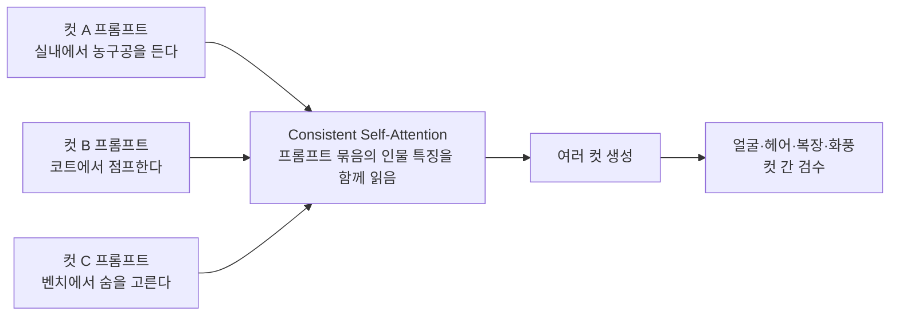
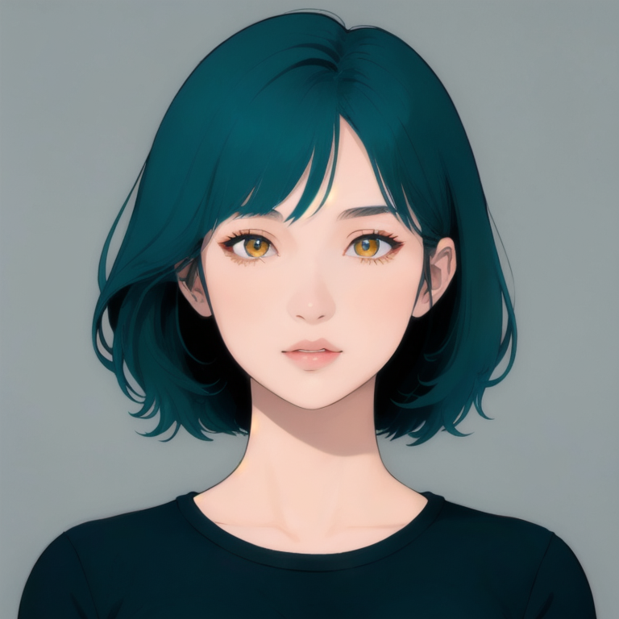
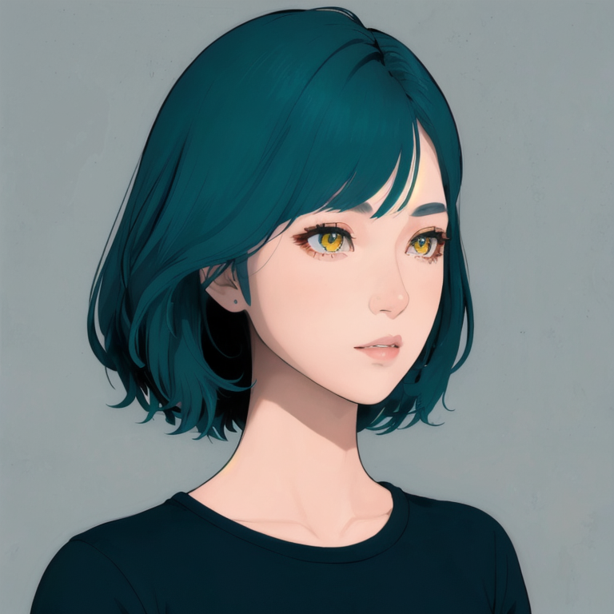

# P7-5.9 StoryDiffusion으로 여러 컷의 일관성 읽기

> Section ID: `P7-5.9`
> Version: `v2026.09.02`

한 장의 이미지를 다시 생성할 때는 얼굴·착장·배경 참조를 함께 넣어도, 원본의 선화와 pose가 다시 그려질 수 있다. 문제는 참조 이미지가 부족하다는 것만이 아니다. 한 장을 독립적으로 생성하는 모델은 그 장면 안에서 그럴듯한 답을 새로 찾기 때문이다. 웹툰처럼 같은 인물이 여러 컷에 이어져야 할 때는, **각 컷을 따로 잘 만드는 것**과 **컷들 사이에서 같은 인물로 읽히게 만드는 것**을 구분해야 한다.

StoryDiffusion은 이 두 번째 문제를 겨냥한 연구다. 중심 질문은 **여러 컷에서 인물과 화풍의 일관성을 높이려는 StoryDiffusion은 무엇을 공유하며, 무엇을 여전히 사람 검수로 남기는가**이다. 이 절을 읽고 나면 독자는 단일 이미지 재생성과 여러 컷 일관성 생성을 구분하고, 현재 장비에서 검증된 보강 경로와 아직 별도 검증이 필요한 새 구도 생성 경로를 함께 설명할 수 있어야 한다.

## 1. 한 장의 재생성과 여러 컷의 일관성은 다른 문제다

앞 절들의 다중참조 실험은 한 장면에 얼굴, 착장, pose, 배경을 역할별 입력으로 넣는 방법을 다뤘다. 이때 모델은 참조를 조건으로 삼아 새 이미지를 합성한다. 따라서 농구 점프의 큰 구도는 남아도, 선의 굵기, 재킷의 주름선, 손가락 윤곽처럼 작은 표현은 다시 해석될 수 있다.

StoryDiffusion은 출발 질문이 다르다. 여러 프롬프트가 서로 다른 장면을 설명하더라도, 그 프롬프트 묶음으로 만든 이미지들이 같은 인물·복장·화풍을 공유하도록 만드는 데 초점을 둔다. 논문은 이를 위해 기존 self-attention을 **Consistent Self-Attention**으로 바꾸는 방식을 제안하고, 사전 학습된 확산 기반 text-to-image 모델에 zero-shot으로 붙일 수 있다고 설명한다. [StoryDiffusion 논문](https://arxiv.org/abs/2405.01434){: target="_blank" rel="noopener noreferrer"}

| 비교 기준 | 단일 이미지 다중참조 재생성 | StoryDiffusion의 일관성 생성 |
| --- | --- | --- |
| 기본 단위 | 원본 장면 1장과 여러 참조 | 서로 다른 장면 설명을 담은 프롬프트 묶음 |
| 중심 목표 | 한 장면에 얼굴·착장·배경 조건을 반영 | 여러 컷에서 같은 인물·복장·화풍이 이어지게 함 |
| 공유하는 정보 | 입력 참조 이미지의 조건 | 생성 묶음 안에서 attention으로 읽는 인물 특징 |
| 잘못 읽기 쉬운 점 | 참조를 넣으면 원본 픽셀도 보존된다고 생각함 | 일관성이 높으면 pose·구도·선화도 정확히 고정된다고 생각함 |
| 사람 검수 | 원본 장면의 pose·선화·소품 접점 | 컷 간 얼굴·헤어·복장과 각 컷의 pose·구도 |

따라서 StoryDiffusion은 “원본 이미지를 손대지 않고 얼굴만 바꾸는” 국소 편집의 대체어가 아니다. 한 컷의 선화를 정확히 보존해야 한다면 원본 기반 편집이나 합성의 문제가 남는다. 반대로 같은 캐릭터가 학교 복도, 운동장, 실내 경기장에 연속으로 등장해야 한다면, 컷마다 독립 생성한 뒤 맞추려는 방식보다 StoryDiffusion이 겨냥하는 문제가 더 가깝다.

## 2. Consistent Self-Attention은 컷을 한 묶음으로 읽게 한다

확산 모델의 self-attention은 이미지 안에서 멀리 떨어진 부분의 관계를 계산하는 층이다. StoryDiffusion의 Consistent Self-Attention은 이 계산을 여러 생성 이미지에 걸쳐 확장해, 한 컷에서 읽은 인물의 특징이 다음 컷에서도 참고되도록 만든다. 논문과 공식 구현은 이를 캐릭터 일관성이 있는 장거리 이미지·비디오 생성의 핵심 구성으로 제시한다. [공식 구현](https://github.com/HVision-NKU/StoryDiffusion){: target="_blank" rel="noopener noreferrer"}

여기서 `함께 읽음`은 세 컷이 같은 배경이나 같은 pose를 가져야 한다는 뜻이 아니다. 컷 A는 실내, 컷 B는 경기장, 컷 C는 벤치처럼 장면과 동작이 달라질 수 있다. 공유하려는 것은 캐릭터의 얼굴형, 헤어 실루엣, 복장의 큰 특징, 그림의 표현 방향처럼 **장면을 바꿔도 이어져야 하는 정보**다.

공식 구현은 현재 Consistent Self-Attention 모듈에 최소 세 개의 텍스트 프롬프트가 필요하고, 레이아웃을 위해 다섯~여섯 개를 권장한다고 안내한다. 따라서 이 방법은 “기준 이미지 한 장을 넣어 한 장만 수정하는” 실행 인터페이스와 다르다. 먼저 연속된 컷의 작은 묶음을 설계하고, 그 묶음 전체를 한 번의 일관성 실험 단위로 봐야 한다. [StoryDiffusion 공식 README](https://github.com/HVision-NKU/StoryDiffusion#-key-features){: target="_blank" rel="noopener noreferrer"}

## 3. 일관성이 보장하지 않는 것

StoryDiffusion의 결과가 컷 간에 비슷해 보여도, 다음 네 가지는 별도 판정이 필요하다.

| 확인할 계약 | 일관성 생성이 도울 수 있는 부분 | 자동으로 보장되지 않는 부분 |
| --- | --- | --- |
| 캐릭터 identity | 얼굴·헤어·복장이 컷마다 크게 달라지는 현상을 줄이는 방향 | 특정 기준 얼굴의 눈·턱선·표정을 픽셀 단위로 복제 |
| 화풍 | 색층·선의 전반적 경향을 함께 유지하는 방향 | 원본 선화의 정확한 선 위치·굵기·주름선 |
| pose와 camera | 각 프롬프트의 장면 요구를 개별 컷에 반영 | 손발 관절, 공과 손의 접점, 원근을 정확히 고정 |
| 소품과 배경 | 반복 소품과 장소의 큰 맥락을 유지하는 방향 | 로고, 글자, 작은 가방 끈, 경기장 선의 정확한 geometry |

이 표가 중요한 이유는 “컷 일관성”을 모든 조건이 맞았다는 판단과 합치지 않기 위해서다. 예를 들어 세 컷의 헤어 색과 재킷은 일관되어도, 점프 컷의 공이 손에서 떨어지거나 발이 바닥에 닿지 않을 수 있다. 이 문제는 캐릭터 일관성이 아니라 pose·접지·소품 접점의 이탈이다.

따라서 출력 검수는 두 축으로 나눈다.

1. **묶음 검수**: 같은 캐릭터가 같은 헤어·얼굴 인상·주요 복장으로 이어지는가?
2. **컷별 검수**: 각 컷의 pose, 카메라, 손발, 소품 접점, 배경 원근이 장면 계약을 지키는가?

묶음에서 일관성이 보여도 컷별 pose·소품 접점이 이탈하면 완성 컷의 근거로 쓰지 않는다. 반대로 한 컷의 pose가 좋아도 다른 컷에서 인물이 달라지면 연속 장면의 기준으로 쓰기 어렵다.

## 4. 8GB에서도 조건을 좁히면 멀티뷰 보강을 실행할 수 있다

StoryDiffusion 공식 구현은 SD 1.5와 SDXL 기반 확산 모델에 붙일 수 있다고 설명한다. 공식 README의 low-memory Gradio 경로는 24GB GPU에서 시험됐고 20GB보다 큰 GPU 메모리를 예상하므로, 이 수치를 현재 장비의 보장으로 읽으면 안 된다. [공식 low-memory 안내](https://github.com/HVision-NKU/StoryDiffusion#how-to-use){: target="_blank" rel="noopener noreferrer"}

다만 이 저장소의 8GB 실험에서는 SD 1.5 기반 SeaArt ComfyUI 포트로 더 좁은 경로를 실제 실행했다. 5.7의 정면·좌45도·우45도 이미지를 VAE 잠재값으로 바꿔 세 앵커 cache에 기록하고, 출력도 **대응 방향의 기준 잠재값**에서 시작해 낮은 denoise로 보강했다. 이 조건에서는 정면과 좌45도에서 한 인물의 헤어, 눈색, 얼굴 인상과 상체 구도가 유지됐다. 따라서 “StoryDiffusion은 8GB에서 사용할 수 없다”가 아니라, **대응 방향 기준 이미지가 있는 멀티뷰 보강기로는 사용할 수 있다**가 현재 실험의 결론이다.

이 결론은 빈 잠재값에서 새 장면을 자유롭게 만드는 능력까지 뜻하지는 않는다. 같은 세 앵커를 기록한 뒤 빈 잠재값에서 새 정면을 만들자 여러 얼굴이 한 화면에 병합됐다. 그러므로 현재 포트에서는 `멀티뷰 앵커 → 대응 방향 잠재값 → 낮은 denoise 보강`과 `멀티뷰 앵커 → 빈 잠재값에서 새 구도 생성`을 다른 경로로 검수해야 한다.

### 현재 산출물까지의 최단 경로

이번 산출물은 멀티뷰 자체를 새로 그리는 경로가 아니라, 이미 준비한 5.7 멀티뷰를 한 캐릭터로 묶어 **대응 방향 이미지를 보강**하는 경로다. 불필요한 pose·배경·착장 입력을 더하지 않고 다음 네 단계만 사용했다.

| 순서 | 입력 또는 처리 | 역할 | 현재 고정값 |
| --- | --- | --- | --- |
| 1 | 5.7 정면·좌45도·우45도 토르소 PNG | 세 방향의 얼굴·헤어·화풍 앵커 | 768×768으로 맞춘 뒤 VAE 잠재값으로 변환 |
| 2 | `SeaArtApplyStory`와 앵커 sampler | 세 방향 정보를 StoryDiffusion attention cache에 기록 | `id_length=3`, `same=0.3`, anchor `denoise=0.2` |
| 3 | 목표 방향의 5.7 PNG | 후속 생성의 인물 수와 방향을 고정 | 빈 잠재값 대신 목표 방향 PNG의 VAE 잠재값 사용 |
| 4 | StoryDiffusion inference sampler | cache를 읽으며 기준 이미지를 작게 보강 | 25 step, target `denoise=0.35` |

예를 들어 좌45도를 보강할 때는 세 방향 이미지를 모두 1~2단계의 앵커로 기록하고, **좌45도 PNG 자체**를 3단계의 출발 잠재값으로 쓴다. 그러면 cache는 얼굴·헤어의 공통성을 보태고, 출발 잠재값은 한 인물과 좌45도 구도를 붙잡는다. 정면과 좌45도에서 이 경로는 단일 캐릭터를 유지했다.

| 정면 보강 결과 | 좌45도 보강 결과 |
| --- | --- |
|  |  |

실행에 사용한 정면·좌45도 워크플로 JSON도 결과 자산과 함께 보관한다. 두 워크플로는 ComfyUI 입력 폴더에 5.7의 정면·좌45도·우45도 PNG를 각각 `front.png`, `left-45.png`, `right-45.png`로 배치하는 것을 전제로 한다.

[정면 워크플로 JSON](../../../assets/part-07/chapter-05/p7-5-9-storydiffusion-torso-multiview-anchor-front-workflow-v1.json)

[좌45도 워크플로 JSON](../../../assets/part-07/chapter-05/p7-5-9-storydiffusion-torso-multiview-anchor-left-45-workflow-v1.json)

여기서 `denoise`는 출발 이미지를 얼마나 다시 그릴지 정하는 값이다. 이 실험의 `0.35`는 원본을 거의 그대로 복사하려는 값이 아니라, 방향과 인물 수는 남기되 얼굴·헤어·화풍을 cache와 함께 다시 정리하는 범위로 사용했다. 새 방향을 창작해야 한다면 먼저 그 방향의 기준 이미지를 준비해야 하며, `EmptyLatentImage`에서 바로 시작하는 것은 이 최단 경로에 포함하지 않는다.

| 선택지 | 지금 할 일 | 현재 판단 |
| --- | --- | --- |
| 원본 장면을 다시 생성해 얼굴·착장 반영 | 원본 보존과 참조 반영을 분리해 검수 | 선화·pose를 정확히 유지하는 해법은 아님 |
| StoryDiffusion 멀티뷰 보강 | 세 방향 앵커와 대응 방향 잠재값을 기록하고 낮은 denoise로 비교 | 8GB SD 1.5 포트에서 정면·좌45도 단일 인물 유지 확인 |
| 빈 잠재값 StoryDiffusion 생성 | 같은 앵커로 새 구도를 생성해 얼굴 병합 여부를 검수 | 현재 세 앵커 조건에서는 다중 얼굴 병합이 관찰됨 |
| 공식 StoryDiffusion 로컬 실행 | GPU 메모리, SDXL 의존성, 묶음 수를 기록하며 사전 점검 | 공식 low-memory 경로의 8GB 실행은 별도 검증 필요 |

이 구분은 StoryDiffusion을 낮게 평가한다는 뜻이 아니다. 오히려 대응 방향 보강에서 관찰된 일치와 새 구도 생성에서 관찰된 다중 얼굴을 분리해 다음 실험을 정확히 고르게 한다. 한 장의 원본 선화를 고정하는 문제와, 여러 컷에서 같은 캐릭터를 유지하는 문제는 서로 연결되지만 동일하지 않다. 전자는 원본 보존 전략을, 후자는 묶음 단위 attention 또는 일관성 모델을 찾아야 한다.

## 5. 다음 실험은 세 컷의 계약부터 쓴다

StoryDiffusion 계열을 비교하기 전에 이미지부터 많이 생성하지 않는다. 아래처럼 세 컷의 공통 조건과 컷별 조건을 먼저 나눈다. 이 표는 모델 입력 문서이면서, 출력 검수표의 초안이기도 하다.

| 항목 | 세 컷 공통 | 컷 A | 컷 B | 컷 C |
| --- | --- | --- | --- | --- |
| 캐릭터 identity | 청록 단발, 같은 얼굴 인상 | 유지 | 유지 | 유지 |
| 주요 복장 | 흰 크롭 재킷, 회색 이너, 청록 와이드 팬츠, 흰 운동화 | 유지 | 유지 | 유지 |
| 장면 | 농구 경기의 연속 장면 | 공을 든 준비 | 점프와 슛 | 착지 뒤 호흡 |
| 카메라·pose | 컷마다 따로 지정 | 미디엄 전신 | 로우 앵글 전신 | 미디엄 전신 |
| 컷별 실패 신호 | — | 팔·공 접점 불명확 | 공·손 분리, 접지발 없음 | 얼굴·복장 drift |

실험 결과를 볼 때는 “세 컷이 예쁜가” 대신 다음을 묻는다. 공통 조건이 세 컷에 실제로 남았는가? 컷 B의 점프가 실패했다면 identity 실패와 구분했는가? 한 컷만 고치려고 다시 생성할 때 묶음의 일관성이 무너졌는가? 이 질문에 답할 기록이 있어야 StoryDiffusion 계열을 단순한 만화 생성 도구가 아니라, 연속 이미지의 조건 제어 방법으로 평가할 수 있다.

## 체크리스트

- StoryDiffusion의 목표가 한 장의 픽셀 보존이 아니라 여러 컷의 character·style 일관성이라는 점을 구분했는가?
- 묶음 검수(identity·헤어·복장·화풍)와 컷별 검수(pose·camera·손발·소품)를 따로 기록하는가?
- 최소 세 프롬프트가 필요한 프롬프트 묶음 단위의 방법이라는 점을 이해했는가?
- 8GB에서 검증된 멀티뷰 보강과, 아직 검증되지 않은 빈 잠재값 새 구도 생성을 구분했는가?
- 다음 실험 전에 공통 조건과 컷별 조건을 분리한 세 컷 계약표를 작성했는가?

## 출처와 참고 자료

- Yupeng Zhou et al., [StoryDiffusion: Consistent Self-Attention for Long-Range Image and Video Generation](https://arxiv.org/abs/2405.01434){: target="_blank" rel="noopener noreferrer"}, NeurIPS 2024, 확인일: 2026-08-28.
- HVision-NKU, [StoryDiffusion 공식 구현](https://github.com/HVision-NKU/StoryDiffusion){: target="_blank" rel="noopener noreferrer"}, 확인일: 2026-08-28.
