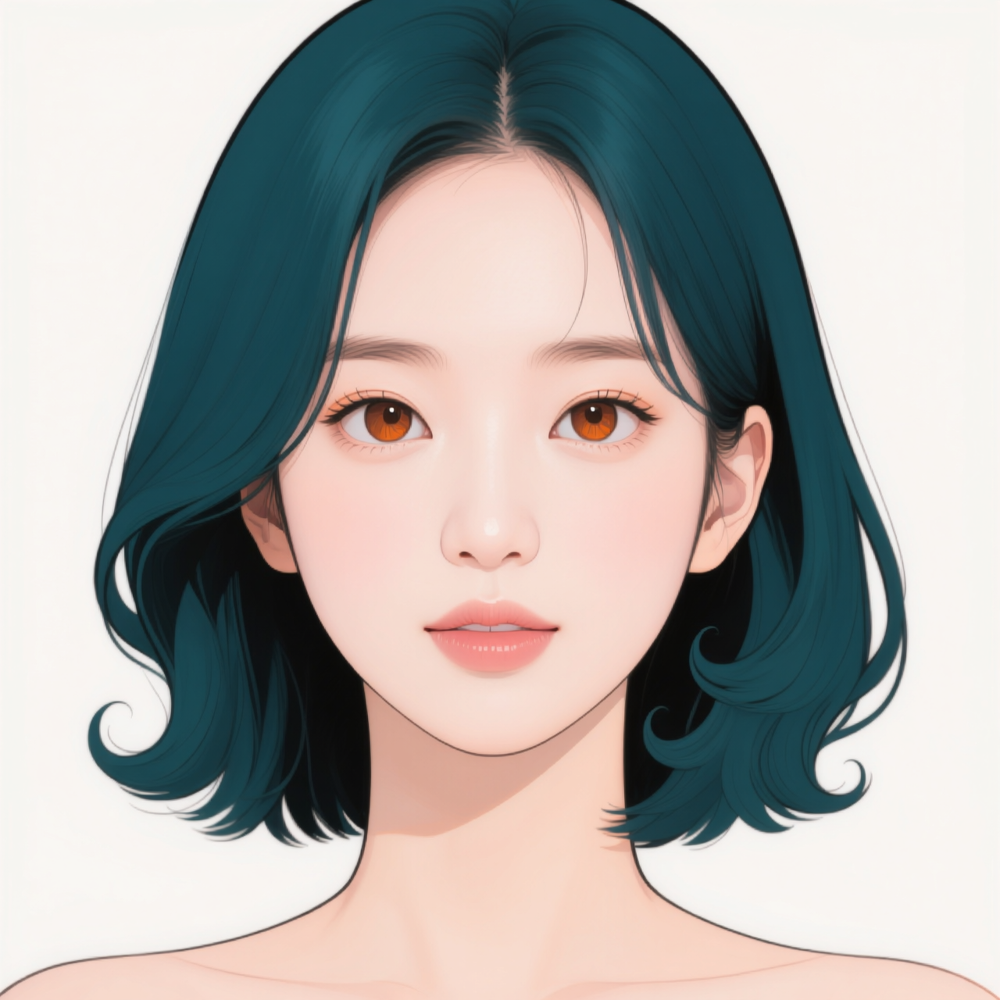
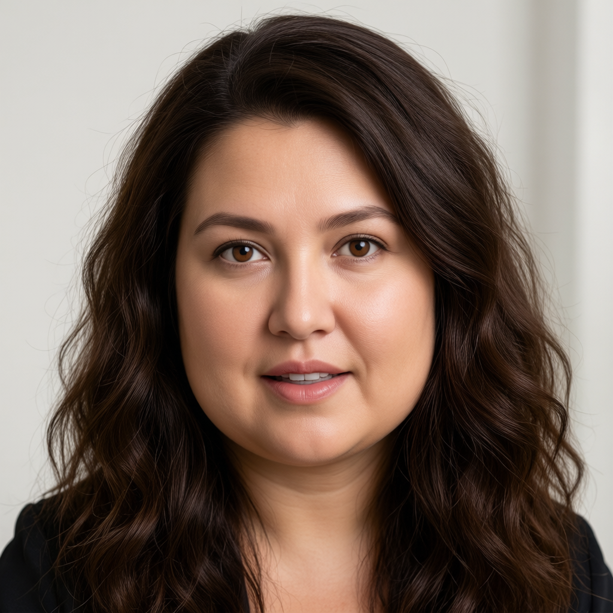

# P7-5.10 보충학습: 캐릭터 일관성을 위한 LoRA 학습과 평가

> Section ID: `P7-5.10`
> Version: `v2026.09.18`

장면이나 입력 인물이 달라져도 Mira를 같은 캐릭터로 알아볼 수 있게 만드는 것이 이번 보충학습의 목표다. 이를 위해 **얼굴·헤어·화풍을 일관되게 표현하는 LoRA**를 학습하고, 실제 편집 결과에서 그 특징이 유지되는지 확인한다. 캐릭터 일관성은 머리색 하나가 같다는 뜻이 아니라 얼굴의 인상, 헤어의 형태, 목표 화풍이 함께 이어지는 것을 뜻한다.

콘셉트는 [5.5에서 사용한 BFS Head V5](section-05.md)의 얼굴·헤어 편집을 참고했다. 이를 Mira에 맞춰 **입력 인물의 얼굴·헤어를 Mira의 외형으로 바꾸고 그림 전체를 목표 화풍으로 표현하는 편집 과제**로 구성한다. 이 절의 ‘BFS LoRA’는 그 참고 관계를 나타내는 이름이다. 데이터셋과 학습 목표는 직접 구성하고 Qwen-Image-Edit-2511에서 새 어댑터를 학습한다.

실습은 **학습용 이미지 생성 → 입력·목표 데이터셋 구성 → LoRA 학습 → 검증 입력 평가 → 출력 결과 검수**로 이어진다. 검증 19쌍은 새 학습 완료 후 변환과 보존을 비교하는 데 사용한다.

## 빠른 실습: 공개 LoRA를 내려받아 적용한다

편집 결과를 먼저 확인하려면 이미지 생성과 LoRA 학습을 건너뛰고 **공개된 최종 1600스텝 어댑터**를 내려받는다. 약 590MB이며 Apache-2.0 라이선스로 제공한다. LoRA는 기반 모델에 추가하는 가중치이므로 **Qwen-Image-Edit-2511과 추론 환경은 별도로 준비**해야 한다.

[Hugging Face 모델 카드 · 적용 예제와 평가 결과](https://huggingface.co/devchan64/mira-bfs-qwen-image-edit-2511-lora)

[최종 LoRA 바로 다운로드 · mira_bfs.safetensors](https://huggingface.co/devchan64/mira-bfs-qwen-image-edit-2511-lora/resolve/2212acc0555e9d1e0c60895cfe058775e327056b/mira_bfs.safetensors?download=true)

브라우저에서 위 파일을 받거나, 저장소 루트의 터미널에서 다음 명령으로 내려받는다. 고정 리비전을 사용하므로 본문의 평가에 사용한 가중치와 같은 파일을 받는다.

```bash
mkdir -p .tmp/download/mira-bfs
curl --fail --location \
  'https://huggingface.co/devchan64/mira-bfs-qwen-image-edit-2511-lora/resolve/2212acc0555e9d1e0c60895cfe058775e327056b/mira_bfs.safetensors' \
  --output .tmp/download/mira-bfs/mira_bfs.safetensors
```

[배포 파일·SHA-256·고정 리비전 JSON](../../../assets/part-07/chapter-05/sec-10/huggingface-release/release.json)

모델 카드의 Diffusers 예제에서 내려받은 폴더를 `load_lora_weights`의 경로로 지정하고, 파일명은 `mira_bfs.safetensors`로 둔다. **512×512 입력 한 장 → Mira로 변환하라는 편집 지시 → LoRA 적용 출력**의 순서로 실습한다. 목표 얼굴 이미지를 별도 참조로 추가하지 않는다.

본문의 평가 조건은 LoRA 강도 1.0, 시드 62294, 추론 20스텝, CFG 4.0, 출력 512×512다. **참조 VAE 처리 크기도 512×512로 맞춘다.** 모델 카드에는 이 설정을 포함한 실행 예제가 있다. 입력과 출력을 나란히 놓고 Mira의 얼굴·헤어·화풍이 나타나는지, 자세·표정·의상·배경이 유지되는지 따로 확인한다. 공개 가중치는 현재 366쌍 중 학습 347쌍으로 학습한 1600스텝 산출물이다. 45장 검수에서 얼굴·헤어는 대체로 양호하고 표정에도 큰 특이점은 없다고 판단했다. 일부 복장 변경은 의상 보존 오류로 확인했다.

적용 결과를 확인했다면 아래에서 데이터 준비·학습·평가 과정을 따라간다. 현재 데이터셋은 366쌍이며, 공개 어댑터는 학습 347쌍을 사용하고 검증 19쌍을 제외했다. 누적 3200스텝 추가 학습은 이번 배포 가중치에 포함되지 않는다.

## 실습 목표와 LoRA의 역할

### LoRA로 기반 모델에 편집 특징을 더한다

LoRA는 기반 모델의 가중치를 고정하고, 가중치의 변화를 작은 두 행렬의 곱으로 표현하여 학습하는 방법이다. 모델 전체를 다시 학습할 때보다 갱신할 파라미터를 줄인다. 다만 기반 모델도 계산에 참여하므로 모델을 읽고 계산하는 메모리가 모두 없어지는 것은 아니다. 원리는 [LoRA 논문](https://arxiv.org/abs/2106.09685){: target="_blank" rel="noopener noreferrer" }에서 확인할 수 있다.

학습 결과인 어댑터는 학습할 때 사용한 기반 모델에 적용한다. 이번 기반 모델은 **`Qwen/Qwen-Image-Edit-2511`**이다. 목표 이미지를 처음 만든 모델과 어댑터를 학습·적용하는 모델의 역할을 구분한다. 평가에서는 같은 기반 모델에서 어댑터만 켜거나 꺼 변화의 범위를 비교한다.

편집 학습의 한 항목은 **참조 입력·학습 지시·목표 이미지**로 이루어진다. 참조 입력은 바꾸기 전 장면이고, 지시는 바꿀 특징과 보존할 요소를 설명하며, 목표는 학습 중 맞추려는 결과다. 학습 지시의 `mira_person`은 같은 특징을 연결해 반복 사용하는 식별 문구이며, 이 문자열만으로 새로운 전용 토큰이 자동 생성되지는 않는다. 캡션은 원래 생성 의도보다 실제 입력·목표의 대응을 기준으로 적는다.

비슷한 이미지나 같은 목표에서 만든 변형을 학습과 검증 양쪽에 나누면 익숙한 자료의 재현을 일반화로 오해하기 쉽다. 같은 목표의 파생 입력은 같은 분할에 두고, 검증 목표와 그 파생 입력을 학습에서 제외한다. 파일 해시는 자료가 바뀌었는지 확인하는 수단이며, 인물 유사도나 편집 품질의 점수는 아니다.

### 바꿀 외형과 남길 장면을 나눈다

얼굴이 Mira로 바뀌었다고 편집 전체가 성공한 것은 아니다. 입력 인물이 웃고 있었다면 변환 후에도 웃어야 하고, 들고 있던 물건이나 배경의 배치도 이어져야 한다. 화풍은 그림 전체에 적용하되 장면의 내용과 구도를 함께 바꾸라는 뜻은 아니다.

| 구분 | 이번 LoRA에 요구하는 변화 |
| --- | --- |
| 얼굴 | 입력 인물의 이목구비를 Mira의 얼굴 특징으로 변경 |
| 헤어 | 머리색·길이·가르마·윤곽을 Mira의 헤어로 변경 |
| 화풍 | 인물과 배경 전체를 목표의 선·채색·질감으로 표현 |
| 유지할 요소 | 자세·머리 방향·표정·의상 디자인·소품·카메라 구도·배경 대상의 배치 |

예를 들어 도서관에서 정면을 보고 있는 긴 갈색 머리 인물을 입력했다면, 목표는 같은 도서관·자세·표정·의상을 유지하면서 Mira의 얼굴과 헤어, 목표 화풍을 적용한 이미지다. 얼굴 형태가 바뀌는 것과 웃는 정도·입 벌림 같은 표정이 바뀌는 것을 구분해 검수한다.

## 학습용 이미지를 생성한다

### 기존 Mira 목표에서 변환 전 입력을 만든다

편집 학습에서는 시작 이미지와 원하는 결과를 지시문으로 연결한다. Musubi 문서도 제어 이미지를 추론의 시작 이미지, 목표 이미지를 생성하려는 결과로 구분한다. 이 원칙을 적용해 기존 Mira 이미지를 정답으로 고정하고, 그 이미지에서 다른 인물·화풍의 입력 후보를 생성한다.

| 단계 | 출발 이미지 | 도착 이미지 |
| --- | --- | --- |
| 자료 생성 | 기존 Mira 이미지 | 얼굴·헤어·화풍이 다른 입력 후보 |
| LoRA 학습 | 검수한 입력 후보 | 원래의 Mira 이미지 |
| 실제 사용 | 변환할 새 인물·장면 | BFS 특징을 적용한 편집 결과 |

**자료를 생성하는 방향과 LoRA를 학습하는 방향은 반대다.** 생성 도구에 넣은 Mira 이미지는 새 LoRA 학습에서는 목표가 되고, 생성된 다른 인물 이미지는 학습 참조가 된다. 새 입력을 독립적으로 그려 기존 Mira와 임의로 짝짓는 대신, 같은 목표에서 출발해 보존할 장면 요소를 대응시키는 설계다. 이렇게 생성해도 완전한 대응이 보장되지는 않으므로 결과 검수가 필요하다.

후보 생성의 출발점은 Mira 목표 44장이다. 기준·방향 이미지 12장과 추가 생성한 목표 32장을 모아 학습용 목표 40장·검증용 목표 4장으로 나누고, 입력 유형 5종을 적용해 총 220장을 생성하도록 구성했다. 학습용 목표에 대응하는 후보는 200쌍, 검증용 목표에 대응하는 후보는 20쌍이며 아직 채택 수는 아니다. 기존 목표의 분할을 파생 입력에도 적용하고 검증 쌍을 학습에 섞지 않는다. 같은 생성 과정에서 만든 검증 자료이므로 실제 외부 장면에 대한 독립적인 성능 검증을 대신하지 않는다.

### 한 쌍 안에서는 카메라와 구도를 고정한다

**학습 참조와 목표는 같은 시점·구도에서 얼굴·헤어·화풍만 달라져야 한다.** 입력이 눈높이의 정면인데 목표가 위에서 내려다본 사선이면, 두 이미지의 차이에 카메라 변환까지 포함된다. 이번에 요구하는 BFS 변환과 구도 보존을 분리하기 어려운 쌍이므로 채택하지 않는다. 이 고정 조건은 각 입력·목표 쌍에 적용한다. 서로 다른 쌍 사이에는 정면·측면·고각도·저각도 등 여러 구도가 있을 수 있다.

같은 ‘우측 사선’이라는 이름만으로 구도가 같다고 판단하지 않는다. 카메라 높이와 원근, 인물이 화면에서 차지하는 크기, 위치와 잘린 범위까지 비교한다. 2D 생성 이미지에서 실제 초점거리나 카메라 좌표가 같음을 확인할 수는 없으므로, 이미지에 나타난 공간 배치를 검수 기준으로 삼는다.

| 검수할 요소 | 입력과 목표에서 유지할 대응 |
| --- | --- |
| 시점·원근 | 내려다보거나 올려다보는 정도, 머리·몸의 보이는 면, 배경의 수평선·원근 |
| 프레이밍 | 화면비, 인물의 중심 위치와 몸 크기, 몸이 잘린 범위 |
| 자세·표정 | 어깨·몸통·손의 위치, 머리 방향, 시선과 입 벌림 |
| 장면 배치 | 의상 디자인, 소품·배경 물건의 위치와 앞뒤 가림 관계 |

원본 해상도가 다르면 같은 캔버스 크기로 맞춰 나란히 보거나 겹쳐 비교한다. 어깨·몸통·손과 배경의 고정 지점을 기준으로 확대·이동·재구도가 발생했는지 확인한다. 얼굴 형태와 머리카락 윤곽은 바꿀 대상이므로 모든 얼굴 점이나 머리 외곽선을 픽셀 단위로 일치시키지는 않는다. 화풍에 따른 선·질감 변화와 공간 배치의 이동을 구분한다. 허용 오차의 수치 기준은 아직 검증하지 않았다.

생성 지시에는 카메라·원근·인물 위치·몸 크기를 유지하고 확대·크롭·재구도·카메라 회전을 하지 않도록 명시했다. 지시를 넣었다는 사실이 보존 성공을 뜻하지는 않는다. 구도가 달라진 후보는 채택하지 않는다. 사용자 확정 폐기 항목은 재생성 제외 목록에 따라 다시 생성하지 않는다.

### 입력 후보의 외형과 화풍을 다양하게 만든다

생성 목록에는 서로 다른 얼굴 형태·눈 색·머리 길이·머리색과 함께 사진풍, 수채화, 점토 같은 3D 표현, 컬러 펜화, 유화의 다섯 입력 유형을 배치했다. 이는 변환 전 입력의 폭을 확보하기 위한 후보 구성이다. 다섯 유형이 충분하거나 최적이라고 검증한 것은 아니다.

생성 지시는 바꿀 얼굴·헤어·화풍을 설명하고, 자세·머리 방향·시선·표정·입 벌림·의상·구도·배경 배치를 유지하도록 요구한다. 화풍을 바꾸면서 선과 질감은 달라질 수 있지만, 인물의 동작이나 배경 물건까지 달라진 결과는 그대로 학습에 넣지 않는다.

생성과 학습은 이미지 생성 코드·생성 JSON·LoRA 코드·데이터셋 JSON의 4개 기준 파일로 관리한다. 파일은 모두 `sec-10/`에 둔다. 사용 확정 이미지의 실제 파일은 `training-images/input-images/`와 `training-images/target-images/`에 저장하며, 과거 생성 기록의 경로는 심볼릭 링크와 생성 JSON의 `path_aliases`로 연결한다. 관리번호와 이미지 해시는 이동 후에도 유지한다.

생성 JSON의 `rules[규칙 ID].spec.items`에 있는 `reference`는 **입력 후보를 생성할 때 사용하는 Mira 목표**를 가리킨다. 입력 생성 규칙의 `training_target`은 원래 Mira 목표 경로이며, 생성 카탈로그의 `image`는 생성된 입력 후보 경로다. `prompt`는 자료 생성 지시이고, `training_caption`은 반대 방향인 BFS 변환을 학습할 지시다. 두 문구를 바꾸어 쓰지 않는다. 현재 생성 목록의 `training_caption`은 BFS 대신 Mira의 얼굴·헤어·일러스트 화풍을 직접 지칭한다. 기존 학습·평가 기록의 캡션은 당시 조건으로 보존하며, 이 수정이 배포된 LoRA를 바꾸지는 않는다.

데이터셋용 입력·목표 후보의 이미지 생성은 아래 공용 코드 하나로 통일한다. 조건마다 별도 생성기를 만들지 않고 JSON을 바꿔 실행한다. `--spec` JSON 하나에 조건 조합·고정 저장 경로(`storage`)·폐기 목록(`excluded_items`)을 함께 지정한다. 통합 JSON의 `selection.include_management_ids`·`exclude_management_ids`로 이번 출력 대상을 좁힐 수 있고, 완료 이미지는 재생성하지 않는다.

[이미지 순차 생성 Python](../../../assets/part-07/chapter-05/sec-10/p7_5_10_generate_supplements.py)

[입력 후보 조건 조합 JSON](../../../assets/part-07/chapter-05/sec-10/p7-5-10-image-generation.json)

생성 JSON은 `management_index`에서 관리번호를 규칙·조건 ID에 연결한다. 각 규칙의 `spec.components`에 방향·얼굴·화풍·배경과 보존 조건을 정의하고, `spec.items`에서 각 후보의 조건 ID를 선택한다. `prompt_order`에 따라 문구를 조합한다. 기존 입력 220개의 조합은 생성 당시 프롬프트·시드·참조와 정확히 일치하는지 확인한 뒤 폐기 27개를 제외한다. 입력에서는 목표의 배경과 방향을 유지하고, 목표 후보를 만들 때 배경 조건을 변경한다. 펼친 생성 조건의 기준 해시는 `provenance`에 보존하고 당시 결과 기록은 변경하지 않는다. 중복된 평문 목록은 별도로 두지 않는다.

5.2의 15방향 토르소에 얼굴 조건 6종·화풍 2종을 조합한 입력 180개 중 사용자 제외 7개를 뺀 173개를 사용한다. 단순 토르소 목표는 **5.2의 같은 방향 원본을 재사용**한다. 별도로 생성한 맞춤 목표와 해당 생성 기능은 제거했다. 아래 데이터셋 목록표에서 관리번호별 입력과 Mira 목표의 얼굴 비율, 방향·표정·포즈·의상·배경을 비교한다.

원래 220개 생성 조건은 보존한다. 얼굴 방향 3건·배경 손실 및 변경 5건·표정 불일치 19건을 합한 폐기 확정 27건은 아래 명령에서 제외되어 실행 대상은 193개다. `--dry-run`으로 제외 ID를 확인할 수 있다.

```bash
.venv/bin/python docs/assets/part-07/chapter-05/sec-10/p7_5_10_generate_supplements.py \
  --spec docs/assets/part-07/chapter-05/sec-10/p7-5-10-image-generation.json --rule P710-RULE-INPUT-001 \
  --dry-run
```

`--dry-run`은 참조와 완료 이미지의 해시를 확인하고, 폐기·완료 항목을 제외한 실제 생성 대상을 출력한다. 현재 입력 193개가 모두 존재하면 생성 대상은 0개다. 실제 생성은 사용 중인 GPU 작업과 겹치지 않는 시점에 이 옵션을 빼고 실행한다. 설정은 Qwen-Image-Edit-2511, 1024×1024, 20스텝, CFG 4.0이며 추가 LoRA는 적용하지 않는다. 각 후보는 해당 Mira 목표에서 독립적으로 생성한다.

생성 코드는 이미지·생성 기록·후보 카탈로그를 남긴다. 완료 이미지는 해시를 확인하고 재사용하며, 사용 여부는 확정 데이터셋 JSON에 기록한다. 현재 입력 366개와 공유 목표 46개를 `sec-10/training-images/`에서 관리한다. 생성 기록과 미채택 후보는 학습 이미지와 구분하여 보존한다.

[참조 입력 후보 193장 카탈로그 JSON](../../../assets/part-07/chapter-05/sec-10/input-images/candidate-catalog.json)

확정 데이터셋 검수표에서 관리번호별 입력·목표 대응을 확인한다. 기존 입력의 `P711-IN-NNN`과 보강 입력의 `P710-PROP-NNN` 관리번호를 유지하며, 사용 여부는 최신 데이터셋 JSON을 기준으로 한다.

전체 후보를 원고에 펼치지 않고, 같은 Mira 목표에서 생성한 입력 변형 3장만 예로 든다. 생성 방향은 **Mira 목표 → 다른 인물·화풍의 입력 후보**, 학습 방향은 그 반대다. 아래는 확정 데이터셋에 포함된 입력 변형을 보여 주는 샘플이다.

| 공통 Mira 목표 | 사진풍 입력 후보 | 수채화 입력 후보 | 컬러 펜화 입력 후보 |
| --- | --- | --- | --- |
| { width="240" } | { width="240" } | { width="240" } | { width="240" } |

얼굴·헤어·화풍의 변화와 구도·표정·의상 보존은 별도로 살핀다. 후보가 생성되었다는 이유만으로 대응 관계가 맞다고 간주하지 않으며, 전체 후보의 경로와 해시는 위 카탈로그에서 확인한다.

## 검수한 입력·목표 쌍으로 데이터셋을 구성한다

### 두 이미지가 같은 편집 과제를 이루는지 검수한다

검수는 두 방향으로 한다. 먼저 새 입력의 얼굴·헤어·화풍이 기존 Mira와 실제로 달라졌는지 본다. 다음으로 유지하려던 자세·표정·의상·구도·장면 배치가 목표와 대응하는지 본다. 다른 얼굴을 만들었지만 팔 위치나 의상이 바뀌었다면 얼굴·헤어·화풍 변환만을 가르치는 쌍으로 채택하기 어렵다.

목표 이미지도 다시 검토한다. 기준 인물의 외형이 맞는다는 사실만으로 그림 전체의 Mira 목표 화풍을 가르칠 정답으로 적합한 것은 아니다. 목표 사이의 선·채색·질감이 일관되는지, 배경까지 원하는 화풍인지 확인한다. 보류된 쌍은 예정 수량을 맞추기 위해 자동으로 학습에 넣지 않는다.

검수한 쌍에는 입력·목표 경로와 해시, 분할, 학습 지시, 채택 이유를 기록한다. 생성 목록의 `training_caption`은 초안이며 검수 결과와 맞춰 확정한다. 다음은 그 지시의 의미다.

> 인물을 Mira의 얼굴과 헤어로 바꾸고, 그림 전체에 Mira의 목표 화풍을 적용한다. 자세·머리 방향·표정·의상 디자인·구도·장면 배치는 유지한다.

[후보 검수 목록·데이터셋 선택 Python](../../../assets/part-07/chapter-05/sec-10/p7_5_10_mira_lora.py)

`review-template`·`export` 명령에 입력 후보 카탈로그를 지정한다. 선택 결과는 `control_image`에 생성한 다른 인물 이미지, `image`에 원래 Mira 목표를 기록한다. 같은 목표의 모든 파생본은 같은 분할에 두고 기존 검증 목표를 학습으로 옮기지 않는다. 입력 후보 220개는 목표 장면 220개가 아니라 **44개 목표의 변형**이다.

### 학습 347쌍·검증 19쌍을 확정한다

기존 220개 입력 중 제외 27개를 뺀 193쌍에, 보강 입력 180개 중 제외 7개를 뺀 173쌍을 추가했다. 현재 확정 목록은 **366쌍: 학습 347쌍·검증 19쌍**이다. 목표는 중복을 제외하면 46개이며 같은 목표를 여러 입력이 공유한다. 별도 장면 목표 후보 123개는 대응 입력이 없어 이 목록에 포함하지 않는다.

[확정 데이터셋 366쌍 목록표](../../../assets/part-07/chapter-05/sec-10/bfs-paired-dataset-review.md){ .aibook-markdown-preview }

[현재 통합 데이터셋 JSON: 기존 193쌍 + 보강 173쌍](../../../assets/part-07/chapter-05/sec-10/p7-5-10-paired-dataset.json)

## 확정 데이터셋으로 LoRA를 학습한다

현재 확정 데이터셋은 기존 193쌍과 보강 173쌍을 합한 366쌍(학습 347·검증 19)이다. 아래 명령은 **현재 366쌍 데이터셋**으로 새 학습을 준비한다. 배포된 LoRA는 보강 전 193쌍으로 학습한 결과이며, 366쌍으로 학습을 완료했다는 뜻은 아니다. `purpose`가 `paired_edit_training`이면 각 행의 `control_image`를 입력으로, `image`를 목표로 고정한다. 같은 행에 지정한 입력·목표 대응을 유지한다. 입력·목표와 생성 기록의 해시, 중복 입력, 같은 목표가 학습과 검증에 함께 들어가는 오류를 검사한다.

[고정 입력·목표 대응을 지원하는 학습 준비·실행 Python](../../../assets/part-07/chapter-05/sec-10/p7_5_10_mira_lora.py)

[데이터셋 JSON의 training_config 학습 설정](../../../assets/part-07/chapter-05/sec-10/p7-5-10-paired-dataset.json)

학습 설정에서 `rank`는 LoRA의 작은 행렬이 표현할 변화의 차원이고, `alpha`는 그 변화량의 스케일을 정하는 데 쓰인다. 학습률은 한 번 갱신할 때의 변화 크기, 스텝은 가중치 갱신 횟수다. 추론 때의 LoRA 강도는 학습된 변화를 얼마나 적용할지 정하므로 학습률과 구분한다. 한 번에 여러 설정을 바꾸기보다 같은 검증 입력에서 바꾼 항목의 영향을 비교한다.

8GB GPU에서는 잠재표현·조건 임베딩 캐시, gradient checkpointing, 일부 블록의 CPU 이동, 기반 가중치의 FP8 처리를 사용했다. 이들은 계산·메모리 사용 방식을 조절하며 학습 목표를 대신하지 않는다. 목표 해상도와 참조의 VAE·시각언어 인코더 처리 크기를 별도로 확인한다. 모델 다운로드·해시 검증은 저장소의 모델 관리 도구로 수행하고 `.tmp/download/`의 기존 파일을 사용한다. 학습 전용 환경의 의존성은 저장소 `requirements.txt` 안내를 따른다.

첫 비교 설정은 아래 실행 환경에서 해상도 512, rank·alpha 16, 학습률 0.0001, 배치 크기 1, 최대 1600스텝, 400스텝마다 저장으로 둔다. 이는 충분한 학습량을 확정한 값이 아니다. 한 스텝에 한 쌍을 사용하므로 1600스텝은 현재 학습 347쌍을 평균 약 4.6회 사용하는 양이며, **장당 1600스텝이 아니다**. 입력 유형별 보존 품질과 Mira 변환 정도를 확인하고 다음 실행의 학습량을 조정한다.

저장소 루트에서 다음 명령을 실행한다. 패키지 경로는 실행마다 새 이름을 사용한다.

```bash
.venv/bin/python docs/assets/part-07/chapter-05/sec-10/p7_5_10_mira_lora.py prepare \
  --manifest docs/assets/part-07/chapter-05/sec-10/p7-5-10-paired-dataset.json \
  --output .tmp/p7-5-10/bfs-paired-366-v1
```

출력 패키지의 `train.jsonl`에는 347쌍, `validation.jsonl`에는 19쌍이 기록된다. 학습용 `dataset.toml`은 `train.jsonl`만 읽고, 검증 쌍은 별도 편집 평가에 사용한다. 학습 이미지는 `sec-10/training-images/`, 데이터셋과 `training_config`는 `sec-10/p7-5-10-paired-dataset.json`, 이 명령의 실행 패키지·캐시·체크포인트는 `.tmp/p7-5-10/bfs-paired-366-v1/`에 둔다.

같은 Mira 목표에 서로 다른 입력이 대응하므로, 원본 목표 파일명만으로 캐시를 만들면 쌍들이 같은 캐시를 덮어쓸 수 있다. 준비 코드는 `paired-targets/`에 쌍 ID를 이름으로 갖는 원본 연결을 만든다. 이미지를 복제하지 않으면서 각 입력에 대응하는 캐시 이름을 분리하고, 연결된 목표의 해시도 패키지 검사에 포함한다.

다음 명령은 캐시 생성과 학습 명령을 **계획으로 출력**한다. `--trainer`는 고정 커밋 `e0cbd8f3dfe38365b10f8bc790b980f8894e8ba1`의 Musubi 경로, `--python`은 기존 학습 전용 가상환경이다. 로컬 경로가 다르면 설치 위치에 맞춘다.

```bash
.venv/bin/python docs/assets/part-07/chapter-05/sec-10/p7_5_10_mira_lora.py run \
  --package .tmp/p7-5-10/bfs-paired-366-v1 \
  --trainer /tmp/p7511-musubi \
  --python .tmp/p7-5-11/musubi-venv/bin/python
```

실제 실행에는 위 명령에 `--execute`를 추가한다. 실행 코드는 모델 파일 해시와 학습기 버전·환경을 확인한 뒤 잠재표현 캐시 → 텍스트·입력 조건 캐시 → LoRA 학습 순서로 진행한다. 출력 이름은 `mira_bfs`이며 다른 LoRA를 이어 학습하지 않고 Qwen-Image-Edit-2511에서 새 어댑터를 학습한다. 현재 학습 347쌍으로 1600스텝 실행을 마쳤으며, 400·800·1200·1600스텝 LoRA와 재개 상태, 최종 LoRA·종료 상태가 저장되었다. 학습 완료가 편집 품질 검증을 뜻하지는 않는다.

## 학습 후 검증 입력으로 평가한다

검증 19쌍은 학습에 사용하지 않는다. 새 체크포인트가 저장되면 같은 입력·캡션·시드에서 LoRA 미적용과 적용을 비교한다. 모델에는 입력 한 장만 전달하고 Mira 목표는 결과 비교에 사용한다. 얼굴·헤어·화풍의 변환과 자세·표정·의상·배경 보존을 구분한다.

[LoRA 편집 평가 코드](../../../assets/part-07/chapter-05/sec-12/p7_5_12_evaluate_bfs.py)

검증 19쌍의 미적용·적용 비교와 별도로, 학습에 사용하지 않은 외부 입력 45장에 새 1600스텝 LoRA를 적용했다. 남성·여성·유아 입력 각각에 높이 3종과 수평 방향 5종을 조합했다. 출력과 참조 VAE 크기는 512×512로 맞추고 크롭하지 않는다.

[외부 입력 45장 · 1600스텝 LoRA 시각 검수표](../../../assets/part-07/chapter-05/sec-10/bfs-camera-366-review.md){ .aibook-markdown-preview }

표에는 입력과 LoRA 적용 결과를 나란히 배치했다. 얼굴·헤어·화풍의 변환과 표정·자세·의상·배경 보존을 구분해 살핀다. 특히 45°·90°에서 머리의 앞뒤 길이가 입력 비율에 머무는지 확인한다. 생성 45장과 파일 무결성을 확인하고 항목별 AI 시각 검수 의견을 표에 기록했다. 사용자 검수와 재검토에서는 **얼굴·헤어는 대체로 양호하고 표정에도 큰 특이점이 없다**고 판단했다. 일부 웃음 강도 차이는 입력 표정 보존의 세부 관찰로 남기며 전체적인 표정 실패로 해석하지 않는다. 반면 009·011·019·026·028·029의 목선·칼라 변경은 **의상 보존 오류**로 기록한다. 책의 상태·몸 비율·배경 화풍에 대한 관찰도 얼굴 일관성과 구분해 비교한다. 누적 3200스텝 결과는 같은 입력과 설정으로 검증하며, 별도의 합성 시트 대신 링크된 검수 MD의 원본 이미지와 관리번호별 의견을 기준으로 확인한다.

## 평가 이후의 데이터 보강과 추가 학습

출력 검수에서 확인한 개선 과제에 따라 데이터를 보강하거나 저장 상태에서 학습을 이어 갈 수 있다. 아래 두 항목은 학습 이후 적용할 수 있는 확장 방법이다.

### 기존 후보를 활용할 때도 같은 목록을 갱신한다

별도 장면 목표 후보 123개는 통합 생성 JSON의 `P710-RULE-TARGET-001`에 기록되어 있다. 아직 대응 입력이 없어 현재 확정 데이터셋에는 포함하지 않는다. 이후 활용한다면 기존 이미지의 재사용 가능성과 입력·목표 대응을 확인하고, 관리번호·경로·결과 ID·분할을 같은 데이터셋 JSON에 반영한다. 단순 토르소 목표는 5.2 원본을 사용하며 추가 생성하지 않는다. 검수용 목록표는 확정 데이터셋에서 관리한다.

### 1600스텝 평가 후 저장 상태에서 이어 학습한다

이번 설정은 `save_state`와 `save_state_on_train_end`를 켠다. 400스텝마다 LoRA 가중치와 재개용 상태를 저장하며, 정상 종료 시 마지막 상태도 보관한다. 재개용 상태에는 LoRA 가중치뿐 아니라 옵티마이저·학습률 스케줄러·난수 상태가 들어간다. LoRA `.safetensors` 파일 하나만 가져와 추가 학습하는 것과 구분한다.

1600스텝 정상 종료 후 마지막 상태는 패키지의 `checkpoints/mira_bfs-state/`다. 중간 상태는 `checkpoints/mira_bfs-step00000400-state/`처럼 저장된다. 학습이 중단되면 저장이 완성된 중간 상태를 선택할 수 있다. 상태 폴더 전체와 원래 패키지를 함께 보관한다.

다음 예는 1600스텝 결과를 평가한 뒤 **추가 1600스텝**을 준비한다. 실제 상태 폴더가 생성된 뒤 실행하며, 최초 학습 전에는 존재하지 않는다.

```bash
.venv/bin/python docs/assets/part-07/chapter-05/sec-10/p7_5_10_mira_lora.py prepare-resume \
  --source-package .tmp/p7-5-10/bfs-paired-366-v1 \
  --state .tmp/p7-5-10/bfs-paired-366-v1/checkpoints/mira_bfs-state \
  --additional-steps 1600 \
  --output .tmp/p7-5-10/bfs-paired-366-step3200-v1

.venv/bin/python docs/assets/part-07/chapter-05/sec-10/p7_5_10_mira_lora.py run \
  --package .tmp/p7-5-10/bfs-paired-366-step3200-v1 \
  --trainer /tmp/p7511-musubi \
  --python .tmp/p7-5-11/musubi-venv/bin/python
```

두 번째 명령은 실행 계획만 출력한다. 실제 재개에는 `--execute`를 추가한다. 준비 코드는 원래 데이터셋·분할·rank·학습률·모델 설정을 계승하고 추가 학습량만 바꾼다. 재개 상태의 필수 파일과 해시를 검사하고, 학습 명령에는 `--resume`을 전달한다. 이전 결과를 덮어쓰지 않도록 새 패키지에서 캐시를 다시 만들고 체크포인트를 저장한다.

고정한 Musubi 버전은 상태를 복원해도 학습 루프의 스텝 번호를 0부터 센다. 위 예의 새 `1600`은 누적 종료 번호가 아니라 추가 실행량으로, 완료 시 누적 3200스텝을 별도 기록한다. 새 패키지의 `step00000400`은 이 예에서 누적 2000스텝에 해당한다. 데이터 순회 위치까지 완전히 이어지는 것은 아니므로, 중단 없이 3200스텝 실행한 결과와 수치적으로 같다고 단정하지 않는다. 재개 패키지에서는 이전 1600스텝의 저장 상태를 읽어 추가 1600스텝, 누적 3200스텝을 목표로 한다. 누적 학습량의 증가가 품질 개선을 보장하지는 않으며 같은 외부 입력으로 비교해야 한다.

## 체크리스트

- 자료 생성 방향과 LoRA 학습 방향을 구분했는가?
- 같은 입력·목표 쌍에서 카메라 시점·원근·인물 위치·크롭·몸 크기가 유지되는가?
- 새 입력과 Mira 목표에서 자세·표정·의상·장면이 대응하는가?
- 목표 전체에 일관된 Mira 목표 화풍이 있는지 다시 확인했는가?
- 생성 지시와 학습 지시를 구분하고 검증 쌍을 학습에서 제외했는가?
- 새 장면의 외형 변환과 원래 요소의 보존을 따로 평가하는가?

## 출처와 참고 자료

- Edward J. Hu et al., [LoRA: Low-Rank Adaptation of Large Language Models](https://arxiv.org/abs/2106.09685): 기반 가중치 고정과 작은 추가 행렬 학습의 원리.
- Qwen, [Qwen-Image-Edit-2511 모델 카드](https://huggingface.co/Qwen/Qwen-Image-Edit-2511): 학습·적용의 기반 모델.
- kohya-ss, [Musubi Tuner Qwen-Image 안내](https://github.com/kohya-ss/musubi-tuner/blob/main/docs/qwen_image.md): Edit-2511 학습 및 실행 구성.

- kohya-ss, [Musubi Tuner 데이터 구성](https://github.com/kohya-ss/musubi-tuner/blob/main/docs/dataset_config.md): 제어 이미지와 목표 이미지의 역할 및 대응 방식. 확인일: 2026-09-14.
- ModelScope, [DiffSynth-Studio Qwen-Image-Edit-2511 LoRA 학습 예제](https://github.com/modelscope/DiffSynth-Studio/blob/main/examples/qwen_image/model_training/lora/Qwen-Image-Edit-2511.sh): `image`와 `edit_image`를 구분한 2511 학습 입력. 확인일: 2026-09-14.

기존 Mira 목표에서 변환 전 입력을 역방향으로 생성하는 방법, 입력 유형과 수량은 이번 BFS 실험의 설계다. 위 학습 도구의 데이터 형식이 이 구성의 품질을 보장하지는 않는다.
