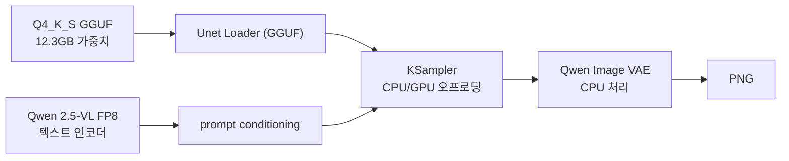
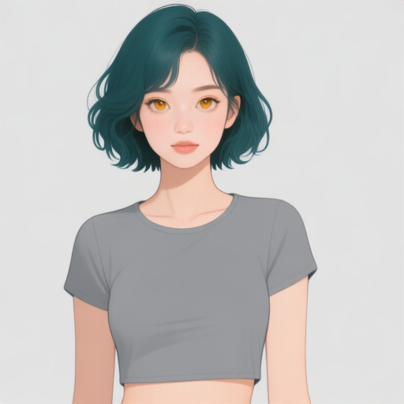

# P7-5.10 Qwen-Image Q4 GGUF로 8GB에서 실행 기록 남기기

> Section ID: `P7-5.10`
> Version: `v2026.08.29`

Q4 GGUF 파일이 12GB인데 8GB GPU에서 실행할 수 있다는 말은 모순처럼 들린다. 여기서 파일 크기는 가중치를 보관하는 데 필요한 공간이고, 실행 중 VRAM은 그 순간 GPU에 올려 둔 가중치·텍스트 인코더·잠재값·작업 버퍼의 합이다. 가중치 일부를 시스템 RAM에 남겨 두고 필요한 블록만 GPU로 옮기는 **오프로딩**을 사용하면, 모델 파일이 VRAM보다 커도 생성은 가능하다. 대신 전송 시간이 생기며, 이것은 “8GB에 모델이 완전히 들어간다”는 뜻이 아니다.

이 절의 중심 질문은 **Q4 양자화 Qwen-Image를 8GB GPU에서 실행했다는 기록을 어떻게 읽고, 어떤 범위까지만 재사용해야 하는가**이다. 한 번의 성공 이미지만 보지 않고 모델 파일, 오프로딩 설정, 입력 크기, step, VRAM 관찰값, 실행 시간, 결과의 용도를 같이 남긴다.

## 1. Q4는 8GB 상주 모델이 아니다

이번 실행에는 Unsloth가 배포한 `qwen-image-Q4_K_S.gguf`를 사용했다. 이 배포판은 Qwen-Image 20B의 GGUF 양자화본이며, `Q4_K_S` 파일 크기는 약 12.3GB다. 따라서 8GB GPU에 전체를 상주시킬 수 없다. [Unsloth Qwen-Image-GGUF](https://huggingface.co/unsloth/Qwen-Image-GGUF){: target="_blank" rel="noopener noreferrer"}

ComfyUI-GGUF는 일반 diffusion-model loader 대신 `Unet Loader (GGUF)`를 제공한다. 이 로더는 양자화된 DiT 가중치를 읽으며, 저VRAM 모드에서는 필요한 부분만 GPU에 올리고 나머지를 오프로딩 장치에 남긴다. [ComfyUI-GGUF 사용 안내](https://github.com/city96/ComfyUI-GGUF){: target="_blank" rel="noopener noreferrer"}

| 구분 | 이번 기록에서 뜻하는 것 | 혼동하면 생기는 문제 |
| --- | --- | --- |
| 모델 파일 크기 | Q4_K_S GGUF 12,268,010,016 bytes | 파일이 8GB보다 크면 실행도 불가능하다고 판단함 |
| GPU VRAM | RTX 5070 Laptop GPU의 8,151MiB | 파일 전체가 항상 VRAM에 있다고 가정함 |
| 오프로딩 | 일부 가중치와 VAE를 CPU/RAM에 둠 | 실행은 되지만 속도·시스템 RAM 조건을 빼고 비교함 |
| 양자화 | 가중치를 낮은 비트 표현으로 저장·계산 | Q4가 character identity를 자동으로 보장한다고 생각함 |

따라서 “Q4가 8GB에서 된다”는 표현에는 최소한 **저VRAM 로더와 CPU 오프로딩을 사용한 단일 작업이 완료됐다**는 조건을 붙여야 한다. 해상도, batch, step, 텍스트 인코더 종류가 바뀌면 VRAM 피크와 실행 시간도 달라진다.

## 2. 실행 경로는 가중치·텍스트·VAE를 분리해 기록한다

이번 실험은 외부 기준 이미지를 넣지 않는 text-to-image(T2I) 경로다. Qwen-Image Q4 GGUF는 이 실행에서 얼굴 참조를 읽는 character-consistency 모델이 아니라, 프롬프트에서 새 인물 이미지를 만드는 확산 transformer 역할을 맡는다. 따라서 이 결과는 “8GB에서 Q4 T2I가 완료되는가”의 근거이지, 기준 토르소 이미지를 넣어 같은 얼굴을 보존한다는 근거는 아니다.



실행 시에는 `--lowvram --cpu-vae`를 사용했다. 텍스트 인코더는 Qwen Image용 FP8 scaled 파일, VAE는 Qwen Image VAE를 사용했다. 이처럼 Q4라는 이름은 transformer 가중치의 양자화만 가리킨다. 텍스트 인코더와 VAE의 형식·배치는 별도로 기록하지 않으면 다른 사람이 같은 “Q4 실행”을 재현할 수 없다.

## 3. 512px·10 step 실행 결과

다음 표는 단일 정면 상체 T2I를 위한 고정 조건이다. 프롬프트는 헤어, 피부, 홍채, 회색 크롭 탑, 배경만 긍정 지시로 짧게 썼다. 이 실험에서는 복잡한 pose·배경·참조 이미지 조건을 의도적으로 넣지 않았다.

| 항목 | 실행값 |
| --- | --- |
| GPU | NVIDIA GeForce RTX 5070 Laptop GPU, 8,151MiB |
| 모델 | `unsloth/Qwen-Image-GGUF` / `qwen-image-Q4_K_S.gguf` |
| 모델 파일 SHA-256 | `2548135d745e022b19e55b83c1a730987eda7e9128860d5bfa625fc0e12944b3` |
| 해상도·batch | 512×512, 1 |
| seed·step·CFG | 62294, 10, 4.0 |
| 저VRAM 설정 | `--lowvram --cpu-vae` |
| sampler 실행 시간 | 88.51초 |
| 스크립트 전체 시간 | 102.04초 |



실행 로그에서는 transformer 약 5.07GB를 GPU에 적재하고 약 6.73GB를 오프로딩한 상태가 기록됐다. 샘플링 중 관찰한 GPU 사용량은 약 6.88GB였으며, 실행이 끝난 뒤에는 약 1.04GB로 돌아왔다. 이 수치는 현재 데스크톱 세션이 이미 쓰고 있는 VRAM을 포함한 관찰값이므로, 다른 GPU나 해상도에 그대로 옮겨 적는 최소 요구사항이 아니다.

실행의 전체 조건과 ComfyUI graph, 모델 해시, 출력 파일명은 [result JSON](../../../assets/part-07/chapter-05/p7-5-9-qwen-image-q4ks-low-vram-front-v1-seed-62294-steps-10-result.json)에 저장했다. [실행 Python 원문](../../../assets/part-07/chapter-05/p7_5_9_qwen_image_gguf_low_vram_probe.py){ .aibook-source-link }은 GGUF·텍스트 인코더·VAE를 ComfyUI 모델 경로에 연결하고, 그래프와 실행 결과를 함께 기록한다.

```bash
.venv/bin/python docs/assets/part-07/chapter-05/p7_5_9_qwen_image_gguf_low_vram_probe.py \
  --size 512 --steps 10 --cfg 4.0 --seed 62294
```

다음 재실행에서는 `--size` 또는 `--steps` 중 하나만 바꾼다. 그 뒤 result JSON의 `elapsed_seconds`, 성공 상태, 출력 이미지를 비교하면, “더 큰 이미지가 가능한가”와 “더 많은 step이 필요한가”를 한꺼번에 섞지 않고 확인할 수 있다.

## 4. 통과한 것은 T2I 실행성이다

생성 결과는 청록 단발, 밝은 피부, 호박색 홍채, 회색 크롭 탑이라는 짧은 프롬프트 조건을 반영했다. 이는 8GB에서 Q4 GGUF T2I가 출력 이미지를 완성할 수 있다는 관찰이다. 그러나 이 한 장으로 다음 주장을 추가하면 안 된다.

| 아직 판단할 수 없는 것 | 이유 |
| --- | --- |
| 기준 토르소와 같은 얼굴을 계속 유지하는가 | 이 T2I graph에는 외부 reference-image 입력이 없다. |
| 1024px·1536px에서도 안정적인가 | 이번 기록은 512px, batch 1 하나만 사용했다. |
| Q4가 FP8 또는 Nunchaku FP4보다 더 좋은가 | 같은 프롬프트·seed·해상도의 대조 실행이 아직 없다. |
| 복잡한 jump pose와 배경에서 의상이 유지되는가 | pose guide, 착장 참조, 배경 조건을 의도적으로 제외했다. |

이 경계는 실패를 숨기기 위한 것이 아니다. Q4 GGUF가 필요한 문제는 “8GB에서 Qwen-Image T2I를 실제로 끝낼 수 있는가”이고, character identity·pose·camera를 유지하는 문제는 별도의 참조 입력과 비교 경로를 필요로 한다. 먼저 실행 가능성을 확인한 뒤에만 다음 실험의 조건을 하나씩 추가할 수 있다.

## 체크리스트

- 모델 파일 크기와 실행 중 VRAM 사용량을 같은 값으로 읽지 않았는가?
- Q4 실행 기록에 GPU, 해상도, batch, step, CFG, 오프로딩 설정, 실행 시간을 함께 남겼는가?
- 결과 JSON에 모델 저장소, 파일 selector, SHA-256, graph와 출력 파일명이 있는가?
- 이 결과가 T2I 실행성의 근거일 뿐, reference-image character consistency의 근거는 아니라는 점을 구분했는가?
- 다음 비교에서는 해상도·step·양자화 수준 가운데 하나만 바꾸고 결과를 비교하는가?

## 출처와 참고 자료

- Unsloth AI, [Qwen-Image-GGUF](https://huggingface.co/unsloth/Qwen-Image-GGUF){: target="_blank" rel="noopener noreferrer"}, 확인일: 2026-08-29.
- city96, [ComfyUI-GGUF](https://github.com/city96/ComfyUI-GGUF){: target="_blank" rel="noopener noreferrer"}, 확인일: 2026-08-29.
