# P7-5.10 보충학습: 캐릭터 일관성을 위한 LoRA 학습과 평가

> Section ID: `P7-5.10`
> Version: `v2026.09.17`

장면이나 입력 인물이 달라져도 Mira를 같은 캐릭터로 알아볼 수 있게 만드는 것이 이번 보충학습의 목표다. 이를 위해 **얼굴·헤어·화풍을 일관되게 표현하는 LoRA**를 학습하고, 실제 편집 결과에서 그 특징이 유지되는지 확인한다. 캐릭터 일관성은 머리색 하나가 같다는 뜻이 아니라 얼굴의 인상, 헤어의 형태, 목표 화풍이 함께 이어지는 것을 뜻한다.

콘셉트는 [5.5에서 사용한 BFS Head V5](section-05.md)의 얼굴·헤어 편집을 참고했다. 이를 Mira에 맞춰 **입력 인물의 얼굴·헤어를 Mira의 외형으로 바꾸고 그림 전체를 목표 화풍으로 표현하는 편집 과제**로 구성한다. 이 절의 ‘BFS LoRA’는 그 참고 관계를 나타내는 이름이다. 데이터셋과 학습 목표는 직접 구성하고 Qwen-Image-Edit-2511에서 새 어댑터를 학습한다.

실습은 **학습용 이미지 생성 → 입력·목표 데이터셋 구성 → LoRA 학습 → 검증 입력 평가 → 출력 결과 검수**로 이어진다. 학습에서 제외한 19쌍으로 변환과 보존을 비교했다. 별도로 준비한 남성·여성·유아 입력 45장의 추가 평가는 중단했으며, 생성된 출력은 삭제하고 입력 자료만 보존했다.

## 빠른 실습: 공개 LoRA를 내려받아 적용한다

편집 결과를 먼저 확인하려면 이미지 생성과 LoRA 학습을 건너뛰고 **공개된 최종 1600스텝 어댑터**를 내려받는다. 약 590MB이며 Apache-2.0 라이선스로 제공한다. LoRA는 기반 모델에 추가하는 가중치이므로 **Qwen-Image-Edit-2511과 추론 환경은 별도로 준비**해야 한다.

[Hugging Face 모델 카드 · 적용 예제와 평가 결과](https://huggingface.co/devchan64/mira-bfs-qwen-image-edit-2511-lora)

[최종 LoRA 바로 다운로드 · mira_bfs.safetensors](https://huggingface.co/devchan64/mira-bfs-qwen-image-edit-2511-lora/resolve/83c28cc630d01f887c401769ab1504fdaa1447a6/mira_bfs.safetensors?download=true)

브라우저에서 위 파일을 받거나, 저장소 루트의 터미널에서 다음 명령으로 내려받는다. 고정 리비전을 사용하므로 본문의 평가에 사용한 가중치와 같은 파일을 받는다.

```bash
mkdir -p .tmp/download/mira-bfs
curl --fail --location \
  'https://huggingface.co/devchan64/mira-bfs-qwen-image-edit-2511-lora/resolve/83c28cc630d01f887c401769ab1504fdaa1447a6/mira_bfs.safetensors' \
  --output .tmp/download/mira-bfs/mira_bfs.safetensors
```

[배포 파일·SHA-256·고정 리비전 JSON](../../../assets/part-07/chapter-05/sec-10/huggingface-release/release.json)

모델 카드의 Diffusers 예제에서 내려받은 폴더를 `load_lora_weights`의 경로로 지정하고, 파일명은 `mira_bfs.safetensors`로 둔다. **512×512 입력 한 장 → Mira로 변환하라는 편집 지시 → LoRA 적용 출력**의 순서로 실습한다. 목표 얼굴 이미지를 별도 참조로 추가하지 않는다.

본문의 평가 조건은 LoRA 강도 1.0, 시드 62294, 추론 20스텝, CFG 4.0, 출력 512×512다. **참조 VAE 처리 크기도 512×512로 맞춘다.** 모델 카드에는 이 설정을 포함한 실행 예제가 있다. 입력과 출력을 나란히 놓고 Mira의 얼굴·헤어·화풍이 나타나는지, 자세·표정·의상·배경이 유지되는지 따로 확인한다. 공개 가중치에도 본문에서 확인한 배경·표정 보존의 한계가 남는다.

적용 결과를 확인했다면 아래에서 같은 어댑터를 만들기 위한 데이터 준비·학습·평가 과정을 따라간다.

## 실습 목표와 LoRA의 역할

### LoRA로 기반 모델에 편집 특징을 더한다

LoRA는 기반 모델의 가중치를 고정하고, 가중치의 변화를 작은 두 행렬의 곱으로 표현하여 학습하는 방법이다. 모델 전체를 다시 학습할 때보다 갱신할 파라미터를 줄인다. 다만 기반 모델도 계산에 참여하므로 모델을 읽고 계산하는 메모리가 모두 없어지는 것은 아니다. 원리는 [LoRA 논문](https://arxiv.org/abs/2106.09685){: target="_blank" rel="noopener noreferrer" }에서 확인할 수 있다.

학습 결과인 어댑터는 학습할 때 사용한 기반 모델에 적용한다. 이번 기반 모델은 **`Qwen/Qwen-Image-Edit-2511`**이다. 목표 이미지를 처음 만든 모델과 어댑터를 학습·적용하는 모델의 역할을 구분한다. 평가에서는 같은 기반 모델에서 어댑터만 켜거나 꺼 변화의 범위를 비교한다.

편집 학습의 한 항목은 **참조 입력·학습 지시·목표 이미지**로 이루어진다. 참조 입력은 바꾸기 전 장면이고, 지시는 바꿀 특징과 보존할 요소를 설명하며, 목표는 학습 중 맞추려는 결과다. 학습 지시의 `mira_person`은 같은 특징을 연결해 반복 사용하는 식별 문구이며, 이 문자열만으로 새로운 전용 토큰이 자동 생성되지는 않는다. 캡션은 원래 생성 의도보다 실제 입력·목표의 대응을 기준으로 적는다.

비슷한 이미지나 같은 목표에서 만든 변형을 학습과 검증 양쪽에 나누면 익숙한 자료의 재현을 일반화로 오해하기 쉽다. 같은 목표의 파생 입력은 같은 분할에 두고, 검증 목표와 그 파생 입력을 학습에서 제외한다. 파일 해시는 자료가 바뀌었는지 확인하는 수단이며, 인물 유사도나 편집 품질의 점수는 아니다.

### 바꿀 외형과 남길 장면을 나눈다

얼굴이 Mira로 바뀌었다고 편집 전체가 성공한 것은 아니다. 입력 인물이 웃고 있었다면 변환 후에도 웃어야 하고, 들고 있던 물건이나 배경의 배치도 이어져야 한다. 화풍은 그림 전체에 적용하되 장면의 내용과 구도를 함께 바꾸라는 뜻은 아니다.

| 구분 | 이번 LoRA에 요구하는 변화 |
| --- | --- |
| 얼굴 | 입력 인물의 이목구비를 Mira의 얼굴 특징으로 변경 |
| 헤어 | 머리색·길이·가르마·윤곽을 Mira의 헤어로 변경 |
| 화풍 | 인물과 배경 전체를 목표의 선·채색·질감으로 표현 |
| 유지할 요소 | 자세·머리 방향·표정·의상 디자인·소품·카메라 구도·배경 대상의 배치 |

예를 들어 도서관에서 정면을 보고 있는 긴 갈색 머리 인물을 입력했다면, 목표는 같은 도서관·자세·표정·의상을 유지하면서 Mira의 얼굴과 헤어, 목표 화풍을 적용한 이미지다. 얼굴 형태가 바뀌는 것과 웃는 정도·입 벌림 같은 표정이 바뀌는 것을 구분해 검수한다.

## 학습용 이미지를 생성한다

### 기존 Mira 목표에서 변환 전 입력을 만든다

편집 학습에서는 시작 이미지와 원하는 결과를 지시문으로 연결한다. Musubi 문서도 제어 이미지를 추론의 시작 이미지, 목표 이미지를 생성하려는 결과로 구분한다. 이 원칙을 적용해 기존 Mira 이미지를 정답으로 고정하고, 그 이미지에서 다른 인물·화풍의 입력 후보를 생성한다.

| 단계 | 출발 이미지 | 도착 이미지 |
| --- | --- | --- |
| 자료 생성 | 기존 Mira 이미지 | 얼굴·헤어·화풍이 다른 입력 후보 |
| LoRA 학습 | 검수한 입력 후보 | 원래의 Mira 이미지 |
| 실제 사용 | 변환할 새 인물·장면 | BFS 특징을 적용한 편집 결과 |

**자료를 생성하는 방향과 LoRA를 학습하는 방향은 반대다.** 생성 도구에 넣은 Mira 이미지는 새 LoRA 학습에서는 목표가 되고, 생성된 다른 인물 이미지는 학습 참조가 된다. 새 입력을 독립적으로 그려 기존 Mira와 임의로 짝짓는 대신, 같은 목표에서 출발해 보존할 장면 요소를 대응시키는 설계다. 이렇게 생성해도 완전한 대응이 보장되지는 않으므로 결과 검수가 필요하다.

후보 생성의 출발점은 Mira 목표 44장이다. 기준·방향 이미지 12장과 추가 생성한 목표 32장을 모아 학습용 목표 40장·검증용 목표 4장으로 나누고, 입력 유형 5종을 적용해 총 220장을 생성하도록 구성했다. 학습용 목표에 대응하는 후보는 200쌍, 검증용 목표에 대응하는 후보는 20쌍이며 아직 채택 수는 아니다. 기존 목표의 분할을 파생 입력에도 적용하고 검증 쌍을 학습에 섞지 않는다. 같은 생성 과정에서 만든 검증 자료이므로 실제 외부 장면에 대한 독립적인 성능 검증을 대신하지 않는다.

### 한 쌍 안에서는 카메라와 구도를 고정한다

**학습 참조와 목표는 같은 시점·구도에서 얼굴·헤어·화풍만 달라져야 한다.** 입력이 눈높이의 정면인데 목표가 위에서 내려다본 사선이면, 두 이미지의 차이에 카메라 변환까지 포함된다. 이번에 요구하는 BFS 변환과 구도 보존을 분리하기 어려운 쌍이므로 채택하지 않는다. 이 고정 조건은 각 입력·목표 쌍에 적용한다. 서로 다른 쌍 사이에는 정면·측면·고각도·저각도 등 여러 구도가 있을 수 있다.

같은 ‘우측 사선’이라는 이름만으로 구도가 같다고 판단하지 않는다. 카메라 높이와 원근, 인물이 화면에서 차지하는 크기, 위치와 잘린 범위까지 비교한다. 2D 생성 이미지에서 실제 초점거리나 카메라 좌표가 같음을 확인할 수는 없으므로, 이미지에 나타난 공간 배치를 검수 기준으로 삼는다.

| 검수할 요소 | 입력과 목표에서 유지할 대응 |
| --- | --- |
| 시점·원근 | 내려다보거나 올려다보는 정도, 머리·몸의 보이는 면, 배경의 수평선·원근 |
| 프레이밍 | 화면비, 인물의 중심 위치와 몸 크기, 몸이 잘린 범위 |
| 자세·표정 | 어깨·몸통·손의 위치, 머리 방향, 시선과 입 벌림 |
| 장면 배치 | 의상 디자인, 소품·배경 물건의 위치와 앞뒤 가림 관계 |

원본 해상도가 다르면 같은 캔버스 크기로 맞춰 나란히 보거나 겹쳐 비교한다. 어깨·몸통·손과 배경의 고정 지점을 기준으로 확대·이동·재구도가 발생했는지 확인한다. 얼굴 형태와 머리카락 윤곽은 바꿀 대상이므로 모든 얼굴 점이나 머리 외곽선을 픽셀 단위로 일치시키지는 않는다. 화풍에 따른 선·질감 변화와 공간 배치의 이동을 구분한다. 허용 오차의 수치 기준은 아직 검증하지 않았다.

생성 지시에는 카메라·원근·인물 위치·몸 크기를 유지하고 확대·크롭·재구도·카메라 회전을 하지 않도록 명시했다. 지시를 넣었다는 사실이 보존 성공을 뜻하지는 않는다. 구도가 달라진 후보는 채택하지 않는다. 사용자 확정 폐기 항목은 재생성 제외 목록에 따라 다시 생성하지 않는다.

### 입력 후보의 외형과 화풍을 다양하게 만든다

생성 목록에는 서로 다른 얼굴 형태·눈 색·머리 길이·머리색과 함께 사진풍, 수채화, 점토 같은 3D 표현, 컬러 펜화, 유화의 다섯 입력 유형을 배치했다. 이는 변환 전 입력의 폭을 확보하기 위한 후보 구성이다. 다섯 유형이 충분하거나 최적이라고 검증한 것은 아니다.

생성 지시는 바꿀 얼굴·헤어·화풍을 설명하고, 자세·머리 방향·시선·표정·입 벌림·의상·구도·배경 배치를 유지하도록 요구한다. 화풍을 바꾸면서 선과 질감은 달라질 수 있지만, 인물의 동작이나 배경 물건까지 달라진 결과는 그대로 학습에 넣지 않는다.

완료된 자산은 `sec-10`으로 옮기고 파일명의 Section 번호를 `p7-5-10`·`p7_5_10`으로 맞췄다. 생성 조건·원본 기록·완료 평가 계획 안의 과거 경로와 `P711-IN`·`P711-TGT` 관리번호는 실행 이력과 해시 검증을 위해 보존한다. 경로 해석 보조 코드는 이관 목록을 통해 현재 파일을 찾으며, 후보 카탈로그와 본문 링크는 현재 경로를 사용한다.

[이관 전 기록의 자산 경로 해석 Python](../../../assets/part-07/chapter-05/sec-10/p7_5_10_asset_paths.py)

[기존 입력 후보 220장 생성 원본 JSON](../../../assets/part-07/chapter-05/sec-10/p7-5-10-bfs-input-pool-v2.json)

목록의 `reference`는 **입력 후보를 생성할 때 사용하는 Mira 목표**를 가리킨다. 생성 카탈로그의 `image`는 생성된 입력 후보 경로, `training_target`은 원래 Mira 목표 경로다. `prompt`는 자료 생성 지시이고, `training_caption`은 반대 방향인 BFS 변환을 학습할 지시다. 두 문구를 바꾸어 쓰지 않는다.

입력·목표 후보는 아래 공용 생성 코드 하나를 사용한다. `--job` JSON으로 생성 목록과 저장 경로를 지정하며, 폐기 정책은 생성 목록의 해시로 자동 연결한다. `--selection` JSON의 `include_ids`·`exclude_ids`로 이번 출력 대상을 좁힐 수 있고, 완료 이미지는 재생성하지 않는다.

[이미지 순차 생성 Python](../../../assets/part-07/chapter-05/sec-10/p7_5_10_generate_supplements.py)

[입력 후보 조건 조합 JSON](../../../assets/part-07/chapter-05/sec-10/p7-5-10-bfs-input-combinations-v1.json)

현재 실행은 `components`에 방향·얼굴·화풍·배경과 보존 조건을 정의하고, `items`에서 각 후보의 조건 ID를 선택하는 공통 구조를 사용한다. `prompt_order`에 따라 문구를 조합한다. 기존 입력 220개의 조합은 생성 당시 프롬프트·시드·참조와 정확히 일치하는지 확인한 뒤 폐기 27개를 제외한다. 입력에서는 목표의 배경과 방향을 유지하고, 목표 후보를 만들 때 배경 조건을 변경한다. 당시 평문 목록과 생성 기록은 해시 검증을 위해 보존한다.

[15방향 토르소를 활용한 얼굴 비율 보강 계획](../../../assets/part-07/chapter-05/sec-10/bfs-proportion-generation.md){ .aibook-markdown-preview }

보강 계획은 5.2의 15방향 토르소에 얼굴 조건 6종·화풍 2종을 조합한 180개 입력 후보이며 아직 생성하지 않았다. 같은 생성기를 사용하고, 생성 후 입력·목표의 얼굴 비율 차이와 표정·배경 보존을 검수한다.


원래 220개 생성 조건은 보존한다. 얼굴 방향 3건·배경 손실 및 변경 5건·표정 불일치 19건을 합한 폐기 확정 27건은 아래 명령에서 제외되어 실행 대상은 193개다. `--dry-run`으로 제외 ID를 확인할 수 있다.

[재생성 제외 목록 JSON](../../../assets/part-07/chapter-05/sec-10/p7-5-10-input-generation-exclusions.json)

[입력 생성 실행 설정 JSON](../../../assets/part-07/chapter-05/sec-10/p7-5-10-input-generation-job.json)

```bash
.venv/bin/python docs/assets/part-07/chapter-05/sec-10/p7_5_10_generate_supplements.py \
  --job docs/assets/part-07/chapter-05/sec-10/p7-5-10-input-generation-job.json \
  --dry-run
```

`--dry-run`은 참조와 완료 이미지의 해시를 확인하고, 폐기·완료 항목을 제외한 실제 생성 대상을 출력한다. 현재 입력 193개가 모두 존재하면 생성 대상은 0개다. 실제 생성은 사용 중인 GPU 작업과 겹치지 않는 시점에 이 옵션을 빼고 실행한다. 설정은 Qwen-Image-Edit-2511, 1024×1024, 20스텝, CFG 4.0이며 추가 LoRA는 적용하지 않는다. 각 후보는 해당 Mira 목표에서 독립적으로 생성한다.

생성 코드는 PNG·생성 기록과 후보 카탈로그를 기록한다. 완료 항목은 해시를 확인하고 건너뛰며, 학습 목록은 쌍 검수 후 별도로 구성한다. 검수 판단을 생성 카탈로그와 분리하여 생성 재개 시 덮어쓰지 않는다. 생성 완료는 채택을 뜻하지 않으며 BFS 변환 LoRA는 아래 확정 목록으로 1600스텝 학습을 마쳤으며 검증 19쌍의 편집 평가와 시각 검수를 마쳤다. 완료된 학습용 이미지의 생성·선택 Python과 생성 조건 JSON, 후보 이미지·생성 기록은 `sec-10/`에서 관리한다. 진행 중인 45장 평가의 입력·출력 폴더, 평가·비교표 코드와 기준 데이터셋 JSON은 실행 경로와 지문 보존을 위해 `sec-12/`에 남긴다. 폐기 27건을 제외한 참조 입력 후보 193장과 생성 기록은 `sec-10/input-images/`, 추가 Mira 목표 후보는 `sec-10/target-images/`에서 관리한다. 생성된 후보와 학습에 채택한 자료는 구분한다.

[참조 입력 후보 193장 카탈로그 JSON](../../../assets/part-07/chapter-05/sec-10/input-images/candidate-catalog.json)

[입력 후보 193개 비교표 Markdown](../../../assets/part-07/chapter-05/sec-10/input-candidate-comparison.md){ .aibook-markdown-preview }

비교표에는 각 입력과 Mira 목표를 나란히 배치하고, 원래 생성 순번에 고정한 `P711-IN-NNN` 관리번호를 부여했다. 기존 AI 검수 기록은 실험용 채택 2개와 확대 검수 보류 191개를 남긴 이력이다. 이후 사용자 채택 판단에서 폐기 27건을 제외하여 아래 193쌍 데이터셋을 확정했다. 후보 생성 기록과 최종 학습 목록의 역할을 구분하고, 관리번호는 그대로 유지한다.

전체 후보를 원고에 펼치지 않고, 같은 Mira 목표에서 생성한 입력 변형 3장만 예로 든다. 생성 방향은 **Mira 목표 → 다른 인물·화풍의 입력 후보**, 학습 방향은 그 반대다. 아래는 확정 데이터셋에 포함된 입력 변형을 보여 주는 샘플이다.

| 공통 Mira 목표 | 사진풍 입력 후보 | 수채화 입력 후보 | 컬러 펜화 입력 후보 |
| --- | --- | --- | --- |
| { width="240" } | { width="240" } | { width="240" } | { width="240" } |

얼굴·헤어·화풍의 변화와 구도·표정·의상 보존은 별도로 살핀다. 후보가 생성되었다는 이유만으로 대응 관계가 맞다고 간주하지 않으며, 전체 후보의 경로와 해시는 위 카탈로그에서 확인한다.

## 검수한 입력·목표 쌍으로 데이터셋을 구성한다

### 두 이미지가 같은 편집 과제를 이루는지 검수한다

검수는 두 방향으로 한다. 먼저 새 입력의 얼굴·헤어·화풍이 기존 Mira와 실제로 달라졌는지 본다. 다음으로 유지하려던 자세·표정·의상·구도·장면 배치가 목표와 대응하는지 본다. 다른 얼굴을 만들었지만 팔 위치나 의상이 바뀌었다면 얼굴·헤어·화풍 변환만을 가르치는 쌍으로 채택하기 어렵다.

목표 이미지도 다시 검토한다. 기준 인물의 외형이 맞는다는 사실만으로 그림 전체의 Mira 목표 화풍을 가르칠 정답으로 적합한 것은 아니다. 목표 사이의 선·채색·질감이 일관되는지, 배경까지 원하는 화풍인지 확인한다. 보류된 쌍은 예정 수량을 맞추기 위해 자동으로 학습에 넣지 않는다.

검수한 쌍에는 입력·목표 경로와 해시, 분할, 학습 지시, 채택 이유를 기록한다. 생성 목록의 `training_caption`은 초안이며 검수 결과와 맞춰 확정한다. 다음은 그 지시의 의미다.

> 인물을 Mira의 얼굴과 헤어로 바꾸고, 그림 전체에 Mira의 목표 화풍을 적용한다. 자세·머리 방향·표정·의상 디자인·구도·장면 배치는 유지한다.

[후보 검수 목록·데이터셋 선택 Python](../../../assets/part-07/chapter-05/sec-10/p7_5_10_select_candidates.py)

`review-template`·`export` 명령에 입력 후보 카탈로그를 지정한다. 선택 결과는 `control_image`에 생성한 다른 인물 이미지, `image`에 원래 Mira 목표를 기록한다. 같은 목표의 모든 파생본은 같은 분할에 두고 기존 검증 목표를 학습으로 옮기지 않는다. 입력 후보 220개는 목표 장면 220개가 아니라 **44개 목표의 변형**이다.

### 학습 174쌍·검증 19쌍을 확정한다

사용자 채택 판단에서 확정 폐기 27건을 제외하여 **학습 174쌍·검증 19쌍**을 구성했다. 중복을 제외한 Mira 목표는 학습 37장·검증 4장으로 총 41장이다. 193쌍은 서로 다른 목표 장면 193장을 뜻하지 않는다. 추가로 생성한 목표 후보 123장은 대응 입력이 아직 없어 포함하지 않는다.

[입력·목표 193쌍 학습·검증 비교표](../../../assets/part-07/chapter-05/sec-10/bfs-paired-dataset-review.md){ .aibook-markdown-preview }

[입력·목표 193쌍 데이터셋 JSON](../../../assets/part-07/chapter-05/sec-12/p7-5-11-bfs-paired-dataset-v1.json)

## 확정 데이터셋으로 LoRA를 학습한다

이번에는 생성 조건 목록이 아니라 위의 **확정 데이터셋 JSON**을 준비 코드에 넘긴다. `purpose`가 `paired_edit_training`이면 각 행의 `control_image`를 입력으로, `image`를 목표로 고정한다. 같은 행에 지정한 입력·목표 대응을 유지한다. 입력·목표와 생성 기록의 해시, 중복 입력, 같은 목표가 학습과 검증에 함께 들어가는 오류를 검사한다.

[고정 입력·목표 대응을 지원하는 학습 준비·실행 Python](../../../assets/part-07/chapter-05/sec-10/p7_5_10_mira_lora.py)

[BFS LoRA 첫 비교 실행 설정 JSON](../../../assets/part-07/chapter-05/sec-10/p7-5-10-bfs-lora-config.json)

학습 설정에서 `rank`는 LoRA의 작은 행렬이 표현할 변화의 차원이고, `alpha`는 그 변화량의 스케일을 정하는 데 쓰인다. 학습률은 한 번 갱신할 때의 변화 크기, 스텝은 가중치 갱신 횟수다. 추론 때의 LoRA 강도는 학습된 변화를 얼마나 적용할지 정하므로 학습률과 구분한다. 한 번에 여러 설정을 바꾸기보다 같은 검증 입력에서 바꾼 항목의 영향을 비교한다.

8GB GPU에서는 잠재표현·조건 임베딩 캐시, gradient checkpointing, 일부 블록의 CPU 이동, 기반 가중치의 FP8 처리를 사용했다. 이들은 계산·메모리 사용 방식을 조절하며 학습 목표를 대신하지 않는다. 목표 해상도와 참조의 VAE·시각언어 인코더 처리 크기를 별도로 확인한다. 모델 다운로드·해시 검증은 저장소의 모델 관리 도구로 수행하고 `.tmp/download/`의 기존 파일을 사용한다. 학습 전용 환경의 의존성은 저장소 `requirements.txt` 안내를 따른다.

첫 비교 설정은 아래 실행 환경에서 해상도 512, rank·alpha 16, 학습률 0.0001, 배치 크기 1, 최대 1600스텝, 400스텝마다 저장으로 둔다. 이는 충분한 학습량을 확정한 값이 아니다. 한 스텝에 한 쌍을 사용하므로 1600스텝은 학습 174쌍을 평균 약 9.2회 사용하는 양이며, **장당 1600스텝이 아니다**. 입력 유형별 보존 품질과 Mira 변환 정도를 확인하고 다음 실행의 학습량을 조정한다.

저장소 루트에서 다음 명령을 실행한다. 패키지 경로는 실행마다 새 이름을 사용한다.

```bash
.venv/bin/python docs/assets/part-07/chapter-05/sec-10/p7_5_10_mira_lora.py prepare \
  --manifest docs/assets/part-07/chapter-05/sec-12/p7-5-11-bfs-paired-dataset-v1.json \
  --config docs/assets/part-07/chapter-05/sec-10/p7-5-10-bfs-lora-config.json \
  --output .tmp/p7-5-12/bfs-paired-v2
```

출력 패키지의 `train.jsonl`에는 174쌍, `validation.jsonl`에는 19쌍이 기록된다. 학습용 `dataset.toml`은 `train.jsonl`만 읽고, 검증 쌍은 별도 편집 평가에 사용한다. 원본 이미지와 학습 설정은 `sec-10/`, 진행 중 평가가 읽는 확정 데이터셋 목록은 `sec-12/`, 실행 패키지·캐시·체크포인트는 `.tmp/p7-5-12/`에 둔다.

같은 Mira 목표에 서로 다른 입력이 대응하므로, 원본 목표 파일명만으로 캐시를 만들면 쌍들이 같은 캐시를 덮어쓸 수 있다. 준비 코드는 `paired-targets/`에 쌍 ID를 이름으로 갖는 원본 연결을 만든다. 이미지를 복제하지 않으면서 각 입력에 대응하는 캐시 이름을 분리하고, 연결된 목표의 해시도 패키지 검사에 포함한다.

다음 명령은 캐시 생성과 학습 명령을 **계획으로 출력**한다. `--trainer`는 고정 커밋 `e0cbd8f3dfe38365b10f8bc790b980f8894e8ba1`의 Musubi 경로, `--python`은 기존 학습 전용 가상환경이다. 로컬 경로가 다르면 설치 위치에 맞춘다.

```bash
.venv/bin/python docs/assets/part-07/chapter-05/sec-10/p7_5_10_mira_lora.py run \
  --package .tmp/p7-5-12/bfs-paired-v2 \
  --trainer /tmp/p7511-musubi \
  --python .tmp/p7-5-11/musubi-venv/bin/python
```

실제 실행에는 위 명령에 `--execute`를 추가한다. 실행 코드는 모델 파일 해시와 학습기 버전·환경을 확인한 뒤 잠재표현 캐시 → 텍스트·입력 조건 캐시 → LoRA 학습 순서로 진행한다. 출력 이름은 `mira_bfs`이며 다른 LoRA를 이어 학습하지 않고 Qwen-Image-Edit-2511에서 새 어댑터를 학습한다. 학습 174쌍으로 1600스텝 실행을 마쳤으며, 400·800·1200·1600스텝 LoRA와 재개 상태, 최종 LoRA·종료 상태가 저장되었다. 학습 완료가 편집 품질 검증을 뜻하지는 않는다.

## 검증 입력으로 평가 이미지를 생성한다

현재 평가는 기존 Mira 목표에서 파생된 검증 입력 **19쌍**을 사용한다. 각 입력에 LoRA 미적용·최종 1600스텝 적용(강도 1.0)을 비교하여 총 38장을 생성했다. 입력과 참조 VAE 처리 크기를 모두 학습과 같은 512×512로 맞추고 동일 캡션·시드 62294·추론 20스텝·CFG 4.0을 사용한다. 모델에는 `control_image` 한 장만 전달하며 Mira 목표는 비교용으로만 남긴다. 이 검증은 학습에서 제외한 쌍의 편집 성능을 보는 것이며, 독립적으로 수집한 외부 장면 평가는 아니다.

[검증 입력 19쌍의 BFS 편집 평가 Python](../../../assets/part-07/chapter-05/sec-12/p7_5_12_evaluate_bfs.py)

[1600스텝 미적용·적용 평가 조건 JSON](../../../assets/part-07/chapter-05/sec-10/bfs-evaluation-control512/plan.json)

최초 평가는 내부 참조 VAE가 1024×1024인 반면 학습·출력은 512×512여서 처리 조건이 달랐다. 적용 결과의 확대·잘림을 확인한 뒤 기존 결과를 사용자 요청으로 폐기하고, 참조 VAE 크기를 512×512로 맞춰 38장을 다시 생성했다. 모든 결과 기록에서 실제 전처리 크기와 이미지 해시를 확인했다.

## 출력 결과에서 변환과 보존을 검수한다

[1600스텝 편집 평가 검수 JSON](../../../assets/part-07/chapter-05/sec-10/bfs-evaluation-control512/review.json)

**입력·목표 쌍을 구성하고, BFS LoRA를 학습한 뒤 Qwen-Image-Edit-2511의 어댑터로 적용하여 편집 변화를 확인한다는 실습 목표는 달성했다.** 전체 19쌍의 비교에서 Mira의 얼굴·청록 단발과 목표 쪽 일러스트 화풍이 나타났다. 미적용 결과에서는 입력의 머리색·길이·화풍이 남거나 목표와 다른 외형으로 바뀌는 사례가 있었고, LoRA를 적용하면 Mira 특징으로 모이는 변화를 확인할 수 있었다.

아래는 검증 입력 19쌍 전체의 **입력·미적용·적용·목표** 비교다. 관리번호별로 네 이미지를 나란히 놓고 관찰 내용을 덧붙였다. 모델에는 왼쪽 입력 한 장만 전달했고, 오른쪽 Mira 목표는 비교용이다. 이미지를 클릭하면 현재 페이지에서 확대하여 확인할 수 있다.

### P711-IN-019 · bfs-input-19-ink-illustration

| 입력 | LoRA 미적용 | LoRA 적용 · 1600스텝 | Mira 목표 · 비교 전용 |
| --- | --- | --- | --- |
| [](../../../assets/part-07/chapter-05/sec-10/input-images/bfs-input-19-ink-illustration.png) | [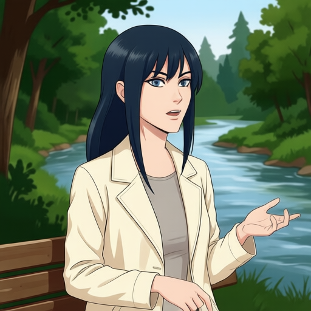](../../../assets/part-07/chapter-05/sec-10/bfs-evaluation-control512/bfs-input-19-ink-illustration-base.png) | [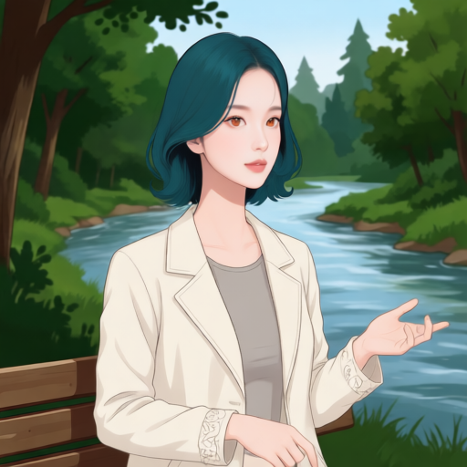](../../../assets/part-07/chapter-05/sec-10/bfs-evaluation-control512/bfs-input-19-ink-illustration-lora.png) | [](../../../assets/part-07/chapter-05/sec-10/validation/images/p7-5-10-mira-v2-evaluation-02.png) |

강·벤치와 손을 든 자세는 남는다. Mira 단발·얼굴은 나타나지만 열린 입이 거의 닫히고 소매 끝 장식이 추가된다.

### P711-IN-020 · bfs-input-20-oil-painting

| 입력 | LoRA 미적용 | LoRA 적용 · 1600스텝 | Mira 목표 · 비교 전용 |
| --- | --- | --- | --- |
| [](../../../assets/part-07/chapter-05/sec-10/input-images/bfs-input-20-oil-painting.png) | [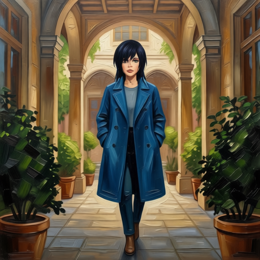](../../../assets/part-07/chapter-05/sec-10/bfs-evaluation-control512/bfs-input-20-oil-painting-base.png) | [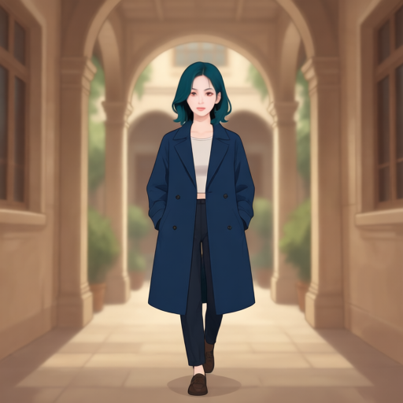](../../../assets/part-07/chapter-05/sec-10/bfs-evaluation-control512/bfs-input-20-oil-painting-lora.png) | [](../../../assets/part-07/chapter-05/sec-10/validation/images/p7-5-10-mira-v2-evaluation-04.png) |

전신은 화면 안에 유지된다. 양옆 화분·식물이 사라지고 회랑 구조가 단순해진다. 입력의 크게 열린 입도 유지되지 않는다.

### P711-IN-021 · bfs-input-21-soft-photo

| 입력 | LoRA 미적용 | LoRA 적용 · 1600스텝 | Mira 목표 · 비교 전용 |
| --- | --- | --- | --- |
| [](../../../assets/part-07/chapter-05/sec-10/input-images/bfs-input-21-soft-photo.png) | [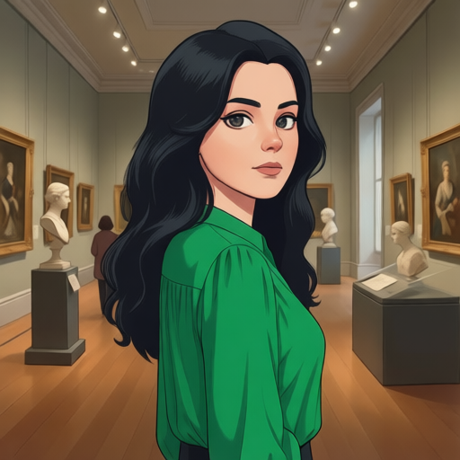](../../../assets/part-07/chapter-05/sec-10/bfs-evaluation-control512/bfs-input-21-soft-photo-base.png) | [](../../../assets/part-07/chapter-05/sec-10/bfs-evaluation-control512/bfs-input-21-soft-photo-lora.png) | [](../../../assets/part-07/chapter-05/sec-10/validation/images/p7-5-10-mira-v2-evaluation-05.png) |

초록 상의와 돌아보는 자세, 미술관의 그림·조각·방문객 배치가 대체로 남는다. 얼굴과 단발은 목표 쪽으로 바뀐다. 배경 세부는 단순해진다.

### P711-IN-022 · bfs-input-22-watercolor

| 입력 | LoRA 미적용 | LoRA 적용 · 1600스텝 | Mira 목표 · 비교 전용 |
| --- | --- | --- | --- |
| [](../../../assets/part-07/chapter-05/sec-10/input-images/bfs-input-22-watercolor.png) | [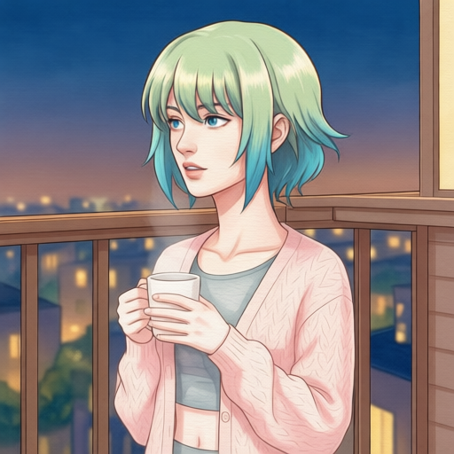](../../../assets/part-07/chapter-05/sec-10/bfs-evaluation-control512/bfs-input-22-watercolor-base.png) | [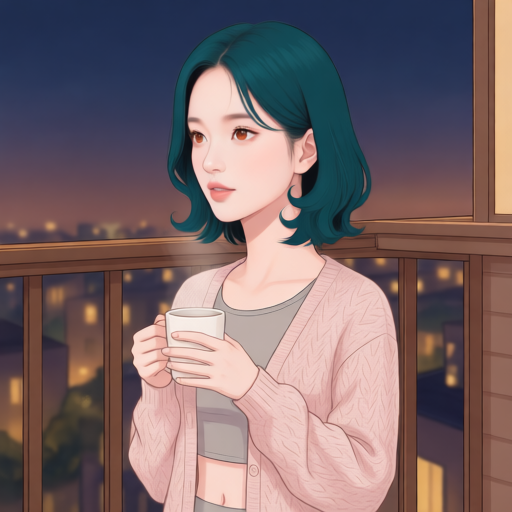](../../../assets/part-07/chapter-05/sec-10/bfs-evaluation-control512/bfs-input-22-watercolor-lora.png) | [](../../../assets/part-07/chapter-05/sec-10/validation/images/p7-5-10-mira-v2-evaluation-06.png) |

컵을 쥔 양손과 창가 구도가 남는다. 머리는 목표의 단발·색으로 바뀌고 입 벌림은 줄어든다. 창·의상 세부는 별도 확대 확인 대상이다.

### P711-IN-063 · bfs-input-19-oil-painting

| 입력 | LoRA 미적용 | LoRA 적용 · 1600스텝 | Mira 목표 · 비교 전용 |
| --- | --- | --- | --- |
| [](../../../assets/part-07/chapter-05/sec-10/input-images/bfs-input-19-oil-painting.png) | [](../../../assets/part-07/chapter-05/sec-10/bfs-evaluation-control512/bfs-input-19-oil-painting-base.png) | [](../../../assets/part-07/chapter-05/sec-10/bfs-evaluation-control512/bfs-input-19-oil-painting-lora.png) | [](../../../assets/part-07/chapter-05/sec-10/validation/images/p7-5-10-mira-v2-evaluation-02.png) |

유화 질감이 목표 쪽 채색으로 바뀌고 강·벤치·팔 자세는 남는다. 크게 열린 입이 닫혀 표정 보존은 미흡하다.

### P711-IN-064 · bfs-input-20-soft-photo

| 입력 | LoRA 미적용 | LoRA 적용 · 1600스텝 | Mira 목표 · 비교 전용 |
| --- | --- | --- | --- |
| [](../../../assets/part-07/chapter-05/sec-10/input-images/bfs-input-20-soft-photo.png) | [](../../../assets/part-07/chapter-05/sec-10/bfs-evaluation-control512/bfs-input-20-soft-photo-base.png) | [](../../../assets/part-07/chapter-05/sec-10/bfs-evaluation-control512/bfs-input-20-soft-photo-lora.png) | [](../../../assets/part-07/chapter-05/sec-10/validation/images/p7-5-10-mira-v2-evaluation-04.png) |

전신과 코트 윤곽은 남지만 회랑·화분·식물 대부분이 밝은 단색 배경으로 사라진다. 장면 보존 실패가 뚜렷하다.

### P711-IN-066 · bfs-input-22-clay-render

| 입력 | LoRA 미적용 | LoRA 적용 · 1600스텝 | Mira 목표 · 비교 전용 |
| --- | --- | --- | --- |
| [](../../../assets/part-07/chapter-05/sec-10/input-images/bfs-input-22-clay-render.png) | [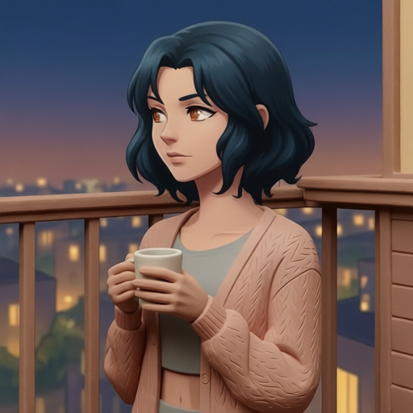](../../../assets/part-07/chapter-05/sec-10/bfs-evaluation-control512/bfs-input-22-clay-render-base.png) | [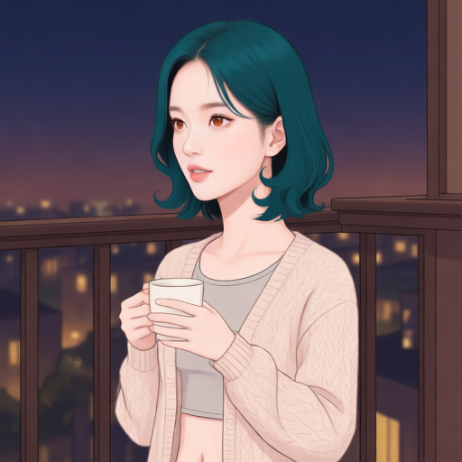](../../../assets/part-07/chapter-05/sec-10/bfs-evaluation-control512/bfs-input-22-clay-render-lora.png) | [](../../../assets/part-07/chapter-05/sec-10/validation/images/p7-5-10-mira-v2-evaluation-06.png) |

입력의 입체적 질감이 목표 쪽 일러스트로 바뀐다. 컵·손·창가 구도는 대체로 남지만 입 벌림이 줄어든다.

### P711-IN-107 · bfs-input-19-soft-photo

| 입력 | LoRA 미적용 | LoRA 적용 · 1600스텝 | Mira 목표 · 비교 전용 |
| --- | --- | --- | --- |
| [](../../../assets/part-07/chapter-05/sec-10/input-images/bfs-input-19-soft-photo.png) | [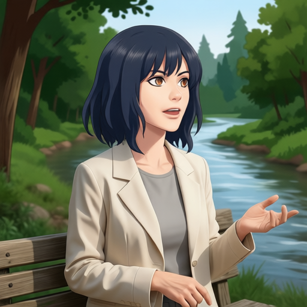](../../../assets/part-07/chapter-05/sec-10/bfs-evaluation-control512/bfs-input-19-soft-photo-base.png) | [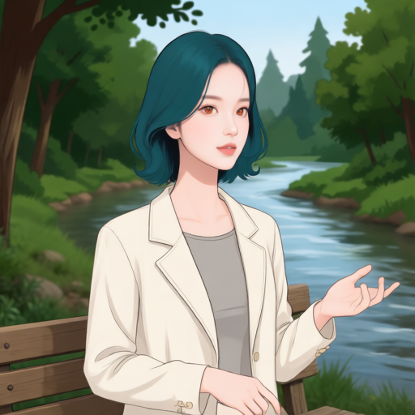](../../../assets/part-07/chapter-05/sec-10/bfs-evaluation-control512/bfs-input-19-soft-photo-lora.png) | [](../../../assets/part-07/chapter-05/sec-10/validation/images/p7-5-10-mira-v2-evaluation-02.png) |

사진풍 얼굴·곱슬머리가 Mira 얼굴·단발로 바뀐다. 강·벤치·손짓은 남지만 입 벌림과 손가락 세부가 달라진다.

### P711-IN-108 · bfs-input-20-watercolor

| 입력 | LoRA 미적용 | LoRA 적용 · 1600스텝 | Mira 목표 · 비교 전용 |
| --- | --- | --- | --- |
| [](../../../assets/part-07/chapter-05/sec-10/input-images/bfs-input-20-watercolor.png) | [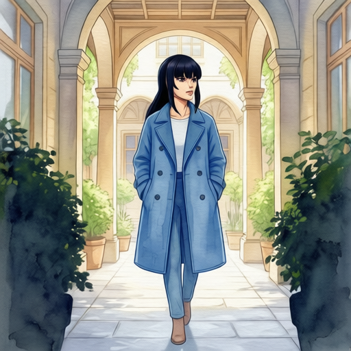](../../../assets/part-07/chapter-05/sec-10/bfs-evaluation-control512/bfs-input-20-watercolor-base.png) | [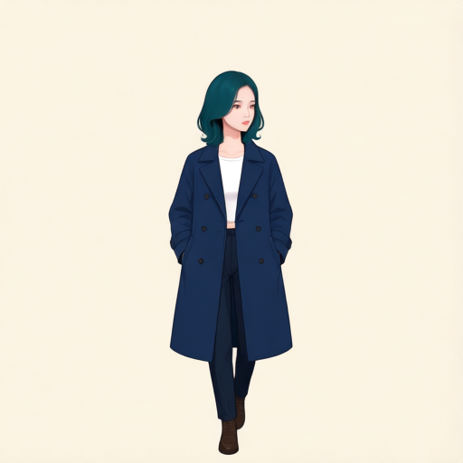](../../../assets/part-07/chapter-05/sec-10/bfs-evaluation-control512/bfs-input-20-watercolor-lora.png) | [](../../../assets/part-07/chapter-05/sec-10/validation/images/p7-5-10-mira-v2-evaluation-04.png) |

인물의 전신 범위는 유지되지만 회랑과 식물이 밝은 단색 배경으로 사라진다. 머리 방향은 대체로 남으나 배경 보존은 실패한다.

### P711-IN-109 · bfs-input-21-clay-render

| 입력 | LoRA 미적용 | LoRA 적용 · 1600스텝 | Mira 목표 · 비교 전용 |
| --- | --- | --- | --- |
| [](../../../assets/part-07/chapter-05/sec-10/input-images/bfs-input-21-clay-render.png) | [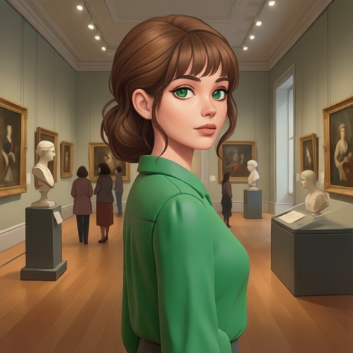](../../../assets/part-07/chapter-05/sec-10/bfs-evaluation-control512/bfs-input-21-clay-render-base.png) | [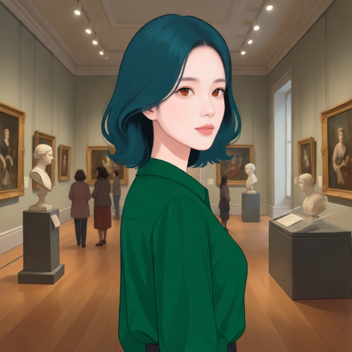](../../../assets/part-07/chapter-05/sec-10/bfs-evaluation-control512/bfs-input-21-clay-render-lora.png) | [](../../../assets/part-07/chapter-05/sec-10/validation/images/p7-5-10-mira-v2-evaluation-05.png) |

점토풍 인물이 목표 쪽 일러스트로 변한다. 초록 상의·어깨 방향·미술관의 큰 배치는 남는다. 입·시선의 세밀한 일치는 보류한다.

### P711-IN-110 · bfs-input-22-ink-illustration

| 입력 | LoRA 미적용 | LoRA 적용 · 1600스텝 | Mira 목표 · 비교 전용 |
| --- | --- | --- | --- |
| [](../../../assets/part-07/chapter-05/sec-10/input-images/bfs-input-22-ink-illustration.png) | [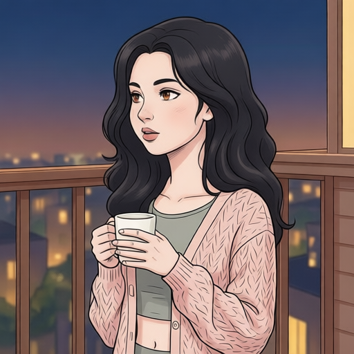](../../../assets/part-07/chapter-05/sec-10/bfs-evaluation-control512/bfs-input-22-ink-illustration-base.png) | [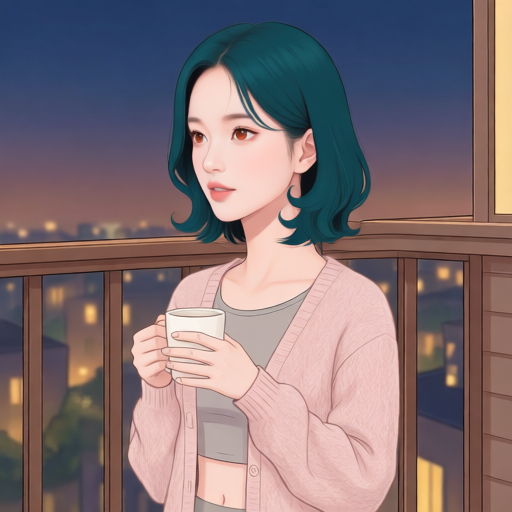](../../../assets/part-07/chapter-05/sec-10/bfs-evaluation-control512/bfs-input-22-ink-illustration-lora.png) | [](../../../assets/part-07/chapter-05/sec-10/validation/images/p7-5-10-mira-v2-evaluation-06.png) |

긴 곱슬머리에서 Mira 단발로 바뀐다. 컵과 창가 구도는 남지만 열린 입이 작아지고 의상 선·질감이 단순해진다.

### P711-IN-151 · bfs-input-19-watercolor

| 입력 | LoRA 미적용 | LoRA 적용 · 1600스텝 | Mira 목표 · 비교 전용 |
| --- | --- | --- | --- |
| [](../../../assets/part-07/chapter-05/sec-10/input-images/bfs-input-19-watercolor.png) | [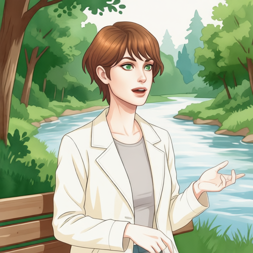](../../../assets/part-07/chapter-05/sec-10/bfs-evaluation-control512/bfs-input-19-watercolor-base.png) | [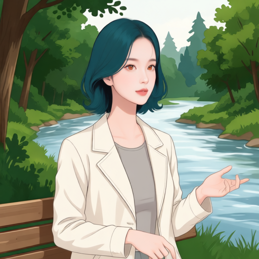](../../../assets/part-07/chapter-05/sec-10/bfs-evaluation-control512/bfs-input-19-watercolor-lora.png) | [](../../../assets/part-07/chapter-05/sec-10/validation/images/p7-5-10-mira-v2-evaluation-02.png) |

Mira 얼굴·헤어로 바뀌며 강·벤치·손짓이 남는다. 입력의 크게 열린 입이 닫혀 표정 변화가 분명하다.

### P711-IN-152 · bfs-input-20-clay-render

| 입력 | LoRA 미적용 | LoRA 적용 · 1600스텝 | Mira 목표 · 비교 전용 |
| --- | --- | --- | --- |
| [](../../../assets/part-07/chapter-05/sec-10/input-images/bfs-input-20-clay-render.png) | [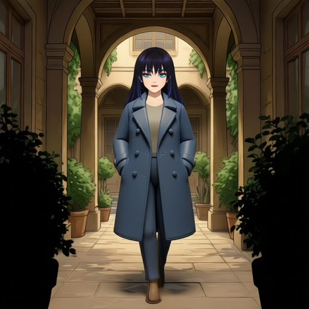](../../../assets/part-07/chapter-05/sec-10/bfs-evaluation-control512/bfs-input-20-clay-render-base.png) | [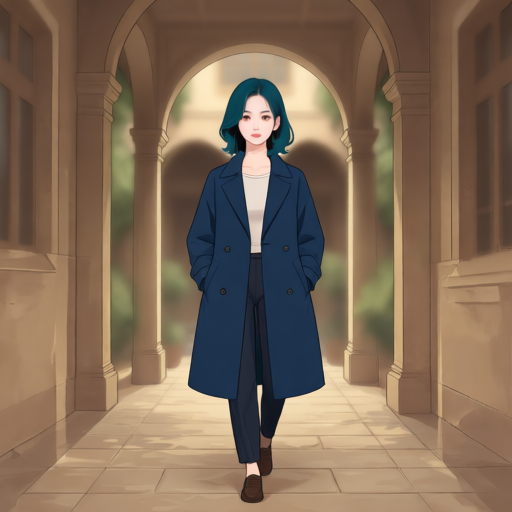](../../../assets/part-07/chapter-05/sec-10/bfs-evaluation-control512/bfs-input-20-clay-render-lora.png) | [](../../../assets/part-07/chapter-05/sec-10/validation/images/p7-5-10-mira-v2-evaluation-04.png) |

전신 범위는 유지되지만 양옆 큰 식물이 사라지고 회랑이 단순해진다. 열린 입도 유지되지 않는다.

### P711-IN-153 · bfs-input-21-ink-illustration

| 입력 | LoRA 미적용 | LoRA 적용 · 1600스텝 | Mira 목표 · 비교 전용 |
| --- | --- | --- | --- |
| [](../../../assets/part-07/chapter-05/sec-10/input-images/bfs-input-21-ink-illustration.png) | [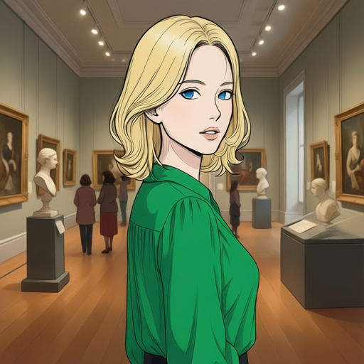](../../../assets/part-07/chapter-05/sec-10/bfs-evaluation-control512/bfs-input-21-ink-illustration-base.png) | [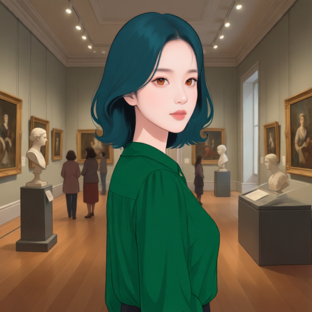](../../../assets/part-07/chapter-05/sec-10/bfs-evaluation-control512/bfs-input-21-ink-illustration-lora.png) | [](../../../assets/part-07/chapter-05/sec-10/validation/images/p7-5-10-mira-v2-evaluation-05.png) |

금발이 Mira 단발로 바뀌며 초록 상의와 미술관 배치가 대체로 남는다. 열린 입이 닫히고 얼굴 방향도 약간 달라 보여 세부 보존은 미흡하다.

### P711-IN-154 · bfs-input-22-oil-painting

| 입력 | LoRA 미적용 | LoRA 적용 · 1600스텝 | Mira 목표 · 비교 전용 |
| --- | --- | --- | --- |
| [](../../../assets/part-07/chapter-05/sec-10/input-images/bfs-input-22-oil-painting.png) | [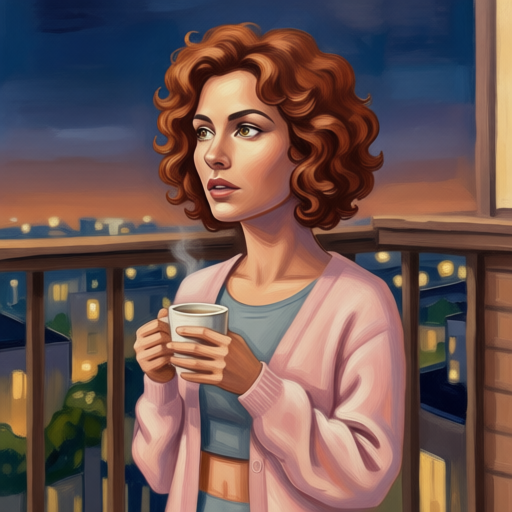](../../../assets/part-07/chapter-05/sec-10/bfs-evaluation-control512/bfs-input-22-oil-painting-base.png) | [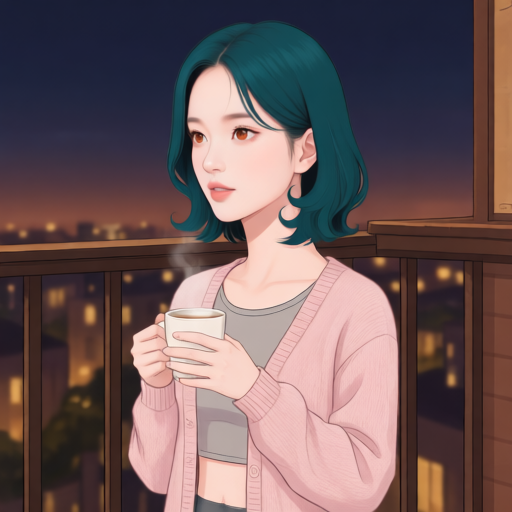](../../../assets/part-07/chapter-05/sec-10/bfs-evaluation-control512/bfs-input-22-oil-painting-lora.png) | [](../../../assets/part-07/chapter-05/sec-10/validation/images/p7-5-10-mira-v2-evaluation-06.png) |

유화 얼굴·곱슬머리에서 Mira 얼굴·단발로 변한다. 컵·손·창가의 큰 구도는 남지만 눈썹·입의 긴장감이 완화된다.

### P711-IN-195 · bfs-input-19-clay-render

| 입력 | LoRA 미적용 | LoRA 적용 · 1600스텝 | Mira 목표 · 비교 전용 |
| --- | --- | --- | --- |
| [](../../../assets/part-07/chapter-05/sec-10/input-images/bfs-input-19-clay-render.png) | [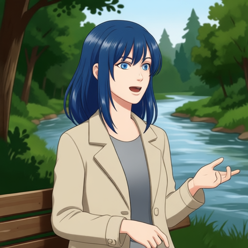](../../../assets/part-07/chapter-05/sec-10/bfs-evaluation-control512/bfs-input-19-clay-render-base.png) | [](../../../assets/part-07/chapter-05/sec-10/bfs-evaluation-control512/bfs-input-19-clay-render-lora.png) | [](../../../assets/part-07/chapter-05/sec-10/validation/images/p7-5-10-mira-v2-evaluation-02.png) |

점토풍 인물이 목표 쪽 일러스트로 변한다. 강·벤치·손짓과 열린 입은 대체로 남는다. 소매 끝 장식이 추가된다.

### P711-IN-196 · bfs-input-20-ink-illustration

| 입력 | LoRA 미적용 | LoRA 적용 · 1600스텝 | Mira 목표 · 비교 전용 |
| --- | --- | --- | --- |
| [](../../../assets/part-07/chapter-05/sec-10/input-images/bfs-input-20-ink-illustration.png) | [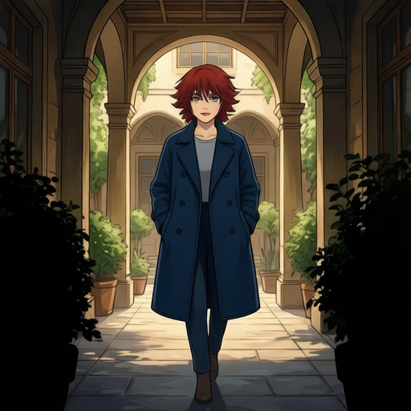](../../../assets/part-07/chapter-05/sec-10/bfs-evaluation-control512/bfs-input-20-ink-illustration-base.png) | [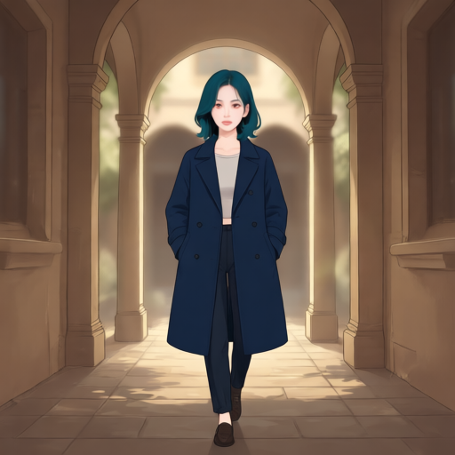](../../../assets/part-07/chapter-05/sec-10/bfs-evaluation-control512/bfs-input-20-ink-illustration-lora.png) | [](../../../assets/part-07/chapter-05/sec-10/validation/images/p7-5-10-mira-v2-evaluation-04.png) |

전신은 유지되지만 양옆 식물과 회랑 세부가 사라지고 단순한 통로로 바뀐다. 열린 입도 유지되지 않는다.

### P711-IN-197 · bfs-input-21-oil-painting

| 입력 | LoRA 미적용 | LoRA 적용 · 1600스텝 | Mira 목표 · 비교 전용 |
| --- | --- | --- | --- |
| [](../../../assets/part-07/chapter-05/sec-10/input-images/bfs-input-21-oil-painting.png) | [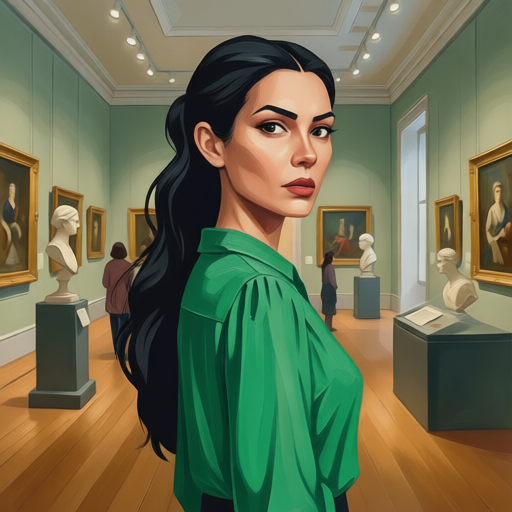](../../../assets/part-07/chapter-05/sec-10/bfs-evaluation-control512/bfs-input-21-oil-painting-base.png) | [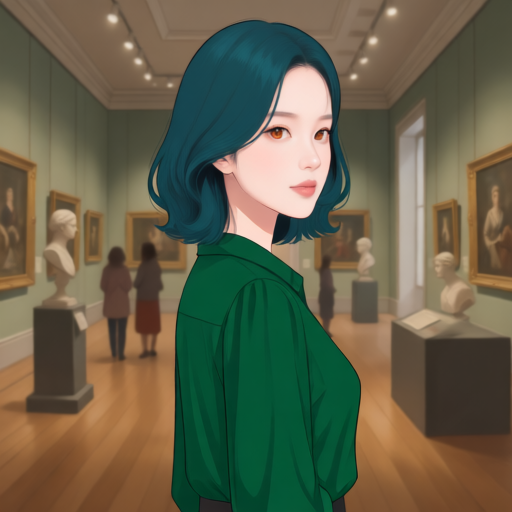](../../../assets/part-07/chapter-05/sec-10/bfs-evaluation-control512/bfs-input-21-oil-painting-lora.png) | [](../../../assets/part-07/chapter-05/sec-10/validation/images/p7-5-10-mira-v2-evaluation-05.png) |

Mira 단발·얼굴로 바뀌고 초록 상의·미술관의 큰 배치는 남는다. 찌푸린 눈썹과 열린 입이 완화되어 표정 보존이 미흡하다.

### P711-IN-198 · bfs-input-22-soft-photo

| 입력 | LoRA 미적용 | LoRA 적용 · 1600스텝 | Mira 목표 · 비교 전용 |
| --- | --- | --- | --- |
| [](../../../assets/part-07/chapter-05/sec-10/input-images/bfs-input-22-soft-photo.png) | [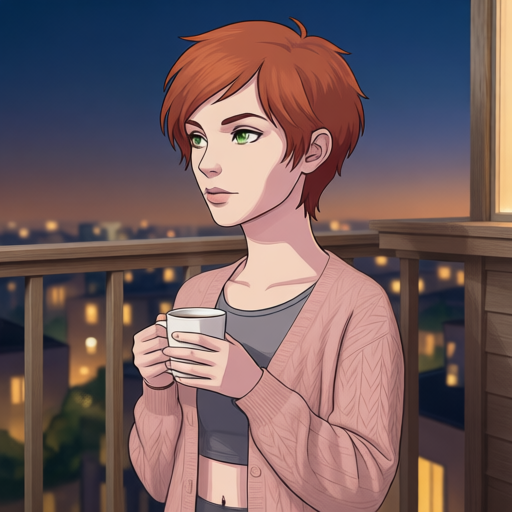](../../../assets/part-07/chapter-05/sec-10/bfs-evaluation-control512/bfs-input-22-soft-photo-base.png) | [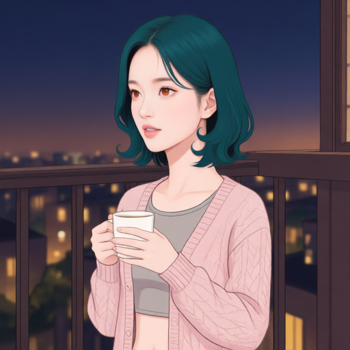](../../../assets/part-07/chapter-05/sec-10/bfs-evaluation-control512/bfs-input-22-soft-photo-lora.png) | [](../../../assets/part-07/chapter-05/sec-10/validation/images/p7-5-10-mira-v2-evaluation-06.png) |

사진풍 짧은 머리가 Mira 단발로 바뀐다. 컵과 창가 구도는 남지만 얼굴 방향·입 모양은 완전히 일치하지 않는다.

### 전체 결과에서 확인한 성과와 한계

미술관 사례는 얼굴·헤어·화풍을 바꾸면서 초록 상의, 돌아보는 자세, 그림과 조각의 큰 배치를 대체로 유지한다. 회랑 사례에서도 Mira 외형은 나타나지만 배경이 거의 단색으로 사라진다. **바꿀 특징을 학습하는 것과 남겨야 할 요소를 보존하는 것은 별도로 확인해야 한다**는 점을 같은 실습에서 관찰한 것이다.

참조 VAE 크기를 학습과 맞춘 19쌍에서는 이전의 심한 확대·잘림이 관찰되지 않았다. 이는 모델의 결과를 판단하기 전에 학습과 추론의 전처리 조건을 맞춰야 한다는 교훈으로 연결된다. 다만 회랑 5쌍은 모두 큰 식물·배경 구조를 잃었고 그중 사진풍·수채화 입력 2쌍은 배경이 거의 단색으로 바뀌었다. 다른 장면에서도 입 벌림이 줄거나 소매 장식이 추가되는 변화가 남았다. 이 항목들은 실습에서 확인한 **후속 품질 개선 과제**로 남긴다.

훈련 손실은 학습 목표를 맞추는 정도를 보여 주며, Mira 유사도나 배경 보존 점수를 대신하지 않는다. 같은 입력·지시·시드·추론 설정에서 LoRA 미적용과 적용을 나란히 비교하고, 얼굴·헤어·화풍의 변환과 표정·구도·배경의 보존을 각각 판정한다.

이번 실습은 데이터 준비 → 고정 입력·목표 대응 학습 → 어댑터 적용 → 미적용 대조 → 변환과 보존의 분리 평가까지 한 흐름으로 마쳤다. 실제 인물과 장면을 입력했을 때 학습한 특징이 편집 결과에 반영되는 것을 확인했다.

검수는 전체 쌍을 칸당 384px로 나란히 확인한 정성적 관찰이다. 검증 입력 19쌍은 목표 장면 4개의 변형이며 시드·학습량·강도도 각각 한 조건이다. 실습 목표의 달성이 외부 장면 일반화나 모든 보존 조건의 충족을 뜻하지는 않는다. 후속 실험에서는 독립적인 새 장면과 다른 체크포인트를 같은 조건으로 비교하여 남은 문제를 살펴볼 수 있다. 이번 결과만으로 실패 원인을 학습 부족이나 과적합으로 단정하거나 추가 학습을 필수 단계로 정하지 않는다.

## 외부 입력 45장과 추가 평가 중단 기록

### 새 인물의 15방향 입력을 준비한다

새 장면에서 편집 결과를 비교할 입력으로 Codex 내장 ImageGen을 사용해 가상의 남성·여성·유아 각 1명의 상반신 이미지를 생성했다. 기존 카메라 실험의 세로 3단계(로우·눈높이·엘리베이티드)와 가로 5단계(−90°·−45°·0°·+45°·+90°)를 조합해 인물별 15장, 총 45장을 준비했다. 카페·도서관·놀이방 배경과 여러 자세·표정을 포함하며, 생성 원본 전체를 추가 크롭 없이 **512×512**로 축소했다.

[남성·여성·유아 45장 앵글별 비교표](../../../assets/part-07/chapter-05/sec-12/codex-camera-inputs-v1/README.md){ .aibook-markdown-preview } · [생성 프롬프트·이미지 목록·해시](../../../assets/part-07/chapter-05/sec-12/codex-camera-inputs-v1/generation-manifest.json)

각도는 생성 요청의 범주이며 측정값이 아니다. 같은 인물의 외형 설명을 반복해 생성했지만 세부 외형·의상·배경이 달라질 수 있다. 자세와 표정도 함께 달라지므로 카메라 각도만의 영향을 측정하는 통제 실험으로 해석하지 않는다. 이 45장은 기존 193쌍 학습에 포함되지 않은 새 합성 입력이며, 추가 평가를 중단했으므로 BFS LoRA 편집 결과와 구도·표정·배경 보존 여부에 대한 결론은 남기지 않는다.

### 추가 평가를 중단했다

2026년 9월 17일 45장 추가 평가를 중단하고, 생성된 출력 17장과 결과 JSON·실행 계획·진행 상태·비교표를 삭제했다. 입력 이미지 45장과 생성 기록은 보존한다. 이 추가 평가의 결과를 캐릭터 일관성이나 입력 장면 보존에 대한 근거로 사용하지 않는다.

## 평가 이후의 데이터 보강과 추가 학습

출력 검수에서 확인한 개선 과제에 따라 데이터를 보강하거나 저장 상태에서 학습을 이어 갈 수 있다. 아래 두 항목은 이번 193쌍 학습·평가 이후의 확장 방법이다.

### 후속 실험용 Mira 목표 후보를 별도로 보관한다

[추가 Mira 목표 후보 128개 생성 목록 JSON](../../../assets/part-07/chapter-05/sec-10/p7-5-10-mira-target-pool-v3.json)

[목표 후보 123장 검수 비교표](../../../assets/part-07/chapter-05/sec-10/target-candidate-review.md){ .aibook-markdown-preview }

비교표는 방향별 기준 Mira와 생성 후보를 나란히 배치하고, `P711-TGT-001`~`128` 관리번호로 1차 검수 의견을 연결한다. 전체 축소 비교와 의심 5건의 확대 확인 결과이며, 학습 채택 완료를 뜻하지 않는다.

이 목록은 기존 의상·배경·조명·표정 조건 32개를 방향별 고정 참조 4개에 적용한다. 얼굴·홍채·피부색·헤어를 다시 묘사하지 않고 변경 대상만 지시한다. 최초 128장 중 생성 불량 5장을 폐기해 123장을 보관하며, 이는 학습에 채택한 수가 아니다. 이번에는 참조 입력 후보를 먼저 생성한 뒤 Mira 목표 후보를 늘렸다. 추가 목표 123장은 대응 입력이 없어 현재 193쌍 학습에는 포함하지 않는다.

목표 생성 명령은 `P711-TGT-030·062·078·094·126`을 제외한다. `--dry-run`으로 123개 유효 후보의 완료 여부와 제외 ID를 확인할 수 있다. 원래 생성 조건은 삭제하지 않는다.

[목표 재생성 제외 목록 JSON](../../../assets/part-07/chapter-05/sec-10/p7-5-10-target-generation-exclusions.json)

[목표 후보 조건 조합 JSON](../../../assets/part-07/chapter-05/sec-10/p7-5-10-mira-target-combinations-v1.json)

[목표 생성 실행 설정 JSON](../../../assets/part-07/chapter-05/sec-10/p7-5-10-target-generation-job.json)

```bash
.venv/bin/python docs/assets/part-07/chapter-05/sec-10/p7_5_10_generate_supplements.py \
  --job docs/assets/part-07/chapter-05/sec-10/p7-5-10-target-generation-job.json \
  --wait-for-gpu
```

`--limit 8`은 미완료 후보 중 8장만 생성한 뒤 멈춘다. 같은 명령을 다시 실행하면 나머지를 이어 만든다. `--wait-for-gpu`는 다른 CUDA 작업의 종료를 기다린다. 생성 조건이나 코드를 바꾸면 새 출력 폴더를 사용한다.

추가 목표 후보를 후속 실험에 활용할 때는 다음 명령으로 검수할 항목을 나열한다. 각 이미지와 참조를 비교하여 `status`를 `accepted` 또는 `rejected`로 바꾸고, 채택 항목에 `split`, 실제 이미지에 맞는 `caption`, 판단 이유인 `review_note`를 적는다. 캡션에는 `mira_person`을 포함한다.

```bash
.venv/bin/python docs/assets/part-07/chapter-05/sec-10/p7_5_10_select_candidates.py review-template \
  --catalog docs/assets/part-07/chapter-05/sec-10/target-images/candidate-catalog.json \
  --output .tmp/p7-5-12/target-review-v3.json

.venv/bin/python docs/assets/part-07/chapter-05/sec-10/p7_5_10_select_candidates.py export \
  --catalog docs/assets/part-07/chapter-05/sec-10/target-images/candidate-catalog.json \
  --review .tmp/p7-5-12/target-review-v3.json \
  --output .tmp/p7-5-12/selected-targets-v3.json
```

출력은 채택 이미지의 경로·해시·캡션·분할을 담은 별도 JSON이다. 원본 이미지는 복사하지 않으며 현재 193쌍의 확정 데이터셋도 갱신하지 않는다. 같은 조건의 방향 변형은 같은 `group`으로 묶어 학습과 검증 사이에 나누지 않는다. 다만 여러 조건이 같은 기준 얼굴에서 파생되었으므로 이 분할만으로 외부 장면에 대한 독립 검증이 되지는 않는다. 검수 목록과 출력 이름을 달리하면 같은 후보 모음에서 서로 다른 실험용 데이터셋을 구성할 수 있다.

### 1600스텝 평가 후 저장 상태에서 이어 학습한다

이번 설정은 `save_state`와 `save_state_on_train_end`를 켠다. 400스텝마다 LoRA 가중치와 재개용 상태를 저장하며, 정상 종료 시 마지막 상태도 보관한다. 재개용 상태에는 LoRA 가중치뿐 아니라 옵티마이저·학습률 스케줄러·난수 상태가 들어간다. LoRA `.safetensors` 파일 하나만 가져와 추가 학습하는 것과 구분한다.

1600스텝 정상 종료 후 마지막 상태는 패키지의 `checkpoints/mira_bfs-state/`다. 중간 상태는 `checkpoints/mira_bfs-step00000400-state/`처럼 저장된다. 학습이 중단되면 저장이 완성된 중간 상태를 선택할 수 있다. 상태 폴더 전체와 원래 패키지를 함께 보관한다.

다음 예는 1600스텝 결과를 평가한 뒤 **추가 1600스텝**을 준비한다. 실제 상태 폴더가 생성된 뒤 실행하며, 최초 학습 전에는 존재하지 않는다.

```bash
.venv/bin/python docs/assets/part-07/chapter-05/sec-10/p7_5_10_mira_lora.py prepare-resume \
  --source-package .tmp/p7-5-12/bfs-paired-v2 \
  --state .tmp/p7-5-12/bfs-paired-v2/checkpoints/mira_bfs-state \
  --additional-steps 1600 \
  --output .tmp/p7-5-12/bfs-continued-v1

.venv/bin/python docs/assets/part-07/chapter-05/sec-10/p7_5_10_mira_lora.py run \
  --package .tmp/p7-5-12/bfs-continued-v1 \
  --trainer /tmp/p7511-musubi \
  --python .tmp/p7-5-11/musubi-venv/bin/python
```

두 번째 명령은 실행 계획만 출력한다. 실제 재개에는 `--execute`를 추가한다. 준비 코드는 원래 데이터셋·분할·rank·학습률·모델 설정을 계승하고 추가 학습량만 바꾼다. 재개 상태의 필수 파일과 해시를 검사하고, 학습 명령에는 `--resume`을 전달한다. 이전 결과를 덮어쓰지 않도록 새 패키지에서 캐시를 다시 만들고 체크포인트를 저장한다.

고정한 Musubi 버전은 상태를 복원해도 학습 루프의 스텝 번호를 0부터 센다. 위 예의 새 `1600`은 누적 종료 번호가 아니라 추가 실행량으로, 완료 시 누적 3200스텝을 별도 기록한다. 새 패키지의 `step00000400`은 이 예에서 누적 2000스텝에 해당한다. 데이터 순회 위치까지 완전히 이어지는 것은 아니므로, 중단 없이 3200스텝 실행한 결과와 수치적으로 같다고 단정하지 않는다. 실제 BFS 모델의 상태 저장은 확인했으며, 해당 상태에서의 재개 학습은 아직 실행하지 않았다.

## 체크리스트

- 자료 생성 방향과 LoRA 학습 방향을 구분했는가?
- 같은 입력·목표 쌍에서 카메라 시점·원근·인물 위치·크롭·몸 크기가 유지되는가?
- 새 입력과 Mira 목표에서 자세·표정·의상·장면이 대응하는가?
- 목표 전체에 일관된 Mira 목표 화풍이 있는지 다시 확인했는가?
- 생성 지시와 학습 지시를 구분하고 검증 쌍을 학습에서 제외했는가?
- 새 장면의 외형 변환과 원래 요소의 보존을 따로 평가하는가?

## 출처와 참고 자료

- Edward J. Hu et al., [LoRA: Low-Rank Adaptation of Large Language Models](https://arxiv.org/abs/2106.09685): 기반 가중치 고정과 작은 추가 행렬 학습의 원리.
- Qwen, [Qwen-Image-Edit-2511 모델 카드](https://huggingface.co/Qwen/Qwen-Image-Edit-2511): 학습·적용의 기반 모델.
- kohya-ss, [Musubi Tuner Qwen-Image 안내](https://github.com/kohya-ss/musubi-tuner/blob/main/docs/qwen_image.md): Edit-2511 학습 및 실행 구성.

- kohya-ss, [Musubi Tuner 데이터 구성](https://github.com/kohya-ss/musubi-tuner/blob/main/docs/dataset_config.md): 제어 이미지와 목표 이미지의 역할 및 대응 방식. 확인일: 2026-09-14.
- ModelScope, [DiffSynth-Studio Qwen-Image-Edit-2511 LoRA 학습 예제](https://github.com/modelscope/DiffSynth-Studio/blob/main/examples/qwen_image/model_training/lora/Qwen-Image-Edit-2511.sh): `image`와 `edit_image`를 구분한 2511 학습 입력. 확인일: 2026-09-14.

기존 Mira 목표에서 변환 전 입력을 역방향으로 생성하는 방법, 입력 유형과 수량은 이번 BFS 실험의 설계다. 위 학습 도구의 데이터 형식이 이 구성의 품질을 보장하지는 않는다.
