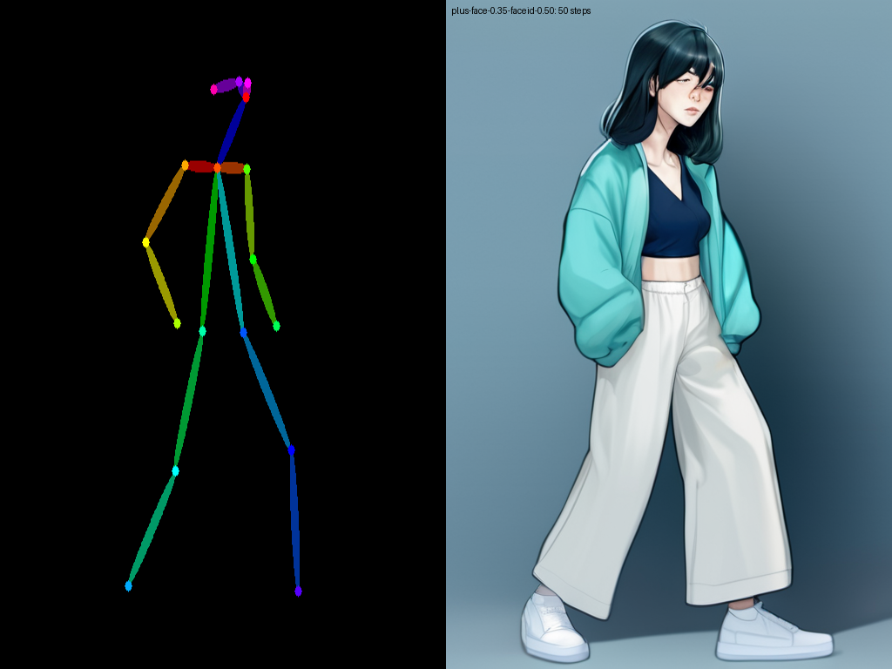

# P7-5.11 화풍·연속성 보정: 국소 편집과 참조 역할을 분리해 고치기

> Section ID: `P7-5.11`
> Version: `v2026.09.05`

같은 캐릭터의 컷을 국소 편집으로 고칠 수 있을까? 이 절에서는 한 장이 그럴듯한지를 보지 않고, 아래 네 계약을 동시에 확인했다. 실험은 하나의 도구를 고르는 과정이 아니라, 어느 계약이 깨지는지 찾아 다음 입력의 역할을 좁히는 과정이었다.

| 계약 | 확인할 질문 |
| --- | --- |
| structure | 카메라, 인체 동작, 거리와 가림이 장면 의도에 맞는가? |
| identity | 얼굴과 신체 비율이 같은 캐릭터로 읽히는가? |
| outfit | 재킷·상의·바지·신발·가방의 형태와 레이어가 유지됐는가? |
| style | 기준 선화·색·질감의 범위 안에 있는가? |

여기서 **계약**은 생성기에 요구하는 문장이 아니라, 결과를 보고 사람이 판정하는 약속이다. structure는 “카메라와 몸의 큰 배치가 맞는가”, identity는 “같은 사람으로 보이는가”, outfit은 “옷과 소품의 형태·겹침이 맞는가”, style은 “기준 그림 방식과 어울리는가”로 읽는다. 한 항목의 일치가 다른 항목의 이탈을 덮어쓰지 않는다.

!!! abstract "실험 결론"

    국소 편집은 이미 성립한 수평 레이어를 부분 보정할 수 있었지만, 새 카메라가 만드는 3D 가림 관계를 재구성하지는 못했다. 반면 고각도 guide, 정면 얼굴, 완성 착장을 서로 다른 입력 역할로 나눈 Qwen 편집에서는 고정 guide 범위에서 네 항목의 일치를 함께 관찰했다. OpenPose로 동작과 구도를 바꾼 보조 실험은 P7-5.13으로 분리한다.

OpenPose map을 통한 동작·구도 변경의 관찰과 한계는 [P7-5.13 OpenPose 맵으로 캐릭터 동작과 구도 변경을 시험하기](section-13.md)에서 다룬다. 이 절은 그 실험 뒤에 남은 국소 보정과 reference 편집 경로를 비교한다.

## 정상적인 얼굴 생성과 전신 캐릭터 재현은 다른 검증이다

> **이 보조 실험이 확인한 것:** 50 step의 base model은 얼굴을 만들 수 있지만, 전신에 조건을 결합한 뒤의 identity·outfit 실패를 그 문제로 환원할 수는 없다.

먼저 reference·ControlNet·LoRA를 모두 제외한 SDXL Base 1.0 단독으로 정상적인 정면 얼굴이 형성되는지 확인했다. `1024×1024`, 50 step, CFG `5.0`, seed `62295`에서 청록 단발·호박색 눈·수채화 웹툰이라는 텍스트만 주었다. 이 결과는 Mira identity의 기준이 아니라, **base model이 얼굴 자체를 만들 수 있는가**를 분리한 기준선이다.

따라서 전신 결과에서 얼굴이나 정체성이 흔들린다고 해서 base model이 얼굴을 전혀 만들지 못한다고 해석할 수는 없다. 아래 실행 기록은 이 기준선의 prompt·seed·해상도와 제외한 조건을 보관한다.

[p7-5-11-sdxl-base-face-50step-result.json — JSON — SDXL Base 얼굴 기준선 실행 기록 보기](/AiBook/assets/part-07/chapter-05/p7-5-11-sdxl-base-face-50step-result.json)

## 삭제한 FLUX 학습셋은 LoRA 근거로 쓰지 않는다

P7-5.3의 방향 원본과 이전 동작 실험 원본으로 구성했던 FLUX 실험 이미지·비교 기록·54컷 manifest는 모두 제거했다. 따라서 이 절은 해당 데이터셋의 LoRA 효과를 현재 근거로 사용하지 않는다. 새 학습셋은 생성 모델, 이미지, 사람 검수 기록, caption·hash manifest를 한 세트로 새로 기록한 뒤에만 실험에 연결한다.

LoRA on은 off보다 화풍과 착장 경향을 끌어올 수 있지만, 정확한 얼굴·동작·가방을 단독으로 고정하지는 못한다. FacePlus와 FaceID를 함께 써도 얼굴 단서는 보조할 뿐 전신 계약의 이탈을 해소하지 못했다.

| character LoRA on/off | FacePlus + FaceID |
| --- | --- |
|  |  |
| 화풍·착장 경향은 보조 | 얼굴 단서는 생겨도 전신 계약 이탈 |

이 비교가 말하는 것은 데이터 수만으로 새 동작을 모두 해결할 수 없다는 점이다. 얼굴·동작·가방의 정확한 관계는 별도 조건 없이는 흔들리므로, 얼굴 개선만을 성공으로 세지 않는다.

## 국소 보정은 새 카메라의 3D 가림 관계를 만들지 못했다

> **이 보조 실험이 확인한 것:** mask·VTON은 이미 성립한 수평 레이어를 부분 보정할 수 있어도, 고각도에서 새로 보이거나 가려지는 전신 관계를 재구성하지는 못한다.

고각도에서 문제를 국소 영역만 고쳐 해결할 수 있는지도 확인했다. 자동 DiffEdit mask는 머리와 신발까지 퍼져 재킷만 고치지 못했다. FitDiT에는 고각도 원본의 카메라·자세·하체를 고정하고 상반신만 감싼 좁은 mask와 완성 착장을 주었지만, 재킷은 회색 덩어리와 짧은 흰 앞면으로 바뀌고 가방·strap이 사라졌다. CatVTON은 수평 전면에서 재킷 레이어를 부분적으로 전달했지만, 고각도 전신을 다시 구성하는 증거는 아니었다.

| DiffEdit 자동 mask | FitDiT 고각도 상반신 | CatVTON 수평 재킷 |
| --- | --- | --- |
|  |  |  |
| 편집 범위가 전신으로 확산 | 어깨·재킷·가방의 새 가림 관계가 재현되지 않음 | 수평 재킷 레이어가 일부 유지됨 |

세 결과는 같은 실패가 아니다. DiffEdit은 고칠 영역을 충분히 좁히지 못했고, FitDiT는 좁힌 영역 안에서도 새 카메라가 요구한 어깨·가방의 앞뒤 관계를 만들지 못했다. CatVTON은 수평 전면에서 이미 성립한 레이어를 옮긴 사례다. 따라서 마지막 결과를 고각도 전신의 증거로 확장하지 않고, 국소 보정은 구조 관계가 먼저 확보된 뒤에만 쓰는 후보로 남긴다.

이 결과는 mask를 더 정교하게 그리거나 reference를 더 주는 일이 고각도에서 새로 보이거나 가려지는 팔·몸통·다리·가방의 관계를 대신하지 못한다는 뜻이다. 아래 실행 기록은 각 조건을 남긴다.

[p7-5-11-fitdit-high-angle-upperbody-complete-outfit-result.json — JSON — FitDiT 고각도 상반신 실행 기록 보기](/AiBook/assets/part-07/chapter-05/p7-5-11-fitdit-high-angle-upperbody-complete-outfit-result.json)

## Qwen의 세 입력 역할 분리는 고정 guide에서 네 계약을 함께 보였다

이 절의 국소 보정과 P7-5.13의 구조 조건 비교는 한 입력에 카메라·얼굴·완성 착장을 함께 맡기지 말아야 한다는 결론을 주었다. 그러나 Qwen-Image-Edit-2509는 그 보조 조건들을 결합하지 않고, 세 이미지 입력 자체의 역할만 분리했다.

| 입력 | 맡긴 정보 |
| --- | --- |
| image 1 | 지붕, 고각도 카메라, 보행 배치 |
| image 2 | 정면 얼굴 identity |
| image 3 | 재킷·바지·신발·가방을 포함한 완성 착장 |

처음의 2입력은 재킷·가방을 잃었고, 역할을 충분히 분리하지 않은 3입력은 분홍 신발·좁은 바지를 만들었다. 이것이 복장 입력을 별도 역할로 고정한 이유다.

| 2입력: 착장·가방 누락 | 역할 미분리 3입력: 신발·바지 드리프트 |
| --- | --- |
|  |  |
| 재킷·가방·strap 이탈 | 흰 운동화·와이드 바지 이탈 |

[p7_5_11_qwen_edit_high_angle_role_comparison.py — Python — 2입력 착장 누락과 3입력 역할 분리 고각도 비교 생성 코드 보기](/AiBook/assets/part-07/chapter-05/p7_5_11_qwen_edit_high_angle_role_comparison.py)

이 코드는 `--condition two-input --seed 62294`로 왼쪽 PNG를, `--condition role-separated --seed 62295`로 아래 오른쪽 비교 PNG를 만든다. 재실행 결과는 패키지 버전과 런타임에 따라 픽셀까지 같지 않을 수 있으므로, 기록된 SHA-256 대조와 사람 검수를 새로 수행한다.

이 비교의 핵심은 입력 수 자체가 아니라 입력마다 맡긴 정보다. 2입력에서 구조와 얼굴을 우선하면 완성 착장의 레이어가 빠졌고, 역할이 겹친 3입력에서는 착장 단서끼리 충돌해 신발·바지가 바뀌었다. 그래서 다음 조건에서는 guide가 장면 구조만, 얼굴 reference가 identity만, 완성 착장이 옷·가방만 맡도록 서로의 판정 범위를 좁혔다.

Nunchaku FP4 r128과 per-layer CPU offload에서 `768×1152`, 40 step으로 실행한 역할 분리 조건은 GPU 약 `3.5–3.7 GiB`, 장당 약 16분 32초가 걸렸다. seed `62294/62295` 두 후보 모두 고각도 투영, 보행, 얼굴, 재킷·바지·신발·가방과 재킷 바깥 strap을 함께 유지했다.

| seed `62294` | seed `62295` |
| --- | --- |
|  |  |
| 네 항목의 일치 관찰 | 같은 입력 역할에서 교차 seed 비교 |

따라서 고정한 보행 guide 범위에서는 **구조용 guide로 카메라·행동·배경을 정하고, 얼굴과 완성 착장을 역할별 reference로 분리하는 경로**에서 네 항목의 일치를 관찰했다. 다른 pose·guide·후면·강한 가림에는 같은 역할 분리를 유지한 새 후보와 사람 검수가 필요하다. 이 두 결과는 P7-5.5 스토리보드를 자동으로 교체하거나 LoRA 학습 데이터로 사용하지 않는다.

## 체크리스트

- SDXL Base 얼굴 기준선이 확인한 범위와 전신 캐릭터 재현이 요구하는 identity·outfit 계약을 구분한다.
- DiffEdit·FitDiT·CatVTON 비교에서 부분 보정에서 관찰된 변화와 새 고각도 전신 컷의 네 항목 일치를 구분한다.
- Qwen의 두 seed 결과에서 네 항목의 일치·이탈을 각각 기록한다. 두 seed에서 같은 특징이 보여도, 다른 pose·후면·강한 가림까지 일반화하지 않는다.

## 출처와 참고 자료

- Stability AI, [SDXL Generative Models](https://github.com/Stability-AI/generative-models){: target="_blank" rel="noopener noreferrer" }, 확인일: 2026-08-16. SDXL Base 1.0의 기준 모델을 확인했다.
- Hu et al., [LoRA: Low-Rank Adaptation of Large Language Models](https://arxiv.org/abs/2106.09685){: target="_blank" rel="noopener noreferrer" }, 확인일: 2026-08-16. low-rank adapter의 기본 개념을 확인했다.
- Qwen Team, [Qwen-Image-Edit-2509](https://github.com/QwenLM/Qwen-Image/blob/main/Qwen-Image-Edit-2509.md){: target="_blank" rel="noopener noreferrer" }, 확인일: 2026-08-15. 1–3 입력 이미지 편집 범위를 확인했다.
- Nunchaku, [Qwen-Image-Edit-2509 실행 예제](https://github.com/nunchaku-ai/nunchaku/blob/main/examples/v1/qwen-image-edit-2509.py){: target="_blank" rel="noopener noreferrer" }, 확인일: 2026-08-15. FP4 transformer와 offload 기반 로컬 실행 경로를 확인했다.
- Hugging Face, [Diffusers inpainting guide](https://huggingface.co/docs/diffusers/en/using-diffusers/inpaint){: target="_blank" rel="noopener noreferrer" }, 확인일: 2026-08-15. mask 기반 국소 편집의 동작 범위를 참고했다.
- Couairon et al., [DiffEdit](https://arxiv.org/abs/2210.11427){: target="_blank" rel="noopener noreferrer" }, 확인일: 2026-08-16. text-guided mask 기반 편집의 기본 방법을 확인했다.
- Jiang et al., [FitDiT](https://github.com/BoyuanJiang/FitDiT){: target="_blank" rel="noopener noreferrer" }, 확인일: 2026-08-16. garment detail virtual try-on의 입력 경계를 확인했다.
- Zheng et al., [CatVTON](https://github.com/Zheng-Chong/CatVTON){: target="_blank" rel="noopener noreferrer" }, 확인일: 2026-08-16. 가상 착장 전이 실험의 구현과 입력 형식을 확인했다.
