# P7-5.11 Mira 얼굴·헤어 LoRA 학습 준비하기

> Section ID: `P7-5.11`
> Version: `v2026.09.13`

[P7-5.2](section-02.md)의 얼굴·각도 참조와 [P7-5.9](section-09.md)의 표정 이미지를 사용해 **새 장면에서도 Mira의 얼굴과 헤어를 유지하는 Qwen-Image-Edit-2511용 LoRA**를 준비한다. 표정 자료는 같은 인물이 여러 얼굴 움직임을 보이는 학습 후보로 사용한다. 현재 학습 40개·평가 4개를 분리하고, Mira 참조로 학습한 A와 단색 참조로 학습한 B를 얼굴 없는 동일 입력에서 비교한다. B400에서는 청록색 단발 등 일부 특징이 나타났지만, 기준과 같은 인물이라고 볼 만큼 정체성이 일치하지 않는다. **특징의 개선과 동일 인물 재현 목표의 달성은 구분한다.**

## 학습 자료와 결과 폴더

이 절의 전용 자료는 `docs/assets/part-07/chapter-05/sec-11/` 아래에서 관리한다.

- `training-images/`: 학습에 채택한 보충 이미지 28개만 보관한다. 5.2 공유 원본 12개와 합쳐 학습 목표는 총 40개다.
- `validation/images/`: 학습에서 분리한 검증용 보충 이미지 4개.
- 절 전용 폴더의 JSON: 후보 목록·분할·캡션·생성 조건·학습 설정·비교 계획.
- `results/`: 보충 이미지의 원본 생성 기록 JSON.
- `checkpoint-matrix-evaluation/`, `memorization-evaluation/`, `identity-evaluation/`: 평가 입력·출력·검수 기록.

학습 이미지 목록은 5.2 공유 원본 12개와 보충 이미지 28개, 총 40개 항목이다. 각 항목의 `image`는 저장소 루트 기준 경로, `caption`은 학습 지시, `sha256`은 파일 내용 확인값이다. 검증용 4개와 보류 후보는 이 목록에 넣지 않았다. 실행용 분할·검수 목록은 아래 학습 패키지 준비 단계에서 별도로 사용한다.

[학습 이미지 40개 목록 JSON](../../../assets/part-07/chapter-05/sec-11/training-images.json)

5.2에서 재사용하는 기준·방향 이미지 12개는 해당 절의 원본 위치를 그대로 참조한다. 학습 캐시·체크포인트·실행 로그와 생성 중인 평가 출력은 `.tmp/p7-5-11/` 아래 실행별 하위 폴더에 보관한다. 모델 다운로드는 `.tmp/download/`에서 관리한다.

## 생성·학습·평가 코드의 실행 순서

명령은 저장소 루트에서 실행한다. 모델 파일은 `.tmp/download/`의 로컬 캐시에 준비하고, GPU를 사용하는 생성·학습·평가와 CPU만 사용하는 목록 준비를 구분한다.

**학습 데이터 생성**: 방향별 기준 이미지와 생성 목록 → 후보 PNG·생성 기록

[보충 이미지 순차 생성](../../../assets/part-07/chapter-05/sec-11/p7_5_11_generate_supplements.py)

**검수·학습 데이터 준비**: `inventory`로 후보 수집, 시각 검수 후 `prepare`로 학습·평가 JSONL과 TOML 작성

[목록 수집·패키지 준비](../../../assets/part-07/chapter-05/sec-11/p7_5_11_mira_lora.py)

**LoRA 학습**: `run --execute`로 검수된 패키지 → 캐시·체크포인트·실행 로그

[캐시 생성·학습 실행](../../../assets/part-07/chapter-05/sec-11/p7_5_11_mira_lora.py)

**품질 평가**: 지정 체크포인트·해시와 얼굴 없는 단색 입력 → 같은 조건의 비교 PNG·결과 기록

[LoRA 미적용·적용 비교](../../../assets/part-07/chapter-05/sec-11/p7_5_11_evaluate_lora.py)

세 코드는 실제 입력 조건을 바꾸어 출력 차이를 관찰하는 실험형 예제다. 생성 코드는 `--spec`의 장면·참조·시드를 바꿔 후보 PNG와 결과 JSON을 비교한다. 학습 코드는 `validate → prepare → commands → run` 순서로 읽고, 설정의 `steps`·`save_every`를 바꿨을 때 저장되는 체크포인트를 확인한다. 평가 코드는 체크포인트와 장면을 선택해 같은 입력에서 얼굴·헤어·지시 준수의 차이를 관찰한다.

생성 코드는 학습 적합성을 자동 승인하지 않는다. 얼굴·홍채색·피부색·헤어와 실제 표정·구도를 검수한 뒤 목록의 `split`, `caption`, `review_note`를 확정한다. 아래에서 각 단계의 명령과 출력 확인 방법을 설명한다.

## 표정이 달라도 같은 인물로 남는가

LoRA는 기반 모델의 가중치를 고정하고 작은 추가 행렬을 학습하는 방법이다. 학습할 파라미터를 줄이지만, 원래 모델의 계산과 메모리가 모두 사라지는 것은 아니다. 이 원리는 [LoRA 논문](https://arxiv.org/abs/2106.09685){: target="_blank" rel="noopener noreferrer" }에서 확인할 수 있다.

여기서 학습하려는 공통 특징은 Mira의 얼굴 비례, 눈·코의 형태, 머리색, 가르마와 단발 형태다. 미소·분노·하품은 바뀔 수 있는 조건으로 기술한다. 흰 배경과 정면 머리 구도까지 Mira의 필수 특징으로 묶여 배우지 않았는지 새 장면에서 확인해야 한다.

| 자료 | 학습 후보로서의 역할 | 선정할 때 확인할 것 |
| --- | --- | --- |
| 5.2 정면 머리 기준 | 얼굴·헤어를 비교할 기준점 | 다른 후보가 이 인물로 보이는가 |
| 5.2 상반신·카메라 참조 | 방향이 바뀐 얼굴과 헤어의 관찰 | 회전 중 얼굴·가르마·머리 길이가 달라지지 않았는가 |
| 5.9 표정 결과 | 얼굴 움직임이 달라도 남는 특징 | 치아·턱·코의 오류나 과장이 학습 목표에 섞이지 않는가 |

5.2는 무참조 생성 모델인 `Qwen-Image`로 기준 얼굴을 만들었지만, 이번 학습의 기반 모델은 **`Qwen/Qwen-Image-Edit-2511`**로 고정한다. 데이터 생성 모델과 LoRA를 학습·적용하는 모델은 서로 다른 역할이다. 5.2에서 사용한 카메라·Lightning LoRA와 5.5의 BFS도 첫 비교에는 함께 적용하지 않는다.

## 원고에 실린 이미지와 학습에 넣을 이미지를 구분한다

5.9에 실린 결과에는 목표 표정이 약하거나 얼굴 윤곽이 달라진 사례도 있다. 원고 게재는 비교할 가치가 있다는 뜻이며, 곧바로 학습 대상으로 승인했다는 뜻은 아니다. 각 후보를 정면 기준과 나란히 보고 다음 순서로 고른다.

1. 얼굴·헤어가 기준 인물에서 벗어난 결과와 치아·입술의 뚜렷한 오류를 제외한다.
2. 남은 이미지에는 감정 이름보다 실제로 보이는 눈썹·눈·입의 움직임을 기록한다.
3. 서로 거의 같은 미소나 걱정 표정은 대표 컷을 고른다. 비슷한 이미지를 많이 복제해 표본 수를 늘리지 않는다.
4. 정면 표정과 각도 자료의 비중을 확인한다. 정면 컷만 많다고 측면 얼굴의 근거가 충분해지는 것은 아니다.

하품은 감긴 눈·세로로 열린 입을 제공하지만 홍채 형태의 근거는 제공하지 않는다. 카메라 참조의 옆얼굴은 얼굴 방향을 넓히지만 4스텝 생성에서 생긴 외형 차이도 포함할 수 있다. 두 묶음은 서로 보완할 후보이며 모두 채택할 목록은 아니다. 원본 크기와 생성 조건이 다른 파일은 원본을 보존한 채 학습 전처리를 별도로 기록한다.

선정 목록에는 파일 경로·SHA-256, 출처 Section, 생성 JSON, 실제 표정·방향, 채택 또는 제외 이유, 학습·검증 구분을 남긴다. 크롭이나 크기 변경본은 원본과 같은 그룹으로 묶는다. 제공된 표정 샘플 사진은 이 데이터에 포함하지 않는다.

원본 56장의 시각 검수에서 처음 제안한 학습 24장·검증 7장·제외 25장 분할은 **정체성 적합성과 표집 편의를 섞은 판단으로 확인되어 확정을 철회했다.** 전신·유사 표정·강한 표정이라는 이유만으로 정체성 학습에 부적합하다고 단정할 수 없다. 측면 전체를 검증으로 남긴 구성도 최종 학습의 방향별 근거를 줄이므로 별도 실험으로 다뤄야 한다. 초기 목록은 재검수 대기 상태와 이전 관찰·분류를 보존하고, 현재 분할은 별도의 v2 데이터셋으로 관리한다.

5.2의 원본 17장을 다시 비교한 결과, **우선 후보 12장·보완 후보 4장·정면 중복 예비 1장**으로 재정의했다. 우선 후보는 기준 얼굴·상반신, 아이레벨 좌우 사선·측면, 낮은 정면·좌우 사선, 높은 정면·좌우 사선이다. 측면도 학습 방향의 근거로 남긴다. 일부 ±90° 결과는 반대쪽 눈이 보여 정확한 측면으로 단정하지 않고 실제 보이는 방향을 캡션에 적는다. 정체성 훼손으로 반드시 폐기할 컷은 확인하지 못했지만, 모든 시점이 하나의 3D 얼굴과 정확히 일치한다고 검증한 것은 아니다.

따라서 같은 방향의 얼굴을 일괄 추가하기보다 기존 원본에서 정수리·머리 끝·턱을 보존하는 크롭을 먼저 검토한다. 실제 학습 전처리 결과의 검수는 아직 남아 있다. 신규 보충 조건은 의상 변화 2개·배경 변화 2개·조명 변화 2개·사선 표정 2개를 첫 설계로 삼고, 5.4·5.5 기존 장면에서 충족하는 자료가 있으면 먼저 재사용한다. 수량은 최적값이 아니며 누락된 조건만 생성한다. 별도의 새 장면은 평가에 남긴다. 5.9 표정의 재판정은 남아 있다. 초기 목록의 `split`은 대기로 보존하고, 첫 학습은 5.2 우선 후보 12개와 재생성 보충본 28개로 구성했다.

[5.2 재검수 결과와 분할 대기 목록](../../../assets/part-07/chapter-05/sec-11/p7-5-11-mira-lora-reviewed.json)

## 보충 조건을 순차 생성한다

보충 실험 목록은 의상·배경·조명·사선 표정 각 8개인 학습 후보 32개와 평가 전용 8개, 총 40개 조건으로 구체화했다. 이 수량은 비교할 후보의 범위이며 모두 학습에 넣는다는 뜻은 아니다. 각 항목은 5.2 정면·좌우 사선의 고정 참조에서 독립적으로 생성한다. 생성된 결과를 다음 항목의 참조로 이어 쓰지 않는다.

[보충 후보 40개 JSON](../../../assets/part-07/chapter-05/sec-11/p7-5-11-mira-supplement-spec.json)

[아이덴티 외형 묘사를 제거한 재생성 목록 v2](../../../assets/part-07/chapter-05/sec-11/p7-5-11-mira-supplement-spec-v2.json)

[2511 순차 생성 Python](../../../assets/part-07/chapter-05/sec-11/p7_5_11_generate_supplements.py)

```bash
.venv/bin/python docs/assets/part-07/chapter-05/sec-11/p7_5_11_generate_supplements.py \
  --spec docs/assets/part-07/chapter-05/sec-11/p7-5-11-mira-supplement-spec-v2.json \
  --output-dir .tmp/p7-5-11/supplements-v2
```

목록의 순서대로 1024×1024·20스텝·CFG 4.0으로 생성하며 추가 LoRA는 사용하지 않는다. `--dry-run`은 모델을 로드하지 않고 입력 해시와 실행 목록을 확인한다. v2 결과는 `.tmp/p7-5-11/supplements-v2/`에 PNG·개별 결과 JSON·진행 상태로 기록한다. 같은 명령을 다시 실행하면 목록·코드·결과 해시가 일치하는 완료 항목만 건너뛴다. 부분 출력이나 변경된 목록이 있으면 중단하므로 새 출력 폴더에서 재시도한다.

초기 샌드박스 실행은 CUDA 미인식으로 중단됐지만, 샌드박스 밖에서 다시 실행해 **본 목록 40개와 측면 참조 교정본 1개를 생성**했다. 생성 성공과 정체성 검수 통과는 별개다. 사용자 검수에서 본 목록 31개에 이목구비·홍채색·피부색 변화 문제가 지적되어 반려했고, 나머지 9개와 별도 교정본 1개도 검수 대기로 남겼다. **이 초기 배치에서는 학습에 채택한 이미지가 없다.** 방향에 맞는 참조만으로 충분한 정체성 보존을 확보했다고 결론 내릴 수 없다. 평가 전용 결과와 그 파생본은 학습에 넣지 않는다.

기존 `.tmp` 실험 출력은 사용자 요청으로 삭제했다. 재생성 v2에서는 공통 아이덴티 묘사를 제거하고 변경 대상과 보존 범위만 지시한다. 예를 들어 배경 항목은 `Replace only the background of Picture 1 with a simple cafe with wooden furniture. Keep the woman unchanged.`를 사용한다. 기존 시드·크기·스텝·CFG를 유지하고 측면 교정은 본 목록에 통합했다. 기존 이미지가 삭제되어 직접적인 전후 이미지 비교는 할 수 없으며 새 결과를 원본 참조와 대조한다. v2를 원본 참조와 비교해 학습 28개·평가 4개를 채택하고 8개를 보류했다. 이 판정은 AI의 시각 검수이며 학습 후 성능 검증을 대신하지 않는다.

## 캐릭터 이름과 바뀌는 속성을 나누어 적는다

이번 실험의 식별 문구 후보는 `mira_person`이다. 이 문자열을 쓴다고 모델에 새 전용 토큰이 자동으로 생기는 것은 아니다. 같은 인물임을 연결하는 문구로 반복 사용하고, 표정·방향·배경은 각 이미지에 맞게 기술한다.

예를 들어 실제로 다문 입의 미소가 보이는 결과에는 `mira_person, front view, closed-mouth smile, white background`처럼 쓸 수 있다. 하품 결과에는 감긴 눈과 세로 입 벌림을 적는다. 의도는 삐짐이었지만 출력이 약한 미소라면 원래 프롬프트의 이름을 그대로 정답으로 옮기지 않는다. 이 문장들은 축약 예다. 검수 목록에는 참조 인물을 유지하고 목표 구도·표정을 만들라는 완전한 편집 지시를 기록했다.

## 편집 모델에는 입력 이미지의 역할도 정한다

이미지와 설명만 모은 캐릭터 데이터와, 편집 전 이미지·지시·목표 이미지를 묶은 데이터는 구분해야 한다. 검토한 [Musubi Tuner 데이터 안내](https://github.com/kohya-ss/musubi-tuner/blob/main/docs/dataset_config.md){: target="_blank" rel="noopener noreferrer" }는 Qwen-Image-Edit 계열에서 제어 이미지가 있는 데이터 구성을 사용한다. 따라서 캐릭터 이미지 폴더를 편집 학습 설정에 넣는 것만으로 데이터 준비가 끝나지는 않는다.

A는 **다른 Mira 참조를 보고 목표 Mira 이미지를 생성하도록 학습한 구성**이다. 학습용으로 선정한 이미지 안에서 참조와 목표를 다르게 고르고, 목표의 표정·방향을 지시한다. 동일 파일을 입력과 정답에 반복 배치하는 구성은 피한다. 검증용 이미지는 목표뿐 아니라 학습 참조에서도 제외한다.

| 구성 요소 | 역할 | 예시 |
| --- | --- | --- |
| 참조 이미지 | Mira의 외형을 전달 | 학습용 정면 또는 다른 각도 참조 |
| 학습 지시 | 유지할 인물과 만들 표정·방향 지정 | 참조 인물을 `mira_person`으로 유지하며 다문 입의 미소를 짓는 정면 머리 생성 |
| 목표 이미지 | 해당 지시에서 맞추려는 출력 | 선정된 미소 결과 |

A의 참조에는 Mira의 외형 정보가 있다. B는 같은 목표·캡션을 유지하면서 학습 참조를 단색으로 바꾼 구성이다. 두 구성의 학습 목표와 실제 사용 목표가 맞는지는 얼굴 없는 동일 평가 입력으로 비교한다. 얼굴 참조를 넣은 평가 결과는 이 절의 정체성 학습 성공 근거로 채택하지 않는다.

이 절의 목표는 얼굴 참조 없이도 새 장면에서 Mira의 얼굴·헤어를 유지하는 것이다. 장면·의상 지시의 준수와 동일 인물 여부를 함께 살핀다. 장면의 기존 배경·전신·착장을 보존하는 편집 능력까지 이번 결과로 검증했다고 보지는 않는다.

## 작은 학습으로 저장과 재적용부터 확인한다

사용한 학습 도구는 `edit-2511`을 명시적으로 지원하는 Musubi Tuner다. [모델별 학습 안내](https://github.com/kohya-ss/musubi-tuner/blob/main/docs/qwen_image.md){: target="_blank" rel="noopener noreferrer" }에 따라 2511 기반 가중치와 편집 모드를 맞추고, 실행에 사용할 도구 커밋·의존성·모델 리비전을 고정한다. 문서에서 지원을 확인한 것과 이 저장소의 GPU에서 학습을 완료한 것은 구분한다.

다음 값으로 실행 가능성과 출력 변화를 확인했다. 검증된 최적값은 아니다.

| 항목 | 실행 설정 | 확인할 것 |
| --- | --- | --- |
| 학습 대상 | 2511 transformer의 LoRA, rank 16 | 기반 가중치를 고정하고 어댑터만 갱신하는가 |
| 배치·목표 해상도 | batch 1, 512×512 | 역전파까지 메모리에 들어가는가 |
| 학습률 | `1e-4` | 손실의 비정상 값과 출력 붕괴가 없는가 |
| 짧은 실행 | 100 optimizer steps | 체크포인트 저장·재로딩·비교 추론이 되는가 |
| 학습량 비교 | 400 steps 학습, 100 steps 간격 저장 | 100·200·400스텝에서 인물 유사도와 지시 준수가 어떻게 달라지는가 |

목표 해상도와 편집 참조의 전처리 해상도는 따로 확인한다. 목표를 512로 줄였다고 참조 처리 메모리도 같은 비율로 줄어드는 것은 아니다. 현재 8GB GPU에서 2511 추론을 수행한 기록은 학습 가능성을 증명하지 않는다. 텍스트·이미지 특징 캐시, 체크포인팅, CPU 이동이나 양자화의 지원 범위는 선택한 학습기에서 확인한 뒤 설정한다. 전처리·학습·샘플 생성의 최대 메모리를 각각 기록한다.

첫 실행에서는 데이터 읽기, 손실 계산, 역전파, 가중치 갱신, 저장과 재적용을 모두 통과해야 한다. 긴 학습은 이 확인 뒤에 진행한다. 아래 코드는 데이터 준비와 실행 명령을 제공한다. 현재 검수된 40개로 A/B의 GPU 학습과 체크포인트 저장을 완료했다. 아래 평가에서 B400의 일부 특징 개선과 동일 인물 재현 목표 미달을 구분한다.

## 선정 목록에서 학습 패키지를 만든다

rank·학습률·학습 스텝을 바꾸고 같은 검증 입력에서 결과를 비교할 수 있도록 준비 코드와 설정 파일을 분리했다. 준비 단계는 표준 Python만 사용하고 모델을 불러오지 않는다. GPU 실행은 별도로 지정한다.

[Mira LoRA 데이터 준비·학습 실행 코드](../../../assets/part-07/chapter-05/sec-11/p7_5_11_mira_lora.py)

[Mira LoRA 시작 설정](../../../assets/part-07/chapter-05/sec-11/p7-5-11-mira-lora-config.json)

먼저 원고에 현재 연결된 5.2·5.9 이미지를 수집한다. 같은 이미지 해시는 한 번만 남기고, 폐기 자산 폴더를 검색하지 않는다. 아래 명령은 후보 목록을 만들며 기존 목록을 덮어쓰지 않는다.

```bash
.venv/bin/python docs/assets/part-07/chapter-05/sec-11/p7_5_11_mira_lora.py inventory \
  --output .tmp/p7-5-11/mira-candidates.json
```

후보 목록의 `split`은 처음에 모두 `pending`이다. 이미지를 검수한 뒤 `train`, `validation`, `exclude`로 지정한다. `group`은 유사 표정·같은 방향·크롭의 묶음이며, 같은 그룹을 학습과 검증 양쪽에 둘 수 없다. 자동으로 제안한 그룹도 검수한다. 선정한 이미지에는 `mira_person`과 목표 표정·방향을 포함한 **완전한 영어 편집 지시**를 `caption`에 적고, 실제 관찰과 선정 이유를 `review_note`에 남긴다. 생성 당시 감정 라벨을 자동 캡션으로 복사하지 않는다.

코드의 일반 학습 구성은 학습 이미지 두 장 이상과 검증 이미지 한 장 이상을 요구한다. 이는 쌍 구성의 최소 조건이며 충분한 학습 데이터 수를 뜻하지 않는다. 학습 참조는 학습 묶음 안에서 목표와 다른 이미지로 고른다. 검증 목표에는 학습 이미지에서 고른 참조를 연결하며, 검증 목표 자체는 캐시·학습 데이터에 넣지 않는다. 그룹 이름으로 표현하지 않은 시각적 유사성은 코드가 자동 판정하지 못한다.

시작 설정을 작업 폴더에 복사한 뒤 학습 조건과 가중치 정보를 채운다.

```bash
cp docs/assets/part-07/chapter-05/sec-11/p7-5-11-mira-lora-config.json \
  .tmp/p7-5-11/train-config.json
```

`weights`의 `dit`, `vae`, `text_encoder`에는 학습기가 지원하는 로컬 단일 `.safetensors` 파일의 경로·SHA-256·실제 원본 저장소·리비전을 적는다. DiT는 2511, 인코더는 Qwen2.5-VL, VAE는 Qwen Image용으로 맞춘다. Diffusers 모델 폴더나 분할 가중치 한 조각을 그대로 지정하지 않는다. ComfyUI용 파일을 사용한다면 실제 제공 저장소로 `repo_id`도 수정한다. 코드가 파일 해시는 확인하지만 선언한 모델 종류를 자동으로 증명하지는 않는다.

기본 설정은 rank 16·100스텝에 FP8 변환과 45개 블록 CPU 이동을 사용한 메모리 절약 후보이다. BF16 학습 계산과 기반 가중치의 FP8 처리를 구분한다. 이미 FP8로 저장된 파일을 임의로 넣는 설정이 아니며, 첫 8GB 실행에서는 제어 해상도 512·블록 이동 55·CPU BF16 텍스트 캐시로 조정해 100스텝 학습과 저장을 완료했다. 실행 설정은 `p7-5-11-mira-lora-config-v2-8gb.json`에 기록했다. 설정을 바꾸면 새 패키지에서 비교한다.

```bash
.venv/bin/python docs/assets/part-07/chapter-05/sec-11/p7_5_11_mira_lora.py prepare \
  --manifest docs/assets/part-07/chapter-05/sec-11/p7-5-11-mira-lora-reviewed-v2.json \
  --config .tmp/p7-5-11/train-config.json \
  --output .tmp/p7-5-11/run-001
```

이 명령은 현재 v2 목록의 학습 40개·평가 4개로 패키지를 준비한다. 초기 대기 목록과 구분하며, 파일을 이동하거나 설정을 변경한 뒤에는 새 패키지를 준비한다.

패키지에는 `train.jsonl`, `validation.jsonl`, 학습용 `dataset.toml`, 선정 목록·설정 사본과 해시 기록이 생긴다. 원본 이미지는 복제하거나 덮어쓰지 않는다. 학습 전에 이미지·생성 기록·패키지 해시를 다시 확인하므로, 준비 후 원본이나 설정을 바꾸면 새로 준비해야 한다.

## 캐시 생성과 GPU 학습을 순서대로 실행한다

학습기 기준 커밋은 `e0cbd8f3dfe38365b10f8bc790b980f8894e8ba1`이다. 별도 폴더와 가상환경에 이 버전의 Musubi Tuner를 설치하고, 설치 안내에 맞는 CUDA용 PyTorch와 학습 의존성을 준비한다. 아래 경로는 해당 전용 가상환경을 사용하는 예다. 설치는 [Musubi Tuner 안내](https://github.com/kohya-ss/musubi-tuner/tree/e0cbd8f3dfe38365b10f8bc790b980f8894e8ba1#installation){: target="_blank" rel="noopener noreferrer" }를 따른다.

```bash
.venv/bin/python docs/assets/part-07/chapter-05/sec-11/p7_5_11_mira_lora.py run \
  --package .tmp/p7-5-11/run-001 \
  --trainer .tmp/tools/musubi-tuner \
  --python .tmp/tools/musubi-tuner/.venv/bin/python \
  --execute
```

위 명령에서 `--execute`를 빼면 세 명령의 계획만 출력한다. `--execute`를 지정하면 가중치 해시·학습기 커밋·CUDA·BF16·CLI 옵션을 검사한 뒤 **이미지 잠재표현 캐시 → 텍스트·참조 특징 캐시 → LoRA 학습** 순서로 실행한다. 학습기가 내부에서 사용하는 `Qwen/Qwen-Image` tokenizer와 `Qwen/Qwen-Image-Edit` processor도 로컬 Hugging Face 캐시에 준비되어 있어야 한다. 실행 중 자동 다운로드는 꺼져 있다.

각 단계의 로그는 패키지의 `logs/`에, 실행 명령·종료 코드·시간은 `run-result.json`에 남는다. 실패하면 다음 단계로 넘어가지 않는다. 성공 시 `checkpoints/`의 LoRA 파일과 SHA-256을 기록하지만 상태는 `trained_not_evaluated`다. 학습 완료가 새 장면 평가 통과를 뜻하지 않기 때문이다. 이전 실행의 캐시·출력·로그가 있으면 새 패키지를 요구하며, 자동 재개나 덮어쓰기는 하지 않는다.

## 평가 코드로 같은 조건의 이미지를 생성한다

[품질 평가 코드](../../../assets/part-07/chapter-05/sec-11/p7_5_11_evaluate_lora.py)

이 코드는 `identity-evaluation/spec.json`의 인물 초상·카페·정원 3개 조건을 읽는다. 모델 입력은 얼굴·헤어·포즈가 없는 RGB `(240, 240, 240)` 단색 캔버스다. 코드에서 입력 해시와 모든 픽셀이 단색인지 확인한다. 비교할 학습 결과는 `--checkpoint`와 `--checkpoint-sha256`으로 반드시 지정하고 새 출력 폴더를 사용한다. 아래 명령은 통합 A/B 비교의 A400 가중치를 선택한다. 다른 스텝을 비교할 때는 가중치 파일과 해당 해시를 함께 바꾸고, 나머지 평가 조건은 유지한다. `--case portrait`처럼 조건을 선택하거나 `--scales 1`로 적용본만 생성할 수 있다. 미적용본을 재사용할 때는 입력·프롬프트·시드·추론 설정이 같은지 확인한다.

먼저 입력·체크포인트 해시와 비교 조건을 확인한다. 이 단계에서는 모델을 로드하지 않는다. 계획 JSON의 `checkpoint_sha256`, `cases`, `scales`를 먼저 확인한다. 장면을 하나 선택하면 비교 범위가 그 장면으로 좁아질 뿐 전체 품질 판정이 되지는 않는다.

```bash
.venv/bin/python docs/assets/part-07/chapter-05/sec-11/p7_5_11_evaluate_lora.py \
  --checkpoint .tmp/p7-5-11/lora-v2-run400/checkpoints/mira_identity-step00000400.safetensors \
  --checkpoint-sha256 9006771595d67161209b4476a93964c5b75207f414567cfa4cf88c8a45d4a2fc \
  --output-dir .tmp/p7-5-11/quality-001 \
  --dry-run
```

같은 명령에서 `--dry-run`을 빼면 GPU로 비교 이미지를 생성한다.

```bash
.venv/bin/python docs/assets/part-07/chapter-05/sec-11/p7_5_11_evaluate_lora.py \
  --checkpoint .tmp/p7-5-11/lora-v2-run400/checkpoints/mira_identity-step00000400.safetensors \
  --checkpoint-sha256 9006771595d67161209b4476a93964c5b75207f414567cfa4cf88c8a45d4a2fc \
  --output-dir .tmp/p7-5-11/quality-001
```

3개 조건마다 LoRA 비활성화(`base`)와 강도 1.0 활성화(`lora`)를 비교해 총 6개 이미지를 만든다. 단색 입력·프롬프트·시드·512×512·20스텝·CFG 4.0을 동일하게 유지한다. 캐릭터 문구 `mira_person`은 양쪽에 똑같이 사용하며 홍채색·피부색·얼굴 비율을 다시 지정하지 않는다.

출력 폴더의 `plan.json`은 전체 비교 조건, `state.json`은 생성 진행 상태다. 각 `*-base.png`와 `*-lora.png`를 독자 검수용 기준 얼굴 옆에 놓고 비교한다. **기준 얼굴은 모델 입력에 넣지 않는다.** 대응하는 `*-result.json`에서 입력·LoRA 강도·체크포인트 및 출력 해시·생성 시간을 확인한다. 결과 JSON은 이미지와 별도로 보관한다. 코드와 조건이 바뀌면 기존 결과에 이어 쓰지 말고 새 폴더에서 비교한다.

이 코드는 비교 이미지를 생성하며, 정체성 점수나 합격 여부를 자동 산출하지 않는다. 다음 기준으로 실제 출력물을 검수해야 품질 평가가 끝난다. 기본 평가는 LoRA 미적용·적용을 비교하며, 아래에서는 지정 체크포인트의 100·200·400스텝 결과를 확인한다.

### 얼굴을 입력하지 않는 이유

Mira 얼굴이 포함된 참조를 주면 기본 편집 모델 자체가 얼굴을 유지할 수 있다. 그 결과만으로는 LoRA가 인물 정체성을 학습했는지 알기 어렵다. 앞선 얼굴 참조 비교는 중단했으며 그 출력은 정체성 LoRA의 성공 근거로 사용하지 않는다.

현재 평가는 식별 문구와 LoRA에서 인물 외형이 나타나는지 확인한다. 편집 모델의 입력 형식을 유지하기 위해 빈 캔버스를 쓰는 것이므로, 입력 이미지가 아예 없는 text-to-image 모델 평가와 같다고 부르지는 않는다. 동일 프롬프트의 미적용 결과가 Mira와 다르고 적용 결과가 기준에 가까워지는지, 동시에 새 구도·의상·장면을 따르는지 살펴본다. 단색 입력과의 학습·추론 조건 차이 때문에 실패했다면 데이터 쌍 구성도 재검토해야 한다.

[얼굴 없는 평가 조건 JSON](../../../assets/part-07/chapter-05/sec-11/identity-evaluation/spec.json)

## 손실보다 새로운 장면의 얼굴을 비교한다

비슷한 이미지의 무작위 분할만으로 평가를 끝내지 않는다. 유사 표정·같은 방향·원본과 크롭을 그룹으로 묶고, 일부 표정 계열과 각도를 통째로 검증에 남긴다. 모든 자료가 같은 기준 얼굴에서 파생됐으므로 이 분할도 독립 촬영 자료에 대한 일반화 시험은 아니다.

평가는 두 층으로 나눈다. 먼저 남겨 둔 표정·각도로 얼굴과 헤어가 유지되는지 비교한다. 이어 학습에 쓰지 않은 새 장면에서 의상·배경·포즈를 바꾸고 같은 인물이 남는지 본다. 5.4·5.5의 기존 장면은 회귀 비교 자료로 사용할 수 있지만, 이미 결과를 보며 선택한 장면이라는 점을 남기고 새로운 장면도 포함한다.

| 비교 | 고정할 것 | 판단할 것 |
| --- | --- | --- |
| LoRA 미적용과 적용 | 기반 모델·단색 입력·지시·seed·스텝·크기 | 얼굴·헤어 보존이 실제로 개선됐는가 |
| LoRA 강도 `0.5`·`0.8`·`1.0` | 체크포인트와 동일 입력 | 인물 보존과 편집 지시 수행 사이의 차이 |
| 중간 체크포인트 | 평가 입력·프롬프트 묶음 | 학습이 길어지며 정면·흰 배경으로 되돌아가지 않는가 |

위 강도 값도 비교 후보다. 얼굴이 더 닮아도 표정이 고정되거나 장면이 흰 배경의 머리 이미지로 바뀐다면 목적에 맞는 개선이 아니다. 훈련 손실은 학습 목표를 맞추는 정도이며, 새 장면의 인물 보존 점수를 대신하지 않는다. 결과를 채택할 때는 PNG·입출력 해시·체크포인트·LoRA 강도와 얼굴·헤어·표정·구도별 관찰을 함께 남긴다.

## 학습량과 참조 구성을 나누어 비교한다

### 같은 100스텝도 한 장에 집중할 때와 40장에 나눌 때가 다르다

후속 진단은 **학습 목표를 40장에서 정면 1장으로 줄여 집중적으로 반복하는 암기 시험**이다. 배치 크기가 1이므로 100스텝 동안 한 장은 100번 학습하지만, 40장은 장당 평균 약 2.5번 학습한다. 총 스텝이 같아도 목표별 반복량은 같지 않다.

| 학습 구성 | 총 학습 스텝 | 목표 한 장당 반복량 |
| --- | --- | --- |
| 정면 1장 암기 | 100 | 100회 |
| 서로 다른 목표 40장 | 100 | 평균 약 2.5회 |
| 정면 1장 암기 | 200 | 200회 |
| 서로 다른 목표 40장 | 400 | 평균 약 10회 |

이 시험에서는 목표 수뿐 아니라 참조를 단색으로 바꾸고 학습 지시를 평가 지시와 같게 맞췄다. 따라서 한 장 집중 학습의 가능성을 확인하는 진단이며, 이미지 수나 참조 중 한 변수의 효과를 분리한 실험은 아니다. `purpose: single_image_memorization`을 명시한 목록에서만 목표 1장·검증 0장을 허용한다. 단색 참조는 해시와 RGB `(240, 240, 240)` 픽셀을 검사하며, 새 캐시의 VAE 경로와 Qwen-VL 경로에 모두 사용한다. 기존 40개 학습의 캐시는 재사용하지 않는다.

이 진단은 같은 기반 모델에서 200스텝 학습하고 100·200스텝 체크포인트를 같은 단색 입력·정면 지시·강도 1로 평가한다. 학습과 평가를 완료했으며, 판정 범위는 학습에 사용한 정면 한 장의 특징 변화에 한정한다. 100스텝에서 청록색 머리가 나타났고, 200스텝에서는 주황색 홍채와 얼굴·헤어 형태가 목표에 더 가까워졌다. 패키지·로그는 `.tmp/p7-5-11/memorization-run200/`, 상태는 `.tmp/p7-5-11/memorization-state.json`에 기록한다. 앞의 `prepare` 명령에 아래 진단 목록과 설정을 지정하고 새 출력 폴더에서 실행할 수 있다.

[정면 1장 진단 목록 JSON](../../../assets/part-07/chapter-05/sec-11/p7-5-11-memorization-manifest.json)

[200스텝 설정 JSON](../../../assets/part-07/chapter-05/sec-11/p7-5-11-memorization-config.json)

[진단 계획 JSON](../../../assets/part-07/chapter-05/sec-11/p7-5-11-memorization-plan.json)

| 정면 1장 학습 목표 · 평가 입력 아님 | 1장 집중 학습 · 100스텝 | 1장 집중 학습 · 200스텝 |
| --- | --- | --- |
|  | 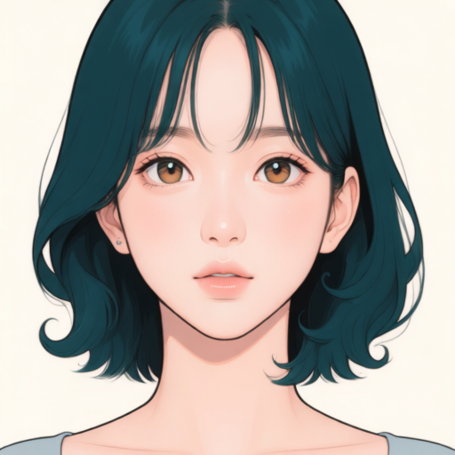 | 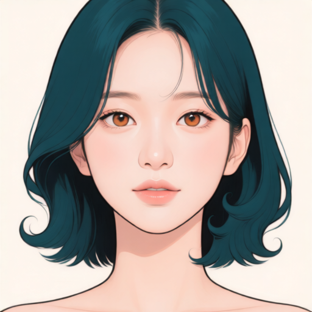 |

**정면 한 장을 100스텝 반복한 시험에서는 청록색 머리가 나타났고, 아래 40장 고정 비교의 A100 정면에서는 나타나지 않았다.** 한 장 시험에서도 앞머리·눈 모양·홍채색 차이가 남아 동일 인물 재현 성공으로 판정하지 않는다. 두 결과를 비교할 때는 먼저 목표별 반복량의 큰 차이를 보아야 한다. 두 생성의 평가 입력·프롬프트·시드·추론 설정은 같지만, LoRA 학습의 목표 수·목표별 반복량·캡션·참조 내용은 다르다. 이 비교만으로 단색 참조가 개선 원인이라고 결론 내릴 수 없으며, 이미지 수나 반복량만의 효과라고 확정할 수도 없다.

[100스텝 생성 기록 JSON](../../../assets/part-07/chapter-05/sec-11/memorization-evaluation/results/portrait-step100-result.json)

[200스텝 생성 기록 JSON](../../../assets/part-07/chapter-05/sec-11/memorization-evaluation/results/portrait-step200-result.json)

[암기 시험 검수 JSON](../../../assets/part-07/chapter-05/sec-11/memorization-evaluation/results/review.json)

한 장의 외형을 집중 학습할 수 있다는 관찰과, 40장의 자료에서 새 장면의 인물을 유지할 수 있다는 판단은 구분한다. 참조 효과를 살펴보는 근거는 아래의 별도 40장 고정 A/B 비교다.

### A/B를 100·200·400·800·1600스텝에서 비교한다

**목표 40장을 고정하고 학습 참조 A/B와 학습량을 함께 비교한다.** A는 목표마다 다른 Mira 이미지를 참조하고, B는 외형 정보가 없는 단색 이미지를 참조한다. 목표·평가 분할 40/4장, 캡션·순서·참조 대응, 학습률·rank·시드·기반 모델을 유지한다. 참조 변경은 VAE와 Qwen-VL 경로에 모두 적용하며 정면 1장 암기 시험은 통합 A/B 비교에서 제외한다.

평가는 각 스텝의 정면·카페·정원 3개 장면으로 구성해 총 30장이다. 같은 단색 입력·프롬프트·시드·512×512·20 추론 스텝·CFG 4·LoRA 강도 1을 사용한다. 기준 얼굴은 검수용이며 모델 입력에 넣지 않는다. 배치 1에서 장당 평균 반복량은 100·200·400·800·1600스텝 순서대로 2.5·5·10·20·40회다.

100·200·400은 각 A/B의 400스텝 학습에서 저장한 결과다. 800·1600은 옵티마이저 재개 상태가 없어 같은 설정으로 기반 모델에서 새로 시작한 각 1600스텝 학습에서 저장한다. **전체 다섯 지점이 하나의 연속 학습 과정에서 나온 것은 아니다.** 스텝 구간과 실행 경계를 함께 기록한다.

실제로 실행한 패키지를 다시 읽어 목표 40장의 순서·캡션과 전체 학습 설정이 같은지 확인했다. 학습 명령도 실행 폴더 경로를 제외하면 동일하다. A는 학습 목표마다 다른 Mira 참조를 사용해 고유 참조 40개이며, B는 단색 참조 하나를 공통으로 사용한다. 아래는 첫 학습 행의 실제 목표와 참조다. 두 조건의 캡션은 모두 `Illustrate mira_person, front view, wearing a gray cropped top, with a quiet library with bookshelves in the background.`이다.

| 공통 학습 목표 · 첫 행 | A의 실제 학습 참조 | B의 실제 학습 참조 |
| --- | --- | --- |
|  | 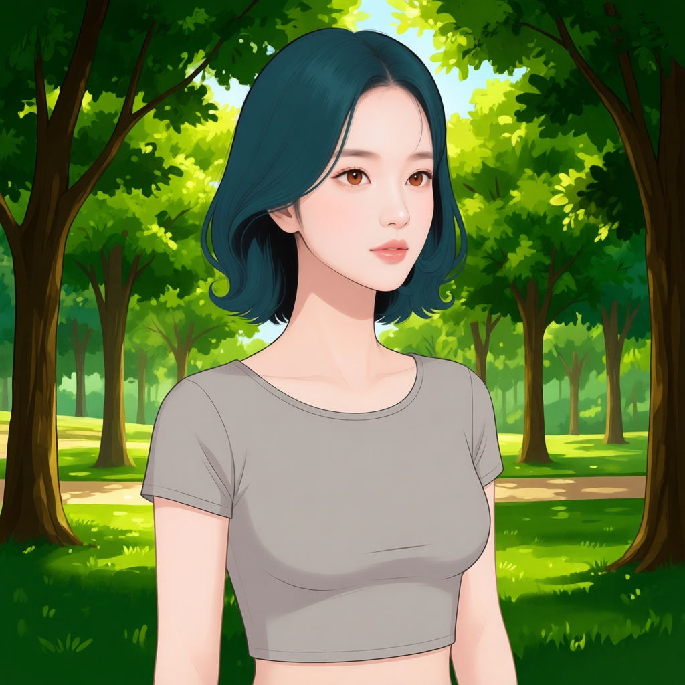 | 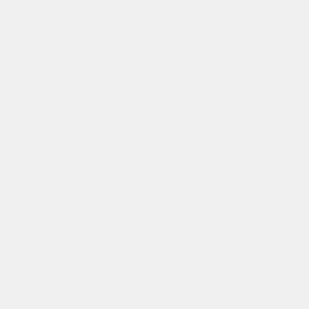 |

[실행 패키지 대조 JSON](../../../assets/part-07/chapter-05/sec-11/neutral-ablation-evaluation/results/executed-comparison-audit.json)

[전체 목표·A/B 참조 대응 JSON](../../../assets/part-07/chapter-05/sec-11/neutral-ablation-evaluation/results/training-pair-comparison.json)

[A 실제 학습 입력 JSONL](../../../assets/part-07/chapter-05/sec-11/neutral-ablation-evaluation/results/A-training/train.jsonl)

[B 실제 학습 입력 JSONL](../../../assets/part-07/chapter-05/sec-11/neutral-ablation-evaluation/results/B-training/train.jsonl)

[A 400스텝 학습 실행 기록 JSON](../../../assets/part-07/chapter-05/sec-11/neutral-ablation-evaluation/results/A-training/run-result.json)

[B 400스텝 학습 실행 기록 JSON](../../../assets/part-07/chapter-05/sec-11/neutral-ablation-evaluation/results/B-training/run-result.json)

100·200·400의 18장 생성·해시 대조·AI 시각 검수는 완료했다. 800·1600의 12장은 체크포인트와 평가 생성 대기다. 장기 학습은 A 다음 B 순서이며, 패키지는 `.tmp/p7-5-11/lora-a-run1600/`와 `.tmp/p7-5-11/lora-b-run1600/`, 실행 상태는 `.tmp/p7-5-11/long-training-state.json`에서 확인한다.

[통합 A/B 비교 계획 JSON](../../../assets/part-07/chapter-05/sec-11/p7-5-11-ab-comparison-plan.json)

[전체 30장 결과·대기 목록 JSON](../../../assets/part-07/chapter-05/sec-11/checkpoint-matrix-evaluation/results/index.json)

[완료된 100·200·400 검수 JSON](../../../assets/part-07/chapter-05/sec-11/checkpoint-matrix-evaluation/results/review.json)

[800·1600스텝 학습 계획 JSON](../../../assets/part-07/chapter-05/sec-11/p7-5-11-long-training-plan.json)

[A 1600스텝 설정 JSON](../../../assets/part-07/chapter-05/sec-11/p7-5-11-a-run1600-config.json)

[B 1600스텝 설정 JSON](../../../assets/part-07/chapter-05/sec-11/p7-5-11-b-run1600-config.json)

[지정 체크포인트 평가 코드](../../../assets/part-07/chapter-05/sec-11/p7_5_11_evaluate_lora.py)

800·1600스텝은 가중치 저장 완료와 SHA-256을 확인한 뒤 위 코드의 `--checkpoint`, `--checkpoint-sha256`, `--scales 1`로 같은 세 장면을 생성한다. 각 출력과 원본 생성 기록은 `checkpoint-matrix-evaluation/`에 모아 동일 결과 목록에서 추적한다. 아직 없는 결과는 대기로 표시하고 품질을 판정하지 않는다.

### 장면별로 같은 스텝의 A와 B를 대조한다

**정면**

| 학습 스텝 | A · Mira 참조 | B · 단색 참조 |
| --- | --- | --- |
| 100 | 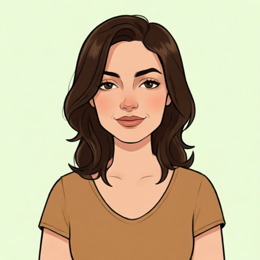 | 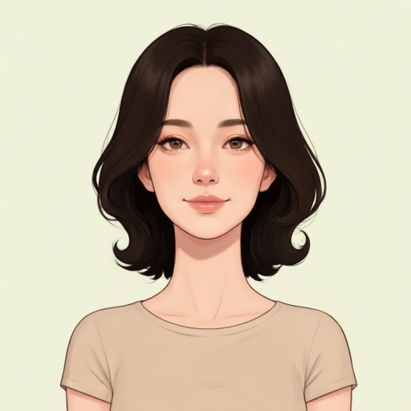 |
| 200 | 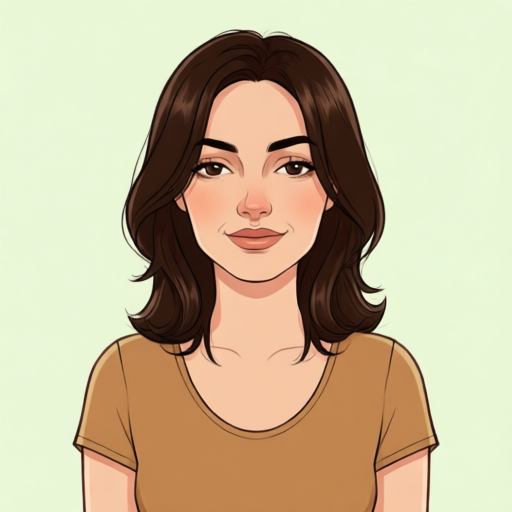 | 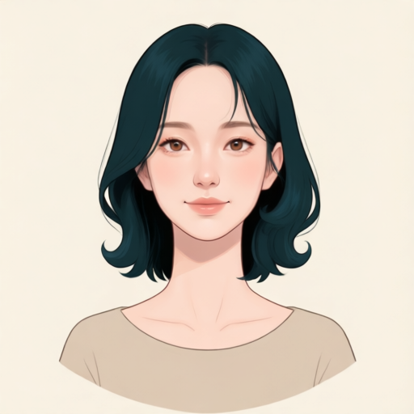 |
| 400 | 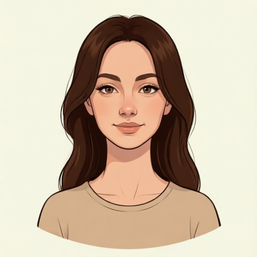 | 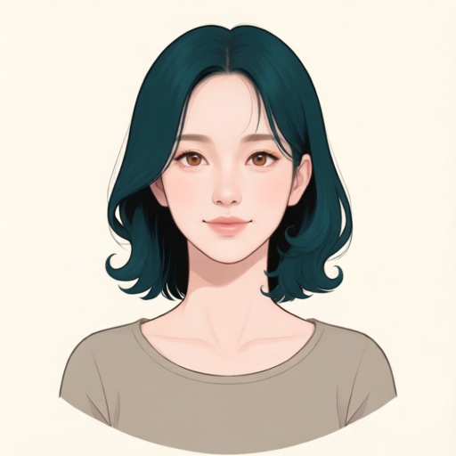 |
| 800 | 체크포인트·평가 생성 대기 | 체크포인트·평가 생성 대기 |
| 1600 | 체크포인트·평가 생성 대기 | 체크포인트·평가 생성 대기 |

**카페**

| 학습 스텝 | A · Mira 참조 | B · 단색 참조 |
| --- | --- | --- |
| 100 | 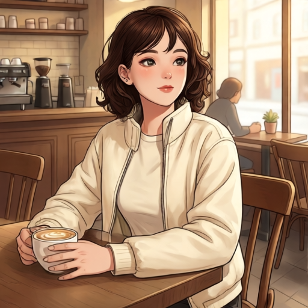 | 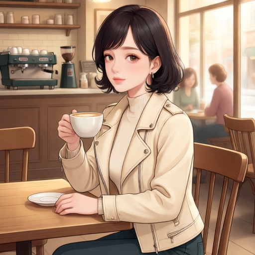 |
| 200 | 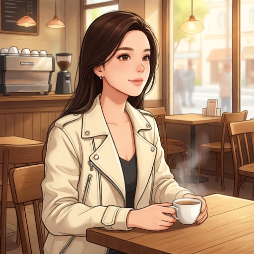 | 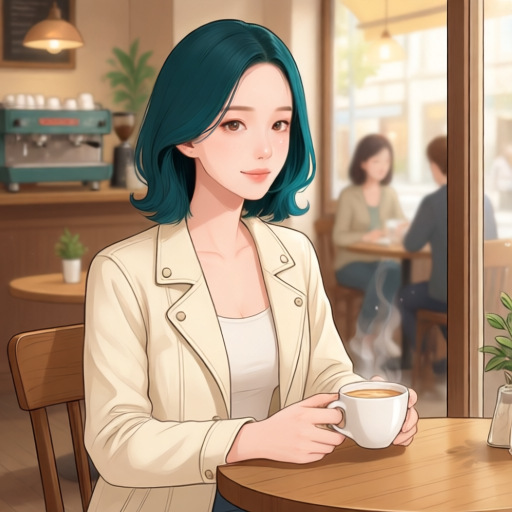 |
| 400 | 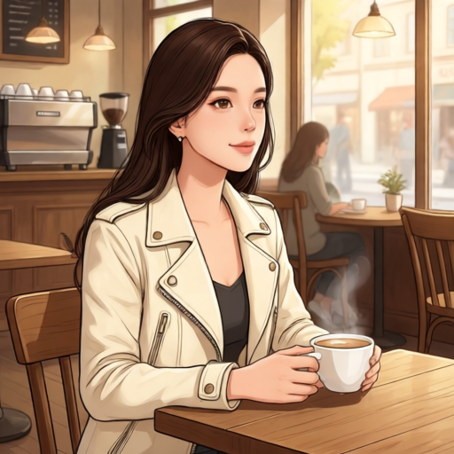 | 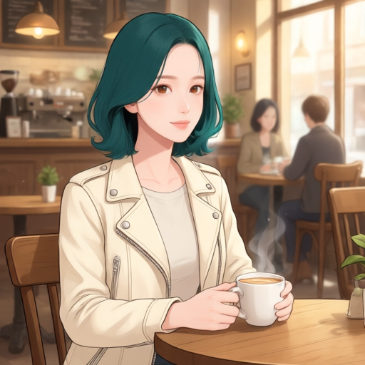 |
| 800 | 체크포인트·평가 생성 대기 | 체크포인트·평가 생성 대기 |
| 1600 | 체크포인트·평가 생성 대기 | 체크포인트·평가 생성 대기 |

**정원**

| 학습 스텝 | A · Mira 참조 | B · 단색 참조 |
| --- | --- | --- |
| 100 | 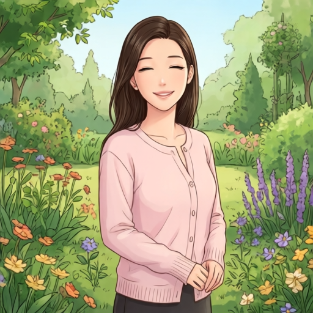 | 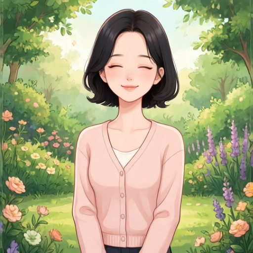 |
| 200 | 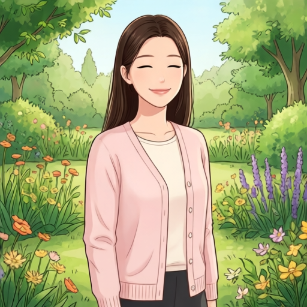 | 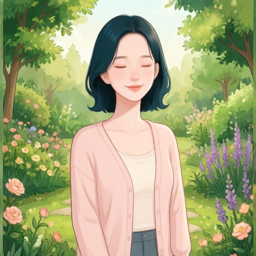 |
| 400 | 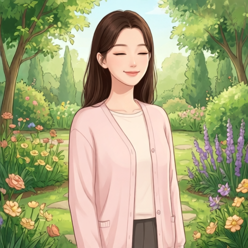 | 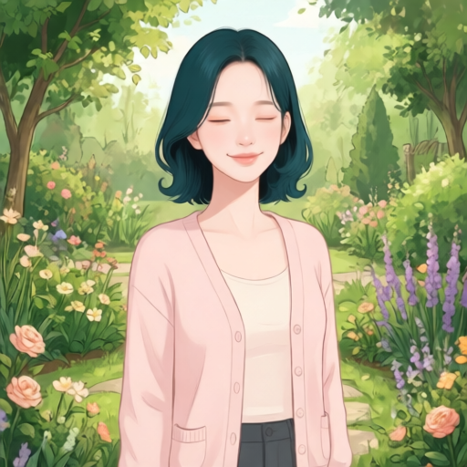 |
| 800 | 체크포인트·평가 생성 대기 | 체크포인트·평가 생성 대기 |
| 1600 | 체크포인트·평가 생성 대기 | 체크포인트·평가 생성 대기 |

100·200·400에서 A는 갈색 머리가 남았다. B100은 짙은 갈색~검은 단발이며, B200부터 세 장면에 청록색 단발이 나타난다. B200과 B400의 얼굴·헤어·피부 표현은 대체로 비슷하고 차이는 세부적이다. **B의 일부 특징 개선을 관찰했지만, 검수한 18장 모두 동일 인물 재현 목표에는 미달한다.** 보이는 홍채·눈매·입술·얼굴 비례와 헤어 세부가 기준과 다르다.

카페의 크림색 재킷·컵과 정원의 분홍 카디건·배경은 대체로 지시를 따른다. 정원은 모두 눈을 감아 홍채를 판정할 수 없고, 일부는 사선보다 정면에 가깝다. A100 정원은 입을 다문 미소 지시와 달리 치아가 보인다.

800·1600에서는 A도 Mira의 특징이 나타나는 단계에 도달하는지, 같은 스텝의 B와 어떤 차이가 있는지 살핀다. 머리색·헤어 형태·보이는 홍채·얼굴 비례·피부색·지시 준수를 나누어 검수하고, 특징이 처음 나타나는 시점과 충분한 정체성 품질에 도달하는 시점을 구분한다. 한 학습 시드의 비맹검 질적 비교이므로 참조 방해·의존·학습과 평가 입력 차이는 가설로 남긴다. 참조와 학습량 중 어느 쪽의 영향이 더 큰지도 아직 확정하지 않는다.

### 최종 판정은 편집 어댑터의 사용 조건에서 확인한다

이 LoRA는 **Qwen-Image-Edit-2511에 로드하는 캐릭터 어댑터**로 사용한다. 단색 입력 비교는 얼굴 참조 없이 학습한 특징이 나타나는지 보는 진단이다. 실제 장면 이미지를 편집할 때 Mira의 얼굴·헤어와 요청한 변경을 표현하고, 유지할 배경·구도 등을 보존하는지는 이번 실험에서 평가하지 않았다. 따라서 단색 진단의 일부 개선만으로 실사용 어댑터를 채택하지 않는다. 실제 편집 입력에서 동일 조건의 미적용·적용 비교가 별도로 필요하다.

## 체크리스트

- 5.2·5.9의 자료에서 얼굴·헤어가 유지된 후보와 원고 비교용 실패 사례를 구분했는가?
- 캐릭터 식별 문구와 바뀌는 표정·방향·배경을 나누어 기술했는가?
- 선택한 학습기의 참조·지시·목표 이미지 구성을 확인했는가?
- 검증 그룹을 학습 목표와 참조 양쪽에서 제외했는가?
- LoRA 미적용과 같은 조건으로 비교하고 새 장면의 편집 가능성도 확인하는가?
- 실제 학습·저장·재적용 기록과 아직 실행하지 않은 설계를 구분했는가?

## 출처와 참고 자료

- Edward J. Hu et al., [LoRA: Low-Rank Adaptation of Large Language Models](https://arxiv.org/abs/2106.09685){: target="_blank" rel="noopener noreferrer" }, arXiv, 2021. 기반 가중치 고정과 추가 행렬 학습의 원리. 확인일: 2026-09-12.
- Qwen, [Qwen-Image-Edit-2511 모델 카드](https://huggingface.co/Qwen/Qwen-Image-Edit-2511){: target="_blank" rel="noopener noreferrer" }, Hugging Face. 이번 학습·적용의 기반 모델. 확인일: 2026-09-12.
- kohya-ss, [Musubi Tuner Qwen-Image 안내](https://github.com/kohya-ss/musubi-tuner/blob/main/docs/qwen_image.md){: target="_blank" rel="noopener noreferrer" }, GitHub. Edit-2511 지원과 모델별 실행 구분. 확인일: 2026-09-12.
- kohya-ss, [Musubi Tuner 데이터 설정](https://github.com/kohya-ss/musubi-tuner/blob/main/docs/dataset_config.md){: target="_blank" rel="noopener noreferrer" }, GitHub. 제어 이미지·목표 이미지 구성과 참조 전처리. 확인일: 2026-09-12.

후보 선정·참조 쌍 구성·식별 문구·시작 설정·평가 설계는 이 책의 Mira 실험을 위한 작업 가설이다. 출처의 모델 지원 안내가 해당 데이터나 8GB 학습의 성공을 보장하지는 않는다.
