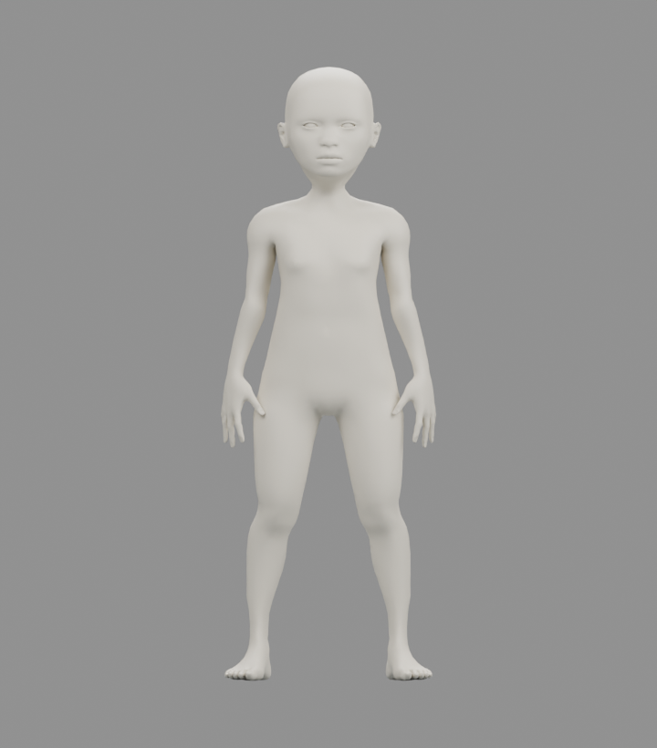
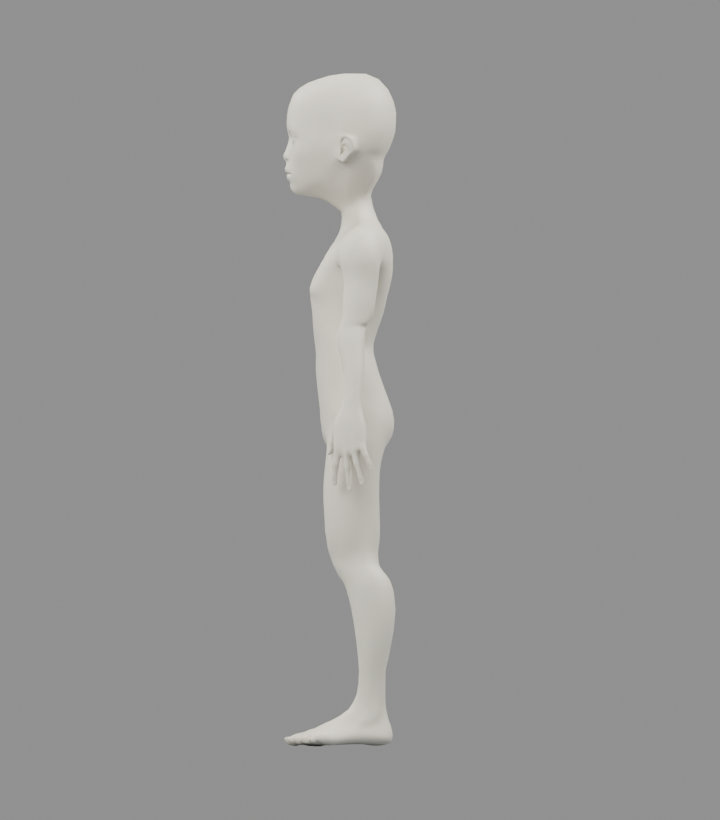
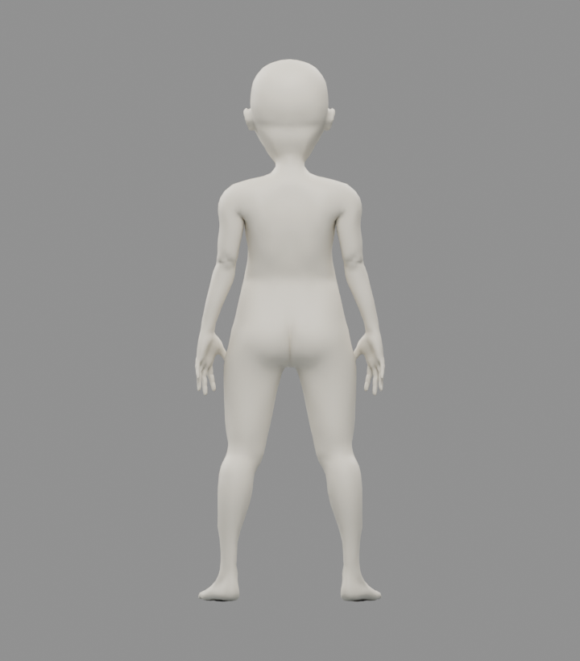
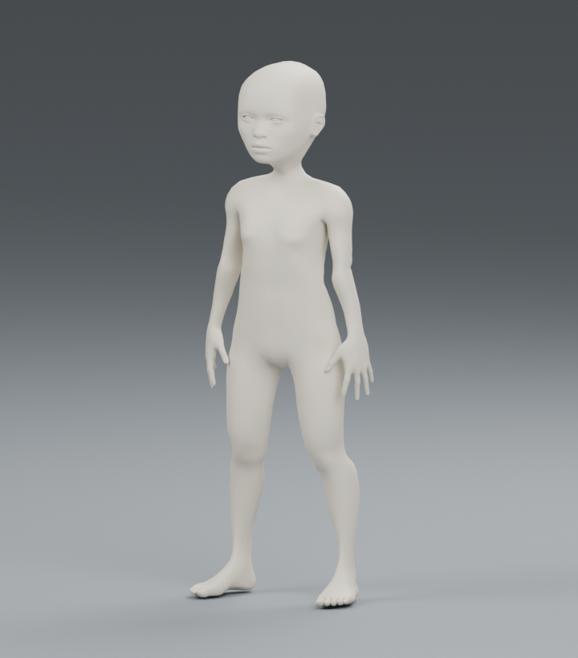
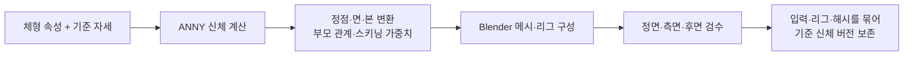

# P7-5.11 보충학습: ANNY로 애니메이션용 신체 모델 확보하기

> Section ID: `P7-5.11`
> Version: `v2026.09.28`

캐릭터가 움직일 때 팔과 다리의 모양을 유지하려면 움직임을 적용할 몸체가 먼저 필요하다. 여기서는 **ANNY로 체형을 조절하고, 표면·골격·변형 가중치를 갖춘 3D 신체 모델을 확보하는 과정**을 살펴본다. 앞서 만든 캐릭터 이미지와 연결할 수 있는 구조적 기준을 준비하는 단계다. 걷기를 생성하는 MoMask와 신체 모델에 움직임을 옮기는 작업은 그다음에 이어진다.

## 1. ANNY는 수치로 체형과 자세를 조절하는 인체 모델이다

ANNY는 NAVER가 공개한 PyTorch 기반의 매개변수형 인체 메시 모델이다. ‘매개변수형’은 체형이나 자세를 나타내는 수치를 바꾸면 그에 맞는 3D 표면이 계산된다는 뜻이다. MakeHuman의 체형 표현을 바탕으로 다양한 연령대와 신체 비례를 공통 구조로 표현한다. 논문은 이를 해석 가능한 체형 공간으로 설명한다. [ANNY 논문](https://arxiv.org/abs/2511.03589){: target="_blank" rel="noopener noreferrer" }

ANNY가 만드는 몸을 이해하려면 세 요소를 구분하면 된다.

| 요소 | 쉬운 설명 | 신체 모델에서 맡는 역할 |
| --- | --- | --- |
| 메시(mesh) | 작은 면으로 이어진 피부 표면 | 몸의 윤곽과 부피를 표현한다. 면의 꼭짓점을 정점이라고 한다. |
| 골격·본(bone) | 몸을 움직이기 위한 연결된 조절 축 | 팔·다리·몸통의 자세와 부모·자식 관계를 표현한다. |
| 스키닝 가중치 | 각 정점이 어느 본을 얼마나 따라갈지 정한 값 | 관절을 굽힐 때 표면도 함께 변형되게 한다. |

이 요소를 묶어 움직일 수 있도록 구성한 것을 **리그(rig)**라고 한다. 표면만 저장하면 몸의 모양은 남지만 관절을 움직여 변형시키는 연결이 빠질 수 있다. 애니메이션용 신체를 확보할 때는 표면과 골격, 가중치를 함께 보존해야 한다.

공식 ANNY의 기본 `anny` 리그는 104개 본을 사용한다. 체형을 조절하는 입력과 본의 자세 입력, 얼굴 표정 입력은 별도로 제공된다. 이 절에서 확인한 제작 코드도 ANNY 0.6.0의 `anny` 리그와 토폴로지, `local-ref` 자세 표현을 사용했다. 토폴로지는 정점과 면이 연결된 구조이며, 자세 표현은 본 변환을 해석하는 규칙이다. [ANNY 공식 구현](https://github.com/naver/anny){: target="_blank" rel="noopener noreferrer" }

## 2. 체형과 자세를 분리해 기준 신체를 만든다

먼저 서 있는 기준 자세를 고정하고 원하는 체형을 조절한다. 이렇게 해야 팔을 들어 생긴 윤곽 변화와 어깨 너비 자체의 변화를 혼동하지 않는다. 검토한 생성기는 다음 입력을 구분해서 받는다.

| 입력 | 조절하는 대상 | 주의할 해석 |
| --- | --- | --- |
| `phenotype_kwargs` | 키·체중·근육 등 전체 체형의 표현 축 | 정규화된 조절값을 실제 cm·kg·나이로 읽지 않는다. |
| `local_changes_kwargs` | 머리·몸통·사지 등 특정 부위의 형태 | 변형 강도 0.5가 길이 50% 증가라는 뜻은 아니다. |
| `facial_actions` | 얼굴 표정의 변형 | 체형 기준과 표정 효과를 나누어 확인한다. |
| `pose_parameters` | 각 본의 자세 변환 | 체형을 비교할 때 같은 기준 자세를 유지한다. |

실제 작업은 전체 비례를 먼저 맞춘 뒤 필요한 부위를 조절하는 순서로 진행한다. 예를 들어 머리가 큰 마네킹을 만들려면 머리의 크기와 몸통·사지 비례를 조절하고, 정면에서는 너비를, 측면에서는 머리와 몸통의 깊이를 확인한다. 정면 윤곽만 맞추면 옆에서 지나치게 납작하거나 두꺼운 몸이 될 수 있다.

확인한 생성기는 속성 이름과 수치 범위, 중복 필드, 본 목록, 자세 행렬의 유한값과 회전 조건을 검사한다. 일반 범위와 별개로 일부 머리 확대 속성에는 제작 코드가 허용한 확장 범위가 있다. 이것은 해당 제작 구현의 선택이며 ANNY 전체 입력의 보편적인 권장값은 아니다. 입력 검사를 통과한 것도 체형의 자연스러움을 보장하지 않으므로 다방향 검수는 별도로 필요하다.

### 실제 기준 체형의 설정과 다방향 모습

아래는 `slime-workflow`에 등록된 `anny-neutral-v4`의 실제 검수 이미지 사본이다. 같은 몸체와 기본 자세를 카메라 방향만 바꾸어 보여 준다. 새로 생성하거나 비례를 편집한 이미지가 아니다.

| 정면 | 측면 |
| --- | --- |
|  |  |

| 후면 | 사선 |
| --- | --- |
|  |  |

정면에서는 머리와 어깨의 너비, 손과 몸통의 간격, 다리의 벌어짐을 볼 수 있다. 측면에서는 머리의 앞뒤 깊이, 몸통과 골반의 곡선, 발의 길이를 확인한다. 사선은 팔과 몸통이 얼마나 분리되어 보이는지 살피는 데 도움이 된다. 이 마네킹의 비례는 해당 제작 사례의 선택이지 평균 인체나 모든 캐릭터에 맞는 표준이 아니다.

실제 입력 중 일부는 다음과 같다. 이름의 `incr`나 숫자는 모델의 변형 축을 가리키므로 배율·실측치와 구분한다.

| 설정 | 실제 값 | 읽는 방법 |
| --- | --- | --- |
| 전체 체형 `age`, `weight`, `height` | 0.45, 0.4, 0 | 모델의 조절 좌표다. 45세·40kg·키 0m라는 뜻이 아니다. |
| 머리 가로·깊이 조절 | 각각 2.5 | 이 제작 코드의 확장 범위를 사용했다. 머리 길이 2.5배를 보장하지 않는다. |
| 머리 세로 조절 | 1.5 | 가로·깊이와 별도로 조절한 값이다. |
| 위·아래 다리 길이 조절 | 각각 0.7 | 한 부위만 늘리지 않고 두 구간을 함께 조절한 사례다. |
| 좌우 손·발 크기 조절 | 각각 0.5 | 양쪽에 같은 값을 적용했다. 모션의 좌우 대칭을 보장하는 값은 아니다. |

전체 입력은 아래의 체형 설정 파일에 남겼다. 생성 기록의 원본 높이는 약 1.30261이고, Blender에서는 약 1.2283배로 균일 확대해 1.6m 기준에 맞췄다. 이런 전체 크기 정리는 위 표의 부위별 체형 조절과 별도의 처리다.

## 3. 생성한 표면과 골격을 함께 Blender로 옮긴다


```mermaid
flowchart LR
    A["체형 속성 + 기준 자세"] --> B["ANNY 신체 계산"]
    B --> C["정점·면·본 변환\n부모 관계·스키닝 가중치"]
    C --> D["Blender 메시·리그 구성"]
    D --> E["정면·측면·후면 검수"]
    E --> F["입력·리그·해시를 묶어\n기준 신체 버전 보존"]
```

로컬 생성기는 ANNY에서 얻은 정점과 면, 본의 변환 행렬, 본 이름·부모 관계, 정점별 본 인덱스와 가중치를 `anny-rest-rig.npz`에 저장한다. 이 파일은 이미지가 아니라 몸체를 다시 구성할 수 있는 수치 묶음이다. Blender에서는 표면 메시와 골격을 만들고 본 이름에 대응하는 정점 그룹에 원래 가중치를 연결한다.

옮길 때는 **표면과 골격에 같은 좌표 변환**을 적용해야 한다. 검토한 구현은 가장 낮은 정점을 바닥에 맞추고, 신체 전체 높이가 1.6m가 되도록 정점과 본 위치를 같은 비율로 조정한다. 1.6m는 이 작업의 출력 기준이다. ANNY가 항상 그 키의 몸을 만든다는 뜻이 아니며, 전체를 같은 비율로 줄이거나 늘리는 처리와 머리·다리 비례를 바꾸는 체형 편집은 다르다.

저장 형식에서도 위쪽 축을 구분한다. 확인한 자산 기록에서 원 NPZ와 Blender 파일은 Z축이 위이고, GLB는 glTF의 Y축 위 규칙을 따른다. 파일을 다른 도구로 가져온 뒤 눕거나 크기가 달라지면 체형을 다시 편집하기 전에 축·단위·변환 적용 여부부터 확인한다.

## 4. 기준 신체는 이미지 한 장이 아니라 재사용 묶음이다

| 보존 항목 | 필요한 이유 |
| --- | --- |
| 체형·표정·기준 자세 입력 | 어떤 수치로 몸을 만들었는지 다시 확인한다. |
| 원본 리그 수치 묶음 | 정점·본·가중치가 변환 전후 일치하는지 대조한다. |
| Blender `.blend` | 표면과 골격을 함께 열어 검수·편집한다. |
| 전달용 `.glb` | 다른 뷰어나 실행 환경에서 가져오기 결과를 확인한다. |
| 정면·측면·후면·사선 이미지 | 비례·깊이·좌우 모양을 같은 조건에서 비교한다. |
| 모델 버전·속성 해시·파일 해시 | 이후 모션 실험에서 같은 몸체를 사용했는지 추적한다. |

2026년 9월 27일 확인한 제작 저장소의 선택 설정은 `neutral_v4` 기준 신체를 가리켰다. 등록 기록에는 ANNY 0.6.0, 104본, 27,420개 삼각형, 출력 높이 1.6m가 기재되어 있다. 검증 기록은 한 프레임의 기본 자세에 대해 `rest_max_error` 약 1.79×10⁻⁷, 가중치 합 최대 오차 약 1.19×10⁻⁷을 보고한다. 이는 **기준 자세의 수치 일치와 가중치 연결을 확인한 기록**이다. 걷거나 팔을 굽혔을 때도 변형이 자연스럽다는 판정은 아니다.

이 절은 기존 생성기·등록 자산·검증 기록을 읽어 확보 과정을 정리했다. ANNY 모델에서 몸체를 새로 추론하거나 애니메이션 변형 검사를 실행한 것은 아니다. 아래 예제에서는 보존된 수치 데이터를 이용한 Blender 리그 재구성과 저장만 별도로 검증했다. 기준 신체를 후속 작업에 쓸 때는 팔꿈치·무릎·어깨를 움직여 표면이 찢어지거나 다른 부위를 끌어당기는지 확인하고, GLB를 다시 가져와 본과 크기가 유지되는지도 별도로 확인한다.

### 확보한 Blender 리그를 직접 확인하기

이미지뿐 아니라 **실제 Blender 리그와 전달용 GLB를 이 책의 자산 경로에 사본으로 보존했다.** 원본과 사본의 SHA-256을 대조했으며 다른 저장소를 실행 중 참조하지 않아도 파일을 내려받을 수 있다.

| 파일 | 사본과 확인할 내용 |
| --- | --- |
| Blender 작업 파일 | [anny-raw-rig.blend](../../../assets/part-07/chapter-05/sec-11/anny-neutral-v4/anny-raw-rig.blend) — 메시·Armature·정점 그룹·기본 장면을 함께 확인한다. |
| 전달용 리그 | [anny-raw-rig.glb](../../../assets/part-07/chapter-05/sec-11/anny-neutral-v4/anny-raw-rig.glb) — 다른 3D 도구에서 불러올 수 있는 메시와 스킨·본 연결이다. |
| 원본 수치 | [anny-rest-rig.npz](../../../assets/part-07/chapter-05/sec-11/anny-neutral-v4/anny-rest-rig.npz) — 변환 전 정점·면·본·부모 관계·가중치·인덱스를 담는다. |
| 체형과 기본 자세 | [attributes.json](../../../assets/part-07/chapter-05/sec-11/anny-neutral-v4/attributes.json) — 이 몸체를 만든 입력값이다. |
| 생성·검증 기록 | [generation.json](../../../assets/part-07/chapter-05/sec-11/anny-neutral-v4/generation.json) · [validation.json](../../../assets/part-07/chapter-05/sec-11/anny-neutral-v4/validation.json) — 원본 생성 및 기본 자세 검증 당시의 기록이다. |

Blender 파일을 열면 Outliner에서 메시와 Armature를 찾고, 메시의 Armature 모디파이어가 해당 골격을 가리키는지 확인한다. 정점 그룹의 본 이름과 골격 이름도 대조한다. 자세를 시험할 때는 원본 사본을 덮어쓰지 말고 별도 파일에서 팔꿈치·무릎을 조금씩 굽혀 표면 변형을 살핀다. 마지막으로 GLB를 빈 장면에 가져와 방향·크기·본 연결을 대조하면 저장 단계에서 정보가 빠졌는지 확인할 수 있다.

원고 보강 때 파일 구조를 읽어 확인한 NPZ에는 정점 13,718개, 삼각형 27,420개, 104개의 4×4 본 행렬이 들어 있다. 정점별 가중치와 본 인덱스는 각각 `(13718, 9)` 크기다. 이는 정점마다 본 영향 정보를 저장하는 슬롯이 9개라는 뜻이며 모든 슬롯의 가중치가 양수라는 의미는 아니다. GLB에는 스킨 1개와 그에 연결된 104개 관절이 있고 **애니메이션 클립은 없다.** 따라서 이 파일은 걷기 영상의 완성본이 아니라 동작을 적용할 수 있는 기준 신체다.

기존 검증 코드의 `rest_max_error`는 Blender에서 리그를 적용한 기본 자세 정점과 변환된 원본 정점의 최대 성분 차이다. 코드에서는 이 값이 10⁻⁵보다 크면 실패한다. 가중치 합 오차는 각 정점에 배정된 가중치의 합이 1에서 얼마나 벗어났는지 기록한 값이며, 같은 코드에 별도의 실패 임계값이 있는 것은 아니다. 이번 확인은 파일 해시·NPZ·GLB 구조 점검이며 Blender 변형 검사를 새로 실행한 결과는 아니다.

### 속성 JSON으로 신체를 다시 생성하는 코드

위 사본을 여는 것과 입력값에서 새 몸체를 생성하는 것은 구분한다. 다음 예제는 `slime-workflow`의 기능을 참고해 이 책 안에서 독립적으로 작성했다. [속성 JSON 사본](../../../assets/part-07/chapter-05/sec-11/anny-neutral-v4/attributes.json)은 그대로 입력으로 사용할 수 있고, 두 Python 파일을 같은 폴더에 두면 된다.

- [generate_body.py](../../../assets/part-07/chapter-05/sec-11/code/generate_body.py): 입력 검사 → ANNY 계산 → 원본 NPZ 저장 → Blender 변환 호출 → 실행 기록 저장.
- [export_blender.py](../../../assets/part-07/chapter-05/sec-11/code/export_blender.py): NPZ를 메시·본·가중치로 조립하고 기준 자세를 검사한 뒤 `.blend`와 `.glb` 저장.

생성용 환경은 ANNY 0.6.0·NumPy·CUDA 사용이 가능한 PyTorch가 필요하다. Blender 변환은 별도 Python 3.11 환경의 `bpy==4.5.3`·NumPy를 사용한다. 예를 들어 저장소 루트에서 전용 환경을 다음처럼 준비할 수 있다. PyTorch는 장비의 드라이버와 CUDA 조건에 맞춰 별도로 설치한다. 최초 ANNY 실행에는 모델 데이터 다운로드가 필요할 수 있으며 `--cache-dir`로 저장 위치를 지정한다.

```bash
python3.12 -m venv .venv-anny
.venv-anny/bin/python -m pip install anny==0.6.0 numpy
python3.11 -m venv .venv-anny-blender
.venv-anny-blender/bin/python -m pip install bpy==4.5.3 numpy
```

먼저 생성 없이 입력을 검사한다. 이 검사는 필드·값 범위·104본 자세 행렬을 확인하며 모델의 실제 속성 라벨과 CUDA·Blender 실행 가능 여부까지 검사하지는 않는다.

```bash
.venv-anny/bin/python docs/assets/part-07/chapter-05/sec-11/code/generate_body.py \
  --attributes docs/assets/part-07/chapter-05/sec-11/anny-neutral-v4/attributes.json \
  --cache-dir .tmp/anny-cache \
  --output-dir .tmp/anny-body-example \
  --dry-run
```

실제 생성은 같은 명령에서 `--dry-run`을 빼고 Blender용 Python을 지정한다.

```bash
.venv-anny/bin/python docs/assets/part-07/chapter-05/sec-11/code/generate_body.py \
  --attributes docs/assets/part-07/chapter-05/sec-11/anny-neutral-v4/attributes.json \
  --cache-dir .tmp/anny-cache \
  --output-dir .tmp/anny-body-example \
  --blender-python .venv-anny-blender/bin/python \
  --height 1.6
```

결과 폴더에는 입력 사본, `anny-rest-rig.npz`, `body.blend`, `body.glb`, `validation.json`, `result.json`, Blender 로그가 남는다. 기존 출력 폴더가 있으면 실패하므로 재실험에는 새 경로를 쓴다. 이 예제는 리그 확보까지 담당하며 앞에 제시한 조명·카메라 검수 이미지를 다시 렌더링하지 않는다. 기존 이미지 사본과 새 생성 결과를 혼동하지 않는다.

체형 변화 실험은 속성 파일을 별도로 복사해 `local_changes_kwargs`의 한 항목만 바꾸는 것으로 시작한다. 기준 자세와 출력 높이를 고정한 채 머리 가로 조절값을 줄이고 Blender 정면·측면에서 원래 신체와 비교해 보자. 전체 높이는 같아도 머리 비례가 바뀌는지 확인하면 균일 크기 조정과 체형 편집의 차이를 볼 수 있다.

이번 코드 검증에서는 속성 사본의 입력 검사와 기존 NPZ를 이용한 Blender 리그·GLB 저장을 실행했다. 새 코드의 두 오차 검사 기준은 모두 10⁻⁵이며, 기존 제작 코드에서 가중치 합 오차를 기록만 하던 것과 다르다. **ANNY GPU 추론부터 시작하는 전체 재생성은 이번에 실행하지 않았다.** 별도 저장한 [예제 검증 기록](../../../assets/part-07/chapter-05/sec-11/code/verification.json)은 기존 등록 자산의 생성 기록을 대체하지 않는다.

## 5. 신체 확보와 애니메이션 생성의 경계

ANNY로 확보한 것은 움직임을 적용할 수 있는 몸체다. 걷기 타이밍, 발 접촉, 좌우 팔다리의 교대는 별도의 모션이 담당한다. [5.12의 MoMask 모션](section-12.md)을 이 몸체에 적용하려면 두 골격의 관절 대응과 좌표계를 맞추는 리타기팅이 필요하다. MoMask의 22관절과 ANNY의 104본은 개수가 다르므로 같은 번호끼리 복사해서 해결할 수 없다.

3D 몸체가 있으면 카메라를 바꿔 같은 형상을 관찰하고, 메시의 앞뒤 관계에 따라 가림을 렌더링할 수 있다. 그러나 잘못된 관절 대응, 불완전한 모션, 부적절한 가중치까지 자동으로 고쳐 주지는 않는다. 또한 이번 마네킹 확보는 캐릭터의 얼굴 동일성·헤어·의상을 완성하거나 참조 이미지 속 인체를 정확히 복원한 결과가 아니다. 먼저 신체 구조를 고정하고, 모션과 캐릭터 외형을 연결하는 단계에서 각각 무엇이 유지되는지 확인한다.

## 체크리스트

- 메시·골격·스키닝 가중치가 각각 무엇을 담당하는지 설명할 수 있는가?
- 체형 조절값과 실제 키·체중, 기준 자세와 동작을 구분했는가?
- 표면과 본에 같은 축·크기 변환을 적용했는가?
- 정면뿐 아니라 측면·후면에서도 신체 비례를 확인했는가?
- 입력·리그·출력 파일의 버전과 해시를 함께 보존했는가?
- 기본 자세의 수치 검증을 애니메이션 품질 승인으로 확대하지 않았는가?

## 출처와 참고 자료

- NAVER, [ANNY 공식 구현과 입력·리그 안내](https://github.com/naver/anny){: target="_blank" rel="noopener noreferrer" }, 확인일: 2026-09-27.
- [Human Mesh Modeling for Anny Body](https://arxiv.org/abs/2511.03589){: target="_blank" rel="noopener noreferrer" }, ANNY의 체형 표현과 설계 배경, 확인일: 2026-09-27.
- 로컬 제작 사례: `slime-workflow`의 ANNY 속성 생성기·Blender 변환기와 `anny-neutral-v4` 등록·검증 기록, 확인일: 2026-09-27. 이미지·리그 사본과 [출처·해시 기록](../../../assets/part-07/chapter-05/sec-11/anny-neutral-v4/source-record.json)을 함께 보존한다.
