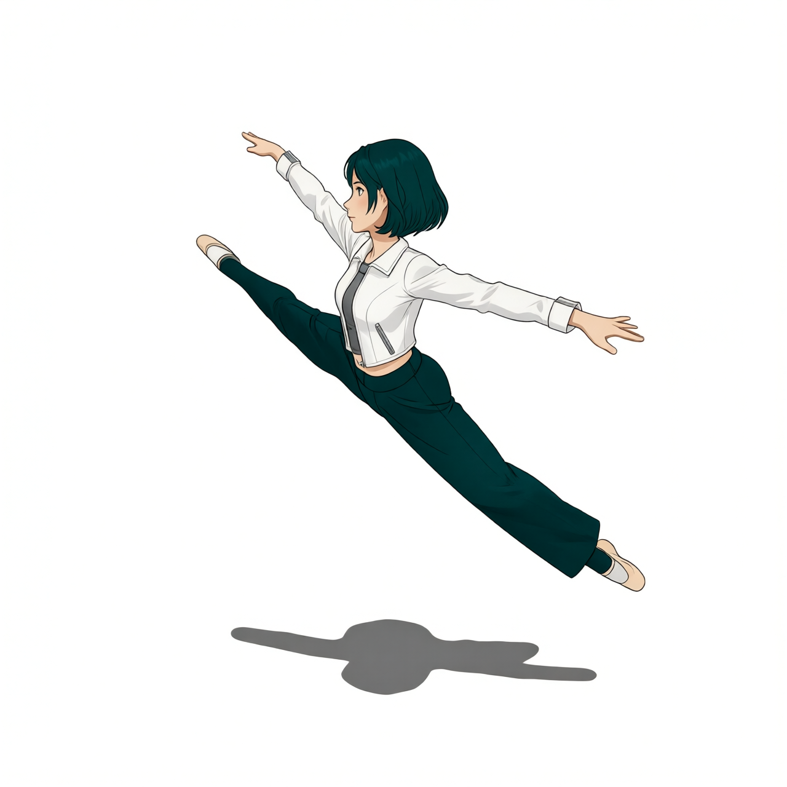

# P7-5.12 착장 추출과 Try-On LoRA: 별도 착장 이식 경로를 검수하기

> Section ID: `P7-5.12`
> Version: `v2026.09.03`

이 절은 포즈·프레이밍을 가진 인물에 의상만 다시 입히려 했던 별도 실험 경로를 기록한다. P7-5.5의 기본 경로는 Qwen Image Edit 2511 다중 참조로 포즈 기준 이미지와 캐릭터·착장 기준 이미지를 함께 넣는 방식이다. 여기서는 그 경로를 대체하지 않고, **착장을 흰 배경 기준물로 분리한 뒤 Try-On LoRA에 넣으면 무엇이 달라지는지**를 확인한다.

## 착장 추출은 인물 교체와 다른 작업이다

Xabsurd Clothing Extractor는 P7-5.3의 `-45°` 2단계 착장 이미지를 하나의 입력으로 받아, 사람·피부·배경 대신 의류와 신발을 흰 배경에 남기는 용도로 사용했다. 이 단계는 포즈를 보존하거나 캐릭터 identity를 이식하지 않는다. 이후 Try-On에서 참조할 수 있는 garment 기준물을 만드는 단계다. [Xabsurd Clothing Extractor 모델 카드](https://huggingface.co/Xabsurd/Clothing-Extractor){: target="_blank" rel="noopener noreferrer"}

| Xabsurd 착장·신발 추출 |
| --- |
|  |

[Xabsurd 추출 result.json — JSON — 원본 착장 입력, 추출 프롬프트와 2511 실행 조건 보기](/AiBook/assets/part-07/chapter-05/p7-5-4-qwen-2511-xabsurd-clothing-extractor-shoe-gear-v2-size-1280x1280-seed-62294-steps-10-result.json)

이 실행은 Qwen Image Edit 2511 직접 Diffusers 경로에서 1280×1280, seed `62294`, 10 step, true CFG `4.0`으로 만들었다. 결과 PNG와 JSON의 실행 파일명은 이미 생성 당시의 P7-5.4 식별자를 갖지만, 이 절에서는 그 기록을 P7-5.5 기본 경로와 구분한 착장 추출 실험의 근거로만 사용한다.

[Xabsurd 착장·신발 추출 코드 보기](../../../assets/part-07/chapter-05/p7_5_4_qwen_edit_2511_extract_outfit_gear.py)

## James와 FoxBaze의 입력 계약을 분리해 읽는다

JamesDigitalOcean Try-On은 Qwen Image Edit 2509에서 추출된 garment를 `Picture 1`, 옷을 받을 사람을 `Picture 2`로 넣고 `tryon_clothes dress the clothing onto the person` trigger를 사용한다. 이 절의 실행 코드는 해당 두 입력 순서와 adapter 이름 `tryonclothes`를 그대로 기록한다. [James Try-On 모델](https://huggingface.co/JamesDigitalOcean/Qwen_Image_Edit_Try_On_Clothes){: target="_blank" rel="noopener noreferrer"} · [공개 실행 예제](https://huggingface.co/spaces/JamesDigitalOcean/Qwen_Image_Edit_Try_On_Clothes/blob/main/app.py){: target="_blank" rel="noopener noreferrer"}

FoxBaze는 같은 두 이미지 편집 형식에서 별도 LoRA를 사용한 비교 경로다. 이 실험에서는 직접 이식된 인물을 `Picture 1`, Xabsurd 기준물을 `Picture 2`로 두고 2511·10 step으로 실행했다. 즉 James의 공식 입력 계약을 재현하는 코드와 FoxBaze의 결과 비교는 같은 이름의 작업이지만 입력 역할·모델·LoRA가 다르다.

| FoxBaze Scene A | FoxBaze Scene B |
| --- | --- |
|  |  |

[FoxBaze Scene A result.json — JSON — 두 입력과 2511·LoRA 실행 조건 보기](/AiBook/assets/part-07/chapter-05/p7-5-4-qwen-2511-tryon-foxbaze-scene-a-direct-v1-size-1280x1280-seed-62294-steps-10-result.json)

[FoxBaze Scene B result.json — JSON — 측면 인물·garment 입력과 실행 조건 보기](/AiBook/assets/part-07/chapter-05/p7-5-4-qwen-2511-tryon-foxbaze-scene-b-side-profile-direct-v1-size-1280x1280-seed-62294-steps-10-result.json)

[James Try-On 실행 코드 보기](../../../assets/part-07/chapter-05/p7_5_4_qwen_edit_2509_tryon_james.py)

[FoxBaze Try-On 실행 코드 보기](../../../assets/part-07/chapter-05/p7_5_4_qwen_edit_2511_tryon_foxbaze.py)

## 별도 Try-On은 기준 경로가 아니다

FoxBaze 결과에서는 재킷·이너·바지의 큰 색과 형태를 다시 부여할 수 있었지만, Scene B의 발은 발레 컷아웃 형태에 머물러 신발 기준까지 안정적으로 이식하지 못했다. 반대로 P7-5.5의 30 step 다중 참조는 포즈·그림자와 Stage 2 착장을 한 번에 유지했다. 따라서 이 절의 추출·Try-On은 garment 자산을 따로 검수하거나 모델별 입력 계약을 비교하는 보조 실험으로 남기며, 현재 컷신 생성의 기본 파이프라인으로 채택하지 않는다.

## 확인할 점

- 추출 이미지는 포즈 기준 이미지가 아니라 다음 Try-On의 garment 입력이다.
- James와 FoxBaze는 같은 "Try-On" 범주라도 모델·입력 역할·trigger가 다르므로 result.json을 함께 읽는다.
- 재킷·바지의 큰 특징이 보인다고 신발·손·포즈까지 보존됐다고 판단하지 않는다.
- P7-5.5의 다중 참조 결과와 비교할 때는 인물 수, 스플릿 점프, 그림자, 재킷·이너·바지, 신발을 각각 확인한다.
