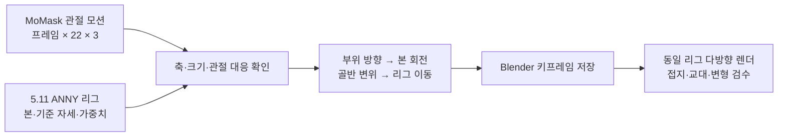
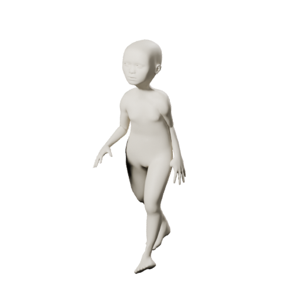

# P7-5.12 보충학습: ANNY Blender 리그에 MoMask 애니메이션 적용하기

> Section ID: `P7-5.12`
> Version: `v2026.09.27`

[5.11](section-11.md)에서는 ANNY로 신체의 표면·골격·스키닝 가중치를 확보했다. 그 Blender 파일에는 기준 자세의 몸체가 있지만 걷기 동작은 없다. 이번에는 **MoMask의 관절 모션을 이 리그의 본 회전과 이동 키프레임으로 옮기는 과정**을 살펴본다. 모션이 가진 정보와 리그가 가진 구조를 구분해야, 몸체를 유지하면서 움직임을 전달할 수 있다.

이 절은 `slime-workflow`의 리타기팅 구현과 완료된 걷기 결과를 바탕으로 한다. 2026-09-27 생성 작업에서 사용한 `neutral_v4` 리그 해시가 5.11 등록 사본과 같음을 확인하고 결과를 책 자산에 복사했다. 아래 생성 예제는 저장된 MoMask 관절부터 Blender 애니메이션을 만드는 구간을 실행한다. MoMask 추론을 새로 수행하는 코드는 아니다.

## 1. 모션은 위치를, 리그는 몸체와 변형 규칙을 제공한다

MoMask의 HumanML3D 관절 출력은 프레임마다 22개 관절의 3차원 위치를 담는다. ANNY 기준 리그에는 104개 본과 각 본을 따라 변형되는 표면이 있다. 하나는 시간에 따른 관절 위치이고, 다른 하나는 몸을 조절하는 구조다. 두 배열의 번호가 같다고 같은 부위를 뜻하지 않는다.

| 입력 | 사용할 정보 | 그대로 복사할 수 없는 정보 |
| --- | --- | --- |
| MoMask `joints` | 골반의 이동, 관절 사이 방향, 시간 순서 | ANNY 본의 회전값·이름·부모 관계 |
| ANNY Blender 리그 | 체형, 본 길이, 기준 자세, 스키닝 가중치 | 걷기 타이밍과 발 접촉 순서 |
| 대응 프로필 | 원본 관절과 대상 본의 관계, 좌표 변환, 전달 방식 | 입력에 없는 손가락 움직임과 독립적인 시선 |

동작을 서로 다른 골격에 옮기는 작업을 **리타기팅(retargeting)**이라고 한다. 이번 방식은 관절 위치에서 부위별 방향을 계산하고, 그 방향을 대상 리그가 표현할 수 있는 회전으로 바꾼다. ANNY의 체형·본 길이·가중치를 유지하므로 원본 관절과 대상 관절의 절대 위치가 모든 프레임에서 일치하는 방식은 아니다.


```mermaid
flowchart LR
    A["MoMask 관절 모션\n프레임 × 22 × 3"] --> C["축·크기·관절 대응 확인"]
    B["5.11 ANNY 리그\n본·기준 자세·가중치"] --> C
    C --> D["부위 방향 → 본 회전\n골반 변위 → 리그 이동"]
    D --> E["Blender 키프레임 저장"]
    E --> F["동일 리그 다방향 렌더\n접지·교대·변형 검수"]
```

### 실제 생성기에서 단계가 연결되는 위치

`slime-workflow`의 관리 생성 진입점은 `generators/momask/run_managed_generation.py`다. 이 파일은 모션 생성, 포즈 렌더링, ANNY 렌더링을 별도 프로세스로 연결한다. 신체 애니메이션 경로를 따라가면 다음 역할로 나뉜다.

| 실행 파일·설정 | 실제로 맡는 작업 |
| --- | --- |
| `generate_motion.py` | MoMask 추론과 관절 복원 후 `motion.npz`에 `joints`와 특징 배열을 저장한다. |
| `render_anny_frames.py` | 원 모션 검사, 기준 ANNY 리그 해시 확인, 실행 폴더에 입력·프로필·계산기 사본을 준비한다. |
| `humanml22-anny-retarget.yaml` | 관절 쌍·대상 본·축 변환·기준 골격·전달 방식을 선언한다. |
| `position_retarget.py` | 관측한 부위 방향에서 대상 본 회전을 계산한다. |
| `templates/retarget_loop.py` | Blender에서 리그를 열고 프레임별 회전·이동 키프레임을 적용한다. |
| `templates/render_asset.py` | 저장된 애니메이션 리그를 방향별로 렌더링하고 시작·끝 차이를 기록한다. |

리타기팅 단계는 `mannequin.blend`와 애니메이션을 포함한 `mannequin.glb`를 저장한다. 이는 5.11의 정적 신체 파일과 구분되는 출력이다. 계산 근거는 `coordinate-transform.json`·NPZ, `review-metrics.json`, `retarget-diagnostics.npz`에 남는다. 렌더 단계의 `loop-validation.json`은 시작·끝 표면 차이 측정 기록이며 자동으로 루프 품질을 승인하는 파일이 아니다.

입력 준비 코드가 만드는 `contacts`는 현재 0으로 채운 자리표시 배열이다. 이를 실제 발 접촉 추론 결과로 읽으면 안 된다. 리타기팅 후 다시 추출한 `mannequin-motion.npz` 역시 대상 ANNY 골격에서 얻은 파생 좌표이므로 원 MoMask 관절과 이름·출처를 구분한다.

## 2. 먼저 축과 이동 크기를 맞춘다

현재 모션 생성 기록의 HumanML3D 좌표는 Y축이 위이고, 5.11의 Blender 리그는 Z축이 위다. 검토한 프로필은 `(x, y, z)`를 `(x, -z, y)`로 바꿔 위쪽 축을 맞춘다. 단순히 Y와 Z만 교환하면 좌표계의 방향까지 달라질 수 있으므로 부호를 포함한 변환을 기록한다. 프로필의 행렬은 직교성과 행렬식도 검사한다.

체형 차이는 이동 크기에도 영향을 준다. 구현은 원본의 왼쪽 엉덩이–무릎 구간과 대상의 대응 본 위치 사이 길이를 비교해 배율을 얻는다. 원본은 모션 전체에서 해당 길이의 평균을 사용한다. 이 배율은 골반의 첫 프레임 대비 변위에 적용한다. 리그 자체의 다리를 프레임마다 늘리는 처리는 아니다.

예를 들어 원본에서 골반이 앞으로 이동하면 대상 리그의 위치에도 그 변화가 전달된다. 첫 프레임 위치를 빼는 것은 시작점을 맞추기 위한 처리이며, 이후의 전진 이동을 모두 지워 제자리 동작으로 만드는 처리와 다르다. 상하 변위도 남기므로 프레임마다 발을 바닥으로 끌어내리는 보정과 구분한다.

좌표 변환 기록에는 변환 전후 관절, 대상 기준 본 위치, 이동 배율, 구간별 방향과 각도를 남긴다. 팔 방향이 예상과 다르면 렌더링 결과만 보고 판단하기 전에 이 중간 자료를 확인할 수 있다.

## 3. 기준 자세 차이와 실제 움직임을 구분한다

기준 자세는 ‘움직이지 않을 때의 골격 방향’을 정의한다. 모션의 첫 프레임이 이미 팔을 흔들거나 무릎을 굽힌 상태라면 이를 중립 자세로 간주할 수 없다. 현재 구현은 출처가 고정된 MoMask BVH 템플릿의 골격 배치로 원본 기준을 정의하고, ANNY 리그의 기준 본 위치·회전과 대응시킨다.

| 부위·전달 방식 | 계산의 목적 | 필요한 구분 |
| --- | --- | --- |
| 팔다리·발의 방향 전달 | 대응 끝점 사이 방향을 따라가게 한다. | 원본 T 자세와 대상의 내려간 팔 자세 차이를 동작으로 중복 적용하지 않는다. |
| 골반·척추 등 기준 대비 변화 전달 | 원본 기준 방향에서 얼마나 달라졌는지를 대상 기준 회전에 적용한다. | 관절 배치 자체의 기울기와 실제 동작 회전을 구분한다. |
| 대응하지 않는 본 | 부모 움직임을 상속하며 기준 로컬 자세를 유지한다. | 손가락 동작을 새로 복원한 것으로 해석하지 않는다. |

관절 두 점을 잇는 방향만으로는 팔의 축을 중심으로 얼마나 비틀렸는지 모두 알 수 없다. 두 개의 독립된 방향을 얻을 수 있는 구간에서는 함께 회전을 계산하고, 한 방향만 있는 구간에서는 이전 방향에서 현재 방향으로 필요한 최소 회전을 연속해서 전달한다. 이는 관측하지 못한 비틀림을 완전히 복구했다는 뜻이 아니다.

회전은 부모 본부터 적용하고, 본의 회전과 리그 전체 이동을 프레임별 키프레임으로 저장한다. 대상 본의 길이와 스케일은 유지한다. 현재 구현에는 동작별 팔 제한, 자동 주먹 자세, 메시 스무딩, 매 프레임 접지 이동이 추가되지 않는다. 따라서 자세를 맞추는 계산과 접지·표면 변형의 품질을 별도로 확인해야 한다.

## 4. 5.11의 어느 파일을 연결할 것인가

5.11에 보존한 [등록 리그 사본](../../../assets/part-07/chapter-05/sec-11/anny-neutral-v4/anny-raw-rig.blend)과 [속성에서 다시 생성하는 예제](section-11.md)는 같은 학습 목적을 갖지만 파일 내부 객체 이름까지 같지는 않다.

| 경로 | Armature 객체 | 메시 객체 |
| --- | --- | --- |
| 등록 자산 사본 `anny-raw-rig.blend` | `AnnyAttributesRig` | `AnnyAttributesBody` |
| 5.11 독립 예제의 `body.blend` | `Rig` | `Body` |

검토한 `slime-workflow` 리타기팅 진입점은 등록 사본의 객체 이름을 사용한다. 따라서 예제 출력 파일을 그대로 넣으면 객체를 찾는 부분부터 맞춰야 한다. 실제 연결 시에는 객체 이름뿐 아니라 본 이름·부모 관계·기준 자세·스키닝 가중치가 기대한 구조인지 함께 검사해야 한다. 파일 확장자가 같다는 이유만으로 입력 호환성을 가정하지 않는다.

실행 기록에는 최소한 원 모션 파일 해시, 리그 파일 해시, 대응 프로필·계산 코드의 버전, 선택한 프레임, 원 모션 fps와 출력 fps를 남긴다. 현재 제작 코드의 방식 식별자는 `position-reference-transport-v3`다. 과거 리그를 재생하거나 렌더링할 때는 당시 모션과 리그를 유지하며, 최신 계산 방식으로 다시 만든 것처럼 기록하지 않는다.

### 프레임 수와 재생 속도도 입력 조건이다

MoMask 원 모션을 20fps로 만들고 모든 프레임을 4fps로 재생하면 동작 시간은 다섯 배로 늘어난다. 예를 들어 32프레임은 20fps에서 1.6초, 4fps에서 8초다. 현재 관리 생성 경로는 전체 프레임을 유지하면서 결과 fps를 4로 기록하므로, 원 모션 속도와 비교할 때 이 차이를 분리해야 한다.

원래 시간 흐름을 유지하려면 20fps를 유지하거나, 프레임을 추출하는 간격에 맞춰 출력 fps를 정해야 한다. 프레임을 줄이면 빠른 발 교대 구간을 놓칠 수 있으므로 전체 모션 검수와 전달용 프레임 구성은 구분한다.

## 5. 리그가 움직인 뒤 확인할 장면

| 확인 대상 | 볼 장면 | 문제가 보이면 먼저 대조할 자료 |
| --- | --- | --- |
| 전진 이동 | 골반과 몸 전체가 같은 방향으로 이동하는가 | 원 골반 변위, 좌표 변환, 이동 배율 |
| 좌우 교대 | 다리가 겹친 뒤 올바른 쪽이 다시 드러나는가 | 원본 관절 번호와 대상 본 대응, 같은 프레임의 다방향 렌더 |
| 접지 | 지지 발이 바닥 위에서 미끄러지거나 파고드는가 | 발 높이·수평 이동, 원 모션과 리타기팅 후 위치 |
| 신체 변형 | 팔꿈치·무릎·어깨가 찢어지거나 심하게 찌그러지는가 | 본 회전·길이, 가중치, 표면 변형 |
| 시간 연속성 | 방향이 갑자기 뒤집히거나 마지막에서 튀는가 | 프레임별 회전 변화, fps, 루프 시작·끝 |

3D 리그에서는 동일한 몸을 여러 카메라로 렌더링할 수 있어, 한 측면에서 가려진 팔다리를 다른 방향으로 확인할 수 있다. 그러나 가림이 3D로 계산된다는 사실이 원본 모션의 타당성이나 피부 변형 품질을 보장하지는 않는다.

현재 구현은 선언한 목표 방향과 실제 본 방향의 차이, 회전 오차, 프레임 간 변화 등을 기록한다. 원본 방향과 대상 방향이 다른 것이 체형·기준 자세를 고려한 의도된 차이인지, 전달 과정의 오류인지 구분해서 읽어야 한다. 작은 계산 오차를 자연스러운 걷기의 합격 점수로 사용하지 않는다.

## 6. 같은 신체로 생성된 걷기 결과와 사본

다음 GIF는 완료 작업의 `down_left` 방향 PNG 60장을 흰 배경에 합성해 4fps GIF로 묶은 것이다. 중간 프레임을 보간하지 않았다. GIF는 자동 반복되므로 마지막에서 처음으로 돌아갈 때의 차이도 함께 관찰한다. 원 MoMask의 20fps 기준으로는 3초 분량이며 이 검토 GIF에서는 15초 동안 느리게 재생된다.


### 회전하며 살펴보는 3D 애니메이션

같은 결과의 GLB를 아래에서 재생하고 회전해 볼 수 있다. 일시 정지한 뒤 몸을 돌려 보면 한 방향에서 가려진 팔과 다리의 위치를 확인하기 쉽다.

<iframe src="/AiBook/assets/part-07/chapter-05/sec-12/anny-momask-walk/viewer.html" title="ANNY MoMask 걷기 3D 애니메이션" width="100%" height="550" loading="lazy" style="border:1px solid #ddd;border-radius:8px"></iframe>

<details markdown="1">
<summary>Blender에서 편집하거나 원본 파일 받기</summary>

Blender 파일은 브라우저에서 직접 실행할 수 없으므로 편집용 사본으로 제공한다. 위 GIF와 3D 보기는 이 생성 결과를 본문에서 확인하는 용도다.

[Blender 사본 받기](../../../assets/part-07/chapter-05/sec-12/anny-momask-walk/mannequin.blend) · [GLB 사본 받기](../../../assets/part-07/chapter-05/sec-12/anny-momask-walk/mannequin.glb)

3D 보기에는 외부에서 불러오는 [model-viewer](https://modelviewer.dev/) 4.1.0과 WebGL이 필요하다. 로딩이 제한되는 환경에서는 위 GIF를 이용한다.

</details>

| 사본·근거 | 확인할 내용 |
| --- | --- |
| [원본 경로와 SHA-256 기록](../../../assets/part-07/chapter-05/sec-12/anny-momask-walk/source-record.json) | 완료 작업과 복사 파일의 대응, 5.11 리그와의 일치 |
| [입력 관절 NPZ](../../../assets/part-07/chapter-05/sec-12/anny-momask-walk/inputs/mannequin-motion.npz) | 60프레임의 22관절 위치와 고정 기준 골격 |
| [리타기팅 진단](../../../assets/part-07/chapter-05/sec-12/anny-momask-walk/review-metrics.json) | 전달 방식, 이동 배율, 방향·회전 진단 |
| [루프 측정](../../../assets/part-07/chapter-05/sec-12/anny-momask-walk/loop-validation.json) | 시작·끝 표면 좌표 차이와 검토 필요 상태 |
| [좌표 변환 기록](../../../assets/part-07/chapter-05/sec-12/anny-momask-walk/coordinate-transform.json) | 원본 좌표에서 대상 리그로 옮긴 근거 |



한 프레임에서는 앞뒤 다리와 구부러진 무릎을 확인할 수 있지만, 이 장면만으로 발 교대나 접지의 연속성을 판정할 수는 없다. 루프 기록의 `endpoint_max_error_m`은 약 **0.264m**다. 첫 프레임과 마지막 프레임의 표면 정점 좌표를 비교한 최대 절댓값이며, 발 미끄러짐의 측정치나 자연스러움 점수가 아니다. 따라서 이 사본은 리그 애니메이션 연결 결과로 소개하며 매끄러운 반복 루프의 완성 사례로 확정하지 않는다.

## 7. 저장된 모션에서 애니메이션을 다시 만드는 코드

[generate_animation.py](../../../assets/part-07/chapter-05/sec-12/anny-momask-walk/code/generate_animation.py)는 입력 검사, 실행 폴더 준비, 리타기팅, Blender·GLB 저장을 연결하는 책의 실행 진입점이다. 같은 `code` 폴더의 [계산기](../../../assets/part-07/chapter-05/sec-12/anny-momask-walk/code/position_retarget.py), [대응 프로필](../../../assets/part-07/chapter-05/sec-12/anny-momask-walk/code/retarget-profile.yaml), [키프레임 적용 코드](../../../assets/part-07/chapter-05/sec-12/anny-momask-walk/code/retarget_loop.py)는 완료 작업에 포함된 코드 사본이다. 함께 내려받아 상대 위치를 유지한다. 생성 결과는 새 폴더에만 저장하며 기존 폴더가 있으면 중단한다.

실행용 Python에는 `numpy`, `PyYAML`이 필요하다. `--blender-python`에는 5.11에서 준비한 `bpy==4.5.3`, NumPy, PyYAML이 설치된 Python 실행 파일을 지정한다. 아래 명령은 저장소 루트에서 실행한다.

```bash
python docs/assets/part-07/chapter-05/sec-12/anny-momask-walk/code/generate_animation.py \
  --motion docs/assets/part-07/chapter-05/sec-12/anny-momask-walk/inputs/mannequin-motion.npz \
  --rig docs/assets/part-07/chapter-05/sec-11/anny-neutral-v4/anny-raw-rig.blend \
  --blender-python .venv-anny-blender/bin/python \
  --output-dir .tmp/anny-walk-replay \
  --fps 4
```

먼저 `--dry-run`을 붙이면 입력 배열·경로와 해시를 확인하고 파일을 만들지 않는다. Blender 내부의 객체·본 호환성은 실제 적용 단계에서 확인한다. 기본 fps는 원 모션 시간 기준인 20이며, 위 예제의 `--fps 4`는 사본의 느린 재생 조건을 맞춘다. fps는 프레임의 재생 속도만 바꾸며 관절 배열을 보간하지 않는다.

`--render`를 추가하면 사본 렌더러로 네 방향 PNG와 루프 측정을 만든다. 이 선택 단계는 CUDA/Cycles 환경을 전제로 한다. 기본 실행은 애니메이션 파일 생성까지이며 GIF 변환은 포함하지 않는다. `generation-record.json`에 입력·리그·코드 해시와 실행 상태를 남기고 단계별 로그도 보존한다.

책의 예제는 등록 리그의 `AnnyAttributesRig`·`AnnyAttributesBody` 이름을 사용한다. 5.11 독립 예제로 만든 `Rig`·`Body` 파일을 쓰려면 객체 이름과 골격 호환성을 먼저 맞춰야 한다. 입력은 HumanML22의 Y-up 관절을 가정하며 `contacts`의 0은 접촉 정보가 없는 자리표시다.

검증에서는 저장된 60프레임과 5.11 리그 사본으로 이 진입점을 실행해 Blender·GLB 생성을 확인했다. 검증 범위와 산출물 해시는 [실행 검증 기록](../../../assets/part-07/chapter-05/sec-12/anny-momask-walk/code/verification.json)에 남겼다. 새 MoMask 추론과 CUDA 다방향 재렌더링은 이 검증에 포함하지 않았다.

직접 바꿔 볼 항목은 **fps**다. 서로 다른 출력 폴더에 `--fps 4`와 `--fps 20`으로 저장하고 같은 자세 순서가 다른 속도로 재생되는지 비교하자. 자세의 품질과 재생 속도를 구분하는 연습이다.

## 체크리스트

- MoMask 관절 위치와 ANNY 본 회전이 서로 다른 표현임을 설명할 수 있는가?
- 축 변환과 골반 이동 배율을 기록하고 전진 이동을 유지했는가?
- 모션 첫 프레임을 기준 자세로 오해하지 않았는가?
- 등록 리그와 5.11 예제 출력의 객체 이름·본 구조를 확인했는가?
- 원 모션 fps와 렌더링·재생 fps를 구분했는가?
- 방향 일치·접지·표면 변형·시간 연속성을 따로 검수했는가?

## 출처와 참고 자료

- [MoMask 공식 구현](https://github.com/centersymmetry/momask){: target="_blank" rel="noopener noreferrer" }, 관절 모션과 20fps 출력 설명. 공식 자료 확인: 2026-09-20.
- [ANNY 공식 구현](https://github.com/naver/anny){: target="_blank" rel="noopener noreferrer" }, 신체 리그와 자세 표현. 공식 자료 확인: 2026-09-27.
- 로컬 구현 검토: `slime-workflow`의 `position_retarget.py`, `humanml22-anny-retarget.yaml`, `templates/retarget_loop.py`, `run_managed_generation.py`, 확인일: 2026-09-27. 본문의 전달 방식·좌표·fps 설명은 이 구현에 대한 설명이며 모든 리타기팅 도구의 공통 규칙이 아니다. 소스 해시는 저장소 관리 기록에 보존한다.
