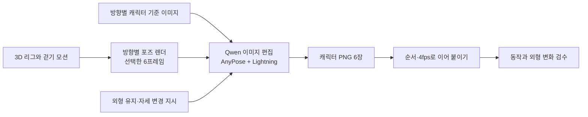
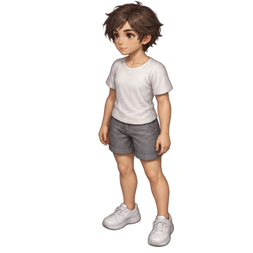
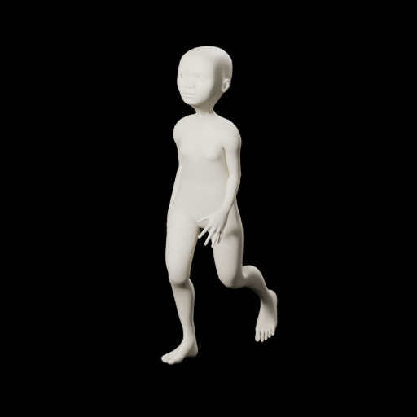
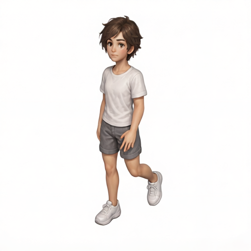
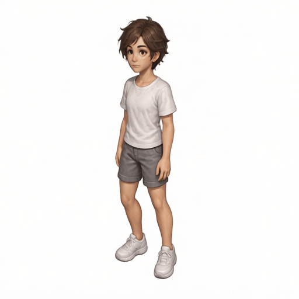
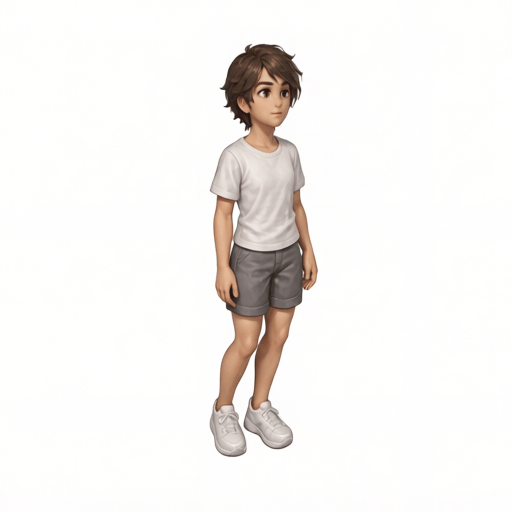
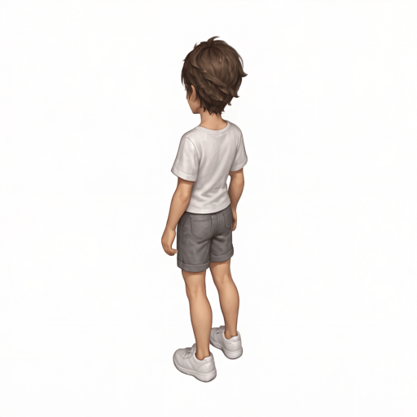
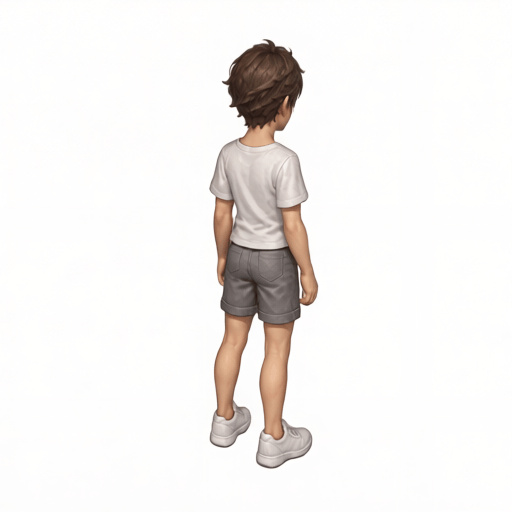
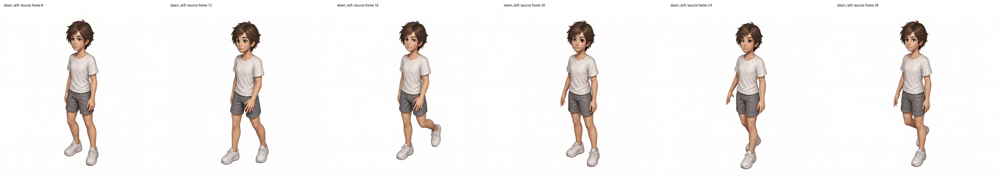

# P7-5.13 보충학습: 3D 리그 포즈와 Qwen 편집으로 캐릭터 걷기 이어 붙이기

> Section ID: `P7-5.13`
> Version: `v2026.09.28`

[5.11](section-11.md)에서는 신체 리그를 확보했고, [5.12](section-12.md)에서는 MoMask의 관절 모션을 리그에 적용했다. 이제 그 리그를 움직이며 렌더링한 이미지를 **포즈 안내**로 삼아, 우리가 원하는 캐릭터의 자세를 한 장씩 바꾼다. 이렇게 생성한 프레임을 시간순으로 이어 붙이면 짧은 애니메이션이 된다.

MoMask가 만든 시간 순서와 Qwen이 생성하는 캐릭터 이미지는 표현 단위가 다르다. 앞 단계에서 관절이 부드럽게 이어져도 각 이미지를 새로 그리는 단계에서 얼굴이나 손이 달라질 수 있다. 따라서 이번 절의 질문은 **자세별 이미지 생성이 어떻게 애니메이션으로 이어지며, 어디에서 시간 연속성을 잃을 수 있는가**다.

이 절에서 **스티칭(stitching)**은 프레임들을 정해진 순서와 재생 속도로 묶는 작업을 뜻한다. 3D 메시를 봉합하거나 여러 카메라 영상을 파노라마로 합치는 의미는 아니다. 핵심은 **동작을 정하는 3D 리그와 외형을 그리는 이미지 편집 모델의 역할을 나누는 것**이다.

실제 사례로 `slime-workflow`에서 완료한 `walking-v13` 결과를 사용한다. 원본은 2026-09-27 생성 작업의 PNG이며, 이 책에는 입력·결과·실행 기록을 사본으로 보존했다. 본문의 GIF는 그 PNG를 묶어 만든 미리보기다. 새로운 이미지 추론이나 중간 프레임 보간은 수행하지 않았다.

## 1. 같은 동작에 캐릭터 외형을 입히는 방법

리그에는 본의 위치·회전과 그에 따라 변형되는 표면이 있다. 따라서 같은 걷기를 앞쪽이나 뒤쪽 카메라에서 반복해 렌더링할 수 있다. 한편 캐릭터 참조 이미지에는 얼굴, 머리, 옷, 신체 비율이 있지만 다음 순간의 자세가 들어 있지는 않다. 두 자료를 함께 입력하면 하나는 **누가 움직이는가**, 다른 하나는 **어떤 자세인가**를 전달할 수 있다.



이번 실행은 완성 캐릭터의 옷과 머리까지 3D로 모델링해 렌더링한 것이 아니다. ANNY의 단순한 신체 리그가 포즈를 제공하고, Qwen 편집이 캐릭터의 픽셀을 새로 만든다. 출력 PNG에는 본이나 스키닝 가중치가 없으므로 다시 회전 가능한 3D 캐릭터가 생성된 것으로 해석하면 안 된다.

| 자료 | 맡기는 정보 | 결과에서 보장되지 않는 것 |
| --- | --- | --- |
| 캐릭터 기준 이미지 | 얼굴·헤어·의상·체형·화풍 | 모든 프레임의 같은 얼굴과 옷 주름 |
| 리그 포즈 렌더 | 팔다리 배치·몸 방향·가림·음영 단서 | 관절의 정확한 3D 좌표 전달 |
| 편집 지시문 | 두 이미지에서 유지·변경할 정보 | 픽셀 단위의 강제 구속 |
| 프레임 순서와 fps | 재생 순서·속도 | 빠진 중간 동작이나 매끄러운 루프 |

리그 렌더에는 3D 표면의 겹침과 음영이 드러나지만, Qwen이 받는 것은 그 결과를 찍은 **2D 이미지**다. 깊이 버퍼나 본 회전값을 직접 전달한 실행은 아니다. 그러므로 포즈 맵보다 풍부한 형태 단서를 제공한다는 설계 의도와, 깊이·좌우 문제가 실제로 해결됐다는 검증은 구분한다.

## 2. Qwen·AnyPose·Lightning의 역할을 구분한다

Qwen-Image-Edit-2511은 이미지와 텍스트 지시를 받는 편집 모델이다. 공식 예제는 여러 이미지를 목록으로 입력하고 문장에서 각 이미지의 역할을 지정한다. 공식 소개의 캐릭터 일관성 개선은 이 실험의 모든 프레임이 동일한 외형을 유지한다는 보증은 아니다. [Qwen 공식 모델 카드](https://huggingface.co/Qwen/Qwen-Image-Edit-2511){: target="_blank" rel="noopener noreferrer" }

**LoRA**는 기본 모델에 추가해 특정 동작을 유도하는 비교적 작은 학습 가중치다. 이번 사례에서는 서로 다른 목적의 LoRA 세 개를 함께 사용했다.

| 구성 | 이 실행에서의 역할 | 적용값 |
| --- | --- | --- |
| Qwen-Image-Edit-2511 | 두 참조 이미지와 지시에 따른 이미지 편집 | BF16 |
| AnyPose base | 이미지 간 포즈 전이를 위한 추가 가중치 | 0.7 |
| AnyPose helper | base와 함께 쓰는 보조 가중치 | 0.7 |
| Lightning 4-step V1.0 | 적은 추론 단계로 편집하도록 하는 증류 가중치 | 1.0, 4단계 |

AnyPose 제작자는 캐릭터를 첫 이미지, 따를 포즈를 두 번째 이미지로 넣고 base·helper를 함께 사용하는 방법을 안내한다. Blender의 3D 포즈 자료를 주로 활용했다고 설명하며, 배경 혼입·복잡한 자세·여러 인물·평면적인 화풍에서의 한계도 공개한다. 따라서 ‘3D 리그를 안내로 쓰면 항상 정확하다’는 결론으로 확대하지 않는다. [AnyPose 제작자 모델 카드](https://huggingface.co/lilylilith/AnyPose/tree/27c4b1f7688940d39767e652fe8d87faf44a0881){: target="_blank" rel="noopener noreferrer" }

Lightning은 시간축을 학습하는 영상 모델을 추가하는 것이 아니라, 이미지 편집의 추론 단계를 줄이기 위한 구성이다. 이번 기록의 4단계용 BF16 LoRA는 배포처가 제공한 파일이다. 4단계라는 숫자만으로 실행 시간이나 프레임 품질을 다른 환경에 일반화할 수는 없다. [Lightning 공식 배포 자료](https://huggingface.co/lightx2v/Qwen-Image-Edit-2511-Lightning){: target="_blank" rel="noopener noreferrer" }

## 3. 이미지 1은 캐릭터, 이미지 2는 그 순간의 자세다

아래는 실제 `down_left` 방향의 입력과 원본 16번 프레임에 대응하는 출력이다. 캐릭터는 흰 배경, 리그 포즈는 검은 배경으로 준비했다.

| 이미지 1: 캐릭터 기준 | 이미지 2: 리그 포즈 | Qwen 편집 결과 |
| --- | --- | --- |
|  |  |  |

이 표본에서는 한쪽 무릎을 굽혀 뒤로 든 자세가 전달되고, 갈색 머리·흰 티셔츠·짙은 반바지·운동화라는 외형이 나타난다. 다만 안내 리그와 출력의 체형·손 위치·화면 크기가 완전히 같지는 않다. 이는 자세의 큰 특징을 읽을 수 있다는 관찰이며 좌표 일치나 보행 품질의 합격 판정은 아니다.

실행 지시의 요지는 ‘첫 이미지의 외형과 비율을 유지하고 두 번째 이미지는 관절 자세와 보는 방향의 안내로 사용한다’였다. 앞·뒤 방향에는 별도 방향 문구가 더해졌다. 다음 문장은 입력의 역할을 이해하기 위해 작성한 설명용 예시이며, 저장 작업의 원문 프롬프트를 그대로 옮긴 것은 아니다.

> 이미지 1의 인물과 옷차림을 유지하면서 이미지 2의 팔·다리와 몸 방향을 따르세요. 포즈 안내의 신체 외형과 배경은 가져오지 마세요.

한 방향을 처리하는 동안 캐릭터 기준 이미지와 지시는 고정하고 리그 포즈만 바꿨다. 뒤쪽 두 방향은 각각의 뒤쪽 캐릭터 참조를 사용했다. 이는 앞모습 한 장으로 보이지 않는 뒷모습까지 매번 추정하게 하는 방식과 구분된다.

`run_character_animation.py`는 각 프레임에서 기준 캐릭터와 해당 포즈를 다시 읽어 편집 함수를 호출한다. 이전 생성 프레임을 다음 프레임의 입력으로 되먹임하지 않는다. 이 방식에서는 이전 프레임의 오류가 참조로 누적되는 경로를 피할 수 있지만, 인접 프레임끼리의 외형을 직접 맞추는 시간축 제약도 없다. 같은 시드 역시 시간 일관성의 보증이 아니다.

## 4. 프레임을 이어 붙인 결과를 본다

아래 GIF는 완료된 PNG를 기록된 순서 그대로 이어 붙인 것이다. 방향별 6장·4fps이며, 처음부터 반복 재생한다. 반복 설정은 보기 편하게 묶은 설정일 뿐 시작·끝 자세가 일치하는 루프를 검증했다는 뜻은 아니다.

| 앞쪽 왼 방향 · `down_left` | 앞쪽 오른 방향 · `down_right` |
| --- | --- |
|  |  |

| 뒤쪽 왼 방향 · `up_left` | 뒤쪽 오른 방향 · `up_right` |
| --- | --- |
|  |  |

움직이는 상태에서는 전체 인상만 보기 쉽다. 아래는 앞쪽 왼 방향의 여섯 출력을 원본 순서로 나열한 그림이다. 확대해서 머리 방향, 손의 위치, 두 신발이 겹치는 구간을 따로 확인한다.



이 여섯 장에서는 같은 착장의 큰 특징과 다리 자세의 변화가 보인다. 동시에 얼굴이 향하는 방향과 손의 실루엣도 프레임마다 달라진다. 그 변화가 원 포즈를 따른 것인지 편집 과정에서 생긴 것인지는 해당 입력과 출력 한 쌍씩 대조해야 한다. 화면에서 걸음이 읽힌다는 사실만으로 정확한 좌우 교대·접지·캐릭터 동일성이 검증된 것은 아니다.

## 5. 리그·편집·스티칭을 나누어 검수한다

| 단계 | 확인할 질문 | 먼저 대조할 근거 |
| --- | --- | --- |
| 리그 모션 | 안내 자체의 다리 교대·발 높이가 적절한가? | 같은 번호의 리그 렌더와 모션 기록 |
| 포즈 편집 | 지지 다리·들린 다리·몸 방향이 전달됐는가? | 포즈 입력과 출력 PNG |
| 외형 유지 | 얼굴·머리·옷·체형이 참조와 이어지는가? | 해당 방향의 캐릭터 기준 이미지 |
| 시간 연속성 | 손발·얼굴·옷 주름이 인접 프레임에서 튀는가? | 전 프레임 나열과 GIF |
| 스티칭 | 번호·간격·fps와 반복 경계가 맞는가? | 결과 목록과 GIF 지연 시간 |

특히 안내 포즈가 이미 잘못된 경우와 올바른 안내가 편집에서 바뀐 경우는 해결할 위치가 다르다. 전자는 리그·모션을 고치고, 후자는 입력 역할과 편집 조건을 비교해야 한다. 원래 6장 사이에서 생략한 동작은 프레임을 더 생성해 확인할 문제이며, 흐릿한 손을 고치는 문제와 구분한다.

이번 자료는 한 캐릭터·한 모션 구간·한 시드·한 어댑터 조합의 실행 사례다. 같은 조건에서 AnyPose를 끈 결과나 다른 강도 결과가 함께 보존된 대조 실험은 아니다. 따라서 AnyPose의 효과나 과거 영상 모델 대비 우위를 이 자료만으로 수치화하지 않는다. 다음 비교에서는 같은 입력·순서·난수에서 한 조건만 바꾸고, 자세와 외형, 시간 연속성을 각각 판정하는 것이 필요하다.

### 잘못된 프레임을 찾으면 어느 단계로 돌아갈까?

다리를 든 시점부터 다르면 리그의 모션과 선택한 프레임을 먼저 본다. 자세는 맞지만 얼굴이나 옷이 바뀌었다면 캐릭터 참조와 편집 결과를 비교한다. 각 PNG는 적절한데 재생할 때 급하게 튄다면 선택 간격·fps·누락 프레임을 확인한다. 이렇게 원인을 나누면 모든 문제를 프롬프트 수정 하나로 해결하려 하지 않아도 된다.

5.11~5.13에서 남길 것은 완성 영상 한 개뿐 아니라 **몸체, 동작, 외형, 시간 연결을 따로 설명할 수 있는 관점**이다. 같은 걷기라도 어느 단계의 조건을 바꿨는지 알아야 다음 생성 결과를 비교할 수 있다.

## 6. 재생 시간과 실행 근거를 확인한다

완료 작업 ID는 `2026-09-27_22-28-43-78d4c5bc`다. `status.json`은 `completed`, 종료 코드는 0이며 24개 출력 파일과 각 프레임의 완료 기록을 확인했다. 이는 처리 완료를 뜻한다. 실행 기록 자체도 최종 품질 검토가 필요하다고 남긴다.

<details markdown="1">
<summary>걷기 실행 설정과 처리 시간</summary>

| 항목 | 보존한 실행 조건 |
| --- | --- |
| 동작·캐릭터 | `walking-v13` · `character-default` |
| 포즈 입력 | ANNY 리그 렌더, 방향별 원본 60프레임 중 일부 |
| 선택한 원본 번호 | 8, 12, 16, 20, 24, 28 |
| 방향 | `down_left`, `down_right`, `up_left`, `up_right` |
| 출력 | 방향별 6장, 합계 24장, 각 512×512 |
| 난수·추론 | 시드 10107, 4단계, true CFG 1.0, guidance 1.0 |
| 실행 환경 기록 | CUDA, BF16, sequential CPU offload |
| 라이브러리 기록 | PyTorch 2.11.0+cu128, Diffusers 0.37.0 |
| 이미지 입력 크기 기록 | VAE 참조 512×512, 조건 참조 384×384 |
| 재생 설정 | 4fps, `speed=4` |
| 프레임별 실행 시간 합 | 약 5,328.78초, 88.8분 |

CPU offload는 사용하지 않는 가중치를 CPU 쪽으로 옮겨 GPU 메모리 부담을 줄이는 실행 방식이다. 이 표의 시간은 각 프레임 `elapsed_seconds`를 합한 값이며 순수 GPU 연산 시간이나 장비 간 속도 비교값은 아니다. 작업 폴더 이름의 시각은 시작 시각이고, 완료 결과 파일의 수정 시각은 9월 27일 23:59경이다.

</details>

등록된 모션의 `source_fps=4`에서 프레임 번호가 4씩 증가하므로 선택 시점 사이에는 원본 재생 기준 1초의 간격이 있다. 결과를 4fps로 묶으면 이 간격은 0.25초로 재생된다. 이것이 이 실행의 `speed=4`와 연결된다. **6장을 각각 0.25초씩 보여 주는 미리보기는 1.5초**이며, 빠진 원본 프레임을 새로 생성한 것은 아니다. 첫 선택 시점부터 마지막까지의 간격과 마지막 프레임 표시 시간도 구분한다.

5.12 사본과 같은 `neutral_v4` 신체 리그 계열이지만, 이번 포즈는 별도로 등록된 `walking-v13`에서 가져왔다. 5.12의 GIF와 완전히 동일한 모션 프레임을 편집한 대조 실험으로 제시하지 않는다.

### 같은 GIF를 다시 만드는 코드

- [stitch_frames.py](../../../assets/part-07/chapter-05/sec-13/qwen-anypose-walking-v13/code/stitch_frames.py){ .aibook-code-preview }: 기록의 프레임 순서로 GIF와 비교 이미지를 만든다.
- [실행 결과 목록](../../../assets/part-07/chapter-05/sec-13/qwen-anypose-walking-v13/result.json): 방향별 PNG 경로와 원본 프레임 번호.
- [사본·실행 조건 기록](../../../assets/part-07/chapter-05/sec-13/qwen-anypose-walking-v13/source-record.json): 원본 경로·해시, 모델·LoRA 버전과 강도, 프레임별 실행 시간.
- [이어 붙이기 기록](../../../assets/part-07/chapter-05/sec-13/qwen-anypose-walking-v13/previews/stitch-record.json): GIF 재생 간격과 원본 순서·해시.

Pillow가 설치된 Python으로 저장소 루트에서 실행한다. 출력은 새 폴더에 저장한다. 이 코드는 모델 가중치를 읽거나 Qwen 추론을 다시 실행하지 않는다.

```bash
python docs/assets/part-07/chapter-05/sec-13/qwen-anypose-walking-v13/code/stitch_frames.py \
  --root docs/assets/part-07/chapter-05/sec-13/qwen-anypose-walking-v13 \
  --output-dir .tmp/qwen-anypose-walk-preview
```

같은 명령에 `--fps 2`를 더하고 다른 출력 폴더를 지정해 보자. 여섯 자세는 그대로이고 재생 시간만 3초가 된다. 동작이 느려지는 것과 프레임 사이에 새로운 자세가 채워지는 것의 차이를 확인할 수 있다.

PNG가 자세와 외형을 만든 결과라면, GIF는 그 결과를 재생하는 포장이다. GIF의 색 수 제한도 있으므로 얼굴·손·의상 디테일은 원본 PNG로 확인한다. 재생 속도를 바꾸거나 프레임을 보간하는 것과 원본 자세의 정확도를 개선하는 것을 같은 작업으로 취급하지 않는다.

## 체크리스트

- 3D 리그가 제공하는 동작과 캐릭터 참조가 제공하는 외형을 구분할 수 있는가?
- Qwen에 들어가는 것은 본 회전이 아니라 렌더된 2D 이미지임을 이해했는가?
- AnyPose의 포즈 전이와 Lightning의 단계 축소를 구분했는가?
- 원본 프레임 번호·선택 간격·출력 fps와 GIF 길이를 연결할 수 있는가?
- 같은 시드와 프레임 스티칭이 시간 일관성을 자동 보장하지 않음을 설명할 수 있는가?
- 처리 완료, 걸음 식별, 제작용 품질을 별도의 판단으로 남겼는가?

## 출처와 참고 자료

- Qwen, [Qwen-Image-Edit-2511 모델 카드](https://huggingface.co/Qwen/Qwen-Image-Edit-2511){: target="_blank" rel="noopener noreferrer" }, 다중 이미지 편집 입력과 모델 설명. 확인일: 2026-09-28.
- lilylilith, [AnyPose 모델 카드](https://huggingface.co/lilylilith/AnyPose/blob/27c4b1f7688940d39767e652fe8d87faf44a0881/README.md){: target="_blank" rel="noopener noreferrer" }, 입력 순서·base/helper 구성과 제작자가 밝힌 한계. 확인일: 2026-09-28.
- LightX2V, [Qwen-Image-Edit-2511-Lightning](https://huggingface.co/lightx2v/Qwen-Image-Edit-2511-Lightning){: target="_blank" rel="noopener noreferrer" }, 4단계 증류 LoRA 파일 설명. 확인일: 2026-09-28.
- 로컬 실행: `slime-workflow`의 `2026-09-27_22-28-43-78d4c5bc` 작업과 `run_character_animation.py`·`qwen_pose/runtime.py` 검토. 모델·입력·산출물 근거는 위 사본 기록에 보존했다. 원고의 시각 관찰은 이 실행에 한정한다.
