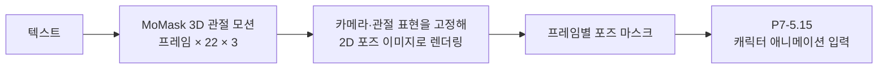

# P7-5.14 보충학습: 텍스트 모션을 애니메이션 포즈 입력으로 렌더링하기

> Section ID: `P7-5.14`
> Version: `v2026.09.21`

정지 이미지의 자세와 달리, 걷기처럼 시간이 흐르며 바뀌는 동작은 프레임 사이의 관절 관계를 유지해야 한다. 이 보충학습에서는 텍스트에서 만든 3D 관절 모션을 **애니메이션 리그**나 완성 캐릭터 영상으로 부르지 않고, 다음 절의 캐릭터 영상 모델에 전달할 포즈 시퀀스로 바꾸는 경로를 분리한다. P7-5.15는 여기서 준비한 포즈·마스크와 캐릭터 참조를 실제 영상 생성 입력으로 사용한다.

## 1. 관절 모션, 리그, 포즈 이미지는 서로 다른 산출물이다

MoMask는 텍스트와 길이에서 프레임별 3D 관절 배열을 만든다. 이 배열은 뼈대의 위치 변화이며, 캐릭터 메시·스킨 가중치·관절 제약을 가진 애니메이션 리그가 아니다. 같은 모션을 캐릭터에 입히려면 별도의 리타기팅과 렌더링이 필요하다.



이 경로에서 3D 모션이 동작의 시간 순서를 맡고, 2D 포즈 이미지는 영상 모델이 읽을 구조 조건을 맡는다. 포즈 이미지는 얼굴 identity, 의상, 손가락, 가림의 깊이 관계를 충분히 담지 않는다. 그 정보는 다음 절의 참조 이미지와 별도 검수 항목으로 남긴다. [MoMask 공식 구현](https://github.com/centersymmetry/momask){: target="_blank" rel="noopener noreferrer"}

## 2. OpenPose 계획과 실제 보존 자료를 구분한다

초기 계획은 48개 MoMask 관절 프레임에서 12장을 균등 추출하고, 이를 body-only OpenPose PNG와 `pose_keypoints_2d` JSON으로 기록하는 것이었다. 아래 코드는 그 텍스트 입력과 48→12 추출 규칙만 `.tmp/`에 준비한다. 모델을 실행하거나 OpenPose 관절 매핑·JSON을 만들지 않는다.

[MoMask 키프레임 준비 코드 보기](/AiBook/assets/part-07/chapter-05/p7_5_14_prepare_momask_walk_keyframes.py)

```bash
.venv/bin/python docs/assets/part-07/chapter-05/p7_5_14_prepare_momask_walk_keyframes.py
```

따라서 이 저장소에는 이 계획의 OpenPose PNG·좌표 JSON이 없다. 보존된 후속 입력은 MoMask v4 관절을 SCAIL-Pose renderer로 그린 33장의 포즈 PNG와 대응 마스크다. OpenPose 형식과 SCAIL 포즈 렌더링 이미지를 같은 산출물처럼 부르지 않는다. [OpenPose JSON 출력 형식](https://github.com/CMU-Perceptual-Computing-Lab/openpose/blob/master/doc/02_output.md){: target="_blank" rel="noopener noreferrer"}

## 3. 전진 모션 후보는 화면 이동과 분리해 확인한다

MoMask v4에서는 96프레임·20fps·세 seed에서 텍스트만 바꾸어 두 걷기 조건을 비교했다. 짧은 전진 지시인 `A person walks in a straight line across the room.`의 세 결과는 약 2.55~3.02m 전진했다. 바닥·지속 이동 설명을 덧붙인 조건은 약 2.7~10.8cm로 제자리 걷기에 가까웠다.

화면을 따라가는 카메라는 실제 전진을 크게 보이게 할 수 있으므로, 여섯 결과에 같은 세계 좌표 화면 범위를 적용하고 루트 이동을 관절 복원 결과와 대조했다. 다만 첫 약 1.2초의 정지와 후반 정지가 남았고, 발 접촉은 높이 기반 대리지표로만 살폈다. 이 결과는 완전한 지속 보행이나 물리적 타당성의 증명이 아니다.

[MoMask v4 결과 요약](../../../assets/part-07/chapter-05/sec-15/2026-09-19-momask-v4/README.md){ .aibook-markdown-preview }

## 4. 다음 절에 넘긴 것은 33프레임 포즈·마스크다

후속 영상 실험에는 전진 후보 `travel-10107`의 원 모션 28~59번을 사용했다. 끝 프레임을 한 번 반복해 총 33프레임으로 맞추고, 고정 perspective camera와 SCAIL-Pose renderer로 포즈 이미지를 만들었다. 각 프레임의 마스크는 포즈 조건이 적용될 영역을 지정하는 입력이다.

| P7-5.14에서 고정한 항목 | P7-5.15에 넘기는 자료 | 이 자료가 보장하지 않는 것 |
| --- | --- | --- |
| MoMask v4 관절 시퀀스 | `poses/frame_000.png`~`frame_032.png` | 캐릭터 얼굴·의상 동일성 |
| 고정 카메라·프레임 대응 | 원 모션 28~59번과 마지막 59번 반복 | 3D 가림·손가락 구조 |
| 포즈별 영역 마스크 | `pose-masks/frame_000.png`~`frame_032.png` | 실제 OpenPose JSON 호환성 |

원 모션 배열과 재렌더링 코드는 폐기되었지만, 위 33장의 포즈·마스크는 P7-5.15의 재현 가능한 입력으로 보존한다. 원 모션을 새로 검수하거나 다른 카메라로 다시 투영할 수는 없다. 다음 절은 이 한정된 입력을 바꾸지 않고 캐릭터 참조 조건의 결과를 살핀다.

## 체크리스트

- MoMask의 3D 관절 모션과 캐릭터 애니메이션 리그를 구분할 수 있는가?
- OpenPose로 계획한 경로와 실제 보존된 SCAIL 포즈·마스크 자료를 구분할 수 있는가?
- 화면에서 보이는 이동과 관절의 실제 수평 이동을 같은 것으로 판단하지 않는가?
- P7-5.15가 포즈 시퀀스를 새로 만드는 절이 아니라, 이 절의 33프레임 입력을 재사용하는 절임을 설명할 수 있는가?

## 출처와 참고 자료

- centersymmetry, [MoMask 공식 구현](https://github.com/centersymmetry/momask){: target="_blank" rel="noopener noreferrer" }, GitHub, 확인일: 2026-09-21.
- CMU Perceptual Computing Lab, [OpenPose JSON output](https://github.com/CMU-Perceptual-Computing-Lab/openpose/blob/master/doc/02_output.md){: target="_blank" rel="noopener noreferrer" }, GitHub, 확인일: 2026-09-21.
- zai-org, [SCAIL-2 공식 구현](https://github.com/zai-org/SCAIL-2){: target="_blank" rel="noopener noreferrer" }, GitHub, 확인일: 2026-09-21.
