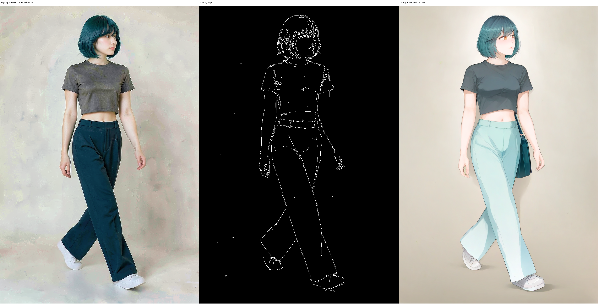

# P7-5.14 depth·Canny 구조 조건으로 원근과 복장 계약을 분리해 읽기

> Section ID: `P7-5.14`
> Version: `v2026.09.05`

depth와 Canny는 카메라 원근·배경 윤곽·인물 실루엣의 단서를 전달할 수 있다. 하지만 구조 단서가 남았다는 사실은 재킷·바지·가방의 형태와 앞뒤 레이어까지 유지됐다는 뜻이 아니다. 이 절에서는 두 조건을 최종 캐릭터 reference가 아닌 **구조 보조 입력**으로 한정해 결과를 읽는다.

!!! abstract "실험 결론"

    depth는 타일 바닥 원근과 얼굴 단서를 일부 남겼지만 흰 크롭 재킷·가방·strap의 관계를 보장하지 못했다. Canny도 사선 camera와 실루엣을 보조했지만 흰 재킷 레이어가 빠졌다. 따라서 원근과 복장은 서로 다른 계약이며, 구조 조건의 강도를 높이는 일은 완성 착장을 대체하지 않는다.

## depth는 원근 단서를 남겨도 완성 착장을 보장하지 않았다

고각도 depth scaffold, 전신 완성 착장 global 조건, 얼굴 face 조건, character·outfit LoRA를 나눠 연결하면 타일 바닥 원근과 머리·눈 단서는 일부 남았다. 그러나 흰 크롭 재킷은 짧은 흰 상의가 되고 가방·strap은 사라졌다.


[p7-5-11-sdxl-depth-role-separated-result.json — JSON — SDXL depth 역할 분리 실행 기록 보기](/AiBook/assets/part-07/chapter-05/p7-5-11-sdxl-depth-role-separated-result.json)

이 결과는 depth가 쓸모없다는 판정이 아니다. 바닥 원근과 얼굴 단서를 남긴 범위는 구조 계약의 관찰이고, 재킷·가방의 겹침까지 보장하지 않은 범위는 outfit 계약의 이탈이다.

## Canny는 사선 구도를 보조해도 의상 레이어를 지키지 않았다

Canny는 카메라·실루엣의 보조 조건으로 쓸 수 있었지만, 사선 보행 후보에서는 얼굴·바지·가방 일부가 남는 대신 흰 재킷 레이어가 빠졌다. 구조를 더 강하게 전달하는 일과 기준 복장을 보존하는 일은 여전히 경쟁했다.



Canny 시트는 사선 camera와 실루엣을 보조해도 의상 레이어를 독립적으로 지켜 주지 않는 사례다. 최종 캐릭터 생성에서는 얼굴과 완성 착장을 독립 reference로 유지해야 했다.

## 보조 조건의 결합은 보조 실험 안에 한정됐다

OpenPose와 depth·Canny는 구조 조건, FaceID·FacePlus·IP-Adapter·LoRA는 캐릭터 조건, mask·VTON은 생성 뒤 국소 보정으로 분리했다. 아래 도식은 **SDXL·Animagine 보조 실험에서만** 이 조건들이 만나는 위치를 보여 준다. Qwen의 세 입력 경로에는 이 adapter·ControlNet·mask·VTON 조건을 연결하지 않았다.

```mermaid
--8<-- "assets/part-07/chapter-05/p7-5-11-supporting-pipeline-ko.mmd"
```

## 결과를 다음 입력 역할로 번역한다

| 관찰한 결과 | 피한 해석 | 다음 선택 |
| --- | --- | --- |
| depth는 원근 단서를 남기지만 재킷·가방이 빠짐 | 구조 조건을 강하게 주면 복장도 따라온다는 해석 | 완성 착장을 독립 reference로 유지 |
| Canny는 사선 camera와 실루엣을 보조하지만 재킷 레이어가 빠짐 | 외곽선 조건이 의상 겹침을 결정한다는 해석 | camera 구조와 outfit 판정을 분리 |
| 여러 구조 조건을 동시에 누적 | 조건 수가 늘면 네 계약이 자동으로 합쳐진다는 해석 | 각 조건의 관찰 범위를 따로 기록 |

## 체크리스트

- depth 시트에서 남은 원근 단서와 이탈한 재킷·가방 관계를 각각 적는다.
- Canny 시트에서 남은 사선 구도와 빠진 의상 레이어를 같은 성공으로 세지 않는다.
- 구조 조건을 더 추가하기 전에, 다음 입력이 structure·identity·outfit·style 중 무엇을 맡을지 한 문장으로 적는다.

## 출처와 참고 자료

- Stability AI, [SDXL Generative Models](https://github.com/Stability-AI/generative-models){: target="_blank" rel="noopener noreferrer" }, 확인일: 2026-08-16. SDXL Base 1.0의 기준 모델을 확인했다.
- Zhang et al., [ControlNet](https://github.com/lllyasviel/ControlNet){: target="_blank" rel="noopener noreferrer" }, 확인일: 2026-08-15. 구조 조건의 기본 역할을 참고했다.
- Tencent AI Lab, [IP-Adapter](https://github.com/tencent-ailab/IP-Adapter){: target="_blank" rel="noopener noreferrer" }, 확인일: 2026-08-15. 이미지 참조 조건의 기본 역할을 참고했다.
- Hu et al., [LoRA: Low-Rank Adaptation of Large Language Models](https://arxiv.org/abs/2106.09685){: target="_blank" rel="noopener noreferrer" }, 확인일: 2026-08-16. low-rank adapter의 기본 개념을 확인했다.
