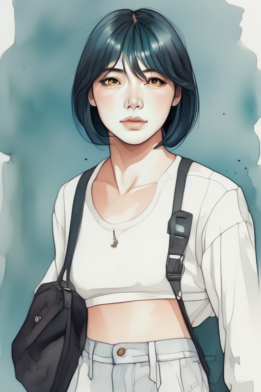

# P7-5.15 FaceID 조건으로 얼굴 identity와 전신 구도의 경계 읽기

> Section ID: `P7-5.15`
> Version: `v2026.09.05`

얼굴 reference 조건을 강하게 주면 전신 캐릭터도 같은 사람으로 고정될까? 이 절에서는 FaceID 단독과 FaceID + FullFace 조건을 비교해, 얼굴 단서의 증가와 전신 frame·착장 유지가 같은 성공인지 분리해 읽는다.

!!! abstract "실험 결론"

    FaceID 단독은 전신 frame 일부를 남겼지만 검은 장발과 다른 착장으로 바뀌었다. FullFace 결합은 청록 단발·호박색 눈 단서를 늘렸지만 흉상 구도로 수렴했다. 얼굴 조건의 강도를 높이는 일은 전신 구도·복장을 보존하는 조건과 독립적이지 않았다.

## FaceID 단독과 FullFace 결합을 비교한다

| FaceID 단독 | FaceID + FullFace |
| --- | --- |
|  |  |
| 전신 frame 일부 유지, identity·outfit 이탈 | 얼굴 단서는 일부 회복, 전신·outfit 이탈 |

왼쪽 후보는 전신 구도를 남겼지만 얼굴과 착장이 기준에서 벗어났다. 오른쪽 후보는 얼굴 단서를 늘리는 대신 흉상으로 좁아졌다. 따라서 두 후보 모두 전체 캐릭터 재현의 근거로 사용하지 않는다.

이 비교는 FaceID가 무효라는 결론이 아니다. 얼굴 특징을 보조하는 입력 역할과 전신 구도·복장 계약을 판정하는 역할이 다르다는 관찰이다. 전신 캐릭터를 다시 그릴 때에는 얼굴 reference, 구조 guide, 완성 착장을 각각 독립적으로 검수해야 한다.

## 체크리스트

- FaceID 단독 후보에서 유지된 전신 frame과 이탈한 identity·outfit을 따로 적는다.
- FullFace 결합 후보에서 늘어난 얼굴 단서와 흉상으로 좁아진 구도를 같은 성공으로 세지 않는다.
- 얼굴 reference의 강도를 바꾸기 전에 identity·structure·outfit 중 무엇을 검증하려는지 정한다.

## 출처와 참고 자료

- Stability AI, [SDXL Generative Models](https://github.com/Stability-AI/generative-models){: target="_blank" rel="noopener noreferrer" }, 확인일: 2026-08-16. SDXL Base 1.0의 기준 모델을 확인했다.
- cubiq, [ComfyUI InstantID](https://github.com/cubiq/ComfyUI_InstantID){: target="_blank" rel="noopener noreferrer" }, 확인일: 2026-08-16. FaceID·얼굴 reference 조건의 실행 경계를 확인했다.
- Tencent AI Lab, [IP-Adapter](https://github.com/tencent-ailab/IP-Adapter){: target="_blank" rel="noopener noreferrer" }, 확인일: 2026-08-15. 이미지 참조 조건의 기본 역할을 참고했다.
