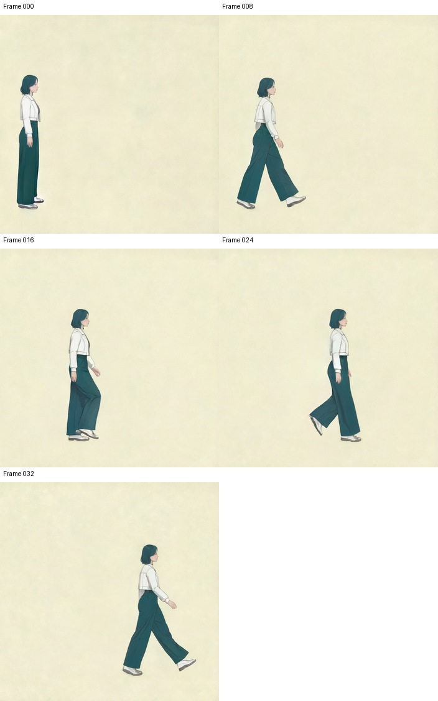

# P7-5.15 포즈 시퀀스와 참조 이미지로 캐릭터 애니메이션 생성하기

> Section ID: `P7-5.15`
> Version: `v2026.09.21`

P7-5.14는 텍스트 모션을 33장의 포즈·마스크 입력으로 준비했다. 이 절은 그 파일을 다시 만들거나 OpenPose로 바꾸지 않는다. 같은 포즈 시퀀스에 캐릭터 전신 참조와 근접 참조를 함께 전달했을 때, **동작을 읽을 수 있는 결과**와 **얼굴·손·의상 세부를 제작에 쓸 수 있는 결과**가 어떻게 달라지는지 확인한다.

## 1. 포즈와 캐릭터 참조는 맡는 정보가 다르다

SCAIL-2에는 33프레임의 포즈 영상과 대응 포즈 마스크, 캐릭터 전신 참조와 참조 마스크를 별도로 전달했다. 포즈는 이동 경로와 큰 팔다리 배치를, 참조 이미지는 얼굴·머리·의상의 큰 특징을 맡는다. 어느 한 입력이 다른 역할을 보장하지 않는다.

| 입력 | P7-5.14에서 이어받은 내용 | 이 실험에서 확인할 역할 |
| --- | --- | --- |
| 포즈 이미지 | MoMask v4 원 모션 28~59번을 렌더링한 33장 | 수평 이동과 큰 신체 동작 |
| 포즈 마스크 | 프레임별 포즈 조건 영역 33장 | 포즈 입력의 적용 영역 |
| 전신 참조 | Mira의 전신·큰 착장 특징 | 인물의 전체 실루엣과 의상 경향 |
| 근접 참조 | 같은 원본의 얼굴·상반신·손 크롭 | 작은 얼굴·상반신 정보를 보강하는 후보 |

입력 프레임 번호·고정 카메라·포즈 마스크는 P7-5.14에서 고정된 자료 그대로다. 이번 비교에서는 전신 참조에 근접 참조와 같은 식별 색 마스크를 하나 더 넣는 것만 바꾸었다.

## 2. 33프레임 조건에서 참조 정보만 추가한다

SCAIL-2 GGUF Q4_K_M, DPO 어댑터 강도 1.0, 704×704, 33프레임·20fps, 40단계, CFG 5, shift 3, seed `23123134`와 저장된 텍스트 임베딩을 고정했다. 원문 프롬프트는 복원되지 않아, 같은 임베딩 해시로 텍스트 조건의 동일성을 확인했다. 이 제약 때문에 이 실험은 프롬프트 효과를 평가하지 않는다.

| 고정한 조건 | 전신 참조 기준 | 전신 + 근접 참조 조건 |
| --- | --- | --- |
| 포즈·마스크 | P7-5.14의 33프레임 | 동일 |
| 캐릭터 전신 참조 | 1장 | 동일 |
| 추가 근접 참조·마스크 | 없음 | 같은 원본에서 만든 1장 추가 |
| 해상도·샘플링·난수 | 704×704·40단계·seed `23123134` | 동일 |

마스크는 두 참조 영역이 같은 인물의 외형 정보라는 조건을 전달할 뿐, 얼굴 identity나 손가락 구조를 보증하지 않는다. 현재 포즈 입력에는 손가락 키포인트가 없다. 실행 조건, 입력 해시, 출력 해시는 [실험 기록](../../../assets/part-07/chapter-05/sec-15/2026-09-20-scail2-multiref-v1/README.md){ .aibook-markdown-preview }에 남아 있다.

## 3. 동작 식별과 세부 품질을 나누어 읽는다

RTX 5070 Laptop GPU에서 생성과 저장까지 약 79.8분이 걸렸다. 최대 PyTorch 할당 메모리는 약 4.44GiB, 예약 메모리는 약 5.68GiB였다. 이 수치는 이 실행 한 건의 측정값이며, 다른 해상도·장비·모델 설정의 필요 메모리나 속도를 뜻하지 않는다. PNG 33장의 해시·크기와 20fps 영상의 프레임 수는 확인했다.

다섯 표본에서는 인물의 가로 이동과 짧은 머리·흰 상의·짙은 바지의 큰 특징을 읽을 수 있다. 반면 016번 프레임을 원본 크기로 보면 얼굴·손은 흐리고 신발 경계도 부드럽다. 따라서 근접 참조를 추가했다는 사실만으로 디테일이나 캐릭터 동일성이 개선되었다고 결론내리지 않는다. 표본 다섯 장은 전체 영상의 깜박임, 모든 프레임의 손발 대응, 정확한 보행 접지를 보증하지 않는다.

[전신 + 근접 참조 결과 영상](../../../assets/part-07/chapter-05/sec-15/2026-09-20-scail2-multiref-v1/multiref-dpo-q4-704/animation.mp4)

포즈 입력에서 동작을 읽을 수 있었다는 판단과 캐릭터를 제작용으로 유지했다는 판단은 분리한다. 앞 절의 3D 관절 모션이 맞더라도, 2D 투영에서 사라진 깊이·가림 정보와 손가락 제어 부재 때문에 출력 프레임의 팔·손·의상은 별도 검수가 필요하다.

## 4. 남은 한계는 다음 입력 설계의 질문이다

이번 결과는 전신·근접 참조를 함께 쓰는 조건의 관찰 한 건이다. 원 모션 배열은 폐기되어 다른 카메라나 관절 표현으로 다시 렌더링할 수 없고, 기준 전신 참조 결과와의 비교판도 삭제되어 현재 직접 재비교할 수 없다. 그러므로 근접 참조만의 효과, 손가락 제어의 효과, 포즈 형식 변경의 효과를 분리한 실험은 아직 없다.

다음 비교에서는 하나만 바꾼다. 예를 들어 같은 33프레임·난수·참조를 유지한 채 손가락을 포함한 구조 입력을 추가하거나, 같은 모션을 다른 카메라 투영으로 렌더링해 팔의 가림과 발 접지를 전 프레임에서 대조한다. 새 결과가 생기기 전에는 현재 영상을 해당 가설의 증거로 확대하지 않는다.

## 체크리스트

- P7-5.14가 만든 포즈·마스크와 P7-5.15가 추가한 캐릭터 참조의 역할을 구분할 수 있는가?
- 이번 비교에서 바꾼 조건이 근접 참조·마스크 추가뿐임을 설명할 수 있는가?
- 걷는 동작을 읽을 수 있다는 관찰과 얼굴·손·의상 세부가 충분하다는 판단을 분리했는가?
- 33개 출력 전체의 시간축 일관성과 다섯 표본의 관찰 범위를 구분했는가?

## 출처와 참고 자료

- zai-org, [SCAIL-2 공식 구현](https://github.com/zai-org/SCAIL-2){: target="_blank" rel="noopener noreferrer" }, GitHub, 확인일: 2026-09-21.
- centersymmetry, [MoMask 공식 구현](https://github.com/centersymmetry/momask){: target="_blank" rel="noopener noreferrer" }, GitHub, 확인일: 2026-09-21.
