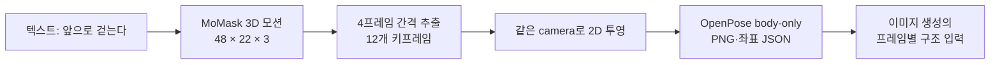

# P7-5.15 텍스트 모션으로 12개 OpenPose 키프레임 준비하기

> Section ID: `P7-5.15`
> Version: `v2026.09.20`

정지 pose 한 장은 현재 P7-5.3의 OpenPose 구조 입력으로 만들 수 있다. 걷기처럼 시간에 따라 팔·다리·골반의 관계가 바뀌는 동작은 pose 이미지 12장을 각각 따로 생성하면 접지와 이동 순서가 쉽게 끊긴다. 이 절은 **텍스트에서 먼저 3D 관절 모션을 만들고, 그 시퀀스에서 12개 2D OpenPose 키프레임을 뽑기 위한 실험 조건**을 준비한다. 기존 MoMask 준비 조건에 더해, 측면 걷기와 달리기의 실패 관찰을 바탕으로 텍스트·캐릭터 참조 이미지에서 모션 프레임을 만드는 대안을 조사한다. 조사 당시 MoMask와 Kimodo는 모두 미실험군이었다. 2026년 9월 19일에는 MoMask의 걷기·달리기를 처음 실행했다. 가중치 사전 다운로드와 실제 추론·검수 결과는 구분한다.

## 1. 키프레임은 완성 이미지가 아니라 시간 순서가 있는 구조 입력이다

이 실험의 첫 출력은 사람이 그려진 PNG가 아니라 프레임마다 관절 좌표가 있는 모션 배열이다. MoMask는 텍스트와 모션 길이를 `설명#포즈 수` 형식으로 받아, 생성 모션을 `(프레임 수, 22, 3)` 관절 배열과 stick-figure/BVH 결과로 저장한다. 따라서 생성된 3D 관절을 같은 camera로 2D에 투영한 뒤에만 각 프레임을 OpenPose guide로 쓸 수 있다. [MoMask 공식 구현](https://github.com/centersymmetry/momask){: target="_blank" rel="noopener noreferrer"}



OpenPose는 이 경로에서 동작을 새로 만드는 모델이 아니다. 프레임별 `pose_keypoints_2d`를 JSON으로 기록하고 body·face·hand를 각각 분리할 수 있는 2D 키포인트 형식으로 쓴다. 첫 실험은 동작·카메라 검수를 분리하기 위해 body-only를 사용한다. [OpenPose JSON 출력 형식](https://github.com/CMU-Perceptual-Computing-Lab/openpose/blob/master/doc/02_output.md){: target="_blank" rel="noopener noreferrer"}

## 2. 8GB GPU에서는 작은 모션 경로부터 확인한다

| 후보 | 이 실험에서 보는 기능 | 8GB에서의 처리 |
| --- | --- | --- |
| MoMask | 텍스트와 포즈 수로 3D 관절 모션 생성 | 기존 계획의 batch 1·48포즈 조건. 최초 실행 결과는 아래 8절에 기록 |
| MDM 50-step | text-to-motion의 비교 기준, in-between 편집 | MoMask가 실행 또는 길이 제어에서 막힐 때의 비교 후보 |
| LLaMA 기반 MotionGPT | text·초기 pose·key pose 조건을 포함한 모션 생성 | 별도 대형 언어 모델 가중치가 필요하므로 8GB 첫 실험에서는 제외 |

MoMask 공개 문서는 길이를 포즈 수로 지정하고 4의 배수로 맞추며, `12` 같은 짧은 길이도 받을 수 있다고 설명한다. 하지만 최소 VRAM 수치는 공개하지 않는다. 따라서 이 절은 “8GB에서 동작한다”는 결론을 미리 쓰지 않고, **batch 1의 짧은 단일 시퀀스가 실제로 생성되는가**를 첫 확인 항목으로 둔다. [MoMask 실행 안내](https://github.com/centersymmetry/momask/blob/main/README.md){: target="_blank" rel="noopener noreferrer"}

MDM은 단일 CUDA GPU 환경을 전제로 하며, 50-step 모델과 `motion_length` 제어를 제공한다. 다만 출력 길이가 초 단위이므로 정확히 12포즈를 요청하는 첫 비교에는 MoMask보다 한 단계 뒤에 둔다. [MDM 공식 구현](https://github.com/GuyTevet/motion-diffusion-model){: target="_blank" rel="noopener noreferrer"}

LLaMA 기반 MotionGPT 구현은 별도 LLaMA 가중치 준비를 요구한다. 이는 key pose 조건을 다루는 후속 후보로는 유용하지만, 8GB에서 “짧은 보행 시퀀스가 나오는가”만 먼저 확인하는 이 실험의 첫 설치 대상으로 늘리지 않는다. [MotionGPT 구현의 가중치 준비 안내](https://github.com/qiqiApink/MotionGPT){: target="_blank" rel="noopener noreferrer"}

## 3. 걷기는 48포즈를 만들고 12장을 뽑는다

MoMask의 예시 기준 모션은 20fps다. 12포즈를 직접 생성하면 약 0.6초여서 한 보행 주기의 발 접지·체중 이동을 읽기에는 짧을 수 있다. 이번 준비에서는 먼저 48포즈를 생성하고 네 프레임마다 하나를 뽑는다. 이렇게 하면 약 2.4초의 원 모션에서 12개의 균등한 구조 키프레임을 얻는다.

| 항목 | 고정 값 | 이유 |
| --- | --- | --- |
| 텍스트 입력 | `A person walks forward#48` | 텍스트와 길이를 한 파일에 고정 |
| 원 모션 | 48 poses, 20fps | 보행의 시간 흐름을 남김 |
| 키프레임 | 12장 | 이미지 생성에 전달할 구조 수 |
| 추출 인덱스 | `0, 4, 8, …, 44` | 시작·끝 규칙이 명시된 균등 추출 |
| 입력 구조 | body-only OpenPose | 얼굴·손 세부가 동작 해석을 덮지 않게 분리 |

12장은 걷기 동작의 완성도나 캐릭터 identity를 보장하지 않는다. 첫 검수에서는 두 발의 접지, 좌우 다리 교대, 팔의 반대 흔들림, 골반의 연속 이동, 프레임 간 갑작스러운 사지 교체만 본다. 캐릭터 얼굴·착장·화풍은 P7-5.1·P7-5.3의 참조가 맡으며, 키프레임 모션이 이 역할을 대체하지 않는다.

## 4. 실행 전에 입력 파일과 샘플링 계획을 고정한다

아래 준비 코드는 가중치·데이터셋을 설치하지 않고 MoMask 입력 파일과 실험 계획 JSON만 `.tmp/`에 만든다. 실제 추론은 다음 단계에서 별도 실행 기록으로 남긴다.

[MoMask 보행 키프레임 준비 코드 보기](/AiBook/assets/part-07/chapter-05/p7_5_15_prepare_momask_walk_keyframes.py)

```bash
.venv/bin/python docs/assets/part-07/chapter-05/p7_5_15_prepare_momask_walk_keyframes.py
```

생성되는 `experiment-plan.json`에는 아직 `prepared_not_run` 상태만 남는다. MoMask 결과의 실제 배열 모양, peak VRAM, 실행 시간, 카메라 투영 규칙, OpenPose 매핑표는 추론이 끝난 뒤에만 result JSON으로 기록한다.

## 5. 측면 보행의 교대와 달리기의 공중 구간을 확인한다

후속 목표는 **동작 텍스트와 캐릭터 참조 이미지로 로컬 GPU에서 연속된 모션 프레임을 만드는 것**이다. 제작 과정에서 사용자가 보고한 기존 산출물에는 측면 걷기에서 팔다리가 교대하며 겹치는 모습을 만들지 못한 사례와, 달리기에서 양발이 동시에 지면을 떠나는 구간을 만들지 못한 사례가 있었다. 이 기록은 사용자 관찰이다. 해당 원본 영상·프레임과 생성 조건을 이번 조사에서 대조하지 않았으므로 특정 모델의 일반적 한계나 실패 원인으로 확정하지 않는다.

| 비교 동작 | 연속 프레임에서 볼 장면 | 구분할 실패 |
| --- | --- | --- |
| 측면 걷기 | 좌우 다리가 번갈아 앞으로 나오고, 겹친 뒤 다시 드러나는 장면 | 다리가 붙음, 좌우가 뒤바뀜, 한쪽 다리만 반복 이동 |
| 측면 달리기 | 지면을 밀고 양발이 공중에 뜬 뒤 한 발로 착지하는 장면 | 의도한 공중 구간 없음, 발 미끄러짐, 착지 순서 불연속 |

여기서 달리기 과제는 양발이 떠오르는 구간이 뚜렷한 동작으로 정한다. 임의의 달리기 영상에 공중 구간이 없다는 이유만으로 모든 경우를 같은 실패로 판정하지 않는다. 발과 지면의 간격, 골반 높이, 지지하는 발의 이동을 함께 본다. 12장 요약은 짧은 교차·공중 구간을 놓칠 수 있으므로 **전체 프레임으로 먼저 검수한 뒤** 비교표를 만든다.

영상의 자연스러운 외관과 인체 동작의 타당성을 나누는 연구도 있다. HumanScore는 관절 운동과 시간적 안정성, 생체역학적 일관성 등을 평가한다. PhyMotion은 영상에서 복원한 3D 신체를 물리 시뮬레이터에 연결해 관절 운동, 접촉·균형, 동역학을 구분한다. 두 연구는 검수 항목을 설계하는 근거이며, 위 실패 사례의 원인을 입증한 자료는 아니다. [HumanScore 연구 페이지](https://cs.stanford.edu/~xtiange/projects/humanscore/){: target="_blank" rel="noopener noreferrer" } · [PhyMotion 연구 페이지](https://phy-motion.github.io/){: target="_blank" rel="noopener noreferrer" }

## 6. 3D 동작 생성과 캐릭터 영상 생성을 연결할 후보

2026년 9월 18일 조사에서는 아래 후보를 추가했다. 앞의 MoMask 준비 코드는 기존 비교 조건으로 보존한다. 조사 당시에는 MoMask를 포함한 후보들이 추론 전이었다. 표의 메모리는 개발자가 공개한 조건이며 최초 로컬 실행 결과는 아래에 별도로 기록한다. 이 저장소의 8GB GPU에서 성공한 실험 결과가 아니다.

| 후보 | 담당 단계와 입력 | 공개 실행 조건과 판단 |
| --- | --- | --- |
| Kimodo | 텍스트·자세 제약 → 3D 관절·발 접촉 정보 | 공식 안내상 텍스트 인코더를 CPU로 옮기면 VRAM 3GB 미만. 동작 생성의 우선 검토 후보 |
| StableAnimator 기본 모델 | 캐릭터 참조 이미지·포즈 시퀀스 → 영상 | 512×512, 16프레임 기본 모델의 8GB 추론 조건 공개. 후속 로컬 실험은 캐릭터·신체 구조 유지 실패로 폐기 |
| FramePack | 시작 이미지·동작 텍스트 → 영상 | 공식 최소 VRAM 6GB, RTX 30·40·50 계열 안내. 중간 포즈 없이 직접 생성하는 비교 후보 |
| DART | 텍스트 타임라인 → 연속 3D 모션 | 공식 실험 환경은 RTX 4090. 8GB 최소 조건은 이번 확인 자료에서 찾지 못함 |
| HY-Motion 1.0 | 텍스트 → 3D 모션 | 공식 최소 VRAM은 기본 26GB·Lite 24GB. 8GB 첫 실행에서는 후순위 |

근거: [Kimodo 공식 구현](https://github.com/nv-tlabs/kimodo){: target="_blank" rel="noopener noreferrer" } · [StableAnimator 공식 구현](https://github.com/Francis-Rings/StableAnimator){: target="_blank" rel="noopener noreferrer" } · [FramePack 공식 구현](https://github.com/lllyasviel/FramePack){: target="_blank" rel="noopener noreferrer" } · [DART 공식 구현](https://github.com/zkf1997/DART){: target="_blank" rel="noopener noreferrer" } · [HY-Motion 공식 구현](https://github.com/Tencent-Hunyuan/HY-Motion-1.0){: target="_blank" rel="noopener noreferrer" }

Kimodo는 프레임별 관절 위치·회전과 좌우 발뒤꿈치·발끝의 접촉 라벨을 출력한다. 접촉 라벨도 모델의 산출물이므로 양발의 라벨이 모두 비접촉인지 확인하는 것만으로 공중 구간을 확정하지 않는다. 지면을 기준으로 발 높이와 움직임도 대조한다. 공식 문서는 모델 자체에서 발 미끄러짐과 제약 오차가 발생할 수 있다고 설명하고 후처리를 권장한다. 따라서 물리적으로 올바른 모션을 보장하는 모델로 소개하지 않는다. [Kimodo 한계와 권장 설정](https://research.nvidia.com/labs/sil/projects/kimodo/docs/key_concepts/limitations.html){: target="_blank" rel="noopener noreferrer" }

StableAnimator의 공개 속도 사례는 RTX 4090에서 512×512·30fps·15초 영상을 약 5분에 생성한 조건이다. 8GB라는 메모리 조건을 같은 실행 속도로 해석하지 않는다. 또 Kimodo 출력을 그대로 받는 연결 기능을 검증한 것은 아니다. 관절 이름·순서를 맞추고, 카메라를 고정하여 포즈 조건 영상을 만드는 변환이 필요하다. 2D 포즈만으로는 겹친 팔다리의 깊이 관계를 충분히 전달하지 못할 수 있으므로, 올바른 3D 동작이 캐릭터 영상에서도 유지되는지 별도로 확인한다.

## 7. 같은 동작을 단계별로 비교한다

초기 조사에서는 **동작 텍스트 → Kimodo 3D 모션 → 고정 측면 포즈 시퀀스 → 참조 이미지와 StableAnimator → 캐릭터 프레임**을 제안했다. 이후 MoMask로 연결한 StableAnimator 실험은 캐릭터·신체 구조 유지 실패로 폐기했으므로 이 경로를 현재 채택한 파이프라인으로 제시하지 않는다. 텍스트는 동작 생성을, 참조 이미지는 캐릭터 외형 조건을 맡는다. FramePack의 이미지·텍스트 직접 생성은 같은 목표 동작을 비교하는 별도 경로로 둔다.

1. 기존 자산 중 얼굴·의상·발이 모두 보이는 캐릭터 전신 참조를 고른다. 측면 걷기와 공중 구간이 뚜렷한 달리기를 각각 짧은 시퀀스로 정하고, 카메라와 바닥이 보이는 구도를 고정한다.
2. 3D 모션에서 좌우 교대와 발 접촉·이탈을 먼저 확인한다. 이 단계에서 실패하면 이미지 생성으로 넘기기 전에 모션 조건을 조정한다.
3. 검수한 모션을 대상 모델의 포즈 형식으로 변환한다. 관절 매핑, 투영 카메라, 프레임률, 캐릭터 비율을 기록하고 바닥 기준과 골반의 상하 이동을 유지한다. 프레임마다 발을 바닥에 다시 맞추는 정규화는 공중 구간을 지울 수 있으므로 피한다.
4. 캐릭터 영상에서 같은 구간을 대조한다. 3D 모션에는 공중 구간이 있는데 출력에는 없다면 포즈 변환·영상 생성 단계에서 어떤 정보가 사라졌는지 조사한다.
5. 전체 프레임 PNG와 원래 프레임 번호·시각, 12장 요약, 실행 조건 JSON을 함께 저장한다. 모델·가중치 버전, seed, 해상도, 프레임 수, 실행 시간, 최대 VRAM과 CPU 오프로딩 여부를 기록한다.

같은 참조와 동작을 사용해도 후보별 지원 프레임 수·해상도가 다르면 그 차이를 남긴다. 판단은 캐릭터 외형 유지, 동작 지시 준수, 측면 교대, 공중 구간, 접지와 실행 비용으로 나눈다. 한 번의 성공으로 일반 성능을 결론내리지 않는다. 다음은 이 계획으로 시작한 최초 실행 기록이다.

## 8. 첫 실험의 관찰과 폐기 결정

2026년 9월 19일 로컬 RTX 5070 Laptop GPU에서 MoMask와 StableAnimator의 연결 실행을 탐색했다. MoMask v1은 48프레임 기본 걷기·달리기 조건, v2는 96프레임 평지 지속 동작 조건이었다. v1에서 v2로 갈 때 길이와 프롬프트를 함께 바꾸었으므로 두 요인의 효과를 분리할 수 없었다. v3에서는 v2의 96프레임·세 시드·모델 설정을 유지하고 걷기 프롬프트만 바꿨다.

| 실험 | 당시 관찰 | 현재 결정 |
| --- | --- | --- |
| MoMask v1 | 달리기에서 몸 전체가 떠 있다가 내려옴 | 앞서 폐기 |
| MoMask v2 | 걷기는 지면 위에서 시작해 하강. 달리기는 일부 움직이는 구간을 확보 | 실험 묶음 폐기 |
| MoMask v3 | 걷기의 부유·하강은 줄었으나 제자리 걷기로 나타남 | 실험 묶음 폐기 |
| StableAnimator | 참조 캐릭터의 의상·신체 구조를 유지하지 못하고 달리기 후반 하반신 소실 | 연결 실험 묶음 폐기 |

사용자는 로컬 연결 실행과 개선 지점을 확인한 점에서는 의미를 인정했지만, 최종적으로 두 실험 묶음을 실패로 폐기하도록 지시했다. 이에 MoMask v3와 기존 MoMask·StableAnimator 묶음의 산출물·실행 코드·JSON을 삭제했다. 현재 재사용할 기준 동작이나 성공 사례로 제시하지 않는다. 위 표는 삭제 전 관찰을 요약한 이력이며 활성 결과 자산을 가리키지 않는다.

후속 구도 비교에서는 동일 모션을 중앙 1배·2배로 표시하는 입력 포즈를 준비했다. 사용자는 비연속 비교판에서 의심했던 발 교대 문제가 연속 영상에서는 관측되지 않는다고 평가했다. 그러나 이번 폐기로 원 모션·참조·실행 기준이 사라졌으므로 **후속 영상 추론도 진행할 수 없는 상태**다. 이후 사용자 지시로 이 StableAnimator v2 준비 폴더도 폐기·삭제했다. 새 실험에는 MoMask v4의 전진 모션을 사용한다.

이번 탐색은 동작 생성, 화면 투영, 캐릭터 유지의 판단을 분리해야 함을 보여준다. 화면의 앞뒤 여백은 생성된 관절 범위에 맞춘 출력 구도이며 모델에 부여한 이동 공간이 아니다. 제자리 걷기와 전진 보행을 구분하고, 캐릭터가 무너진 결과를 다리가 움직인다는 이유만으로 성공 처리하지 않는다. 후속 실험에서는 한 번에 하나의 조건을 바꾸고 연속 모션과 전신 유지 여부를 먼저 확인해야 한다.

## 9. 새 MoMask v4에서 실제 전진을 확인한다

폐기된 산출물과 별개로 새 실험 v4를 실행했다. 두 프롬프트에서 96프레임·20fps·세 시드와 생성 설정을 고정하고 텍스트만 바꿨다. 짧은 조건은 `A person walks in a straight line across the room.`이고, 다른 조건은 여기에 바닥에서 양발로 시작해 계속 앞으로 이동한다는 설명을 덧붙였다. 발 높이를 보정하거나 인위적인 전진 속도를 더하지 않았다.

짧은 조건의 세 결과는 추정 바닥 근처에서 시작해 약 **2.55~3.02m 전진**했다. 양발이 추정 바닥보다 4cm 높은 프레임은 없었다. 설명을 덧붙인 조건은 수평 순이동이 약 2.7~10.8cm에 그쳐 다시 제자리 걷기에 가까웠다. 이는 이번 두 프롬프트의 관찰이며 특정 표현의 보편적인 효과를 입증하지 않는다.

이번에는 모든 결과의 측면 화면 범위를 동일하게 고정했다. 원 특징의 루트 속도·회전을 별도로 적분해 관절 복원 결과와 일치하는지도 확인했다. 따라서 화면 공간 차이와 실제 이동을 구분할 수 있다. 다만 내부 수치 일치는 동작의 물리적 타당성을 보장하지 않는다.

전진 결과도 첫 약 1.2초는 정지하고 후반에 멈춘다. 이동 중 바닥 근처에 있는 발끝의 수평 속도 중앙값은 약 0.079~0.127m/s였다. 실제 접촉 대신 높이로 구간을 고른 대리지표이므로 정확한 미끄러짐 측정이나 정상 접지 판정으로 사용하지 않는다. **초기 부유와 전진량에서는 개선된 후보를 얻었지만, 완전한 지속 보행이나 캐릭터 유지 성공으로 판정하지 않는다.**

[MoMask v4 결과 요약](../../../assets/part-07/chapter-05/sec-15/2026-09-19-momask-v4/README.md){ .aibook-markdown-preview }

삭제 전 전체 576프레임의 수치를 분석하고 여섯 결과의 12장 요약을 육안 확인했다. 2026년 9월 20일 사용자 지시에 따라 원 모션 배열·영상·PNG·상세 실행 자료를 폐기하고 위 결과를 요약으로 남겼다. 후속 캐릭터 실험에 사용한 포즈·마스크는 현재 실험의 입력으로 보존한다. 이번 실행에서는 StableAnimator를 사용하지 않았고 과거 폐기 결정을 되돌리지 않았다.

## 10. 캐릭터·팔다리 유지에 실패한 StableAnimator v4

StableAnimator v3에서는 가로 이동이 전달됐지만 머리와 재킷이 바뀌고 첫 프레임 잔상이 남았다. 사용자 지시로 v3 산출물과 실행 폴더를 폐기했다. v4에서는 MoMask v4의 동일한 전진 구간 28~59번을 사용하고 참조의 크기·위치를 첫 입력 포즈에 맞췄다. 기존 sec-03 정면 참조와 오른쪽을 향한 측면 참조를 재사용해 두 조건을 구성했다.

두 조건 모두 같은 512×512·32프레임 포즈와 시드, 고정 카메라를 사용한다. 참조의 인물 영역을 같은 목표 높이로 맞추고 시작 골반 위치에 배치했다. 이 정렬은 외곽 영역을 이용한 근사이며 정확한 관절별 체형 변환은 아니다. 참조가 달라 생기는 화풍·세부 외형 차이도 있으므로 순수한 시점 효과만을 분리한 실험으로 해석하지 않는다.

실제 준비된 입력에서 얼굴 검출과 임베딩 추출을 먼저 확인했다. 정면·측면 모두 얼굴이 검출됐고 영벡터 대체 경로를 사용하지 않았다. 검출 점수는 각각 약 0.852·0.752였으며, 이는 얼굴의 동일성을 판정하는 점수가 아니다. 얼굴 조건이 전달된다는 사실과 옷·머리까지 유지된다는 판단을 구분한다.

두 조건의 각 32프레임을 생성한 결과, 정면 참조에서는 첫 프레임의 얼굴·머리 변형과 분리 파편이 남았고 후반에는 머리가 길어지고 소매가 바뀌었다. 측면 참조는 초반 짧은 머리 형태가 더 가깝고 큰 분리 파편이 덜 보였지만, 후반의 머리 길이와 소매 변화까지 막지는 못했다. **초반 부분 개선과 별개로 두 조건 모두 전체 캐릭터 유지에는 실패했다.** 가로 이동과 전신은 마지막까지 남았다.

전체 64프레임 검수판과 선택 프레임의 나란한 비교를 확인했다. 정면·측면 실행은 각각 약 267.15초·262.01초였고 최대 PyTorch 할당은 약 5.48GiB였다. 한 캐릭터·시드 하나의 비교이며 정확한 얼굴 동일성이나 생체역학적 타당성을 검증한 것은 아니다. 현재 body-only 포즈에는 얼굴·손 상세 관절이 없으며, 그 보강이나 외형 조건 강화의 효과는 별도 실험에서 확인해야 한다.

사용자는 캐릭터로 렌더링될 때 팔이 바뀌고 뭉개지는 현상도 지적했다. 10~21번 연속 프레임에서 입력과 출력의 팔 영역을 대조하면 겹침 구간의 손·전완 윤곽 구분이 어렵고 소매 형태도 변한다. 정확한 해부학적 좌우 전환 시점은 출력만으로 확정하지 않았지만, 팔다리 대응과 구조 연속성을 별도 실패 항목으로 기록한다. 얼굴 참조 개선이 팔의 가림 전후 대응까지 해결하는 것은 아니다. 원 3D의 깊이 관계를 버리는 측면 투영이 원인 후보인지 확인하려면 좌우 팔을 추적한 추가 검수가 필요하다.

2026년 9월 19일 사용자 판단에 따라 **StableAnimator v4를 캐릭터 외형·팔다리 구조 유지 실패로 폐기했다.** 정면·측면 생성 결과와 입력 사본·비교 자료·실행 코드·JSON을 삭제했으며, 위 내용은 삭제 전 실험 이력이다. 기존 StableAnimator v1~v3의 폐기도 유지한다. MoMask v4와 공용 참조 원본, 모델 가중치는 보존한다. 깊이·가림 정보 부족은 원인 후보이며, 이 실험만으로 StableAnimator가 모든 조건에서 깊이 문제를 해결할 수 없다고 단정하지 않는다.

## 11. 전신 참조에 근접 참조를 더해도 동작과 디테일은 따로 평가한다

캐릭터 영상에서는 걷는 동작을 알아볼 수 있는 것과 얼굴·손·옷의 세부 표현을 사용할 수 있는 것이 다르다. StableAnimator 이후 실행한 SCAIL-2의 704×704 전신 참조 결과에 대해 사용자는 동작을 확인할 수 있는 정도라고 평가했다. 이 결과를 당시 비교 기준으로 사용했다. 현재는 아래 요약만 남기고 결과 파일을 폐기했다. 이어 SeedVR2로 영상을 복원했지만 사용자 평가는 디테일 개선 없음이었고 인물 뒤에 복제 잔상도 추가됐다. 복원 실험은 결과 요약만 남기고 폐기했다. 출력 픽셀 수가 늘거나 선이 강조되는 것만으로 세부 정보가 개선됐다고 판단하지 않는다.

현재 보존하는 캐릭터 영상은 전신·근접 참조 실험 하나다. 나머지 실험의 결론은 다음처럼 정리하고 영상·프레임·비교 자료를 삭제했다. 과거 결과가 포함된 비교판도 삭제했으므로 아래 평가는 삭제 전 기록이며 직접 재검수할 수 없다. 폐기는 모든 실험을 실패로 재분류한다는 뜻이 아니다.

| 실험 | 확인한 내용 | 남은 한계·판정 |
| --- | --- | --- |
| MoMask v4 | 짧은 지시의 세 시드에서 2.55~3.02m 전진. 상세 지시는 제자리 걷기에 가까움 | 시작·종료 정지와 발 미끄러짐 대리지표의 한계. 모션·시각 결과는 요약 후 폐기 |
| SCAIL Preview 512p | 참조 조건을 CFG 양쪽에 동일하게 전달한 수정에서 안개 같은 흐림이 줄었다는 사용자 평가 | 얼굴·머리 변화와 손발 디테일 부족으로 미채택 |
| SCAIL-2 기본 512p | 화면을 가로지르는 걷기와 큰 의상 특징 관측 | 얼굴·머리·셔츠 변화, 손·신발 경계의 부드러움이 남아 미채택 |
| SCAIL-2 DPO 512p | 같은 입력에 DPO 강도 1.0 적용, 걷기와 큰 의상 특징 유지 | DPO만으로 개별 프레임 품질 해결을 확인하지 못함 |
| SCAIL-2 DPO 704p | 생성 해상도를 높인 결과에 사용자가 품질 향상을 평가 | 아직 사용할 수준은 아니라는 평가. 얼굴·손·신발 세부 표현 부족 |
| SCAIL-2 원본 기반 전신 참조 704p | 원본에서 참조를 직접 구성. 사용자가 동작을 확인할 수 있다고 평가 | 최종 외형 품질·정확한 손발 대응 승인과 구분 |
| SeedVR2 1024p 복원 | 전신 참조 결과를 후처리 | 사용자 평가상 디테일 개선 없음. 복제 잔상 추가로 미채택 |

다음 실험에서는 생성 모델에 보여 주는 참조 정보를 바꿨다. 기존 전신 참조에서는 인물이 화면의 작은 부분을 차지해 얼굴과 손도 작게 전달된다. 같은 캐릭터 원본에서 얼굴·상반신·손이 포함된 영역을 별도로 잘라 두 번째 참조로 추가했다. 작은 전신 이미지를 확대하는 대신 960×1440 원본의 704×704 영역을 크기 변경 없이 사용했다. 두 참조의 인물 영역에는 같은 식별 색을 지정해 같은 사람의 외형 정보로 전달했다. 여기서 마스크는 어느 영역이 같은 인물인지 알려 주는 입력이지, 얼굴 동일성을 보장하는 장치가 아니다.

| 항목 | 전신 참조 기준 | 전신 + 근접 참조 실험 |
| --- | --- | --- |
| 참조 이미지 | 원본에서 직접 구성한 전신 이미지 1장 | 기존 전신 이미지와 같은 원본의 근접 크롭 1장 |
| 인물 마스크 | 전신 참조의 인물 영역 | 전신 마스크 유지, 근접 참조에 같은 식별 색의 마스크 추가 |
| 모션·출력 | MoMask v4 전진 구간, 704×704·33프레임·20fps | 동일 |
| 생성 조건 | SCAIL-2 Q4 양자화, DPO 어댑터 강도 1.0, 40단계, CFG 5, shift 3 | 동일 |
| 난수·텍스트 조건 | 시드 23123134, 저장된 텍스트 임베딩 | 동일 |

DPO 어댑터는 모델에 추가로 적용하는 가중치이며 두 조건에서 같은 강도로 유지했다. 따라서 이번 비교의 변경점은 근접 참조와 그 인물 마스크 추가다. 원문 프롬프트는 복원되지 않아 저장된 텍스트 임베딩의 해시로 동일 조건을 확인했다. 이 제약까지 포함한 실행 조건은 [실험 기록](../../../assets/part-07/chapter-05/sec-15/2026-09-20-scail2-multiref-v1/README.md){ .aibook-markdown-preview }에 남겼다.

RTX 5070 Laptop 8GB에서 33프레임 생성과 저장까지 약 **79.8분**이 걸렸다. 최대 PyTorch 할당 메모리는 약 4.44GiB, 예약 메모리는 약 5.68GiB였다. 이는 이 실행의 측정값이며 필요한 전체 GPU 메모리나 다른 장비의 속도를 보장하는 수치가 아니다. 저장된 PNG 33장의 해시·크기와 20fps 영상의 프레임 수를 확인했다.


위 그림은 현재 보존한 전신·근접 참조 결과만 같은 표시 크기로 배치한 것이다. 기존 전신 참조와의 동일 프레임 비교는 삭제 전에 수행했다. 다섯 표본에서는 인물의 가로 이동과 짧은 머리·흰 상의·짙은 바지의 큰 특징이 유지된다. 다만 016번을 원본 크기로 확인하면 얼굴과 손의 세부 표현은 여전히 흐리고 신발 경계도 부드럽다. **이번 결과를 원고에 보존하되, 근접 참조만으로 디테일이나 캐릭터 동일성이 개선됐다고 확정하지 않는다.** 표본 비교는 전체 영상의 깜박임, 정확한 손발 교대, 모든 프레임의 품질을 보증하지 않는다.

[전신 + 근접 참조 결과 영상](../../../assets/part-07/chapter-05/sec-15/2026-09-20-scail2-multiref-v1/multiref-dpo-q4-704/animation.mp4)

이 실험은 모션 배열, 포즈 영상, 캐릭터 영상, 개별 프레임을 각각 확인해야 하는 이유를 보여 준다. 더 큰 참조를 전달해도 출력 화면 속 인물 크기는 그대로이며 현재 동작 입력에는 손가락 제어가 없다. 동작을 읽을 수 있다는 평가와 세부 표현을 제작에 사용할 수 있다는 평가는 계속 분리한다.

## 체크리스트

- 텍스트 모션 모델의 3D 관절 시퀀스와 OpenPose의 2D 구조 guide를 서로 다른 단계로 구분했는가?
- 12포즈를 직접 생성하는 대신 48포즈에서 12장을 추출하는 이유를 설명할 수 있는가?
- 8GB 조건에서 아직 확인하지 않은 최소 VRAM·실행 시간·출력 품질을 결론처럼 쓰지 않았는가?
- 첫 실행의 batch, 프레임 수, seed, 모델·가중치 버전, peak VRAM을 result JSON에 남길 준비가 되었는가?
- body-only 키프레임이 얼굴 identity·착장·화풍의 기준을 대체하지 않는가?
- 근접 참조 추가나 복원 후처리의 효과를 동작 식별, 얼굴·손 디테일, 시간축 일관성으로 나누어 비교했는가?

- 사용자 관찰, 공식 구현의 공개 조건, 이 저장소에서 검증한 결과를 구분했는가?
- 측면 교대와 달리기의 공중 구간을 3D 모션·포즈 변환·캐릭터 영상에서 각각 확인할 수 있는가?
- 12장 요약 전에 전체 프레임의 접촉·가림 구간을 검수하도록 계획했는가?

## 출처와 참고 자료

- centersymmetry, [MoMask 공식 구현](https://github.com/centersymmetry/momask){: target="_blank" rel="noopener noreferrer" }, GitHub, 확인일: 2026-08-27.
- Guy Tevet et al., [MDM: Human Motion Diffusion Model 공식 구현](https://github.com/GuyTevet/motion-diffusion-model){: target="_blank" rel="noopener noreferrer" }, GitHub, 확인일: 2026-08-27.
- Zhang et al., [MotionGPT 구현](https://github.com/qiqiApink/MotionGPT){: target="_blank" rel="noopener noreferrer" }, GitHub, 확인일: 2026-08-27.
- CMU Perceptual Computing Lab, [OpenPose JSON output](https://github.com/CMU-Perceptual-Computing-Lab/openpose/blob/master/doc/02_output.md){: target="_blank" rel="noopener noreferrer" }, GitHub, 확인일: 2026-08-27.
- NVIDIA, [Kimodo 공식 구현](https://github.com/nv-tlabs/kimodo){: target="_blank" rel="noopener noreferrer" }, 확인일: 2026-09-18.
- NVIDIA, [Kimodo Best Practices](https://research.nvidia.com/labs/sil/projects/kimodo/docs/key_concepts/limitations.html){: target="_blank" rel="noopener noreferrer" }, 확인일: 2026-09-18.
- Shuyuan Tu et al., [StableAnimator 공식 구현](https://github.com/Francis-Rings/StableAnimator){: target="_blank" rel="noopener noreferrer" }, 확인일: 2026-09-18.
- lllyasviel, [FramePack 공식 구현](https://github.com/lllyasviel/FramePack){: target="_blank" rel="noopener noreferrer" }, 확인일: 2026-09-18.
- Kaifeng Zhao et al., [DartControl 공식 구현](https://github.com/zkf1997/DART){: target="_blank" rel="noopener noreferrer" }, 확인일: 2026-09-18.
- Tencent Hunyuan, [HY-Motion 1.0 공식 구현](https://github.com/Tencent-Hunyuan/HY-Motion-1.0){: target="_blank" rel="noopener noreferrer" }, 확인일: 2026-09-18.
- Yusu Fang et al., [HumanScore: Benchmarking Human Motions in Generated Videos](https://cs.stanford.edu/~xtiange/projects/humanscore/){: target="_blank" rel="noopener noreferrer" }, 확인일: 2026-09-18.
- Yidong Huang et al., [PhyMotion: Structured 3D Motion Reward for Physics-Grounded Human Video Generation](https://phy-motion.github.io/){: target="_blank" rel="noopener noreferrer" }, 확인일: 2026-09-18.
