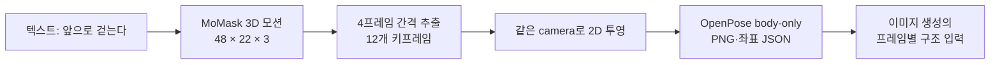

# P7-5.15 텍스트 모션으로 12개 OpenPose 키프레임 준비하기

> Section ID: `P7-5.15`
> Version: `v2026.09.19`

정지 pose 한 장은 현재 P7-5.3의 OpenPose 구조 입력으로 만들 수 있다. 걷기처럼 시간에 따라 팔·다리·골반의 관계가 바뀌는 동작은 pose 이미지 12장을 각각 따로 생성하면 접지와 이동 순서가 쉽게 끊긴다. 이 절은 **텍스트에서 먼저 3D 관절 모션을 만들고, 그 시퀀스에서 12개 2D OpenPose 키프레임을 뽑기 위한 실험 조건**을 준비한다. 기존 MoMask 준비 조건에 더해, 측면 걷기와 달리기의 실패 관찰을 바탕으로 텍스트·캐릭터 참조 이미지에서 모션 프레임을 만드는 대안을 조사한다. 조사 당시 MoMask와 Kimodo는 모두 미실험군이었다. 2026년 9월 19일에는 MoMask의 걷기·달리기를 처음 실행했다. 가중치 사전 다운로드와 실제 추론·검수 결과는 구분한다.

## 1. 키프레임은 완성 이미지가 아니라 시간 순서가 있는 구조 입력이다

이 실험의 첫 출력은 사람이 그려진 PNG가 아니라 프레임마다 관절 좌표가 있는 모션 배열이다. MoMask는 텍스트와 모션 길이를 `설명#포즈 수` 형식으로 받아, 생성 모션을 `(프레임 수, 22, 3)` 관절 배열과 stick-figure/BVH 결과로 저장한다. 따라서 생성된 3D 관절을 같은 camera로 2D에 투영한 뒤에만 각 프레임을 OpenPose guide로 쓸 수 있다. [MoMask 공식 구현](https://github.com/centersymmetry/momask){: target="_blank" rel="noopener noreferrer"}



OpenPose는 이 경로에서 동작을 새로 만드는 모델이 아니다. 프레임별 `pose_keypoints_2d`를 JSON으로 기록하고 body·face·hand를 각각 분리할 수 있는 2D 키포인트 형식으로 쓴다. 첫 실험은 동작·카메라 검수를 분리하기 위해 body-only를 사용한다. [OpenPose JSON 출력 형식](https://github.com/CMU-Perceptual-Computing-Lab/openpose/blob/master/doc/02_output.md){: target="_blank" rel="noopener noreferrer"}

## 2. 8GB GPU에서는 작은 모션 경로부터 확인한다

| 후보 | 이 실험에서 보는 기능 | 8GB에서의 처리 |
| --- | --- | --- |
| MoMask | 텍스트와 포즈 수로 3D 관절 모션 생성 | 기존 계획의 batch 1·48포즈 조건. 최초 실행 결과는 아래 8절에 기록 |
| MDM 50-step | text-to-motion의 비교 기준, in-between 편집 | MoMask가 실행 또는 길이 제어에서 막힐 때의 비교 후보 |
| LLaMA 기반 MotionGPT | text·초기 pose·key pose 조건을 포함한 모션 생성 | 별도 대형 언어 모델 가중치가 필요하므로 8GB 첫 실험에서는 제외 |

MoMask 공개 문서는 길이를 포즈 수로 지정하고 4의 배수로 맞추며, `12` 같은 짧은 길이도 받을 수 있다고 설명한다. 하지만 최소 VRAM 수치는 공개하지 않는다. 따라서 이 절은 “8GB에서 동작한다”는 결론을 미리 쓰지 않고, **batch 1의 짧은 단일 시퀀스가 실제로 생성되는가**를 첫 확인 항목으로 둔다. [MoMask 실행 안내](https://github.com/centersymmetry/momask/blob/main/README.md){: target="_blank" rel="noopener noreferrer"}

MDM은 단일 CUDA GPU 환경을 전제로 하며, 50-step 모델과 `motion_length` 제어를 제공한다. 다만 출력 길이가 초 단위이므로 정확히 12포즈를 요청하는 첫 비교에는 MoMask보다 한 단계 뒤에 둔다. [MDM 공식 구현](https://github.com/GuyTevet/motion-diffusion-model){: target="_blank" rel="noopener noreferrer"}

LLaMA 기반 MotionGPT 구현은 별도 LLaMA 가중치 준비를 요구한다. 이는 key pose 조건을 다루는 후속 후보로는 유용하지만, 8GB에서 “짧은 보행 시퀀스가 나오는가”만 먼저 확인하는 이 실험의 첫 설치 대상으로 늘리지 않는다. [MotionGPT 구현의 가중치 준비 안내](https://github.com/qiqiApink/MotionGPT){: target="_blank" rel="noopener noreferrer"}

## 3. 걷기는 48포즈를 만들고 12장을 뽑는다

MoMask의 예시 기준 모션은 20fps다. 12포즈를 직접 생성하면 약 0.6초여서 한 보행 주기의 발 접지·체중 이동을 읽기에는 짧을 수 있다. 이번 준비에서는 먼저 48포즈를 생성하고 네 프레임마다 하나를 뽑는다. 이렇게 하면 약 2.4초의 원 모션에서 12개의 균등한 구조 키프레임을 얻는다.

| 항목 | 고정 값 | 이유 |
| --- | --- | --- |
| 텍스트 입력 | `A person walks forward#48` | 텍스트와 길이를 한 파일에 고정 |
| 원 모션 | 48 poses, 20fps | 보행의 시간 흐름을 남김 |
| 키프레임 | 12장 | 이미지 생성에 전달할 구조 수 |
| 추출 인덱스 | `0, 4, 8, …, 44` | 시작·끝 규칙이 명시된 균등 추출 |
| 입력 구조 | body-only OpenPose | 얼굴·손 세부가 동작 해석을 덮지 않게 분리 |

12장은 걷기 동작의 완성도나 캐릭터 identity를 보장하지 않는다. 첫 검수에서는 두 발의 접지, 좌우 다리 교대, 팔의 반대 흔들림, 골반의 연속 이동, 프레임 간 갑작스러운 사지 교체만 본다. 캐릭터 얼굴·착장·화풍은 P7-5.1·P7-5.3의 참조가 맡으며, 키프레임 모션이 이 역할을 대체하지 않는다.

## 4. 실행 전에 입력 파일과 샘플링 계획을 고정한다

아래 준비 코드는 가중치·데이터셋을 설치하지 않고 MoMask 입력 파일과 실험 계획 JSON만 `.tmp/`에 만든다. 실제 추론은 다음 단계에서 별도 실행 기록으로 남긴다.

[MoMask 보행 키프레임 준비 코드 보기](/AiBook/assets/part-07/chapter-05/p7_5_15_prepare_momask_walk_keyframes.py)

```bash
.venv/bin/python docs/assets/part-07/chapter-05/p7_5_15_prepare_momask_walk_keyframes.py
```

생성되는 `experiment-plan.json`에는 아직 `prepared_not_run` 상태만 남는다. MoMask 결과의 실제 배열 모양, peak VRAM, 실행 시간, 카메라 투영 규칙, OpenPose 매핑표는 추론이 끝난 뒤에만 result JSON으로 기록한다.

## 5. 측면 보행의 교대와 달리기의 공중 구간을 확인한다

후속 목표는 **동작 텍스트와 캐릭터 참조 이미지로 로컬 GPU에서 연속된 모션 프레임을 만드는 것**이다. 제작 과정에서 사용자가 보고한 기존 산출물에는 측면 걷기에서 팔다리가 교대하며 겹치는 모습을 만들지 못한 사례와, 달리기에서 양발이 동시에 지면을 떠나는 구간을 만들지 못한 사례가 있었다. 이 기록은 사용자 관찰이다. 해당 원본 영상·프레임과 생성 조건을 이번 조사에서 대조하지 않았으므로 특정 모델의 일반적 한계나 실패 원인으로 확정하지 않는다.

| 비교 동작 | 연속 프레임에서 볼 장면 | 구분할 실패 |
| --- | --- | --- |
| 측면 걷기 | 좌우 다리가 번갈아 앞으로 나오고, 겹친 뒤 다시 드러나는 장면 | 다리가 붙음, 좌우가 뒤바뀜, 한쪽 다리만 반복 이동 |
| 측면 달리기 | 지면을 밀고 양발이 공중에 뜬 뒤 한 발로 착지하는 장면 | 의도한 공중 구간 없음, 발 미끄러짐, 착지 순서 불연속 |

여기서 달리기 과제는 양발이 떠오르는 구간이 뚜렷한 동작으로 정한다. 임의의 달리기 영상에 공중 구간이 없다는 이유만으로 모든 경우를 같은 실패로 판정하지 않는다. 발과 지면의 간격, 골반 높이, 지지하는 발의 이동을 함께 본다. 12장 요약은 짧은 교차·공중 구간을 놓칠 수 있으므로 **전체 프레임으로 먼저 검수한 뒤** 비교표를 만든다.

영상의 자연스러운 외관과 인체 동작의 타당성을 나누는 연구도 있다. HumanScore는 관절 운동과 시간적 안정성, 생체역학적 일관성 등을 평가한다. PhyMotion은 영상에서 복원한 3D 신체를 물리 시뮬레이터에 연결해 관절 운동, 접촉·균형, 동역학을 구분한다. 두 연구는 검수 항목을 설계하는 근거이며, 위 실패 사례의 원인을 입증한 자료는 아니다. [HumanScore 연구 페이지](https://cs.stanford.edu/~xtiange/projects/humanscore/){: target="_blank" rel="noopener noreferrer" } · [PhyMotion 연구 페이지](https://phy-motion.github.io/){: target="_blank" rel="noopener noreferrer" }

## 6. 3D 동작 생성과 캐릭터 영상 생성을 연결할 후보

2026년 9월 18일 조사에서는 아래 후보를 추가했다. 앞의 MoMask 준비 코드는 기존 비교 조건으로 보존한다. 조사 당시에는 MoMask를 포함한 후보들이 추론 전이었다. 표의 메모리는 개발자가 공개한 조건이며 최초 로컬 실행 결과는 아래에 별도로 기록한다. 이 저장소의 8GB GPU에서 성공한 실험 결과가 아니다.

| 후보 | 담당 단계와 입력 | 공개 실행 조건과 판단 |
| --- | --- | --- |
| Kimodo | 텍스트·자세 제약 → 3D 관절·발 접촉 정보 | 공식 안내상 텍스트 인코더를 CPU로 옮기면 VRAM 3GB 미만. 동작 생성의 우선 검토 후보 |
| StableAnimator 기본 모델 | 캐릭터 참조 이미지·포즈 시퀀스 → 영상 | 512×512, 16프레임 기본 모델의 8GB 추론 조건 공개. 캐릭터 영상화 후보 |
| FramePack | 시작 이미지·동작 텍스트 → 영상 | 공식 최소 VRAM 6GB, RTX 30·40·50 계열 안내. 중간 포즈 없이 직접 생성하는 비교 후보 |
| DART | 텍스트 타임라인 → 연속 3D 모션 | 공식 실험 환경은 RTX 4090. 8GB 최소 조건은 이번 확인 자료에서 찾지 못함 |
| HY-Motion 1.0 | 텍스트 → 3D 모션 | 공식 최소 VRAM은 기본 26GB·Lite 24GB. 8GB 첫 실행에서는 후순위 |

근거: [Kimodo 공식 구현](https://github.com/nv-tlabs/kimodo){: target="_blank" rel="noopener noreferrer" } · [StableAnimator 공식 구현](https://github.com/Francis-Rings/StableAnimator){: target="_blank" rel="noopener noreferrer" } · [FramePack 공식 구현](https://github.com/lllyasviel/FramePack){: target="_blank" rel="noopener noreferrer" } · [DART 공식 구현](https://github.com/zkf1997/DART){: target="_blank" rel="noopener noreferrer" } · [HY-Motion 공식 구현](https://github.com/Tencent-Hunyuan/HY-Motion-1.0){: target="_blank" rel="noopener noreferrer" }

Kimodo는 프레임별 관절 위치·회전과 좌우 발뒤꿈치·발끝의 접촉 라벨을 출력한다. 접촉 라벨도 모델의 산출물이므로 양발의 라벨이 모두 비접촉인지 확인하는 것만으로 공중 구간을 확정하지 않는다. 지면을 기준으로 발 높이와 움직임도 대조한다. 공식 문서는 모델 자체에서 발 미끄러짐과 제약 오차가 발생할 수 있다고 설명하고 후처리를 권장한다. 따라서 물리적으로 올바른 모션을 보장하는 모델로 소개하지 않는다. [Kimodo 한계와 권장 설정](https://research.nvidia.com/labs/sil/projects/kimodo/docs/key_concepts/limitations.html){: target="_blank" rel="noopener noreferrer" }

StableAnimator의 공개 속도 사례는 RTX 4090에서 512×512·30fps·15초 영상을 약 5분에 생성한 조건이다. 8GB라는 메모리 조건을 같은 실행 속도로 해석하지 않는다. 또 Kimodo 출력을 그대로 받는 연결 기능을 검증한 것은 아니다. 관절 이름·순서를 맞추고, 카메라를 고정하여 포즈 조건 영상을 만드는 변환이 필요하다. 2D 포즈만으로는 겹친 팔다리의 깊이 관계를 충분히 전달하지 못할 수 있으므로, 올바른 3D 동작이 캐릭터 영상에서도 유지되는지 별도로 확인한다.

## 7. 같은 동작을 단계별로 비교한다

우선 검토할 연결은 **동작 텍스트 → Kimodo 3D 모션 → 고정 측면 포즈 시퀀스 → 참조 이미지와 StableAnimator → 캐릭터 프레임**이다. 이는 조사에 따른 실험 제안이며 완성된 파이프라인이 아니다. 텍스트는 동작 생성을, 참조 이미지는 캐릭터 외형 조건을 맡는다. FramePack의 이미지·텍스트 직접 생성은 같은 목표 동작을 비교하는 별도 경로로 둔다.

1. 기존 자산 중 얼굴·의상·발이 모두 보이는 캐릭터 전신 참조를 고른다. 측면 걷기와 공중 구간이 뚜렷한 달리기를 각각 짧은 시퀀스로 정하고, 카메라와 바닥이 보이는 구도를 고정한다.
2. 3D 모션에서 좌우 교대와 발 접촉·이탈을 먼저 확인한다. 이 단계에서 실패하면 이미지 생성으로 넘기기 전에 모션 조건을 조정한다.
3. 검수한 모션을 대상 모델의 포즈 형식으로 변환한다. 관절 매핑, 투영 카메라, 프레임률, 캐릭터 비율을 기록하고 바닥 기준과 골반의 상하 이동을 유지한다. 프레임마다 발을 바닥에 다시 맞추는 정규화는 공중 구간을 지울 수 있으므로 피한다.
4. 캐릭터 영상에서 같은 구간을 대조한다. 3D 모션에는 공중 구간이 있는데 출력에는 없다면 포즈 변환·영상 생성 단계에서 어떤 정보가 사라졌는지 조사한다.
5. 전체 프레임 PNG와 원래 프레임 번호·시각, 12장 요약, 실행 조건 JSON을 함께 저장한다. 모델·가중치 버전, seed, 해상도, 프레임 수, 실행 시간, 최대 VRAM과 CPU 오프로딩 여부를 기록한다.

같은 참조와 동작을 사용해도 후보별 지원 프레임 수·해상도가 다르면 그 차이를 남긴다. 판단은 캐릭터 외형 유지, 동작 지시 준수, 측면 교대, 공중 구간, 접지와 실행 비용으로 나눈다. 한 번의 성공으로 일반 성능을 결론내리지 않는다. 다음은 이 계획으로 시작한 최초 실행 기록이다.

## 8. MoMask v1 폐기와 v2 보존

2026년 9월 19일 RTX 5070 Laptop GPU(총 8151MiB)에서 MoMask를 두 조건으로 탐색했다. v1은 48프레임 기본 걷기·달리기 지시였고, 달리기에서 몸 전체가 높이 떠 있다가 내려오는 문제가 있었다. 이에 v2에서는 96프레임으로 늘리고 평지에서 꾸준히 움직이도록 지시했다. 길이와 프롬프트를 동시에 바꾸었으므로 결과 차이의 원인을 분리한 검증 실험은 아니다.

사용자는 v1을 실패 실험으로 판단해 폐기를 지시했다. **MoMask v1의 모션 6개와 파생 프레임·영상·JSON, v1 걷기를 입력으로 만든 StableAnimator 산출물을 삭제했다.** v1은 현재 비교 기준이나 후속 입력으로 사용하지 않는다. 폐기 사유만 기록하며, 현재 보존 대상은 v2 모션 6개와 v2에서 파생된 달리기 영상이다.

v2는 batch 1, 20fps, 96프레임, 시드 10107·10108·10109의 걷기·달리기다. 걷기는 초반 긴 정지·부유 뒤 일부 이동이 나타났고, 달리기는 초반 정지 뒤 짧게 움직였다. 달리기의 골반 높이 범위는 약 0.10~0.13m였지만 지속 달리기 지시 충족과 자연스러운 발 교대는 검증되지 않았다. **v2를 보존한다는 결정도 성공 판정을 뜻하지 않는다.**

사용자는 v2 걷기에서도 몸이 지면 위에 형성된 뒤 내려온다고 지적했다. 원 관절을 다시 확인하면 세 시드 모두 첫 프레임의 최저 발 관절이 추정 바닥보다 약 14.6~15.4cm 높고, 마지막에는 바닥 근처까지 내려온다. 골반 높이도 함께 낮아진다. 이는 StableAnimator 이전의 복원된 MoMask 관절 시퀀스에서 확인되는 문제다. 따라서 v2 걷기는 **지면 보행 실패**로 기록하고 정상 동작 기준으로 사용하지 않는다. 모델 생성과 관절 복원·루트 처리 중 정확한 원인은 아직 구분하지 못했으며, 현재 산출물은 실패 증거로 보존한다.

공식 코드의 BVH 변환은 NumPy 비호환으로 제외하고 공식 생성 함수와 원 관절 복원을 사용했다. `np.float` 호환 처리를 적용했으며 IK나 매 프레임 발을 바닥에 붙이는 보정은 하지 않았다. 추정 바닥과 발 관절 높이의 2·4·6cm 기준은 진단용이며 실제 신발 접촉 측정이 아니다.

[보존 자산·실행 코드](../../../assets/part-07/chapter-05/sec-15/2026-09-19-momask-stableanimator-v1/README.md){ .aibook-markdown-preview } · [폐기 기록](../../../assets/part-07/chapter-05/sec-15/2026-09-19-momask-stableanimator-v1/discarded-experiments.json)

## 9. 보존한 달리기 영상에서 확인한 캐릭터 유지 실패

MoMask v2의 run-10109 중 움직이는 36~67번을 골라 StableAnimator에 연결했다. 기존 Mira 전신 참조와 body-only 측면 포즈로 512×512, 32프레임을 생성했다. 25 steps, CFG 3, seed 23123134, tile 16·overlap 4, FP16 GPU 조건이다. CPU 오프로딩은 하지 않았고 얼굴 분석의 ONNX 경로는 CPU로 대체됐다. 실행 시간은 260.24초, 최대 PyTorch 할당은 약 5.51GiB였다.

초반에는 달리기 형태가 나타나지만 후반에는 의상·신체가 변하고 하반신이 사라졌다. 양발 높이가 추정 바닥보다 4cm 높은 원 프레임 44·52·58·59·65·66을 대조하면 입력 포즈에는 다리가 남아 있다. 따라서 캐릭터 영상화 단계의 포즈·외형 유지 실패를 확인할 수 있다. 배경에 바닥 기준이 없어 정확한 공중 구간 보존도 확정하지 못했다.

[달리기 전체 프레임](../../../assets/part-07/chapter-05/sec-15/2026-09-19-momask-stableanimator-v1/stableanimator-run-v1/all-frames.jpg) · [포즈·출력 대조](../../../assets/part-07/chapter-05/sec-15/2026-09-19-momask-stableanimator-v1/stableanimator-run-v1/flight-candidate-comparison.jpg)

사용자는 로컬 연결 실행과 개선 지점을 확보한 점에서는 의미 있는 결과로 평가했지만, 캐릭터가 정상적으로 유지되지 않았다고 지적했다. 실행 가능성과 출력 품질은 별개의 판단이다. 이 기록은 캐릭터 하나·영상 생성 시드 하나의 탐색이며 모델의 일반 성능을 확정하지 않는다. 원 모션도 검수 중이므로 영상화 실패의 유일한 원인을 단정하지 않는다.

현재 산출물은 최초 실험 묶음 경로 `sec-15/2026-09-19-momask-stableanimator-v1/`에 보존한다. 폴더 이름의 `v1`은 묶음 식별자이며 현재 남은 MoMask 조건은 v2다. 공식 모델 fps 조건 7·GIF 재생 8fps와 비교용 MP4 20fps를 구분한다. Kimodo는 기반 Llama 가중치 접근 제한으로 추론하지 못했다.

## 10. 캐릭터 유지를 먼저 확인하는 다음 실험

사용자는 StableAnimator 산출물이 캐릭터를 정상적으로 유지하지 못했다고 지적했다. 다리가 움직인다는 관찰과 참조 캐릭터가 유지된다는 판정은 구분해야 한다. 다음 실험은 얼굴·머리·의상·전신 구조 유지를 1차 기준으로 삼고, 그 뒤에 동작 전달을 살핀다. 신체 소실이나 큰 의상 변화가 있으면 동작이 일부 전달되어도 사용 가능한 캐릭터 영상의 성공으로 판정하지 않는다.

현재 달리기 포즈는 전체 이동을 화면에 넣으면서 인체 높이 범위가 약 165픽셀로 작아졌다. 이 구도가 유지 실패와 관련되는지 알아보기 위해 같은 모션·참조·시드를 사용하는 두 조건을 준비했다. 첫 조건은 크기를 유지하고 골반의 수평 위치만 중앙에 놓는다. 두 번째는 중앙 추적을 유지하면서 크기를 2배로 늘린다. 기존 결과와 첫 조건에서는 이동의 영향을, 두 새 조건 사이에서는 크기의 영향을 비교한다. 수직 이동과 바닥 기준은 보존하며 얼굴 관절이나 타일 길이는 함께 바꾸지 않는다.

[다음 실험 계획·실행 방법](../../../assets/part-07/chapter-05/sec-15/2026-09-19-stableanimator-framing-v2/README.md){ .aibook-markdown-preview } · [입력 포즈 비교](../../../assets/part-07/chapter-05/sec-15/2026-09-19-stableanimator-framing-v2/pose-comparison.jpg)

두 조건의 입력 포즈 64개와 계획 JSON, 실행 코드를 준비했으며 **영상 추론은 아직 실행하지 않았다**. 이후 사용자는 포즈 비교판에서도 발 바뀜이 부자연스럽다고 지적했다. 비연속 6장 대신 연속 32프레임을 확인했으며, 좌우 매핑은 고정되어 있지만 교차의 존재만으로 자연스러운 달리기를 입증할 수 없었다. 발끝이 빠진 body-only 투영의 정보 손실도 남는다. 이후 사용자가 연속 20fps 포즈 영상에서는 앞서 문제로 보였던 현상이 관측되지 않는다고 평가했다. 이에 발 교대 우려에 따른 추론 보류를 해제하고 준비한 구도 비교에 사용할 수 있도록 했다. 이는 달리기의 모든 물리적 타당성이나 캐릭터 유지 성공을 검증한 뜻은 아니며, v2 걷기의 부유·하강 판정에도 영향을 주지 않는다. 기존 참조와 원 모션은 재사용한다. 전체 프레임에서 최초 외형 이탈 시점과 구체적인 변형을 기록하며, 작아서 판단할 수 없는 얼굴을 유지 성공으로 처리하지 않는다. 이 비교에서도 실패한다면 구도만으로 문제가 해결되지 않는다는 근거가 되지만, 모델의 일반적인 성능이나 유일한 실패 원인을 확정하지는 못한다.

## 체크리스트

- 텍스트 모션 모델의 3D 관절 시퀀스와 OpenPose의 2D 구조 guide를 서로 다른 단계로 구분했는가?
- 12포즈를 직접 생성하는 대신 48포즈에서 12장을 추출하는 이유를 설명할 수 있는가?
- 8GB 조건에서 아직 확인하지 않은 최소 VRAM·실행 시간·출력 품질을 결론처럼 쓰지 않았는가?
- 첫 실행의 batch, 프레임 수, seed, 모델·가중치 버전, peak VRAM을 result JSON에 남길 준비가 되었는가?
- body-only 키프레임이 얼굴 identity·착장·화풍의 기준을 대체하지 않는가?

- 사용자 관찰, 공식 구현의 공개 조건, 이 저장소에서 검증한 결과를 구분했는가?
- 측면 교대와 달리기의 공중 구간을 3D 모션·포즈 변환·캐릭터 영상에서 각각 확인할 수 있는가?
- 12장 요약 전에 전체 프레임의 접촉·가림 구간을 검수하도록 계획했는가?

## 출처와 참고 자료

- centersymmetry, [MoMask 공식 구현](https://github.com/centersymmetry/momask){: target="_blank" rel="noopener noreferrer" }, GitHub, 확인일: 2026-08-27.
- Guy Tevet et al., [MDM: Human Motion Diffusion Model 공식 구현](https://github.com/GuyTevet/motion-diffusion-model){: target="_blank" rel="noopener noreferrer" }, GitHub, 확인일: 2026-08-27.
- Zhang et al., [MotionGPT 구현](https://github.com/qiqiApink/MotionGPT){: target="_blank" rel="noopener noreferrer" }, GitHub, 확인일: 2026-08-27.
- CMU Perceptual Computing Lab, [OpenPose JSON output](https://github.com/CMU-Perceptual-Computing-Lab/openpose/blob/master/doc/02_output.md){: target="_blank" rel="noopener noreferrer" }, GitHub, 확인일: 2026-08-27.
- NVIDIA, [Kimodo 공식 구현](https://github.com/nv-tlabs/kimodo){: target="_blank" rel="noopener noreferrer" }, 확인일: 2026-09-18.
- NVIDIA, [Kimodo Best Practices](https://research.nvidia.com/labs/sil/projects/kimodo/docs/key_concepts/limitations.html){: target="_blank" rel="noopener noreferrer" }, 확인일: 2026-09-18.
- Shuyuan Tu et al., [StableAnimator 공식 구현](https://github.com/Francis-Rings/StableAnimator){: target="_blank" rel="noopener noreferrer" }, 확인일: 2026-09-18.
- lllyasviel, [FramePack 공식 구현](https://github.com/lllyasviel/FramePack){: target="_blank" rel="noopener noreferrer" }, 확인일: 2026-09-18.
- Kaifeng Zhao et al., [DartControl 공식 구현](https://github.com/zkf1997/DART){: target="_blank" rel="noopener noreferrer" }, 확인일: 2026-09-18.
- Tencent Hunyuan, [HY-Motion 1.0 공식 구현](https://github.com/Tencent-Hunyuan/HY-Motion-1.0){: target="_blank" rel="noopener noreferrer" }, 확인일: 2026-09-18.
- Yusu Fang et al., [HumanScore: Benchmarking Human Motions in Generated Videos](https://cs.stanford.edu/~xtiange/projects/humanscore/){: target="_blank" rel="noopener noreferrer" }, 확인일: 2026-09-18.
- Yidong Huang et al., [PhyMotion: Structured 3D Motion Reward for Physics-Grounded Human Video Generation](https://phy-motion.github.io/){: target="_blank" rel="noopener noreferrer" }, 확인일: 2026-09-18.
